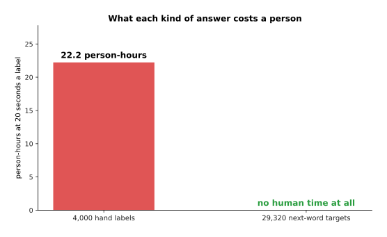
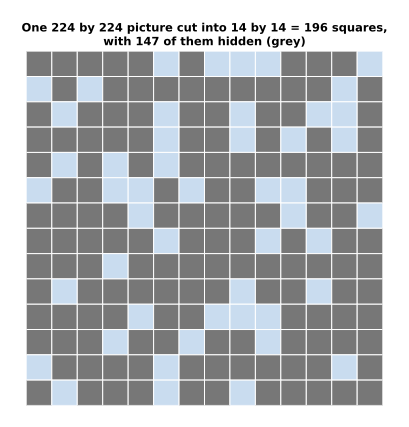
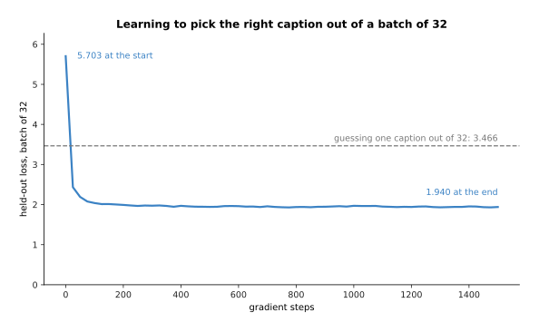
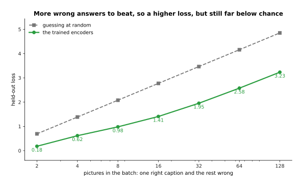
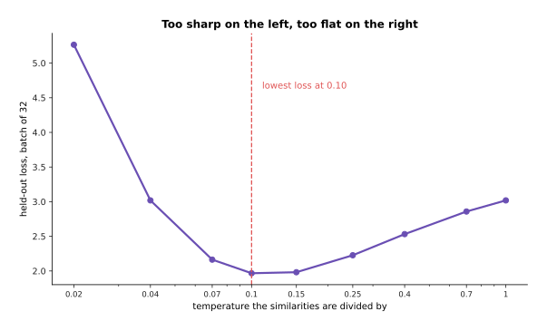
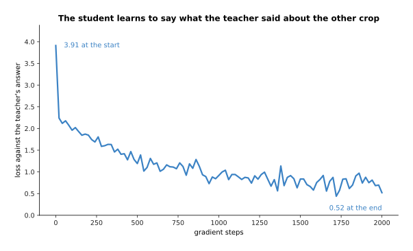
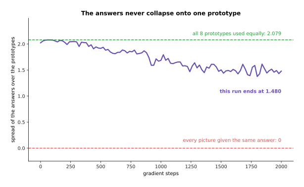
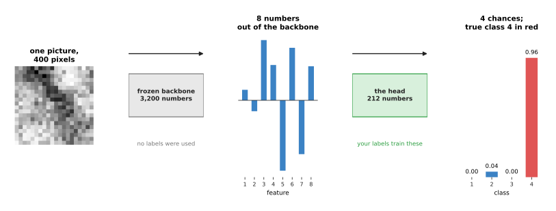
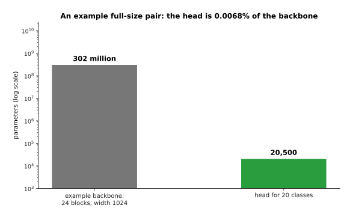

# Self-supervised pretraining

The page before this one, [why the transformer
won](../06_the-transformer/04_why-the-transformer-won.md), ended with a machine
that can read a very long piece of text and let every part of it look at every
other part. That machine needs a very large amount of training data. It needs so
much because it has hundreds of millions or billions of **parameters**, which are
the numbers inside the model that training adjusts. A model with that many numbers
to set needs an enormous number of training examples before it settles on good
values for them.

So a question has been waiting since the start of this book. Training normally
needs a right answer written down beside each example, and that written answer is
called a **label**. If a person has to write a label for every training example,
and writing one takes twenty seconds, where could enough labels possibly come
from?

The answer is that for almost all of the training nobody writes them. Instead the
data is arranged so that it asks the question and holds the answer at the same
time. This is called **self-supervision**, because the training signal is taken
out of the data rather than put there by a person. Training a model this way, on a
very large collection of unlabelled data, before the model is pointed at any one
job, is called **pretraining**. The invented job that the model is trained on is called
a **pretext task**, which means a task nobody actually wants the answer to. Such a
task is chosen because learning to do it forces the model to learn something
worth having.

This page is for a reader who has already met a neuron, a layer, a loss, gradient
descent and the transformer. It also assumes you have seen next-word prediction
once already, on the page about [training and running a
transformer](../06_the-transformer/03_training-and-running-a-transformer.md). By
the end of this page you will understand four families of pretext task, you will
have seen one of them worked out in full with real numbers, and you will know what
you are left with when pretraining finishes.

Every number here comes from a program that really runs, in
`docs/diagrams/pretraining_and_adapting_1.py`. Its sentences are simulated, which
means they are generated from a tiny hand-written grammar rather than collected
from the world. Its pictures are simulated too, built from a few smooth patterns
with random noise added to every pixel. The models fitted to that data are real,
and every loss and accuracy quoted below is measured on data the model was not
fitted to.

## Contents

1. [Where the training signal comes from when nobody writes labels](#1-where-the-training-signal-comes-from-when-nobody-writes-labels)
2. [Next-word prediction, which you have already met](#2-next-word-prediction-which-you-have-already-met)
3. [Masked prediction: hide part of it and fill it in](#3-masked-prediction-hide-part-of-it-and-fill-it-in)
4. [Contrastive learning, worked out with real numbers](#4-contrastive-learning-worked-out-with-real-numbers)
5. [Self-distillation: agreeing with a slower copy of yourself](#5-self-distillation-agreeing-with-a-slower-copy-of-yourself)
6. [What you are left with, and what it is worth](#6-what-you-are-left-with-and-what-it-is-worth)
7. [Where to read next](#7-where-to-read-next)
8. [Using it in Python](#8-using-it-in-python)

---

## 1. Where the training signal comes from when nobody writes labels

The problem is a problem of arithmetic, so the first thing to do is to count.
Suppose you have four thousand short sentences. In the simulated collection of
sentences used here, those four thousand sentences contain 33,320 words in total,
and only 28 different words are ever used. A collection of text like this is
called a **corpus**.

Now suppose a person reads each sentence and writes one answer beside it. That
gives you 4,000 training signals. If writing one answer takes twenty seconds, the
whole job takes 22.2 person-hours, where a person-hour means one person working
for one hour.

Now take the same text and ask a different question of it. At every position in
every sentence, cover the next word, ask the model to guess it, then uncover it
and see whether the guess was right. There are 29,320 places in this corpus where
that can be done. The first chart below compares those two counts, so read it as
one bar for the answers a person writes and one bar for the answers the text
already contains.


The same four thousand sentences give 4,000 answers if a person writes them and
29,320 if the text supplies them, which is 7.3 times as many.

The second chart compares the cost of those same two columns, measured in the time
a person has to spend. Read it as the price of each bar in the chart above.



The hand-written answers cost 22.2 person-hours and the next-word answers cost
nobody any time at all, because each answer was already sitting in the sentence.

The next picture shows where those free answers come from. It takes one sentence
and writes out every training pair it contains. Each row shows the words the model
is allowed to see on the left, and the word it must guess on the right.


One simulated sentence of eight words becomes seven training pairs, and the answer
in each pair was cut out of the sentence itself.

The same counting works for pictures, and for pictures the gap is even larger. A
colour photograph of 224 pixels by 224 pixels holds 150,528 numbers, because each
of the 50,176 positions carries three numbers, one for red, one for green and one
for blue. If a person labels that photograph with the name of the object in it,
the whole picture has bought one training signal.

Now cut the same picture into small squares of 16 pixels by 16 pixels. That gives
a grid of 14 by 14, so 196 squares in all. The next picture shows what happens
when three quarters of those squares are hidden.



Hiding three quarters of the squares hides 147 of them and leaves 49 visible, so
the model has 147 separate things to work out about this one picture.

The chart below counts the three ways of using that same picture. The bars use a
logarithmic scale, which means each step up the axis multiplies the count by ten,
so bars of very different sizes can be shown together.


One picture is worth one hand label, 147 hidden squares to fill in, or 150,528
pixel values, depending on what you ask of it. Nobody wrote any of those 147
answers down.

So the recipe is always the same, and it has two steps. First, hide something the
data already contains. Second, make the model produce the hidden thing from what
is left. What changes between the four families of pretext task is what gets
hidden. Next-word prediction hides the word that comes next. Masked prediction
hides part of a picture or part of a sentence. Contrastive learning hides which
caption belongs to which picture. Self-distillation hides nothing at all, and
instead asks two different views of one object to produce the same answer. The
rest of this page takes those four in order, starting with the one you have
already met.

---

## 2. Next-word prediction, which you have already met

The page on [training and running a
transformer](../06_the-transformer/03_training-and-running-a-transformer.md)
showed next-token prediction as the way a language model is trained. A **token**
is a piece of a word, as [tokens and
embeddings](../05_turning-the-world-into-numbers/01_tokens-and-embeddings.md)
explained. Next-token prediction is one example of the general recipe above. It
was chosen because text is a sequence, so the obvious thing to hide is what comes
next. On this page the tokens are whole words rather than pieces of words, which
keeps the arithmetic small.

The picture below shows one sentence and every job inside it. Each arrow starts at
a position in the sentence and points at the word that the model must name there.


The eight words of one sentence are read as seven jobs at once, because at every
position except the last one the model must name the word that comes next.

Now look at what this job forces the model to learn. The script fits four models
to this corpus by gradient descent and measures each one on sentences it was not
fitted to. The measure used is the loss from [the score of being
wrong](../03_how-training-works/01_the-score-of-being-wrong.md), so a loss of 0
would mean the model gave the right word a probability of 1. Beside each loss the
chart also prints what that loss would mean if the model were simply picking at
random from that many equally likely words, which makes a loss easier to imagine.


Guessing at random gives a loss of 3.332. Knowing only how often each word appears
gives 3.119. Seeing the one word before the gap gives 1.055, and seeing the two
words before gives 0.722.

Those four numbers are why this pretext task is worth anything. Learning only
which words are common saves almost nothing, because the loss moves from 3.332 to
3.119. However, being allowed to look at the word before cuts the loss to 1.055,
and looking at two words cuts it to 0.722. Each of those savings had to be paid
for with real knowledge about the language. The model got that knowledge by being
wrong on 23,488 training pairs and adjusting itself each time.

The next picture opens up two single positions and shows what the model believes
at each of them. Each bar is one word, and the length of the bar is the
probability the model gives that word.


After the word "red" the model spreads its answer across the four objects, giving
"tray" 0.275 and the true word "cube" 0.258. After the word "gripper" it gives
almost everything to "opened" at 0.537 and "closed" at 0.454.

Read those two charts carefully, because they show two different rules that the
model worked out on its own. After a colour word the model has learned that an
object comes next, and it divides its answer between the four objects almost
evenly. It does that because nothing in this corpus says which object is coming. A
model that claimed to know would be wrong three times in four, and the loss would
punish it for that. After "gripper" the model has learned that only two verbs ever
follow. Nobody taught it either rule.

The next picture shows the two best models learning, step by step, over four
thousand gradient steps.


Both models start at the loss of random guessing, 3.332. The one-word model
settles at 1.055 and the two-word model settles at 0.722.

At the scale of a real language model, this same job over a very large amount of
text is what produces a model that can hold a conversation. That happens because
guessing the next word well enough eventually requires knowing what words mean.
The next section takes the same idea to data that is not a sequence.

---

## 3. Masked prediction: hide part of it and fill it in

The method in section 2 needs an order, and a picture has no order. Nothing in a
picture comes first, so covering what comes next does not transfer to pictures at
all. What does transfer is the idea underneath it, which is to hide part of the
input and make the model produce the hidden part from what is left. That idea is
called **masked prediction**. The **mask** is the list of which parts are hidden.

The three panels below show one simulated picture at three stages of the same
process: as it really is, with the hidden squares marked, and as the model sees
it.


Each simulated picture is 400 pixels cut into 100 patches of 2 pixels by 2 pixels.
Half the patches are hidden, so the model sees 200 pixels and must produce the
other 200.

The model fitted here is the plainest one that can do the job. It is a set of
weights that turns the 200 visible pixels into a guess at the 200 hidden ones, and
it was fitted on 12,000 unlabelled pictures. What the model is asked for is the
picture underneath the noise, not the noisy pixels themselves. The reason is that
the noise in this simulated data is independent of everything else, so nobody can
predict it. Measured against the noise-free picture, the fitted model is 0.264 per
pixel out. A model that always answers with the average picture of the training
set is 2.182 per pixel out. So learning the shape of a picture has cut the error
by 88 per cent.

The next picture takes two test pictures the model has never seen and shows each
one three times: as the model sees it, as the model fills it in, and as it really
was.


On both pictures the fill lands close to what was really there, with errors of
0.268 and 0.284 per pixel.

How much you hide decides how hard the job is. To show this, the script refits the
same kind of model on 8,000 pictures at six different mask rates, where the mask
rate is the share of the patches that are hidden.


The error rises from 0.206 per pixel when a fifth of the patches are hidden to
0.743 when nine tenths are hidden, while the average-picture model stays near 2.2
at every rate.

Hiding very little makes the job easy in a way that is useless, because a patch
can be copied from its neighbours without understanding anything about the
picture. That is why real systems for pictures hide most of the image.

Masked prediction works on text as well, and there it differs from next-word
prediction in one way that matters. When a model fills a gap in a sentence, it has
the words on both sides of the gap available. The script fits two models to the
same corpus: one that sees only the word before the gap, and one that sees the
words on both sides. The second model has a held-out loss of 0.492 against the
first model's 1.111.

The next picture takes one sentence with one word hidden and shows what each of
those two models believes. Read the two charts as the same question answered with
less information and with more.


Knowing only that "arm" comes before the gap leaves the model split between
"moved" at 0.516 and "lifted" at 0.477. Knowing that "to" follows the gap settles
it at 0.995 for "moved".

That is the trade. Filling a gap from both sides is a better way to learn what a
word means in its place, which is why models built to understand text are trained
this way. However, it is useless for writing text one word at a time, because when
you are writing there is nothing on the right yet. The next section leaves hidden
parts behind.

---

## 4. Contrastive learning, worked out with real numbers

Both methods so far hide part of one thing. **Contrastive learning** hides
something else: which items belong together. You start with pairs that go
together, such as a photograph and the caption written under it. Then you train
two models at once. One model turns a picture into a short list of numbers, and
the other turns a caption into a short list of numbers. The training makes the two
lists of a matching pair point in the same direction, while the lists of things
that do not belong together point in different directions.

A short list of numbers like that is a **vector**. How much two vectors point the
same way is measured by their **cosine similarity**, which runs from +1 when they
point the same way, through 0 when they are unrelated, to -1 when they point in
opposite directions. Both of those words were explained on [tokens and
embeddings](../05_turning-the-world-into-numbers/01_tokens-and-embeddings.md).

In the simulated data each item has a hidden content vector. The picture side and
the caption side are two noisy views of that content vector, so the only thing the
two sides share is the content. After training, take six items and work out the
similarity of every picture against every caption. The grid below shows those
thirty-six numbers. Read a row as one picture scored against all six captions, and
read the boxed cell on the diagonal as the pair that really belongs together.


The six matching pairs average +0.58 and the thirty non-matching pairs average
-0.05. In every row the largest number is the matching one.

Now comes the important part, which is where the training signal comes from. Take
one row of that grid, the row for picture 3. Its six similarities are -0.287,
+0.056, +0.570, +0.375, +0.301 and +0.199. Divide all six by a small number called
the **temperature**, which is 0.1 here. That gives -2.87, +0.56, +5.70, +3.75,
+3.01 and +1.99. Then push those six numbers through softmax, which is the
function that turns a list of numbers into a list of probabilities that add up to
1. The result is 0.000, 0.005, 0.805, 0.115, 0.055 and 0.020. So the model gives
its own caption a probability of 0.805. The loss for that row is the usual one,
the negative logarithm of 0.805, which is 0.216. Picking at random from six
captions would have given a loss of 1.792.

The picture below shows that row twice: once as the raw similarities, and once as
the probabilities they turn into. Read the left chart as the measurement and the
right chart as the same measurement after dividing by 0.1 and applying softmax.


Picture 3 picks its own caption out of the six and gives it 0.805, so the loss for
that row is 0.216.

This is why the other examples in the batch matter so much. The five other
captions are the wrong answers that the right one has to beat, and they are called
the **negatives**. Nobody wrote those down either, because they are simply whatever
else happened to be in the batch. The whole batch is scored this way twice, once
with each picture choosing a caption and once with each caption choosing a
picture, and the average of the two is what gradient descent is given.

The next picture shows the same six pairs measured before training and after
training. The two grids are the same measurement at two moments, so compare the
boxed diagonal in one with the boxed diagonal in the other.


Before training the matching pairs average -0.01 and the rest average +0.02, so a
matching pair is no more alike than any other pair. After training the matching
pairs average +0.58 and the rest average -0.05.

The chart below shows the loss itself falling as the training runs.



The held-out loss falls from 5.703 before training to 1.940 after it, and guessing
at random from a batch of 32 would give 3.466.

Two choices control this method, and the first is the batch size. The batch size
decides how many wrong answers each right one has to beat, so a bigger batch is a
harder question. The chart below measures the trained model at seven batch sizes
and compares each one with random guessing.



The trained model's loss rises from 0.182 with a batch of 2 to 3.234 with a batch
of 128, while the loss of random guessing rises faster still, from 0.693 to 4.852.

The second choice is the temperature, which decides how sharply small differences
in similarity are treated. A small temperature makes the model commit hard to its
best guess, and a large one makes it spread its answer out. Sweeping the
temperature over nine values gives the curve below.



The lowest held-out loss is 1.967 at a temperature of 0.10. The loss rises to
5.265 at 0.02 and to 3.019 at 1.00, so there is one best value and it is not at
either end.

This is how the CLIP family of models is trained, where CLIP stands for
contrastive language-image pretraining. Those models are trained on a very large
number of pictures together with the text that happened to be beside them on the
web. What this method gives you is worth saying plainly, because a later chapter
depends on it. Pictures and words end up in the same space of vectors. That means
you can name an object the model was never given a label for: you write the name
as a sentence, turn that sentence into a vector, and see which picture it points
at. That is what [open-vocabulary
vision](../09_models-that-see/03_open-vocabulary-vision.md) is built on, and it is
why a robot can be asked for "the blue mug" when nobody has ever trained a
blue-mug detector.

---

## 5. Self-distillation: agreeing with a slower copy of yourself

Contrastive learning needs pairs of two different kinds of thing, such as a
picture and a caption. For pictures alone there are no captions to use.
**Self-distillation** removes that need. It cuts two pieces out of the same
picture, pushes both pieces through the same network, and trains the network so
that what it says about one piece matches what a slower copy of itself says about
the other piece. A piece cut out of a picture is called a **crop**. The slower copy
is called the **teacher**, the network being trained is called the **student**, and
the teacher's weights are the student's weights smoothed over the last hundred
steps or so.

The four panels below show one simulated item. The first two panels are the same
object photographed twice under different lighting, with the crop marked on each.
The third panel shows the two crops on their own, and the fourth shows the part of
the picture that the two photographs have in common.


Each crop is twelve rows of a twenty by twenty picture, and the two crops share
four rows. Across the batch, the part that says what the item is varies by 1.46
per pixel, while the lighting that differs between the two views varies by 2.41
per pixel.

The model's answer is neither a picture nor a word. It is a share given to each of
eight directions called **prototypes**. The prototypes start as random directions
and are learned along with everything else, so the answer says something like
"this crop belongs mostly to prototype 7". The teacher's answer is made sharper
than the student's, by dividing by a smaller temperature. Before that sharpening,
a running average of the teacher's recent scores is subtracted from its scores.

The two charts below show one item. The left chart is the student looking at crop
one, and the right chart is the teacher looking at crop two.


The student puts 0.927 on prototype 7, and the sharper teacher puts almost all of
its answer on the same prototype, so the loss for this item is 0.076.

That subtraction and that sharpening are both necessary. There is an obvious way
to satisfy the rule "agree with yourself", which is to give every picture the same
answer. That failure is called **collapse**. Collapse would make the loss zero
while teaching the model nothing. Subtracting the running average pushes the
teacher away from whichever prototype it has been favouring, and the sharpening
stops the answers from drifting into one flat spread where every prototype gets
the same share.

The chart below measures the loss between the student's answer and the teacher's
answer as the training runs.



The student learns to say what the teacher said, so the loss falls from 3.91 at
the start to 0.52 at the end.

The next chart checks that collapse did not happen. It measures how spread out the
answers are across the eight prototypes, with two reference lines drawn in: a
value of 0 means every picture got the same answer, and 2.079 means all eight
prototypes were used equally.



The answers stay spread out, ending at 1.480, which is far above the 0 that
collapse would give.

The chart below asks the question that actually matters. It takes items the model
never trained on, cuts two crops from each, and counts how often the two crops are
given the same prototype.


On items it never trained on, the two crops are given the same prototype 78.5 per
cent of the time, against 12.5 per cent for guessing one of eight at random.

The point of all this is what happens to the sixteen numbers the network works out
on the way to its answer, because those numbers are the thing worth keeping. The
two charts below count pairs of crops by how similar their sixteen numbers are,
once before training and once after. In each chart, one colour is two crops of the
same item and the other is crops of two different items.


Before training, two crops of one item are no more alike than two crops of
different items, at +0.008 against +0.010. After training they sit at +0.520
against -0.006, so the two groups have separated.

This is how the DINO family of vision models is trained, and the name is short for
self-distillation with no labels. It gives you a network whose output ignores what
differs between two views of one object and keeps what does not differ. That
output is the next section's subject.

---

## 6. What you are left with, and what it is worth

The four methods of sections 2 to 5 all end in the same place, and that place is
not a model that does a job anybody wants. Each one ends with a
**representation**, which is a way of turning a raw input into a shorter list of
numbers that says what is in it. The part of the network that does that turning is
called the **backbone**. The job you actually care about is then done by a
**head**, which is a small network that reads those numbers and gives the answer
you want. When the backbone's weights are left exactly as pretraining made them,
and only the head is trained, the backbone is said to be **frozen**.

The picture below follows one real test picture through both parts, from left to
right, with the numbers this page's demonstration really produces.



The frozen backbone turns 400 pixels into 8 numbers without any label having been
used, and the head turns those 8 numbers into a probability for each of the four
classes, giving 0.96 to the true class.

The chart below counts the numbers in each part. It uses a logarithmic scale,
because the three counts are very different in size.


The frozen backbone holds 3,200 numbers and the head holds 212, against 12,964 for
a network that learns the same job from scratch on the raw pixels. Your labelled
examples only have to fit the 212.

That gap grows much wider at a realistic size. The chart below takes an example
backbone of 24 blocks with a width of 1,024 and puts a head for 20 classes on top
of it.



For that example pair the backbone holds 302 million parameters and the head holds
20,500, which is 0.0068 per cent of the backbone.

The backbone used on this page was fitted on 20,000 unlabelled pairs of views. It
was fitted by the simplest method of the two-crops kind, one that can be worked
out exactly rather than by gradient descent: it keeps the eight directions of the
picture on which two views of one item agree most. Six of those directions agree
across views with a correlation above 0.91, and the seventh drops to 0.277. That
drop is the method finding, without being told, that there are six things worth
knowing about these pictures.

The next picture checks what the kept features actually follow. The simulated
pictures were built from nine known factors: six that decide what the object is,
and three that decide the lighting. Each cell of a grid says how strongly one
learned feature follows one known factor, with 1.00 meaning it follows it exactly.
The two grids are the same measurement applied to two different ways of choosing
features, so compare the left side of each grid with its right side.


Each feature of the two-view backbone follows a content factor at 0.590 on average
and a lighting factor at only 0.037. The eight directions in which the pictures
vary most follow a content factor at 0.583 and a lighting factor at 0.422.

That second grid is a warning. Taking the directions of greatest variation also
uses unlabelled data, and it fails here, because the lighting varies more than the
object does. So what makes a pretext task good is not that it uses unlabelled
data. What makes it good is that the thing it forces the model to keep is the
thing you will later want.

The chart below puts the three ways of working against each other. It trains a
head on top of each representation, and on raw pixels, using training sets of
seven different sizes, then measures the accuracy on 4,000 held-out pictures.


With 200 labels a head on the frozen backbone reaches 94.7 per cent, which the
from-scratch network has not reached even with 800 labels, where it reaches 94.1
per cent. The weaker representation never passes 79.7 per cent however many labels
it gets.

Read the same result the other way round and the saving is plain. To reach 90 per
cent accuracy the head on the frozen backbone needs about 123 labelled examples,
while the from-scratch network needs about 581. To reach 95 per cent the numbers
are 227 and 1,086. So a few hundred examples on top of a good representation are
worth a thousand or more without one, and the backbone itself cost no labels at
all. The chart below reads those numbers off the curves for three accuracy
targets.


The frozen backbone needs 85, 123 and 227 labels for the three targets, and
training from scratch needs 334, 581 and 1,086. The weaker representation reaches
none of the three targets.

This is why a large pretrained model is called a **foundation model**. It is not
finished, and it is not useful on its own, but almost everything built afterwards
starts from it. What follows is how such a model is made big enough to be worth
starting from, which is the next page, and how it is adapted to one job, which is
the page after that.

---

## 7. Where to read next

- [Scale, data and compute](02_scale-data-and-compute.md) is the next page, and
  it explains what pretraining actually costs: what a graphics processing unit
  does, what a parameter costs in memory, and how model size and data size have
  to grow together.
- [Fine-tuning and adapters](03_fine-tuning-and-adapters.md) takes the frozen
  backbone of section 6 and shows the cheaper ways of adapting it to one job.
- [Vision backbones](../09_models-that-see/01_vision-backbones.md) describes the
  networks that the picture methods on this page are used to pretrain.
- [Open-vocabulary vision](../09_models-that-see/03_open-vocabulary-vision.md)
  picks up the promise at the end of section 4 and shows a robot naming an object
  nobody labelled.
- [Large language models](../10_language-and-multimodal-models/01_large-language-models.md)
  follows section 2 to its end, where next-word prediction on a very large amount
  of text becomes a model that can be talked to.
- [Open-vocabulary models](../../07_learned-models/03_seeing-models/02_most-used/03_open-vocabulary-models.md)
  is the catalogue page for the real models that this kind of pretraining
  produced, with what they cost and where they fail.

---

## 8. Using it in Python

Sections 2 to 5 fitted four pretext tasks by hand, so that the arithmetic was
visible. This section writes two of those pieces in PyTorch. The first is the
contrastive loss of section 4, which is five lines once the vectors exist. The
second is the frozen backbone with a head of section 6. The numbers in the
comments are the ones this program really prints.

```python
import torch
from torch import nn
from torch.nn import functional as F

torch.manual_seed(0)

# section 4: six pictures and six captions, each already turned into 16 numbers
pictures = F.normalize(torch.randn(6, 16), dim=1)
captions = F.normalize(torch.randn(6, 16), dim=1)

similarity = pictures @ captions.T          # every picture against every caption
match = torch.arange(6)                     # the answer for row i is column i
loss = 0.5 * (F.cross_entropy(similarity / 0.1, match)
              + F.cross_entropy(similarity.T / 0.1, match))
print(round(float(loss), 3))                       # 4.97, before any training
print(round(float(similarity.diagonal().mean()), 3))   # -0.12, the matching pairs

# section 6: a frozen backbone with a small head on top of it
backbone = nn.Sequential(nn.Linear(400, 64), nn.ReLU(), nn.Linear(64, 8))
head = nn.Sequential(nn.Linear(8, 16), nn.ReLU(), nn.Linear(16, 4))
for p in backbone.parameters():
    p.requires_grad = False                 # frozen: gradient descent will not touch it

picture = torch.randn(1, 400)
features = backbone(picture)
print(tuple(features.shape), tuple(head(features).shape))   # (1, 8) (1, 4)
print(sum(p.numel() for p in backbone.parameters()),
      sum(p.numel() for p in head.parameters() if p.requires_grad))   # 26184 212
```

The first half is the whole of section 4. The grid of similarities is one matrix
multiply. The loss is the ordinary cross-entropy used twice, once down the rows and
once down the columns. The right answer for row `i` is column `i`, which is what
the line `match = torch.arange(6)` says. With untrained vectors the matching pairs
average -0.12, which is no better than any other pair, and the loss is 4.97. The
run in section 4 brought those same two numbers to +0.582 and 1.940.

The second half is section 6. Setting `requires_grad` to `False` on every
parameter of the backbone is what "frozen" means in code. The counts printed are
26,184 numbers that pretraining fixed, against 212 numbers that your labelled
examples have to fit. Those two counts are larger than the 3,200 and 212 of
section 6, because this backbone has an extra layer in it.

What a library adds beyond this is the pretrained weights themselves. Hugging
Face's `transformers` package downloads a backbone that somebody else paid to
pretrain, together with the tokeniser that turns text into exactly the numbers
that model expects, and `torchvision` does the same for pictures. You almost never
run a pretraining job yourself, because the next page explains what one costs.

What you do decide is which pretrained model to start from, and that is a decision
about the pretext task rather than about the architecture. Next-word prediction is
good at producing text. Masked prediction is good at understanding a sentence that
is already there. The contrastive method of section 4 puts pictures and words in
one space. The self-distillation of section 5 gives picture features that ignore
lighting and viewpoint. You also decide whether to freeze the backbone at all.
Freezing is the cheapest choice and it cannot damage what pretraining learned,
but it also cannot repair a backbone that was pretrained on data unlike yours, and
robot cameras are often unlike the web.
