# Scale, data and compute

The page before this one, [self-supervised
pretraining](01_self-supervised-pretraining.md), showed where the training signal
comes from when nobody writes labels. It ended with a frozen backbone that a few
hundred labelled examples could be built on. However, it did not say what making
that backbone costs. This page says what it costs, measured in machines, in
memory, in arithmetic and in human time. Those costs are the reason almost nobody
pretrains a model and almost everybody starts from one that somebody else
pretrained.

This page answers five questions in order. What is the machine that training runs
on, and why does it suit this work? What does one parameter cost to store? What
does training need on top of the parameters, and why is that several times more
than running the finished model? How is a whole training run measured, and how
long does it take? And, given a budget, how should that budget be split between a
bigger model and more data? The last section is about the data itself, which is
where robotics differs from everything else, because every robot example costs a
person time at a real arm.

The reader is assumed to have read two earlier pages. [The shape of the
numbers](../02_inside-a-network/03_the-shape-of-the-numbers.md) explains what a
matrix multiply is and what float32 and bfloat16 mean. [The training
loop](../03_how-training-works/04_the-training-loop.md) explains gradients and the
optimiser. Every number here is worked out in
`docs/diagrams/pretraining_and_adapting_1.py`. The model, the accelerator, the
mixture of data and the scaling formula are example configurations written for
this page and stated in full. None of them is a measurement of a real product.

## Contents

1. [What a graphics processing unit does](#1-what-a-graphics-processing-unit-does)
2. [What one parameter costs to store](#2-what-one-parameter-costs-to-store)
3. [What training needs on top of the parameters](#3-what-training-needs-on-top-of-the-parameters)
4. [Measuring a run in floating-point operations](#4-measuring-a-run-in-floating-point-operations)
5. [Scaling laws, and what they let you plan](#5-scaling-laws-and-what-they-let-you-plan)
6. [The data, and why the robot kind is scarce](#6-the-data-and-why-the-robot-kind-is-scarce)
7. [Where to read next](#7-where-to-read-next)
8. [Using it in Python](#8-using-it-in-python)

---

## 1. What a graphics processing unit does

The first of the five questions above is about the machine. Training runs on a
**graphics processing unit**, usually shortened to **GPU**. A GPU is a chip that
was built first for drawing games, and that was then kept for neural networks
because it turned out to suit them.

To see why it suits them, compare it with an ordinary **central processing unit**,
or **CPU**. A CPU has a few very capable cores, and each core does one thing at a
time, very quickly. A GPU instead has thousands of simple arithmetic units, and
they all do the same kind of sum at the same time on different numbers. That
arrangement only helps if your work can be cut into thousands of identical pieces
that do not need to talk to each other.

A matrix multiply can be cut that way exactly, which is why this hardware fits.
Every cell of the answer is worked out by running along one row of the first grid
and one column of the second grid, multiplying the pairs and adding them up. No
cell needs any other cell's result. The picture below shows one small multiply,
with one row, one column and the cell they produce highlighted.

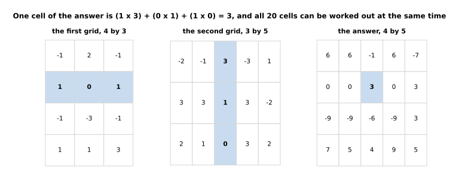

The cell in row 2 and column 3 is (1 x 3) + (0 x 1) + (1 x 0) = 3. The whole 4 by
5 answer is 4 x 5 x 3 = 60 multiply-and-add pairs.

Because no cell needs any other cell, those 60 pairs can be shared out among as
many workers as you have. The chart below counts how many steps the work takes,
one after another, for three numbers of workers.

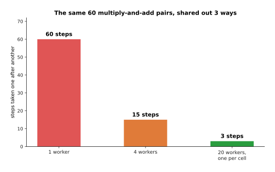

One worker takes 60 steps, four workers take 15, and twenty workers, one for each
cell of the answer, take 3.

Make the grids bigger and the two counts move further apart, in a way that
favours this hardware. Multiplying two grids of 1,024 by 1,024 takes 2.147
thousand million operations, spread over 1.049 million cells that can all be
worked out at once, so each piece of work is 2,048 operations long. At a side of 16,384 it is 8.796 million million
operations across 268.4 million independent cells.

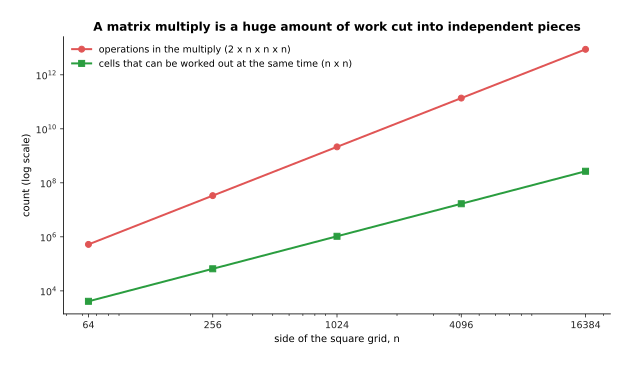

The work grows as the cube of the side while the number of pieces it can be cut
into grows as the square, so bigger multiplies both need more arithmetic units and
can use them.

There is a second reason, and this one is about memory rather than arithmetic.
Fetching a number from the chip's memory is slow compared with multiplying it. So
what matters is how much arithmetic each fetched byte pays for. A matrix multiply
of side 1,024 does 341 operations for every byte fetched, and at side 16,384 it
does 5,461. Adding two grids together does 0.17 at every size, because it touches
each number once and is then finished with it.

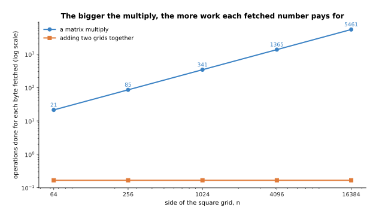

A big matrix multiply pays for each fetched byte many times over, while adding two
grids touches each number once and then waits for memory again.

This has a direct consequence for how a model is run. Take one layer of 4,096 by
4,096 weights, which is 33.6 megabytes at two bytes a weight. The **batch** is the
number of inputs put through the layer at the same time. Putting a single row of
input through that layer takes 0.1 microseconds of arithmetic and 16.8
microseconds of fetching the weights, so the arithmetic units are idle 99 per cent
of the time. The arithmetic only takes as long as the fetching at a batch of 256,
and at a batch of 1,024 the arithmetic takes 85.9 microseconds against 25.2 for
the fetching.

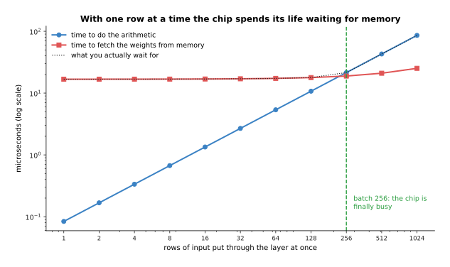

With one row at a time the weights are fetched for almost nothing, and only at a
batch of 256 does this layer spend more time on arithmetic than on memory.

That is why training uses large batches, and it is also why serving a model to one
user at a time is wasteful. The next section looks at what those weights cost to
hold in the first place.

---

## 2. What one parameter costs to store

The last section counted operations, and this one counts bytes. The starting point
is that a parameter is just a number, so its cost is the size of the number format
it is kept in.

The example model used from here on is a transformer of 32 blocks with a width of
4,096 and a vocabulary of 128,000 tokens. Its parameter count follows from that
shape alone. The attention parts hold 2.15 thousand million parameters, the
feed-forward parts hold 4.29 thousand million, and the embedding table holds 0.52
thousand million, which is 6.97 thousand million in all. The chart below shows
that split for three model shapes, with each bar stacked into its three parts.

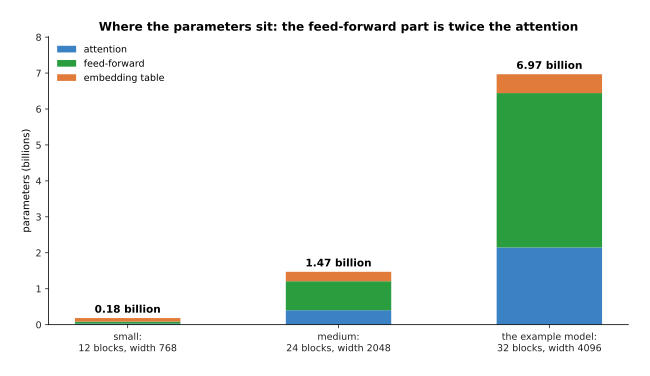

A small model of 12 blocks and width 768 has 0.18 thousand million parameters, and
one of 24 blocks and width 2,048 has 1.47 thousand million. In every shape the
feed-forward part holds twice what attention holds.

Multiplying the parameter count by the bytes of the number format gives the
memory. At float32, which is four bytes a number, the example model needs 27.9
gigabytes before anything else is counted. At bfloat16, two bytes, it needs 13.9.
At int8, one byte, it needs 7.0. At int4, half a byte, it needs 3.5.

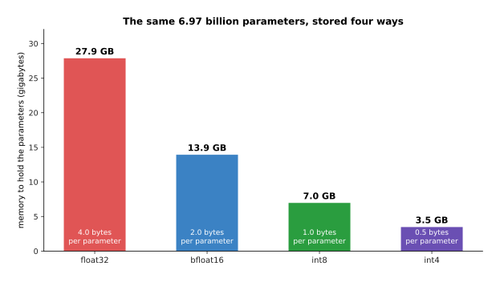

The same 6.97 thousand million parameters cost 27.9 gigabytes or 3.5 gigabytes,
depending only on how many bits each one is kept in.

Fewer bits are not free, because a format with fewer bits rounds harder. To see
why, look at how the bits of a number are divided up. A floating-point number is
stored in three parts: one sign bit, then some exponent bits that say how big or
how small the number is, then some fraction bits that say how finely it is
rounded.

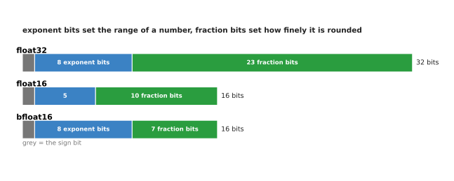

bfloat16 keeps all eight exponent bits of float32 and drops sixteen of the
twenty-three fraction bits. So bfloat16 can hold the same range of sizes as
float32 while rounding much harder than it. float16 does the opposite trade: it
gives up three exponent bits to keep ten fraction bits.

The script now stores five numbers in four formats and measures how far each
stored value is from the true one, as a share of that value. float32 is out by a
few parts in a hundred million. float16 is out by a few parts in ten thousand.
bfloat16 is out by up to about four parts in a thousand, for the
reason the bit diagram shows. All three of those formats keep the same relative
accuracy whatever the size of the number, which is what makes them safe for
training.

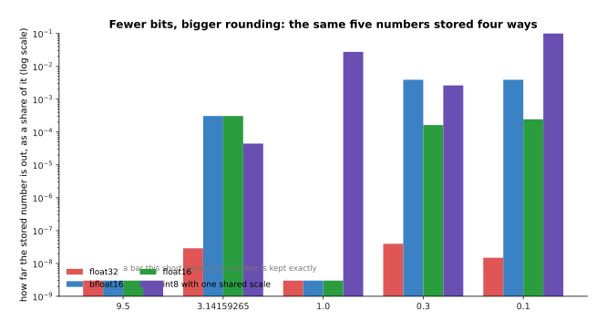

Storing 0.1 gives 0.1000000015 in float32 and 0.0996093750 in bfloat16. One shared
int8 scale of 0.074803 turns the same 0.1 into 0.0748031496, which is a quarter
out.

That last column shows the danger of whole-number formats. int8 does not store a
number directly. It stores how many steps of a fixed size the number is, and the
step size has to be agreed in advance. Here the step was set by the largest value
in the set, so the smallest value lost a quarter of itself. Keeping a separate step
for each part of the model is what makes int8 usable, and the page on [making a
model smaller and faster](04_making-a-model-smaller-and-faster.md) is about doing
that properly.

The chart below turns these costs into the practical question, which is whether a
model fits on one card at all. Each line is one number format, and the horizontal
lines mark three example cards.

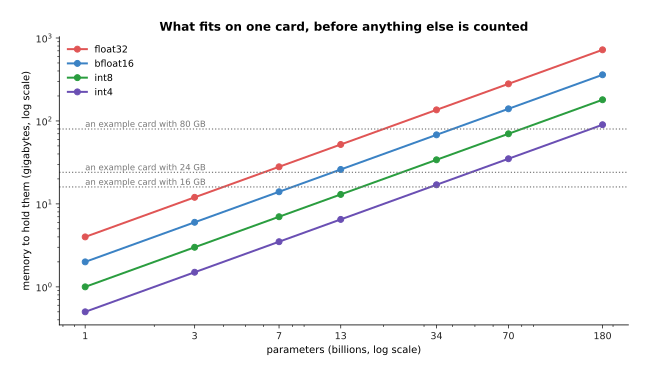

A model of 7 thousand million parameters needs 28 gigabytes at float32 and 14 at
bfloat16, so the format alone decides whether it fits on one card.

So far this is only the memory to hold a finished model and answer questions with
it. Training needs considerably more, which is the next section.

---

## 3. What training needs on top of the parameters

The memory counted in section 2 is only what a finished model needs to answer a
question. Holding the parameters turns out to be the small part of training,
because gradient descent has to keep several more numbers for every parameter.

There are four extra things to keep. First, the gradient of each parameter has to
be stored while the backward pass runs. Second, the optimiser keeps running
averages. The optimiser in almost every modern run is AdamW, and it keeps two
running averages for each parameter. Third, the optimiser keeps those averages at
float32, along with a float32 master copy of the parameter itself, because adding
a tiny step to a bfloat16 number loses the step entirely. Fourth, every activation
worked out on the way forward has to be kept until the backward pass has used it.

The chart below adds those five items up for one training step and puts the total
beside the memory needed to simply run the finished model.

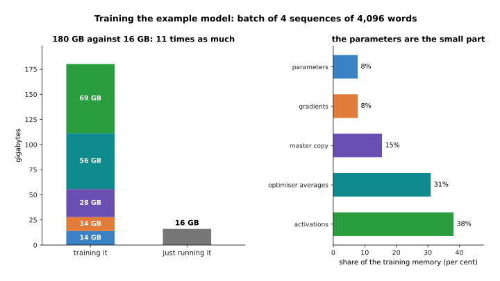

Training the example model on four sequences of 4,096 words needs 14 gigabytes for
the parameters, 14 for the gradients, 28 for the master copy, 56 for the two
optimiser averages and 69 for the activations. That is 180 gigabytes in all,
against 16 gigabytes for running it.

Those five numbers are worth reading twice. The parameters are 8 per cent of the
total. The master copy and the two optimiser averages together are 46 per cent,
which is more than five times what the parameters themselves cost. Training needs
11.2 times as much memory as answering with the finished model, which is why a
model you can run on one card may need many cards to train.

The last line of the budget behaves differently from the others. The activations
grow with the batch size, while everything else stays fixed at 111 gigabytes. At
one sequence the activations are 17.2 gigabytes, and at 32 sequences they are
549.8 gigabytes. That is what sets the largest batch that fits.

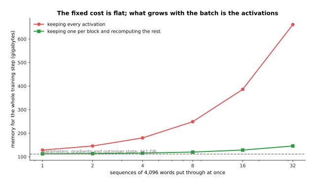

The fixed cost of parameters, gradients and optimiser state is 111 gigabytes
whatever the batch size, and only the activations grow with it.

There is a standard way of buying memory back. You throw most of the activations
away during the forward pass and work them out again during the backward pass.
Keeping one activation per block instead of all of them cuts the example budget
from 180 gigabytes to 116, which is a saving of 36 per cent. The price is an extra
forward pass, which raises the arithmetic of a step by about a third.

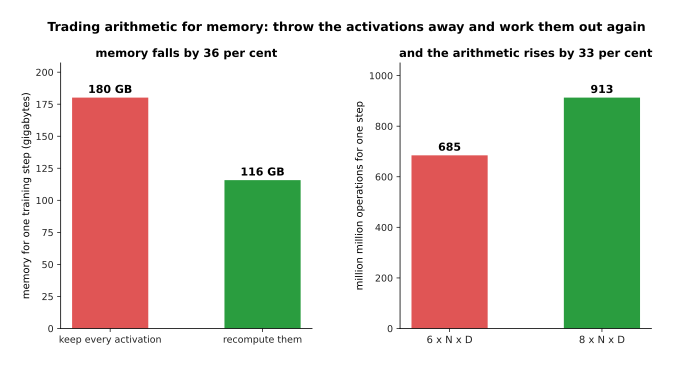

Recomputing the activations trades 33 per cent more arithmetic for 36 per cent
less memory, and it is switched on in almost every large run.

Counting sixteen bytes a parameter, which is the fixed part of the budget above,
turns model size straight into a count of machines. The chart below does that for
seven model sizes, using example cards of 80 gigabytes.

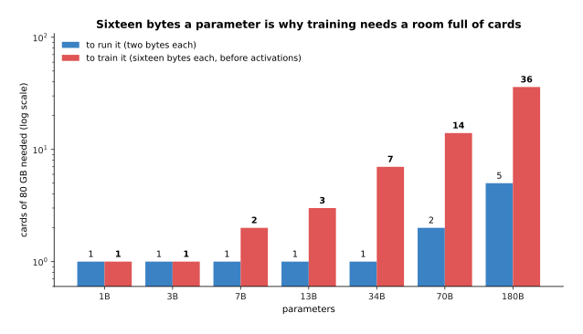

A model of 7 thousand million parameters fits on one card to run and needs two to
train. One of 70 thousand million needs 2 cards and 14. One of 180 thousand
million needs 5 cards and 36.

Memory decides whether a run is possible at all. How long it then takes is the
next section.

---

## 4. Measuring a run in floating-point operations

Section 3 decided whether a run fits in memory at all, and this section decides
how long it takes. A **floating-point operation**, usually shortened to **FLOP**,
is one multiply or one add on numbers with a decimal point. The size of a training
run is measured by counting them, because that count does not depend on which
machine you use.

The rule of thumb is simple enough to do in your head. Pushing one token through
one parameter costs about two operations in the forward pass, because each
parameter is multiplied by something and the result is added on. The backward pass
costs about twice the forward pass, because it works out a gradient for the
activations and a gradient for the weights. So a run over **D** tokens with **N**
parameters costs about 6 x N x D operations in all.

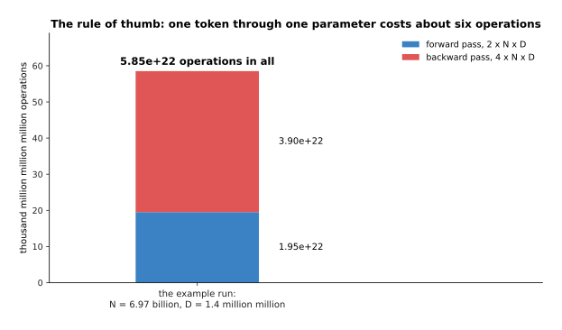

With 6.97 thousand million parameters and 1.4 million million tokens, the forward
passes cost 1.95e+22 operations and the backward passes cost 3.90e+22, so the
whole run costs 5.85e+22.

That number means nothing until it is divided by a machine. The example
accelerator used here does 400 million million operations a second at full
stretch. A real run keeps about 40 per cent of that busy, so it sustains 160
million million a second. One of them would take 12 years to finish the example
run, which is why these runs are split across many accelerators at once.

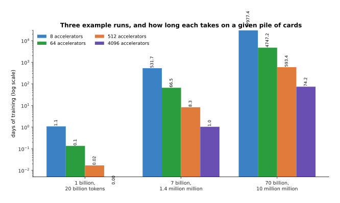

The example run takes 532 days on 8 accelerators, 66 days on 64 and 8.3 days on
512. A run of 70 thousand million parameters over 10 million million tokens takes
593 days even on 512 accelerators.

Because the cost is a product of two numbers, many different pairs of model size
and token count cost the same. Drawing lines of equal cost makes the choice
visible. In the chart below the background colour is the cost and each black line
joins the pairs that cost the same.

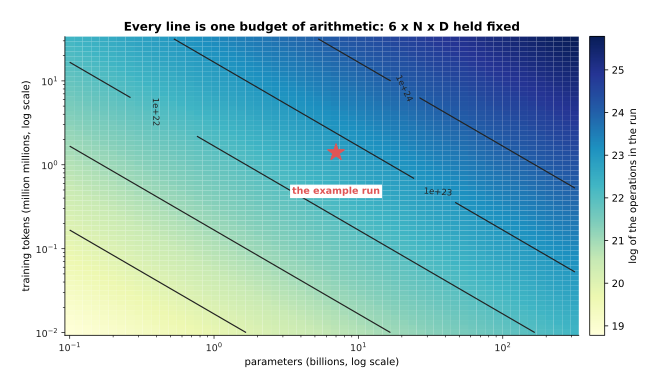

Every line is one budget of arithmetic held fixed, and the example run sits at 7
thousand million parameters and 1.4 million million tokens. Choosing a point on
one of those lines is the subject of section 5.

The same rule prices answering as well as training. Producing one token with the
finished model costs about 2 x N operations, which is 1.39e+10 here. So the
training run costs as much as producing 4.2 million million tokens of answers,
which is three times the number of tokens it was trained on. Training a model is a
single large bill, and serving it is a small bill that never stops.

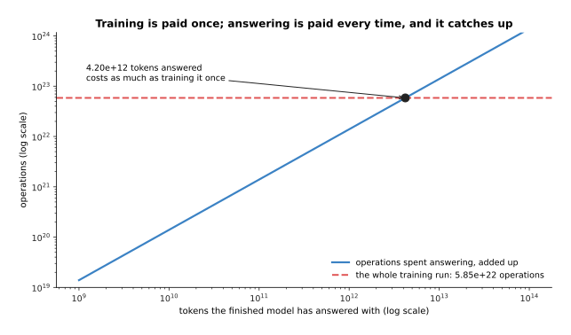

Answering costs as much as the training run once 4.2 million million tokens have
been produced, and everything after that point costs more than training ever cost.

---

## 5. Scaling laws, and what they let you plan

Section 4 left a question open. Given a fixed **compute budget**, which is the
total number of operations you are willing to spend on one run, should that budget
buy a bigger model trained on less data, or a smaller model trained on more? The
answer comes from **scaling laws**, which are the measured relations between model
size, data size, arithmetic and the loss the run ends at.

What people found, by doing many runs of different sizes, is that the loss falls
smoothly and predictably as all three grow. They also found that the shape of the
fall becomes a straight line when both axes are squashed logarithmically. The
curves on this page come from a formula written for this page. The formula has
that same shape without being anybody's measurement. It is a floor of 1.60, plus
500 divided by the number of parameters raised to the power 0.35, plus 500 divided
by the number of tokens raised to the power 0.30.

The two panels below show the same curve twice: once with the loss on an ordinary
axis, and once with the floor of 1.60 subtracted and both axes squashed.

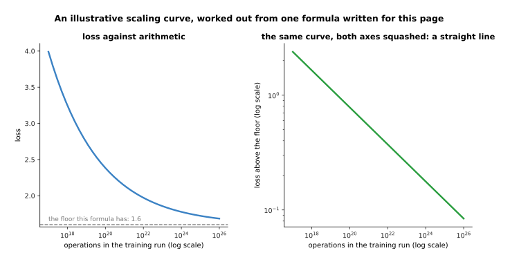

In this illustrative formula, 7e+18 operations reach a loss of 2.802, 4.9e+20
reach 2.205 and 2.4e+24 reach 1.753. The fall becomes a straight line once the
floor is subtracted.

Two things in that picture matter more than the exact numbers. First, the curve
bends, so each further improvement costs more than the last one. Second, the curve
has a floor, so no amount of arithmetic takes the loss to zero. Both of those
things are true of the measured laws as well.

The second thing the laws say is that growing one of the three alone does not
work, and that is the practical lesson. Hold the data at 10 thousand million
tokens, and the loss in this formula cannot go below 2.100 however large the model
gets. It is 2.454 at a thousand million parameters and still 2.171 at a hundred
thousand million, so a hundred times the model has bought almost nothing.

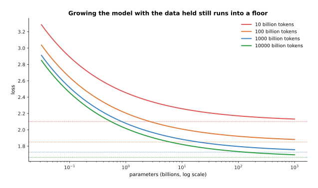

Each amount of data has its own floor: 2.100 for 10 thousand million tokens and
1.726 for a thousand thousand million. Growing the model while the data is held
still brings the loss down onto that floor and no further.

So the budget has to be split between the two, and the split that the formula
recommends grows both of them together. Multiplying the budget by ten multiplies
the best model size by 2.89 and the best token count by 3.46.

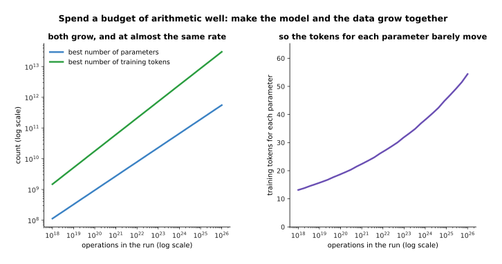

Both the best model size and the best token count rise with the budget, and they
rise at almost the same rate.

Because they rise at almost the same rate, the number of training tokens for each
parameter stays nearly steady. The chart below follows that one number across a
budget range of a hundred million to one.

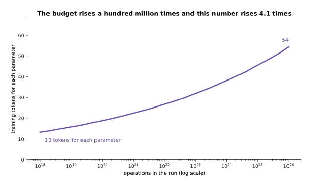

The best number of tokens for each parameter drifts from about 13 at the smallest
budget here to about 54 at the largest, while the budget itself rises by a factor
of a hundred million.

The reason anyone cares about these laws is planning. A large run is expensive
enough that you want to know roughly where it will end up before you start it.
Because the relation is smooth, you can do several small runs, fit the line and
read the answer for a run you have not done. The chart below does exactly
that, using only runs between 1e+18 and 1e+21 operations to fit the line.

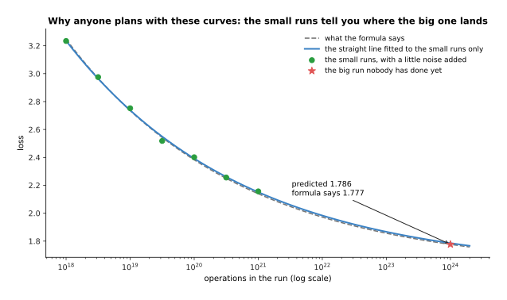

The line fitted to the small runs predicts a loss of 1.7856 at 1e+24 operations,
where the formula itself gives 1.7768. That is an error of half a per cent.

One warning belongs with all of this. These laws predict the loss, which is how
well the model guesses the next token. They do not predict whether the model can
do the job you want. A better loss usually means a better model, and the word
"usually" matters here: a run can reach a lower loss and still fail at your
task.

---

## 6. The data, and why the robot kind is scarce

Section 5 treated the data as a number of tokens, as if all tokens were alike.
They are not, and the first thing that matters is how many of them are wrong. The
script trains the same head on the same features three times: once with no wrong
labels, once with one label in five wrong, and once with two labels in five wrong.
Read the chart below as three curves of the same experiment with three levels of
damage.

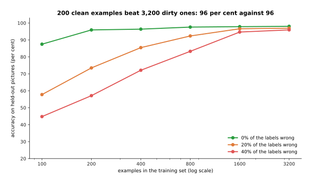

With 200 clean examples the head reaches 95.9 per cent, which is what 3,200
examples reach when two labels in five are wrong. At 400 examples the clean set
reaches 96.4 per cent against 72.1 per cent for the damaged one.

The second thing that matters is how many of the examples are the same as each
other. Text scraped from the web is full of duplicates, and a duplicate costs
exactly as much to train on as a fresh example while teaching nothing. Removing
them is called **deduplication**, which means finding and removing near-identical
examples. It is one of the first things done to a newly collected set of data.

To show why, the script holds the training set at 1,600 examples and raises the
share of them that are copies. Read the chart below from right to left: the set
never changes size, but fewer and fewer of its examples are different from each
other.

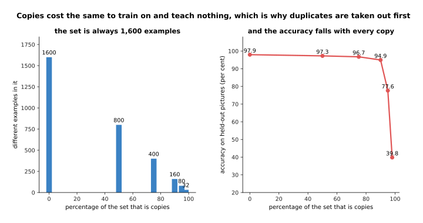

Accuracy falls from 97.9 per cent with no copies, to 94.9 per cent when nine
tenths of the set are copies, to 39.8 per cent when 98 per cent are copies and
only 32 different examples are left.

The third thing that matters is which sources the tokens come from, and in what
proportion. That choice is called the **data mixture**. The mixture is chosen
rather than taken, because the amount of text available from each source has
nothing to do with how much of it the model should read. The chart below shows an
example mixture for a run of 1.4 million million tokens. For each source it draws
two bars: how many tokens of that source exist, and how many the run actually
reads.

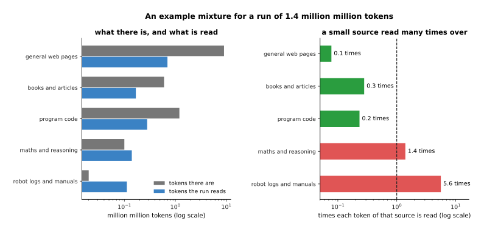

There are 9 million million tokens of general web pages and the run reads 0.7
million million of them. There are only 0.02 million million tokens of robot logs,
and the run reads 0.112 million million.

Dividing the second bar by the first gives the number that actually matters, which
is how many times each token of a source is read. The chart below shows that one
number for each source, with a dashed line at one read each.

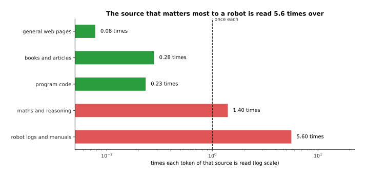

Each token of web pages is read 0.08 times, which means the run uses only a small
part of what exists. Each token of robot logs is read 5.60 times, because that
source makes up 8 per cent of the run while being the smallest source there is.

That last number is the whole problem of robotics stated once. The source you care
about most is the smallest one, so it has to be read over and over, and reading the
same example many times is how a model memorises instead of learning. Robot data is
scarce for a reason that no amount of money removes quickly, which is that every
example is a person sitting at a real arm. At 25 seconds to perform a task and 12
seconds to put the scene back, one person-hour yields 97 demonstrations.

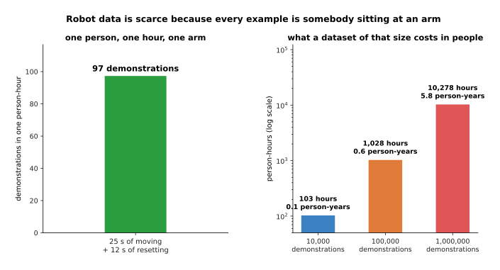

Ten thousand demonstrations cost 103 person-hours. A hundred thousand cost 1,028.
A million cost 10,278 person-hours, which is 5.8 person-years of eight-hour days.

Four things are actually done about this, and each one gets examples more cheaply
in exchange for examples that are less like the robot you will run on. The first is
sharing data across robots, which is called **cross-embodiment** data. It means
training on episodes recorded on other people's arms. It costs the time to convert
those episodes into your own format, and it leaves you with data recorded on a body
unlike yours. The second is simulation with randomised appearance and physics. It
costs the time to build and randomise the scene, after which it produces episodes
by the hundred thousand, and it leaves a gap between the simulator's physics and
the real world. The third is **synthetic data**, which means examples generated by
another model. It costs the time to set it up and to check what it produced, and it
carries over the mistakes of the model that made it. The fourth is learning from
video of people doing the task. It costs the least per example, because the video
already exists, and it loses the most, because a human hand is not a gripper and a
video holds no record of the forces.

The chart below prices those four against teleoperating a real arm, under example
costings written for this page.

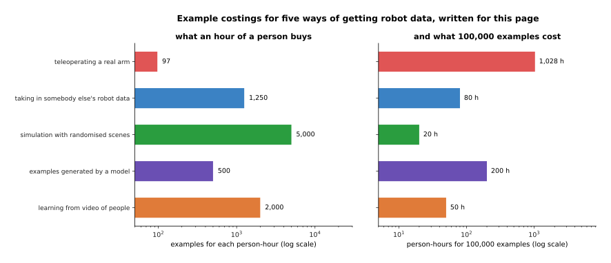

Teleoperation gives 97 examples a person-hour, taking in somebody else's robot data
gives 1,250, examples generated by a model give 500, learning from video gives
2,000, and simulation gives 5,000. Turned round, a hundred thousand examples cost
1,028 person-hours by teleoperation and 20 by simulation, and every cheaper route
gives data that is further from the real arm.

None of this is a solved problem. The page on [where the data comes
from](../../07_learned-models/01_what-models-are/05_where-the-data-comes-from.md)
describes how real robot datasets are actually collected. The practical position
today is that a robot model is pretrained on web text and pictures, where data is
plentiful, and is then adapted with the small amount of robot data that exists.
That adaptation is what the next page is about.

---

## 7. Where to read next

- [Fine-tuning and adapters](03_fine-tuning-and-adapters.md) is the next page, and
  it shows how a pretrained model is adapted to one job without paying any of the
  costs on this page twice.
- [Making a model smaller and faster](04_making-a-model-smaller-and-faster.md)
  picks up section 2's int8 column and turns it into a model that fits on a
  robot's own computer.
- [Running and evaluating a model](../14_using-a-model-for-real/01_running-and-evaluating-a-model.md)
  takes section 1's point about batches and memory and turns it into a latency
  budget for a real arm.
- [Vision-language-action models](../12_models-that-act/03_vision-language-action-models.md)
  shows what is built from web pretraining plus the scarce robot data of section 6.
- [Where the data comes from](../../07_learned-models/01_what-models-are/05_where-the-data-comes-from.md)
  is the catalogue page on real robot datasets, their sizes and how they were
  collected.
- [Hardware](../../03_frameworks/08_frontier/05_hardware.md) describes the arms and
  the computers that this arithmetic ends up running on.

---

## 8. Using it in Python

Most of this page is arithmetic you can do without a library, and the first half
of the program below does exactly that. The second half measures the thing that is
easiest to get wrong, which is how much the optimiser adds to the memory. It does
that by building one real transformer block, taking one step, and asking the
optimiser what it is holding.

```python
import torch
from torch import nn

# section 2: the parameter count of the example model, from its shape alone
def parameters(layers, width, vocab):
    return 12 * width * width * layers + vocab * width

n = parameters(layers=32, width=4096, vocab=128_000)
print(round(n / 1e9, 2))                       # 6.97 thousand million
for name, each in [("float32", 4), ("bfloat16", 2), ("int8", 1)]:
    print(name, round(n * each / 1e9, 1))      # float32 27.9 / bfloat16 13.9 / int8 7.0

# section 4: the arithmetic of a whole training run, 6 x N x D
tokens = 1.4e12
print(f"{6 * n * tokens:.2e}")                 # 5.85e+22

# section 3: what the optimiser adds, measured on one real block
block = nn.TransformerEncoderLayer(d_model=512, nhead=8, dim_feedforward=2048,
                                   batch_first=True)
small = sum(p.numel() for p in block.parameters())
print(small)                                   # 3152384

opt = torch.optim.AdamW(block.parameters(), lr=1e-4)
block(torch.randn(2, 16, 512)).sum().backward()
opt.step()
state = sum(v.numel() for s in opt.state.values()
            for v in s.values() if torch.is_tensor(v))
print(state, round(state / small, 1))          # 6304780 2.0
```

The first three prints are section 2 and section 4 with no library involved at
all, because a parameter count follows from the shape of the model and the cost of
a run follows from the parameter count. The formula 12 x width x width x layers is
the attention and feed-forward parts of a standard block added together, and the
vocabulary times the width is the embedding table.

The last two prints are the measurement. One real block of width 512 holds
3,152,384 parameters. After a single AdamW step the optimiser is holding 6,304,780
numbers of its own, which is 2.0 times the size of the model. Those are the two
running averages of section 3. At float32 they come to eight bytes for every
parameter, which is 31 per cent of the training budget. Add the float32 master
copy, which is another four bytes a parameter, and the optimiser's whole state is
the 46 per cent that section 3 counted.

What PyTorch will not tell you is any of the planning. It does not warn you that
your batch is too small to keep the chip busy, that your model is too large for the
data you have, or that half your training set is duplicates. Those are decisions,
and sections 3 to 6 are how they are made: count the bytes before you start, count
the operations, pick a point on the line of equal arithmetic cost, and look at the
data you have before you buy more of it.
