# Fine-tuning and adapters

The page before this one, [scale, data and compute](02_scale-data-and-compute.md),
worked out what it takes to train a large model from nothing. The honest summary was
that almost nobody does it. What almost everybody does instead is take a model
somebody else has already trained, and change it a little, so that it does the job in
front of them. This page is about that step.

The step has a name. **Fine-tuning** means taking a model whose weights were already
set by [pretraining](01_self-supervised-pretraining.md), and then training it further
on a smaller set of examples of your own. A **weight** is one of the numbers inside
the model that training is allowed to change. There is more than one way to fine-tune,
and the ways differ in how much of the model you let training touch. The cheapest way
changes nothing at all, and the most expensive way changes every weight. Most of this
page is about which way to choose and what each one costs.

By the end of it you will know five ways to adapt a pretrained model, how many numbers
each one trains, how much memory each one needs, how low-rank adaptation works in
detail, what happens to the model's old skills when you teach it a new job, and how
many examples a fine-tune needs.

The page assumes you have read the two pages before it, so you know what pretraining
is, what a frozen backbone is, and what a floating-point operation (FLOP) is. A FLOP
is one multiplication or one addition of two numbers. The page also assumes you know
what a [transformer block](../06_the-transformer/02_a-transformer-block.md) holds, and
what an optimiser keeps in memory, from [the training
loop](../03_how-training-works/04_the-training-loop.md).

The parameter counts and memory sizes here are exact arithmetic on one stated model
shape. That shape is a transformer of 32 blocks, with a width of 4096, a feed-forward
inner width of 11008, and a vocabulary of 32000. The learning experiments are
simulated. A small network is trained in NumPy on invented sensor readings of six
objects, and is then fine-tuned. Every number on this page is printed by
`docs/diagrams/pretraining_and_adapting_2.py`.

## Contents

1. [The five choices, from a better prompt to a full retrain](#1-the-five-choices-from-a-better-prompt-to-a-full-retrain)
2. [What each choice costs in numbers and in memory](#2-what-each-choice-costs-in-numbers-and-in-memory)
3. [Low-rank adaptation, worked out with real shapes](#3-low-rank-adaptation-worked-out-with-real-shapes)
4. [QLoRA: an adapter on a base stored in 4 bits](#4-qlora-an-adapter-on-a-base-stored-in-4-bits)
5. [Catastrophic forgetting, and what actually helps](#5-catastrophic-forgetting-and-what-actually-helps)
6. [How much data a fine-tune needs](#6-how-much-data-a-fine-tune-needs)
7. [Where to read next](#7-where-to-read-next)
8. [Using it in Python](#8-using-it-in-python)

---

## 1. The five choices, from a better prompt to a full retrain

Somebody else pretrained the model you start from. So the question is not whether to
train it, but how much of it to let training change. There are five common answers.
They are listed here from the one that changes least to the one that changes most.


Each of the five columns is the same model. The grey parts are the ones training never
touches, and the coloured parts are the ones it is allowed to move. The number printed
under each column is how many weights that choice changes.

The first choice leaves every weight alone and writes a better **prompt**. A prompt is
the text or the picture you put in front of the model before the real question. A new
prompt costs no training at all, so you can try one every minute. That speed is why
this is the choice to try first. What a prompt cannot do is teach the model something
it does not already contain, because every behaviour a prompt reaches is a behaviour
the pretrained weights already hold.

That limit is smaller than it sounds. A prompt can carry worked examples as well as
instructions. A model pretrained on enough text learns to read an example and continue
the pattern, and this ability is called **in-context learning**. The examples are not
training. No weight changes, and nothing is remembered once the request is finished.
The weights hold the general ability to use an example, and the example itself supplies
the particular task. So the first choice reaches further than asking more clearly, and
for language models it is the reason most jobs never need any training.

During 2026 the same arrangement was claimed for robots, with a video in place of the
worked examples. The model is shown one recording of a task, and then performs that
task, with nothing trained. Book 7 explains what that costs and how little evidence
there still is, in [prompting with a
demonstration](../../07_learned-models/10_making-models-work-on-an-arm/03_also-used/02_prompting-with-a-demonstration.md),
and section 7 of this page says where to read the rest.

The second choice freezes the pretrained model and trains one small new layer on top of
it. That new layer is called a **head**, and it turns the model's internal numbers into
the answers your job needs. To freeze a weight means to leave it exactly as it is while
training runs. This choice is cheap, and it breaks nothing, because the pretrained part
cannot change. However, it can only recombine what the model already measures, and
section 6 shows it failing for exactly that reason.

The third choice adds an **adapter**. An adapter is a small set of extra weights placed
beside the existing ones. Training changes only the adapter, and the original weights
stay frozen. The most used kind of adapter by far is low-rank adaptation, written LoRA,
and section 3 works it out in full.

The fourth choice lets the last few blocks of the model train normally, while the rest
stays frozen. This gives training real room to move, and it still leaves most of the
file alone. The fifth choice is **full fine-tuning**, where every weight is free to
change. It is the most capable choice, and it is by far the most expensive.

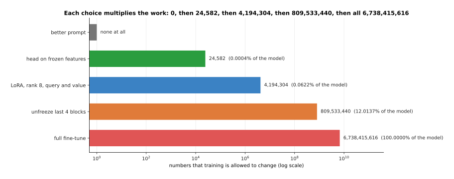

Each choice multiplies the number of trainable weights by roughly a hundred. A bar
chart with an ordinary scale could not show all five at once, so the horizontal axis is
logarithmic, which means each gridline is ten times the one before it.

A new six-way head on this model holds 24,582 weights. A rank-8 adapter on the query
and value matrices holds 4,194,304. Unfreezing the last four blocks lets training change
809,533,440 weights. A full fine-tune lets it change all 6,738,415,616. The three middle
choices are what people mean by **parameter-efficient fine-tuning**, which is any
method that trains a small fraction of the weights and freezes the rest.

A prompt looks free, but it is not free, because the extra words are read again on
every call. A forward pass costs about two floating-point operations for each weight
and each token, which the [scale page](02_scale-data-and-compute.md) explained. A token
is one chunk of text, roughly a short word. So one token of prompt costs 13.48 GFLOP on
this model, and 600 extra tokens cost 8.09 TFLOP on every single call.

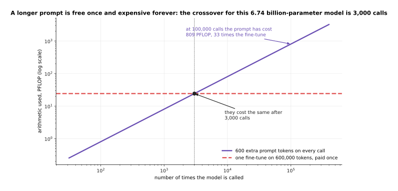

The arithmetic a longer prompt costs grows with every call, while a fine-tune is paid
once. The picture shows the two totals against the number of calls, and the point where
the rising line meets the flat one can be worked out exactly.

Training this model on 500 examples of 400 tokens, for three passes over them, costs
about 24.26 PFLOP. Training costs about six operations per weight per token rather than
two, because it also works backwards through the model. So the longer prompt has cost
as much as the fine-tune after 3,000 calls. By 100,000 calls the prompt has cost
808.61 PFLOP, which is 33 times the fine-tune. A prompt is therefore the cheap answer
for something you do rarely, and the expensive answer for something a robot does all
day.

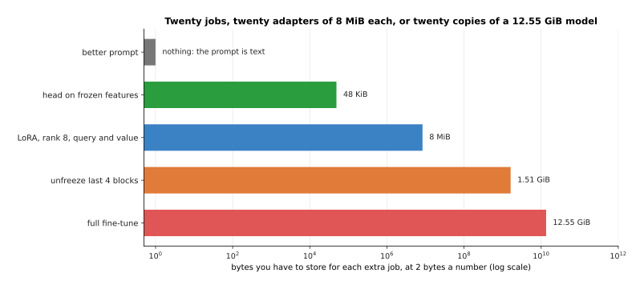

The last thing each choice costs is storage, because every job you adapt the model for
leaves a file you have to keep. The bars show that file, at two bytes for each changed
weight.

A head costs 48 KiB. A rank-8 adapter costs 8 MiB. Four unfrozen blocks cost 1.51 GiB.
A full fine-tune costs the whole 12.55 GiB again, because every weight may have changed.
This is why a fleet of robots with twenty jobs keeps one base model and twenty
adapters, rather than twenty models.

---

## 2. What each choice costs in numbers and in memory

The counts above came from one stated model shape. It is worth seeing where they come
from, because the same arithmetic gives you the cost of any other model you meet.

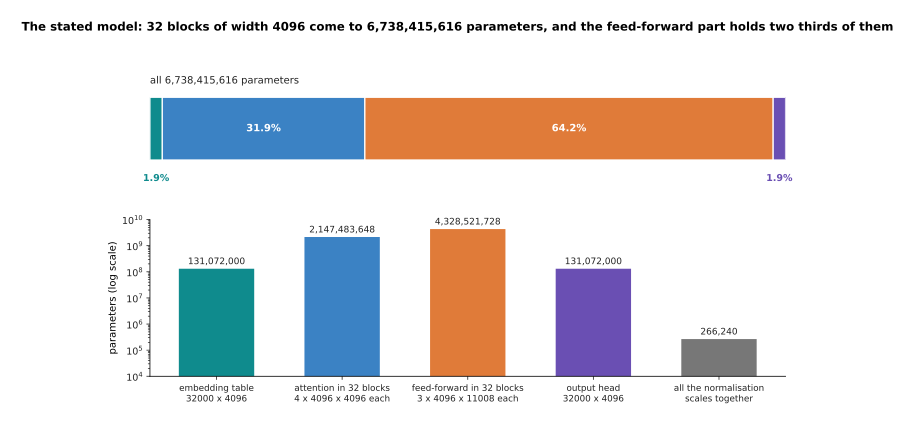

The top bar is the whole model, cut into its parts in proportion. The bars underneath
are the same five parts measured on a logarithmic scale, so that the smallest part is
still visible. The weights are not spread evenly, and the feed-forward parts of the
blocks hold almost two thirds of them.

The embedding table is 32000 by 4096, which is 131,072,000 numbers, and the output head
is the same size again. Inside one block, the attention part holds four matrices of
4096 by 4096, which is 67,108,864 numbers, and the feed-forward part holds three
matrices of 4096 by 11008, which is 135,266,304. So one block holds 202,383,360
numbers, and 32 blocks hold 6,476,267,520. Adding the embeddings, the output head and
the normalisation scales gives 6,738,415,616 weights in total.

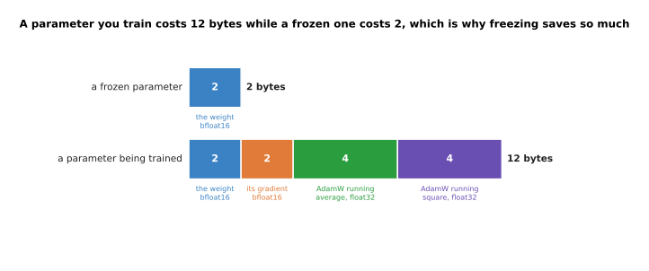

The picture compares one frozen weight with one weight that is being trained. A frozen
weight needs its own value and nothing else. A weight being trained also needs its
gradient, which is the number saying how to change it, and the two running averages
that the optimiser keeps.

Under the common recipe shown here, a weight stored as bfloat16 takes 2 bytes. The
bfloat16 format is a way of writing a number in 16 bits. Its gradient takes 2 bytes
more, and the AdamW optimiser keeps two averages in the float32 format at 4 bytes each.
So a frozen weight costs 2 bytes and a trainable one costs 12. That factor of six is
the whole reason freezing saves what it saves.

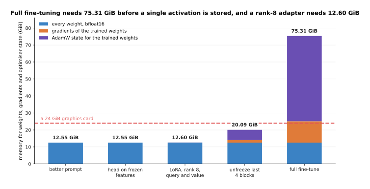

Read each bar from the bottom. The lowest part is every weight in the model, the middle
part is the gradients of the weights being trained, and the top part is the optimiser
state for those same weights. The dashed line is how much memory one ordinary desktop
graphics card has.

A full fine-tune needs 75.31 GiB before a single intermediate value is stored, which
does not fit on one 24 GiB graphics card, and does not fit on two either. Unfreezing
the last four blocks needs 20.09 GiB, which fits, but leaves almost nothing for the
intermediate values the backward pass needs. A rank-8 adapter needs 12.60 GiB. That is
the 12.55 GiB of frozen weights plus 0.05 GiB for everything the adapter needs, and it
is why so many first successful fine-tunes are LoRA ones.

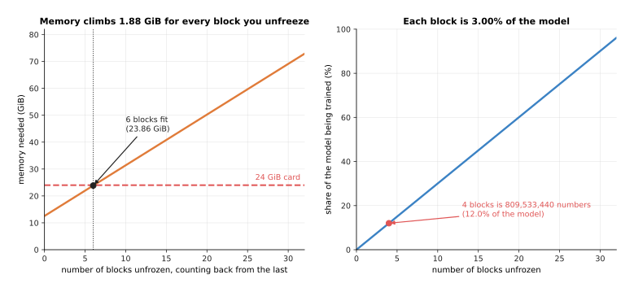

Unfreezing is not a choice between none and all, so this picture sweeps the number of
unfrozen blocks from 0 to 32. Both panels have that same horizontal axis. The left
panel measures the memory it costs, and the right panel measures the share of the model
it puts in play.

Each unfrozen block costs 1.88 GiB more, and each block is 3.00% of the model. So on a
24 GiB card you can unfreeze 6 blocks, which reaches 23.86 GiB and leaves nothing over.
That is the plain reason people choose adapters instead, because the memory runs out
after about a sixth of the model.

---

## 3. Low-rank adaptation, worked out with real shapes

Those memory figures made the third choice look attractive, so this section says
exactly what it does. Low-rank adaptation is the method you are most likely to use, and
it is simpler than its name suggests.

Fine-tuning one 4096 by 4096 attention matrix normally means working out a change for
each of its 16,777,216 numbers. **Low-rank adaptation (LoRA)** says the change does not
need that much freedom. Instead of learning the change directly, it learns two thin
matrices whose product has the same shape as the change, and it trains only those two.

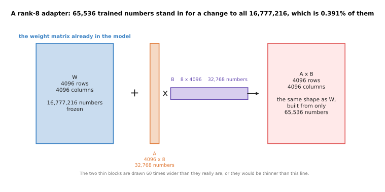

The picture draws the four matrices to scale, except that the two thin ones are drawn
sixty times wider than they really are, or they would be invisible. The product of a
4096 by 8 matrix and an 8 by 4096 matrix is itself 4096 by 4096. So it can be added to
the original weights, although it was built from far fewer numbers.

The 8 here is the **rank**. The rank is how many columns the first thin matrix has and
how many rows the second one has, and it is the one number you choose. At rank 8 the
two thin matrices hold 65,536 numbers between them, which is 0.391% of the matrix they
stand in for. During training the original matrix never changes.

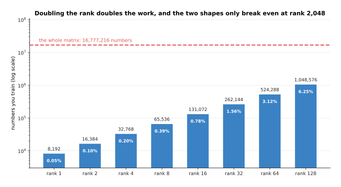

Each bar is one choice of rank, and the dashed line is the size of the matrix itself.
Doubling the rank doubles the numbers you train, and even at rank 128 the adapter is a
small fraction of the matrix.

Rank 1 holds 8,192 numbers, which is 0.049% of the matrix. Rank 128 holds 1,048,576
numbers, which is still only 6.250%. The two shapes would only cost the same at rank
2048.

A higher rank gives the adapter more freedom, so in principle it can copy more of what
a full fine-tune would do. It also costs more memory, and it raises the risk that the
adapter learns your particular examples instead of the general job, which is called
overfitting. The simulated job on this page can measure what the rank is actually
worth.

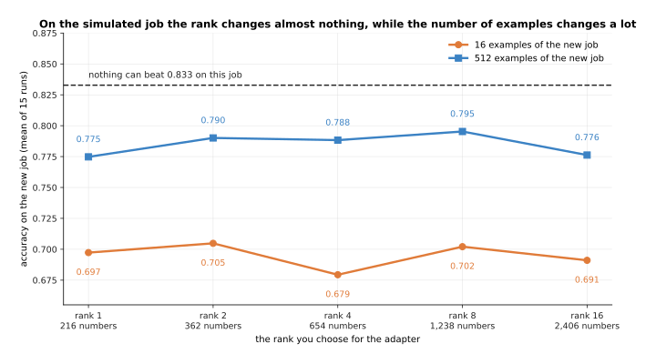

Each point is the average of fifteen fine-tunes of the small simulated network. The
lower line had 16 examples of the new job to learn from, the upper line had 512, and
the dashed line is the best accuracy anything could reach on this job.

With 512 examples the five ranks score 0.775, 0.790, 0.788, 0.795 and 0.776, which is a
spread smaller than the noise between runs. With 16 examples they score 0.697, 0.705,
0.679, 0.702 and 0.691. So on this job the rank decided nothing, and the number of
examples decided about 0.09 of accuracy. The lesson is not that the rank never matters,
because this job is small and its new skill is simple. The lesson is that the rank is
not the setting to spend your time on. People start between 8 and 32 and raise it only
when a fine-tune is clearly not learning enough.

The next question is which matrices to attach adapters to, and for that you need to
know which matrices a block contains.

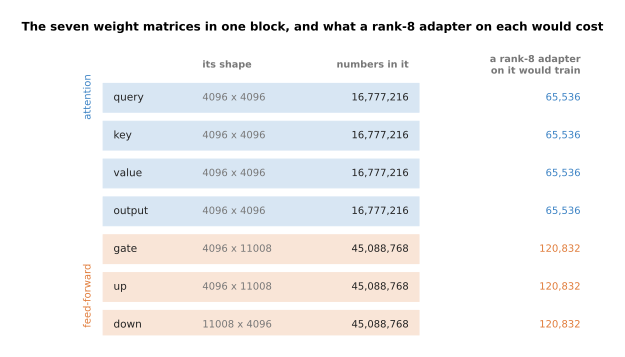

Read each row as one matrix. The first column names it, the second gives its shape, the
third gives how many numbers it holds, and the fourth gives how many numbers a rank-8
adapter on that matrix would train. The four attention matrices are 4096 by 4096 and
hold 16,777,216 numbers each. The three feed-forward matrices are larger, at 45,088,768
numbers each, so a rank-8 adapter on one of them trains 120,832 numbers rather than
65,536.

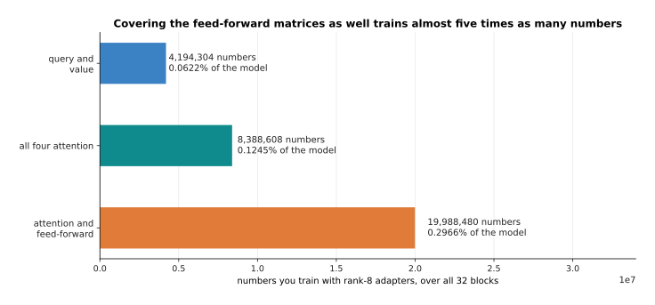

The bars total the cost of three common choices over all 32 blocks of the model.

Attaching rank-8 adapters to the query and value matrices only, which is the usual
starting point, trains 4,194,304 numbers, or 0.0622% of the model. Covering all four
attention matrices doubles that to 8,388,608. Covering the feed-forward matrices as
well brings it to 19,988,480, which is 0.2966% of the model. Covering the feed-forward
matrices usually helps when the new job needs new knowledge rather than a new style.

Two details decide how an adapter behaves in practice. The first is how strongly its
output is added, and the second is what happens to it when the model is finally used.

The adapter's output is multiplied by a **scaling factor** before it is added to the
original output. The usual scaling factor is a number called alpha divided by the rank.
The next picture shows why dividing by something is necessary.

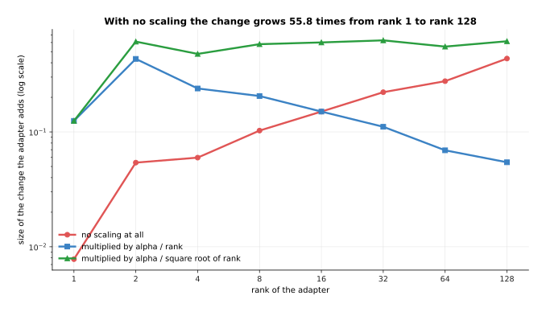

Each line is one way of scaling the adapter's output, measured as the size of the change
it adds to the layer. The horizontal axis is the rank, and both axes are logarithmic.

With no scaling at all, raising the rank raises the size of the change, because the
product of the two thin matrices adds up more terms. Here it grows 55.8 times between
rank 1 and rank 128. A learning rate that suited rank 4 would therefore be far too large
at rank 64. Dividing by the rank has the opposite effect, and the change then falls
as the rank grows. Dividing by the square root of the rank keeps the change between
0.48 and 0.63 from rank 2 upwards, which is why some libraries offer that third choice.
Alpha is a single setting for the overall strength, and once alpha is fixed you can
change the rank without having to tune the learning rate again.

The second detail is folding, and it is what makes LoRA cheap to deploy. The product of
the two thin matrices has the same shape as the original matrix, so it can be added
into the original weights once, before the model is ever run.

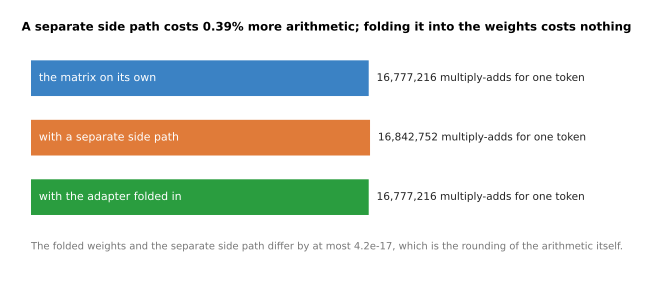

The bars count the arithmetic one 4096 by 4096 matrix costs for one token, in three
arrangements. A multiply-add is one multiplication followed by one addition.

Computing the adapter as a separate side path costs 16,842,752 multiply-adds per token
instead of 16,777,216, which is 0.39% more. Folding the product into the weights brings
the count back to exactly 16,777,216. The two arrangements give answers that differ by
at most 4.2e-17, which is the rounding of the arithmetic itself. So the folded model is
the same model, rather than an approximation of it.

---

## 4. QLoRA: an adapter on a base stored in 4 bits

Section 2 showed that even a LoRA fine-tune holds 12.55 GiB of frozen weights. Those
weights never change, so it is fair to ask why they have to be stored so precisely.
**QLoRA** is the answer. It stores each frozen weight in 4 bits instead of 16, and
trains ordinary LoRA adapters on top of that. Storing a number in fewer bits is called
quantisation, and [the next page](04_making-a-model-smaller-and-faster.md) explains it
properly, so this section only says what the combination makes possible.

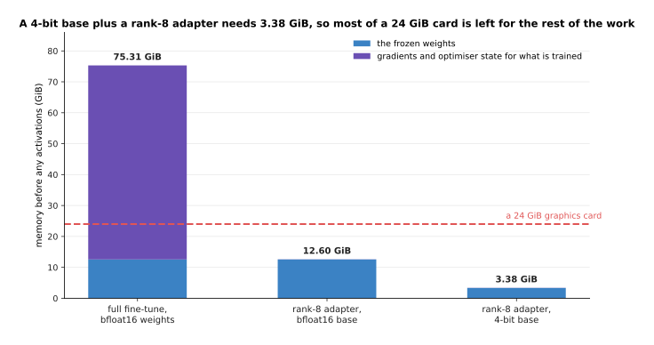

Each bar is one way of fine-tuning. The lower part of a bar is the frozen weights, and
the upper part is everything training needs on top of them. The dashed line is a 24 GiB
graphics card.

With the base stored in 4 bits, and groups of 64 weights sharing one scale, the frozen
part is 3.33 GiB instead of 12.55 GiB. The adapters add 0.05 GiB, so the whole thing
starts from 3.38 GiB. On a 24 GiB card that leaves more than 20 GiB for the intermediate
values, which decide how long a sequence you can train on. That is the difference
between fine-tuning a model of about seven billion weights on one ordinary desktop card
and not being able to fine-tune it at all.

Four-bit integers cannot cover the range of a weight matrix on their own. So each small
group of weights also stores a **scale**, which is one ordinary number that every
integer in the group is multiplied by to get a weight back. The scales take space too.

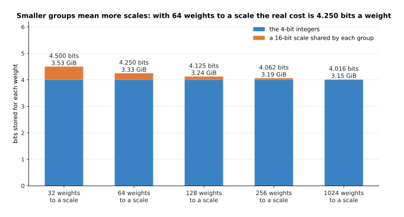

Each bar is one choice of group size. The lower part is the 4 bits of the integer
itself, and the upper part is the share of a 16-bit scale that each weight in the group
has to pay for.

With groups of 64 weights and a 16-bit scale for each group, the true cost is 4.250
bits a weight, which is 3.33 GiB for the whole model. With groups of 32 it is 4.500
bits and 3.53 GiB. The question is then what those extra bits buy.

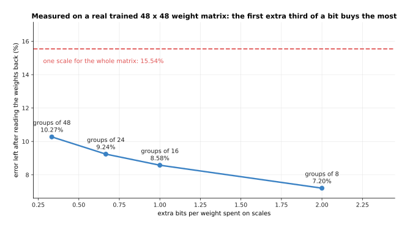

This is measured on a real 48 by 48 weight matrix taken from the small trained network.
The vertical axis is how far the weights have moved once they have been stored in 4 bits
and read back again, as a share of their own typical size. The horizontal axis is the
extra bits per weight that the scales cost.

With one scale for the whole matrix the weights move by 15.54%. One scale for each
column of 48 brings that down to 10.27%, for a third of a bit a weight. Groups of 16
bring it to 8.58%, for one whole extra bit. So the first few extra bits buy the most,
and this is why real 4-bit formats always use small groups.

The remaining question is what any of this costs in accuracy, and the simulated network
can answer it on two jobs.

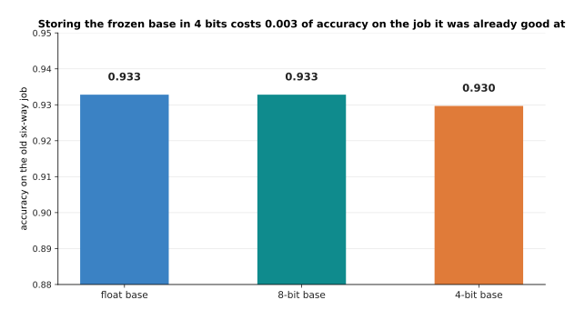

The first job is the one the network was already good at. The bars are its accuracy
when its weights are stored in three different ways, with nothing else changed.

Storing the simulated network in 4 bits moves its accuracy on the old six-way job from
0.933 to 0.930. At 8 bits there is no measurable loss at all. So the frozen base becomes
slightly wrong, and only slightly.

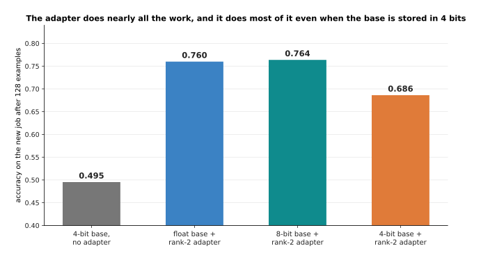

The second job is a new one the network has never seen. Each bar is the accuracy a
rank-2 adapter reaches on it after 128 examples, on top of a base stored in a different
way. The first bar has no adapter at all, for comparison.

The 4-bit base alone scores 0.495, which is no better than guessing between two
classes. A rank-2 adapter on an unchanged base lifts that to 0.760, and on an 8-bit base
to 0.764. On a 4-bit base the same adapter reaches 0.686. So the adapter does nearly all
the work in every case, and the 4-bit base costs about 0.07 of accuracy here. What you
buy for that is the ability to train on hardware that could not otherwise hold the
model at all. The cost that is easy to forget is speed, because 4-bit weights have to be
turned back into ordinary numbers before every multiplication.

---

## 5. Catastrophic forgetting, and what actually helps

Every choice above the first changes weights that pretraining set. Those weights were
what made the model good at everything else. So teaching it the new job may quietly
destroy the old one. This is called **catastrophic forgetting**, and it is not a rare
accident. It is the normal result of training hard on a narrow set of examples. To train
hard here means to use a large learning rate for many steps.

The experiment behind the next five pictures is simulated, and small enough to run in
full. A network of 1,670 weights is trained on a six-way job. The job is to name which
of six objects a reading came from, where each reading is twelve numbers. The network
reaches 0.933 on a held-out test set, which is a set of examples it never trained on.
It is then fine-tuned on a narrow new job. The new job only ever shows two of the six
objects, in a new part of the reading space, where those two are harder to tell apart.

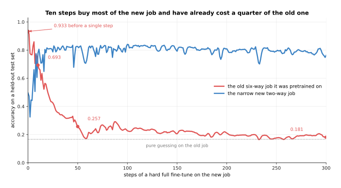

The blue curve is the job being taught, and the red curve is the job nobody is teaching
any more. Both are measured on held-out test sets after every step. The red curve falls
much faster than the blue one rises.

After ten steps the new job has reached 0.780, which is most of what it will ever reach,
and the old job has already fallen from 0.933 to 0.693. After fifty steps the new job is
at 0.825 and the old one is at 0.257. By three hundred steps the old job is at 0.181,
which is barely better than guessing one of six classes. Most of the damage therefore
happens in the first few steps, which means a short fine-tune is not safe simply because
it is short.

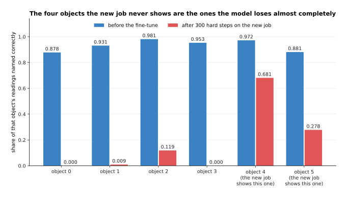

The same run can be measured object by object, which says more than one average does.
Each pair of bars is one of the six objects. The left bar is the share of that object's
readings named correctly before the fine-tune, and the right bar is the same share
afterwards.

Before the fine-tune the six scores run from 0.878 to 0.981. After three hundred hard
steps, objects 0 and 3 score 0.000, object 1 scores 0.009 and object 2 scores 0.119.
The two objects the new job does show keep more: object 4 scores 0.681 and object 5
scores 0.278. So forgetting is not an even fading of skill. The model has learned to
answer with the two classes it has been shown lately, and the other four have stopped
being possible answers at all.

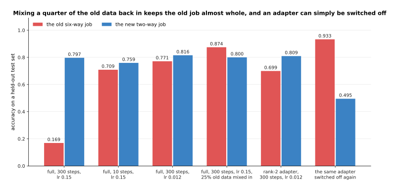

Each pair of bars is one recipe. The left bar of a pair is the old six-way job and the
right bar is the new two-way job, both after the recipe has finished. A good recipe is
one where both bars are tall.

Four things are usually suggested against forgetting, and this experiment tests all
four. Stopping after ten steps leaves the old job at 0.709 and the new one at 0.759, so
it helps, but it gives up some of the new job. A learning rate of 0.012 instead of 0.15
leaves them at 0.771 and 0.816, which is better on both counts. Mixing a quarter of the
old data into every batch leaves them at 0.874 and 0.800, which is the best result here.
A rank-2 adapter at the same gentle learning rate leaves the old job at 0.699, which is
no better than tuning everything gently, because an adapter still changes what every
layer computes.

That last result deserves saying plainly. Adapters are often described as a cure for
forgetting, and this experiment says they are not one by themselves. What an adapter
does give you is the sixth pair of bars. The original weights were never touched, so
switching the adapter off restores the old job to exactly 0.933. A full fine-tune
cannot be undone that way, unless you kept a second copy of the file.

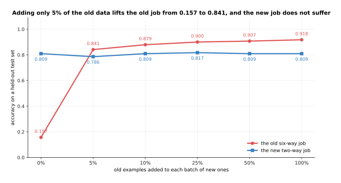

Mixing old data back in worked best, so this picture asks how much of it is needed. The
horizontal axis is how many old examples are added to each batch of new ones, as a
share of the batch. The two curves are the two jobs.

How little old data is needed is the surprising part. With none at all the old job ends
at 0.157. With only 5% it ends at 0.841, while the new job ends at 0.786 instead of
0.809. Going on to 25% gives 0.900, and 50% gives 0.907. The returns fall away quickly,
which is why the usual advice is to keep some of the pretraining data and mix a little
of it into every batch.

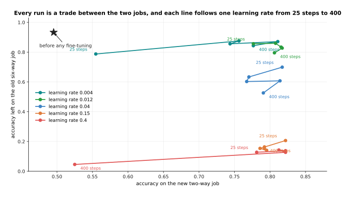

The last picture puts every run on one pair of axes. Every point is one complete
fine-tune, placed by how well it did on the new job and how much of the old job it kept.
Each line follows one learning rate as the run gets longer, from 25 steps to 400.

The gentlest learning rate, 0.004, stays between 0.787 and 0.875 on the old job, and
still reaches 0.811 on the new one. The two largest learning rates, 0.15 and 0.4, never
leave more than 0.206 of the old job, whatever is done about the number of steps. So
the setting that matters most is the size of the step. A fine-tune going badly is more
often going badly because the learning rate is too large than because it ran too long.

---

## 6. How much data a fine-tune needs

The last question everybody asks is how many examples a fine-tune needs. The honest
answer is a range, because it depends on which choice you made in section 1, and on how
far the new job is from the old one. The same simulated setup can measure all of that.

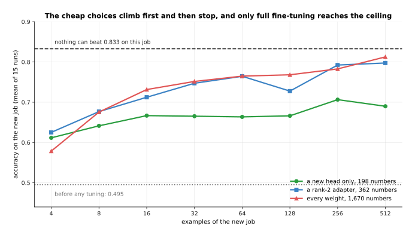

Each curve is one of the choices from section 1, averaged over fifteen runs. The
horizontal axis is how many examples of the new job the fine-tune was given. The dashed
line is the best accuracy anything could reach on this job, which is 0.833 because the
two groups of readings overlap. This page calls that best possible accuracy the ceiling
of a job.

Before any tuning the model scores 0.495, which is useless. Training a new head climbs
to about 0.68 and then stops, and it even moves downwards with more examples, because
the frozen features do not contain the distinction the new job needs, so more examples
only move the compromise the head settles on. A rank-2 adapter reaches 0.747 by 32
examples. A full fine-tune starts worst, at 0.579 with four examples, because it has the
most freedom and the fewest examples to constrain it, and it ends best, at 0.813 with
512. So fewer trainable numbers win when examples are scarce, and more trainable numbers
win when examples are plentiful.

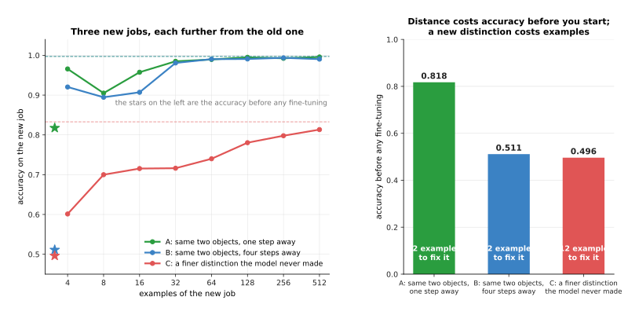

The three jobs in this picture differ in how far they are from what the model already
knew. The left panel is their learning curves. The right panel is where each one starts
before any training, with the number of examples it needed written inside the bar. The
target was to come within 0.03 of that job's own ceiling.

The first job is the same two objects moved one step away. The model already scores
0.818 on it before any training, so 32 examples finish it. The second job is the same
two objects moved four steps away. The model starts at 0.511 there, and still needs only
32 examples, because once it has seen a few the old distinction applies again. The third
job is a finer distinction the model never had to make. It starts at 0.496 and needs 512
examples. So distance in the obvious sense mostly costs accuracy before you start, while
what really costs examples is a distinction the pretrained model never learned.

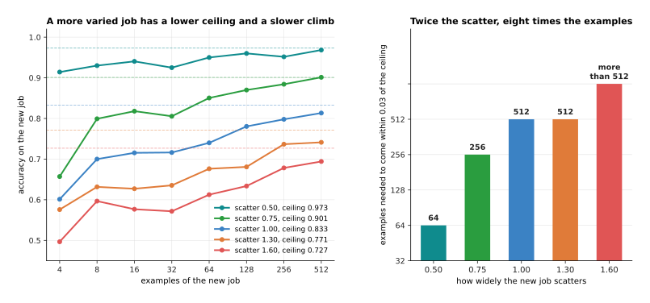

Here the new job is held at the same distance, and only its own variety changes. Variety
means how widely one object's readings scatter around their average. The left panel
shows the learning curves, and the right panel shows how many examples each job needed
to come within 0.03 of its own ceiling.

A job whose readings scatter by 0.50 has a ceiling of 0.973 and reaches it with 64
examples. The same job scattered by 1.00 has a ceiling of 0.833 and needs 512 examples.
Scattered by 1.60 it does not get there within 512 examples at all. So doubling the
variety multiplied the examples needed by eight. That is the mechanism behind the advice
to collect examples covering every lighting condition, gripper, table and object
position you intend to meet.

Putting the three measurements together gives you a way to reason, rather than a number
to quote. If the new job is the old job in a new style, so that the model already does
better than chance, then tens to a few hundred examples on a small adapter are usually
enough. If the new job needs a distinction the model never had to make, expect
thousands of examples, and expect a plain head to fail however many you collect. And
whatever the job, the examples have to cover its variety, because a model only learns
the conditions its examples contained.

---

## 7. Where to read next

- [Making a model smaller and faster](04_making-a-model-smaller-and-faster.md) is the
  next page, and it explains the quantisation section 4 used here, together with
  distillation and pruning.
- [Self-supervised pretraining](01_self-supervised-pretraining.md) is where the model
  you are fine-tuning came from, and what a frozen backbone already knows.
- [Scale, data and compute](02_scale-data-and-compute.md) gives the arithmetic behind
  section 1's FLOP counts.
- [Post-training a language
  model](../10_language-and-multimodal-models/02_post-training-a-language-model.md)
  uses these methods to turn a raw pretrained model into one that follows instructions.
- [Vision-language-action
  models](../12_models-that-act/03_vision-language-action-models.md) shows a robot
  model that is almost always reached by fine-tuning something larger.
- [Fine-tuning](../../07_learned-models/10_making-models-work-on-an-arm/02_most-used/01_fine-tuning.md)
  in the models catalogue gives the same choice from the robot's side, and
  [prompting with a demonstration](../../07_learned-models/10_making-models-work-on-an-arm/03_also-used/02_prompting-with-a-demonstration.md)
  beside it shows the first choice at its current limit.

---

## 8. Using it in Python

Sections 1 to 3 counted trainable weights by hand. This section does the same counting
with real libraries, because those counts are what you should check before starting a
run that will take hours.

```python
import torch
from torch import nn
from peft import LoraConfig, get_peft_model

# Section 2's arithmetic, as a function of the stated shape.
d, layers, d_ff, vocab = 4096, 32, 11008, 32000
block = 4 * d * d + 3 * d * d_ff + 2 * d       # attention + feed-forward + norms
total = vocab * d + layers * block + d + vocab * d
print(f'{total:,}')                            # 6,738,415,616

# Section 2's memory recipe: 2 bytes for a frozen weight, 12 for a trained one.
def gib(frozen, trainable):
    return (frozen * 2 + trainable * 12) / 2 ** 30
print(f'{gib(total, 0):.2f} GiB')              # 12.55 GiB, weights only
print(f'{gib(0, total):.2f} GiB')              # 75.31 GiB, full fine-tune

# Section 3, on one attention matrix: the adapter is two thin matrices.
rank = 8
print(f'{2 * rank * d:,} of {d * d:,}')        # 65,536 of 16,777,216

# The same thing on a real model, with peft doing the work.
class Block(nn.Module):                        # a stand-in for one real block
    def __init__(self):
        super().__init__()
        self.q_proj = nn.Linear(d, d, bias=False)

config = LoraConfig(r=rank, lora_alpha=16, target_modules=['q_proj'])
model = get_peft_model(Block(), config)
model.print_trainable_parameters()
# trainable params: 65,536 || all params: 16,842,752 || trainable%: 0.3891

merged = model.merge_and_unload()              # section 3's folding
print(sum(p.numel() for p in merged.parameters()))   # 16,777,216
```

The first three blocks are plain arithmetic that runs on any laptop. They are worth
running before you rent a machine, because they say in one second whether the fine-tune
you are planning will fit in the memory you are about to pay for.

The fourth block is where the library does the real work. `get_peft_model` walks through
the model and finds every layer whose name matches `target_modules`. It puts a pair of
thin matrices beside each one, and marks every other weight so that training ignores it.
It then arranges the forward pass so that the side path is added with the alpha over
rank factor from section 3. `merge_and_unload` folds the product back into the frozen
weights afterwards, and gives you an ordinary model that runs at the original speed. For
a base stored in 4 bits, the model is loaded with `bitsandbytes` first, and the same
adapter code applies without any change.

What you still decide is everything this page has been about. You decide which of the
five choices to make, and if it is LoRA, the rank and the matrices to attach to, which
set the counts in section 3. You decide the learning rate and the number of steps, which
section 5 showed to be the main control over forgetting. And you decide how many
examples to collect and how widely to spread them, which section 6 showed depends on how
far your job is from the pretrained one.
