# Making a model smaller and faster

The page before this one, [fine-tuning and
adapters](03_fine-tuning-and-adapters.md), ended with a model that does your job. It
quietly assumed that the model could be run at all. On a desk with a graphics card
that assumption is safe. On a robot it is not, because a robot carries a small
computer with a few gigabytes of memory, and it has to answer within a few tens of
milliseconds so that the arm keeps moving. This page is about the step after
fine-tuning, which is making a trained model small enough and fast enough to live on
the machine that uses it.

There are three methods. They are not alternatives, because they work on different
things and you can use all three together. **Quantisation** stores each weight in fewer
bits. A weight is one of the numbers inside the model. **Distillation** trains a smaller
model to copy a larger one. **Pruning** throws weights away. Running a model on the
robot's own computer rather than on a server is called **edge inference**, and
everything here serves that.

By the end of this page you will know why a large model does not fit on a robot, how a
number is stored in 8 or 4 bits and what that costs in accuracy, when to round the
weights during training instead of afterwards, how a small model is taught by a large
one, why most pruning does not make anything faster, and what happens when the three
methods are used one after the other.

The page assumes you have read the chapter so far, so you know what a parameter is,
what a floating-point operation (FLOP) is, and what the softmax turns a model's raw
outputs into. The one new idea is that a number need not be stored in 32 bits.

Every number in the pictures is worked out by
`docs/diagrams/pretraining_and_adapting_2.py`. The parameter counts and memory sizes
are exact arithmetic on one stated transformer shape, which is 32 blocks of width 4096,
with a feed-forward inner width of 11008 and a vocabulary of 32000. The memory
bandwidth, the arithmetic rate and the robot's memory are stated assumptions. The
quantisation, distillation and pruning experiments are real runs on a small network
trained in NumPy on simulated readings of six objects.

## Contents

1. [What has to fit on the robot's own computer](#1-what-has-to-fit-on-the-robots-own-computer)
2. [Quantisation from first principles](#2-quantisation-from-first-principles)
3. [Where the scale comes from, and when to choose it](#3-where-the-scale-comes-from-and-when-to-choose-it)
4. [Distillation: learning from the teacher's whole answer](#4-distillation-learning-from-the-teachers-whole-answer)
5. [Pruning, and why scattered zeros are rarely faster](#5-pruning-and-why-scattered-zeros-are-rarely-faster)
6. [What each method costs and what it buys](#6-what-each-method-costs-and-what-it-buys)
7. [Where to read next](#7-where-to-read-next)
8. [Using it in Python](#8-using-it-in-python)

---

## 1. What has to fit on the robot's own computer

Before choosing a method it is worth being exact about what is too big. There are three
separate limits. The model has to fit in memory, it has to be read fast enough, and it
has to finish before the arm needs its next command. The stated model from
the last page, with 6,738,415,616 weights, fails all three.

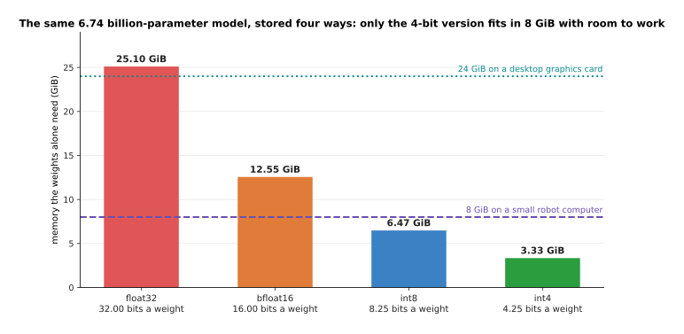

The four bars are the same model stored four ways. The two lines are the two machines
it might have to fit on: a small robot computer with 8 GiB of memory shared with
everything else, and a desktop graphics card with 24 GiB.

Stored at 32 bits a weight the model needs 25.10 GiB, which fits on neither. At 16 bits
it needs 12.55 GiB, which fits on the card but not on the robot. At 8 bits, plus a small
allowance for the scales that section 3 explains, it needs 6.47 GiB, which fits inside
8 GiB with little room left. At 4 bits it needs 3.33 GiB, and that is the first size
which leaves the robot room for its pictures, its program and the model's working
memory at the same time.

Memory is not only a question of fitting, because the model has to be read as well as
stored, and reading it is usually what sets the speed.

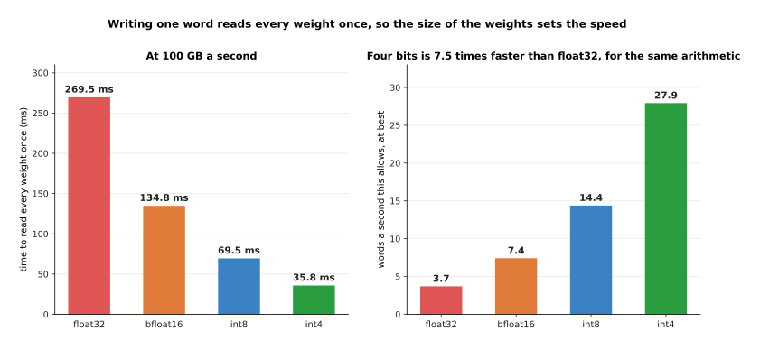

Writing one word with a transformer reads every weight in the model exactly once. So
the time that takes is simply the size of the weights divided by how fast the machine
can read its memory, which is assumed here to be 100 GB a second. The two panels are
that one measurement written two ways: on the left as a time, and on the right as the
number of words a second it allows.

At 16 bits a weight the model is 13.48 GB, so reading it once takes 134.8 ms, which
allows at best 7.4 words a second. At 8 bits it takes 69.5 ms and allows 14.4 words a
second. At 4 bits it takes 35.8 ms and allows 27.9. Nothing in that calculation involves
arithmetic at all, and that is the point. A model writing one word at a time is usually
waiting for memory rather than waiting for multiplication, which is why fewer bits makes
it faster as well as smaller.

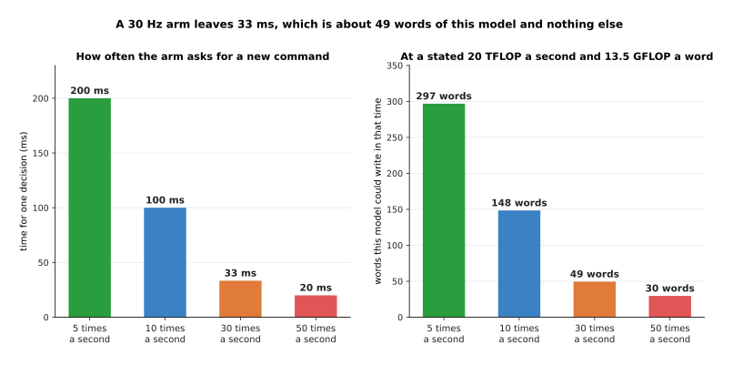

The third limit is time. The left panel is how long one decision may take, if the arm
asks for a new command a given number of times a second. The right panel turns that same
time into words of this model, assuming the robot's accelerator does 20 TFLOP a second.

A forward pass costs about 13.5 GFLOP for each word. So a loop running 10 times a second
leaves 100 ms, which is 2,000 GFLOP, or about 148 words. A loop running 30 times a
second leaves 33 ms, which is about 49 words, with nothing left for the camera, the
planner or the safety checks. A large model therefore cannot sit inside a fast control
loop. It has to be called less often, with its answers reused in between, which is one
reason the action-chunking idea exists in [models that
act](../12_models-that-act/01_behaviour-cloning-and-action-chunks.md).

---

## 2. Quantisation from first principles

Section 1 assumed a weight could be stored in 8 bits or in 4. This section says what
that means and what it costs, using 48 real weights taken from one output channel of a
network that was actually trained. A channel here is one column of a weight matrix,
which holds all the weights that feed one output.

A weight is normally stored as a float32, which is 32 bits holding a very wide range of
values to about seven decimal places. That precision is wasted, because the weights in
one channel all sit in a narrow band. Here the smallest is -0.47174 and the largest is
+0.57539, so the largest size of any of them, ignoring the sign, is 0.57539.
**Quantisation** uses that fact. It picks a **step size**, replaces each weight by the
whole number of steps nearest to it, and stores only that whole number.

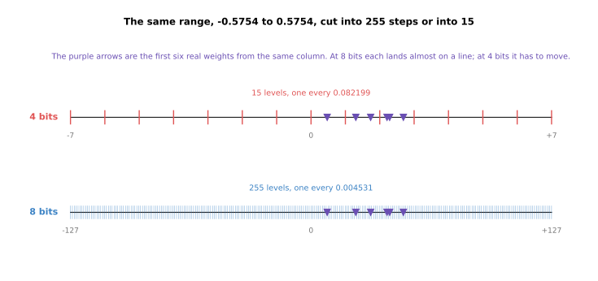

Both lines cover the same range, from -0.57539 to +0.57539. The only difference between
them is how finely that range is cut.

A 4-bit signed integer holds the whole numbers from -7 to +7, which is 15 levels. So the
step is 0.57539 divided by 7, which is 0.082199. An 8-bit integer holds -127 to +127,
which is 255 levels and a step of 0.004531. The number that every stored integer is
multiplied by to get a weight back is called the **scale**, and here the scale is the
step size itself.

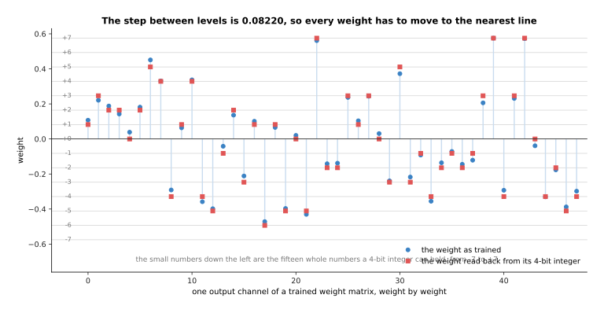

Each blue point is one weight as training left it. Each red square is where that weight
ends up once it has been turned into a 4-bit integer and back again. Every weight has to
move to the nearest horizontal line.

Take the first weight, which is +0.1071. Dividing it by the 4-bit step of 0.082199 gives
1.30, which rounds to the integer 1. So what is stored is the single number 1, and
reading it back gives 0.0822. At 8 bits the same weight is divided by 0.004531 to give
23.6, which rounds to 24 and reads back as 0.1087. The first eight weights become the
integers 1, 3, 2, 2, 0, 2, 5 and 4 at four bits, and 24, 49, 42, 31, 9, 40, 100 and 73
at eight. The fifth one is worth noticing, because +0.0387 becomes 0 at four bits and
reads back as exactly nothing. That is the cost of quantisation.

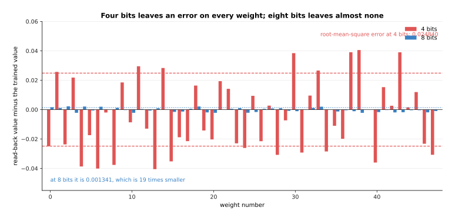

Each pair of bars is one weight, and the height of a bar is how far the read-back value
is from the value that training left there. The dashed lines mark the root-mean-square
error, which is the typical size of those bars, worked out by squaring them, averaging,
and taking the square root.

At 4 bits the worst weight is out by 0.040540, and the root-mean-square error over the
48 weights is 0.024840. At 8 bits the worst is out by 0.002239 and the root-mean-square
error is 0.001341, which is 18.5 times smaller. That ratio is not an accident, because
every extra bit doubles the number of levels and so halves the step.

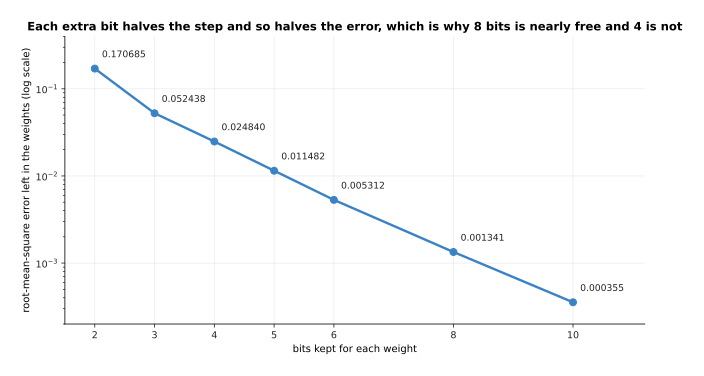

The vertical axis is logarithmic, so a straight line means that each extra bit
multiplies the error by a fixed factor. Here that factor is close to a half.

The error is 0.1706854 at two bits, 0.0248399 at four, 0.0013408 at eight and 0.0003551
at ten. So going from eight bits to four multiplies it by 18.5, which is why 8-bit
storage is usually described as free and 4-bit storage is not. Whether that error
matters is a separate question, and section 3 answers it by measuring accuracy instead,
because a network can still work correctly when its weights are slightly wrong.

---

## 3. Where the scale comes from, and when to choose it

Section 2 used one scale for one column of weights. That was a choice rather than a
necessity. This section shows what the choice is worth, and then asks whether the
rounding should happen after training or during it.

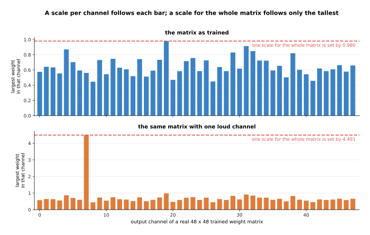

Each bar is one output channel of a real trained weight matrix, and its height is the
largest weight in that channel. That height is what a scale for that channel would be
set from. The two panels are the same matrix twice: as training left it on top, and with
one channel made eight times larger underneath.

If the whole matrix shares one scale, that scale is set by the largest weight anywhere
in the matrix, which here is 0.980. Every other channel then uses only part of the
levels available to it. The quietest channel's own largest weight is 0.446, so it uses
46% of the levels, and the typical channel uses 63%. Giving each channel its own scale
fixes that waste, and doing so is called **per-channel quantisation**. The lower panel
shows why it matters in practice. Real trained networks often have a few channels whose
weights are much larger than the rest, and here one channel has been made eight times
larger. That single channel raises the shared scale to 4.491, which wastes most of the
levels for every other channel.

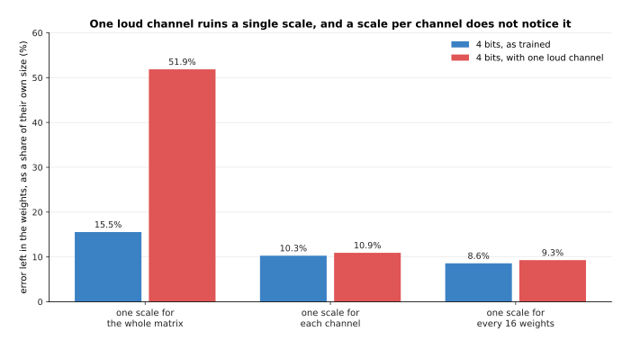

The bars are the error left in the weights after storing them in 4 bits and reading them
back, as a share of the typical size of the weights themselves. Each group of two bars
is one choice of scale, measured on both matrices.

On the matrix as trained, one scale for the whole matrix leaves 15.5% error, one scale
per channel leaves 10.3%, and one scale for every group of 16 weights leaves 8.6%. On
the matrix with one large channel, the shared scale leaves 51.9%, which destroys the
matrix, while the per-channel scale leaves 10.9% and the grouped scale 9.3%. So finer
scales cost a little storage, and they buy protection from exactly the unevenness that
trained networks have.

The second question is when the rounding happens. **Post-training quantisation** means
training the model normally and rounding the finished weights, which is what everything
above has done. The alternative is to let the model know during training that its
weights will be rounded. The forward pass uses rounded weights, while the updates are
applied to an unrounded copy that is kept alongside. Training then settles on weights
that survive rounding, and this is called quantisation-aware training.

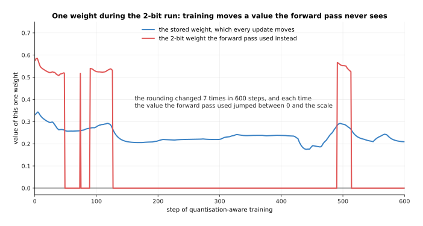

This picture follows one single weight through a 2-bit quantisation-aware training run,
which is the same run the 2-bit point of the next picture comes from. The blue line is
the value stored for that weight, which every update moves by a small amount. The red
line is the value the forward pass actually used, which is the blue value rounded to one
of the levels the 2-bit format allows.

The stored value starts at +0.3308 and ends at +0.2092, and it moves smoothly the whole
way. The rounded value does not move smoothly. It changed 7 times in 600 steps, each
time jumping between zero and the scale of its channel. This is what quantisation-aware
training is: the gradient is worked out from the rounded weight that the network
actually used, and it is then applied to the unrounded weight that nobody sees. Over a
run, the unrounded weights drift towards values that round well.

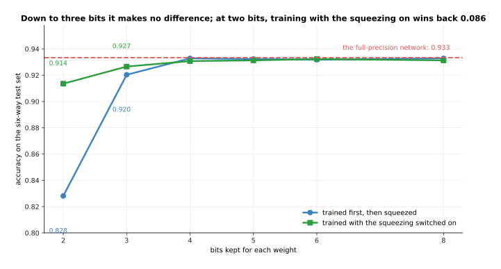

The two lines are the same small network, measured on the same test set. The dashed line
is what it scored before any rounding.

The network scores 0.933 in full precision. Rounded after training with one scale per
channel, it still scores 0.933 at 8 bits, 0.933 at 4 bits and 0.920 at 3 bits, and only
at 2 bits does it fall, to 0.828. Trained with the rounding applied, it scores 0.927 at
3 bits and 0.914 at 2. So the extra work is worth nothing until the weights get very
small indeed, and then it is worth 0.086. That is why post-training quantisation is what
you try first, and quantisation-aware training is what you reach for when 4 bits is not
small enough.

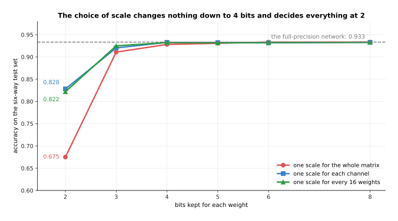

This repeats the choice of scale from earlier in the section, but measured as accuracy
rather than as error in the weights, because accuracy is what you actually care about.

Measured this way, the choice of scale makes no difference down to 4 bits, where a
shared scale gives 0.928 against 0.933 for a scale per channel. At 2 bits it makes an
enormous difference, where a shared scale gives 0.675 against 0.828 for a scale per
channel and 0.822 for groups of 16.

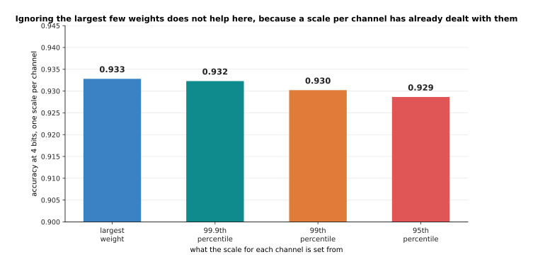

There is one more obvious idea to test, and this picture tests it. Instead of setting
each channel's scale from its largest weight, set it from a weight a little below the
largest, so that ordinary weights get finer steps and the few extreme ones are cut off
at the end of the range. Each bar is one such choice.

It does not help here. Setting the scale from the largest weight gives 0.933, from the
99th largest out of a hundred gives 0.930, and from the 95th gives 0.929. Cutting off
the range only pays when a few extreme values are stretching it, and a scale per channel
has already dealt with that.

---

## 4. Distillation: learning from the teacher's whole answer

Quantisation keeps the model and shrinks its numbers, and that has a floor, because
below about 3 bits a weight the accuracy falls sharply. The other direction is to shrink
the model itself. The way to do that, without simply training a small model badly, is
**distillation**, which trains a small model to copy a large one. The large model is
called the **teacher** and the small one the **student**.

The obvious way to train a small model is on the same labelled examples the teacher saw.
Distillation does something better, for a reason that is worth seeing on one real
example.

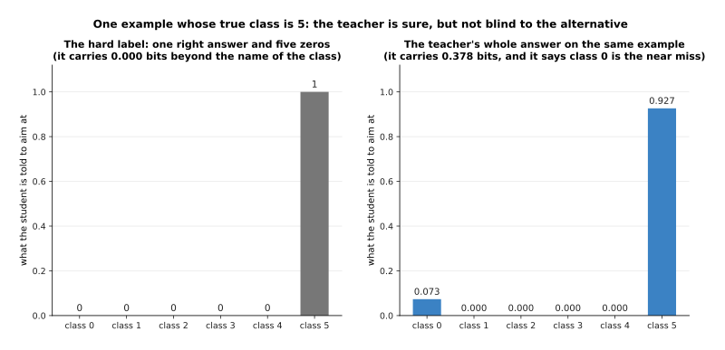

Both panels describe the same example, and both show what the student is told to aim at.
The left panel is what the hard label says, and the right panel is what the teacher
says.

The example's true class is 5. The hard label is a 1 in one place and a 0 in the other
five. The teacher's raw outputs are +19.76, -2.89, -3.20, -10.16, -14.66 and +22.30,
which the softmax turns into 0.927 for class 5 and 0.073 for class 0, with the other
four effectively zero. So the teacher says something the label cannot say, which is that
this reading is a class 5, but it looks a little like a class 0 and nothing like the
rest. These probabilities are called **soft targets**. The teacher's answer carries 0.378
bits of information, while the hard label carries none beyond naming the class.

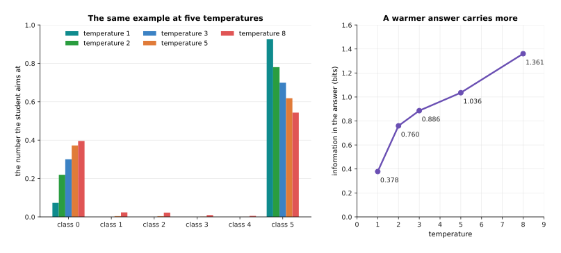

The left panel shows that same teacher answer flattened by five different temperatures,
and the right panel measures how much the flattened answer then carries. The right panel
is a summary of the left one, measured in bits.

The trouble is that a well-trained teacher is usually very sure. Most of its answers are
one number near 1 and five near zero, and the extra information hides in numbers too
small to matter to training. Dividing the raw outputs by a number greater than one,
before the softmax, flattens the answer, and that number is called the **temperature**.
At temperature 1 this example gives 0.927 and 0.073, and carries 0.378 bits. At
temperature 3 it gives 0.699 and 0.300, and carries 0.886 bits. At temperature 8 it gives
0.544 and 0.396, and carries 1.361 bits. The student is trained on the flattened answer
and then used normally, so the temperature exists only during training.

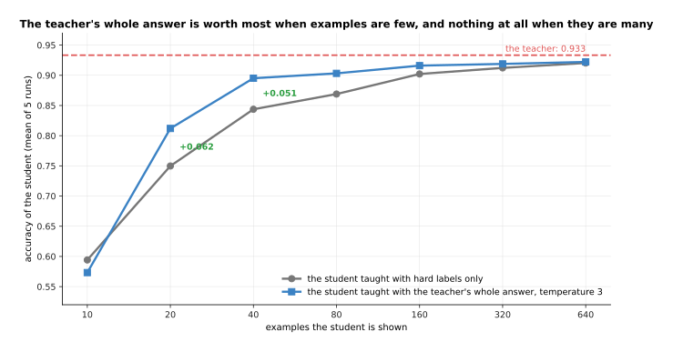

Both curves are the same small student network, trained on the same examples. The only
difference is what it was told to aim at. The dashed line is the teacher it is copying.

With 20 examples the student reaches 0.750 from hard labels and 0.812 from the teacher's
answers. With 40 it reaches 0.844 and 0.895. With 640 the two meet, at 0.920 and 0.922.
Those numbers say when distillation is worth the trouble. The teacher's answer carries
more information per example, so it is worth most when examples are few, and worth nothing once there are
enough examples for the hard labels to say the same thing. The second useful consequence
is that distillation examples need no labels at all, because the teacher supplies the
target. So you can distil on any set of unlabelled recordings you already have.

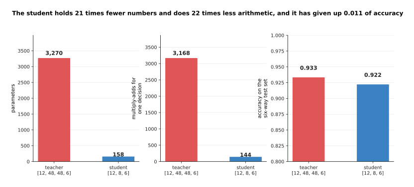

The three panels are the same two networks measured three ways: what the student saves
in storage, what it saves in arithmetic, and what it gives up in accuracy on the same
test set.

The teacher holds 3,270 parameters and does 3,168 multiply-adds for one decision. The
student holds 158 parameters and does 144 multiply-adds. So the student is 20.7 times
smaller and does 22.0 times less arithmetic, and for that it gives up 0.011 of accuracy,
scoring 0.922 against 0.933. The trade is good because the student was not trained on
the task from nothing. It was trained to copy a model that had already found a good
answer, which is a much easier thing to learn.

---

## 5. Pruning, and why scattered zeros are rarely faster

Distillation builds a smaller model from nothing, which takes a training run. **Pruning**
instead takes the model you already have and throws weights away, which sounds cheaper.
This section explains why it usually is not. The simplest kind is magnitude pruning,
which sets the smallest weights to zero, on the grounds that a weight near zero was
barely contributing anything.

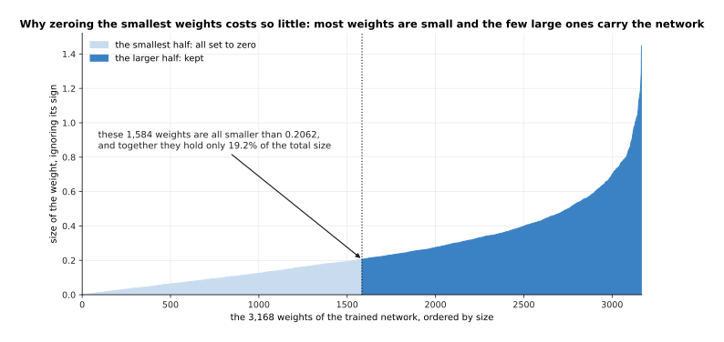

This picture says why magnitude pruning is reasonable at all. Every weight of the small
trained network is drawn as one point, ordered from the smallest to the largest, with
the sign ignored. The pale part on the left is the half that magnitude pruning would set
to zero.

The largest weight in the network is 1.4493. The smallest half of the weights are all
below 0.2062, and together they hold only 19.2% of the total size of all the weights.
Taking 70% of them away still only removes 39.0% of the total size. So a network stores
most of what it knows in a few large weights, and the many small ones carry much less
than their number suggests.

The question is what zeroing them actually buys.

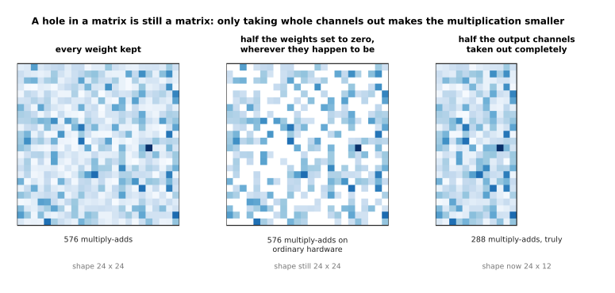

The three pictures are the same matrix, pruned in two different ways, with the number of
multiply-adds each one actually costs written underneath.

The middle picture has half its weights set to zero, but the matrix is still 24 by 24.
So the hardware still performs 576 multiply-adds, because an ordinary matrix
multiplication has no way to skip zeros. This is **unstructured sparsity**, and it saves
nothing unless both the library and the chip know how to skip. The right-hand picture
removes twelve whole output channels, so the matrix really is 24 by 12 and really does
cost 288 multiply-adds. That is **structured pruning**, and it is what actually makes a
model faster.

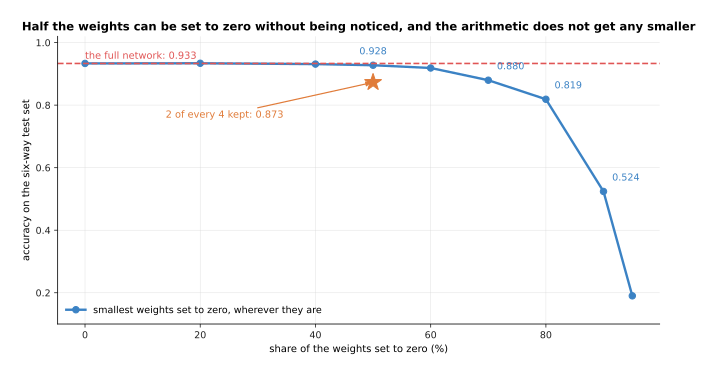

This picture prunes weights wherever they happen to be, which saves no arithmetic, and
measures what it costs in accuracy.

Pruning this way costs very little accuracy at first. The network scores 0.933 whole, 0.928 with
half its weights zeroed, and 0.880 with 70% zeroed. It only collapses past 90%, where it
reaches 0.524.

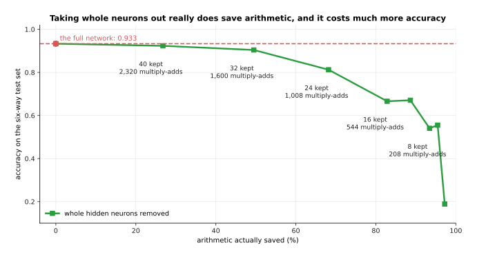

This picture removes whole hidden neurons instead, so that the matrices really do get
smaller. The horizontal axis is therefore different: it is the arithmetic actually
saved, not the share of weights set to zero.

Removing whole neurons costs much more for the same saving. Keeping 32 of the 48 hidden
neurons saves 49.5% of the arithmetic and costs 0.029 of accuracy. Keeping 16 saves
82.8% and costs 0.267. Putting the two pictures together gives the
summary of pruning: the zeros you can place freely are cheap in accuracy and worth
nothing in speed, and the zeros that are worth something in speed are expensive in
accuracy.

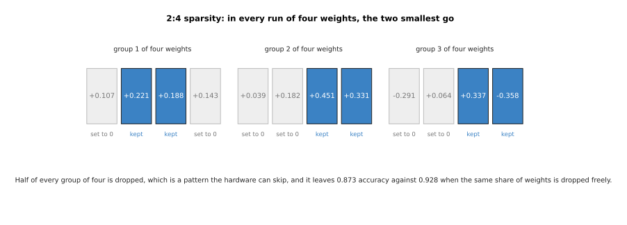

There is a middle way, which is a pattern regular enough that hardware can be built to
skip it. The usual one keeps exactly two weights out of every run of four, and the
picture shows it applied to three groups of real weights.

In the first group the weights are +0.107, +0.221, +0.188 and +0.143, so the two largest
are kept and the other two are set to zero. This is 2:4 sparsity. It is exactly 50%
zeros, and some recent graphics hardware can skip it and run such a matrix about twice
as fast. It scores 0.873, against 0.928 when the same share of weights is dropped
freely, so the pattern cost 0.055 of accuracy.

---

## 6. What each method costs and what it buys

The three methods have now been measured one at a time on the same small network. This
section puts them side by side, and then shows that they are not a choice between
methods but a sequence of them.

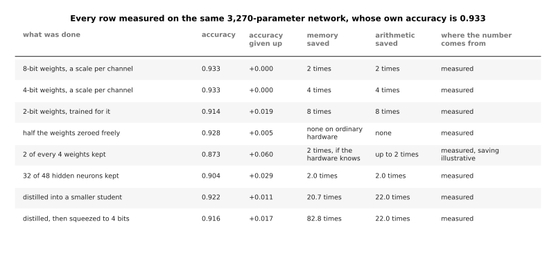

Read each row as one thing done to the same 3,270-parameter network, whose own accuracy
is 0.933. The second column is what that row scored and the third is what it gave up.
The fourth and fifth columns are what it saved. The last column says whether the saving
was measured here or is an illustration of what real hardware would give.

The rows that cost nothing are the quantisation ones. Weights in 8 bits and weights in
4 bits, both with a scale per channel, score 0.933. Weights in 2 bits with
quantisation-aware training score 0.914 for eight times less memory. Half the weights
zeroed freely scores 0.928 and saves nothing you can use. Keeping two of every four
scores 0.873, and would save up to two times on hardware that knows the pattern, which
is the one row whose saving is an illustration rather than a measurement. Keeping 32 of
48 hidden neurons scores 0.904 for two times less of both memory and arithmetic.
Distilling scores 0.922 for 20.7 times less memory.

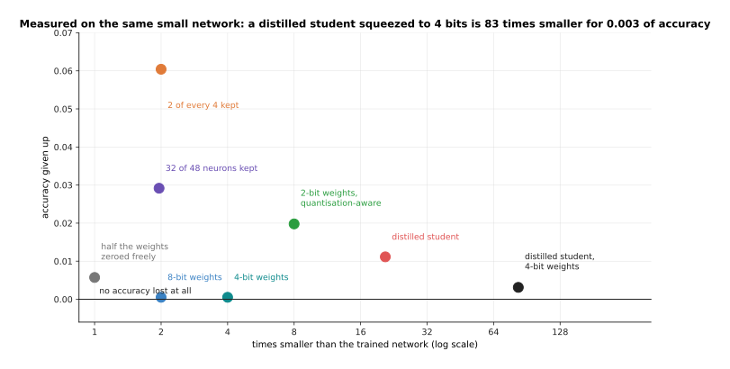

Every point is one method from the table, placed by how much smaller it made the model
and how much accuracy it gave up. The best methods are therefore low down and far to the
right.

The ranking is plain. Quantising to 8 or 4 bits lies on the zero line at the bottom,
giving up nothing. Free pruning sits at one times smaller, because it bought nothing. Distillation
is far to the right, at 20.7 times smaller for 0.011 of accuracy. The point furthest to
the right is not a method at all. It is two methods used one after the other.

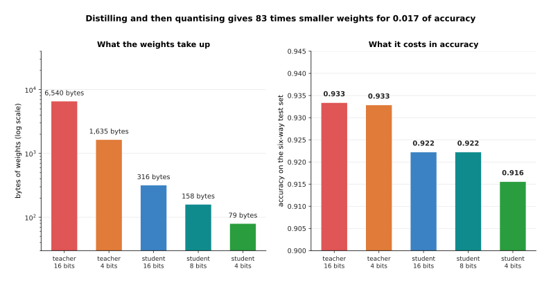

The five bars are the same five models in both panels. The left panel measures the bytes
their weights take, and the right panel measures the accuracy they reach, so the two
panels are the cost and the benefit of the same five choices.

The float teacher's weights take 6,540 bytes and it scores 0.933. The distilled
student's weights take 316 bytes for 0.922. Storing that student in 4 bits takes it to
79 bytes and 0.916. So the two methods together give weights 83 times smaller and 22
times less arithmetic, for 0.017 of accuracy, of which distillation cost 0.011 and the
last fourfold shrink cost the other 0.006. That is also the order people use them in,
because distilling changes the shape of the model, and quantising then works on whatever
shape it is given.

Two cautions belong with that number. The first is that this is a small network on a
simulated job, so the shape of the result is trustworthy and the exact figures are not.
A real model has to be measured on its real job after every step, which is what [running
and evaluating a
model](../14_using-a-model-for-real/01_running-and-evaluating-a-model.md) is about. The
second is that memory saved is not automatically time saved, because a 4-bit weight has
to be turned back into an ordinary number before it can be multiplied. A model four
times smaller and no faster is a common and disappointing result, and the only way to
know is to measure the time it takes.

---

## 7. Where to read next

- [Diffusion](../08_models-that-generate/01_diffusion.md) is the next page, and it
  starts a new chapter on models that generate something rather than name it.
- [Fine-tuning and adapters](03_fine-tuning-and-adapters.md) is the page before this
  one, and its QLoRA section uses quantisation for training rather than for deployment.
- [Scale, data and compute](02_scale-data-and-compute.md) explains the FLOP counts
  behind section 1's speed arithmetic.
- [Running and evaluating a
  model](../14_using-a-model-for-real/01_running-and-evaluating-a-model.md) covers
  what happens next, which is exporting the smaller model and measuring it honestly.
- [Vision backbones](../09_models-that-see/01_vision-backbones.md) is where the
  teacher and student of section 4 usually come from, because a small distilled vision
  backbone is the most common thing to put on an arm.
- [Running a model on a
  robot](../../07_learned-models/10_making-models-work-on-an-arm/02_most-used/02_running-a-model-on-a-robot.md)
  in the models catalogue gives the same subject from the robot's side.

---

## 8. Using it in Python

Section 2 worked out the step size and the integers by hand. This section does the same
with PyTorch, because seeing the arithmetic written out removes most of the mystery from
the word quantisation.

```python
import torch

# Section 2: one real column of trained weights becomes 4-bit integers.
w = torch.tensor([0.1071, 0.2209, 0.1880, 0.1426, 0.0387, 0.1818, 0.4511, 0.3308])
amax = 0.57539                       # the largest size in the whole column
scale4 = amax / 7                    # a 4-bit signed integer runs from -7 to +7
q4 = torch.clamp(torch.round(w / scale4), -7, 7)
print(q4.tolist())                   # [1.0, 3.0, 2.0, 2.0, 0.0, 2.0, 5.0, 4.0]
print(f'{(q4 * scale4 - w).abs().max():.4f}')    # 0.0401, the worst of these eight

# Section 3: one scale for the whole matrix against one scale for each channel.
m = torch.randn(48, 48) * 0.3
m[:, 7] *= 8.0                                   # one much larger channel
def rms(a): return a.pow(2).mean().sqrt()
def quant(x, s): return torch.clamp(torch.round(x / s), -7, 7) * s
flat = quant(m, m.abs().max() / 7)
per_channel = quant(m, m.abs().amax(dim=0, keepdim=True) / 7)
print(f'{rms(flat - m) / rms(m):.3f}  {rms(per_channel - m) / rms(m):.3f}')

# Section 4: the soft targets a teacher gives, at two temperatures.
logits = torch.tensor([19.76, -2.89, -3.20, -10.16, -14.66, 22.30])
print([f'{v:.3f}' for v in torch.softmax(logits, 0)])
# ['0.073', '0.000', '0.000', '0.000', '0.000', '0.927']
print([f'{v:.3f}' for v in torch.softmax(logits / 3, 0)])
# ['0.300', '0.000', '0.000', '0.000', '0.000', '0.700']
```

The first block is section 2 exactly, and its printed integers and worst error are the
numbers the pictures carry. The second block is section 3's comparison, run on a random
matrix rather than a trained one, so the printed fractions will not match the measured
51.9% and 10.9%, although the gap between the two will be of the same kind. The third
block is section 4's example, and the two printed lists are the first and third rows of
the temperature picture, with the last digit differing because the raw outputs are
written here to two decimal places.

What the libraries do is all of that, written out efficiently and for a whole model at
once. In PyTorch the usual route is `torch.ao.quantization` for 8-bit work,
`bitsandbytes` for the 4-bit weights QLoRA uses, and an export to a runtime such as ONNX
Runtime or TensorRT when the model goes on a robot. Distillation needs no special
library, because the training loop is an ordinary one with a different target.
`torch.nn.utils.prune` sets weights to zero while leaving the shapes alone, so the actual
shrinking of the matrices is something you do yourself.

What you still decide is the part no library can decide. You choose how many bits, and
section 3 showed that 8 is free, 4 is nearly free, and 2 needs a training run. You choose
how finely the scales are shared. You choose whether to distil, which costs a training
run and a teacher, but reaches savings quantisation cannot. And you decide what accuracy
you will give up, which is a question about your robot rather than about your model,
because the difference between 0.933 and 0.922 means nothing until somebody says what a
failed grasp costs.
