# Diffusion: making an answer out of noise

The page before this one, [making a model smaller and
faster](../07_pretraining-and-adapting/04_making-a-model-smaller-and-faster.md),
finished a run of pages about getting a trained model ready to use. Every one of
those pages assumed one thing without saying it. The assumption was that the
model's job is to look at an input and give back the one right answer. This page
is where that assumption breaks. Many of the jobs a robot arm has to do have
several right answers at the same time. A model that gives back one answer for
such a job gives back a wrong one.

So this page answers three questions. First, why is making something up a
different job from predicting it? Second, how does a **generative model** work? A
generative model is a model that produces a whole new example, instead of
producing one number for one input. Third, what does the most widely used kind of
generative model cost in time? That kind is called **diffusion**, and the word
means spreading out, because the method works by spreading the data out into
random noise and then pulling it back together again.

This page is for a reader who knows what a [neural
network](../02_inside-a-network/01_one-neuron.md) is, what a
[loss](../03_how-training-works/01_the-score-of-being-wrong.md) is, and what
[training](../03_how-training-works/04_the-training-loop.md) does. It assumes you
have never met a generative model before, so every new word is explained where it
first appears.

By the end you will understand why an ordinary trained network answers with the
average of two good answers, how adding noise in small steps turns data into
something easy to copy, how one network trained to name that noise can be run
backwards to make new data, how to tell such a model what to produce, and how
many times the network has to run before an answer comes out.

Everything below is worked through on one example that you can see all of at
once. A robot arm moves its gripper past a round obstacle. The recorded
demonstrations go either above the obstacle or below it. Each waypoint is a point
in two dimensions, so every step of the method can be drawn on paper. A waypoint
is one recorded position of the gripper along the path. The data is simulated,
which means a program made it rather than a real arm. Every number in every
picture is worked out and printed by `docs/diagrams/models_that_generate.py`. The
timings were measured on the machine that drew the pictures, so they move a
little from one run to the next.

## Contents

1. [Why generating is a different job from predicting](#1-why-generating-is-a-different-job-from-predicting)
2. [Adding noise, one small step at a time](#2-adding-noise-one-small-step-at-a-time)
3. [Training one network to name the noise](#3-training-one-network-to-name-the-noise)
4. [The reverse walk, from a round blob back to the arcs](#4-the-reverse-walk-from-a-round-blob-back-to-the-arcs)
5. [Conditioning: the same denoiser told what to make](#5-conditioning-the-same-denoiser-told-what-to-make)
6. [Guidance: pushing further in the direction the condition adds](#6-guidance-pushing-further-in-the-direction-the-condition-adds)
7. [The cost: many passes through the network instead of one](#7-the-cost-many-passes-through-the-network-instead-of-one)
8. [Where to read next](#8-where-to-read-next)
9. [Using it in Python](#9-using-it-in-python)

---

## 1. Why generating is a different job from predicting

Every model in this book so far was trained in the same way. You show the model
an input. You ask it for an answer. You then score how far that answer is from
the right one. This works whenever there is one right answer. However, it fails
as soon as there are two right answers, and the example below is the smallest
honest case of that failure.

The first picture shows the recorded data. The two colours mark which way round
the obstacle each demonstration went.


The 6,000 recorded gripper waypoints form two separate arcs, because 2,959 of the
demonstrations went above the obstacle and 3,041 went below it.

The arm starts on the left and finishes on the right. It must not touch the round
obstacle in the middle, which has a radius of 0.5 m. Both ways round are correct,
and nobody prefers one over the other. So the recorded demonstrations hold both
ways. The points spread 0.984 m across and 0.793 m up. Now look at the place
where the two answers are furthest apart. That place is directly above and
directly below the obstacle.

The next picture takes a narrow vertical band of the data at that place. It shows
the average of the points above, the average of the points below, and the average
of all of them together.


In the narrow band where the forward position is within 0.15 m of zero, the
waypoints above average y = +1.408 m and those below average y = -1.417 m, while
the average of all of them together sits at y = +0.109 m, inside the obstacle.

There are 275 waypoints above in that band and 234 below. That is why their
average is not exactly zero. However, the imbalance makes no difference to the
argument. The average answer is 0.109 m from the centre of an obstacle whose
radius is 0.5 m, so it is well inside the one place the gripper must never be.
The two right answers are both far from the obstacle, and the point halfway
between them is inside it. A network trained in the ordinary way does not merely
risk giving that answer. It is pushed towards it.

The next picture shows what such a network actually learns. It was trained to
predict the sideways position from the forward position, using squared error as
its loss.


The network settles on a nearly flat curve that passes straight through the
obstacle, and 29.4 per cent of that curve lies inside the obstacle.

The curve the network learned never leaves the band between -0.076 m and
+0.155 m anywhere near the obstacle. So it is effectively the straight line
through the middle. This is not a failure of training. Squared error rewards
being close to every example at once, and the single number that is closest to
all of them at once is their average. The next picture compares the score of that
flat answer against the score of a sensible answer.

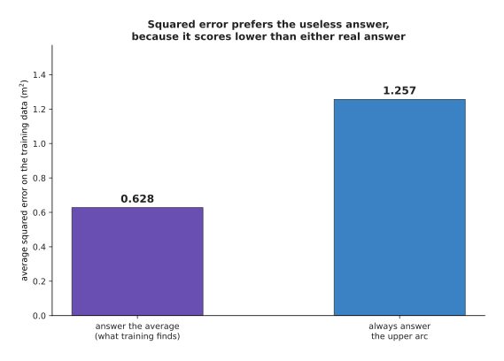

Answering the average scores 0.628, while always choosing the upper arc scores
1.257, so by its own score the training found the better of the two.

The useless answer scores twice as well as a useful one. To see why, look at what
the real answers look like at the hardest place, and at how the score behaves
there. The next picture counts the real sideways positions in the narrow band.

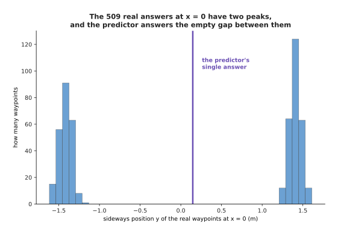

The 509 real waypoints in the band form two peaks, near -1.4 m and near +1.4 m,
and the predictor's single answer falls in the empty space between them where no
real waypoint sits.

Now take every possible single answer in turn and score it against those 509 real
waypoints. The next picture draws that score for each possible answer.


The score is lowest at y = +0.110 m, where it is 1.988, while answering the upper
arc at y = +1.43 m scores 3.732.

So the answer the method prefers is nearly twice as good, by its own score, as
either of the answers a person would accept. No amount of extra data, extra
layers or extra patience changes this. The problem is the question rather than
the model. What is needed is a model that is asked to produce one answer drawn
from the whole set of right ones. The rest of this page builds such a model.

---

## 2. Adding noise, one small step at a time

Section 1 asked for a model that produces one answer drawn from the whole set of
right ones. Building one means turning something easy into something hard. You
start from a shape that nobody had to learn, such as plain round random noise.
You finish on the shape that the data actually has. Plain round random noise
means a cloud of points drawn at random around the origin, equally wide in every
direction.

Diffusion builds that journey backwards. It first destroys the data in small
steps and writes down exactly what it did at every step. It then trains a network
to undo one of those steps at a time. Destroying the data needs no learning at
all. Each step shrinks the point a little towards zero and mixes in a little
fresh noise. After enough steps nothing of the original point is left.

The next picture shows the whole data cloud at six moments during that
destruction.


The same 900 waypoints after 0, 20, 40, 60, 80 and 100 noise steps, as the
multiplier on the data falls from 1.000 to 0.003 and the multiplier on the noise
rises to 1.000.

Nothing in that picture is a network. At step t the noisy point is just the real
waypoint multiplied by one number, plus a fresh random draw multiplied by another
number. The pair of numbers is fixed in advance for every step. That fixed pair,
read off step by step, is called the **noise schedule**.

The next picture draws both multipliers of the schedule against the step number.


The schedule keeps 0.986 of the data at step 10, 0.920 at step 25, 0.703 at step
50, 0.380 at step 75 and 0.003 at step 100, and the two multipliers are equal at
step 50, where each of them is 0.703.

That picture reads the schedule the way the destruction uses it, by jumping
straight from the real data to step t in one go. The same schedule can also be
read one step at a time. Read that way it says how much of the point is replaced
by a single step. The next picture shows that second reading.

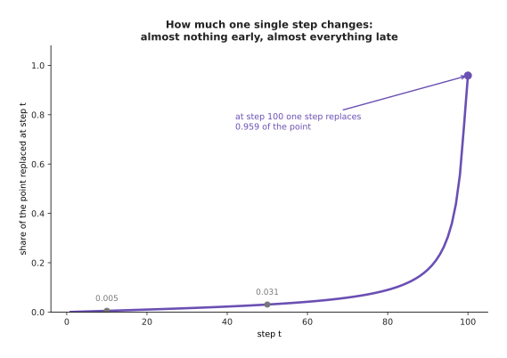

A single early step barely changes the point, because step 10 replaces only 0.005
of it, while the largest single step replaces 0.959 of it at step 100.

That difference matters later, because the network will find the late steps easy
and the early steps hard. It also helps to watch one single waypoint rather than
the whole cloud. The next picture follows one waypoint through all 100 steps, six
times over, with a different fixed random draw each time.


Each coloured line is the same waypoint at (0.00, 1.43) m with one fixed random
draw, and the dashed black line is where the waypoint itself has got to once it
has been shrunk.

The point is pulled steadily towards zero while the noise around it grows. The
next picture measures that growth, by taking 600 noisy copies of that one
waypoint and drawing how they are spread at three different steps.

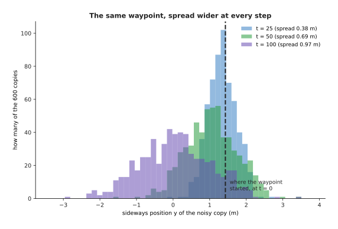

At step 25 the copies still average +1.338 m with a spread of 0.379 m, and by
step 100 they average +0.061 m with a spread of 0.970 m, so by the end the
waypoint's original position has no influence worth measuring.

That end state is where the generator will start. So it is worth checking that it
really is plain noise, rather than something that still remembers the arcs. The
next picture puts the two clouds side by side.


After 100 steps the noisy data has an average of (+0.000, -0.023) and spreads of
1.014 and 1.020, while freshly drawn round noise averages (+0.048, +0.008) with
spreads of 1.016 in both directions.

The two clouds look alike. The next picture explains why they end up the same
width in both directions, which is what makes the end state round rather than
stretched.

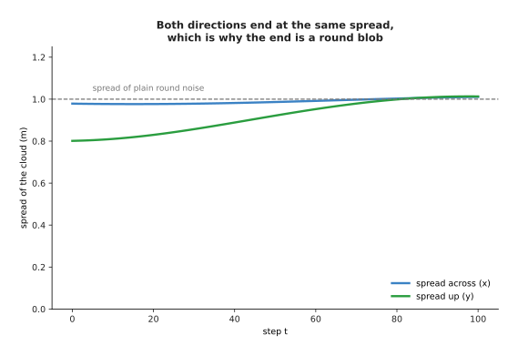

The data starts wider across than up, but both spreads climb to the spread of
plain round noise, which is 1.0, and they get there by about step 85.

Looking at two clouds is not a measurement. So this page uses one number to
compare two clouds of points, and that number is called the **mismatch score**
here. The mismatch score is near zero when the two clouds look like draws from
the same place, and it grows when they do not. The next picture shows what the
score does when you take the real data, make a copy of it, and move the copy
sideways by a known distance.

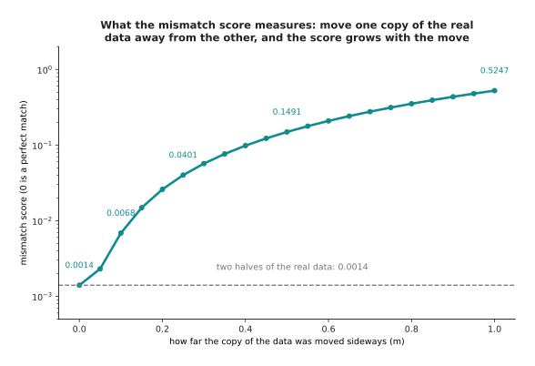

Moving the copy by nothing gives 0.0014, moving it by 0.10 m gives 0.0068, by
0.25 m gives 0.0401, by 0.50 m gives 0.1491 and by 1.00 m gives 0.5247.

That first value is the floor of the score. Two separate samples of the real data
score 0.0014 against each other rather than exactly zero, because each sample
holds a finite number of points. So 0.0014 is as low as any generator can
honestly get here. The score also catches more than a wrong average. The next
picture scores four different clouds against the real data.

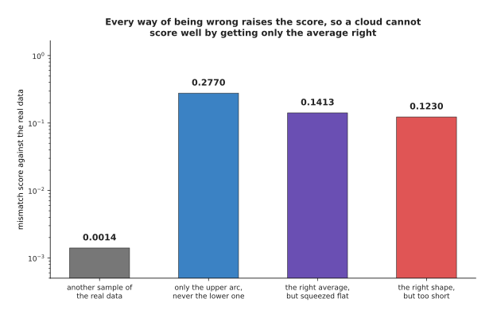

A second sample of the real data scores 0.0014, a cloud holding only the upper
arc scores 0.2770, a cloud squeezed flat onto the middle line scores 0.1413, and
a cloud of the right shape but only half as long scores 0.1230.

So a generator cannot score well by getting only the average right, and it cannot
score well by producing one of the two arcs and forgetting the other. With that
score in hand, the two clouds of the earlier picture can be compared properly.
The data after 100 noise steps scores 0.0017 against freshly drawn noise, which
is close to the floor of 0.0014. So after 100 steps the data really is
indistinguishable from noise, which means a generator may start from noise
without having cheated.

---

## 3. Training one network to name the noise

The destruction of the last section added a known amount of known noise at every
step. This means that for any step there is a training example that nobody had to
label by hand. The example has three parts: the noisy point, the step number, and
the exact noise that was mixed in. One network is trained to look at the first
two parts and name the third. A network trained to do this is called a
**denoiser**, because naming the noise is the first half of removing it.

The next picture follows one such training example through the arithmetic.


At step 50 the waypoint (0.00, 1.43) is shrunk by the multiplier 0.703, and a
noise draw of (1.10, -1.60) is added with the multiplier 0.711, which gives the
point (0.78, -0.13).

The network is handed (0.78, -0.13) together with the step number. It answers
(0.34, -0.08), while the real noise was (1.10, -1.60). So it is a long way out.
The dashed arrow in the picture shows the consequence of being that far out.
Taking the named noise back out puts the clean waypoint between the two arcs,
rather than on either of them.

Training is otherwise an ordinary training loop. Each training step picks a batch
of real waypoints and picks a random step number for each of them. It then builds
the noisy version of each waypoint. Finally it scores the network on the squared
difference between the noise the network named and the noise that was really
added. The next picture shows how that score falls while training runs.


Twelve thousand training steps on batches of 512 examples took 27 seconds on one
processor core, and the average squared error fell from 0.437 to 0.301.

The curve flattens at 0.301 rather than at zero, and no amount of further
training brings it down. A large part of that remaining number is not a mistake.
The next picture shows where it comes from. Each panel draws the noise the
network named against the noise that was really added, at one step number.


At step 10 the squared error is 0.59 and the agreement with the real noise,
measured by correlation, is 0.63, while at step 90 the error is 0.02 and the
agreement is 0.99.

At step 90 almost nothing of the waypoint is left. The point the network is shown
is nearly the noise itself, so the network can read the answer off. At step 10
the opposite holds. The point is almost the original waypoint, and many different
small noises could have produced it from many different nearby waypoints. So the
best the network can do is answer the average of those possibilities, and the
error that remains is the spread of the possibilities rather than a failure of
training. The next picture measures that error at every step.


The error is 0.96 at step 1, 0.50 at step 25, 0.41 at step 50, 0.12 at step 75
and 0.005 at step 100, so the hardest step is the first one.

Guessing zero every time would score 1.0. So at step 1 the network is barely
better than useless, while at step 100 it is nearly perfect. One single network
covers all one hundred steps because the step number is one of its inputs. That
is what lets a single trained model be used a hundred times in a row with a
different job each time.

---

## 4. The reverse walk, from a round blob back to the arcs

Now the pieces fit together. Start from a point of plain round noise, which
section 2 showed is what step 100 looks like. Ask the network what noise is in
that point. Take some of that noise back out. Add a smaller amount of fresh
noise. The result now looks like step 99. Repeat the same thing ninety-nine more
times. This whole procedure is called the reverse walk.

The next picture shows 900 points making that walk together.


Nine hundred points of pure noise walked back one step at a time, with 11.9 per
cent inside the obstacle at step 100, 9.4 per cent at step 40, 2.7 per cent at
step 20 and 0.1 per cent at the end.

The shape appears late. Two thirds of the way back the cloud is still round, and
only in the last twenty steps do the points pull apart into the two arcs and
clear the obstacle. This is another way of seeing that the early steps carry most
of the fine detail. The next picture writes out one single step in full, for one
single point.


Going back from step 40 to step 39 for the point (0.620, 1.050), the network
names the noise (0.399, 0.586), the share removed is 0.0224, the new middle is
(0.612, 1.040), and fresh noise of spread 0.146 is added on top.

The arithmetic behind those numbers is short. The amount of noise still in the
point at step 40 is 0.5937. Dividing the share removed by that amount gives
0.0377, which is how much of the named noise is subtracted. Subtracting it gives
(0.605, 1.028). Dividing that by 0.9887 gives the new middle at (0.612, 1.040).
Finally the fresh noise of spread 0.146 is added.

So the step barely moves the middle of the point, from (0.620, 1.050) to
(0.612, 1.040). Yet the fresh noise added on top has a spread of 0.146, which is
many times larger than that movement. This means a single step looks almost like
pure randomness, and only the hundred steps together add up to a shape. It is
also why the path a point takes is such a wandering one. The next picture draws
three of those paths twice: once as the method really runs, and once with the
fresh noise left out so that only the correction remains.


With fresh noise put back at every step, three points travel 27.9 m on average to
cover 2.0 m of ground, which is a ratio of 17.3, while the same three points with
the noise left out travel 0.66 m to cover 0.48 m, a ratio of 1.38.

The right-hand panel uses the same model and the same starting points. Only the
fresh noise was removed. The path then becomes short and smooth. This is the
first hint that most of the hundred steps are not buying anything. The next page
follows that hint. However, before anything can be saved, the walk has to produce
the right points at all. The next picture compares the points it produces with
the real demonstrations.


Two thousand generated waypoints sit 0.0237 m from the nearest real waypoint on
average, split 47.3 per cent above the obstacle, and put 0.05 per cent of
themselves inside it.

The next picture scores that generated cloud with the mismatch score of section 2
and compares it with the floor.

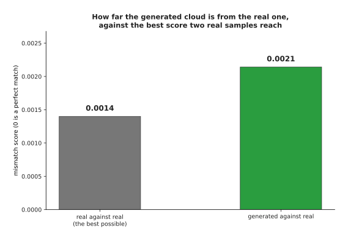

The generated cloud scores 0.0021 against the real data, while two samples of the
real data score 0.0014 against each other, so the generator is close to the best
score anything could reach.

Compare that 0.05 per cent inside the obstacle with the 29.4 per cent of
section 1. The predictor spent nearly a third of its path inside the obstacle,
because it answered the average. The generator keeps almost everything out of the
obstacle, because it answers whole examples instead. It also keeps both ways
round, roughly half and half, which no single answer can do.

---

## 5. Conditioning: the same denoiser told what to make

What section 4 produced is a fair sample of everything in the data. That is a
curious object rather than a useful one. A robot is not asked for a typical
waypoint. It is asked for a waypoint that suits the situation in front of it.
Making that possible is called **conditioning**, and the extra information handed
to the model is called the condition.

Conditioning needs no new idea. The extra information is simply handed to the
denoiser alongside the noisy point, every time the denoiser is asked. The next
picture shows the row of numbers that the denoiser is handed, three times over,
with only the condition changed.


The denoiser takes one row of 13 numbers: two for the point, eight worked out
from the step number and three saying what to produce. At step 40 it names
(+0.48, +0.47) when told above, (-0.51, +2.18) when told below and
(+0.40, +0.59) when not told.

Only three numbers changed between those rows, and the answer changed completely.
During training the condition is set to the true side of each example. However,
on one example in five it is set to "not told" instead. So the same network
learns both the conditioned job and the unconditioned one. That detail looks
small here, but it turns out to be the whole basis of section 6.

The next picture runs the finished model three times, with the three conditions.


Run with no condition the model sends 49.9 per cent of its waypoints above the
obstacle, told to go above it sends 96.1 per cent, and told to go below it sends
3.8 per cent.

The same trained weights produced all three panels. The only difference between
the three runs was three numbers in the input. The next picture counts those
shares as bars, so that the split between the two sides can be read directly.


The untold run splits 49.9 per cent above against 50.1 per cent below, while the
told runs put 96.1 per cent and 96.2 per cent of their waypoints on the side they
were asked for.

This is what makes the method useful on a robot. The condition does not have to
be a side label. It can be the camera picture, the arm's joint angles and a
sentence of instruction, all turned into numbers and fed in the same way.
Choosing the side also costs nothing in safety, which the next picture shows by
counting how much of each method's output lands inside the obstacle.

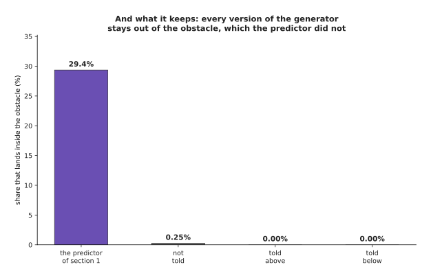

The conditioned runs put 0.00 per cent of their waypoints inside the obstacle and
the unconditioned run puts 0.25 per cent, against the 29.4 per cent of its path
that the predictor of section 1 spends in there.

So conditioning gives back the control that was lost by refusing to average. The
person asking picks which of the right answers they want, while the model still
produces only answers that the data supports. What conditioning does not yet give
is a dial. Obedience of 96.1 per cent is good, but it is not certain. The next
section is about the dial.

---

## 6. Guidance: pushing further in the direction the condition adds

The network was trained with the condition missing one time in five. Because of
that, it can be run twice on the same point: once told what to produce, and once
not told. The difference between the two answers is the part of the answer that
the condition is responsible for. That difference can then be multiplied by a
number larger than one before it is used. This trick is called **classifier-free
guidance**, and the multiplier is called the guidance strength.

The next picture draws all four answers as arrows from a common origin, for one
point and one step.


At the point (0.00, 0.25) and step 55 the network names (+0.01, +0.27) when not
told and (+0.02, -0.27) when told above, so the condition contributes
(+0.01, -0.54), and strength 2 gives (+0.03, -0.81) while strength 4 gives
(+0.06, -1.88).

Strength 1 is the ordinary conditioned answer, because adding the whole
difference once to the untold answer gives the told answer back. Strength 0 is
the unconditioned answer. Anything above 1 goes further than the network itself
asked to go. That is why the guided arrow at strength 4 is nearly seven times as
long as the untold one.

The next picture runs the model at five settings of the dial and draws the
waypoints that come out.


Asked for the upper arc at strengths 0, 0.5, 1, 2 and 4, the model sends 49.5,
83.6, 95.7, 99.0 and 100.0 per cent of its waypoints above, while the spread
along the arc goes 0.994, 1.064, 0.966, 0.763 and 0.514 m, against 0.999 m for
the real upper arc.

So the dial works in two directions at once. The next three pictures measure each
direction on its own, using a finer sweep of the dial. The first measures
obedience, which is the share of waypoints that went to the side asked for.

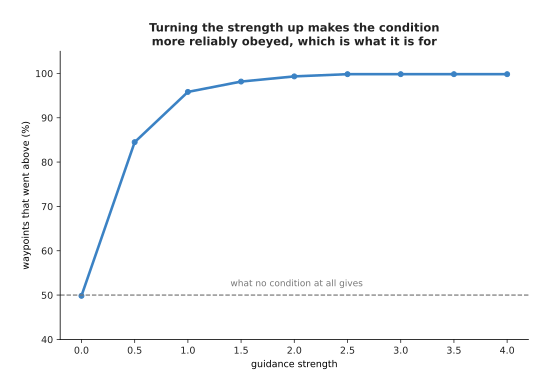

Obedience rises from 50 per cent at strength 0 to 96 per cent at strength 1 and
reaches 100 per cent by strength 2.5.

That is what the dial is for. The second picture measures what the dial costs,
which is the variety of the answers.

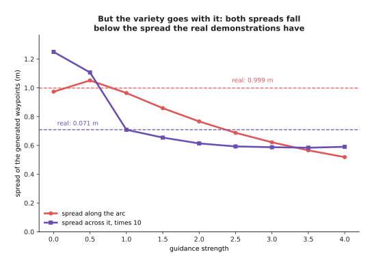

The spread along the arc falls from 0.973 m at strength 0 to 0.519 m at strength
4, while the real demonstrations spread 0.999 m along the arc, so by strength 4
the answers cover roughly half the stretch of path that the real ones cover.

The third picture puts obedience and variety together into one number, by scoring
the generated waypoints against the real upper arc with the mismatch score.


The mismatch is lowest at strength 1 with 0.0032, against 0.2530 at strength 0
and 0.2881 at strength 4.

That last chart is the one to remember, because there is a best setting and it is
neither end of the dial. On a robot, the symptom of too much guidance is a policy
that always does the same thing, even where the situation calls for variety. The
symptom of too little guidance is a policy that sometimes ignores the instruction
entirely. So most useful settings lie between about 1 and 3.

---

## 7. The cost: many passes through the network instead of one

Everything above has one price, and it is the same price throughout. A predictor
runs the network once to produce an answer. A diffusion model runs the network
once per step. The honest way to see what those extra runs buy is to generate the
same points with fewer and fewer steps and then measure the result.

The next picture does that for six step counts.


Generating with 2, 5, 10, 25, 50 and 100 steps gives mismatch scores of 1.586,
0.023, 0.014, 0.006, 0.003 and 0.002.

Two steps is useless. Five steps already gives roughly the right shape. After
about twenty-five steps the improvement is small. However, the mismatch score
averages over the whole cloud, and the mistakes that matter on a robot are the
rare points that land in the obstacle. The next picture counts those.

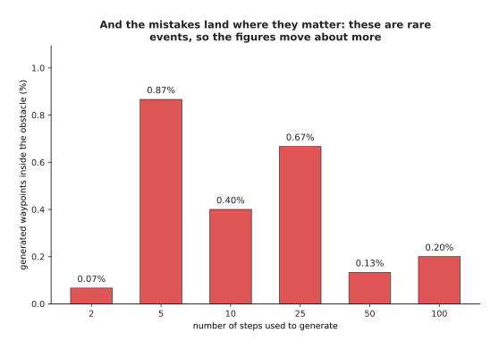

The share of waypoints inside the obstacle is 0.07, 0.87, 0.40, 0.67, 0.13 and
0.20 per cent for 2, 5, 10, 25, 50 and 100 steps.

Those figures count rare events, so they move about more than the mismatch score
does. Even so, the five-step run is the worst at 0.87 per cent, which on a real
arm would mean a collision about once in a hundred attempts. The next picture
shows the clouds themselves at five of those step counts.


The same model asked for its answer in 2, 5, 10, 25 and 100 steps.

Quality is hard to predict from the step count. Time is not, because every step
is one pass of the network and nothing else. The next picture measures that time.


One pass over a single point was measured at about 12 microseconds, so 2 steps
take about 0.025 ms, 25 take about 0.3 ms and 100 take about 1.2 ms, while 64
points handled at once cost about 0.11 ms a pass, which is about 11 ms for 100
steps.

Those measurements move by a few per cent from one run to the next, because other
programs share the machine. The network on this page is also tiny, so its own
timings are not a guide to anything real. The arithmetic, however, is a guide.
The next picture does that arithmetic for networks of four plausible speeds and
marks two deadlines on it.

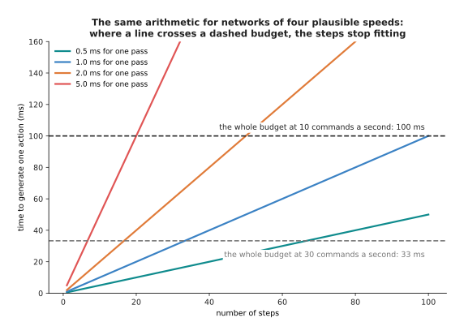

A network taking 2 ms per pass reaches the 100 ms budget after 50 steps and the
33 ms budget after 16 steps, while a network taking 5 ms per pass reaches them
after 20 steps and 6 steps.

A robot arm that takes a new command ten times a second has 100 ms for each
command. So a network needing 2 ms per pass fits fifty steps and nothing else. At
thirty commands a second it fits sixteen steps, and at fifty commands a second it
fits ten. Those numbers decide whether a diffusion model can drive an arm at all,
which is why [diffusion
policies](../12_models-that-act/02_diffusion-and-flow-policies.md) care so much
about the step count.

There are three ways out of this problem. You can use fewer steps and accept the
loss in quality, which the pictures above price. You can make each pass cheaper,
which is what [making a model smaller and
faster](../07_pretraining-and-adapting/04_making-a-model-smaller-and-faster.md)
is about. Or you can change the method so that fewer steps are needed, which is
where the next page starts.

---

## 8. Where to read next

- [Flow matching and other
  generators](02_flow-matching-and-other-generators.md) is the next page, and it
  takes the hint from section 4 that most of the hundred steps were wasted.
- [Diffusion and flow
  policies](../12_models-that-act/02_diffusion-and-flow-policies.md) puts this
  page's machinery on a real arm, with camera pictures as the condition.
- [Vision backbones](../09_models-that-see/01_vision-backbones.md) explains how
  a camera picture becomes the numbers a conditioned denoiser is handed.
- [World models](../12_models-that-act/04_world-models.md) generates what the
  scene will look like after an action rather than what action to take.
- [Diffusion and flow policies in the model
  catalogue](../../07_learned-models/06_movement-models/02_most-used/03_diffusion-and-flow-policies.md)
  lists the named models of this kind that people run on arms.

---

## 9. Using it in Python

Sections 2, 3 and 4 built a noise schedule, trained a network to name the noise
and walked back one step at a time. The code below does all three on the same
problem in PyTorch. Each named idea turns out to be a few lines rather than a
library. The code is shortened to fit on the page, so it trains for far fewer
steps than the model that drew the pictures.

```python
import torch
from torch import nn

# The chapter's running example, so that this block runs as it stands: 6,000
# recorded waypoints, about half passing above the obstacle at the origin and
# half below, which is the two-moded shape sections 1 and 2 describe.
g = torch.Generator().manual_seed(8)
wx = torch.rand(6000, generator=g) * 4 - 2
side = torch.where(torch.rand(6000, generator=g) < 0.5, -1.0, 1.0)
wy = side * 1.41 * torch.cos(wx * torch.pi / 4)
waypoints = torch.stack([wx, wy], 1) + 0.05 * torch.randn(6000, 2, generator=g)

T = 100                                              # section 2: how many steps
tt = torch.arange(T + 1) / T
f = torch.cos((tt + 0.008) / 1.008 * torch.pi / 2) ** 2
kept = (f / f[0]).clamp(1e-5, 1.0)                   # section 2: the schedule
print(f'{kept[50].sqrt():.3f}')                      # 0.703, as in section 2

net = nn.Sequential(nn.Linear(3, 128), nn.Tanh(),    # 2 for the point, 1 for t
                    nn.Linear(128, 128), nn.Tanh(),
                    nn.Linear(128, 2))               # section 3: names the noise
opt = torch.optim.Adam(net.parameters(), lr=2e-3)

for _ in range(4000):                                # section 3: the training loop
    x0 = waypoints[torch.randint(0, len(waypoints), (512,))]
    t = torch.randint(1, T + 1, (512,))
    eps = torch.randn_like(x0)
    xt = kept[t].sqrt()[:, None] * x0 + (1 - kept[t]).sqrt()[:, None] * eps
    loss = ((net(torch.cat([xt, t[:, None] / T], 1)) - eps) ** 2).mean()
    opt.zero_grad(); loss.backward(); opt.step()

x = torch.randn(1000, 2)                             # section 4: start from noise
for t in range(T, 0, -1):                            # section 4: the reverse walk
    eps = net(torch.cat([x, torch.full((1000, 1), t / T)], 1))
    beta = (1 - kept[t] / kept[t - 1]).clamp(0, 0.999)
    x = (x - beta / (1 - kept[t]).sqrt() * eps) / (1 - beta).sqrt()
    if t > 1:
        x = x + (beta * (1 - kept[t - 1]) / (1 - kept[t])).sqrt() * torch.randn_like(x)
```

The library gives you the automatic differentiation, the optimiser and the
layers. Nothing else is hidden, because the schedule is four lines, the training
loop is six and the reverse walk is five.

In practice nobody writes those lines. Hugging Face's `diffusers` package
provides the schedules as `DDPMScheduler` and `DDIMScheduler`, the reverse step
as `scheduler.step`, and ready-built denoisers such as `UNet2DModel` and
`UNet1DModel`. LeRobot ships a complete diffusion policy for arms built on those
pieces. Using the library means your schedule matches everybody else's, which
matters because a sampler written for one schedule gives wrong answers on
another.

What you still have to decide is what no library chooses for you. You have to
decide how many steps to train with, how many steps to generate with, how often
to drop the condition during training, and what guidance strength to use.
Section 6 showed that the guidance strength has a best value in the middle rather
than at an end. Section 7 showed that the number of steps to generate with is set
by your control rate rather than by your taste.
