# Flow matching and other generators

The page before this one, [diffusion](01_diffusion.md), built a generator in two
parts. It added noise to the data in a hundred small steps, and then it trained a
network to undo one step at a time. That page ended with a complaint. The
finished model has to be run once for every step, so producing one answer costs a
hundred passes through the network instead of one. A robot arm has to issue a new
command ten or thirty times a second, and at that rate a hundred passes is the
difference between a method that works and a method that does not.

That page also ended with a clue. When the fresh noise was left out of the
reverse walk, the path from the starting noise to the finished waypoint became
short and smooth. This suggests that most of those hundred steps were not buying
anything.

This page follows that clue to **flow matching**. Flow matching trains the
network to name a direction to move in, rather than a noise to remove. The page
then covers the two other ways of generating that matter in practice. The first
is making the answer one piece at a time. The second is generating inside a small
squeezed space rather than inside the full-sized data.

By the end you will understand why a flow model's paths come out bent even though
it was trained on straight lines, how a second round of training straightens
them, how many passes through the network each method needs for the same quality,
why making an answer one piece at a time is cheap for short answers and expensive
for long ones, and how squeezing the data first makes picture and video
generators affordable.

This page is for a reader who has read [diffusion](01_diffusion.md), so it does
not explain generating, conditioning, guidance or the mismatch score again. It
uses the same simulated demonstrations. A robot arm carries its gripper past a
round obstacle of radius 0.5 m, and the recorded waypoints form two arcs, one
above the obstacle and one below it. Every number below is worked out and printed
by `docs/diagrams/models_that_generate.py`. The timings were measured on the
machine that drew the pictures, where one pass of the small network used
throughout took about 12 microseconds. That measurement moves by a few per cent
from one run to the next, because other programs share the machine.

## Contents

1. [A direction at every point, instead of a noise to remove](#1-a-direction-at-every-point-instead-of-a-noise-to-remove)
2. [Straighter paths need fewer steps, measured](#2-straighter-paths-need-fewer-steps-measured)
3. [One piece at a time: autoregressive generation](#3-one-piece-at-a-time-autoregressive-generation)
4. [Generating in a small space: autoencoders and latent spaces](#4-generating-in-a-small-space-autoencoders-and-latent-spaces)
5. [Which generator suits which job](#5-which-generator-suits-which-job)
6. [Where to read next](#6-where-to-read-next)
7. [Using it in Python](#7-using-it-in-python)

---

## 1. A direction at every point, instead of a noise to remove

Diffusion gets from noise to data by a long sequence of small corrections. Each
correction is worked out from a prediction of the noise. Flow matching asks for
something simpler. It treats the journey from noise to data as a movement over
time. It then trains the network to answer one question: given where you are now
and how far through the journey you are, which way should you move and how fast?

Training an answer to that question needs a journey to learn from. Flow matching
makes one in the most direct way available. It draws a straight line between a
point of noise and a real waypoint. The next picture shows one such line.

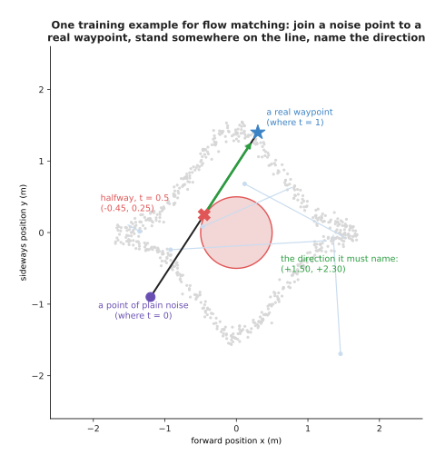

One training example pairs the noise point (-1.20, -0.90) with the real waypoint
(0.30, 1.40), stands halfway along the line between them at (-0.45, 0.25), and
asks the network to name the direction (+1.50, +2.30).

Each training step picks a fresh noise point, a fresh real waypoint, and a fresh
place along the line between them. So the network sees the whole of the space
between noise and data. The answer it is scored against is simply the real
waypoint minus the noise point, which is the direction that would carry the point
the rest of the way in one go.

The thing the network ends up holding is called a **vector field**. A vector
field is a rule that gives you an arrow at every place. This one gives an arrow
at every place and at every moment in the journey. Those arrows can be drawn
straight out of the trained network, which the next picture does at three moments.

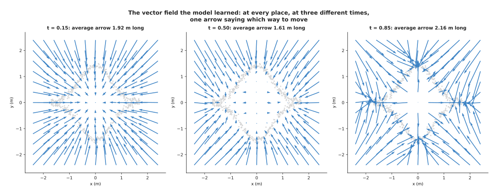

The arrows the trained model gives are 1.94 m long on average at time 0.15,
1.64 m at time 0.50 and 2.16 m at time 0.85, and by the last of those moments
they have stopped pointing outwards in general and started pointing at the arcs
in particular.

Early in the journey the arrows carry everything outwards, away from the middle,
because almost all of the data is away from the middle. Late in the journey they
point at the nearest piece of arc, which is how the points get placed exactly
rather than roughly. Generating is then no more than following the arrows. You
start at a noise point, you ask for the arrow where you are, you take a small
step along it, and you repeat. The next picture follows ten points doing exactly
that.

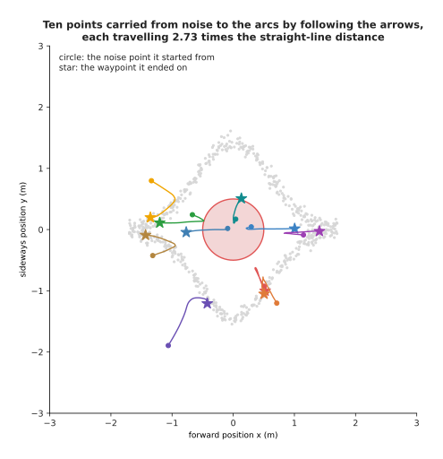

Ten points carried from noise to the arcs with 50 steps, each one travelling 2.73
times as far as the straight line from where it started to where it finished.

That number is a disappointment. The training lines were straight, yet the paths
that come out are not. The reason is worth understanding, because the reason is
also the way to fix it. Each training line joined a noise point to a waypoint
that was picked independently of it. A great many of those lines therefore cross
one another. Where two training lines cross, they ask for two different
directions at the same place, and a single network can only answer one thing
there. The answer that scores best against both demands is their average. The
next picture shows one such crossing.

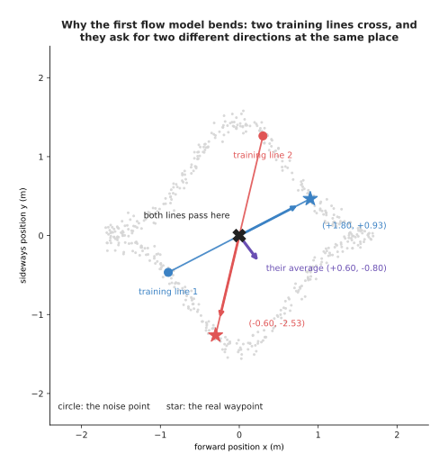

Two training lines both pass through the origin halfway along themselves. One of
them asks for the direction (+1.80, +0.93) there and the other asks for
(-0.60, -2.53), so the only answer the network can give is their average,
(+0.60, -0.80), which is a direction neither line wanted.

An average of crossing directions is not straight, and that is why the paths bend.
The fix is to train the model a second time, on pairs that the model made itself.
First you run the first model, and for each starting noise point you keep the
waypoint it actually produces. Then you train a fresh network on straight lines
between those matched pairs. Those lines do not cross, because each noise point
now has exactly one partner. This second round of training is called
**rectifying** or **reflowing** the model. The next picture takes the same thirty
noise points and pairs them both ways, so that the difference can be counted.

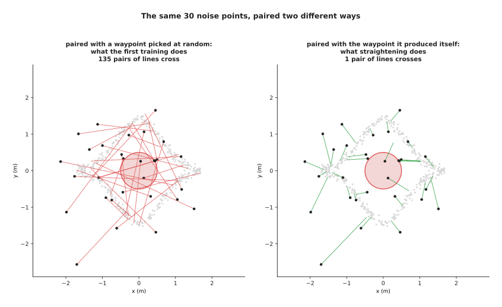

Among the 435 pairs of lines that thirty lines make, pairing each noise point
with a waypoint picked at random gives 135 crossing pairs, while pairing each
noise point with the waypoint it produced itself gives one.

The next picture draws the paths that all three models actually walk, starting
from the same twelve noise points.

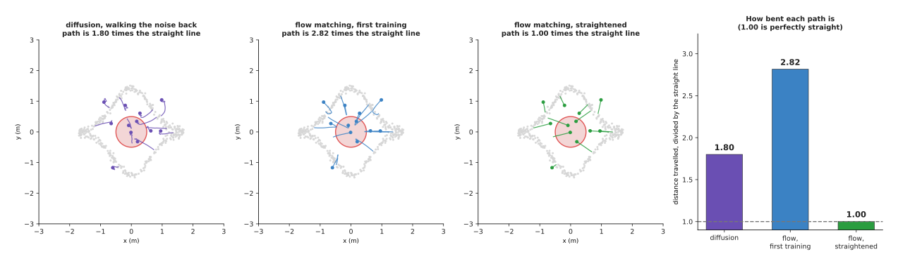

The same twelve noise points carried to the data by the diffusion walk without
its added noise, by the first flow model and by the straightened flow model.

The bend in each set of paths can be measured as one number. That number is the
distance a path travels divided by the straight-line distance between its two
ends, so 1.00 means a perfectly straight path. The next picture compares the
three models on that number.

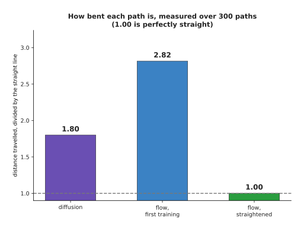

Measured over 300 paths, the diffusion walk without its added noise travels 1.80
times the straight-line distance, the first flow model travels 2.82 times, and
the straightened flow model travels 1.002 times, which is as straight as a path
can be.

A path that is straight can be walked in one single step without losing anything,
because there is nothing to miss between the two ends. That is the claim. The
next section measures it rather than repeating it.

---

## 2. Straighter paths need fewer steps, measured

The straightness numbers above describe the shape of the journey. They say
nothing directly about the quality of the answer, so on their own they prove
nothing. What matters is how good the generated waypoints are when the model is
given a fixed, small number of steps. So all three models were run with 1, 2, 4,
8, 16, 32 and 64 steps. Each run was then scored with the mismatch score from the
last page, where 0.0014 is the floor that two halves of the real data reach.

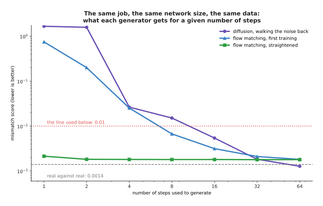

At one step the three models score 1.670, 0.749 and 0.002. At eight steps they
score 0.015, 0.007 and 0.002. At sixty-four steps they score 0.001, 0.002 and
0.002.

To get below a mismatch of 0.01, diffusion needs 16 steps, the first flow model
needs 8, and the straightened flow model needs 1. That is the whole case for flow
matching in one line. It is a measurement on one shared dataset, with three
networks of identical size, trained for the same number of training steps.
Looking at the clouds themselves makes the difference obvious.

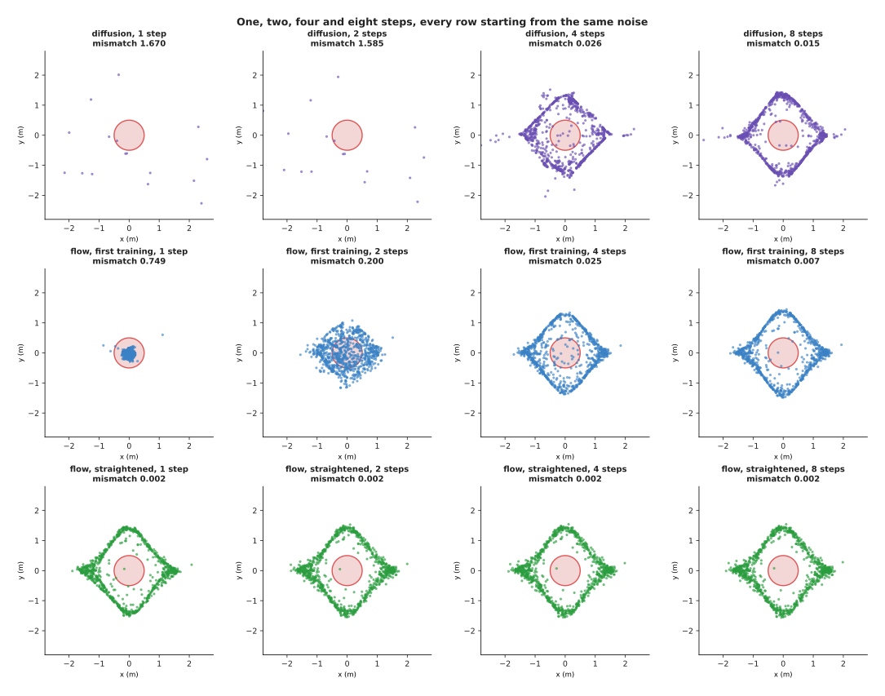

With one step diffusion returns scattered noise and the first flow model returns
a tight blob in the middle of the obstacle, while the straightened model already
returns the two arcs.

The one-step blob in the middle is the mistake from section 1 of the last page
appearing again in a new place. One step from a noise point, taken along the
average direction, lands the point at the average of all the waypoints it might
have become. That average is the empty middle. Diffusion and the first flow model
both need several steps before their answer stops being an average. The
straightened model does not need them, because its arrows were trained on pairs
that each had exactly one partner. The next picture puts the three models side by
side at four step counts.

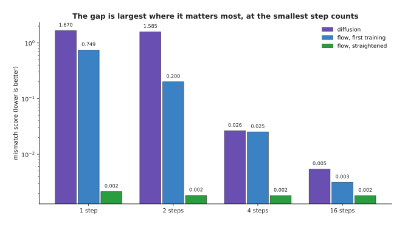

At one step diffusion scores 1.670 and the straightened model scores 0.002. At
four steps they score 0.026 and 0.002. At sixteen steps they score 0.005 and
0.002, so the advantage shrinks as the step count grows.

This is the pattern a robot cares about. At thirty-two steps the three models
score 0.0018, 0.0021 and 0.0018, which is the same within measurement noise. At
sixty-four steps diffusion is slightly ahead at 0.0013. However, at one or two
steps, which is all that a tight control rate allows, only the straightened model
produces anything usable. The next picture is the same measurement with time on
the horizontal axis instead of step count, because a deadline is written in units
of time.

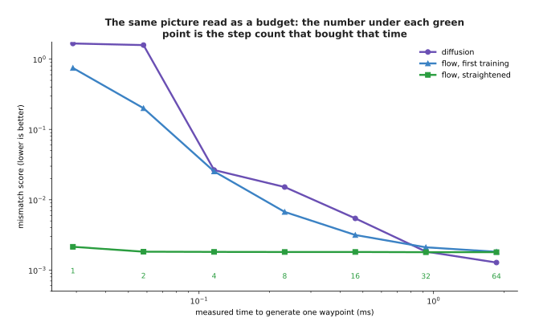

One step costs about 0.012 ms, eight steps cost about 0.1 ms and sixty-four
steps cost about 0.8 ms, because every step is one pass of the same network.

Straightening is not free. It costs a second round of training, and a round of
generating in between to make the pairs, which roughly doubles the work of
building the model. It also costs the ability to change the model's conditioning
cheaply afterwards, because the pairs were made by one particular version of the
first model. That is the trade: more work once, when the model is built, in
exchange for less work every single time it is run. On a robot that runs its
policy thirty times a second for hours, that trade is easy.

---

## 3. One piece at a time: autoregressive generation

Diffusion and flow matching both produce the whole answer at once and then
improve it step by step. The other main way to generate works the opposite way
round. It produces the answer one piece at a time, and each piece is finished and
final when it is written down. Each piece is chosen in the light of the pieces
that are already written down. This is called **autoregressive generation**. It
is what a language model does when it writes one token after another, which the
page on [training and running a
transformer](../06_the-transformer/03_training-and-running-a-transformer.md)
works through in detail.

A waypoint here has two pieces: its forward position and its sideways position.
So the smallest honest autoregressive model for this data is a two-stage one. The
first stage gives the chance of each band of forward position, counted straight
from the training data. A band is a small range of values, and this model uses
twenty of them. The next picture shows those twenty chances.

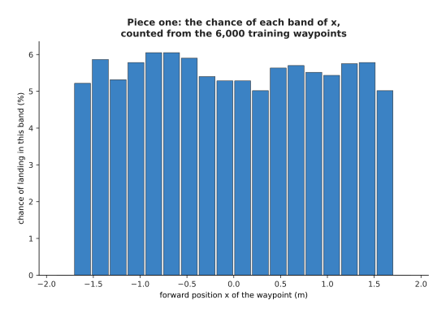

The 6,000 training waypoints are spread almost evenly across the 20 bands of
forward position, and the busiest band, around x = -0.85 m, holds 6.0 per cent of
them.

The second stage is where the method earns its place. Once the forward position
has been chosen, the model looks up the chances for the sideways position that go
with that one band. The next picture draws those chances for three different
choices of forward position.

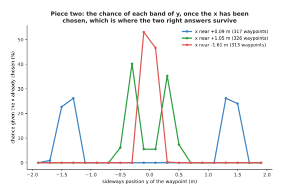

With the forward position near +0.09 m the sideways chances have two clear peaks,
at -1.50 and -1.30 m and again at +1.30 and +1.50 m, with nothing in between.
With the forward position near +1.05 m the two peaks have moved in to -0.30 and
+0.30 m. With the forward position near -1.61 m there is a single peak at the
middle, spread over the two bands at -0.10 and +0.10 m.

Nothing had to be invented to get that. The second stage simply looks up the
counts for the band the first stage picked. The two right answers therefore
survive, because they are never averaged together. The next picture compares the
waypoints this model produces with the real ones.

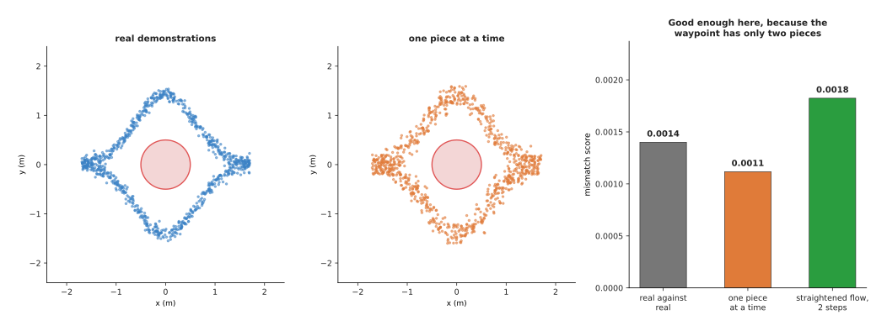

The two-stage model scores a mismatch of 0.0011 against a floor of 0.0014 and
puts 0.00 per cent of its waypoints inside the obstacle, which is as good as the
straightened flow model managed at 0.0018.

So for an answer with two pieces, generating one piece at a time is both the most
accurate method on this page and the cheapest, at two passes. The reason nobody
uses it for pictures or for robot actions is in the next picture, which draws the
cost against the number of pieces in the answer.

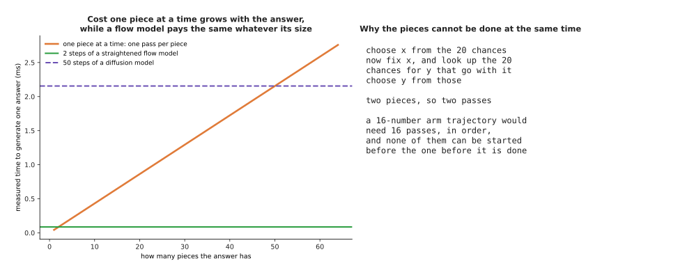

A two-piece answer costs about 0.025 ms made one piece at a time, a sixteen-piece
answer costs about 0.2 ms and a sixty-four-piece answer costs about 0.8 ms,
while two steps of a straightened flow model cost about 0.025 ms however many
numbers the answer holds.

The cost grows with the size of the answer, and better hardware cannot avoid it.
The pieces have to be made in order, and none of them can start before the one
before it has finished. A robot arm command is commonly a chunk of several joint
positions for each of the next several moments, which is easily fifty numbers.
Fifty strictly ordered passes is a different kind of cost from two passes that
each handle all fifty numbers together. Text is the case where the ordering is
unavoidable anyway, which is why language models are built this way and robot
action models mostly are not.

---

## 4. Generating in a small space: autoencoders and latent spaces

Section 3 showed one way in which the cost of generating grows with the size of
the answer. There is a second way, and it hits diffusion and flow matching too.
Every step of theirs has to work on every number in the answer. So a generator
that produces a 512 by 512 colour picture is pushing 786,432 numbers through a
network fifty times. The way around this is to notice that real data of that size
is never really that big, and then to generate in a smaller space instead.

The tool for finding the smaller space is an **autoencoder**. An autoencoder is
two networks trained together. One of them squeezes the data down to a short list
of numbers, which is called the **code**. The other builds the data back up from
that code. Nothing labels the data. The pair is simply scored on how close the
rebuilt version is to the original.

To show this working, the example here moves from single waypoints to whole
demonstrations. The next picture shows forty of those demonstrations.

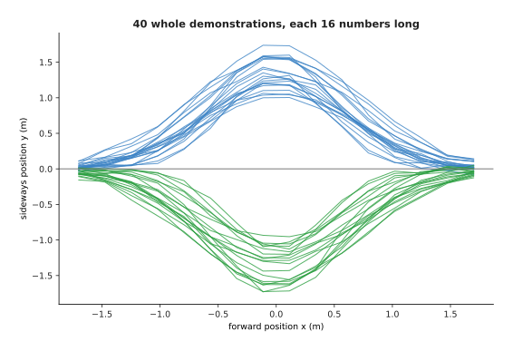

Each demonstration is now 16 sideways readings taken along the path, and of these
forty, 21 swerve above the centre line while 19 swerve below it.

One whole demonstration is therefore a point in 16 dimensions. However, only
three choices really went into making it: which side to pass on, how far out to
swerve, and how wide to make the swerve. The next picture writes one of those
demonstrations out as the 16 numbers the autoencoder is handed.

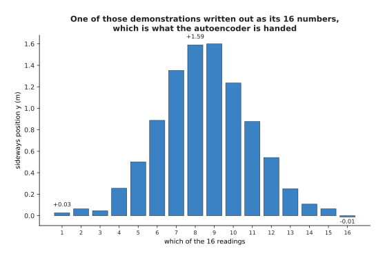

The same demonstration written out as its 16 numbers, which run from +0.03 m at
the first reading up to +1.59 m at the eighth and back down to -0.01 m at the
sixteenth.

Those three choices are the reason a code can be short. An autoencoder that
squeezes 16 numbers down to 2 and back up again was trained on 4,000
demonstrations. It was then tested on 1,000 demonstrations it had never seen.

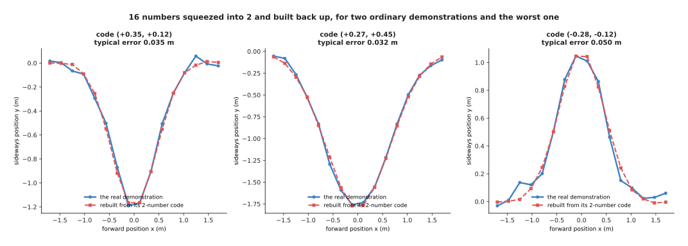

Rebuilt from two numbers, the held-out demonstrations are out by 0.029 m on each
reading on average, and even the worst of the 1,000 is out by only 0.050 m.

The obvious question is how short the code can be. The answer is that it has to
be about as long as the number of real choices in the data, and no longer. The
next picture measures the rebuilding error for five different code lengths.

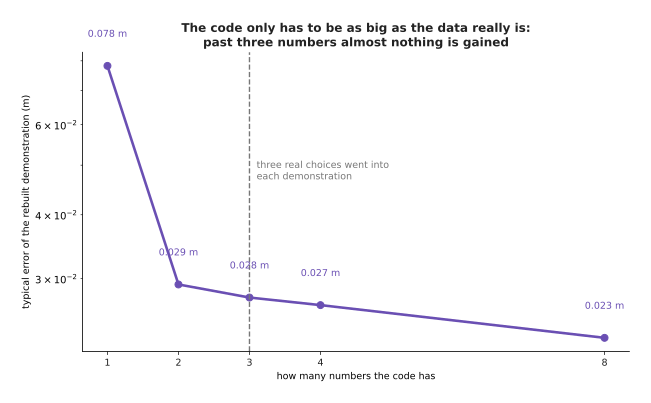

A code of one number rebuilds to 0.078 m, two numbers to 0.029 m, three to
0.028 m, four to 0.027 m and eight to 0.023 m, so almost all of the gain arrives
by the time the code is as long as the three choices that made the data.

The space those codes live in is called the **latent space**. The word latent
just means hidden, because the codes are not anything a person measured.
Generating then happens entirely inside that space. A flow-matching model is
trained on the codes of the real demonstrations. It produces new codes. The
autoencoder's second half then builds those new codes back up into whole
demonstrations. The next picture shows the code space, with the real codes in it
and then the generated ones.

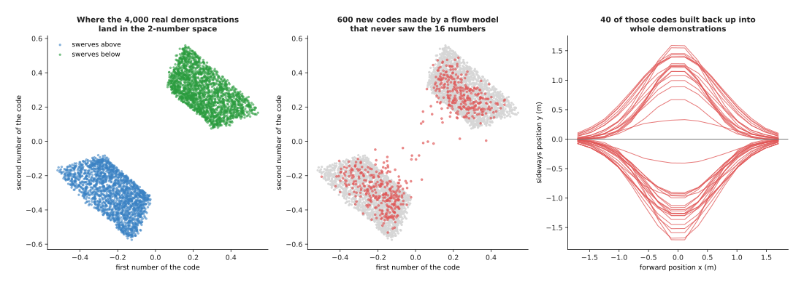

The 4,000 real codes fill a patch from (-0.52, -0.57) to (+0.54, +0.56) in two
clearly separated clusters, and the 600 codes made by a flow model that never saw
the 16 numbers land in those same two clusters.

The next picture builds forty of those generated codes back up into whole
demonstrations, so that they can be compared with the real ones above.

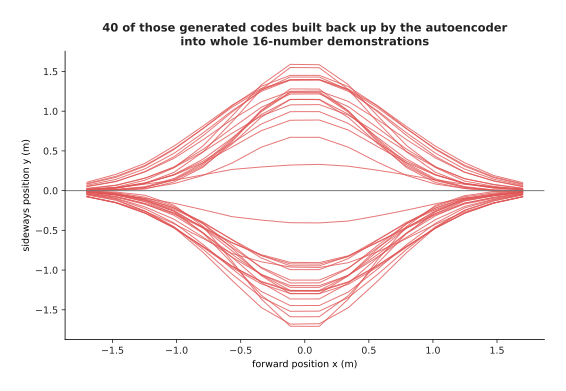

Of the 600 generated codes, 51.8 per cent decode into demonstrations that swerve
above the centre line, and their middle reading has a spread of 1.309 m against
1.391 m for the real ones.

The generator in those pictures works on 2 numbers rather than 16, which is 8
times fewer. The same arrangement is what makes picture and video generators
affordable, which the next picture shows at the size a real picture generator
works at.

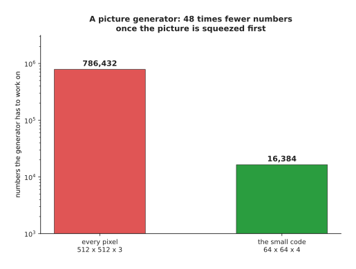

A 512 by 512 colour picture is 786,432 numbers, and a common arrangement shrinks
each side by 8 and keeps 4 channels, which is 16,384 numbers, or 48 times fewer.

That saving is not paid once. Every generating step works on the numbers again,
so every step pays the saving again. The next picture adds the numbers up over
fifty steps.

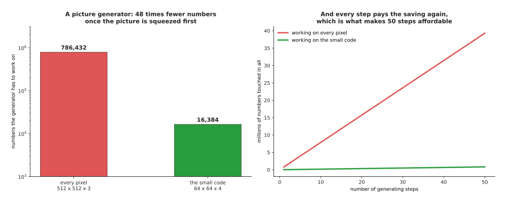

Over fifty generating steps a generator working on every pixel touches 39 million
numbers, while one working on the small code touches 0.8 million.

Two details are worth stating, because they are easy to get wrong. The first
concerns which autoencoder to use. The autoencoder used for this job is almost
always a **variational autoencoder**, which is usually shortened to VAE. It
differs from the plain autoencoder by pushing the codes to fill a tidy region
with no holes in it. This matters because a generated code sometimes falls
between two real ones, and with a tidy region such a code still decodes to
something sensible rather than to nonsense.

The second detail is that the squeezing costs accuracy. The finished picture can
never be better than what the autoencoder could rebuild. That is why latent
generators are sometimes criticised for small details such as text and faces.

One older family of generator should also be mentioned here, because you will
meet its name. The generative adversarial network, usually shortened to GAN, made
pictures by setting a maker network against a judge network. It has been largely
replaced by the diffusion and flow models on these two pages, because those are
far easier to train and because they cover the whole range of the data instead of
only a part of it.

---

## 5. Which generator suits which job

Section 4 was the last of the methods. All of them have now been built on the
same data and measured with the same score, so the comparison can be made with
numbers rather than with opinions. The settings used below are the ones each
method would actually be run at.

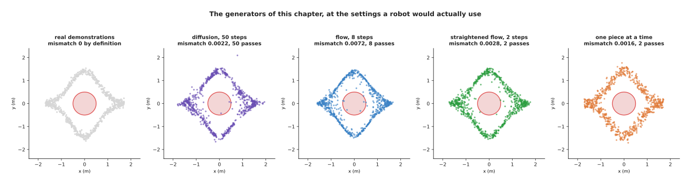

Diffusion with 50 steps scores 0.0022, the first flow model with 8 steps scores
0.0072, the straightened flow with 2 steps scores 0.0028, and generating one
piece at a time scores 0.0016.

The table below gathers the measurements. Read each row as one method. The passes
column gives how many times the network has to run to make one answer. The time
column gives what that many passes cost at the measured 12 microseconds each. The
last column says what the method costs you that the others do not.

| Method | Passes for one answer | Measured time | Mismatch score | What it costs |
| --- | --- | --- | --- | --- |
| diffusion, 50 steps | 50 | about 0.6 ms | 0.0022 | the most passes of any method here |
| flow matching, 8 steps | 8 | about 0.1 ms | 0.0072 | still several passes |
| straightened flow, 2 steps | 2 | about 0.025 ms | 0.0028 | a second round of training |
| one piece at a time, 2 pieces | 2 | about 0.025 ms | 0.0016 | one pass per piece of the answer |
| one piece at a time, 16 pieces | 16 | about 0.2 ms | not measured here | the passes cannot overlap |

The next picture asks a fairer question of the first three methods. It fixes the
quality at a mismatch of 0.01 and then counts the passes each method needs to
reach it.

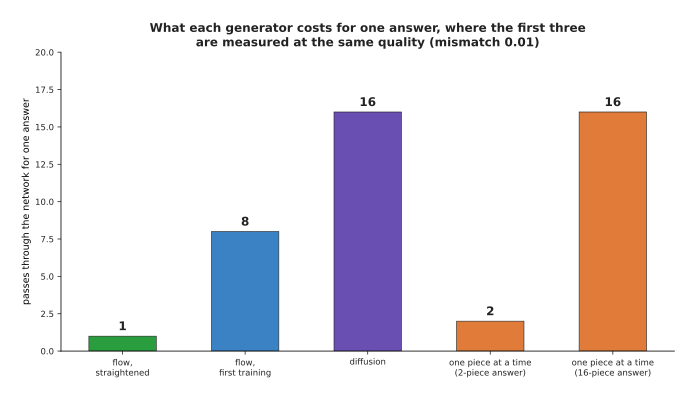

Measured at the same quality, the straightened flow model needs 1 pass, the first
flow model needs 8 and diffusion needs 16, while making the answer one piece at a
time needs exactly one pass per piece whatever the quality.

The deciding question on a robot is not which method scores best. It is which
method finishes in time. A **control rate** is how many commands a second the arm
expects, and it fixes the whole budget for one answer. Ten commands a second
leaves 100 ms. Thirty commands a second leaves 33 ms. Fifty commands a second
leaves 20 ms. The next picture turns those budgets into a number of passes, for
networks of four different speeds.

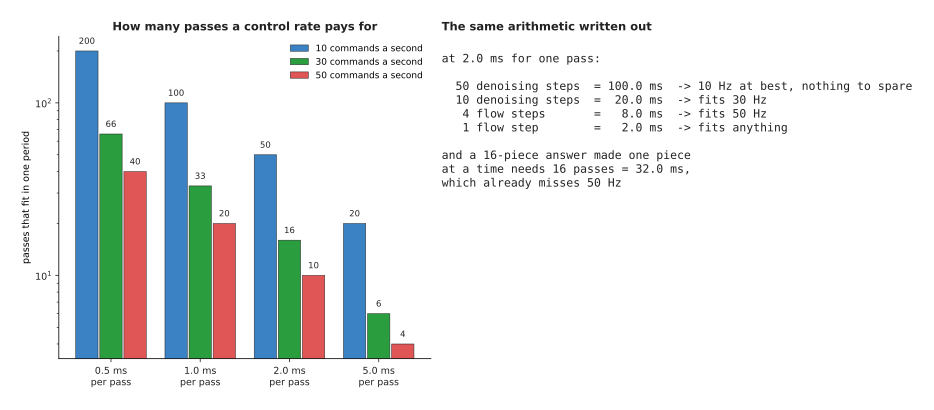

A network taking 2 ms per pass fits 50 passes at ten commands a second, 16 at
thirty and 10 at fifty, while a slower one taking 5 ms per pass fits only 20, 6
and 4.

Read the 2 ms column across and the whole argument of these two pages falls out
of it. Fifty denoising steps take 100 ms, which is the entire budget at ten
commands a second, and they leave nothing for the camera, the controller or
anything else. Sixteen steps take 32 ms, so they fit thirty commands a second.
Eight flow steps take 16 ms, so they fit fifty commands a second. Two steps of a
straightened flow model take 4 ms, so they fit anything an arm is likely to ask
for. A sixteen-piece answer made one piece at a time needs 16 passes, which is
32 ms, so it already misses fifty commands a second.

This is why flow matching and few-step samplers are not a refinement on an arm.
They are the thing that makes a generative policy possible at all. A few-step
sampler is one made either by straightening, as in section 1, or by distilling a
slow model into a fast one, which means training a small fast model to copy the
answers of a large slow one. The page on [diffusion and flow
policies](../12_models-that-act/02_diffusion-and-flow-policies.md) is about
exactly that problem. The last picture puts quality and time on one pair of axes
for every method on this page.

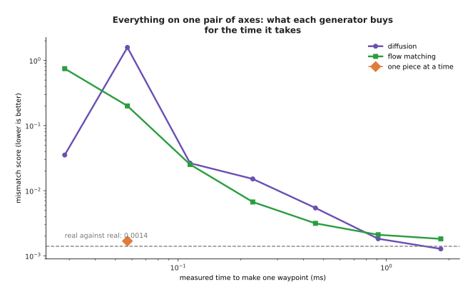

Up to the cost of sixteen steps the straightened flow model is the only one near
the floor, and from thirty-two steps onwards all three methods are within
measurement noise of each other.

So the guidance is this. Generate one piece at a time when the answer is a
sequence whose pieces genuinely come in an order and whose length is modest,
which is text, and accept that the cost grows with the length. Generate in a
latent space whenever the raw data is large and highly repetitive, which is
pictures, video and long trajectories, and accept that the finished result can
never be sharper than the autoencoder can rebuild. Use plain diffusion when you
have time to spare, because it is the best understood, has the most ready-made
code and is the least difficult to train. Use flow matching, straightened or
distilled, when a deadline decides the matter, which on a robot arm it almost
always does.

---

## 6. Where to read next

- [Recipes for models that act and
  predict](../13_starting-your-own-model/05_recipes-for-models-that-act-and-predict.md)
  says how to start a generative model of your own, and the one question that
  decides whether you need one at all.
- [Vision backbones](../09_models-that-see/01_vision-backbones.md) is the next
  page, and it explains how a camera picture is turned into the numbers that a
  conditioned generator can be handed.
- [Diffusion and flow
  policies](../12_models-that-act/02_diffusion-and-flow-policies.md) puts both
  generators on a real arm, with the control rate of section 5 as the deadline.
- [World models](../12_models-that-act/04_world-models.md) uses the latent
  spaces of section 4 to predict what happens next rather than what to do next.
- [Large language models](../10_language-and-multimodal-models/01_large-language-models.md)
  is the autoregressive generation of section 3 at full size.
- [Video prediction
  models](../../07_learned-models/08_world-models/03_also-used/01_video-prediction-models.md)
  in the model catalogue lists the named latent video generators and what they
  cost to run.

---

## 7. Using it in Python

Section 1 trained a network on straight lines between noise points and real
waypoints. Section 2 generated new waypoints by following the arrows that network
gives. The code below does both in PyTorch. The striking thing about it is how
much shorter it is than the diffusion version on the last page, because there is
no schedule and no noise to put back.

```python
import torch
from torch import nn

# The chapter's running example, so that this block runs as it stands: 6,000
# recorded waypoints, about half passing above the obstacle at the origin and
# half below, which is the two-moded shape sections 1 and 2 describe.
g = torch.Generator().manual_seed(8)
wx = torch.rand(6000, generator=g) * 4 - 2
side = torch.where(torch.rand(6000, generator=g) < 0.5, -1.0, 1.0)
wy = side * 1.41 * torch.cos(wx * torch.pi / 4)
waypoints = torch.stack([wx, wy], 1) + 0.05 * torch.randn(6000, 2, generator=g)

net = nn.Sequential(nn.Linear(3, 128), nn.Tanh(),   # 2 for the point, 1 for the time
                    nn.Linear(128, 128), nn.Tanh(),
                    nn.Linear(128, 2))              # section 1: names a direction
opt = torch.optim.Adam(net.parameters(), lr=2e-3)

for _ in range(4000):                               # section 1: the training loop
    x1 = waypoints[torch.randint(0, len(waypoints), (512,))]
    x0 = torch.randn_like(x1)                       # a noise point for each waypoint
    t = torch.rand(512, 1)                          # somewhere along the line
    xt = (1 - t) * x0 + t * x1
    loss = ((net(torch.cat([xt, t], 1)) - (x1 - x0)) ** 2).mean()
    opt.zero_grad(); loss.backward(); opt.step()

def follow(start, steps):                           # section 2: follow the arrows
    x = start.clone()
    for i in range(steps):
        t = torch.full((len(x), 1), i / steps)
        x = x + net(torch.cat([x, t], 1)) / steps
    return x

print(follow(torch.randn(1000, 2), 8).shape)        # torch.Size([1000, 2])

start = torch.randn(6000, 2)                        # section 1: straightening it
end = follow(start, 64).detach()                    # each start's own finish
# a second network trained on these (start, end) pairs is the straightened model
```

Those five lines of training loop are the whole of flow matching. The last two
lines are the whole of the straightening from section 1. The straightening works
only because each starting noise point is kept beside the waypoint it produced,
rather than beside a fresh random one.

In practice the libraries cover all of it. Hugging Face's `diffusers` package
provides `FlowMatchEulerDiscreteScheduler`, which is the loop above as a
scheduler object. The same package provides the latent autoencoders of section 4
as `AutoencoderKL`, so that a latent generator is an encoder, a flow model and a
decoder joined up. LeRobot ships flow-matching policies for arms with the
control-rate question of section 5 already answered in its configuration files.

What you still have to decide is the part that is yours. You have to decide how
many steps you can afford, and section 5 showed that your control rate settles
that rather than your taste. You have to decide whether the extra training round
for straightening is worth it, which turns on whether you are shorter of training
time or of running time. You have to decide whether to generate in a latent space
at all, which turns on how large and how repetitive your data is. If you do, you
then have to decide how long the code should be, which section 4 showed is a
question about how many real choices went into the data rather than a question
about the network.
