# Vision backbones

The page before this one, [flow matching and other
generators](../08_models-that-generate/02_flow-matching-and-other-generators.md),
finished the chapter about models that make something new. Those models start
with a cloud of random numbers and move it along a learned direction, step by
step, until it becomes a picture or a set of robot movements. This chapter asks
the opposite question. Here the picture already exists, because a camera on the
robot took it, and the job is to work out what is in the picture and where each
thing is. The models that do this are all built around one shared part, and
this page explains that part.

The page answers five questions. What is a **backbone**, and why is almost
every vision model built as one large shared piece with a small piece joined on
top of it? How does a vision transformer turn a photograph into numbers, one
patch at a time? What do convolutional networks still do better than
transformers? Why does a model that has to find small things need features at
several sizes rather than one? And what do the numbers that come out of a
pretrained backbone look like when you measure them?

It is written for a reader who has read
[attention](../06_the-transformer/01_attention.md), because this page does not
explain again what a query, a key and a value are. It also assumes [pictures,
sound and robot
states](../05_turning-the-world-into-numbers/02_pictures-sound-and-robot-states.md),
which explains how a photograph becomes a grid of numbers and what a patch is.
Two more pages are assumed as well: the convolution from [what a network can
learn](../02_inside-a-network/04_what-a-network-can-learn.md), and the frozen
pretrained model from [self-supervised
pretraining](../07_pretraining-and-adapting/01_self-supervised-pretraining.md).

Every number in the pictures is worked out by the script that draws them. The
camera scene is simulated, which means that it is drawn out of rectangles and
ellipses rather than photographed. The small networks in the last two sections
are really trained, in NumPy, on simulated pictures of shapes. This page
describes the machinery. The catalogue of real seeing models that you can
download is the chapter on [seeing
models](../../07_learned-models/03_seeing-models/01_overview.md) in the next
book.

## Contents

1. [A backbone and a head](#1-a-backbone-and-a-head)
2. [The vision transformer, patch by patch](#2-the-vision-transformer-patch-by-patch)
3. [Convolutional backbones, and what they still do better](#3-convolutional-backbones-and-what-they-still-do-better)
4. [What one picture costs](#4-what-one-picture-costs)
5. [Features at several sizes](#5-features-at-several-sizes)
6. [What a pretrained backbone gives you](#6-what-a-pretrained-backbone-gives-you)
7. [Where to read next](#7-where-to-read-next)
8. [Using it in Python](#8-using-it-in-python)

---

## 1. A backbone and a head

A vision model is almost never one single stack of layers running from pixels
to an answer. It is built in two pieces, because the two pieces are trained and
reused in different ways. The first piece is the **backbone**. The backbone is
the large part that reads the picture and turns it into numbers describing what
is in it, and it knows nothing about the question being asked. The second piece
is the **head**. A head is a small stack of layers that turns those numbers
into the particular answer one job needs, such as a class name, a box, or an
outline of an object.

The picture below shows that arrangement. One backbone reads the picture, and
three different heads read the backbone's numbers. Each head is labelled with
how many parameters it holds. A parameter is one number inside the model that
training is allowed to change.


The backbone holds 85,798,656 parameters. The three heads hold 769,000,
1,331,808 and 2,950,145 parameters. So the largest head is 3.4 parts in a
hundred of the backbone, and the smallest is 0.9 parts in a hundred.

Those sizes are worked out from the layer shapes of a plain vision transformer
with twelve blocks and 768 numbers per patch, which is the size most people
start from. The gap between the backbone and the heads is the whole reason for
the split, because the expensive part of the model is the part that does not
care which job you are doing.

It is also worth knowing where inside the backbone those parameters sit. The
next picture breaks the backbone into five parts and draws each part as a piece
of one bar, so that the width of a piece shows how many parameters it holds.


The feed-forward part of the twelve blocks holds 56,669,184 parameters, which
is 66.0 parts in a hundred of the backbone. The attention part holds
28,348,416, which is 33.0 parts in a hundred. The patch embedding and the
position vectors together hold 742,656, which is less than one part in a
hundred.

Those numbers are worth noticing, because people often assume that a vision
model is mostly attention. It is not. Two thirds of the parameters are in the
feed-forward part of the blocks, which is the ordinary stack of fully connected
layers inside each block, and only one third is in the attention part.

The split is worth the most when one robot has to do several jobs at once. The
next picture compares two ways of doing three jobs. The left bar is three
complete models, each with its own backbone. The right bar is one backbone with
three heads joined to it.


Three separate models cost 262,446,921 parameters. One shared backbone with
three heads costs 90,849,609 parameters. So sharing saves 65 parts in every
hundred.

Suppose a robot has to name what is on the table, draw a box round each object,
and mark the pixels of the one object it is about to pick up. Those are three
jobs, and sharing the backbone between them saves two thirds of the parameters.
You can go further than sharing. You can also **freeze** the backbone, which
means that you keep its learned numbers exactly as they came and train only the
heads. The next picture shows how few numbers then change during training, on a
scale where each step upwards multiplies by ten.

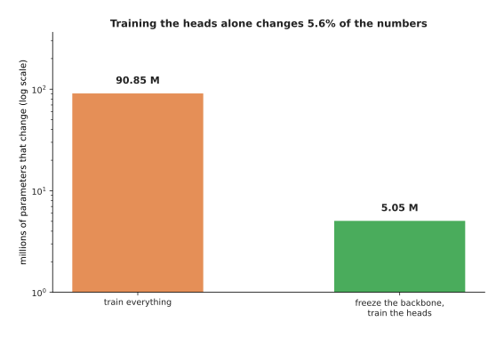

Training everything changes all 90,849,609 parameters. Freezing the backbone
leaves only the 5,050,953 parameters of the three heads changing, which is 5.6
parts in a hundred of the model.

The saving in memory is useful, but on a robot the saving in running cost
matters more, because the camera keeps producing new pictures. The next picture
counts the arithmetic needed every second at two camera speeds. The unit is the
multiply-add, which is one multiplication followed by one addition, and a tera
multiply-add is a million million of them.


At thirty pictures a second, running one shared backbone costs 0.53 tera
multiply-adds every second. Running a separate backbone for each of the three
jobs costs 1.58 tera multiply-adds every second.

That gap is usually the difference between a robot that keeps up with its
camera and a robot that cannot keep up with it. However, the split also costs
you something. The backbone has to be good enough for every job at once instead
of being perfect for one job. A frozen backbone also cannot be corrected by the
head, so if the backbone throws away the detail that one job needs, no small
head can put that detail back.

---

## 2. The vision transformer, patch by patch

The backbone now has a name, so the next question is what happens inside it.
The most common answer today is a **vision transformer**, which is a
transformer whose tokens are square patches of a picture instead of pieces of
words. A token is simply one item in the sequence the transformer reads. This
section follows one picture of 224 by 224 pixels through a vision transformer,
step by step.

The first step is to cut the picture into squares. The picture below shows the
same picture twice: once with the cutting lines drawn on it, and once with the
squares numbered in reading order.


Dividing 224 by 16 gives 14, so the picture is cut into a 14 by 14 grid of 196
square patches. Each patch covers 16 rows of 16 pixels in three colours, so one
patch holds 16 times 16 times 3, which is 768 pixel numbers.

The 196 patches together hold 150,528 numbers, and the picture itself held 3
times 224 times 224, which is also 150,528. Nothing has been thrown away yet,
because cutting a picture up does not lose any of it.

The second step turns each patch into one vector of numbers, and this step is
called the **patch embedding**. The 768 pixel numbers of a patch are laid out
in one long row, in reading order, and that row is multiplied by a learned grid
of weights. The picture below follows that arithmetic for one patch, from the
pixels at the top to the resulting vector at the bottom.


Patch 87 covers the rim of the front glass. Its first three pixel numbers are
0.674, 0.784 and 0.842. The first three weights of output number 0 are -0.029,
-0.048 and -0.009. Multiplying each pair gives -0.0195, -0.0374 and -0.0075, and
adding up all 768 such products gives -0.1898, which is the first number of the
patch's vector.

Each of the 768 output numbers is made this way, from its own set of 768
weights. The weights drawn here are seeded random numbers, because this script
trains no vision transformer, but the arithmetic is exactly the arithmetic that
a trained one does.

The third step adds position. It is needed because attention treats its input
as a bag of items rather than as a list. The next picture shows what that
means: the same 196 patches are drawn in their real order and in a random
order, and both reach attention as the same set of vectors.

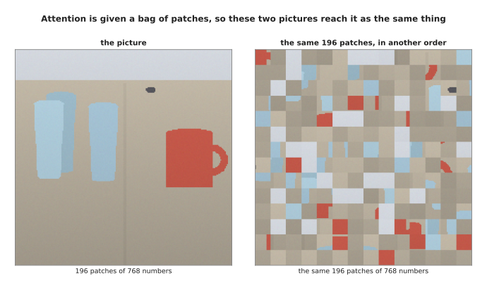

If you shuffle the patches, the model is handed the same 196 vectors, so it
cannot tell the shuffled picture from the real one.

The fix is to add a **position vector** to each patch vector, one for each of
the 196 places in the grid. The position vectors drawn here are built out of
sines and cosines of the row number and the column number. Two places that are
near each other get position vectors that point in nearly the same direction,
and two places far apart get vectors that do not. The next picture measures
that. Each square is one of the 196 places, and its colour says how alike that
place's position vector is to the one for patch 87.

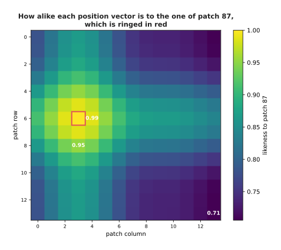

Patch 87's position vector is 0.986 alike to the one of the patch beside it,
0.952 alike to the one two rows below it, and only 0.706 alike to the one in
the far corner. That is how the model gets a sense of what is near what.

The fourth step puts one extra token in front of the 196 patch tokens. It is
called the **class token**. The picture below shows the sequence that then goes
into the first block.

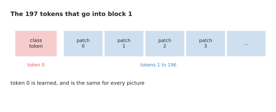

The class token is a vector of 768 numbers that is learned during training, and
it is the same vector for every picture the model is ever shown. The next
picture proves that by measuring how much each token differs between two
different pictures of the table.


Every patch token changes between the two pictures, by as much as 0.211 and by
0.057 on average. Token 0 changes by exactly 0.0, because it was never read
from the picture.

The class token therefore starts as an empty slot. As the blocks run, it
collects information from the patches through attention, so that by the end it
holds a summary of the whole picture in one vector. That is what the classify
head reads.

With the tokens built, the rest of the model is the stack of blocks described
in [attention](../06_the-transformer/01_attention.md). The important thing
about that stack is that it does not change the shape of anything. The picture
below lists the shape at every stage, from the picture itself down to the final
scores.


The picture holds 150,528 numbers and the 197 tokens hold 151,296. Every one of
the twelve blocks is given 197 tokens of 768 numbers and gives back 197 tokens
of 768 numbers, so only the meaning of the numbers changes. At the end the
classify head reads token 0 and nothing else, which is 0.51 in every hundred of
what the backbone gives back, and turns those 768 numbers into one score for
each of 1,000 class names. A head that has to say where things are ignores
token 0 and reads the other 196 tokens instead, because those still know which
part of the picture they came from.

---

## 3. Convolutional backbones, and what they still do better

The vision transformer of the last section became the usual choice from about
2021 onwards, but it did not replace the convolution everywhere. It would be
wrong to finish this page believing that convolutions are over. So this section
compares the two designs by asking, for each one, what it is given by its
design and what it has to learn from examples.

The first difference is how much of the picture one output number is allowed to
see. That amount is called the **receptive field** of the number. A convolution
looks through a small window, so its receptive field starts small and grows
only when you stack more layers. Attention has no window at all. The picture
below shows both facts, first as squares drawn on the picture and then as a
curve against the number of layers.


One number from a 3 by 3 convolution has looked at 3 pixels across after one
layer, 13 pixels after six layers and 29 pixels after fourteen layers. Real
convolutional backbones also halve the grid every so often, which makes the
window grow faster: 35 pixels after six layers and 243 pixels after fourteen.
After the first attention block, by contrast, every output number has already
looked at all 224 pixels.

That is the transformer's advantage. It can relate the handle at one side of
the picture to the cup at the other side immediately, without waiting for a
dozen layers to pass.

The second difference is what happens when the thing in the picture moves. The
test below takes the same scene twice, once with the camera moved five pixels
to the right. It runs both pictures through a small set of fixed 3 by 3
filters, slides the answer back by five pixels, and compares the part that both
answers cover. It does the same with the patch embedding of a vision
transformer.


After moving the camera five pixels sideways, the convolution maps are 0.00 per
cent different once they are slid back, and the patch vectors are 3.41 per cent
different. After moving it a whole patch of 16 pixels, both are 0.00 per cent
different.

The convolution comes out unchanged because a sliding window slides, so the
same filter meets the same pixels one step later. The patch vectors change
because the patch grid did not move with the camera, so every patch now holds a
different set of pixels. Only a move of a whole patch lines the grid up again.
In other words, a convolution is given this behaviour by its design, and a
transformer has to learn it from examples.

Being given something, rather than having to learn it, is worth the most when
examples are scarce. That is the third difference, and it is measured here by
really training two small networks. The pictures they are trained on are
simulated, and the next picture shows twelve of them.

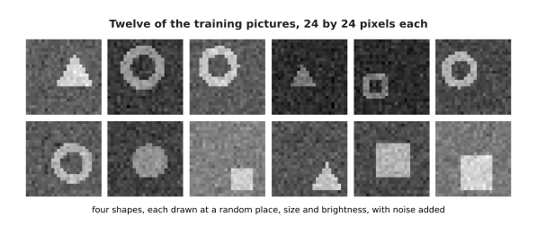

Each picture is 24 by 24 pixels and holds one of four shapes, drawn at a random
place, at a random size, at a random brightness, and with random noise added.
The job is to say which of the four shapes a picture holds.

Two networks are trained on these pictures. The first is convolutional, which
means that it slides the same filters over every position. The second is fully
connected, which means that it treats every pixel position as its own separate
input. The fully connected one is the better comparison for a vision
transformer, because a transformer is also never told that a picture has
neighbouring pixels. The next picture gives each network the same training
pictures, from 50 of them up to 3,200, and measures how often each network is
right afterwards.


The convolutional network holds 1,444 parameters and the fully connected one
holds 74,372. With 100 training pictures the convolutional network is right
0.699 of the time and the fully connected one 0.402 of the time. With 3,200
training pictures they reach 0.909 and 0.620. Each point is the average of
three training runs.

So the smaller network is right more often at every size of training set,
because it was given the fact that a picture has neighbouring pixels. This is why a vision transformer
trained from nothing on a small dataset usually disappoints, and why people
start from a pretrained one instead.

What happened after 2021 was less dramatic than people said at the time,
because the convolution did not lose to attention. It copied attention instead.
The picture below draws one block of a modern convolutional network, layer by
layer.

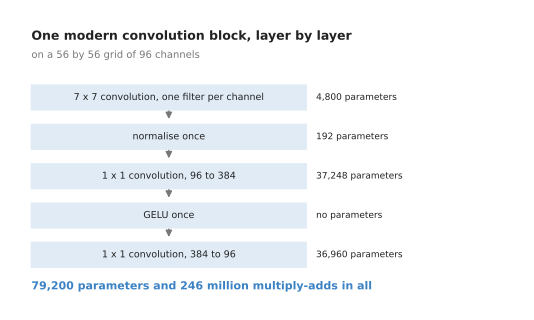

A modern block normalises its numbers once and uses one smooth activation rule,
where an older block normalised twice and used one activation after every
convolution. It widens its middle layer to four times the number of channels,
which an older block did not do. It also replaces the two small 3 by 3 windows
with a single wide window of 7 by 7 pixels, applied to each channel separately.

Every one of those habits is taken from the transformer block in
[attention](../06_the-transformer/01_attention.md), and the smooth activation
rule is the Gaussian error linear unit (GELU) from [one
neuron](../02_inside-a-network/01_one-neuron.md). The result is cheaper than
the older design, as the next picture shows. Each bar is one block's arithmetic
on the same grid, and the parameter count is written inside the bar.

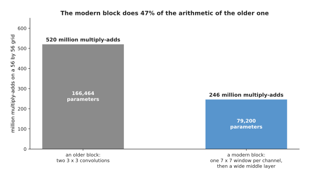

On a 56 by 56 grid of 96 channels, the older block costs 166,464 parameters and
520 million multiply-adds. The modern block costs 79,200 parameters and 246
million multiply-adds, which is 47 parts in a hundred of the older block's
arithmetic.

A modern convolutional network of this kind performs about as well as a
transformer of the same size on ordinary picture work. So the honest summary is
that the training recipe and the layout of the block mattered at least as much
as attention itself.

---

## 4. What one picture costs

The last section compared the two designs by what each one is given. This
section compares them by what each one costs, because on a robot the cost
usually decides the matter. Every count here is worked out from the layer
shapes rather than measured on a particular computer, and the unit is again the
multiply-add.

The first picture compares one run of each design on one picture. Each bar is
split into the parts that the arithmetic is spent on.


One 224 by 224 picture costs the vision transformer 17.56 thousand million
multiply-adds. The same picture costs the 50-layer convolutional network 4.09
thousand million, which is 4.3 times less.

The split inside the transformer is worth noticing. The feed-forward part takes
11.15 thousand million, which is 63.5 in every hundred. Making the queries, the
keys and the values takes 4.18 thousand million. The part that compares every
patch with every patch takes only 0.72 thousand million, which is 4.1 in every
hundred.

That last share of 4.1 in every hundred is small, and that is the reason people
are surprised by what happens when the picture grows. The next picture follows
both designs from 224 pixels across to 1,024 pixels across. The scale going up
is a log scale, so each step upwards multiplies by ten.


Going from 224 to 1,024 pixels across, the transformer goes from 17.6 to 659.8
thousand million multiply-adds. The convolutional network goes from 4.1 to 85.4
thousand million over the same range.

The reason the transformer grows faster is the part that compares every patch
with every patch. That part costs the square of the number of patches, while
everything else costs only as much as the number of patches itself. So as the
picture grows, the square term becomes the largest single part of the cost. The
next picture measures its share at each size.

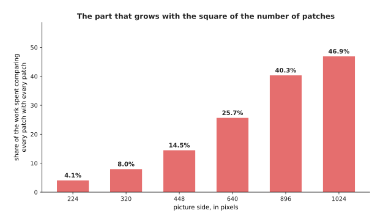

Comparing patch with patch is 4.1 in every hundred of the work at 224 pixels,
14.5 at 448 pixels, 25.7 at 640 pixels and 46.9 at 1,024 pixels. This is
exactly why a convolutional backbone is still a reasonable choice when the
pictures are large.

The patch size is the other number you can choose, and it trades detail against
cost. Making the patches smaller at a fixed picture size gives more patches, as
the next picture shows.


At a fixed picture of 224 pixels, patches of 32 pixels give 49 patches, patches
of 16 give 196, patches of 14 give 256 and patches of 8 give 784. Halving the
patch size multiplies the number of patches by four, because the patches shrink
in two directions at once.

The arithmetic grows faster than the patch count, because each patch is charged
for at every block and because the comparing part grows with the square. The
next picture shows the cost of the same four choices.

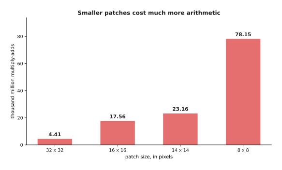

Patches of 32 pixels cost 4.41 thousand million multiply-adds, patches of 14
cost 23.16 thousand million and patches of 8 cost 78.15 thousand million. So
moving from 32 pixel patches to 8 pixel patches multiplies the patch count by
16 and the arithmetic by nearly 18.

You pay that price for a reason. The smallest thing a vision transformer can
describe is about one patch, because one patch becomes one vector and nothing
inside a patch is kept apart from anything else inside it. The next picture
shows the same small object three times, under three patch sizes.

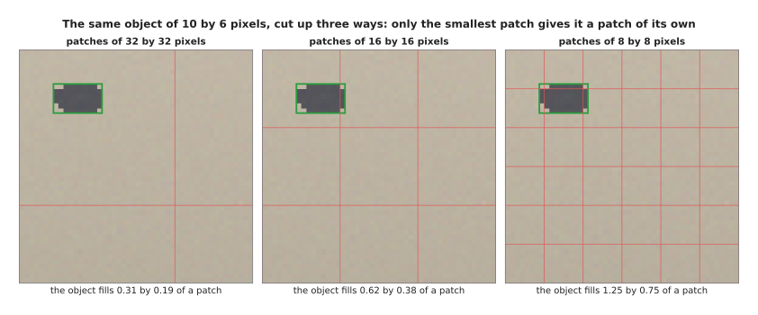

In the 224 by 224 picture this object is 10 pixels by 6. With patches of 32
pixels it fills 0.31 by 0.19 of one patch, with patches of 16 pixels it fills
0.62 by 0.38, and with patches of 8 pixels it fills 1.25 by 0.75. Only at the
smallest patch size does the object get a patch that is mostly itself.

The memory cost surprises people more often than the arithmetic cost does,
because the attention scores have to be held in memory while they are being
used. The next picture counts that memory as the picture grows, again on a log
scale.


At 224 pixels there are 197 tokens, so one score table holds 197 times 197,
which is 38,809 numbers. Twelve blocks of twelve heads at two bytes a number
come to 11 megabytes. At 1,024 pixels there are 4,097 tokens, so one table
holds 16,785,409 numbers and the same count comes to 4,834 megabytes for a
single picture.

That is why the work on cheaper attention described in [why the transformer
won](../06_the-transformer/04_why-the-transformer-won.md) matters so much for
vision, where the number of tokens is large by nature.

---

## 5. Features at several sizes

The costs in the last section all assumed one grid of patches. For naming a
picture, one grid is enough. For finding things in a picture it is not, and the
camera arithmetic below is what settles the question.

A backbone does not have to give back only one grid of numbers. A convolutional
backbone halves its grid several times as it goes, so it can give back the grid
after each halving. The amount by which a grid is coarser than the picture is
called its **stride**. A stride-4 grid has one cell for every 4 by 4 block of
pixels, a stride-32 grid has one cell for every 32 by 32 block, and a set of
levels like this is called a **feature pyramid**. The next picture shows the
same scene at four of those levels.


The four levels hold 19,200, 4,800, 1,200 and 300 cells. The small bolt spans
4.5 by 2.5 cells at the finest level and only 0.56 by 0.31 of a cell at the
coarsest.

Whether that matters is decided by the camera rather than by the network. Every
camera has a focal length, measured here in pixels. The focal length is how
many pixels wide an object one metre across looks when it is one metre away
from the camera. The width of a thing in pixels is then its real width
multiplied by the focal length and divided by its distance. The next picture
draws that rule for two objects, with lines marking the size of one cell at
three of the pyramid levels.


A camera 1,280 pixels wide with a 60 degree view has a focal length of 1,109
pixels. A glass 70 millimetres across then looks 155.2 pixels wide at half a
metre, 77.6 pixels wide at one metre and 19.4 pixels wide at four metres.
Beyond 2.42 metres the glass is narrower than a single cell of the stride-32
grid, and a bolt 10 millimetres across is narrower than one of those cells at
any distance beyond 0.35 metres.

The same point can be made inside one picture instead of across distances. The
next picture zooms in on the small object in the scene and draws two of the
grids over it, with a bar chart of how many cells it covers at four strides.


The small object is 18 pixels by 10. It covers 11.25 cells of the stride-4
grid, 2.81 cells of the stride-8 grid, 0.70 of a cell of the stride-16 grid and
0.18 of a cell of the stride-32 grid.

When a thing is smaller than one cell, it has no square of the grid to itself.
Whatever that cell says has to describe the table as well as the object. A
detector working only from the coarsest grid would have to find this object
inside a cell where the object is less than a fifth of what the cell saw. That
is why detectors look at several levels at once and let the small things be
found on the fine ones.

The fine levels have a problem of their own. They come from early layers, and
an early layer has not looked at much of the picture yet. The next picture
measures that for the two ends of the pyramid, by drawing round one point the
square that one cell of each level has looked at.

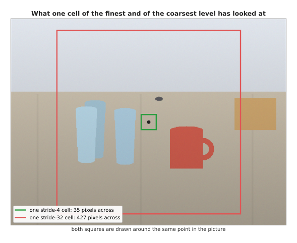

One cell of the stride-4 level has looked at a square 35 pixels across. One
cell of the stride-32 level has looked at a square 427 pixels across. So the
fine level knows where the edges are but has not seen enough of the picture to
know what the object is, and the coarse level has the opposite problem.

The usual fix is to carry the coarse levels back down to the fine ones. Every
level is first brought to the same width of 256 numbers per cell by a 1 by 1
convolution, which is a convolution whose window is a single cell. Then the
coarsest level is stretched to twice its size and added to the next finer one,
that sum is stretched and added again, and so on down the pyramid. The next
picture draws the whole arrangement.


The 1 by 1 convolutions cost 984,064 parameters and the four 3 by 3
convolutions that tidy the added levels cost 2,360,320, so the whole pyramid
costs 3,344,384 parameters.

That is less than one block of the transformer in section 2, which holds
7,087,872 parameters. Every level then ends up holding both the fine positions
and the coarse meaning, which makes this the cheapest useful thing you can add
to a backbone.

---

## 6. What a pretrained backbone gives you

Sections 2 to 5 described the machinery. This section asks what comes out of
it. The claim that one frozen backbone can serve classifying, detecting and
segmenting is only worth making if its numbers really do group things sensibly,
so this section measures whether they do. The demonstration uses a small
convolutional backbone trained here, in NumPy, on simulated pictures of four
shapes. It is then asked about three shapes it has never been shown.

The first measurement takes one picture and asks which other pictures lie
nearest to it. Nearness is measured twice: once between the raw pixels, and
once between the 16 numbers the backbone gives back.


The query picture is a cross. The five nearest pictures in raw pixels are a
bar, a cross and three more bars, so one of the five matches. The five nearest
in the backbone's 16 numbers are a cross, a bar, a cross, a diamond and a
cross, so three of the five match.

The backbone here is the small convolutional network from section 3, trained to
tell four shapes apart, which it does correctly 0.972 of the time on held-out
pictures of those four shapes. What is asked of it now is something it was
never trained for, because these three shapes are new to it. The question is
only which other pictures its output numbers place nearby.

One query picture proves nothing on its own, so the next measurement repeats it
for every picture and averages the result.


Of the five nearest pictures, 45 in every hundred are the same shape when
nearness is measured in raw pixels, against 89 in every hundred in the backbone
features, for the four shapes it was trained on. For three shapes it had never
seen the same counts are 59 and 78 in every hundred.

The second pair of bars is the important one. It says that the backbone's
numbers carry something about shape in general, and not only about the four
particular shapes it was trained on. That is exactly what makes a frozen
backbone worth downloading.

The same thing can be seen rather than counted. Each picture is 576 raw numbers
or 16 backbone numbers, and both of those can be flattened onto the two
directions along which the pictures spread out most. The next picture draws 600
pictures of three unseen shapes in both of those flattened views.


In raw pixels the three shapes lie in one mixed cloud. In the backbone features
the bars pull away from the rest, and the crosses and the diamonds separate in
part.

The backbone was never told that these three shapes exist, and it still pushes
them apart. That is why a small head trained on a few hundred examples can
finish the job.

It is worth knowing why raw pixels do so badly, because the reason is not that
pixels carry too little information. The reason is that the distance between
two sets of pixels measures the wrong thing. The next picture takes 300 random
pairs of pictures and plots, for each pair, how different the two pictures are
in overall brightness against how far apart they are.


In raw pixels the link between the two is 0.93, where 1.0 would mean that one
is exactly a measure of the other. In the backbone features the same link is
0.49.

A link of 0.93 means that pixel distance is very nearly a measure of brightness
and almost nothing else. The backbone has not thrown brightness away, because
its link is still 0.49, but brightness no longer decides the distance on its
own. That is the plainest statement of what a pretrained backbone gives you.

---

## 7. Where to read next

- [Detection and segmentation](02_detection-and-segmentation.md) is the next
  page, and it puts heads on this backbone: boxes, outlines, and the
  measurements that say whether a guess was right.
- [Open-vocabulary vision](03_open-vocabulary-vision.md) then explains how a
  backbone can name a thing nobody listed when it was trained.
- [Depth and 3D](04_depth-and-3d.md) covers what else a backbone can give back,
  such as a distance for every pixel, which is what turns a box on a screen
  into a place an arm can reach.
- [Vision-language
  models](../10_language-and-multimodal-models/03_vision-language-models.md)
  shows the other common use of this backbone, which is to feed a language
  model with picture tokens.
- [Self-supervised
  pretraining](../07_pretraining-and-adapting/01_self-supervised-pretraining.md)
  explains how these backbones are trained without anybody labelling the
  pictures, which is where their quality comes from.
- [Image
  classification](../../07_learned-models/03_seeing-models/03_also-used/01_image-classification.md)
  is the catalogue page for the simplest head of all, with the real models you
  can download.

---

## 8. Using it in Python

This section builds the two backbones of this page in PyTorch, and prints the
counts that sections 1, 2 and 5 worked out by hand.

```python
import torch
from torchvision.models import resnet50, vit_b_16
from torchvision.models.feature_extraction import create_feature_extractor

vit = vit_b_16(weights=None)                     # section 2's vision transformer
print(sum(p.numel() for p in vit.parameters()))  # 86567656 = 85,798,656 + 769,000

picture = torch.zeros(1, 3, 224, 224)            # one 224 by 224 colour picture
patches = vit.conv_proj(picture)                 # section 2's patch embedding
print(patches.shape)                             # torch.Size([1, 768, 14, 14])
tokens = patches.flatten(2).transpose(1, 2)      # 196 patches of 768 numbers
print(tokens.shape)                              # torch.Size([1, 196, 768])

cnn = resnet50(weights=None)                     # section 3's convolutional backbone
print(sum(p.numel() for p in cnn.parameters()))  # 25557032 = 23,508,032 + 2,049,000

levels = create_feature_extractor(cnn, {'layer1': 's4', 'layer2': 's8',
                                        'layer3': 's16', 'layer4': 's32'})
scene = torch.zeros(1, 3, 480, 640)              # section 5's 640 by 480 picture
for name, grid in levels(scene).items():         # the four levels of the pyramid
    print(name, tuple(grid.shape))               # s4 (1, 256, 120, 160) ... s32 (1, 2048, 15, 20)
```

The library gives you the arrangement of the layers, the arithmetic and a set
of trained weights, and the counts it prints are the ones this page worked out
from the layer shapes. Passing `weights='DEFAULT'` instead of `weights=None`
downloads a backbone that somebody has already trained on millions of pictures,
which is the kind of backbone section 6 measured. Calling
`requires_grad_(False)` on the backbone's parameters is what freezing means in
code.

What you still have to decide is the shape of the problem rather than the shape
of the layers. You choose how large a picture to feed in, knowing from section
4 what each extra pixel costs and from section 5 what a smaller picture does to
small objects. You choose whether to freeze the backbone, which makes training
cheap but limits how far the model can move from what it already knows, or to
fine-tune it, which is the subject of [fine-tuning and
adapters](../07_pretraining-and-adapting/03_fine-tuning-and-adapters.md). You
choose which levels of the pyramid to take, because `create_feature_extractor`
will hand you any of them and a head that only names things needs only the
last.

The one thing the library will not decide is which backbone suits your robot.
The honest way to settle that is to measure both on your own pictures, at the
resolution you will really use. The counts above say what the arithmetic costs,
but they do not say what your camera, your objects and your computer will do
with it.
