# Detection and segmentation

The page before this one, [vision backbones](01_vision-backbones.md), explained
the large shared part of a vision model. That part reads a picture and turns it
into numbers. It ended with the point that one backbone can serve several
different jobs, because each job only needs its own small head. This page is
about those jobs. It explains what each job gives back, how a guess is scored
against the truth, and why the job that a robot arm needs is often not the job
a beginner asks for first.

The page answers six questions. What are the four different jobs that people
run together under the word recognition, and which one does an arm actually
need? What is a box, written as a set of numbers, and how do you measure
whether a guessed box is right? Why does a detector produce many overlapping
guesses, and what removes the extra ones? How do you measure a detector
honestly? How do modern detectors avoid producing overlapping guesses at all?
And what is a mask, written as numbers, including the kind of model that gives
you one without being told what the thing is?

It is written for a reader who has read [vision
backbones](01_vision-backbones.md), because the words backbone, head, feature
grid and stride are used here without being explained again. It also assumes
that you know what a score between 0 and 1 means, from [the score of being
wrong](../03_how-training-works/01_the-score-of-being-wrong.md), and that you
know the idea of training on labelled examples from [what a model
is](../01_what-learning-means/03_what-a-model-is.md).

Everything in the pictures is worked out by the script that draws them. The
camera scene is simulated, which means that it is drawn out of rectangles and
ellipses rather than photographed. The detector's guesses are simulated as
well. Each true box is moved by a small random amount, and each guess is given
a score that is higher when the guess covers the object better, which is how a
trained detector behaves. Every method that is then run on those guesses is the
real method. The models you can download are catalogued in [object
detection](../../07_learned-models/03_seeing-models/02_most-used/01_object-detection.md)
and
[segmentation](../../07_learned-models/03_seeing-models/02_most-used/02_segmentation.md).

## Contents

1. [Four jobs that are easy to confuse](#1-four-jobs-that-are-easy-to-confuse)
2. [What a box is, and how a guess is scored](#2-what-a-box-is-and-how-a-guess-is-scored)
3. [Why a detector guesses many times](#3-why-a-detector-guesses-many-times)
4. [Measuring a detector honestly](#4-measuring-a-detector-honestly)
5. [Set prediction: slots matched one to one](#5-set-prediction-slots-matched-one-to-one)
6. [Masks, and models that take a prompt](#6-masks-and-models-that-take-a-prompt)
7. [Where to read next](#7-where-to-read-next)
8. [Using it in Python](#8-using-it-in-python)

---

## 1. Four jobs that are easy to confuse

The backbone from the last page gives back numbers that describe a picture. The
first thing to settle is what you want those numbers turned into, because there
are four different jobs here, and people often use the single word recognition
for all four of them. The simulated scene used throughout this page holds six
objects of four kinds: three drinking glasses standing close together, a mug, a
box, and a small bolt a long way back on the table.

The picture below shows that one scene answered in all four ways, so that the
four answers can be compared side by side.

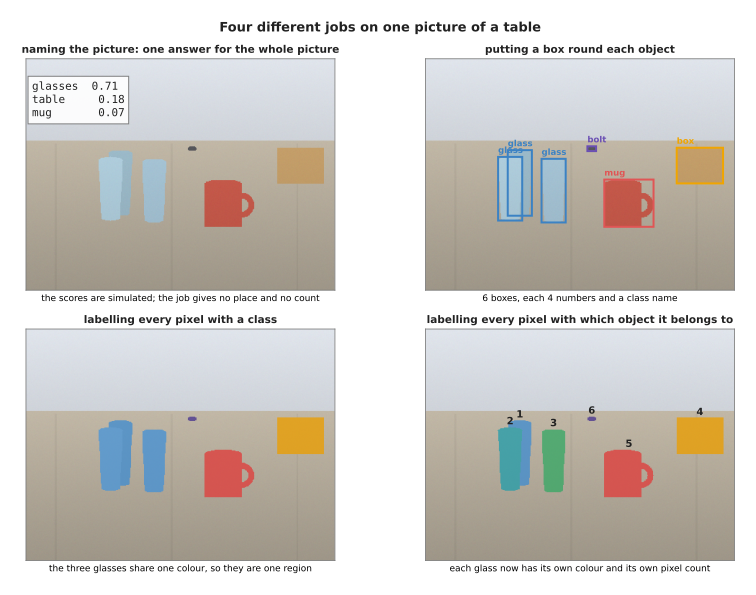

The first job gives one name for the whole picture. The second gives six boxes.
The third gives four coloured regions, one for each class, in which the three
glasses share a single colour. The fourth gives six coloured regions, one for
each object.

The first job names the picture, with no place and no count, so it cannot tell
you that there are three glasses. The second job puts a **bounding box** round
each object. A bounding box is a rectangle whose sides are lined up with the
sides of the picture, and it comes with a class name and a score. The third job
labels every pixel with a class, so it marks the glass pixels as glass and the
table pixels as table. The fourth job labels every pixel with which individual
object it belongs to, and that job is called **instance segmentation**.

The difference between the third job and the fourth is the one that matters on
a robot arm. The three glasses show why, so the next picture draws them under
both jobs, with the middle of each region marked by a cross.

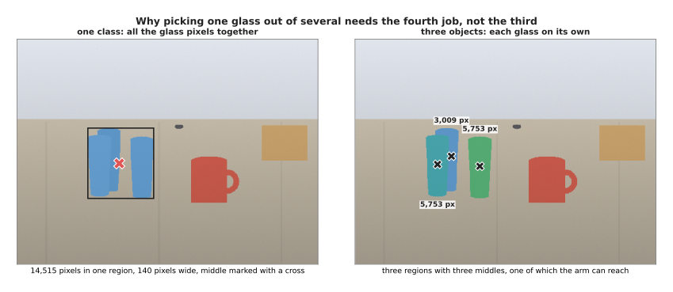

Labelling by class puts all 14,515 glass pixels into one region that is 140
pixels wide, and the middle of that region, at (217, 264), lands on no glass at
all. Labelling by object gives three regions of 3,009, 5,753 and 5,753 pixels,
with three middles that each land on a glass.

The class region is 2.8 times as wide as one glass, so its middle falls in the
gap between two of them. An arm sent to that point would close its fingers on
nothing. Labelling by object instead gives three regions with three middles,
and each of those is a point the arm can really go to.

The four jobs also differ in how much data they produce, and that matters
because the data has to be moved for every picture the camera takes. The next
picture counts the numbers in each answer, on a log scale, so each step to the
right multiplies by ten.

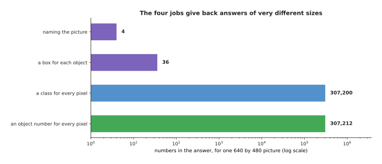

For one 640 by 480 picture, naming the picture gives 4 numbers and the six
boxes give 36 numbers. Labelling every pixel with a class gives 307,200
numbers, and labelling every pixel with an object number gives 307,212.

So the two pixel-labelling jobs give back about eight thousand times as much
data as the box job. If the camera runs at thirty pictures a second, all of
that has to be produced and moved thirty times a second.

The last picture of this section fixes one task and asks what point each job
would hand to the arm. The task is to pick up the glass nearest the camera, and
that glass is shaded.

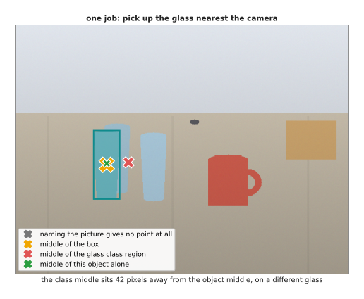

Naming the picture gives no point at all. The middle of the box and the middle
of the object land 3 pixels apart, and both of them land on the glass. The
middle of the glass class region lands 42 pixels away, on no glass at all.

So the plain answer to the question of which job a robot needs is this. If the
arm only has to say whether anything is on the table, naming the picture is
enough. If it has to count things, or point a camera at one of them, boxes are
enough. If it has to move around the table without touching it, labelling by
class is enough, because the table is one thing anyway. But if it has to pick
one glass out of several, it needs the fourth job and not the third, because
the third gives one region for all the glasses and a point 42 pixels away from
the glass the arm meant to take.

---

## 2. What a box is, and how a guess is scored

The last section settled which job to ask for. The next thing is to be precise
about what a box is, and about what it means for a guessed box to be right,
because the whole of training and of measurement depends on that one number.

A box is four numbers and nothing else. The next picture draws one box around
the mug and then writes the same box in three different ways.

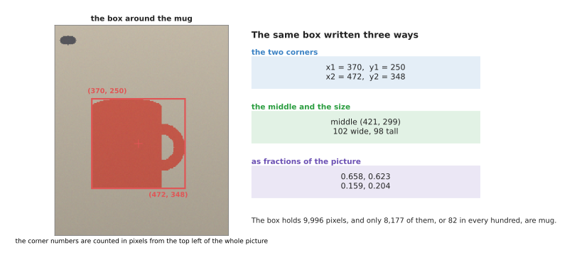

The four numbers can be the left, the top, the right and the bottom edge, which
for the mug are 370, 250, 472 and 348, counted in pixels from the top left
corner of the picture. The same box can be written as its middle, at (421,
299), together with a width of 102 and a height of 98. It can also be written
as the fractions 0.658, 0.623, 0.159 and 0.204 of the picture.

Models usually learn the second form, the middle and the size, because the
middle and the size can be predicted separately from each other. The numbers
are often divided by the width and the height of the picture to give fractions,
so that the same four numbers mean the same thing at any picture size. Notice
already that the box holds 9,996 pixels while the mug itself holds only 8,177,
so 82 in every hundred pixels inside this box are mug and the rest are table.

Now take a guessed box and a true box, and ask how close they are. The measure
that everybody uses is called **intersection over union**, which is usually
shortened to IoU. The name says exactly what it does: it divides the area the
two boxes share by the area they cover together. The next picture works through
that arithmetic on one guess.

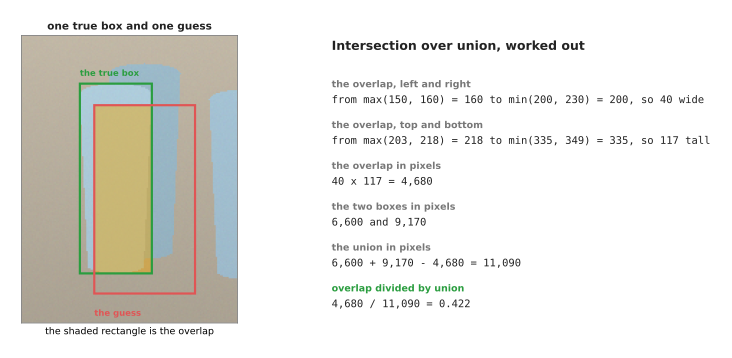

The shared area runs from the larger of the two left edges to the smaller of
the two right edges, so it is 40 pixels wide. The same working from top to
bottom gives 117 pixels, so the shared area is 4,680 pixels. The two boxes
cover 6,600 and 9,170 pixels, so together they cover 6,600 plus 9,170 minus
4,680, which is 11,090 pixels. Dividing 4,680 by 11,090 gives 0.422.

The overlap is taken off once in that sum, because otherwise it would be
counted twice. The division at the end is what makes the number useful. It is 1
only when the two boxes are identical, and it falls towards 0 as the boxes
drift apart, whatever the size of the object.

People often choose a threshold on this number without knowing what the
threshold allows. So the next picture shows five guesses against the same true
box, each one moved further than the one before.

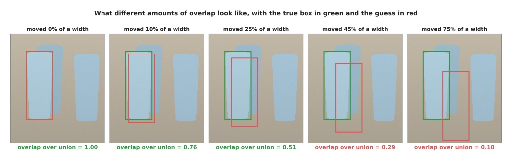

Moving the guess sideways by a tenth of the box's width drops the overlap to
0.761. Moving it by a quarter drops it to 0.509, by nearly half to 0.291, and
by three quarters to 0.096.

A guess moved by a tenth of the box width scores 0.761 and still looks almost
right. One moved by a quarter scores 0.509, and it is visibly off but still
sits on the object. One moved by three quarters scores 0.096, and it is
pointing somewhere else. That is why 0.5 is the usual line between a hit and a
miss, and why a stricter line of 0.75 is used when the exact edges matter.

The threshold is not a small detail, because it changes the answer to the
question "how many objects did the detector find" without anything about the
detector changing at all. The next picture takes one fixed set of 21 guesses
and counts the objects found at six different thresholds.

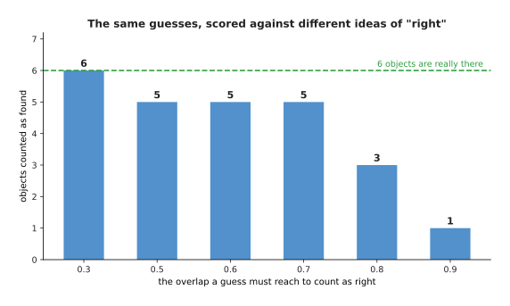

From the same 21 guesses, six objects count as found when the overlap only has
to reach 0.3. Five count as found at 0.5, three at 0.8, and one at 0.9.

So a sentence such as "it found almost everything" means nothing until somebody
says which threshold it was measured at. This is the commonest way in which
detector results are quoted misleadingly.

---

## 3. Why a detector guesses many times

The last section scored one guess against one object. In practice a detector
hands you many more guesses than there are objects. The reason is the way it is
built, and not a mistake.

A detector of the older and still very common kind asks the same question at
every cell of a feature grid: is there an object here, and if there is, where
are its edges? Every cell answers for itself, because no cell is told what the
other cells said. The next picture shows what that produces around one mug.

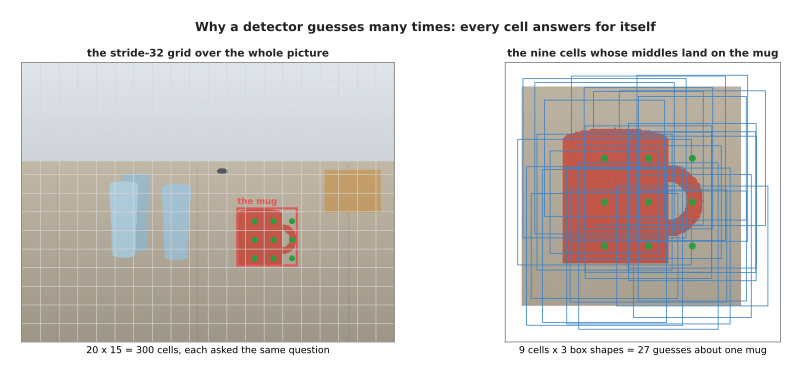

On the stride-32 grid from the last page, a 640 by 480 picture has 20 by 15
cells, which is 300 cells. Each cell is usually asked about several box shapes
at once, so three shapes a cell makes 900 guesses for one picture. Nine of
those cells have their middles inside the mug, and every one of those nine can
see the mug perfectly well, so the detector makes 27 guesses about the mug
alone.

The usual cure is a rule called **non-maximum suppression**. The rule keeps the
box with the highest score, throws away every lower-scoring box that overlaps
it by more than a set amount, then takes the best of the boxes that are left
and does the same again, until there is nothing left to check. The next picture
follows that rule on the real guesses from this scene. Only the 15 guesses that
score 0.40 or more are drawn, so that the boxes can be told apart.

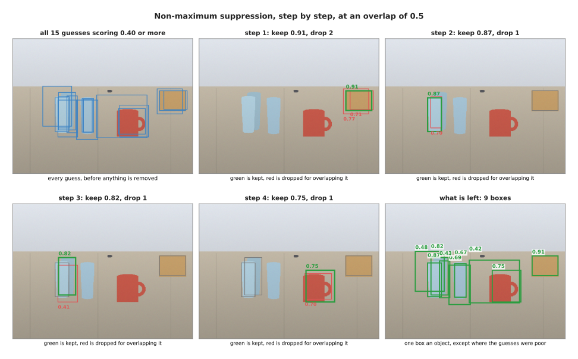

The first step keeps the guess scoring 0.91 and drops two guesses that overlap
it by 0.65 and 0.74. The second step keeps 0.87 and drops one guess that
overlaps it by 0.66. The third keeps 0.82 and drops one that overlaps by 0.60.
The fourth keeps 0.75 and drops one that overlaps by 0.70. Nine boxes are left
standing, with scores of 0.91, 0.87, 0.82, 0.75, 0.69, 0.67, 0.48, 0.43 and
0.42.

The trouble is that the amount of overlap you allow is a number somebody has to
choose, and that number is wrong in both directions. The next picture sweeps it
from 0.1 to 0.9 and counts how many boxes come out.

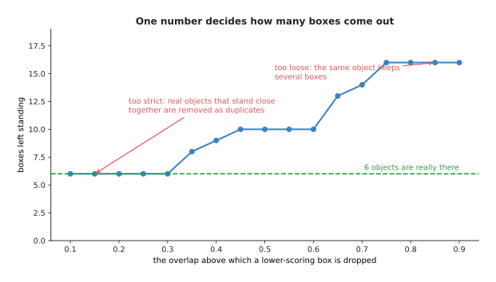

Suppressing at 0.1 leaves only 5 boxes, which is fewer than the 6 objects that
are really there. Suppressing at 0.9 leaves 15 boxes, because almost nothing
counted as a duplicate.

The low setting loses real objects because two objects standing close together
were taken for duplicates of each other. That failure is not rare, and the two
glasses in this scene show it exactly. The next picture draws their true boxes
and then the result of suppressing at two settings.

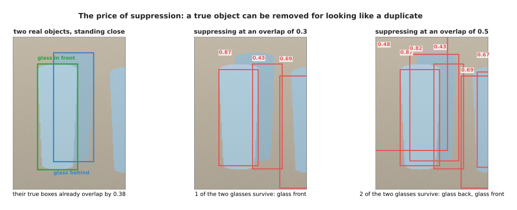

The true boxes of these two glasses already overlap by 0.376 of their union,
because one glass stands partly in front of the other. So any threshold below
0.376 deletes a correct answer, and at 0.3 only the glass in front survives. At
0.5 both of them survive.

There is no setting of this one number that is right both for a crowded shelf
and for a table with things spread out on it. That is the main reason why the
design in section 5 exists.

---

## 4. Measuring a detector honestly

Section 3 left us with nine or twenty-one boxes, depending on the threshold,
and with no way of saying whether that was good. This section measures it
properly. The measurement uses all 21 boxes that survive suppression, with no
score threshold applied at all.

The measurement starts by sorting every guess by its score and then going down
the list from the best score to the worst. A guess counts as right when it
overlaps a real object by 0.5 or more and that object has not already been
claimed by a better-scoring guess. Two numbers are kept as you go down the
list. **Precision** is the share of the guesses so far that were right.
**Recall** is the share of the real objects that have been found so far. The
next picture shows the first twelve rows of that list as a table. Read it one
row at a time from the top, and read the last two columns as the running score
after that row.

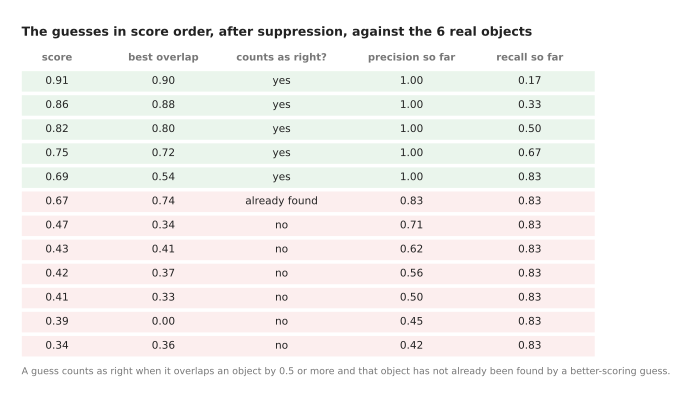

The first five guesses are all right, so precision stays at 1.00 while recall
climbs to 0.83. The sixth guess scores 0.67 and overlaps an object by 0.74, and
it still counts as wrong.

That sixth guess is the interesting one. It overlaps the glass on the right by
0.74, which is a good box by any standard, and it is still counted as wrong
because a guess scoring 0.69 had already claimed that glass. That is how
duplicates are punished.

Plotting precision against recall as you go down the list gives a curve, and
the area under that curve is called the **average precision**. The next picture
draws the curve with the area shaded.

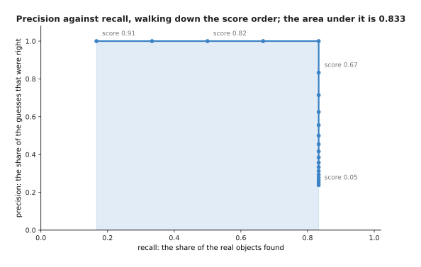

Precision stays at 1.00 until recall reaches 0.83 and then falls away to 0.24.
The area under the curve is 0.833.

The curve never reaches a recall of 1.0, and the reason is worth knowing. The
bolt is 18 pixels by 10, and the best guess anywhere near it overlaps it by
only 0.32, so no guess covers it well enough to count. The small-object problem
from the last page appears here as a number.

Average precision describes the whole curve, but a robot has to pick one point
on that curve, because it either acts on a box or it does not. The next picture
follows precision and recall as the score threshold rises.

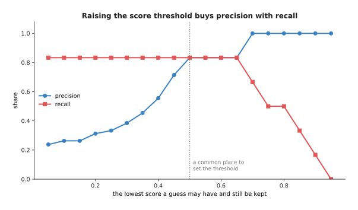

Keeping only the guesses that score 0.30 or more gives a precision of 0.38 with
a recall of 0.83. Keeping those at 0.50 or more gives 0.83 and 0.83. Keeping
those at 0.70 or more gives a precision of 1.00 with a recall of 0.67.

Keeping every guess that scores 0.30 or more means that most of what the arm is
told about is not there. Keeping only those at 0.70 or more means that
everything the arm is told about is real, and that a third of the objects are
missed. Which of those is right depends on whether a wrong grasp or a missed
object costs you more, and that is a question about the robot rather than about
the model.

This is also where quoting results dishonestly becomes easy. A bare precision
number depends entirely on which guesses were thrown away before the counting
started. Average precision does not, because the curve already uses the best
precision available at each level of recall. The next picture measures both on
the same guesses, four times, throwing away more of the weak guesses each time.

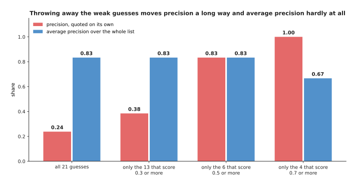

Measured on all 21 guesses, precision is 0.24 and average precision is 0.833.
Measured on the 6 guesses that score 0.5 or more, precision is 0.83 and average
precision is still 0.833. Only at a threshold of 0.7, where real objects start
to be thrown away with the weak guesses, does average precision fall, to 0.667.

So a precision of 0.83 and a precision of 0.24 can describe the very same
detector, depending only on what somebody dropped first. That is why average
precision is the number people publish.

Average precision still depends on the overlap threshold from section 2, and
that threshold is a choice as well. The next picture measures the same detector
five times, demanding a different overlap each time.

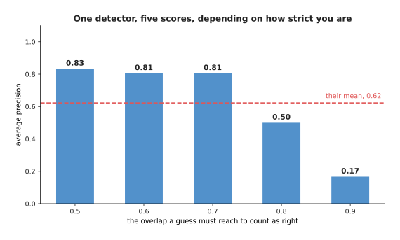

The same detector scores an average precision of 0.833 when a guess must
overlap by 0.5, 0.806 at 0.6 and at 0.7, 0.500 at 0.8 and 0.167 at 0.9. The
mean of those five numbers is 0.622.

Published results usually quote that mean, or a mean like it, which is where
the figures given for real detectors come from. The numbers 0.833, 0.167 and
0.622 all describe the same detector on the same pictures. So when somebody
quotes one of them, the useful question is which one.

---

## 5. Set prediction: slots matched one to one

Everything in sections 3 and 4 was made harder by one thing. The detector
answered many times for each object, so a clean-up step with a threshold chosen
by hand had to run afterwards. The newer design removes the cause instead of
the symptom.

A set-prediction detector has a fixed number of **query slots**, which is 20
here. Each slot gives back exactly one box, one class name, and one score for
whether there is anything there at all. A slot is allowed to answer "nothing",
and most of them do. The next picture shows the slots that answered, and then
all 20 slots with what each one said.

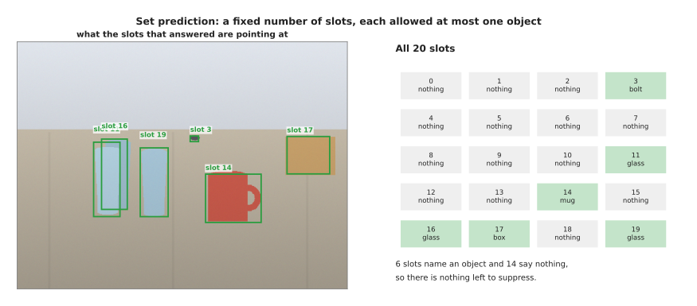

Six of the 20 slots name an object and 14 of them say nothing, against the 6
objects that are really there. The six that name an object are already the
final answer, so there is nothing to suppress and no overlap threshold to
choose.

What makes the slots behave like that is how they are trained. For each
training picture, the cost of pairing every slot with every real object is
worked out. The cost used here is one minus the overlap, plus twice the
distance between the two middles divided by the diagonal of the picture. Then
the one-to-one set of pairings with the lowest total cost is chosen. The next
picture shows six candidate slots over three glasses, and the table of every
pairing's cost.

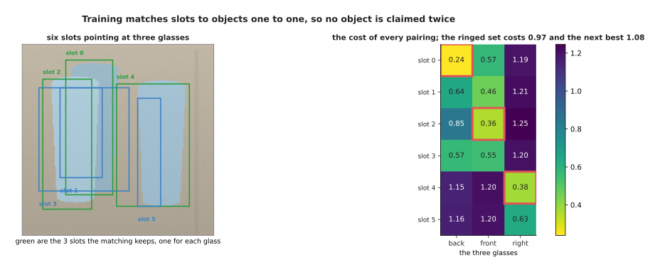

The diagonal of this 640 by 480 picture is 800 pixels. The cheapest set of
three one-to-one pairings costs 0.975 in total, and the next cheapest set costs
1.081, which is 11 per cent more.

Because the pairing is one to one, each real object is given to exactly one
slot, and each slot is given at most one object. Every slot that was not paired
is then trained to answer "nothing". That one-to-one rule is what makes the
whole design work, and it is worth seeing on a single object.

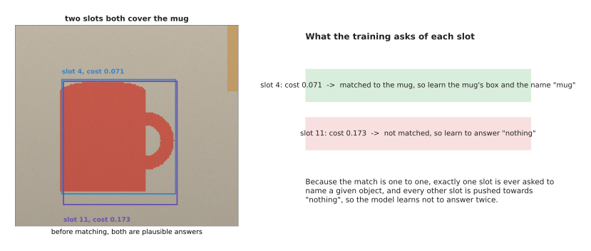

Two slots both cover the mug well, at a cost of 0.071 and 0.173. The matching
gives the mug to the cheaper of the two and trains the other one to answer
"nothing".

Nothing about either box is wrong. Both of them would be perfectly good
answers. Only the cheaper one is allowed to keep the mug, and the other is told
that the right answer there is "nothing". Over many pictures this teaches the
model that answering twice is always punished, so by the end of training it
does not answer twice.

The next picture compares what each design finally gives back, against the six
objects that are really in the picture.

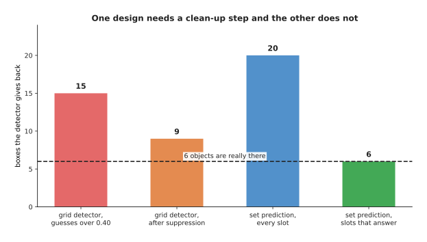

The grid detector gives back 15 guesses above 0.40, and 9 after suppression.
The set-prediction model gives back 20 slots, of which 6 answer. Six objects
are really there.

What you gain is that the output is already the answer. There is no threshold
to tune when the robot moves to a new table, and nothing deletes a real object
for standing too close to another one. What you give up is that the number of
slots is a fixed limit, so a model with 20 slots can never report 21 objects.
These models also take considerably longer to train, because early in training
the matching keeps changing its mind about which slot owns which object. Named
models of both kinds are listed in [object
detection](../../07_learned-models/03_seeing-models/02_most-used/01_object-detection.md).

---

## 6. Masks, and models that take a prompt

The last four sections were all about boxes, and section 2 showed that a box
holds many pixels that are not the object. This last section is about the answer
that does not: a **mask**, which is one number for every pixel saying whether
that pixel belongs to the thing.

A mask is not a shape or an outline inside the computer. It is a grid of
numbers, the same size as the region it describes, each number between 0 and 1,
saying how sure the model is that this pixel is part of the object. The next
picture shows the mug's mask, then one small window of the numbers behind it,
then the same window after the numbers are cut at 0.5.

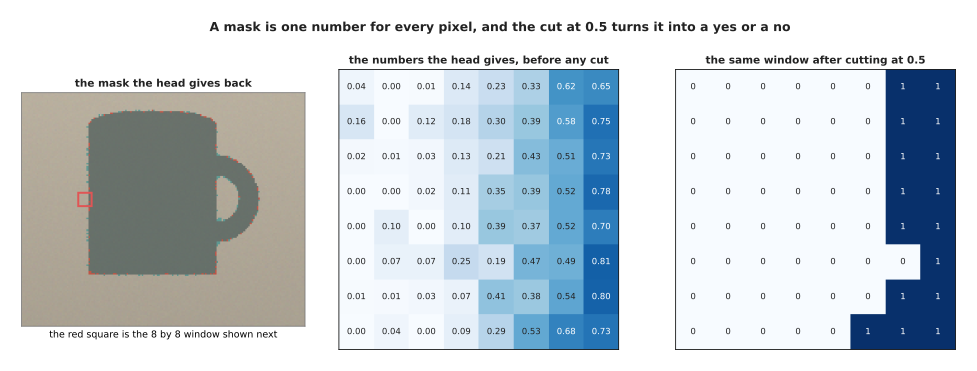

Each row of the window climbs from near 0 on the table side to about 0.7 on the
mug side, across eight pixels. Cutting at 0.5 turns those numbers into zeros
and ones. For this mug the cut mask holds 8,174 pixels against the true 8,177,
and the two agree on 8,086 of the 8,265 pixels that either of them claims,
which is an overlap of 0.978.

The usual way to get a mask is to put a small head on top of the detector. The
features inside each box are cut out and squashed to a fixed grid of 14 by 14,
so that the head always sees the same shape whatever size the object was. The
next picture draws the layers of that head, with the shape of the numbers at
each step.

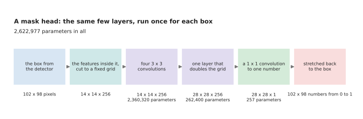

Four 3 by 3 convolutions of 256 channels run over the 14 by 14 grid, which
costs 2,360,320 parameters. One layer doubles the grid to 28 by 28, which costs
262,400. A 1 by 1 convolution then brings each place down to a single number,
which costs 257. That is 2,622,977 parameters in all, and those 28 by 28, or
784, numbers are stretched to the size of the box, which for the mug is 9,996
pixels.

The head only ever answers inside the box, so it never has to say anything
about the rest of the picture. That is what keeps it small.

The head runs once for every box the detector found, and that is why masks cost
more than boxes on a robot. The next picture draws the consequence. The
backbone's arithmetic is a flat line, because the backbone runs once for the
picture, and the mask head's arithmetic is a rising line.

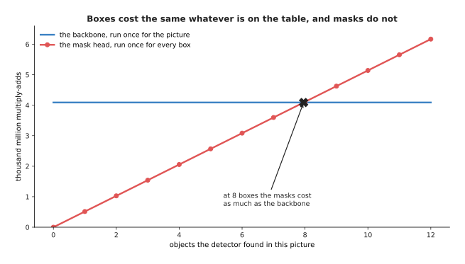

One run of the mask head costs 514 million multiply-adds. One run of a 50-layer
convolutional backbone on a 224 by 224 picture costs 4.09 thousand million. So
once there are about 8 objects to mask, the masks cost as much as the backbone
that found them.

The other cost of a mask head is accuracy, and it is lost in the stretching.
The head draws on a small grid, and that small drawing then has to be stretched
to the size of the box. The next picture draws the mug's mask at three grid
sizes and measures the loss at five.

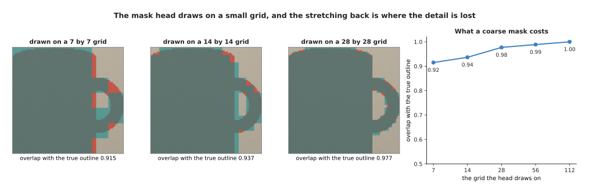

A mask drawn on a 7 by 7 grid and stretched back overlaps the true outline by
0.915. A 14 by 14 grid gives 0.937, a 28 by 28 grid gives 0.977 and a 56 by 56
grid gives 0.989.

Those look like small losses until you ask where the wrong pixels are. At 14 by
14, 419 of the 540 wrong pixels lie in the thin handle of the mug. So a coarse
mask is good enough for the body of a thing and poor at anything thin. That
matters a great deal when the thin part is the part the arm has to grip.

The newest kind of segmentation model changes the question. Instead of being
trained on a list of classes and asked which pixels are mugs, a **promptable
segmentation** model is given a point or a box and asked which pixels belong to
the thing there. The Segment Anything family of models works this way. The next
picture shows one point prompt answered twice and one box prompt answered once.

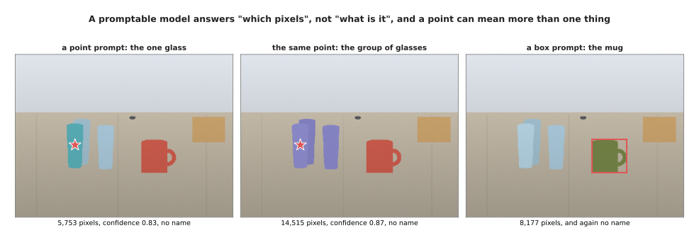

A point at (175, 266) can honestly mean the one glass, which is 5,753 pixels,
or the group of glasses, which is 14,515 pixels. So the model returns more than
one mask, with a confidence for each one, and lets whatever asked the question
choose. None of these answers carries a class name, because the model was never
told what any of these things are called.

That is exactly why these models are used inside robot programs as a tool
rather than as a recogniser. Something else decides what to pick, usually a
detector or a vision-language model. The promptable model is then handed that
box or that point and asked only for the pixels, which it does well even on
objects nobody trained it on. Those pixels are what the grasp is worked out
from, as the next picture shows.

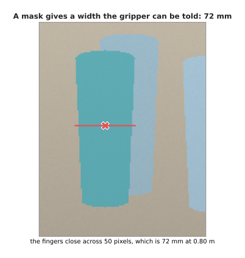

The mask of the near glass is 50 pixels across its narrow way. The camera is
640 pixels wide with a 60 degree view, so its focal length is 554 pixels, and
at 0.80 metres one pixel is 1.44 millimetres. The narrow way is therefore 72
millimetres, which is a number the gripper can be given.

A point chosen inside the box alone carries no such promise, because a box says
nothing about which of its pixels belong to the object. The next picture shades
the parts of the mug's box that are not mug.

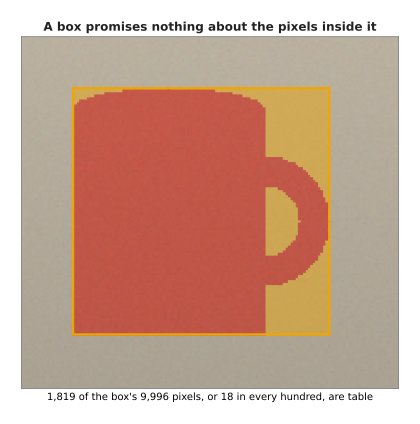

The mug's box holds 9,996 pixels and the mug holds 8,177, so 1,819 of the box's
pixels, or 18 in every hundred, are table.

So the choice between a box and a mask depends on what the robot does next. If
the next step only needs to know roughly where the object is, the box is enough
and it is far cheaper. If the next step needs the pixels themselves, such as
how wide to open the fingers, only the mask will do.

---

## 7. Where to read next

- [Open-vocabulary vision](03_open-vocabulary-vision.md) is the next page, and
  it removes the fixed list of class names from everything on this page, so
  that a detector can be asked for a thing nobody listed when it was trained.
- [Depth and 3D](04_depth-and-3d.md) then turns a mask on a screen into a place
  in the room, which is what the arm actually needs before it can move.
- [Vision-language
  models](../10_language-and-multimodal-models/03_vision-language-models.md)
  explains the kind of model that decides what to point a promptable segmenter
  at, by reading an instruction and a picture together.
- [Behaviour cloning and action
  chunks](../12_models-that-act/01_behaviour-cloning-and-action-chunks.md)
  shows what happens after the seeing, when a model turns what it saw into
  movement.
- [Object
  detection](../../07_learned-models/03_seeing-models/02_most-used/01_object-detection.md)
  is the catalogue page for real detectors, with what each one costs and where
  each one fails.
- [Segmentation](../../07_learned-models/03_seeing-models/02_most-used/02_segmentation.md)
  does the same for mask models, including the promptable ones and how they are
  used on an arm.

---

## 8. Using it in Python

The arithmetic in sections 2 and 3 is one line each in `torchvision`, and the
numbers below are the ones this page worked out by hand.

```python
import torch
from torchvision.ops import box_iou, nms
from torchvision.models.detection import maskrcnn_resnet50_fpn

truth = torch.tensor([[150., 203., 200., 335.]])   # section 2: the true box
guess = torch.tensor([[160., 218., 230., 349.]])   # section 2: the guess
print(box_iou(truth, guess))                       # tensor([[0.4220]])

boxes = torch.tensor([[522., 185., 614., 255.],    # section 3: three guesses
                      [513., 178., 603., 267.],    # about the same box on the table
                      [537., 185., 620., 251.]])
scores = torch.tensor([0.91, 0.77, 0.71])
print(nms(boxes, scores, iou_threshold=0.5))       # tensor([0]): only the best survives

model = maskrcnn_resnet50_fpn(weights=None).eval()  # boxes and masks together
with torch.no_grad():
    out = model([torch.zeros(3, 480, 640)])[0]      # one 640 by 480 picture
print(sorted(out.keys()))                           # ['boxes', 'labels', 'masks', 'scores']
print(out['boxes'].shape, out['masks'].shape)       # (N, 4) and (N, 1, 480, 640)
```

The library gives you the overlap arithmetic, the suppression rule, and a whole
trained detector with a mask head on it, and the shapes it hands back are the
ones this page described. Note that `masks` comes back at the full picture size
even though the head drew on a 28 by 28 grid. The stretching has already
happened, and with it the loss measured in section 6.

What the library will not do is decide the two numbers that matter. The
suppression threshold in `nms` is the one from section 3, and setting it too
low deletes real objects that stand close together, as the two glasses showed.
The score threshold that you apply to `out['scores']` is the operating point
from section 4, and it moves precision and recall against each other, with
nothing to tell you which way to go except what a mistake costs your robot.

What the library also will not tell you is whether you needed a mask at all.
Boxes are smaller, faster, and enough for counting and for pointing a camera. A
mask costs a head that runs once for every box, and that cost is only worth
paying when something afterwards uses the pixels, such as how wide to open the
fingers, or which of three glasses standing together the arm is about to grip.
