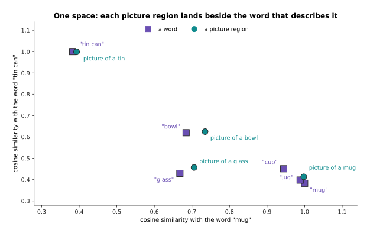
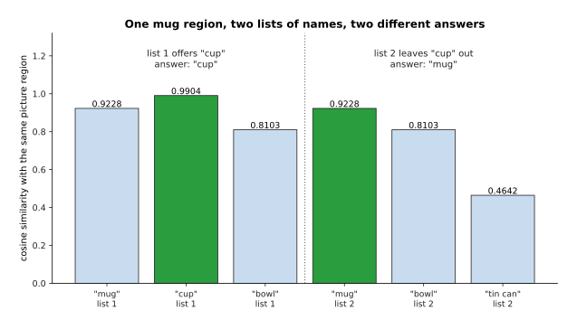
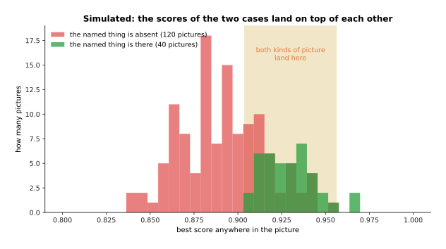
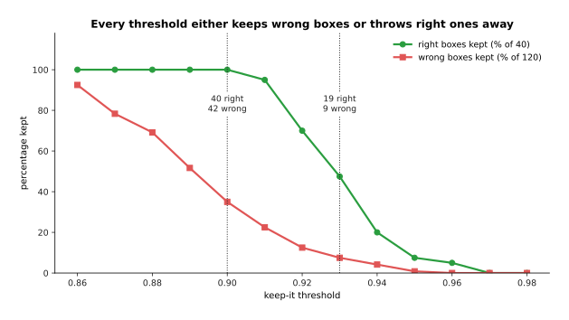
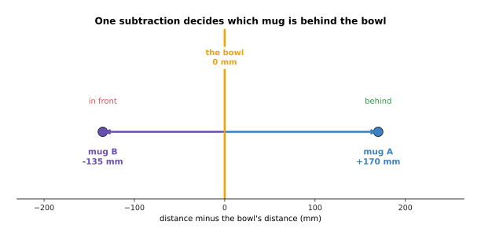
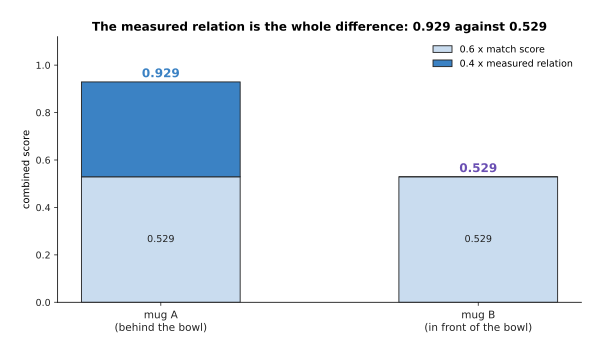
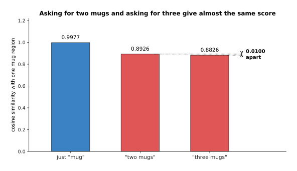
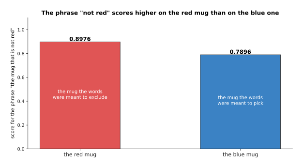
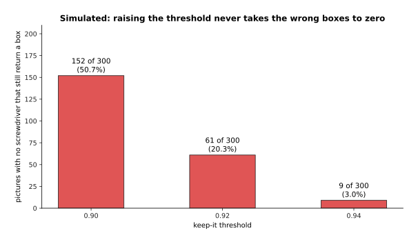
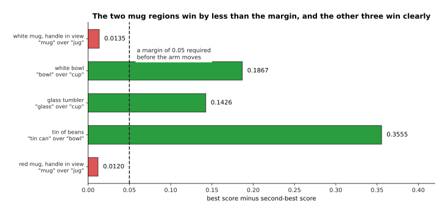

# Naming a thing the model was never trained on

The page before this one, [detection and
segmentation](02_detection-and-segmentation.md), built a model that draws a box
round every object it can see, and then draws the exact outline of the object
inside that box. That model has one hard limit. The limit is not in what the
model can see. The limit is in what the model can say, because the last layer of
a detector has one output for each name it was trained on, so the model can only
ever report one of those names. A robot arm working in a real room meets hex
keys, cable ties, calibration boards and tubes of thermal paste. A model trained
on a fixed list of household names has no output for any of them, so it cannot
report them at all.

This page is about how a model names something it was never given a label for.
The idea it rests on is simple. A picture can be turned into a list of numbers,
and a piece of text can be turned into a list of numbers of the same length. The
two kinds of list are made to live in the same space, which means the list for a
photograph of a mug lands near the list for the words "a mug". Once that is
true, you can name a region of a picture by writing down any name you like and
seeing which name lands closest. That is what **open vocabulary** means: the set
of names is not fixed when the model is trained, and you choose the set when you
ask the question.

By the end of this page you will understand why a fixed list of names runs out
on a robot, how one shared space lets a model name a thing it has never been
trained on, how a whole picture is searched with such a model, why a phrase like
"the mug behind the bowl" needs measured distances as well as matching, and
which four failures of this method cost the most when an arm acts on the answer.

The page is written for a reader who has read [vision
backbones](01_vision-backbones.md) and [detection and
segmentation](02_detection-and-segmentation.md), so you should already know what
a backbone is, what a bounding box and a mask are, and how a detector guesses
many boxes and then thins them down. You should also have read [self-supervised
pretraining](../07_pretraining-and-adapting/01_self-supervised-pretraining.md),
which explains contrastive learning and the shared picture-and-text space, and
[tokens and
embeddings](../05_turning-the-world-into-numbers/01_tokens-and-embeddings.md),
which explains what a vector is and how cosine similarity measures how close two
vectors are.

Every number on this page is worked out by
`docs/diagrams/models_that_see_2.py`, and the script prints each number when it
runs. The shared space the arithmetic runs in is invented for this page. It has
thirteen directions, and each direction has a plain English name, so that you
can follow every multiplication by hand. A real model has hundreds of
directions, and nobody has given any of them a name. What is real is the
arithmetic and the behaviour that comes out of it, because every failure shown
at the end of this page follows from the shape of the calculation rather than
from the particular numbers that were chosen.

## Contents

1. [Why a fixed list of names runs out on a robot](#1-why-a-fixed-list-of-names-runs-out-on-a-robot)
2. [One space for pictures and for words](#2-one-space-for-pictures-and-for-words)
3. [Finding and naming without a list](#3-finding-and-naming-without-a-list)
4. [Grounding a phrase to a region](#4-grounding-a-phrase-to-a-region)
5. [What goes wrong, and why it costs more on an arm](#5-what-goes-wrong-and-why-it-costs-more-on-an-arm)
6. [Where to read next](#6-where-to-read-next)
7. [Using it in Python](#7-using-it-in-python)

---

## 1. Why a fixed list of names runs out on a robot

The detector on the page before this one was trained on a list of names. Every
picture in its training set was labelled with boxes, and each box was drawn
round a thing whose name was on that list. The list is therefore fixed in the
last layer of the network, and it cannot be changed without training the network
again. To see how much that costs in practice, take one tray from a robot
workshop and check each thing on the tray against a list of twenty common names.

The picture below lists the fourteen things on the tray. A blue row marked "yes"
means the detector has an output for that name, and a red row marked "no" means
it has none.


Six of the fourteen things on the tray have a name the detector can report,
which is 42.9 per cent of them, and the other eight cannot be reported at all.

The six that work are the kitchen things. They work because somebody once
decided that those words belonged on a list of common household objects. The
eight that fail are the workshop things, and they fail because nobody put them
on the list. One case is worse than a plain failure. The mug on the tray gets
reported as a cup, because "mug" is not one of the twenty names and "cup" is the
nearest thing the model is allowed to say.

The obvious answer is to make the list longer. The picture below shows what that
answer costs in human time. Suppose one new name needs 150 boxes drawn by hand,
and suppose one box takes eighteen seconds of somebody's time. Each new name
then costs 45 minutes of labelling before anything else happens.


Growing the list from 80 names to 200 adds 90 hours of labelling, and that is
before the model is trained again.

Those 90 hours buy 120 extra names. That is nothing like the number of things
that turn up on a workbench. The labelling is also only the first part of the
cost, because the model then has to be trained again, and every robot running
the old model has to be updated. A list long enough for a real room is not
reachable this way.

That is why it is worth looking at what a model can do with no examples at all.
Working with no labelled examples of a thing is called **zero-shot**. Working
with a handful of examples, usually somewhere between one and about twenty, is
called **few-shot**. The picture below compares the two on invented data, so the
heights mean nothing on their own, but the shape of the curve is the point.


In this simulated comparison a zero-shot model scores 0.61 with no examples at
all, one example scores 0.456, five examples score 0.584, and the curve only
passes the zero-shot line at ten examples a class.

Training on one or two examples of a new thing is worse than not training at
all. The reason is that so few examples teach the model the background and the
lighting of those two photographs rather than the object itself. Zero-shot costs
nothing and is available immediately, which is what a robot needs when somebody
puts a new object on the table. The next section explains how a model can name a
thing when it has seen no examples of that thing.

---

## 2. One space for pictures and for words

The zero-shot line in the last picture has to come from somewhere. It comes from
training a model so that pictures and words end up in the same space. A picture
goes through a vision backbone of the kind described on [vision
backbones](01_vision-backbones.md), and it comes out as one list of numbers. A
piece of text goes through a text network, and it comes out as another list of
numbers of the same length. Training then pushes the two lists together when the
words describe the picture, and pulls the two lists apart when they do not. That
training method is the contrastive learning that
[self-supervised pretraining](../07_pretraining-and-adapting/01_self-supervised-pretraining.md)
explains.

The picture below shows what "the same space" means in practice. Each item in
the picture is measured twice: once against the word "mug" and once against the
word "tin can". A square is a word, and a circle is a region of a photograph.



The picture of a mug lands 0.030 away from the word "mug" on this map, and the
picture of a tin lands beside the word "tin can", which is what one shared space
for pictures and words buys you.

To follow the arithmetic you need a space small enough to read. The rest of this
page therefore uses an invented space with thirteen directions, and each
direction has a name in plain English. The first eight directions describe how a
thing looks and what it is for. The table below gives the value of six words and
two picture regions along each of those eight directions. Read one row at a time:
each row is one word or one region, and each column is one direction. A darker
cell means a larger value.


The word "mug" has 0.90 on the handle direction while the word "cup" has only
0.35, and the two picture regions below the red line are the same white mug
photographed twice, once with its handle hidden at 0.22 and once with the handle
in view at 0.85.

Everything that follows is worked out from that table. To compare a picture
region with a name you multiply the two lists together one direction at a time,
add up the results, and divide by the lengths of the two lists. That measure is
the cosine similarity explained in [tokens and
embeddings](../05_turning-the-world-into-numbers/01_tokens-and-embeddings.md). It
is 1 when the two lists point the same way, and it is 0 when the two lists have
nothing in common. The picture below writes out the whole sum for the mug whose
handle is hidden, against the two words that could describe it.


The products add up to 2.788 for "mug" and 2.852 for "cup", and after dividing
by the lengths the cosine similarities are 0.9228 for "mug" and 0.9904 for
"cup".

So the model picks the wrong name, and the reason it picks the wrong name is
worth understanding. The handle is the one direction that separates the two
words, because "mug" has 0.90 there and "cup" has only 0.35. In this photograph
the handle is behind the body of the mug, so the picture has only 0.22 on that
direction. Every other direction agrees with both words. This means the handle
decides the answer, and the handle is not visible. The model is not being
stupid, because a cup is a fair description of what is in front of the lens.
However, a robot that was told to fetch a mug now has a region labelled "cup",
and the robot will reject that region.

The picture below ranks all six names against that one region, so you can see
how close the first two are.


Ranked against the region, "cup" comes first at 0.9904, the right answer "mug"
comes second at 0.9228, and "jug" is close behind at 0.9012.

The fix for this failure is not a better model but a better viewpoint. Turn the
mug ninety degrees so that the handle faces the camera. That turn changes the
region's value on the handle direction from 0.22 to 0.85, and it changes nothing
else. The picture below scores the same six names against the mug in both
positions.


With the handle in view "mug" scores 0.9977 and wins, and with the handle hidden
"cup" scores 0.9904 and wins, from the same object and the same model.

There is one more thing to know before these scores are used for anything, and
it is about how the scores are reported. All six scores for the hidden-handle
mug sit between 0.4642 and 0.9904, and the gap between the top two is only
0.0676. The scores sit in such a narrow band because every vector in a shared
space of this kind points broadly the same way. A model that has to give a
percentage first multiplies the scores by a fixed number, usually about 100, and
then turns the results into percentages with a softmax. A softmax is the step
that takes a list of numbers and turns it into a list of percentages that add up
to 100. Multiplying by 100 first stretches small gaps enormously, and the
picture below shows the same six scores before and after that step.


A gap of 0.0676 in cosine similarity becomes 99.9 per cent against 0.1 per cent
once the scores are multiplied by 100, so a confident-looking answer can rest on
almost nothing.

That stretching is not a mistake, because the model was trained with the same
multiplication. However, it means you must never read 99 per cent as 99 per
cent. The honest reading is that "cup" beat "mug" by seven hundredths of a
cosine, and a change of viewpoint would have reversed that result. The next
section puts these scores to work on a whole picture.

---

## 3. Finding and naming without a list

Section 2 scored one region against one name. A real picture has no regions
marked on it, so something has to produce the regions first. The part that does
that is a **region proposer**, which is a head on the backbone that returns a
few hundred boxes that might hold an object. It is the same machinery the
detector on [detection and
segmentation](02_detection-and-segmentation.md) used to guess many boxes at
once. Its job here is easier, because it only has to say "there is some object
here" rather than "there is a mug here". The naming is a separate step. The two
steps together are called **open-vocabulary detection**, because the proposer
finds the boxes and the shared space names them from a list you write at the
moment you ask. That list of names is the **text prompt for vision**, and it is
the part a robot program controls.

The picture below shows five objects on a shelf. The proposer has drawn a blue
box round each one, and each box carries the closest of six names together with
its score.


Five proposed boxes each take the closest of six names, and none of the five
objects was a training class, because the names come only from the six text
vectors.

The arithmetic behind those five labels is a table of thirty numbers, one for
every region and every name. It is worth looking at the whole table rather than
only at the winners. Read the table one row at a time: each row is one region,
each column is one name, and the red ring marks the largest number in that row.


The red ring marks each region's best name, and the smallest number anywhere in
the table is 0.368, which is the score of the word "tin can" against a mug.

Two things stand out. First, the right name wins in every row, which is what the
method is for. Second, no score is small, because even "tin can" against a mug
reaches 0.368.

Because the model only ever reports the closest name from the list you give it,
the list itself decides the answer. The picture below scores the
hidden-handle mug from section 2 against two different lists.



Offering the names "mug", "cup" and "bowl" gives the answer "cup" at 0.9904,
while offering "mug", "bowl" and "tin can" gives the answer "mug" at 0.9228,
from the same picture and the same model.

That is the part a robot program controls, and it is also a trap. A list with a
near-synonym in it can take the answer away from the name you wanted, and a list
without the right name in it still returns something.

The fact that no score is ever small matters for a second reason. A program has
to choose a number above which it believes an answer, and that number is called
a threshold. The picture below shows why choosing one is hard. It uses an
invented set of 40 pictures that contain the named thing and 120 pictures that
do not.



In this simulated set the present cases average 0.9292 and the absent cases
average 0.8920, but the lowest present case is 0.9038 and the highest absent
case is 0.9562, so 32.5 per cent of the absent cases land inside the range the
present cases cover.

Because the two kinds of picture overlap, every threshold throws some right
boxes away or keeps some wrong ones. The picture below sweeps the threshold
across the whole range and counts what survives.



A threshold of 0.90 keeps all forty right boxes and 42 of the 120 wrong ones,
and raising the threshold to 0.93 cuts the wrong ones to 9 but throws away 21 of
the right ones as well.

No threshold in that sweep separates the two cases. That is a property of the
method rather than of the numbers that were chosen, because the scores all live
in a narrow band for the reason section 2 gave. A robot program therefore cannot
ask "is this a mug" and get a yes or a no. The useful question is always a
comparison, which is to ask which of a given list of names fits this region
best.

Once a box has a name, the last step for a gripper is to turn the box into a
shape. That step is the promptable segmentation described on [detection and
segmentation](02_detection-and-segmentation.md), which takes a box and returns
the outline of the thing inside it. The difference between a box and an outline
matters more than it sounds. The picture below shows the same mug twice: on the
left with the box and its centre marked by a cross, and on the right with the
filled outline and its centre marked by a dot.


The tight box round this mug is 93 by 85 pixels, which is 7,905 pixels, while
the outline inside it covers 4,643 pixels, so 41.3 per cent of the box is not
the mug and the box centre sits 9.1 pixels away from the outline centre.

Those 9.1 pixels are worth turning into millimetres. At a distance of 0.42
metres, with a camera whose focal length is 615 pixels, one pixel covers 0.683
millimetres. The 9.1 pixel difference is therefore 6.2 millimetres on the table,
and the cause is the handle sticking out to one side. So the box says where to
look, the outline says where to close the fingers, and a robot needs both.

---

## 4. Grounding a phrase to a region

Section 3 named each region with a single word, and that is not how anybody
talks to a robot. A real instruction says "the mug behind the bowl". Turning a
phrase like that into one particular region of one particular picture is called
**grounding**. The scene below has two mugs in it, and the phrase has to pick
one of them. The left panel is the scene seen from above, and the right panel is
the same scene seen from the camera.


Mug A sits 0.760 metres from the camera, the bowl sits at 0.590 metres and mug B
sits at 0.455 metres, so mug A is the one behind the bowl.

The two mugs are the same object photographed from different distances, so their
picture vectors are identical. That alone is enough to show the problem. To
score a phrase, the simplest model averages the vectors of the words in it. That
gives one vector for "the mug behind the bowl" and one vector for "the mug in
front of the bowl", and each of those is then compared with each region in the
usual way.


All four combinations score exactly 0.8819, so matching the phrase against the
picture cannot choose between the two mugs, and it cannot tell the two phrases
apart either.

That is not a flaw in the averaging, and a bigger text network would not repair
it. The reason is that the picture of a mug carries no information about what is
behind what. The relation lives between objects rather than inside one of them.
So the honest way to ground such a phrase has three steps. First you find the
candidate regions by matching. Then you measure where each candidate is. Then
you test the relation on those measurements. The picture below shows the second
and third steps as one subtraction.



Subtracting the bowl's distance from each mug's distance puts mug A 170
millimetres further away and mug B 135 millimetres nearer, so only mug A
satisfies the word "behind".

The last step is to put the match score and the relation together into one
number. The picture below does that with weights of 0.6 for the match and 0.4
for the relation, where the relation contributes 1 when it holds and 0 when it
does not.



The shared match score contributes 0.529 to both mugs, and only the measured
relation separates them, which gives 0.929 for mug A against 0.529 for mug B.

The two weights are a choice rather than a law. The useful part is that the
relation contributes a clean yes or no from measured distances, and those
distances come from a depth camera or from one of the methods on the next page.

It is worth seeing why the matching failed, because the same reason explains
most of section 5. The phrase "the mug behind the bowl" and the phrase "the mug
in front of the bowl" put the same values on every direction a picture can have.
They differ only on the one direction that records which way round the depth
order goes.


The two phrases mean opposite things, yet their cosine similarity is 0.8953,
because 17.9 per cent of each phrase vector sits on four directions that no
picture region has any value on at all.

A picture region has a value for handle, for roundness and for the other
directions you can see. It has nothing at all on the four directions that carry
the relation, the count and the denial, because those are things words do and
pictures do not. Multiplying a picture value of zero by a word value of 0.267
gives zero. So whatever the phrase says with those four directions is thrown
away at the moment of comparison, and that single fact is behind the first two
failures in the next section.

---

## 5. What goes wrong, and why it costs more on an arm

Section 4 showed that a relation word cannot change a matching score. The same
argument applies to counting words, because counting also lives on a direction
that no picture has a value on. The picture below scores three phrases against
one picture of one mug.



The phrases "two mugs" and "three mugs" differ by only 0.0100 against the same
picture, while adding any counting word at all costs 0.1051.

Look at what drives that 0.0100. The word "two" sits at 0.90 on the counting
direction and the word "three" sits at 0.95. The picture has nothing on that
direction, so neither value reaches the sum at the top of the cosine. All the
two words change is the length of the phrase vector, which is the number
underneath the division. So the whole difference between asking for two mugs and
asking for three mugs is a rounding-level change in a divisor.

The word "not" is worse than useless for the same reason, and the picture below
shows why. The phrase is "the mug that is not red", and it is scored against a
red mug and against a blue mug.



The phrase "the mug that is not red" scores 0.8976 on the red mug and only
0.7896 on the blue one, so the phrase prefers the very mug it was written to
exclude.

The cause is that the phrase "not red" contains the word "red". That word does
have a direction which pictures use, while the word "not" sits on a direction
that pictures do not use. The denial is therefore dropped and the colour is
kept, and the phrase is pulled towards the object it was meant to exclude.

The third failure is about names that mean nearly the same thing, and it needs
no special word to explain it. The picture below takes six pairs of names from
the table in section 2 and measures how close the two names in each pair are.


The words "jug" and "mug" sit 0.988 apart, which is 0.012 away from being the
same direction, "mug" and "cup" sit 0.944 apart, and "mug" and "tin can" are a
comfortable 0.383 apart.

Telling a mug from a tin can is easy, and telling a mug from a jug is close to
impossible. That is the wrong way round for a robot, because the two objects a
person is most likely to confuse in words are also the two whose grasps differ
most. The distinction the model is worst at is the one the arm most needs.

The fourth failure is the one that causes real damage, and it follows from there
being no way for the model to answer "nothing here". Every region gets a score,
one of those scores is always the highest, and the model returns that one.


Asked for a screwdriver in a picture that holds no screwdriver, the model
returns the tin, and in the simulated set the most confident of these wrong
answers scores 0.960.

Raising the threshold does not remove the problem, and the picture below counts
how often it survives. It uses a second simulated set of 300 pictures that
contain no screwdriver at all.



In the simulated set 152 of the 300 pictures without a screwdriver still return
a box at a threshold of 0.90, 61 of them do at 0.92, and 9 of them do at 0.94.

Raising the threshold to 0.94 does cut the wrong answers to nine, but it also
throws away 157 of the 300 pictures that do hold the thing, which is the same
trade section 3 measured.

On a benchmark that result costs a fraction of a point. A benchmark is a fixed
set of test pictures with known right answers, used to give models one number
each so that they can be compared. A benchmark counts a wrong box as a wrong box
and moves on to the next picture. On an arm the same result starts a movement,
because the arm takes the returned box, works out a grasp from it, and drives
the gripper to that place. The picture below shows what that means when the
returned region is the wrong one of the two mugs from section 4.


The returned box sits 125 millimetres from the mug the words meant, and a
gripper that opens to 85 millimetres round a 72 millimetre mug has only 6.5
millimetres of margin on each side, so the miss is 19 times the margin.

That is the real difference between a benchmark and a robot. A benchmark score
is an average over thousands of pictures, so a confident wrong answer is
averaged away among all the right ones. An arm acts on one answer at a time, and
it cannot tell a confident wrong answer from a right one until the fingers
close.

Three practical answers follow. The first is to ask for several names at once
and to require the winner to beat the runner-up by a margin you have measured.
The picture below shows that margin for the five regions of section 3, with a
required margin of 0.05 drawn as a dashed line.



Three of the five regions beat their runner-up by more than 0.05, while the two
mug regions beat theirs by 0.0135 and 0.0120, which is the program's warning
that those two answers should not be acted on.

The second practical answer is to check the returned region against the depth
measurement before moving, and the third is to let the program answer "I cannot
see one". None of the three makes the model better, and all three make the robot
safer.

---

## 6. Where to read next

- [Depth and 3D](04_depth-and-3d.md) is the next page, and it explains where the
  measured distances in section 4 come from and why a flat picture cannot
  provide them.
- [Vision backbones](01_vision-backbones.md) explains the picture half of the
  shared space, which is the part that turns a region into a vector.
- [Self-supervised
  pretraining](../07_pretraining-and-adapting/01_self-supervised-pretraining.md)
  explains how a shared picture-and-text space is trained in the first place,
  and what data it needs.
- [Vision-language
  models](../10_language-and-multimodal-models/03_vision-language-models.md)
  takes the same idea further, by joining a vision backbone to a language model
  so that the answer can be a sentence rather than a score.
- [Open-vocabulary
  models](../../07_learned-models/03_seeing-models/02_most-used/03_open-vocabulary-models.md)
  is the catalogue of the real models of this kind, with their licences, their
  costs and what each one is good for.

---

## 7. Using it in Python

Section 2 worked one comparison out by hand. The first half of the code below
repeats that arithmetic in NumPy, so that you can check the two numbers
yourself. The second half shows the real library call that does the same job
with a trained model. The invented vectors are the ones from the table in
section 2.

```python
import numpy as np

# Section 2: eight directions, in this order:
# handle, round body, open top, ceramic, see-through, metal, holds drink, holds food
region = np.array([0.22, 0.80, 0.85, 0.75, 0.05, 0.00, 0.90, 0.15])  # handle hidden
words = {'mug': np.array([0.90, 0.70, 0.80, 0.70, 0.00, 0.00, 0.90, 0.10]),
         'cup': np.array([0.35, 0.80, 0.90, 0.60, 0.10, 0.00, 1.00, 0.10])}

def cosine(a, b):                       # section 2's measure of closeness
    return float(a @ b / (np.linalg.norm(a) * np.linalg.norm(b)))

for name, vec in words.items():
    print(name, round(cosine(region, vec), 4))   # mug 0.9228 / cup 0.9904

# Section 2 again: the same gap after the usual multiplication by 100
scores = np.array([cosine(region, v) for v in words.values()]) * 100
percent = np.exp(scores - scores.max())
print((percent / percent.sum()).round(3))        # [0.001 0.999]
```

Running that code prints `mug 0.9228` and `cup 0.9904`, which are the two
numbers in section 2. It then prints `[0.001 0.999]`, which is section 2's point
about how a gap of 0.0676 is reported. Everything hard is in the two networks
that produced the vectors, and a trained model gives you those networks instead.
The Hugging Face `transformers` package loads a picture-and-text model and both
of its networks in three lines, and the call below returns one vector for the
picture and one vector for each name you asked about.

```python
from transformers import CLIPModel, CLIPProcessor
from PIL import Image

model = CLIPModel.from_pretrained('openai/clip-vit-base-patch32')
processor = CLIPProcessor.from_pretrained('openai/clip-vit-base-patch32')

names = ['a photo of a mug', 'a photo of a cup', 'a photo of a bowl']
inputs = processor(text=names, images=Image.open('region.png'),
                   return_tensors='pt', padding=True)
out = model(**inputs)
print(out.image_embeds.shape)            # torch.Size([1, 512])
print(out.text_embeds.shape)             # torch.Size([3, 512])
print(out.logits_per_image.shape)        # torch.Size([1, 3]), one score per name
```

The library does three things for you. It turns a photograph into a tensor of
the right size and shape. It runs both networks. It multiplies the result by the
model's own scaling number, so that `logits_per_image` is already on the scale a
softmax expects. The shapes printed above are fixed by this model, which uses
512 directions. The actual scores depend on which trained model you load, so
this page does not quote them.

What you still have to decide is everything that matters. You choose the list of
names, which section 1 showed is now the thing that limits what the robot can
report, and section 3 showed decides the answer. You choose the wording, because
"a photo of a mug" and "mug" give different vectors. You choose where the regions
come from, because this model scores whole pictures and section 3 needed a
region proposer in front of it. Finally, you choose what to do with the scores,
and section 5 argued that the test should be a margin over the runner-up rather
than a fixed threshold, because the model will always return something.
