# Depth and the third dimension

The page before this one, [open-vocabulary
vision](03_open-vocabulary-vision.md), ended by grounding the phrase "the mug
behind the bowl". It could only do that by subtracting one measured distance
from another. Those distances had to come from somewhere, because the pictures
on that page were flat and a flat picture holds no distances at all. This page
is about where they come from.

The gap matters more for an arm than for anything else a camera is pointed at. A
program that sorts photographs needs to know what is in them. A program that
drives a gripper needs to know where things are, in millimetres, because the
fingers have to close around an object rather than in front of it or behind it.

This page covers three ways of measuring distance and three ways of holding the
result. By the end of it you will understand what a depth picture is, how a
network guesses distance from a single photograph and why that guess has no true
scale, what a pair of cameras measures and how accurate the measurement is, why
a depth camera that throws a pattern of dots fails on glass, how a depth picture
becomes a cloud of points, and what a learned description of a whole scene buys
a robot.

The page is written for a reader who has read [open-vocabulary
vision](03_open-vocabulary-vision.md) and [vision
backbones](01_vision-backbones.md), and who has met point clouds on [pictures,
sound and robot
states](../05_turning-the-world-into-numbers/02_pictures-sound-and-robot-states.md).
The only maths used is multiplying, dividing and subtracting. Every number in
every picture is worked out by `docs/diagrams/models_that_see_2.py`, and the
script prints each number when it runs. The camera arithmetic is real. Where a
scene had to be invented, the script makes it with a fixed random seed and this
page says so.

## Contents

1. [A flat picture has no distances in it](#1-a-flat-picture-has-no-distances-in-it)
2. [Guessing depth from one picture](#2-guessing-depth-from-one-picture)
3. [Relative depth and metric depth](#3-relative-depth-and-metric-depth)
4. [Two cameras, and the arithmetic of the shift](#4-two-cameras-and-the-arithmetic-of-the-shift)
5. [Cameras that throw a pattern, and the surfaces that defeat them](#5-cameras-that-throw-a-pattern-and-the-surfaces-that-defeat-them)
6. [From a depth picture to a shape the arm can use](#6-from-a-depth-picture-to-a-shape-the-arm-can-use)
7. [Learned scenes: radiance fields and splatting](#7-learned-scenes-radiance-fields-and-splatting)
8. [Where to read next](#8-where-to-read-next)
9. [Using it in Python](#9-using-it-in-python)

---

## 1. A flat picture has no distances in it

The last page treated a picture as a grid of brightness values, which is what a
picture is. The first thing to see is what that grid leaves out. A camera lens
turns each direction it gathers light from into one pixel. A pixel therefore
records which direction the light came from, and it says nothing about how far
along that direction the surface was. The picture below shows one pixel and
three of the places that could have produced it.


With a lens of focal length 615 pixels, pixel 412, 178 means the point 0.045
metres sideways at a distance of 0.30 metres, or 0.089 metres sideways at 0.60
metres, or 0.134 metres sideways at 0.90 metres.

Every one of those places would make exactly the same pixel. That is true of
every pixel in every photograph ever taken. What a robot needs is therefore one
more number for each pixel, saying how far along its direction the nearest
surface sits. A grid that holds one such distance for every pixel is called a
**depth map**. The small depth map below stands for a sloping table with a mug
on it, and each cell carries its own distance in millimetres.


The table's distance grows from 606 millimetres at the top row to 900 at the
bottom row, while the nine cells of the mug all read 468, because the mug stands
closer to the camera than the table behind it.

A depth map is stored exactly like a grey photograph, as one number per pixel.
Most of the tools built for pictures therefore work on it unchanged, and the
only difference is that the number is a distance rather than a brightness. That
difference changes what the picture is useful for. The picture below takes one
row of an invented scene and plots it twice: the upper chart is brightness along
that row, and the lower chart is distance along the same row.


Along one row of this simulated scene the brightness jumps at columns 39, 69, 95
and 127, while the distance jumps only at 95 and 127, because the first two
brightness jumps are a stripe painted on a flat table.

That picture is the reason a depth map is worth having at all. A painted line, a
shadow and a printed label all make brightness jump where nothing changes
physically. A program looking for object edges in a photograph therefore finds
edges that are not there. In the depth map only the mug makes a jump, because
only the mug sticks up. The two kinds of picture make different mistakes, which
is why a robot wants both, and the rest of this page is about how the second one
is produced.

---

## 2. Guessing depth from one picture

The cheapest way to get the depth map that section 1 asked for is to guess it
from the photograph you already have. The guess is made by a network trained on
pairs of photographs and measured depth maps. Such a network works surprisingly
well, and it has one limit that no amount of training removes. The picture below
shows the limit.


Through a lens of focal length 600 pixels, a mug 95 millimetres tall at 0.40
metres and a bin 285 millimetres tall at 1.20 metres both come out 142.5 pixels
tall, because three times the size at three times the distance fills the same
cone.

The arithmetic is one line. The height of a thing in the picture is the focal
length times its real height divided by its distance. So 600 times 0.095 divided
by 0.40 is 142.5, and 600 times 0.285 divided by 1.20 is also 142.5. The picture
below plots that one line for both objects, so that you can see the two curves
cross the same height.

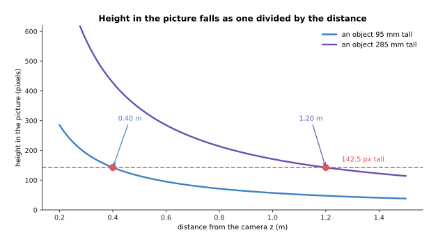

The height in the picture falls as one divided by the distance, so a 95
millimetre object reaches 142.5 pixels at 0.40 metres and a 285 millimetre
object reaches the same 142.5 pixels at 1.20 metres.

Nothing in the photograph tells the two cases apart. A single picture can
therefore never give a true distance on its own, and any model that returns one
is leaning on an assumption about how big things usually are. The picture below
shows what that assumption costs. It takes one object 142.5 pixels tall and asks
what distance follows from five different guesses at its real height.

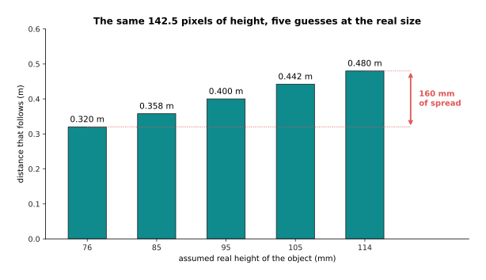

For a thing 142.5 pixels tall, assuming a real height of 76 millimetres puts it
at 0.320 metres and assuming 114 millimetres puts it at 0.480 metres, so a
twenty per cent spread in the assumed size moves the answer by 160 millimetres.

That assumption is not written anywhere in the model. The model learns it from
the training pictures. This is why such models work well on kitchens and offices
full of ordinary objects, and badly on a bench covered in parts that have no
usual size, and why a doll's house breaks them completely. What the network does
get right is the shape of the scene, which means how the surfaces in the scene
are arranged relative to each other.


In this simulated row the prediction is 0.62 times the true distance plus 0.09,
which puts the mug 83 millimetres too near and the far table 216 millimetres too
near, while keeping the near-to-far order exactly right.

A model whose output is right up to one multiplication and one addition is still
useful, because the order of the surfaces is preserved. The next section is
about what you can and cannot do with such an output.

---

## 3. Relative depth and metric depth

Section 2 produced a depth map that had the right shape and the wrong numbers.
This section gives the two kinds of answer their names. A depth map that tells
you which surfaces are nearer than which, without being in any unit, is called
**relative depth**. A depth map whose numbers are real distances in metres or
millimetres is called **metric depth**. The difference is not a matter of
accuracy, because a relative map is not a slightly wrong metric map. It is a map
that has no scale at all. The picture below makes that concrete by reading the
same relative map under three different scalings.


The same relative map read as 0.30 to 0.55 metres puts the mug at 0.311 metres,
read as 0.42 to 0.78 metres it puts the mug at 0.436, and read as 0.58 to 1.05
metres it puts the mug at 0.601, and nothing in the map says which reading is
right.

To turn a relative map into a metric one you need at least two real distances to
pin it to. Those two distances can come from a laser rangefinder, from a stereo
camera, or from knowing where the table surface is. A measured distance used
this way is called an anchor. You then find the one multiplication and the one
addition that carry the predicted values onto the two anchors, and you apply
that multiplication and that addition everywhere else. The picture below fits
the relative row twice, once from two anchors far apart in depth and once from
two anchors that are nearly at the same distance.

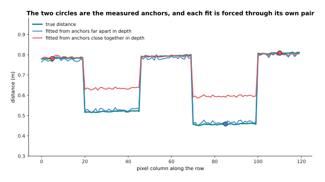

Each fit passes through its own pair of circles exactly, and the fit from the two
close anchors then drifts far away from the true distance everywhere else.

The picture below measures how far away. It plots the distance error that each
fit leaves behind, against the 6.5 millimetres of room the gripper has.

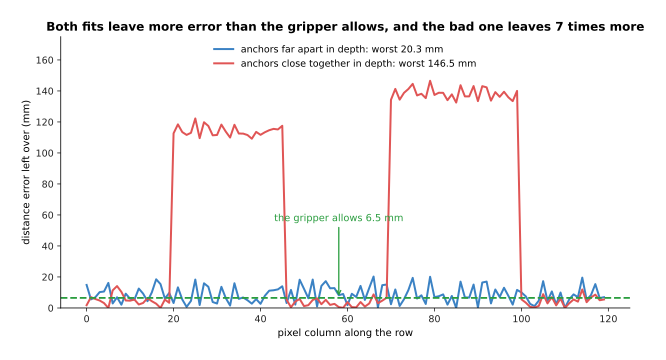

Two anchors 350 millimetres apart in depth leave a mean error of 8.7 millimetres
and a worst error of 20.3, while two anchors only 26 millimetres apart leave a
mean of 61.6 and a worst of 146.5, which is seven times worse.

The reason the second fit is so much worse is worth stating plainly. The two
numbers being solved for are a scale and an offset. Solving for a scale from two
points at almost the same distance means dividing by something close to zero. The
sensor noise at those two pixels is therefore multiplied up into the answer.
Anchors have to straddle the depth range you care about, which means one point
on the near object and one point on the far background.

Even the good fit leaves 20.3 millimetres in the worst place, and the picture
below says what that means for an arm. It puts the mug's true distance beside
four estimates of it.


The mug really sits at 0.457 metres, the three readings of the relative map put
it at 0.311, 0.436 and 0.601 metres, which is a spread of 290 millimetres, and
the two-anchor fit puts it at 0.466 metres, which is 8.5 millimetres out against
a gripper margin of 6.5.

So relative depth answers every question about order. It says which object is
nearest, it lets you avoid the nearest obstacle, and it resolves the word
"behind" in a phrase. It answers no question in millimetres. Metric depth
answers both kinds of question. That is why a robot that has to reach needs
either a model that returns metres or a second sensor to pin a relative map to.
The next two sections are about the sensors that measure distance directly.

---

## 4. Two cameras, and the arithmetic of the shift

Section 3 needed real distances to pin a relative map to, and the oldest way of
measuring one is to use two cameras. Two cameras a fixed distance apart, looking
at the same scene, are called a **stereo** pair. The distance between the two
cameras is called the baseline. The difference between where a point lands in
the two pictures is called the disparity. The whole method is one division, and
the picture below shows where the division comes from.


With a focal length of 700 pixels and a baseline of 60 millimetres the disparity
is 42 divided by the distance, so a point at 0.40 metres shifts by 105 pixels
between the two pictures.

Because the disparity is 42 divided by the distance, it falls quickly as things
get further away. The picture below plots the disparity across the whole range.

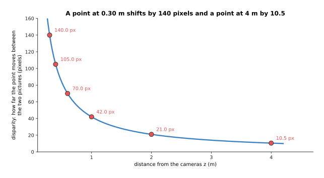

A point at 0.30 metres shifts by 140 pixels, a point at 1 metre shifts by 42,
and a point at 4 metres shifts by only 10.5.

Because the disparity falls that way, the measurement error does not stay the
same across the room. Suppose the matching is uncertain by a quarter of a pixel.
That same quarter of a pixel turns into a distance error that grows with the
square of the distance, as the picture below shows.


A quarter of a pixel of matching error costs 1.0 millimetres at 0.40 metres, 6.0
millimetres at 1 metre and 95.2 millimetres at 4 metres, so ten times the
distance brings a hundred times the error.

That curve explains why a stereo pair is a good choice for a table in front of an
arm and a poor choice for the far end of a room. It also says what to do when
accuracy is short. Both the baseline and the focal length sit underneath the
division, so you can move the cameras further apart or use a longer lens. The
picture below shows what moving the cameras apart buys at one metre.

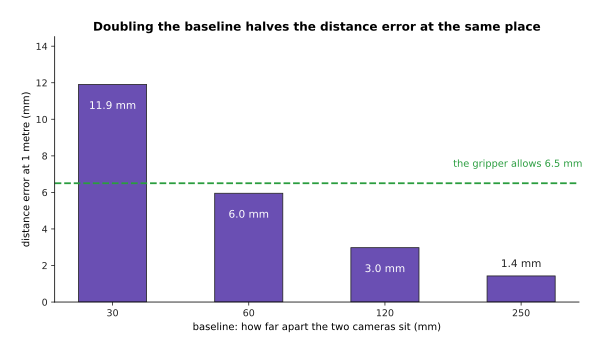

At one metre a quarter of a pixel of matching error costs 11.9 millimetres with
a 30 millimetre baseline, 6.0 with 60 millimetres, 3.0 with 120 and 1.4 with
250, so doubling the baseline halves the error.

Widening the baseline is not free, because it costs you the near range. Two
cameras far apart stop seeing the same close object at all. The picture below
draws the view cone of each camera for two baselines, and marks the nearest
point that falls inside both cones.

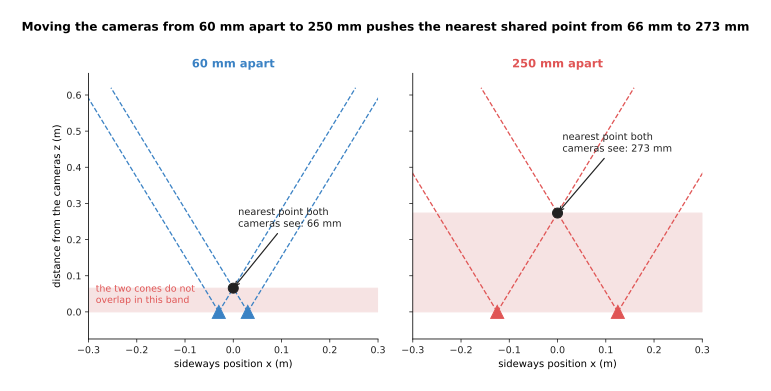

A 640 pixel wide picture taken with a 700 pixel lens covers 49.1 degrees, so a
60 millimetre baseline leaves the two cones overlapping from 66 millimetres
outwards, while a 250 millimetre baseline pushes that limit out to 273
millimetres.

The hard part of stereo, though, is not the arithmetic. The hard part is working
out which pixel in the right picture is the same surface as a given pixel in the
left one. That is only possible where the surface has something to match. The
picture below shows one row of the left picture across textured wood and across
a plain white wall.

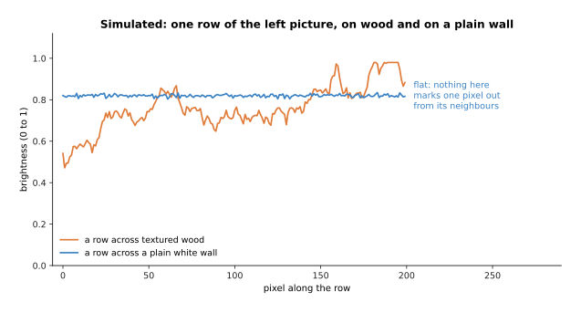

On the simulated wood the brightness changes from pixel to pixel, while on the
plain white wall it stays at about 0.82 everywhere, so nothing in the wall marks
one pixel out from its neighbours.

Matching works by sliding a small window of the left row along the right row and
measuring, at each shift, how badly the two windows differ. The shift with the
smallest difference is the answer. The picture below plots that difference
against the shift tried, for both surfaces.

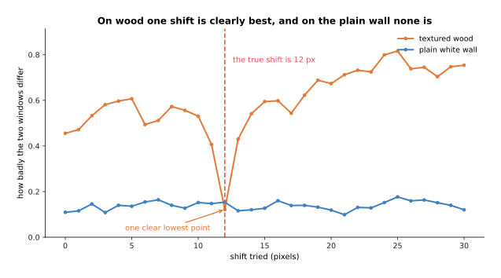

On the simulated wood the best shift is the true 12 pixels and the next-best
shift away from it scores 0.335 worse, while on the plain white wall the whole
curve spans only 0.078 and the best shift lands at a wrong 21 pixels.

So a stereo camera gives nothing on a blank wall or a plain white table. The
common fix is to throw texture onto the scene instead of waiting for it, and
that is what the next section is about.

---

## 5. Cameras that throw a pattern, and the surfaces that defeat them

Section 4 ended with stereo failing for want of texture, and the fix is to add
some. A depth camera of this kind shines a pattern of infrared dots onto the
scene and measures where each dot lands. It measures the landing place either
with a second camera or by comparing against the pattern it sent. Either way
every surface now has something to match, so a blank table stops being a
problem. Cameras of this kind are what most robot arms have bolted above them.
The method has one requirement, which is that the dots must come back, and three
common kinds of surface do not return them. The picture below throws 200 dots at
four materials. A solid red dot came back and a hollow grey dot did not.


In this simulation matte paper returns 194 of 200 dots, black rubber returns 96,
brushed steel returns 80 and clear glass returns only 16.

The three failures have three different causes. A dark surface absorbs the
infrared light instead of scattering it back. A shiny surface sends the light
off in one direction, and that direction is usually not back towards the camera.
A clear surface lets the light through almost unchanged. The fractions above are
invented, but the ordering is what happens in a workshop.

A dot that does not come back leaves a pixel with no distance in it, which is
called a hole. The picture below shows a simulated depth map with four patches
of different material in it, where black means the camera got no distance for
that pixel.


Over the simulated map 78.4 per cent of all pixels carry a distance, and the
holes are concentrated inside the four patches.

The picture below counts the filled pixels inside each patch, so that the four
materials can be compared directly.

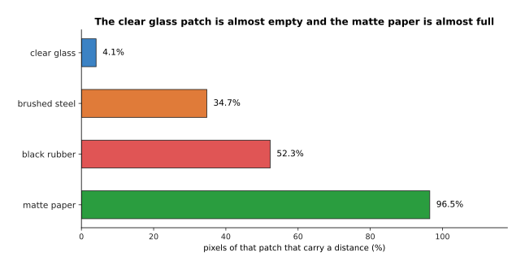

Only 4.1 per cent of the clear glass patch carries a distance, against 34.7 per
cent for brushed steel, 52.3 for black rubber and 96.5 for matte paper.

A hole in a depth map is not the worst outcome, because a program can see that a
pixel has no distance and refuse to act on it. The dangerous case is a wrong
distance that looks exactly like a right one, and clear glass produces that case
every time.


The glass stands at 0.460 metres and the table behind it at 0.710 metres, so the
dots pass through the glass and come back off the table, and the camera reports
the glass as 250 millimetres further away than it is.

A gripper sent to 0.710 metres travels 250 millimetres past the front of the
glass before the fingers close. It therefore drives into the glass and knocks it
over, and nothing in the depth map warned it. The usual answers are to find the
transparent object in the colour picture and fill its depth in from a model
trained for that job, or to feel for the surface with a force sensor instead of
trusting the camera. The catalogue page on [depth from
pictures](../../07_learned-models/03_seeing-models/03_also-used/02_depth-from-pictures.md)
names the models built for transparent objects.

---

## 6. From a depth picture to a shape the arm can use

Sections 2 to 5 all produced a depth map, and a depth map is still laid out as a
picture, while an arm does not move in picture coordinates. Turning the map into
positions is three lines of arithmetic that use four numbers measured once when
the camera was calibrated. The picture below works one pixel through those three
lines.


Pixel 412, 178 at a depth of 0.624 metres gives a sideways position of 0.09284
metres and an up-and-down position of -0.06341 metres, which is the point 92.8,
-63.4, 624 in millimetres.

The sideways position is the pixel's column minus the column the lens looks
straight through, multiplied by the depth and divided by the focal length. The
up-and-down position is the same calculation with rows instead of columns. Doing
that for every pixel that has a distance turns the map into the point cloud
described on [pictures, sound and robot
states](../05_turning-the-world-into-numbers/02_pictures-sound-and-robot-states.md).
The picture below draws a simulated table scene as such a cloud, from above and
from the front.


The same cloud seen from above shows where the three objects sit on the table,
and seen from the front shows how far each one stands up out of it.

A cloud like that is large. A 640 by 480 depth map has 307,200 pixels, and at
the 78.4 per cent fill of section 5's simulated map that is 240,800 points. Three
numbers a point at 4 bytes each is 2.9 megabytes for one frame, which is 87
megabytes a second at thirty frames a second.

A list of points also has one awkward property, which is that the order of its
entries means nothing. The same tabletop can arrive as the same points in any
order. A network that reads points must therefore give the same answer whatever
order they come in, and an ordinary fully connected layer does not. The picture
below sends five points through a small network, keeps the largest value in each
column, and does it twice with the points in two different orders.

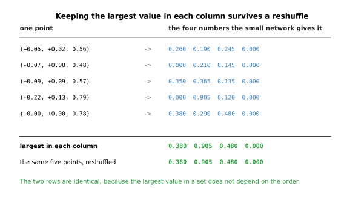

Keeping the largest value in each column gives 0.380, 0.905, 0.480 and 0.000
whatever order the five points arrive in, because the largest value in a set
does not depend on the order of the set.

A layer that reads all fifteen numbers in one row behaves differently, and the
picture below shows how differently.

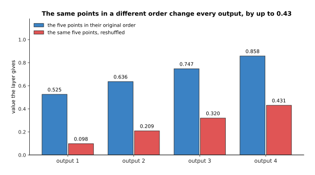

A layer that reads all fifteen numbers in one row changes every one of its four
outputs when the same five points are reshuffled, by up to 0.43.

That is the whole trick behind networks that read points directly. Each point is
treated on its own by a small network. The results are then combined by an
operation that does not care about order, such as keeping the largest. Later
layers look at each point together with its nearest neighbours, which is how
such a network learns shape.

The alternative is to chop the space into equal cubes and record what falls in
each cube. Each of those cubes is a **voxel**, which is the three-dimensional
version of a pixel, and recording which cubes contain surface is called
**occupancy**. The picture below takes one flat layer of such a grid and shades
the cells that hold a point.

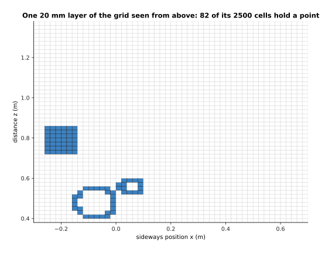

One 20 millimetre layer of the grid holds points in 82 of its 2,500 cells, and
the rest of the layer is air.

Almost all of the grid is empty, and that is what decides how a voxel grid is
stored. Over a one metre cube, a 5 millimetre grid has 8,000,000 cells, of which
only 11,242 are touched by a point, which is 0.141 per cent. The picture below
compares storing every cube against storing only the full ones, at three cube
sizes.

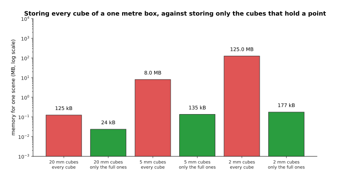

Storing every cube of a one metre box takes 8.0 megabytes at 5 millimetres and
125.0 megabytes at 2 millimetres, while a list of only the full cubes takes 135
and 177 kilobytes.

The appeal of a voxel grid is that it is regular, so the convolutions that work
on pictures work on it unchanged. The cost is in that 0.141 per cent. Almost all
of a room is air, which is why real systems store only the occupied cells, and
why networks that read points directly are more common now.

---

## 7. Learned scenes: radiance fields and splatting

Sections 1 to 6 all described one camera position at one moment, so a point
cloud built that way has holes wherever the camera could not see. The last idea
on this page is different in kind. Instead of measuring one view, it fits a
description of the whole scene to many photographs at once, and then draws the
scene again from any viewpoint you ask for.

The first way of doing this is a **neural radiance field**, which is a small
network that answers one question. Given a place in the room and a direction you
are looking from, the network says what colour is there and how solid it is. To
draw one pixel you follow the ray out from the camera, ask the network at a
series of points along that ray, and mix the answers in order so that a solid
surface blocks what is behind it. The network is trained by drawing the
photographs again and comparing them with the real ones. The picture below
follows one such ray, and shows how much of the finished pixel each sample along
it contributes.

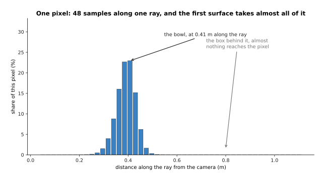

Along this ray the samples between 0.36 and 0.48 metres carry 84.7 per cent of
the pixel between them, because that is where the bowl is, and the box standing
behind the bowl contributes nothing at all.

That is a clean idea with an expensive consequence, because every sample on
every ray is one call to the network. The picture below counts those calls for
one picture.


Drawing one 640 by 480 picture from a radiance field at 64 samples a ray takes
19,660,800 network calls, while a detector runs its network once over the whole
picture.

Twenty million small network calls for one frame is why early radiance fields
took many seconds to draw a single picture, which is far too slow for a robot
that has to decide something now. **Gaussian splatting** solves the same problem
by replacing the network with a pile of soft coloured blobs. Each blob stores a
place, a width in each direction, a turn, a solidity, and a colour that varies
with the direction you look from. Drawing the scene then means sorting the blobs
by distance and painting them one over another, with no network call at all. The
speed is paid for in memory, and the picture below counts the cost.

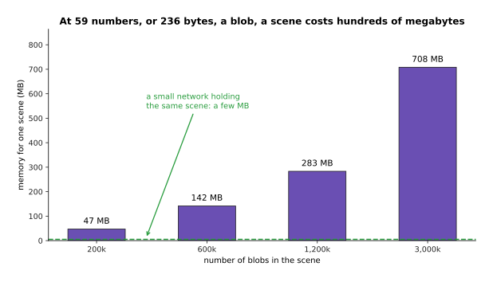

One blob keeps 3 numbers for where it is, 3 for its widths, 4 for its turn, 1 for
its solidity and 48 for its colour, which is 59 numbers or 236 bytes, so 1.2
million blobs take 283 megabytes.

That is the honest trade. Splatting is fast enough to draw many times a second
on an ordinary graphics card, which is what made this family of methods usable
at all, and it pays for that speed in memory, because a scene is hundreds of
megabytes rather than the few megabytes a small network takes. Both methods are
also fitted to one scene rather than trained once and used everywhere. Moving
the robot to a new room therefore means fitting a new scene from new
photographs, which takes minutes. Methods that predict the blobs in one pass
from a handful of photographs exist and are improving quickly, but a per-scene
fit is still what most working systems do.

What a robot gets for that cost is a view it never took. The picture below shows
an invented table scene as nine blobs seen from above, with the place a photo was
taken from and a second place nobody stood at.

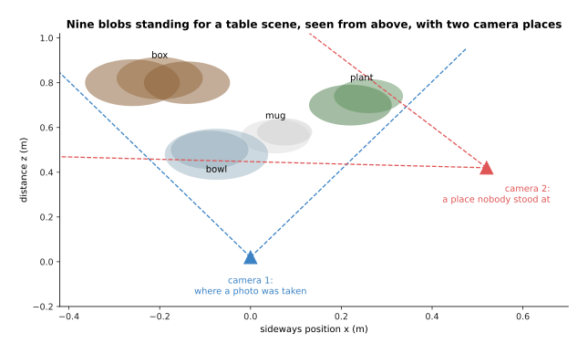

From the photographed place three of the nine blobs are visible, while from the
second place six of them are.

The picture below draws what each of those two cameras sees. Each strip is 160
rays wide, and the red bar under each strip marks the rays the mug fills.


From the photographed place the mug fills 25 of the 160 rays, and from the place
nobody stood at the mug fills 56, drawn from the same fitted scene.

Asking what the shelf looks like from above, without moving the camera there, is
worth a great deal to a grasp planner. A grasp is chosen from a shape, and a
shape built from one viewpoint is missing its back. The catalogue page on [scene
reconstruction](../../07_learned-models/04_3d-models/02_most-used/02_scene-reconstruction.md)
lists the real systems of both kinds. In 2026 a depth camera is still what
measures the table in front of the arm, while a fitted scene is what you build
when you need the whole object or a view from somewhere the camera cannot go.

---

## 8. Where to read next

- [Recipes for models that see and
  understand](../13_starting-your-own-model/04_recipes-for-models-that-see-and-understand.md)
  gives the starting recipe for each of these: what one training example is, how
  many you need, what to begin from, and the mistake almost everybody makes
  first.
- [Large language
  models](../10_language-and-multimodal-models/01_large-language-models.md) is
  the next page, and it starts the chapter on models that read and write words
  rather than look at pictures.
- [Pictures, sound and robot
  states](../05_turning-the-world-into-numbers/02_pictures-sound-and-robot-states.md)
  explains how a point cloud is fed to a network as numbers, which is the step
  before section 6's layers.
- [World models](../12_models-that-act/04_world-models.md) uses learned scene
  descriptions of the kind in section 7 to predict what happens next.
- [Depth from
  pictures](../../07_learned-models/03_seeing-models/03_also-used/02_depth-from-pictures.md)
  is the catalogue of the real single-picture and stereo depth models, including
  those built for transparent objects.
- [Point cloud
  models](../../07_learned-models/04_3d-models/02_most-used/01_point-cloud-models.md)
  is the catalogue for section 6's networks that read points directly, inside the
  wider [3D models](../../07_learned-models/04_3d-models/01_overview.md)
  chapter.

---

## 9. Using it in Python

Section 6 turned one pixel into one point, and the code below does that for a
whole depth map in NumPy. That is how it is done in practice, because NumPy does
every pixel at once. The four lens numbers are the ones from section 6.

```python
import numpy as np

fx, fy, cx, cy = 615.0, 615.0, 320.5, 240.5     # section 6's calibrated lens
depth = np.full((480, 640), 0.624)              # a depth map, in metres
depth[0, 0] = 0.0                               # a pixel with no distance

rows, cols = np.mgrid[0:depth.shape[0], 0:depth.shape[1]]
x = (cols - cx) * depth / fx                    # section 6: sideways
y = (rows - cy) * depth / fy                    # section 6: up and down
cloud = np.stack([x, y, depth], axis=-1)[depth > 0]   # drop the empty pixels

print(cloud.shape)                              # (307199, 3)
print(np.round(cloud[178 * 640 + 412 - 1], 5))  # [ 0.09284 -0.06341  0.624  ]

f, baseline, pixel_error = 700.0, 0.060, 0.25   # section 4's stereo pair
for z in (0.40, 1.00, 4.00):
    print(z, round(f * baseline / z, 1),        # disparity in pixels
          round(z ** 2 / (f * baseline) * pixel_error * 1000, 1))   # error in mm
```

The point printed for pixel 412, 178 is `[0.09284 -0.06341 0.624]`, which is
section 6's worked example. The stereo loop then prints section 4's numbers:
105.0 pixels and 1.0 millimetres at 0.40 metres, 42.0 pixels and 6.0 millimetres
at 1 metre, and 10.5 pixels and 95.2 millimetres at 4 metres. One pixel is
dropped by the `depth > 0` test, which is why 307,200 pixels give 307,199 points.

The libraries take over above that line. A depth camera's own driver gives you
the depth map and the four lens numbers already measured. The Open3D package
holds point clouds and does the filtering and plane-finding that section 6
implies. Hugging Face `transformers` loads a single-picture depth model with
`pipeline('depth-estimation')`, so that section 2's guess is one call. None of
them removes the arithmetic above, because every one of them expects you to know
whether your numbers are in metres.

What you still have to decide is which source of depth to use, and sections 2 to
5 are the list of trades. A single-picture model is free and gives relative
depth, which section 3 showed is useless for reaching unless you pin it with
measured anchors. A stereo pair measures real distances, and section 4 showed
that its error grows with the square of the distance and that matching fails
without texture. A pattern-throwing camera fixes the texture problem, and
section 5 showed that it fails on glass in the worst possible way, by returning
a confident wrong number. Most working arms use a pattern-throwing camera for
the table, and reach for one of the others only where that camera is known to
fail.
