# Large language models

The page before this one, [Depth and the third
dimension](../09_models-that-see/04_depth-and-3d.md), closed the chapter on models
that see. It turned a flat picture into a shape with distance in it. This page
opens a new chapter, and it changes the input from pictures to words. The
machinery does not change, because the network that reads a picture one patch at a
time is the same network that reads a sentence one token at a time. So this page
asks what that machinery does when it is trained on a very large amount of written
text.

The chapter on [the transformer](../06_the-transformer/01_attention.md) built the
parts of that machinery. [Training and running a
transformer](../06_the-transformer/03_training-and-running-a-transformer.md) then
showed four things about it. The model is trained to guess the next token. A mask
stops it from reading the tokens that come after the one it is working on. Stored
keys and values let it carry on from where it stopped instead of doing its earlier
work again. Sampling turns the numbers it produces into text. This page builds
nothing new on top of those parts. It answers a different question: what do you
get when that machinery is trained on more text than any person could read, and
what does the thing you get fail at?

The page is for a reader who has read the transformer chapter. A **token** is one
piece of text, and it is usually a short run of letters rather than a whole word,
as [Tokens and
embeddings](../05_turning-the-world-into-numbers/01_tokens-and-embeddings.md)
explained. Nothing else is assumed, because every new word is explained where it
first appears. By the end you will know what the model computes at each step, what
a large amount of text teaches it, why it states false things in the same calm way
as true ones, how to keep facts outside it, what an answer costs in time and
memory, and which jobs it is the wrong tool for.

Every picture here comes from a small model built inside the diagram script, and
not from a real large language model. It matters to say that plainly. The small
model was given an invented collection of 29,137 short robot sentences. Those
sentences hold 313,504 words in total, and they use only 144 different words. The
model works out what comes next by counting how often each word followed the last
few words. It shares one thing with a real model, and that one thing is what this
page is about: it puts a probability on every word it knows, and it answers one
word at a time.

## Contents

1. [What the model actually predicts](#1-what-the-model-actually-predicts)
2. [What a very large amount of text teaches it](#2-what-a-very-large-amount-of-text-teaches-it)
3. [How a conversation becomes one stream of tokens](#3-how-a-conversation-becomes-one-stream-of-tokens)
4. [Why a wrong answer is written as confidently as a right one](#4-why-a-wrong-answer-is-written-as-confidently-as-a-right-one)
5. [Retrieval: keeping the knowledge outside the weights](#5-retrieval-keeping-the-knowledge-outside-the-weights)
6. [The real shape of the cost of an answer](#6-the-real-shape-of-the-cost-of-an-answer)
7. [What these models cannot do](#7-what-these-models-cannot-do)
8. [Where to read next](#8-where-to-read-next)
9. [Using it in Python](#9-using-it-in-python)

---

## 1. What the model actually predicts

A **large language model** is a transformer with a very large number of weights,
trained on a very large amount of written text. A **weight** is one number inside
the network, and training is the process that changes those numbers. The model
does one job, and that job is narrower than it looks from outside. You give it the
text so far. It gives back one number for every token in its **vocabulary**, which
is the fixed list of tokens the model is able to write. Each of those numbers is a
probability, and it says how likely that token is to be the next one. There is no
list of facts inside the model, there is no index, and there is nothing in it that
works the way looking a word up in a dictionary works.

The vocabulary of the small model used here holds 147 tokens. Those are the 144
words of the invented corpus and three extra markers, which mark the start of a
sentence, the end of a sentence and a word the model has never seen. The picture
below gives the model four words and draws the number it produced for each of
those 147 tokens.

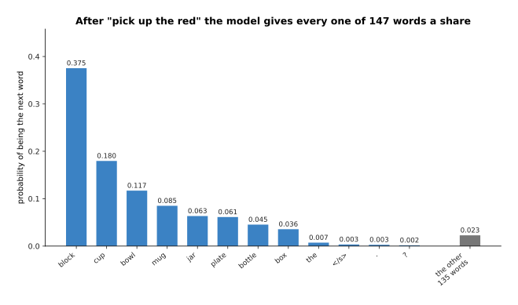

After the four words "pick up the red" the small model gives block 0.375, cup
0.180, bowl 0.117, mug 0.085, jar 0.063, plate 0.061, bottle 0.045 and box 0.036.
All 135 remaining tokens share the last 0.023 between them.

Read that as one complete answer to one question. The question is "which token
comes next", and the answer is a whole set of numbers rather than a single word.
The eight object names with the highest probabilities really did follow "pick up
the red" in the corpus, so they take almost all of the probability, and their
shares follow how often each one was mentioned. The grey bar says that every other
token still gets a share, including tokens that would make no sense in that
position.

The size of those shares is easier to see when the same numbers are sorted from
largest to smallest. The picture below sorts them, and it also adds them up from
left to right so that you can see where the probability has gone.

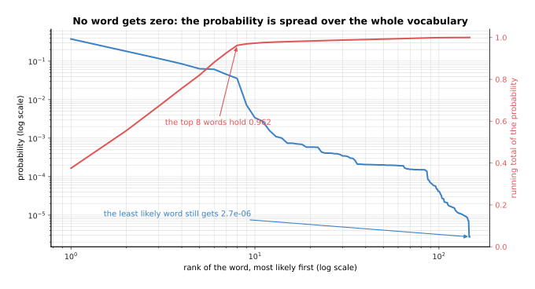

Sorting the same 147 numbers from largest to smallest shows the top eight words
holding 0.962 of the probability between them, while the least likely word of all
still gets 0.0000027.

No token is ever given exactly zero, and that is not a quirk of the small model,
because a real transformer finishes its work with the same rule. [The score of
being wrong](../03_how-training-works/01_the-score-of-being-wrong.md) explained
that softmax divides one positive number by the sum of all of them. A positive
number divided by a larger positive number is still positive, so no token can come
out at exactly zero. That is why a language model always produces something, and
why it is never in a position where it has nothing to say.

The model writes an answer one token at a time, and each token is chosen from a
fresh set of numbers. The picture below runs that loop until the small model
chooses a full stop.

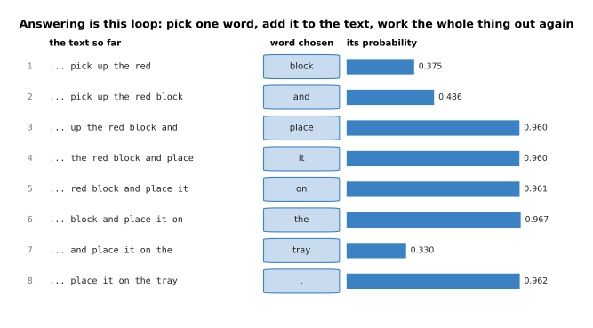

Taking the most likely word each time gives "pick up the red block and place it on
the tray .". The eight choices that built that sentence had probabilities of
0.375, 0.486, 0.960, 0.960, 0.961, 0.967, 0.330 and 0.962.

This is the whole of what the model does, and it is worth noticing how little it
is. The model worked out a set of numbers. Something outside the model picked one
word from that set. That word was added to the end of the text. The model then
worked out a new set of numbers for the longer text. Nothing was planned ahead,
because the model has no way to hold a sentence it has not written yet. The
probability of all eight chosen words together is 0.0497, which is those eight
numbers multiplied together. The run of values near 0.96 shows that the model is
almost certain inside a phrase it has seen often, while the two lower values mark
the two points where it had a real choice.

---

## 2. What a very large amount of text teaches it

Those probabilities came from training on text. The **pretraining corpus** is the
collection of text a model is trained on before anybody tries to make it useful,
and **pretraining** is that first stage of training. For a real model the corpus is
gathered from web pages, books, program code and much else. It is then cleaned, and
passages that repeat are removed.

The training job is the one the transformer chapter described. You show the model a
piece of real text. You ask it to guess each next token. You then change the
weights so that the token which really came next is given more probability. Nobody
has to write down an answer anywhere, because the text already holds the answer:
the next word of a sentence is the answer to the question asked at the word before
it. The picture below turns one sentence into the examples it teaches.

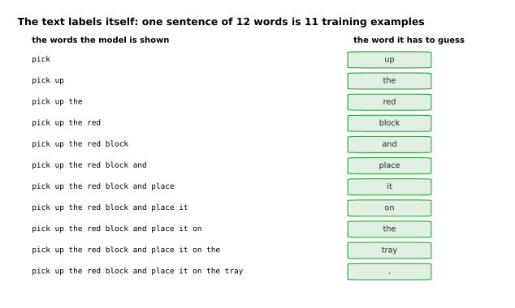

One invented sentence of 12 words gives 11 training examples. Each example is the
words up to some point, together with the one word that followed them.

Training this way is called self-supervised learning, because the right answer
comes from the data itself rather than from a person. [Self-supervised
pretraining](../07_pretraining-and-adapting/01_self-supervised-pretraining.md)
explains it in full, together with the other ways a model is trained without
anybody writing down the answers.

One number says how well that training is going, and the picture below follows it
as the corpus grows.

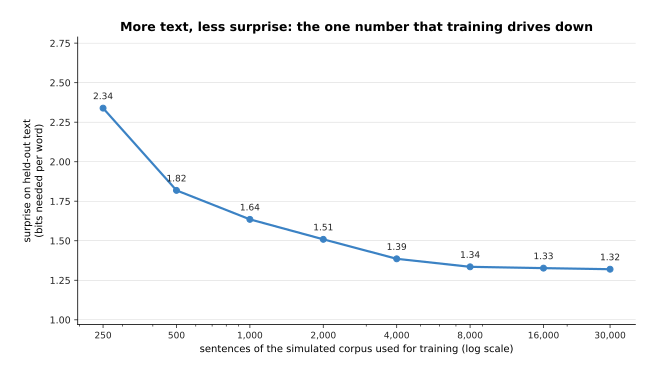

Trained on 250 sentences the small model needs 2.34 bits to express each word of
text it has never seen. By 30,000 sentences it needs 1.32 bits, and most of the
gain arrives early.

That single number is what training drives down. It is the surprise, measured in
bits, of held-out text, which means text the model did not train on. It is the
cross-entropy loss of chapter three written in a unit that is easier to feel. A
**bit** is the amount of information in one yes-or-no answer, and needing *n* bits
for a word means behaving as though 2 to the power *n* words were equally plausible
at that point. So 2.34 bits means behaving as though about 5 words were plausible,
and 1.32 bits means about 2.5. Everything a large language model appears to know is
a side effect of driving that number down, because a sentence that states a true
fact is easier to continue if you have stored the fact.

What the model learns depends on what the corpus holds, so it is worth counting
what is in this one. The picture below counts the words of the invented corpus by
the kind of sentence they came from.

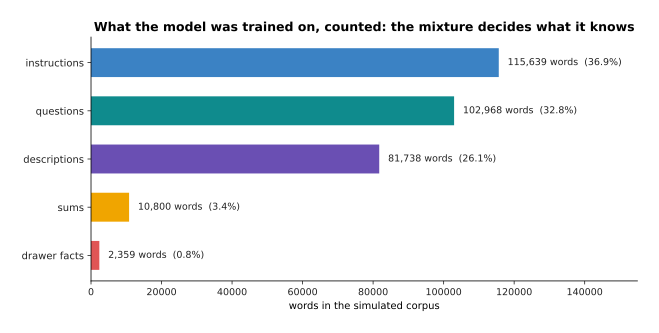

The invented corpus is 36.9 per cent instructions, 32.8 per cent runs of questions
with no answers under them, 26.1 per cent descriptions, 3.4 per cent small sums and
0.8 per cent sentences saying which drawer a tool is kept in.

The mixture is the part of pretraining that people argue about most, because a
model learns common things far better than rare ones. The drawer sentences here are
2,359 words out of 313,504, and that is why section 4 can show the model failing on
exactly those facts. The questions are a third of everything, and that is why page
two can show the model answering a question with another question.

The effect of the mixture can be measured word by word. The picture below counts
how often the model's top guess is right, separately for five kinds of word.

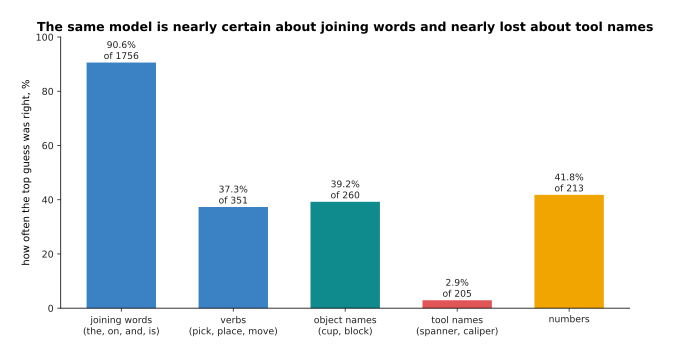

On held-out text the same model guesses joining words such as "the" and "on"
correctly 90.6 per cent of the time, object names 39.2 per cent of the time, and
tool names only 2.9 per cent of the time.

So one model is confident about the shape of the language and almost unable to say
which particular thing is named. The reason is that the neighbouring words force a
joining word, while the tool a sentence mentions could be almost any tool.

Compare next-token prediction with the obvious alternative, which is to write the
rules of the language by hand, or to pay people to label a dataset of facts.
Hand-written rules fail on the first sentence their author did not think of.
Hand-written labels cost human time for every single example. Next-token prediction
turns any text into training data and costs nothing to label. What it costs you is
control, because you cannot tell the model which parts of the corpus to believe.

---

## 3. How a conversation becomes one stream of tokens

Pretraining gives you a model that continues text. What people actually use has
turns in it, where a person writes something and the model replies. Something has
to join those two facts together. A conversation is written out as one single run
of tokens, exactly like any other text, and who is speaking is marked by **special
tokens**, which are extra tokens added to the vocabulary for that purpose and never
used for ordinary words. The model never sees a conversation. It sees one long
piece of text in which some tokens mean "the person speaks here" and others mean
"the answer starts here". The picture below writes one short conversation out in
that form.

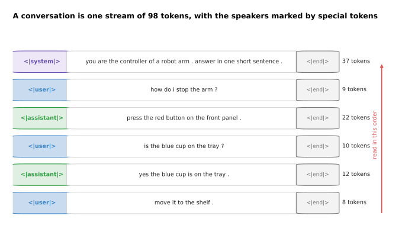

A short conversation with a system prompt and five turns is one stream of 98
tokens. It is made of 37 tokens for the system prompt and then 9, 22, 10, 12 and 8
tokens for the turns, in the order they happened.

The first part of that stream is the **system prompt**, which is a piece of text
placed before everything else to say what the model is for and how it should
answer. It has no special power, and it does not reach the model by a separate
route, because it is tokens in the same stream as everything else. It works only
because the model was trained on text where instructions at the start were followed
by text that obeyed them. That is also why a later turn can contradict it.

The stream grows with every turn. The picture below measures that growth over
twelve turns, and it splits each bar by which part of the conversation the tokens
came from.

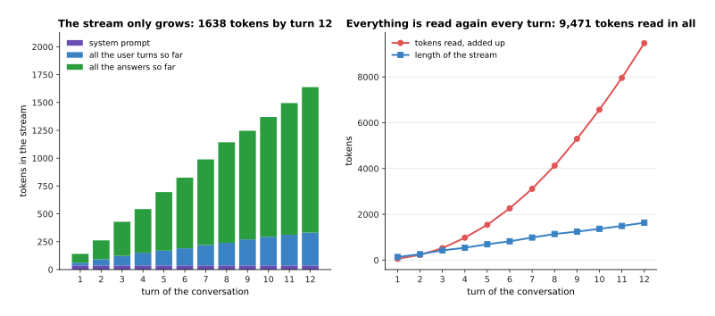

Over twelve simulated turns the stream grows to 1,638 tokens, and the 37 tokens of
the system prompt sit at the bottom of every turn.

The model keeps no memory between calls, so the whole conversation so far is the
input to every new call, and the early turns are read again on every turn. The
picture below compares the length of the stream with the number of tokens the model
has read in total.

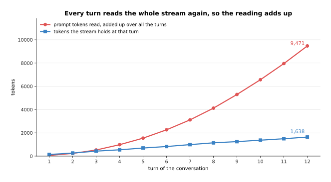

By turn 12 the stream holds 1,638 tokens, and the model has read 9,471 prompt
tokens in total, which is 5.8 times as many.

That second number follows from the mechanism rather than from anybody's choice.
The key-value cache of the transformer chapter makes the repeated reading much
cheaper, because the work done on earlier tokens can be stored and reused instead
of being done again. Storing it costs memory instead, and section 6 measures how
much.

The stream cannot grow without limit, because the model can only be given so many
tokens at once. The picture below shows what happens to a conversation that reaches
that limit.

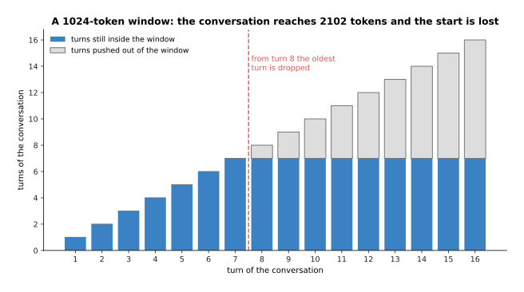

With a window of 1,024 tokens the oldest turn has to be dropped from turn 8
onwards. By turn 16 the conversation is 2,102 tokens long, and nine of its sixteen
turns no longer fit inside the window.

That limit is the context window the transformer chapter introduced, which is the
longest stream the model can be given at once. Real windows are far larger and
still finite, so every long conversation reaches this situation eventually.
Something then has to decide what to throw away. The usual choices are to drop the
oldest turns, to replace them with a summary, or to store them elsewhere and fetch
the relevant parts back when they are needed. The model is not told that anything
was dropped, and it answers as confidently about the part it can no longer see as
about the part it can.

---

## 4. Why a wrong answer is written as confidently as a right one

That confidence about what it cannot see is the everyday failure of these models. A
**hallucination** is an answer that is false but written exactly like a true one,
with no warning and no sign of doubt. Calling this lying hides the mechanism, and
the mechanism is simple enough to show with measured numbers. The picture below
asks the small model the same question about two tools: one whose drawer the corpus
states often, and one whose drawer it never states.

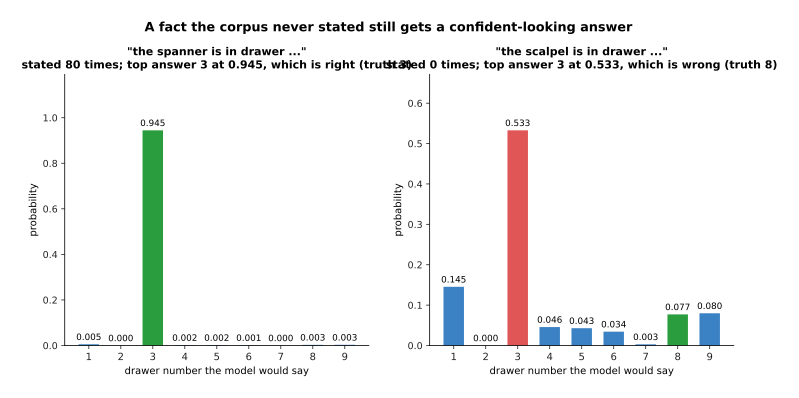

The corpus states the spanner's drawer 80 times, and the model answers 3 with
probability 0.945, which is right. The corpus never states the scalpel's drawer,
and the model also answers 3, at 0.533, which is wrong, because the scalpel's true
drawer is 8.

Look at what the model did in the second case. It had never read the five words
"the scalpel is in drawer", so it used the three words "is in drawer", which it had
read many times, and it answered with the drawer that usually follows those three
words. The picture below counts both of those runs of words in the corpus.

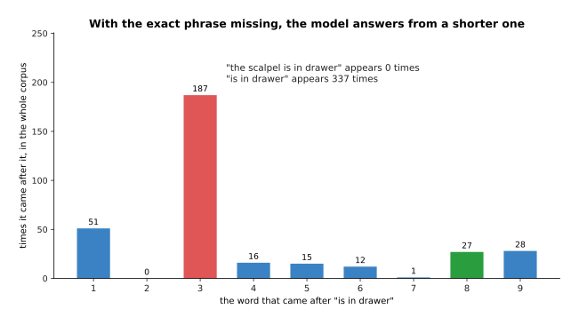

The five words "the scalpel is in drawer" appear 0 times in the corpus. The three
words "is in drawer" appear 337 times, and the word after them is 3 on 187 of those
occasions, against 27 occasions for the true answer 8.

So the wrong answer is not a lie, and it is not a guess that the model knows to be a
guess. It is the most probable continuation given what the model has stored, and it
arrives in the same calm form as the true answer because nothing in the machinery
separates the two cases. A real transformer reaches the same place through attention
rather than by counting shorter runs of words, and the outcome is the same: when the
particular fact is missing, the general pattern is used instead.

The same measurement over all forty tools shows how little the model's own confidence
warns you. The picture below groups the tools by how often the corpus states their
drawer.

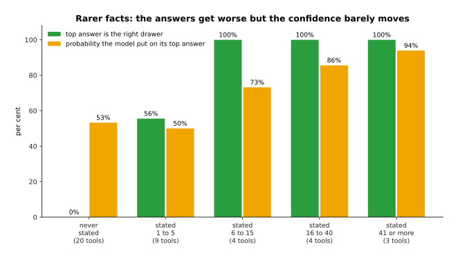

Across 40 tools the top answer is right for every tool whose drawer was stated more
than five times, and right for none of the twenty tools whose drawer was never
stated. Over those same groups the probability the model puts on its own answer
falls only from 94 per cent to 53 per cent.

That combination is what makes the failure hard to catch. The accuracy drops from 100
per cent to 0 per cent while the confidence only drifts down a little, so the
confidence is nearly useless as a warning.

There is a reason the model does not simply say that it does not know. The picture
below measures what each of three possible continuations would have cost it during
training.

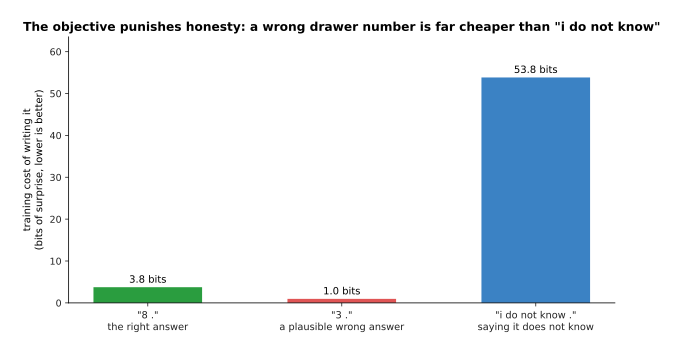

Writing the right drawer costs the model 3.75 bits of surprise. Writing the
plausible wrong drawer costs 0.96 bits. Writing "i do not know" costs 53.85 bits.

So the reason is mechanical rather than moral. Training rewarded the model for making
real text cheap in exactly those bits. The corpus is full of sentences that name a
drawer, and it holds none that admits ignorance. Under the only measure training ever
applied, the confident wrong answer is the best of the three, and the honest answer is
by far the worst. The model was never once rewarded for refusing to answer, so it
never learned to refuse. Pretraining on its own cannot produce a model that says it
does not know, because saying so does not fit the text, and fitting the text is the
whole objective.

Several changes reduce hallucination. The picture below measures two of them on the
same forty drawer questions, on their own and together.

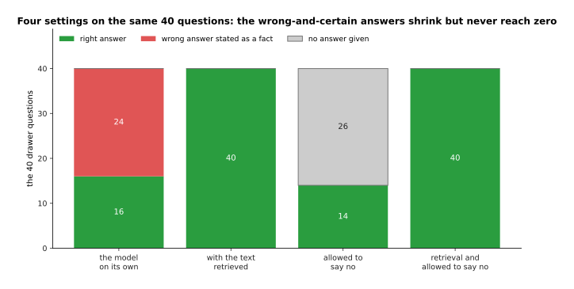

On the same 40 drawer questions the plain model is right 16 times and wrong 24
times. Putting the right text into the prompt makes it right 40 times. Refusing to
answer whenever its own probability is below 0.60 removes every wrong answer, at the
price of 26 questions left unanswered.

Four things reduce hallucination and none of them removes it. Putting the relevant
text into the prompt works best, and it is the next section. Giving the model a tool
it can call, such as a database or a calculator, moves the answer out of the weights.
Asking for the source of a claim helps a little, because a model that cannot produce a
source has often invented the claim. Training that rewards refusing to answer is one
subject of [the next page](02_post-training-a-language-model.md), and it is the only
one of the four that changes the model itself. Be careful about the clean split in
that last picture, because a real model's confidence does not separate the two groups
so neatly.

---

## 5. Retrieval: keeping the knowledge outside the weights

Section 4 showed the prompt repairing what the weights got wrong, and that is the
whole of the method here. **Retrieval-augmented generation** means three steps. You
use the question to find relevant text in a store that you control. You put that
text into the prompt. You let the model read it there. The knowledge an answer
depends on then lives in your store rather than inside the weights. The model is not
changed at all, and no training happens.

The first step is the search. The picture below scores the question against every
note in the store.

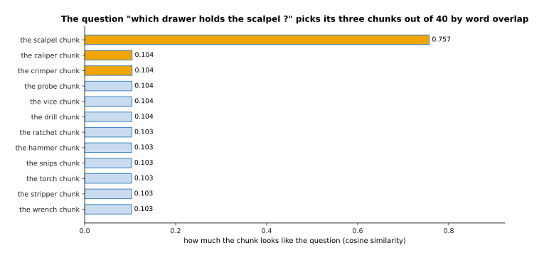

The question "which drawer holds the scalpel ?" is compared with all 48 stored
notes. The note about the scalpel scores 0.549, the note about the tray scores
0.264, and every note about a different tool scores about 0.076.

That comparison is the simplest one that works. You count the words shared between
the question and each piece of text. You weight each word by how rare it is across
the whole store, so that a rare word counts for more than a common one. You then
measure the angle between the two counts, which is called the cosine similarity. The
rare word "scalpel" decides nearly the whole result, and the note about the tray
comes second only because it shares the common words "holds" and "the tray". Real
systems usually compare embeddings instead, which are the vectors that [Tokens and
embeddings](../05_turning-the-world-into-numbers/01_tokens-and-embeddings.md)
described, so that a question about a scalpel can also find a note about a blade.

The second step is to put the chosen text in front of the question. The picture below
shows the prompt that is then sent to the model, part by part, with the number of
tokens each part costs.

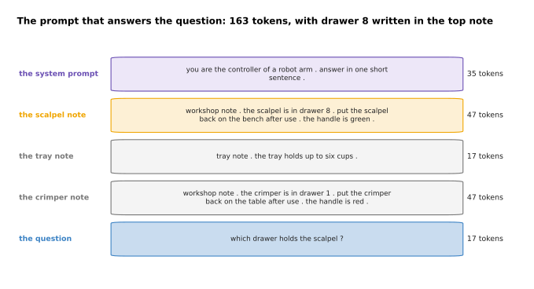

For this one question the prompt holds 163 tokens in five parts: the system prompt,
the three best-matching notes and the question. The sentence "the scalpel is in
drawer 8" is written inside the first note.

The third step is to let the model answer with that text in front of it. The picture
below gives the model's answer without the notes and with them.

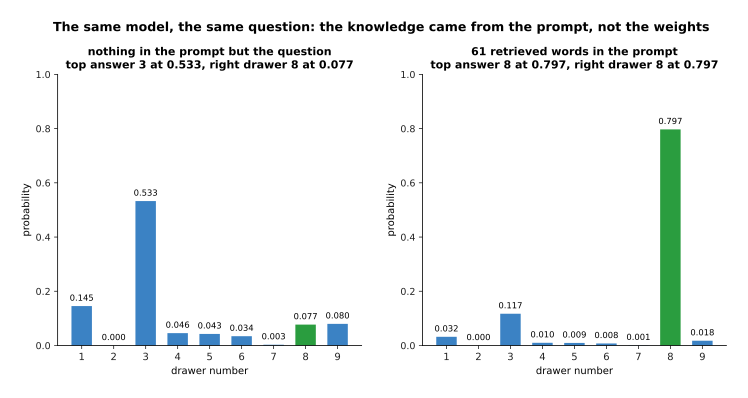

With nothing in the prompt but the question, the model gives the right drawer a
probability of 0.077. With the three best-matching notes in the prompt, the right
drawer rises to 0.797 and becomes the answer.

Nothing about the model changed between those two pictures. The same weights were
asked the same question, and they gave a different answer once the evidence was in
the prompt. A real transformer does this through attention, which lets a later token
look back at the retrieved text and copy from it, and the small model imitates that
by mixing its stored counts with what the prompt says comes next. Either way the
knowledge lives in the prompt, so correcting a wrong fact means editing a document
rather than training anything.

The next two pictures measure retrieval over all forty drawer questions. The first
one shows what it buys.

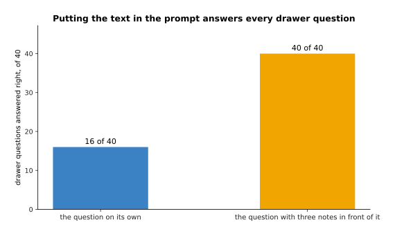

Retrieval turns 16 right answers out of 40 into 40 right answers out of 40.

The second one shows what it costs.

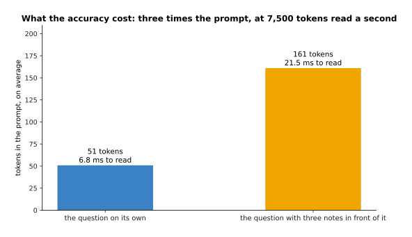

Averaged over the forty questions the prompt grows from 51 tokens to 161 tokens, and
the time spent reading it grows from 6.8 milliseconds to 21.5 milliseconds at the
illustrative reading rate section 6 uses.

The honest comparison with the obvious alternative, which is to train the facts into
the model, runs like this. Training them in keeps the prompt short and the answer
fast, and it costs a training run every time a fact changes. Retrieval costs tokens
and time on every question, and in exchange the facts can be edited in a file, the
model can name the document it used, and a missing fact is visibly missing instead of
being quietly invented. For anything that changes, retrieval is the better side of
that trade.

---

## 6. The real shape of the cost of an answer

Section 5 added tokens to the prompt and called that cheap. Whether it is cheap rests
on a division that anybody putting these models on a robot has to understand.
Answering happens in two stages, and the two stages run at very different speeds.

The first stage is reading the prompt, and it is called prefill. The whole prompt goes
through the network in one pass, so a graphics processing unit, which is a chip that
performs many multiplications at the same time, can work on all of its tokens at once.
The second stage is writing the answer, and it is called decode. Each token has to
exist before the next one can be worked out, so the answer comes out at one token per
pass.

The numbers below use an illustrative reading rate of 7,500 prompt tokens a second and
an illustrative writing rate of 55 answer tokens a second. Those two rates are in the
right region for a mid-sized model on one modern accelerator, and they measure no
particular system. The picture below applies them to four cases.

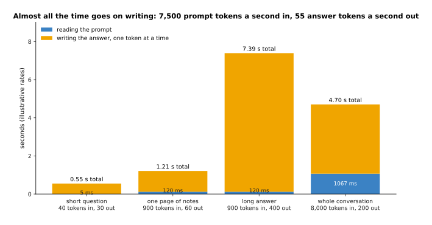

Reading 900 prompt tokens takes 120 milliseconds, while writing 400 answer tokens
takes 7,273 milliseconds. What you wait for is therefore set almost entirely by how
long the answer is.

The practical lesson is not the one people expect. A prompt five times longer barely
moves the total, while an answer five times longer multiplies it. So to make a system
faster you should shorten the answer before you shorten the prompt.

The reading cost is not spread over the answer. It is all paid before the first token
appears, as the picture below shows.

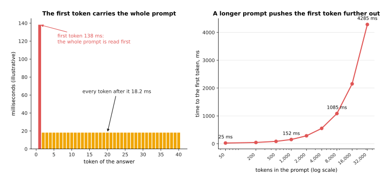

With a 900-token prompt the first token takes 138 milliseconds, and each token after
it takes 18.2 milliseconds.

The first token is slower because the whole prompt has to be read before anything can
be written. That cost is paid once and never again, which is why a long conversation
is slow to start and then runs at a steady speed. A longer prompt pushes the first
token further away, and the picture below measures how far.

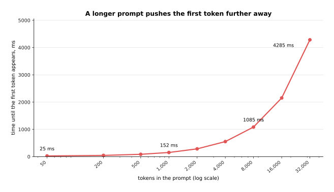

With a prompt of 50 tokens the first token arrives after 25 milliseconds. With a
prompt of 32,000 tokens the first token alone takes 4,285 milliseconds.

Stored keys and values are what make the repeated reading cheap, and they cost memory.
The picture below measures that memory as the conversation gets longer.

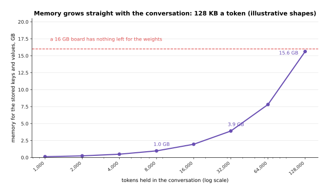

With illustrative shapes of 32 layers, 8 key-value heads, a head size of 128 and two
bytes a number, the stored keys and values take 128 kilobytes per token. So 8,000
tokens need 1.0 gigabyte, 32,000 tokens need 3.9 gigabytes and 128,000 tokens need
15.6 gigabytes.

That memory is the price of not doing the earlier work again, and it is paid once per
conversation, which is what makes it awkward. A board with 16 gigabytes has to hold
the weights as well. The usual answers are to keep the conversation short, to replace
the old turns with a summary, or to store the keys and values in a number format that
uses fewer bytes.

The last question is whether a model this slow can be used on a robot at all. The
picture below puts the four answer times next to the time an arm has to decide.

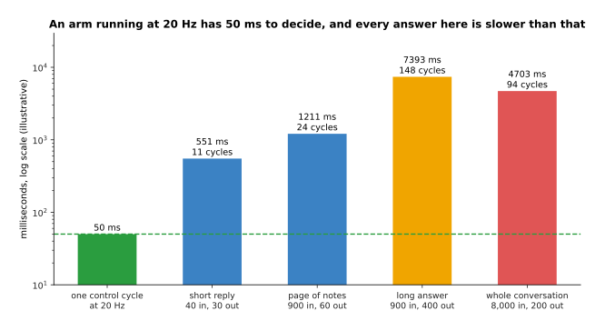

An arm running its control loop at 20 hertz has 50 milliseconds to decide what to do
next, and the four answers measured above take 11, 24, 148 and 94 of those control
cycles.

This settles how a language model can be used on a robot at all. It cannot run inside
the control loop, because it is between eleven and one hundred and fifty times too
slow, and no amount of tuning closes a gap that large. What it can do is run outside
the loop and be asked rarely. It can be asked once when a new instruction arrives, to
turn a sentence into a plan. It can be asked once more when something unexpected
happens, to decide what to try next. The fast loop is run by other software.

---

## 7. What these models cannot do

The timing above is a limit you can plan around. This section is about limits of a
different kind, which are jobs the machinery is not built for. The clearest one is
arithmetic that the model has not been given a tool for, and the reason is a counting
argument rather than an opinion. The picture below counts how many different
multiplications there are at each size.

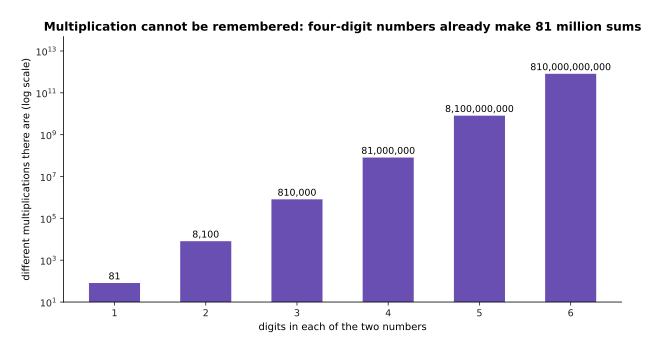

There are 81 different one-digit multiplications, 8,100 two-digit ones, 810,000
three-digit ones and 81,000,000 four-digit ones.

A model can remember the small cases, because any corpus that mentions arithmetic
contains most of the 81 one-digit products many times over. It cannot remember the
four-digit cases, because 81 million examples of something that is rarely written down
are in no corpus. The only way to get those right is to carry out the procedure step
by step instead of recalling the answer. Models can be trained to carry out the
procedure in writing, which page two covers, and they stay slower and less reliable at
it than the calculator that any program can call.

The small model shows the failure on a sum it never read. The picture below gives its
probabilities over every total it could name.

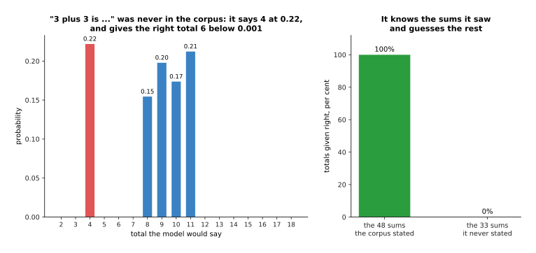

The corpus never states that three plus three is six. Asked for that total, the model
answers 4 with probability 0.22, gives the true total 6 less than 0.001, and puts most
of the rest on 8, 9, 10 and 11, which are totals that often followed similar words.

The same measurement over all 81 one-digit sums separates what the model read from what
it did not.

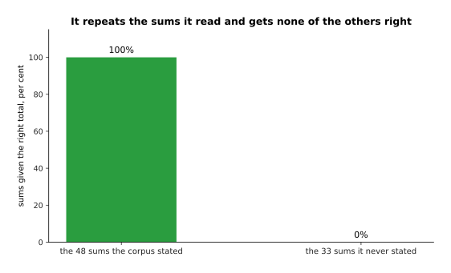

The corpus states 48 of the 81 one-digit sums, and the model gets every one of those
right. It gets none of the other 33 right.

That is the arithmetic version of the drawer picture, and the failure has the same
shape. Where the answer was in the corpus the model repeats it. Where it was not, the
model uses whatever usually follows those words, and it produces a number that looks
exactly as much like an answer as the right one did. The model has not learned
addition. It has learned which totals follow which phrases.

The second limit is counting, and it follows from the way text reaches the model at
all. The picture below splits four words into the pieces the model actually receives.

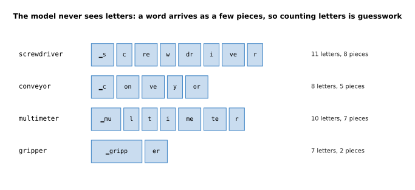

The small tokeniser built in the same script turns "screwdriver" into 8 pieces,
"conveyor" into 5, "multimeter" into 7 and "gripper" into 2, and the model only ever
sees the pieces.

Anything that needs a count meets this problem. Asking how many times a letter appears
in a word asks about something the model cannot see. The same holds for counting the
words in a passage, the items in a list, or the steps already taken, because none of
those is a quantity the machinery works out. Models answer anyway, and the answers are
often close and sometimes right, which is worse than a refusal would be. So if a count
matters, count it in your own code.

---

## 8. Where to read next

- [Post-training a language model](02_post-training-a-language-model.md) is the
  next page, and it explains how a model that only continues text is turned into
  one that answers, follows instructions and sometimes declines.
- [Vision-language models](03_vision-language-models.md) joins a vision backbone
  to the model on this page, so that the same stream of tokens can hold pictures
  as well as words.
- [Reasoning and tool use](04_reasoning-and-tool-use.md) picks up the arithmetic
  and counting failures from section 7 and shows what writing out the working and
  calling a tool actually fix.
- [Training and running a
  transformer](../06_the-transformer/03_training-and-running-a-transformer.md) is
  worth rereading after this page, because the key-value cache and the sampling
  rules it describes are what section 6 was measuring.
- [Language models](../../07_learned-models/07_language-models/01_overview.md) in
  the catalogue of learned models describes what this family is used for on a
  robot arm and which kinds of model exist.
- [Language models as
  planners](../../07_learned-models/07_language-models/03_also-used/01_language-models-as-planners.md)
  shows the pattern section 6 described, where the model is asked once for a plan
  and something faster carries it out.

---

## 9. Using it in Python

Section 1 said that a model's answer at one position is a probability for every
token, and section 4 measured what a continuation costs in bits. Both of those are a
few lines of NumPy, and the numbers in the comments are what the code prints.

```python
import numpy as np

# section 1: a model gives one raw number, a logit, per token in its vocabulary,
# and softmax turns the whole row into probabilities that add up to 1
logits = np.array([6.1, 5.4, 4.9, 4.6, 4.2, 4.1, 3.9, 3.6])
names = ['block', 'cup', 'bowl', 'mug', 'jar', 'plate', 'bottle', 'box']
p = np.exp(logits - logits.max())          # subtracting the largest avoids overflow
p = p / p.sum()
print([f'{n} {v:.3f}' for n, v in zip(names, p)])
# ['block 0.400', 'cup 0.199', 'bowl 0.121', 'mug 0.089',
#  'jar 0.060', 'plate 0.054', 'bottle 0.044', 'box 0.033']
print(round(float(p.sum()), 6))            # 1.0

# section 4: the training cost of writing a token, in bits of surprise
print(round(float(-np.log2(p[0])), 2))     # 1.32  for the likely word
print(round(float(-np.log2(p[-1])), 2))    # 4.93  for the unlikely one

# section 6: the two stages of answering, at the page's illustrative rates
prefill = 900 / 7500                       # reading 900 prompt tokens
decode = 400 / 55                          # writing 400 answer tokens
print(round(prefill, 3), round(decode, 3)) # 0.12 7.273
```

Doing the same thing with a real model is the job of Hugging Face's `transformers`
package, which holds the tokeniser, the weights and the loop. The call below is the
shape of it. What it prints depends on which model you load, so unlike the block
above it is written without claimed numbers.

```python
from transformers import AutoModelForCausalLM, AutoTokenizer

tok = AutoTokenizer.from_pretrained(model_name)
model = AutoModelForCausalLM.from_pretrained(model_name)

# section 3: the chat template writes the roles into one stream of tokens
text = tok.apply_chat_template(
    [{"role": "system", "content": "you are the controller of a robot arm"},
     {"role": "user", "content": "how do i stop the arm?"}],
    tokenize=False, add_generation_prompt=True)
ids = tok(text, return_tensors="pt")
print(ids["input_ids"].shape[1])        # the prompt length section 6 charges for

out = model(**ids)                      # one forward pass: section 6's prefill
probs = out.logits[0, -1].softmax(-1)   # section 1's distribution, one row
print(probs.shape)                      # one number per token in the vocabulary
print(tok.decode(probs.argmax()))       # the single most likely next token
```

The library does three things for you. It carries the tokeniser that turns text into
the pieces section 7 drew. It holds the chat template that writes section 3's role
tokens in the exact form that model was trained on. It runs the stored keys and
values behind `model.generate`, so that each new token costs one pass rather than a
pass over the whole conversation.

What you still decide is everything this page measured. You decide the system prompt,
which is read again on every call. You decide how long an answer to ask for, which
section 6 showed sets how long you wait. You decide whether to retrieve text into the
prompt and how much of it, which section 5 showed buys accuracy with tokens. You
decide what happens when the conversation outgrows the window. Above all you decide
what to do with the answer, because nothing in the library tells you whether the fact
in it is true.
