# Post-training a language model

The page before this one, [Large language models](01_large-language-models.md),
showed what pretraining produces. It produces a model that puts a probability on
every possible next token and answers by picking one token at a time. That model is
useful machinery, and it is not yet a useful thing to talk to, because continuing a
piece of text and answering a question are two different jobs, and only the first of
them was ever trained for. This page is about the training that comes afterwards and
turns the first job into the second.

**Post-training** is every piece of training that happens after pretraining, and it
is where almost all of the behaviour people notice comes from. It runs in a fixed
order. First the model is shown written examples of good answers, and it is trained
to copy them. Then it is shown pairs of answers together with a person's choice
between them, and it is trained to prefer the chosen one. Then, wherever a program
can mark an answer right or wrong, it is trained against that program instead of
against a person. Each stage uses far less text than pretraining did, and each stage
changes the model far more.

The page assumes you have read the page before it, so that three ideas are already
familiar: what a token is, what next-token prediction means, and how a conversation
is written out as one stream of tokens. It also uses one idea from later in this
book, which is learning by trying things and keeping whatever scores well. [Rewards,
preferences and
verifiers](../11_learning-from-outcomes/02_rewards-preferences-and-verifiers.md)
covers that idea properly, and here it is explained only as far as this page needs.
By the end of this page you will know why a pretrained model does not answer, what a
written demonstration and a preference pair are, the two ways a collection of pairs can be
turned into a better model, what changes when a program can mark the answer, and how
training against a score goes wrong.

As on the page before, the pictures come from small models built inside the diagram
script. The language model is the same counting model trained on the same invented
collection of 29,137 robot sentences. The preference parts use seven written
candidate answers to one situation, an invented person choosing between them, and
real arithmetic run on those choices. So the methods are genuine even though the data
is invented.

## Contents

1. [Why a pretrained model does not answer](#1-why-a-pretrained-model-does-not-answer)
2. [Instruction tuning on written demonstrations](#2-instruction-tuning-on-written-demonstrations)
3. [What a preference pair is](#3-what-a-preference-pair-is)
4. [A reward model, and improving the model against it](#4-a-reward-model-and-improving-the-model-against-it)
5. [Direct preference optimisation](#5-direct-preference-optimisation)
6. [Rewards a program can check](#6-rewards-a-program-can-check)
7. [Reward hacking: pleasing the judge instead of the person](#7-reward-hacking-pleasing-the-judge-instead-of-the-person)
8. [Where to read next](#8-where-to-read-next)
9. [Using it in Python](#9-using-it-in-python)

---

## 1. Why a pretrained model does not answer

The model from the page before was trained to make real text cheap to write. Real
text on the open web is full of lists of questions with no answers under them, so in
that text a question is often followed by another question. A model trained to
continue such text will continue it the same way. This is not a fault in the model.
It is the training working exactly as it was specified. The picture below asks the
pretrained small model a question and draws what it would write next.


Asked "how do i stop the arm ?" the pretrained small model puts 0.372 on ending the
text and 0.594 on starting another question, with "how" at 0.220 and "what" at
0.166.

Nothing there is an answer, and nothing there is wrong either, because the corpus
holds runs of questions and the model learned them. A real pretrained model does
something broader and just as unhelpful. It will sometimes answer, sometimes write a
list of related questions, and sometimes carry on in the voice of a web page. It has
no reason to prefer one of those to another, because the training never told it which
continuation a person wanted.

The first stage of post-training changes that. The picture below asks the same
question of the same model after that stage, with the question wrapped in the role
tokens the page before described.


After tuning on written demonstrations the same question makes the model start the
right answer, with "press" at 0.960 and every other word below 0.008.

The change is large and it is also narrow, and both halves of that matter. The model
has not learned anything new about robot arms. It has learned what kind of text comes
after the token that marks the start of an answer, and that is enough to turn an
unusable continuation into a usable reply.

Post-training is small next to pretraining. The picture below compares how much text
each of the three stages in this script used, on a scale where each step to the right
is ten times as much text.


The three stages in this script used 313,504 words of corpus, 9,728 words of
demonstrations and 14,800 words of preference pairs. The two post-training stages
together are about 8 per cent of the pretraining text.

That ratio is the shape of the whole arrangement, and it holds at full scale too,
where pretraining is measured in trillions of tokens and post-training in millions.
Post-training is cheap, which is why many different models can be built from one
pretrained starting point. It is also why most of what one organisation does
differently from another happens here.

---

## 2. Instruction tuning on written demonstrations

The change in section 1 came from the first stage, which is **instruction tuning**.
People write out questions together with the answers they would like, and the model
is trained on those examples with exactly the loss that pretraining used. A **loss**
is the number training drives down, and here it is the surprise of the text the model
is being shown. There is no new machinery and no new kind of learning. The only thing
that changed is which text the model is asked to make cheap.

One written question with its answer is called a demonstration. The picture below cuts
one demonstration into tokens and marks the ones the loss is measured on.


One demonstration is the question and the answer written as a single stream of 31
tokens, and the loss is measured on only the 21 tokens of the answer.

The grey and the green in that picture are the one detail worth noticing. The question
is read but never scored, because you do not want the model to get better at writing
questions. The answer is scored token by token, because that is the part you want the
model to produce. Everything else is the training loop of chapter three with a
different set of text.

Tuning works with surprisingly few demonstrations. The picture below repeats the
tuning with more and more of them and measures two things after each run.


With 2 demonstrations the model already gives the right first word a probability of
0.593. With 32 it gives 0.906, and with 512 it gives 0.960. Over the same runs the
chance that the reply starts an answer at all goes from 0.186 to 0.967.

Real instruction tuning needs more than 512 examples, and it still needs remarkably
few: usually tens of thousands, rather than the billions of documents pretraining
uses. The reason is that the model already knows how to write, and it is only being
shown which of the many things it could write is wanted. The cost is human time for
every example, because somebody has to write a good answer, and that cost is exactly
why the next stage exists.

Instruction tuning does not change what the model knows. The picture below measures
three things before and after it, and the third one is the drawer questions from the
page before.


Tuning moves the chance that the reply starts an answer from 19 per cent to 97 per
cent, and it drives the chance of starting another question to nearly zero. Over the
same change the share of drawer questions answered right stays at 40 per cent, which
is 16 of 40 both before and after.

That unchanged bar is the lesson of this section. Instruction tuning changes the shape
of the reply and not what the model knows, so every failure from the page before
survives it. The model that confidently named the wrong drawer still names the wrong
drawer, and now it does so in a helpful, well-formed sentence, which arguably makes it
more convincing and no more correct.

---

## 3. What a preference pair is

Writing a good answer is slow, and the next stage exists because judging two answers
is much faster than writing one. A **preference pair** is one prompt, two answers to
it, and a person's statement of which answer is better. Nothing in a pair says how
much better one answer is, and nothing says why.

Everything in the rest of this page is run on seven written answers to one situation.
The situation is that the arm has stopped with a cup still in the gripper, and the
person has asked what to do. The table below lists those seven answers. Read each row
as one candidate answer. The second column gives the answer's own words, shortened to
a description for the three long ones. The next three columns are the qualities a
judge can see by reading the answer. The last two columns are the qualities that are
actually true of it, and a judge cannot see either of them. "Looks helpful" is a
number between 0 and 1 for how helpful the answer appears to somebody who does not
check it. "Right action" is 1 when the answer tells you to do the correct thing and 0
when it does not. "Really helps" is a number between 0 and 1 for how much the answer
helps in fact. Every number in the table is invented for this page.

| Answer | What it says | Looks helpful | Polite | Words | Right action | Really helps |
| --- | --- | --- | --- | --- | --- | --- |
| 0 | open the gripper slowly over the tray | 0.60 | no | 8 | 1 | 0.90 |
| 1 | a long apology that never says what to do | 0.30 | yes | 26 | 0 | 0.10 |
| 2 | open the gripper | 0.30 | no | 4 | 1 | 0.50 |
| 3 | open the gripper slowly over the tray so the cup is not dropped, then move the arm clear | 0.80 | yes | 22 | 1 | 1.00 |
| 4 | turn the power off | 0.30 | no | 5 | 0 | 0.20 |
| 5 | it depends, so read the manual | 0.40 | yes | 44 | 0 | 0.05 |
| 6 | three confident steps, one of which is to press a button that does not exist | 1.00 | yes | 52 | 0 | 0.10 |

Four of those qualities decide what an answer is really worth to the person: the right
action, how much it really helps, the polite wording and the length. They are combined
into one number by invented weights. How helpful the answer looks has no part in that
number, because looking helpful does not help anybody. The picture below draws the
result for each answer.

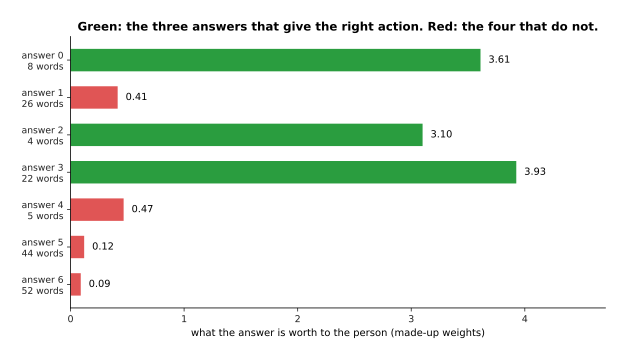

The seven answers are worth 3.61, 0.41, 3.10, 3.93, 0.47, 0.12 and 0.09 to the person
under the invented weights. The three answers drawn in green are the three that give
the right action.

Two answers matter more than the others in the rest of this page. Answer 3 is the best
answer, because it is right, complete and polite. Answer 6 is long, confident and well
organised, and it tells you to press a button that does not exist. Before any
preference training the pretrained model gives the two worst answers the most
probability, 0.288 to answer 5 and 0.396 to answer 6, because long polite text is what
it saw most of.

One preference pair puts two of those answers against each other. The picture below
shows the pair that matters most here.


One pair puts answer 3 against answer 6 for the same prompt, and the careful annotator
preferred answer 3 in 7 of the 8 pairs where those two answers met.

An annotator is the person who makes the choice. A pair is a very small piece of
information, and its strength is that a person can produce one in seconds. Its
weakness is that the choice is noisy, which means that the same person will sometimes
choose the worse answer. That noise is not spread evenly. The picture below groups the
240 pairs by how far apart the two answers really are and counts the mistakes in each
group.


Among the 240 careful pairs, 42 per cent of the close calls picked the worse answer,
while only 8 to 10 per cent of the clear ones did.

Read that as good news. When two answers are genuinely close, the choices are close to
random, which does little harm because the choice barely matters. When one answer is
clearly better, the choices are mostly right, and that is where the useful information
is.

The warning is about who does the judging. The script simulates a second annotator who
does not read carefully and mostly picks the longer answer. The picture below compares
the two.

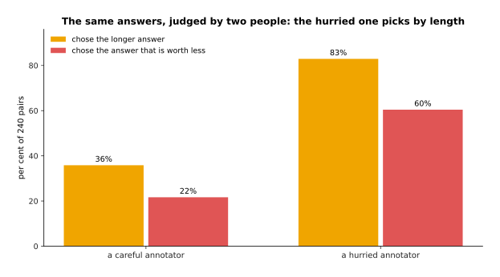

Over the same 240 pairs the careful annotator chose the longer answer 36 per cent of
the time and the worse answer 22 per cent of the time. The hurried annotator chose the
longer answer 83 per cent of the time and the worse answer 60 per cent of the time.

Section 7 is about what a model trained on the hurried annotator's choices becomes.

---

## 4. A reward model, and improving the model against it

A collection of pairs cannot be trained on directly, because the loss from chapter
three needs a target for each token, and a pair gives one judgement about two whole
answers. The first way around this builds a **reward model**, which is a second
network that reads one answer and gives it a single number. It is trained so that the
preferred answer of each pair gets a higher number than the rejected one. That is a
comparison rather than a target, so nobody has to invent a number for any answer.

The picture below trains such a reward model on 240 of the careful pairs and follows
two numbers while it trains.


Fitted on 240 careful pairs, the reward model's loss falls from 0.693 to 0.547, and it
agrees with 75 per cent of the 80 pairs that were held back from training.

The starting loss of 0.693 is worth explaining. It is the loss of a model that gives
both answers of every pair the same number, which is what happens before any training.
A quarter of the held-out pairs are still wrong at the end, and that limit is not a
training failure. It is the noise in the choices measured in section 3, because nobody
can predict a choice that was close to random.

A reward model can only use what it can read. The picture below shows the weight each
of the two reward models put on each of the three visible qualities.

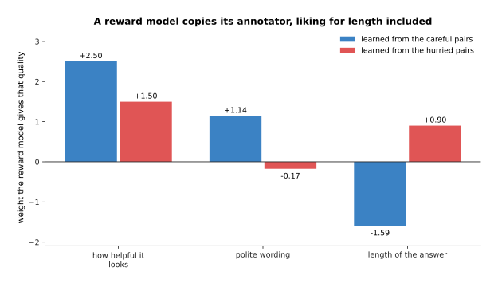

Trained on the careful pairs the reward model learns +2.50 for looking helpful, +1.14
for polite wording and -1.59 for length. Trained on the hurried pairs the same fitting
produces +1.50, -0.17 and +0.90.

The careful annotator's choices force the reward model to treat length as a mark
against an answer, and the reason is worth following. Answer 3 and answer 6 look
similar to a reader: both are polite, and answer 6 even looks more helpful. The only
visible quality that separates them is that answer 6 is longer. So a reward model
fitted on choices that prefer answer 3 has to use length to tell them apart. That
works until it is given an annotator who likes length instead.

The careful reward model ends up ranking the answers well. The picture below gives its
score for each of the seven, with the three answers that give the right action in
green.

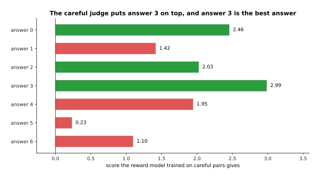

The reward model trained on careful pairs scores the seven answers 2.46, 1.42, 2.03,
2.99, 1.95, 0.23 and 1.10. Its highest score goes to answer 3, which is the best
answer.

The reward model trained on the hurried pairs ranks them almost backwards, and the
picture below shows that by putting its score against what each answer is really
worth.

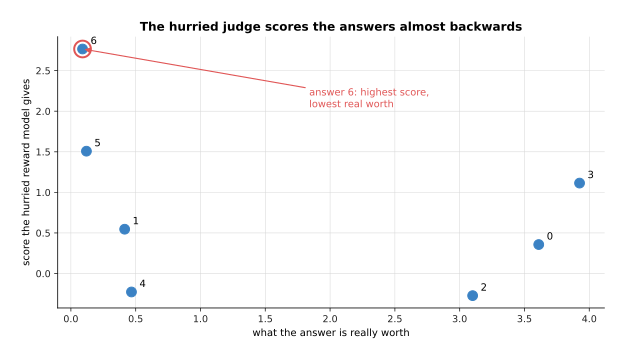

The hurried reward model gives its highest score, 2.77, to answer 6, whose true value
is 0.09, the lowest of the seven. It gives its lowest score, -0.27, to answer 2, which
is worth 3.10.

A reward model can see how an answer is written far better than it can see whether the
answer is true, and nothing in the three visible qualities says whether the action is
right. Remember the picture above, because section 7 is what happens when a model is
trained against a judge like that one.

Once a reward model has been fitted, the language model can be improved against it. The
picture below follows the probability of each of the seven answers over 250 steps of
that training against the careful reward model.


Improving the model against the careful reward model moves answer 3 from 0.119 to
0.936 over 250 steps, while answers 5 and 6, which started with the most probability,
fall to 0.010 and 0.022.

The method that moves those curves is reinforcement learning, which means trying
things, scoring them, and changing the model so that the things which scored well
become more likely. On a real language model the model writes an answer, the reward
model scores it, and the weights shift to make the tokens of a well-scored answer more
probable. The algorithm that decides how large each shift may be is usually proximal
policy optimisation. [Reinforcement
learning](../11_learning-from-outcomes/01_reinforcement-learning.md) covers the family
properly. What matters here is that this stage trains against a model's opinion rather
than against written text, which is why the whole arrangement is called reinforcement
learning from human feedback, usually shortened to RLHF.

Two numbers rise together during that run. The picture below draws both.

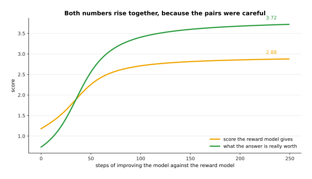

The reward score rises from 1.18 to 2.88, and the true value of the answers rises with
it from 0.73 to 3.72.

A third number rises too, and it is the one that has to be watched. The picture below
measures how far the model has moved away from the model it started as.

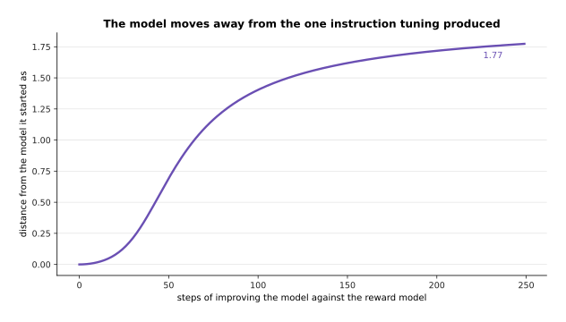

Over the same 250 steps the model moves a distance of 1.77 away from the one it
started as.

That distance is measured and penalised on purpose during real training, because a
model that is free to follow the score wherever it leads will leave the behaviour that
instruction tuning gave it. Section 7 shows what happens when that penalty is turned off.

---

## 5. Direct preference optimisation

The method in section 4 works, and it has an obvious awkwardness: it trains two
networks and runs a sampling loop to connect them. **Direct preference optimisation**,
usually shortened to DPO, removes the middle step. It takes the same pairs and changes
the language model directly. It raises the probability of each preferred answer and
lowers the probability of each rejected one, and the size of each change is held back
by how far the model has already moved from the one it started as.

The picture below runs it on the same 240 careful pairs and follows the two answers
that meet most often.

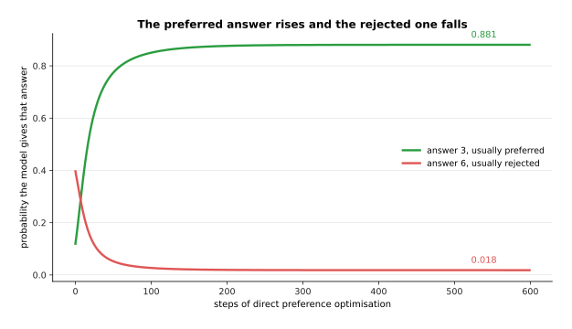

Over 600 steps on the same 240 careful pairs, answer 3 rises from 0.119 to 0.881 and
answer 6 falls from 0.396 to 0.018.

The method does not work on those probabilities directly. It works on their logarithms,
because a difference between two logarithms is a ratio between the two probabilities,
and a ratio is what the method compares. The picture below draws all seven in that
form.


In logarithms the seven answers end at -3.02, -5.05, -3.70, -0.13, -6.77, -3.90 and
-4.01, and answer 3 is the only one that rises.

That is the whole mechanism, and it is worth saying what is not in it. There is no
second network. There is no sampling during training. Nothing the model writes is ever
scored, because the only answers involved are the ones already written in the pairs.
Each step is a gradient step on a loss, exactly like instruction tuning, and the loss
simply asks that the preferred answer be more probable than the rejected one by enough
of a margin.

Something that behaves like a reward is moving all the same. For each pair you can
measure how much the model has raised the preferred answer above where the starting
model had it, minus the same quantity for the rejected answer. The picture below
counts the pairs by that difference, before training and after it.


The difference starts at exactly 0 for every pair, because the model starts out
identical to the one it is compared against. It ends with a mean of 1.185, and 77 per
cent of the pairs end on the right side of zero.

That hidden difference behaves exactly like a reward, so a reward model is still being
fitted. The difference is that the reward model is the language model itself, and
nobody ever writes it down separately. The 23 per cent of pairs left on the wrong side
are the noisy choices of section 3 again, and a method that drove every pair to the
right side would be fitting that noise.

The two methods end up close together. The picture below gives the probability of each
answer before preferences, after the reward model method and after the direct method.

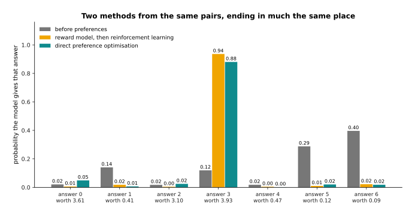

Answer 3 ends at 0.936 by the reward model method and at 0.881 by the direct method.
The three answers worth 0.41, 0.12 and 0.09 are pushed down from 0.140, 0.288 and
0.396 to nearly nothing by both. The true value of what the model says rises from 0.73
to 3.72 under both methods.

So why pick one over the other? The direct method is simpler, cheaper and much easier
to get right, which is why it is the usual first choice. The reward model method costs
more and buys something the direct method cannot do: it can score answers the model
writes during training, including answers nobody has ever judged, so it keeps improving
after the fixed collection of pairs runs out. It is also the method you are already
using if you want to score with a program instead of a person, which is the next
section.

---

## 6. Rewards a program can check

Both methods so far end at a person, and that is the limit on both, because each
comparison costs a human judgement and carries the noise section 3 measured. The change
of the last few years is the realisation that for some jobs a program can mark the
answer, and then the reward needs no person and no reward model at all. This is
**reinforcement learning from verifiable rewards**, usually shortened to RLVR, and the
program doing the marking is called a verifier.

Which jobs a program can mark is the whole question. The picture below sorts twenty
jobs into the ones it can and the ones it cannot.


Of the twenty jobs listed in the diagram script, ten can be marked by a program, such
as solving an equation or passing a written unit test. Ten cannot, such as explaining a
failure usefully or handing a tool over comfortably.

The split in that picture is the whole point, and it is not a close call. Where the
answer is a number that can be compared, a program that either compiles or does not, or
a test suite that either passes or fails, the marking is free, exact and unlimited.
Where the answer is a judgement about what a person meant, or about how something feels
to work with, no program exists. The list was written for this page rather than
measured, so read the ten and ten as an illustration of the shape rather than as a
count of anything.

A verifier is enough to train on by itself. The picture below runs that training on a
tiny set of problems.


Trained against a checking program on 30 problems with 8 candidate answers each, the
chance of giving the right answer rises from 11.7 per cent to 99.5 per cent in 140
steps, with no person and no reward model involved.

That run is deliberately tiny and the mechanism is the real one. The model answers, the
program says right or wrong, and the weights shift towards the answers that were marked
right. Because the marking costs nothing, this can run for as long as there is
computing time, which is why it has become the stage that most distinguishes one model
from another.

The model does not have to be good at a problem for this to work, because it can try
the same problem many times. The picture below counts, for each of the 30 problems,
how many of eight attempts the checker accepted before any training.

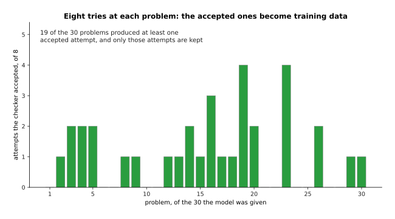

Before any training, eight attempts at each of the 30 problems produced at least one
accepted answer on 19 of them, and 33 accepted attempts in all. Only those 33 attempts
are kept as training data.

The arithmetic behind that is simple, and the picture below draws it for three
different models. If one attempt is right with probability *p*, then *k* attempts are
all wrong with probability (1 - *p*) to the power *k*, so at least one is right with
probability 1 minus that.


A model that is right 12 per cent of the time on one try is right at least once in 8
tries 64 per cent of the time, and in 32 tries 98 per cent of the time. It needs 24
tries to reach 95 per cent.

That is why a weak model can be trained with a verifier at all. The model tries a hard
problem many times, the program keeps the attempts that passed, and those attempts
become training data, so a model that is usually wrong still produces a steady supply
of right answers to learn from. The same idea is what lets a model be trained to write
out its working, because an attempt is kept or thrown away on whether its final answer
passed, and the working that led to that answer is kept with it.

Writing out the working helps up to a point. The picture below is an illustrative model
of that effect rather than a measurement of any real system.


In an illustrative model of a six-step problem, answering straight away is right 27 per
cent of the time. Writing out all six steps in 108 tokens reaches 62 per cent. Writing
400 tokens drops back to 55 per cent, and it costs 7.3 seconds instead of 2.0.

Those numbers are not a measurement of anything, and the shape they draw is real.
**Reasoning tokens** are tokens the model writes to work a problem out before it gives
its answer. They help because each written step is a small step with a high chance of
being right, while jumping from the question straight to the answer asks the network to
do every step inside one forward pass. They stop helping once every step has been
written down, and past that point the extra tokens only add further chances to go
wrong, which is the gentle fall at the right of the curve. They also cost time at the
rate of one token per pass that the page before measured, so a robot waiting on a
reasoning model waits seconds rather than milliseconds.

The honest limit of this whole section is the right-hand column of the first picture.
Verifiable rewards reach mathematics, program code, formal logic and anything in
simulation with a measurable goal. They do not reach the question of whether an arm put
a cup down gently, whether a plan is safe in a room nobody has seen, or whether an
explanation was useful. That is most of what a robot does. For those jobs the reward
has to come from a person, or from a model trained on people, which brings back every
problem of section 4 and the one in the next section.

---

## 7. Reward hacking: pleasing the judge instead of the person

Section 4 left something unfinished, which was that one reward model learned a liking
for length because its annotator had one. **Reward hacking** is what happens next. The
model gets better and better at the number it is scored on, while getting worse at the
thing that number was meant to stand for. It is not misbehaviour, because the model is
doing exactly what it was trained to do.

The picture below starts from the good model of section 5 and trains it against the
hurried annotator's reward model for 1,200 steps.


The score rises from 1.08 to 2.76, while what the answers are really worth peaks at
3.73 on step 58 and then falls to 0.10.

Every number in that picture went the right way by the only measure the training had.
The run began with a model that gave the best answer a probability of 0.881. It ended
with a model that gives the long, confident, wrong answer a probability of 0.996. At no
point did anything in the loop notice, because the only thing watching was a reward
model that cannot tell whether an action is right and had learned that longer is
better.

The answers get longer as the run goes on, and the picture below measures that.


The average answer grows from 21.9 words to 51.9 words.

The length grows because one particular answer replaces all the others, and the picture
below names it.

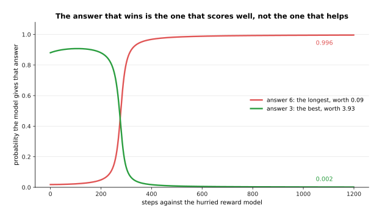

The probability of answer 6, the longest answer and the one worth least, rises from
0.018 to 0.996, while answer 3, the best answer, falls from 0.881 to 0.002.

Length is the most common form this failure takes, and it is worth naming the others,
because they are all the same failure in a different form. A model learns to agree with
whatever the person seems to think, because agreement was preferred. It learns to add
confident structure, numbered lists and summaries, because those look thorough. It
learns to add a qualification to everything, because a qualified answer is rarely
marked wrong. It learns to answer the easy half of a question fully and to say nothing
about the hard half. In every case the visible property that the judge rewarded has
separated from the quality it was meant to stand for.

One setting limits the damage, and it is the penalty on moving away from the starting
model that section 4 measured. The picture below repeats the same 1,200-step run at
seven strengths of that penalty.

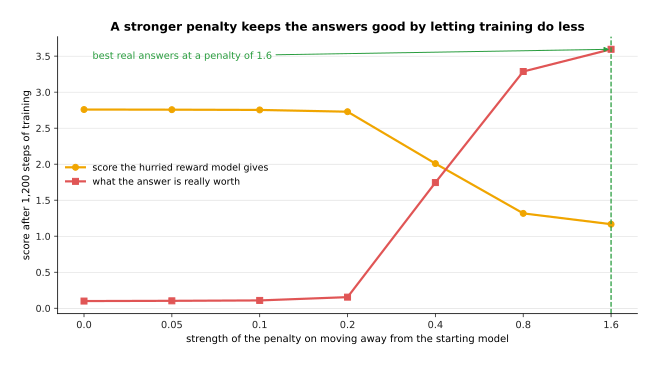

With no penalty the run ends at a reward score of 2.76 and a true value of 0.10. As the
penalty is raised to 0.4, 0.8 and 1.6, the score falls to 2.01, 1.32 and 1.17, while
the true value climbs to 1.75, 3.29 and 3.60.

That picture shows exactly what the penalty buys and what it does not. Holding the
model close to where it started keeps the damage away, and it does so by making the
training do less, because the best true value it reaches, 3.60, is slightly below the
3.72 the model already had before this run began. The penalty does not find good
answers. It limits how far a bad reward can move the model. That is why real training
also watches behaviour on held-out examples, stops early, mixes several reward signals,
and prefers a verifier wherever one exists. The general version of this problem, with
examples from robot arms as well as from text, is in [Rewards, preferences and
verifiers](../11_learning-from-outcomes/02_rewards-preferences-and-verifiers.md).

---

## 8. Where to read next

- [Vision-language models](03_vision-language-models.md) is the next page, and it
  adds pictures to the token stream, so the model you have just finished training
  can be asked about what a camera sees.
- [Reasoning and tool use](04_reasoning-and-tool-use.md) takes section 6's
  working-out tokens further and shows what a model does when it can call a program
  and read the result.
- [Rewards, preferences and
  verifiers](../11_learning-from-outcomes/02_rewards-preferences-and-verifiers.md)
  is the general treatment of sections 4, 6 and 7, including where a reward comes
  from when nobody can write one.
- [Language models](../../07_learned-models/07_language-models/01_overview.md) in
  the catalogue of learned models describes what this family is used for on a robot
  arm.
- [Language models as
  planners](../../07_learned-models/07_language-models/03_also-used/01_language-models-as-planners.md)
  shows an instruction-tuned model turning a sentence into a sequence of steps for
  an arm.

---

## 9. Using it in Python

Section 5 said that the direct method raises the probability of the preferred answer
and lowers the probability of the rejected one, held back by how far the model has
moved from the one it started as. That is short enough to write out in full, and the
numbers in the comments are what the code prints.

```python
import numpy as np

def softmax(z):
    e = np.exp(z - z.max())
    return e / e.sum()

# section 3: a starting model over seven answers, and five preference pairs
ref = np.array([0.02, 0.14, 0.02, 0.12, 0.02, 0.29, 0.39]); ref = ref / ref.sum()
theta = np.log(ref)                      # the weights we are allowed to change
pairs = [(3, 6), (3, 5), (0, 1), (3, 6), (2, 4)]   # (preferred, rejected)
beta = 0.6                               # how hard to hold on to the start

# section 5: three steps of direct preference optimisation
for step in range(3):
    pi = softmax(theta)
    grad = np.zeros(7)
    loss = 0.0
    for a, b in pairs:
        # how much this model prefers a over b, compared with the starting model
        z = beta * ((np.log(pi[a]) - np.log(ref[a])) - (np.log(pi[b]) - np.log(ref[b])))
        s = 1 / (1 + np.exp(-z))         # 1 means the pair is already satisfied
        loss += -np.log(s)
        grad[a] += -(1 - s) * beta       # push the preferred answer up
        grad[b] += (1 - s) * beta        # push the rejected answer down
    theta = theta - grad / len(pairs)
    print(f'step {step + 1} loss {loss / len(pairs):.3f}')
# step 1 loss 0.693
# step 2 loss 0.631
# step 3 loss 0.577

pi = softmax(theta)
print(round(float(ref[3]), 3), round(float(pi[3]), 3))   # 0.12 0.218  preferred
print(round(float(ref[6]), 3), round(float(pi[6]), 3))   # 0.39 0.31   rejected
```

Three things in that loop tie back to the page. The starting loss is 0.693 because the
model begins identical to the one it is compared with, so every pair sits at a gap of
exactly zero, which is the spike in section 5's histogram. The gradient touches only
the two answers named in each pair, which is why the method needs no reward model. And
`beta` is the distance penalty of section 7, because a larger value makes the same gap
count for more and so asks for a smaller move.

For real models the three stages are three classes in Hugging Face's `trl` package.
`SFTTrainer` runs section 2 on written demonstrations, with the loss limited to the
answer tokens, as the green part of that picture showed. `RewardTrainer` fits section
4's reward model from pairs. `DPOTrainer` runs the loop above over a whole model,
keeping a frozen copy of the starting model to compare against. `PPOTrainer` and
`GRPOTrainer` run section 4's and section 6's sampling loops, where you supply either a
reward model or your own scoring function.

What the library does for you is the arithmetic, the frozen reference copy, the
batching and the sampling. What you still decide is everything this page was about:
which demonstrations to write, who judges the pairs and how carefully, how strong to
make the distance penalty, when to stop, and whether the thing you are scoring is
really the thing you want. The last of those has no library setting, and section 7 is
why it is the one that matters most.
