# Vision-language models

The page before this one, [post-training a language
model](02_post-training-a-language-model.md), finished a model that reads words
and writes words. That model is useful to a robot only when a person types out
what the robot can see, because the model itself has never looked at anything.
This page removes that restriction. It answers one question: how do you join a
model that looks at pictures to a model that reads and writes words, so that one
model does both?

The answer is a construction you can draw. A vision backbone turns the camera
picture into a set of vectors. A vector here means a list of numbers, nothing
more. A small trained part called the projector turns those vectors into
something shaped like word tokens. A token is one small piece of text, such as a
short word or part of a longer word. The picture tokens are then put into the
middle of the model's row of tokens, as though a person had typed them. After
that the model carries on predicting one token at a time, exactly as before.

By the end of this page you will know what each of the three parts does, what
the joining part costs, in what order the three parts are trained, how much of
the model's limited reading space one picture uses, and which jobs on a robot
this kind of model is bad at.

This page is for a reader who has read [large language
models](01_large-language-models.md). So you already know that a model turns a
conversation into tokens, that it writes its reply one token at a time, and that
the number of tokens it can hold at once is limited. It also helps to have read
[vision backbones](../09_models-that-see/01_vision-backbones.md), because the
seeing half of what follows is one of those with nothing changed.

Every number in the pictures is worked out in
`docs/diagrams/language_and_multimodal_2.py`, and that script prints each number
when it runs. The sizes it works from are an illustration rather than a
measurement of any named model. They are: an input square of 224 pixels cut into
patches of 14 pixels, a vision backbone of 24 transformer blocks of width 1024,
and a language model of 32 blocks of width 4096. The workbench pictures and the
clouds of vectors are simulated, and the script states the seed it used, so that
anybody can redraw exactly the same ones. The arithmetic on top of them is real.

## Contents

1. [The two halves, and the gap between them](#1-the-two-halves-and-the-gap-between-them)
2. [The projector: one small matrix that is trained first](#2-the-projector-one-small-matrix-that-is-trained-first)
3. [A picture inside the token stream](#3-a-picture-inside-the-token-stream)
4. [The order the training happens in](#4-the-order-the-training-happens-in)
5. [Resolution: why one small square is not enough](#5-resolution-why-one-small-square-is-not-enough)
6. [What a vision-language model is weak at](#6-what-a-vision-language-model-is-weak-at)
7. [What it gives a robot that a detector cannot](#7-what-it-gives-a-robot-that-a-detector-cannot)
8. [Where to read next](#8-where-to-read-next)
9. [Using it in Python](#9-using-it-in-python)

---

## 1. The two halves, and the gap between them

A **vision-language model** is one model that takes a picture and some words
together and writes an answer in words. It is built by joining two models that
already exist, rather than by training something new from nothing. The seeing
half cuts the picture into small squares called patches, and it turns each patch
into a list of numbers. The reading half turns each piece of a word into a list
of numbers, and then predicts what comes next.

The picture below puts the two halves side by side. Read each column from the
top down, and compare the two boxes at the bottom.

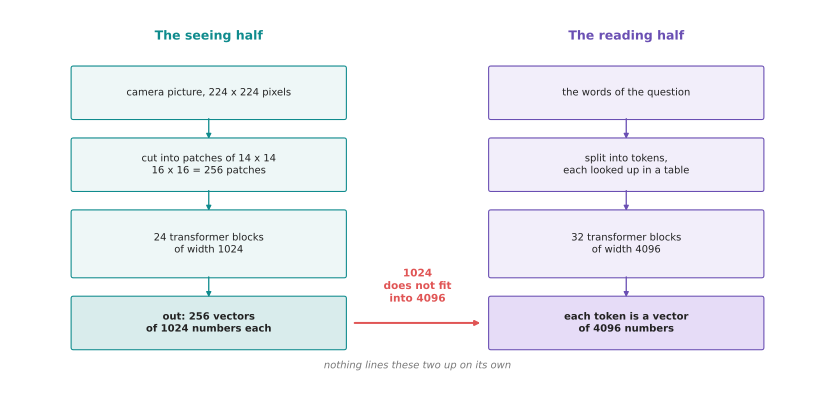

The seeing half ends with 256 vectors of 1024 numbers each. The reading half
wants vectors of 4096 numbers. So the two ends do not fit together.

Follow the left column down. A square of 224 pixels is cut into patches of 14
pixels, which gives 16 patches across and 16 patches down. That is 256 patches
in all, and each one becomes a vector of 1024 numbers. Now follow the right
column down. Each piece of a word becomes a vector of 4096 numbers. The first
problem is therefore plain arithmetic: 1024 numbers cannot be read as 4096
numbers.

The second problem is harder to see and it matters more. Even if the two lists
were the same length, nothing has ever made the backbone's numbers mean what the
language model's numbers mean. The two halves were trained separately, and
neither of them has ever seen the other one's output. One sign of that is how
large the numbers are, and the next picture measures it.

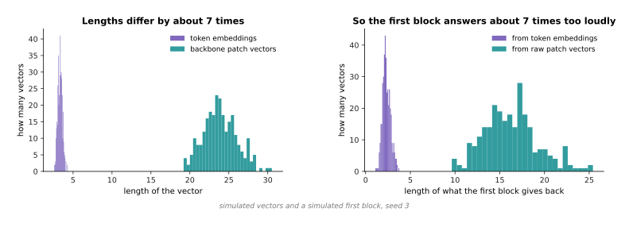

In a simulated set of vectors, the backbone's vectors are about 7 times as long
as the language model's. Feeding them straight in makes the first block of the
language model answer about 7 times too strongly.

The left panel measures how long each kind of vector is. The length of a vector
is worked out in the ordinary way, as the square root of the sum of the squares
of its numbers. The simulated patch vectors have an average length of 23.89, and
the token vectors have an average length of 3.33. The right panel pushes both
sets of vectors through the same small stand-in for a language model's first
block. The answers that come back from the patch vectors are 6.9 times as long
as the answers that come back from the token vectors. A model whose first block
receives numbers that large gives nonsense back. So something has to fix two
things: the length of the list, and the size of the numbers in it.

That something is a third part, and the next picture shows how small it is. The
bars use a logarithmic scale, which means each step up the axis multiplies the
value by ten, so that three very different sizes fit on one picture.

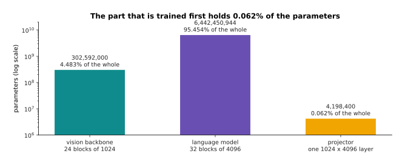

The part that does the joining holds 0.062 per cent of the whole model's
parameters. A parameter is one number inside the model that training is allowed
to change.

The counting is plain arithmetic on the illustrative sizes. There are
302,592,000 parameters in the backbone, 6,442,450,944 in the language model, and
4,198,400 in the joining part. The three together come to 6,749,241,344, so the
joining part is 0.062 per cent of the whole. That very small share is what the
rest of this page depends on, because a part that small is cheap to train on its
own.

---

## 2. The projector: one small matrix that is trained first

The part that sits between the two halves is called the **projector**. It is one
matrix multiply followed by one add, which is the arithmetic that a single fully
connected layer does. A matrix here is a rectangle of numbers. The projector
takes one patch vector and gives back one vector of the width the language model
wants. All of its cleverness is in the numbers inside the matrix, and those
numbers are learned by training in the ordinary way.

The next picture works the whole operation out on a small example, so that
nothing is hidden. It uses a patch vector of five numbers and a matrix of four
rows, because the real sizes would not fit on a page.

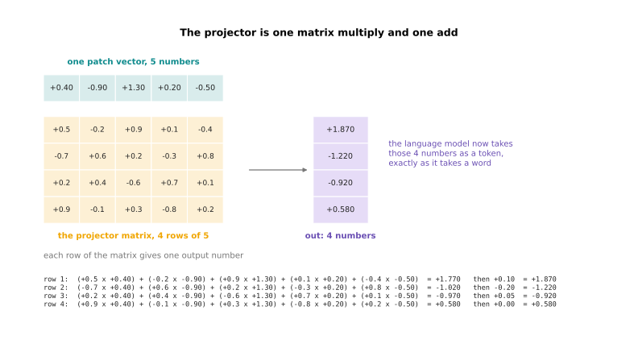

A patch vector of five numbers goes through a matrix of four rows, and each row
of the matrix gives one output number.

Work the first row through by hand, and you will see that there is nothing else
to it. The patch vector is +0.40, -0.90, +1.30, +0.20 and -0.50. The first row
of the matrix is +0.5, -0.2, +0.9, +0.1 and -0.4. Multiply the first number by
the first, the second by the second, and so on, and then add the five products
together. They come to +1.770. Each row also has one extra number of its own,
which is added at the end. For the first row that number is +0.10, so the answer
is +1.870. The other three rows give -1.220, -0.920 and +0.580 in the same way.
Those four numbers are now one token, as far as the language model is concerned.

The real projector does exactly that, with bigger numbers of rows and columns.
The next picture gives those sizes.

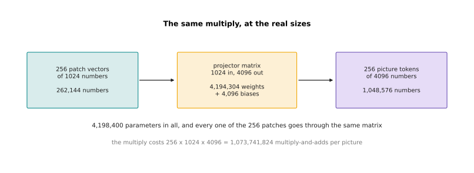

At the real sizes the same multiply turns 256 vectors of 1024 numbers into 256
vectors of 4096 numbers, using 4,198,400 parameters.

The real matrix has 1024 columns and 4096 rows, which is 4,194,304 numbers. Then
there are 4,096 more numbers to add, one for each row. The two counts together
make 4,198,400. Every one of the 256 patches goes through that same matrix, so
one picture costs 256 times 1024 times 4096 multiply-and-add steps, which is
1,073,741,824 of them. That is a small amount of work beside what the language
model does for every token it writes.

A single layer is not the only choice. There are three shapes of projector in
common use, and the next picture compares them. The left bars are what each one
weighs in parameters, and the right bars are how many tokens each one hands to
the language model for one crop of a picture.

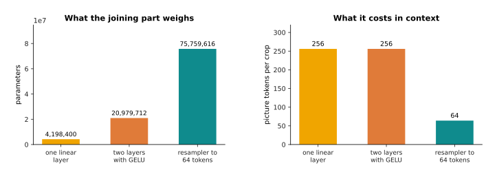

The three common shapes of projector trade parameters against the number of
tokens a picture costs.

The simplest shape is the single layer just described. The second shape puts two
such layers one after the other, with a smooth bending rule between them. A
bending rule is a small fixed sum applied to each number on its own, and its job
is to stop two layers in a row from collapsing into one. That shape comes to
20,979,712 parameters and still gives 256 tokens out. People use it because one
layer sometimes cannot change the shape of the numbers enough. The third shape
is called a resampler. It uses attention to squeeze the 256 patch vectors down
to a fixed smaller number, which is 64 in the drawing. That costs 75,759,616
parameters, but it hands the language model a quarter of the tokens. Most
builders start with the single layer, because it is the cheapest thing that
works. They move to the resampler when the thing they run out of is reading
space rather than money.

Whichever shape is used, training is what makes it work. The next picture shows
what training does, using simulated vectors drawn in two directions so that they
fit on a flat page.

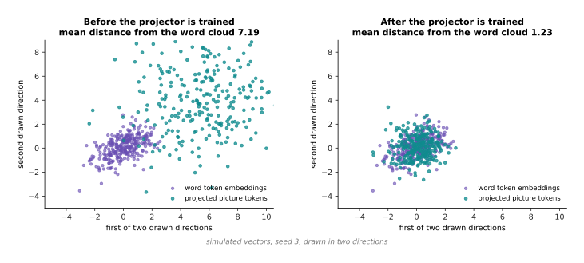

Training the projector moves the picture tokens from an average distance of 7.19
from the middle of the word cloud down to 1.23.

Both panels are drawn from simulated vectors, so they show the shape of what
training does rather than a measurement of a real model. What training changes
is the matrix. What the matrix does is move, stretch and rotate the whole cloud
of patch vectors, until that cloud sits where the language model's own tokens
sit. Nothing about the backbone or the language model changes at all while this
happens.

---

## 3. A picture inside the token stream

Once the projector has done its work, the picture is 256 ordinary tokens. Those
tokens are placed in the row where the picture appeared in the conversation. The
result is called a **multimodal token stream**. That means one row of tokens in
which some tokens came from words and some came from a picture. The word
multimodal only means that more than one kind of input went into it.

The next picture is that row, drawn as a bar. The width of each part is the
share of the row it takes.

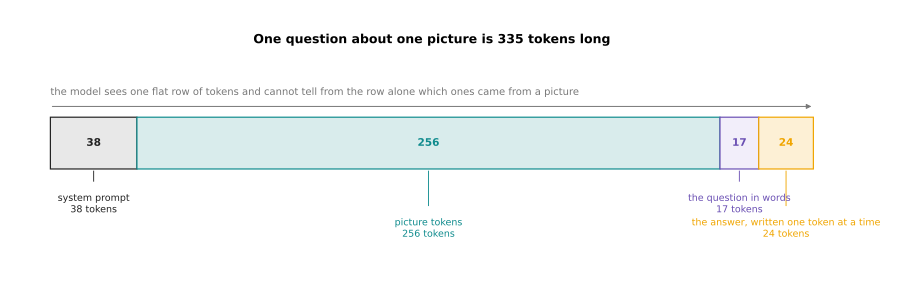

One picture and one short question make a row of 335 tokens, of which the
picture is 256, or 76 per cent.

Read the bar in the order the model reads it. First come 38 tokens of standing
instructions, which are the rules the operator gives the model once and leaves
in place. Then come the 256 tokens from the picture. Then come 17 tokens for the
question. Then come 24 tokens of answer, which the model writes itself. The
model cannot tell from the row alone which tokens came from a camera, because by
the time they reach the first block they are all vectors of 4096 numbers. That
sameness is what makes the whole construction work. Answering a question about a
picture in this way is called **visual question answering**.

The cost of all those picture tokens is the next thing to look at. A model can
only hold so many tokens at once, and that limit is called the context window.
The next picture measures each way of sending a picture against a context window
of 8,192 tokens.

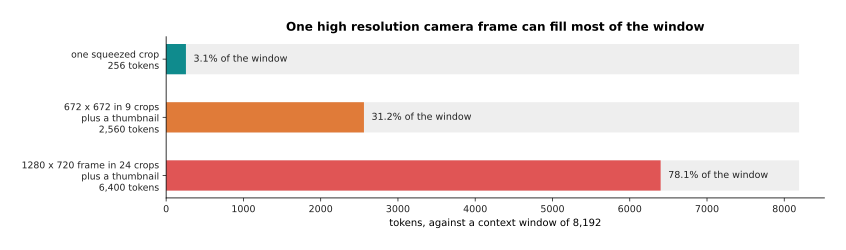

Against a context window of 8,192 tokens, one squeezed picture takes 3.1 per
cent, a cut-up picture of 672 pixels takes 31.2 per cent, and a cut-up camera
frame takes 78.1 per cent.

Section 5 explains the two cut-up schemes properly, but their cost is worth
seeing now, because it shapes every later decision. A 672 pixel picture is cut
into 9 pieces, and one small copy of the whole picture is added, which makes 10
lots of 256 tokens, or 2,560. A camera frame of 1,280 by 720 pixels is cut into
24 pieces, and with the small copy that makes 25 lots of 256 tokens, or 6,400.
That leaves almost nothing for the conversation itself.

The same numbers can be turned around, and asked how many pictures fit. The next
picture does that for a small context window and a large one.

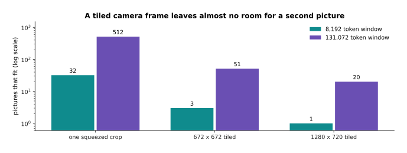

An 8,192 token window holds 32 squeezed pictures, 3 cut-up 672-pixel pictures or
1 cut-up camera frame. A 131,072 token window holds 512, 51 and 20.

The larger window helps, and windows of that size are ordinary now. However, it
helps less than it looks. A robot watching a work cell produces a frame many
times a second, so twenty frames is under one second of video. The deeper
problem is not storage but work, and the next picture measures that.

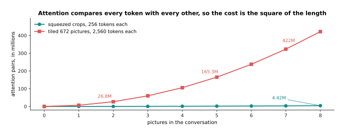

Eight cut-up pictures need 421,686,225 attention comparisons, against 4,422,609
for eight squeezed ones. That is 95 times the work.

[Attention](../06_the-transformer/01_attention.md) explained why this cost grows
with the square of the length of the row. Attention compares every token with
every other token, so twice the tokens means four times the comparisons. This
curve is that square drawn out. Doubling the detail in a picture multiplies the
work by about four. That is the real reason resolution is kept low. Section 5
returns to that once the training order is settled.

---

## 4. The order the training happens in

The parts are now joined, but a projector filled with random numbers hands the
language model noise. So all three parts have to be trained, and the order
matters more than anything else in this construction. The usual order has two
stages. First the two big parts are frozen, which means their numbers are held
still while only the projector changes. Then the language model is unfrozen, so
that it can change too.

The next picture lists the three parts twice, once for each stage, and marks
which parts move.

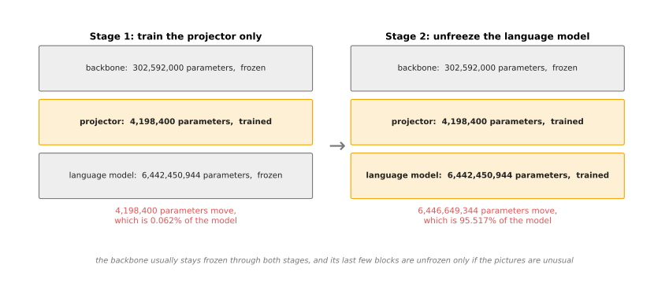

The first stage moves 0.062 per cent of the model's parameters. The second stage
moves 95.520 per cent of them.

The backbone usually stays frozen through both stages. Its last few blocks are
unfrozen only when the pictures are unlike anything it was trained on, such as
medical scans or the output of a depth camera.

Freezing is not only about damage, it is also about memory. The next picture
works out what each stage needs, and each bar is built from two layers.

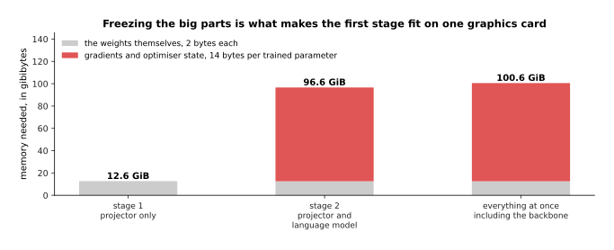

Holding the weights takes 12.57 gibibytes. Training adds about 14 bytes for
every parameter that moves, which takes the first stage to 12.6 gibibytes and
the second stage to 96.6. A gibibyte is 1,073,741,824 bytes.

Read each bar as two layers. The grey layer is the weights themselves at 2 bytes
each, and you pay for that layer whatever you train. The red layer is what
training adds for each parameter that is allowed to move: a gradient, which is
the number saying which way that parameter should go; two running averages that
the optimiser keeps so that it can smooth the steps; and one more accurate copy
of the parameter. The first stage fits on one ordinary graphics card and the
second stage needs several. That alone is a reason to do the cheap stage first,
because you find out whether the projector can learn anything at all before
paying for the expensive stage.

The stronger reason is what the wrong order does to the reading half. The next
picture comes from a small network written in NumPy and trained by real gradient
descent on a made-up task, so the curves are measured rather than drawn by hand.
The left panel is the new picture task and the right panel is the old text task.

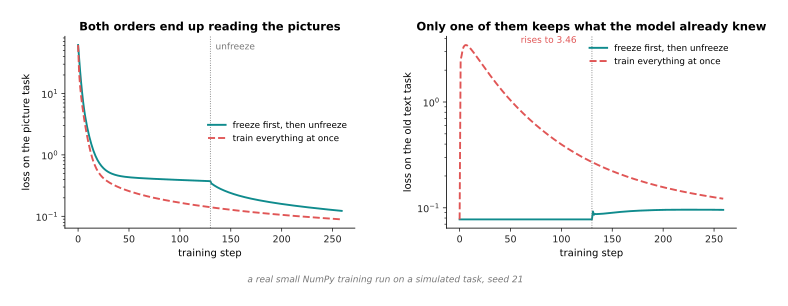

In a small real training run, freezing first keeps the text loss between 0.0777
and 0.0960 throughout. Training everything at once sends that loss up to 3.456,
which is 44 times where it started.

Loss is a single number that says how wrong the model's answers are, so a lower
loss is better. The run works like this. A two-layer body is first trained on a
text task until it is good at it. A projector filled with random numbers is then
attached. Finally the picture task is trained, in each of the two orders. Both
orders end up reading the pictures, because the picture loss falls from 61.4 to
0.1227 in one order and to 0.0891 in the other. On that measure there is nothing
to choose between them. The difference is in the second panel. Training
everything at once lets the signal from a random projector flow straight into
the body and damage what it already knew.

The size of that signal is the mechanism, and it can be measured directly. The
next picture measures how hard the picture task pushes on the body's first
matrix of numbers, at two moments in the same run.

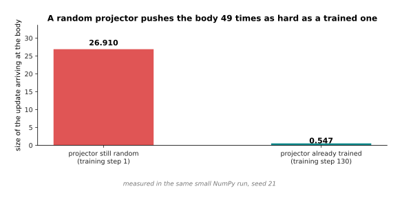

On the first training step, while the projector still holds random numbers, the
update arriving at the body has a size of 26.910. By step 130, when the
projector has been trained, the update arriving has a size of 0.547, which is 49
times smaller.

That is the whole argument for freezing in two sentences. A frozen weight cannot
be damaged at all, so during the first stage the body is safe by construction.
By the time the body is unfrozen, the projector already produces something
sensible, so the updates that reach the body are small enough to be harmless.

In the small run above the damage is repaired, because the original text data is
still there in full and keeps being trained on. In a real run it is not there,
because nobody has the whole of the original training text to hand. That is the
problem which [fine-tuning and
adapters](../07_pretraining-and-adapting/03_fine-tuning-and-adapters.md) calls
catastrophic forgetting. The next picture runs the wrong order twice, once with
the old text data still in the training mixture and once without it, and
measures what is left of the old skill.

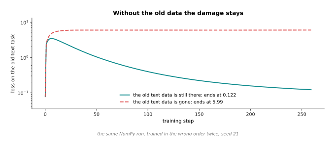

When the old text data is still there, the text loss rises and then comes back
down to 0.122. When the old text data is gone, the same loss rises and stays at
5.99, which is 49 times worse.

So the repair in the earlier picture was not done by the model. It was done by
the old data, and in a real build that data is missing. This is why the order is
worth getting right the first time: the damage is cheap to avoid and expensive
to repair.

---

## 5. Resolution: why one small square is not enough

The order of training settles how the model is built. Resolution settles what
the model can actually see, and this is where these models disappoint on a
robot. The backbone takes a square of a fixed size, so a camera picture has to
be squeezed to fit. Squeezing throws away exactly the small details that an arm
cares about.

The next picture shows the same simulated workbench twice, once at full size and
once squeezed, with the bottle's printed label enlarged in both.

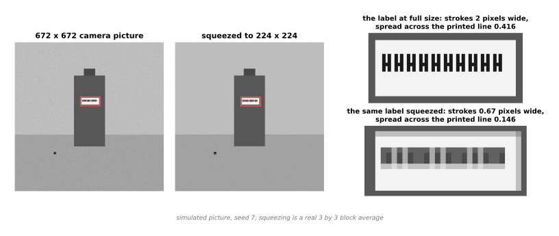

Squeezing a 672-pixel picture to 224 pixels drops the brightness spread across
the printed line from 0.416 to 0.146, which is a fall of 65 per cent. It also
turns characters 10 pixels tall into characters 3.3 pixels tall.

The brightness spread is one way of measuring how much of the print has
survived. A line of print is a run of dark strokes with light gaps between them,
so the more the brightness varies across the line, the more of the print is
still there. The workbench picture is drawn by the script rather than
photographed, and the squeezing is a real average over blocks of 3 by 3 pixels,
which is what resizing does. The label is printed with strokes 2 pixels wide, so
after averaging each stroke is 0.67 of a pixel wide, and it is mixed with the
white paper on either side of it. That is the arithmetic behind the fact that
the small version cannot be read.

The common fix is to stop squeezing and start cutting. The picture is divided
into squares of the size the backbone wants. Each square goes through the
backbone separately, and all the resulting tokens go into the row together. The
next picture shows that division and adds up what it costs.

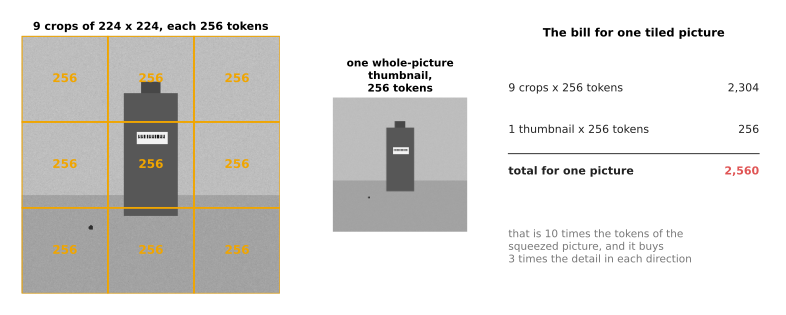

Cutting the picture into 9 pieces and adding one small copy of the whole picture
costs 10 lots of 256 tokens, which is 2,560, or 10 times one squeezed picture.

The small copy of the whole picture is called a thumbnail, and it is added for a
reason that the next picture makes plain. Cutting is done on a fixed grid,
without any regard for what is in the picture, so an object often lands in more
than one piece.

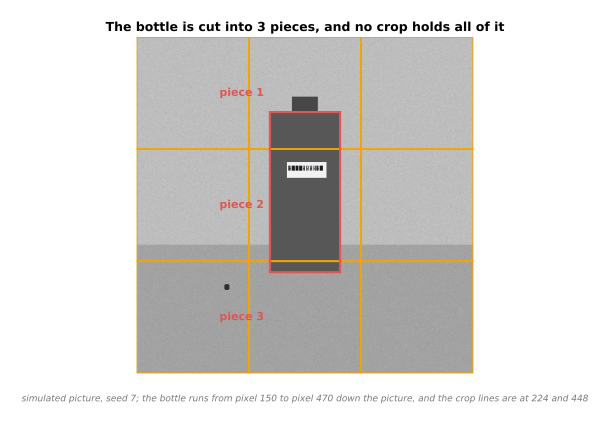

The bottle runs from pixel 150 to pixel 470 down the picture, and the crop lines
sit at 224 and 448, so the bottle is cut into 3 pieces and no single crop holds
all of it.

Each piece goes through the backbone on its own, so no piece ever sees the whole
bottle. The thumbnail is the one view that does, which is why it is added. A
model given only the nine pieces has no easy way to know that they came from one
scene at all.

Cutting buys detail and costs tokens, and it is worth putting those two together.
The next picture does that for the three schemes. The left bars are what each
scheme costs in tokens. The right bars are what each scheme buys, measured as
how much of the table ends up under one patch.

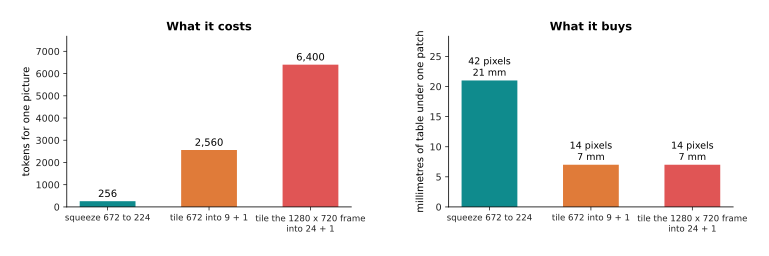

Squeezing costs 256 tokens and gives each patch 42 original pixels, or 21
millimetres of table. Cutting costs 2,560 or 6,400 tokens and gives each patch
14 pixels, or 7 millimetres.

To turn pixels into something an arm can use, the drawing assumes a camera that
sees 640 millimetres of bench across its 1,280 pixels. That is half a millimetre
per pixel.

Cutting into more pieces is not a straight line of improvement, and the next
picture shows where it stops. Each dot on the curve is one way of cutting the
same camera frame.

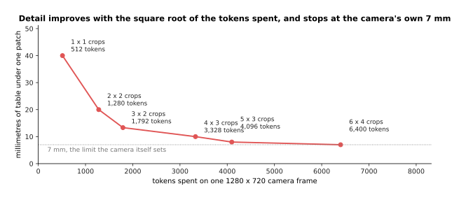

Cutting a camera frame into more pieces improves the detail with the square root
of the tokens spent, and the improvement stops at 7 millimetres, which is the
camera's own limit.

Follow the curve from left to right. One piece over the whole frame costs 512
tokens and gives 40 millimetres a patch. Two pieces across cost 1,280 tokens for
20 millimetres. Three across cost 1,792 tokens for 13.3 millimetres. Four across
cost 3,328 tokens for 10 millimetres. Five across cost 4,096 tokens for 8
millimetres. Six across cost 6,400 tokens for 7 millimetres, and at that point
the pieces are at the camera's own resolution, so cutting further buys nothing
at all. Spending twelve and a half times the tokens bought under six times the
detail. The reason is that tokens count area while detail counts length.

---

## 6. What a vision-language model is weak at

That measurement turns straight into the list of things the model gets wrong.
Every weakness here follows from the patch grid, rather than from the model
being badly trained.

The first weakness is position. The next picture draws the patch grid over the
same scene twice, once for a squeezed picture and once for a cut-up one.

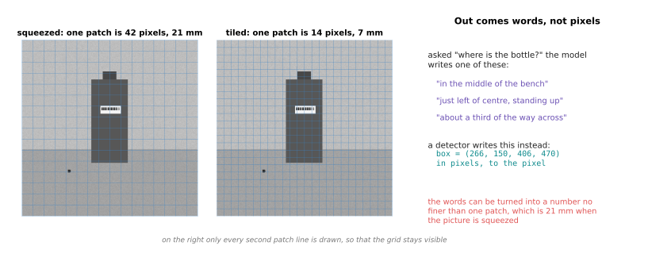

The finest position the row of tokens can refer to is one patch, which is 21
millimetres of bench on a squeezed picture and 7 millimetres on a cut-up one.

There are two separate limits here, and the grid is only the first. The model's
evidence about where something is comes from which patch it was in, so the grid
sets how fine that evidence can be. The second limit is the output. Asked where
the bottle is, the model writes a sentence such as "just left of centre,
standing up", and a sentence carries no pixel numbers at all. A detector asked
the same question writes a box, such as 266, 150, 406 and 470 in pixels. You can
ask the model to write numbers and it will, but those numbers can only be as
good as the grid the evidence came from.

The second weakness is small objects. The next picture draws how many patches an
object covers against how large it is. The dotted line at one patch is the line
that matters, and the vertical dashed lines mark three real objects.

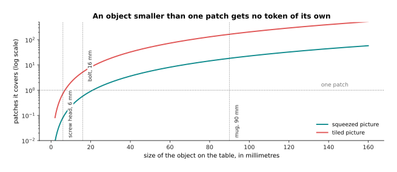

A screw head 6 millimetres across covers 0.082 of a patch on a squeezed picture,
and 0.73 of a patch on a cut-up one.

An object below the dotted line has no token of its own. It only tints a token
that it shares with whatever is around it, so the stream holds no separate
evidence about it.

Printed text is a special case of the same limit, and it has its own rule. A
stroke of a character needs about 3 pixels to be told apart from the gap beside
it. The next picture applies that rule to the two schemes.

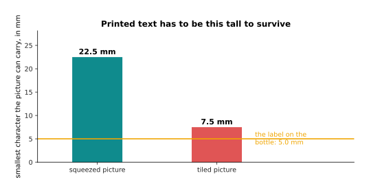

Printed characters have to be 22.5 millimetres tall to survive squeezing, and
7.5 millimetres tall to survive cutting. The characters on the bottle's label
are 5 millimetres tall.

Squeezing divides by 3, so a stroke needs 9 original pixels, and the smallest
readable character is 22.5 millimetres. Cutting brings that down to 7.5
millimetres. The label is below both of those, which is why reading small print
off a part is one of the things these models are worst at.

The third weakness is counting, and it comes from the same grid. The next
picture puts a tray of simulated screws under each grid, and shades in pink
every patch that holds more than one screw.

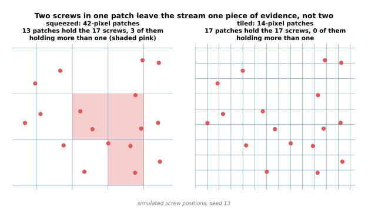

Under the coarse grid, 17 simulated screws fall into only 13 patches, and 3 of
those patches hold more than one screw. Under the fine grid each screw gets a
patch of its own.

That is the mechanism behind the fact that these models count badly. Counting
needs each thing to be countable separately. When several things share one
patch, the row of tokens holds no separate evidence for them, so the model
guesses from a general impression of how crowded the scene is. The guess gets
worse as the objects get smaller and as the count gets higher.

The fourth weakness is the box itself. The next picture shows the same bottle
twice: once with the box a detector returns, and once with the finest box the
patch grid can hold.

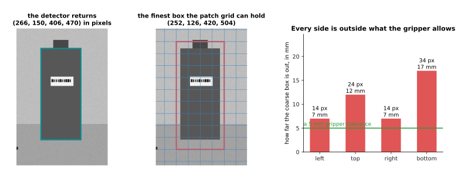

A detector returns the bottle at pixels 266, 150, 406 and 470. The best the
patch grid can hold is 252, 126, 420 and 504, because each side has to be moved
outwards to the nearest patch edge.

The difference between those two boxes is what a gripper has to live with, and
the next picture measures it side by side. The green line is how far out a
gripper of this kind can be and still close on the bottle.

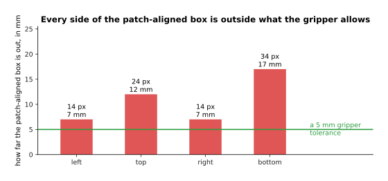

The patch-aligned box is out by 7 millimetres on the left, 12 on the top, 7 on
the right and 17 on the bottom, and every one of those is outside a 5 millimetre
gripper tolerance.

That is why a detector is used alongside a vision-language model, rather than
being replaced by it. [Detection and
segmentation](../09_models-that-see/02_detection-and-segmentation.md) describes
the models that give the exact box and the exact mask. They remain the right
tool for anything that is measured in pixels, counted, or run many times a
second.

---

## 7. What it gives a robot that a detector cannot

All of that makes it fair to ask what the model is for. The answer is the thing
a detector has no way of producing: an answer about the scene in ordinary words,
including about things that no list of class names contains. A class name is one
of the fixed labels a detector was trained on, such as "cup" or "bottle".

The next picture lists the things on one workbench and splits them into two
groups: the ones a detector has a name for, and the ones it does not.

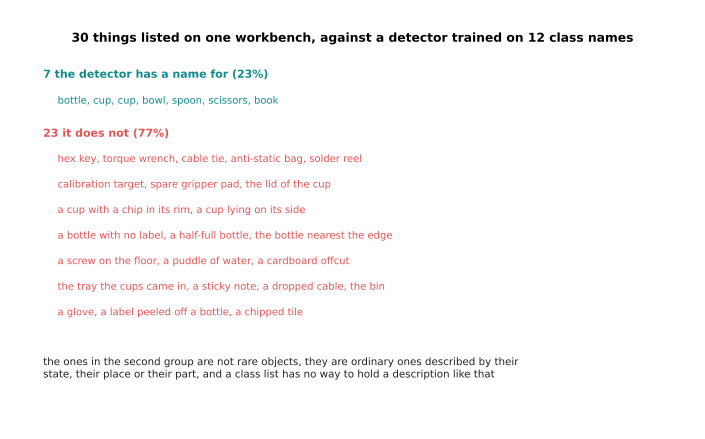

Of 30 things listed on one workbench, a detector trained on 12 class names has a
name for 7 and no name for the other 23, which is 77 per cent.

Read the second group carefully, because the point is not that those things are
unusual. Some of them are objects that nobody put in the class list, such as a
hex key or a cable tie. Some are ordinary objects described by their state, such
as a cup with a chip in its rim, or a bottle with no label. Some are described
by where they are, such as the bottle nearest the edge. A class list has no way
of holding a description of the last two kinds at all. [Open-vocabulary
vision](../09_models-that-see/03_open-vocabulary-vision.md) closes part of the
gap, because it lets you name a class in words at the moment you ask. However,
it still returns a box for a phrase, rather than an answer to a question.

The next table is drawn as a picture. Read it one row at a time: the question is
on the left, what a detector can do with it is in the middle, and what a
vision-language model can do with it is on the right.

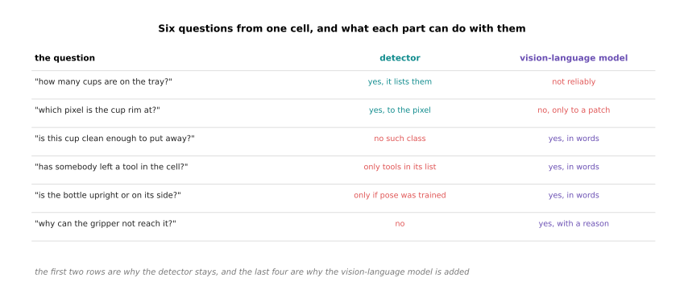

Of six questions that a work cell actually needs answered, the detector answers
2 and the vision-language model answers 4, and the two sets barely overlap.

The first two rows belong to the detector. They ask how many cups are on the
tray, and which pixel the cup rim is at. The last four rows belong to the other
model. They ask whether this cup is clean enough to put away, whether somebody
has left a tool in the cell, whether the bottle is upright or on its side, and
why the gripper cannot reach it. Nobody could write a class list that answers
those four, because each one asks about a state, a relation or a reason, rather
than about the presence of an object.

So the useful arrangement keeps both. The next picture draws the five steps that
arrangement goes through, from the operator's words to a movement in
millimetres.

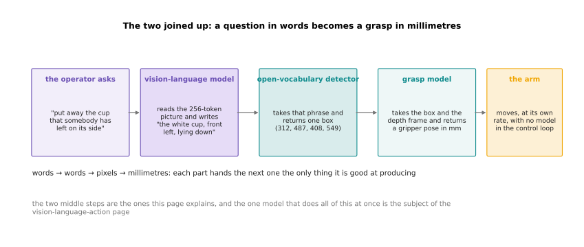

The useful arrangement passes words to words to pixels to millimetres, and each
part hands on the only thing it is good at producing.

The operator asks for the cup that somebody has left on its side. The
vision-language model reads the picture and writes "the white cup, front left,
lying down". An open-vocabulary detector turns that phrase into one box in
pixels. A grasp model turns the box and the depth frame into a gripper position
in millimetres. The arm then moves, with no model anywhere inside its control
loop. That arrangement costs four parts and four places to go wrong. The obvious
alternative is one model that takes the picture and the sentence and writes the
joint commands itself, which is a [vision-language-action
model](../12_models-that-act/03_vision-language-action-models.md). That model is
built out of exactly the construction on this page, with the row of tokens
extended so that some of the tokens the model writes are movements.

---

## 8. Where to read next

- [Reasoning and tool use](04_reasoning-and-tool-use.md) is the next page. It
  explains what happens when the model writes its working out before the answer
  and calls a program to get facts right, and what that costs in time on a
  robot.
- [Detection and segmentation](../09_models-that-see/02_detection-and-segmentation.md)
  is the model that section 6 said stays. It explains how a box and a mask are
  produced to the pixel.
- [Open-vocabulary vision](../09_models-that-see/03_open-vocabulary-vision.md)
  shows how a phrase written by a vision-language model is turned into a region
  of the picture.
- [Vision-language-action models](../12_models-that-act/03_vision-language-action-models.md)
  takes this construction one step further, so that the model writes the arm's
  movements as well as words.
- [Fine-tuning and adapters](../07_pretraining-and-adapting/03_fine-tuning-and-adapters.md)
  explains freezing, unfreezing and catastrophic forgetting properly.
- [Vision-language models in the model catalogue](../../07_learned-models/07_language-models/02_most-used/02_vision-language-models.md)
  lists the real models of this kind, what they cost to run, and where they fail
  on an arm.

---

## 9. Using it in Python

Section 2 worked the projector out by hand, and section 3 counted the tokens a
picture costs. This section builds both in PyTorch, so that you can see that the
construction really is one small layer plus one insertion into a sequence. The
code makes up random numbers in place of a trained backbone and a trained
language model, but the shapes and the counts are the ones this page used.

```python
import torch
from torch import nn

PATCH, SIDE, V_WIDTH, L_WIDTH = 14, 224, 1024, 4096
n_patches = (SIDE // PATCH) ** 2                 # section 1: 16 x 16 patches

# section 2: the projector is one linear layer, nothing more
projector = nn.Linear(V_WIDTH, L_WIDTH)
print(n_patches)                                        # 256
print(sum(p.numel() for p in projector.parameters()))   # 4198400

patch_vectors = torch.randn(1, n_patches, V_WIDTH)      # what a backbone gives
picture_tokens = projector(patch_vectors)               # what the model reads
print(tuple(picture_tokens.shape))                      # (1, 256, 4096)

# section 3: put the picture tokens into the stream where the picture appeared
before = torch.randn(1, 38, L_WIDTH)             # the standing instructions
after = torch.randn(1, 17, L_WIDTH)              # the question in words
stream = torch.cat([before, picture_tokens, after], dim=1)
print(tuple(stream.shape))                       # (1, 311, 4096)

# section 5: cutting a 672 pixel picture into crops of 224, plus a thumbnail
picture = torch.randn(1, 3, 672, 672)
crops = picture.unfold(2, SIDE, SIDE).unfold(3, SIDE, SIDE)
crops = crops.reshape(1, 3, -1, SIDE, SIDE).permute(0, 2, 1, 3, 4)
print(crops.shape[1], (crops.shape[1] + 1) * n_patches)   # 9 2560
```

Every number printed there is one this page quoted. The projector's 4,198,400
parameters come from section 2. The row of 311 tokens before the model writes
anything is section 3's 38 plus 256 plus 17. The 9 crops, with a thumbnail
added, come to section 5's bill of 2,560 tokens. The one line of real work is
`projector(patch_vectors)`, and `unfold` is the ordinary tensor operation that
cuts a picture into tiles.

In a real build you would write none of this yourself. Hugging Face's
`transformers` package ships these models whole, with the three parts already
joined and already trained. It also gives you a processor object, which takes a
picture and a question and produces the row of tokens, with the cutting and the
thumbnail included.

What you still have to decide is everything this page measured. You choose how
much resolution the job needs, which fixes the token bill, and so fixes the cost
and the delay of every call. You choose whether to keep a detector alongside the
model, and section 6 says you should whenever anything is measured in pixels or
counted. If you train the model further, you choose which parts are frozen in
which stage, because section 4 showed that getting that order wrong damages the
reading half in a way that is cheap to avoid and expensive to repair.
