# Reasoning and tool use

The page before this one, [vision-language
models](03_vision-language-models.md), built a model that can look at a camera
picture and answer a question about it in ordinary words. Everything that model
did happened in one pass, because it read the row of tokens once and wrote its
answer straight away. This page is about what you can buy by refusing to do
that. It answers one question: what happens when the model is allowed to spend
more work at the moment somebody asks, rather than more work during training?

There are two things it can spend that work on, and this page takes them in
order. The first is writing its own working out before the answer, which costs
nothing but tokens and time. The second is calling a program, reading what comes
back, and then carrying on. That second one is how a model gets facts and
arithmetic right instead of guessing at them. Repeating the second one with a
goal in mind is what people mean by an agent.

By the end of this page you will know why writing the working out helps, how
much accuracy more thinking buys and where it stops buying any, how a tool call
works step by step, which three things go wrong in that loop and what the plain
answers to them are, and why this whole machinery belongs at the planning level
of a robot and never inside its control loop.

This page is for a reader who has read [large language
models](01_large-language-models.md) and [post-training a language
model](02_post-training-a-language-model.md). So you already know that a model
writes one token at a time, that it can state something false in a confident
tone, and that training it on problems with checkable answers makes it write
longer working out.

The numbers in the pictures come from
`docs/diagrams/language_and_multimodal_2.py`, which prints every one of them.
The accuracy curves, the vote and search curves, the argument checks and the
episode times are simulations of small made-up tasks, and the script states the
seed for each one. They are labelled illustrative because that is what they are.
They show the shape of a trade, and they are not benchmark scores for any model.

## Contents

1. [The working out is tokens, not a separate faculty](#1-the-working-out-is-tokens-not-a-separate-faculty)
2. [What more tokens at answering time buy](#2-what-more-tokens-at-answering-time-buy)
3. [The three shapes of test-time compute](#3-the-three-shapes-of-test-time-compute)
4. [Calling a tool and reading the result](#4-calling-a-tool-and-reading-the-result)
5. [What goes wrong in the loop, and the plain answers](#5-what-goes-wrong-in-the-loop-and-the-plain-answers)
6. [An agent loop, and what it costs](#6-an-agent-loop-and-what-it-costs)
7. [Where this belongs on a robot](#7-where-this-belongs-on-a-robot)
8. [Where to read next](#8-where-to-read-next)
9. [Using it in Python](#9-using-it-in-python)

---

## 1. The working out is tokens, not a separate faculty

**Chain of thought** means letting the model write out the steps of its
reasoning as ordinary tokens before it writes the answer. A token is one small
piece of text, such as a short word or a number. It is worth being direct about
what chain of thought is, because the name suggests something grander. There is
no separate thinking machinery inside the model. The working out is a run of
tokens, and each one is chosen in exactly the way every other token is chosen.

The next picture takes one small question and splits the model's output into
three parts. Under the bar are the lines the model actually writes.

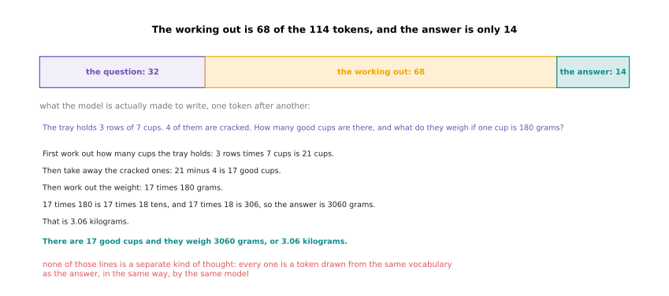

For one small question about a tray of cups, the working out is 68 of the 114
tokens, and the answer is only 14.

Read the lines under the bar in the order the model writes them. First it works
out that 3 rows of 7 cups is 21 cups. Then it takes away the 4 cracked ones to
get 17. Then it says that it needs 17 times 180. Then it splits that into 17
times 18 tens, and works 17 times 18 out as 306. So it gets 3060 grams. Each of
those lines is a small step, and each small step is easier to get right than the
whole thing at once. That is the entire reason the method works.

Those lines are not a special kind of output. The next picture shows the same
model making three ordinary next-token steps over one line of the working out.

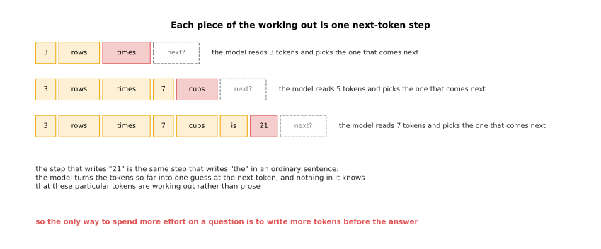

Each piece of the working out is produced by the same next-token step that
produces ordinary prose.

The model reads 3 tokens and picks the one that comes next. Then it reads 5 and
picks again. Then it reads 7 and picks again. The step that writes "21" is the
same step that writes "the" in a sentence. Nothing inside the model knows that
these particular tokens are working out rather than prose. That has one
consequence worth holding on to: the only way for a model to spend more effort
on a question is to write more tokens before the answer.

Writing those tokens does help, and the next picture measures how much in a
simulation. The left panel compares the two extremes. The right panel shows
every point in between.

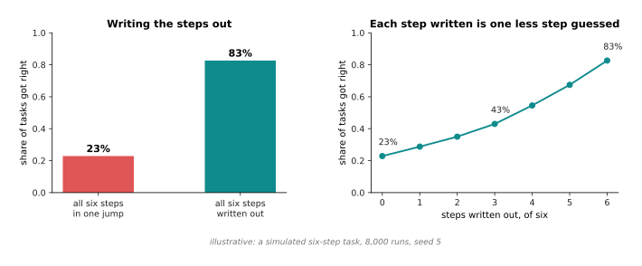

In a simulated six-step task, doing every step in one jump gets 23 per cent of
the tasks right, while writing every step out gets 83 per cent right.

The simulation is a chain of six small steps that all have to be right. A step
the model writes out goes wrong 3 times in 100. A step it does silently goes
wrong 22 times in 100. Those two rates are the made-up part of the simulation.
Everything else is measured, by running the task 8,000 times. The right panel
shows the curve between the two ends, and it passes through 43 per cent at three
steps written. It rises for an unremarkable reason: every step written out is
one less step guessed.

---

## 2. What more tokens at answering time buy

Writing the steps out costs tokens, and tokens cost time, so the natural next
question is what the exchange rate is. Spending work at the moment of the
question, rather than during training, is called **test-time compute**. Test
time is the old name for the moment a trained model is used.

The next picture draws accuracy against the number of tokens written. The solid
part and the dashed part are two different ways of spending those tokens, and
the paragraph below explains both.

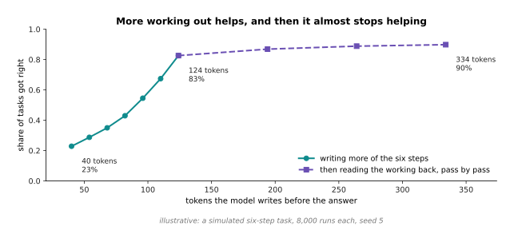

Accuracy on the simulated task climbs from 23 per cent at 40 tokens to 83 per
cent at 124 tokens. After that, another 210 tokens buy only 7 more points.

The solid part of the curve is the model writing more of its six steps, at 14
tokens a step. It runs 40, 54, 68, 82, 96, 110 and 124 tokens, for 23, 29, 35,
43, 55, 67 and 83 per cent. The dashed part is the model reading its own working
back afterwards. Each reading pass costs 70 tokens, and it catches each mistake
already made about three times in ten, while introducing a new mistake about two
times in a hundred. The dashed part runs 194, 264 and 334 tokens, for 87, 89 and
90 per cent. The flattening at the end matters as much as the climb at the
start, because it is what you actually get when you let a model think for longer
and longer.

Tokens are written one after another, so the time an answer takes follows
directly from the token count. The next picture draws that.

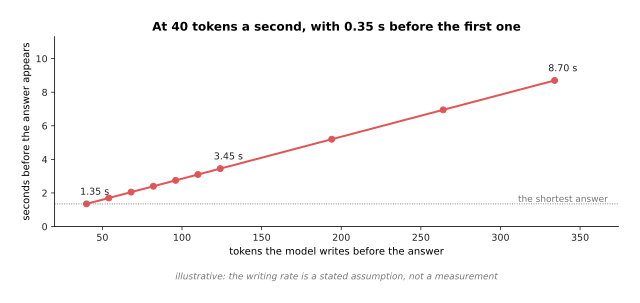

At a writing rate of 40 tokens a second, with 0.35 seconds before the first
token appears, the shortest answer takes 1.35 seconds and the longest takes
8.70.

The time is a straight line because the model writes its tokens one after
another. So the seconds are the token count divided by the rate, plus the fixed
wait at the start. The rate and the wait are stated assumptions rather than
measurements. However, the shape does not depend on them, because whatever the
rate is, eight times the tokens is eight times the writing.

Those two pictures can now be put together, and the result is the picture that
matters when you are deciding how long to let a model think. The left panel
plots accuracy against seconds. The right panel plots the same data as a rate:
how much accuracy each extra second buys.

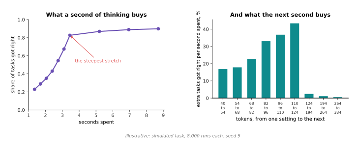

The steepest stretch of the trade runs from 110 to 124 tokens, and it is worth
43 more tasks right per second spent. The last stretch is worth 0.6.

Early seconds are cheap and buy a great deal. Later seconds buy almost nothing.
So the question is never whether to let the model think, but how long to let it.
On a robot that answer is usually set by how long the operator is willing to
wait, rather than by the curve, and section 7 explains why the curve must not be
allowed to set it.

---

## 3. The three shapes of test-time compute

Writing longer working out is only one way of spending more at answering time,
and there are two others in common use. The second way is to answer the same
question several times over and keep the answer that came up most often. That is
called a vote. The third way is to grow several partial answers at once and
throw away the ones that look worst. That is called a search.

The next picture measures the vote. Each point is a number of attempts, and the
height is how often the vote lands on the right answer.

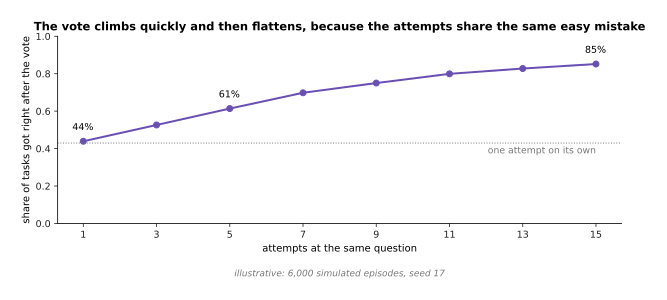

In the simulation, one attempt gets 44 per cent right, three attempts with a
vote get 53 per cent, five get 61 per cent, and fifteen get 85 per cent.

The simulation takes an attempt that is right 43 times in 100. When the attempt
is wrong, it lands on one of six wrong answers. One of those six is the easy
mistake, and it takes 35 of every 100 wrong attempts. The next picture shows
where one attempt lands, and it explains why the vote works at all.

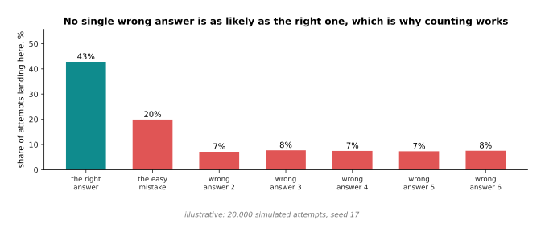

The right answer takes 43 of every 100 attempts. The easy mistake takes 20, and
each of the five other wrong answers takes about 7.

The right answer is the single most likely answer, and the wrong answers are
spread out between six different values. So when you count the attempts, the
right answer wins the count, and it wins it more reliably the more attempts you
take. There is a condition hidden in that sentence, and the next picture makes
it visible by running the same vote with a weaker model.

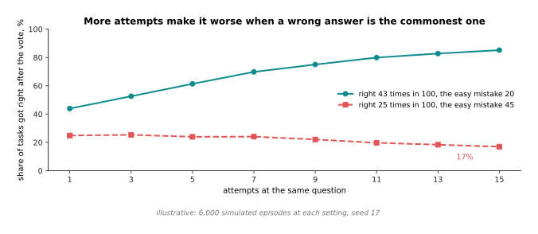

When the right answer takes 25 attempts in 100 and the easy mistake takes 45,
the vote falls from 25 per cent with one attempt to 17 per cent with fifteen.

So voting does not make a model better in general. It only sharpens whichever
answer is already the commonest one. If the easy mistake is commoner than the
right answer, then more attempts make matters worse, and no number of attempts
will help.

The vote also has to be paid for. The next picture shows the bill on the left
and what the bill buys on the right.

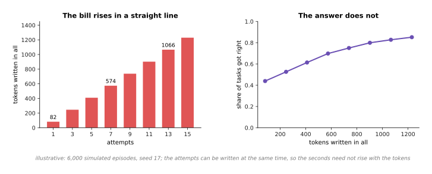

Fifteen attempts cost 1,230 tokens against 82 for one attempt, and they buy 42
more tasks right in every hundred.

The cost of a vote is the plainest cost in this chapter, because every attempt
is paid for in full. One thing softens it. The attempts do not depend on each
other, so they can be written at the same time on different machines. The
seconds therefore need not rise with the number of attempts, even though the
bill does.

The third shape is search, and the next picture draws one run of it. The number
written on each box is the score a judge gave that partial answer.

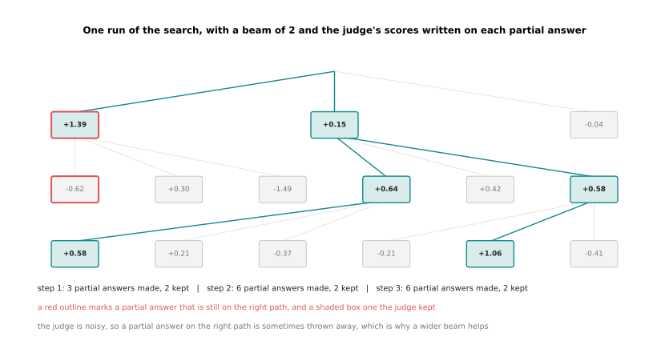

In the search, each step makes three new partial answers from each kept one, a
judge scores them all, and only the best two go forward.

Follow the tree down. One partial answer becomes three. The judge scores each of
the three, and the best two are kept. Those two become six, and so on. The
number of partial answers kept at each step is called the beam width, and it is
2 here. The judge gives a partial answer that is still on the right path a true
score of 1, and every other partial answer a true score of 0. It then adds noise
with a spread of 0.7, and that noise is what makes the judge imperfect. The red
outlines mark the partial answers that really were on the right path. At the
second step the partial answer on the right path scores -0.62, which is low
enough to be thrown away, and after that this run has no way back to the right
answer. A noisy judge throwing away the right path is the main thing that goes
wrong in a search.

A wider beam is the defence against a noisy judge, and the next picture measures
it. The left panel is how often the search finds the right answer, and the right
panel is what that costs.

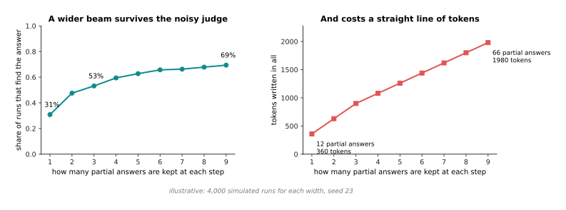

Keeping one partial answer finds the right one 31 times in 100, for 12 partial
answers written. Keeping nine finds it 69 times in 100, for 66 partial answers
written.

A wider beam survives the noisy judge more often, because it has to be unlucky
more times before it loses the right path altogether. The price is a straight
line of tokens. Search is the most expensive of the three shapes, and it is the
only one that needs a judge. So it is reached for last, and usually only when
the answer has clear steps that can be scored on their own.

---

## 4. Calling a tool and reading the result

All three of those shapes make the model work harder at the same thing, which is
guessing. The next idea is different, because it stops the model guessing at
all. A **tool call** is a structured piece of text that the model writes. A
program outside the model recognises that text, runs the thing it names, and
answers by adding the result to the same row of tokens.

The next picture draws one turn of that loop. Read the four stations in order,
starting at the top left.

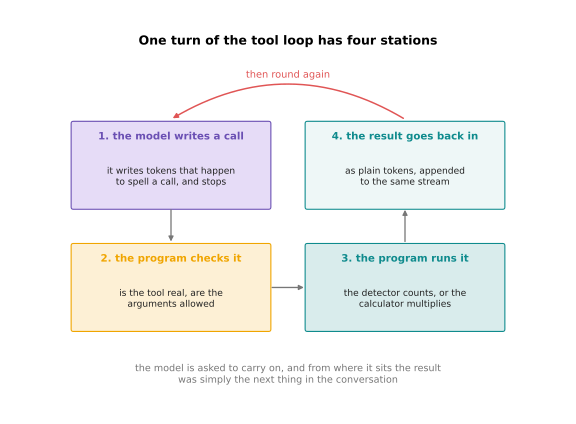

One turn of the loop has four stations, and the question about the cups took
three turns of it.

Go round the loop once. The model writes tokens that happen to spell a call, and
then it stops. The program checks that the call names a real tool and that its
arguments are allowed. The program runs the tool. The result is added to the row
of tokens as plain text. Then the model is asked to continue, and from where the
model sits, the result was simply the next thing in the conversation.

Here are the three turns that the question about the cups actually took. Each
line marked `out` is what the model wrote, and each line marked `back` is what
the program added.

```text
asked: How many good cups are on the tray, and what do they weigh if one cup
       is 180 grams?

turn 1 out:  {"tool": "count_objects", "arguments": {"class": "cup"}}
turn 1 back: {"count": 21}
turn 2 out:  {"tool": "count_objects", "arguments": {"class": "cup",
                                                     "condition": "cracked"}}
turn 2 back: {"count": 4}
turn 3 out:  {"tool": "calculator", "arguments": {"expression": "(21 - 4) * 180"}}
turn 3 back: {"value": 3060}

answer: There are 17 good cups on the tray and they weigh 3060 grams, which is
        3.06 kilograms.
```

The model counted nothing and multiplied nothing. It asked for the count of cups
and got 21 back. It asked for the count of cracked cups and got 4 back. It asked
a calculator for (21 - 4) * 180 and got 3060 back. Because the model did neither
job itself, neither job could come out wrong.

Those turns have a cost, and the next picture counts it. The left panel is what
each part of the loop adds to the row of tokens. The right panel is how long the
row is after each step.

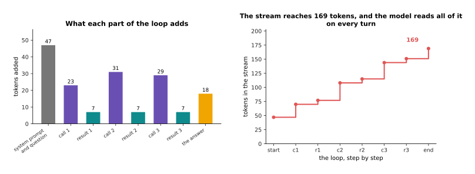

The three turns take the row from 47 tokens to 169, with the calls costing 23,
31 and 29 tokens, and each result costing 7.

The step chart carries the cost that people forget. The results are tiny, but
the row only ever grows, and the model reads the whole of it again on every
turn. So a loop that runs for twenty turns is reading a long row twenty times.
That is why the number of turns is the thing to watch, rather than the size of
any one result. Section 6 measures that reading cost directly.

The reason to pay any of this is accuracy on the jobs a model is bad at. The
next picture compares a model that multiplies by hand with one that calls a
calculator.

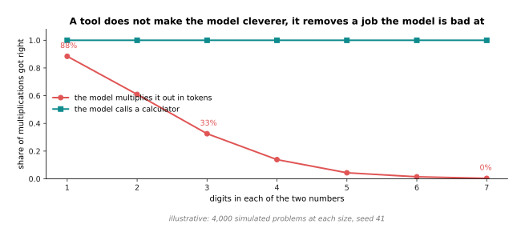

A simulated model multiplying by hand gets 88 per cent of one-digit problems
right, 33 per cent of three-digit ones and 1 per cent of six-digit ones, while a
calculator gets all of them right.

The simulation assumes that the model writes each digit step wrong 6 times in
100, and that a problem of d digits by d digits needs about 2 d squared steps.
So the chance of surviving every step falls fast as the numbers get longer. The
point the picture makes is not that the tool is cleverer, because a calculator
knows nothing. The point is that the job has been taken away from the part of
the system that is bad at it and given to a part that cannot get it wrong.

Turns cost seconds as well as tokens. The next picture breaks one turn into its
four parts on the left, and adds turns up on the right.

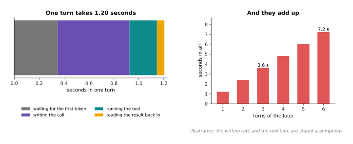

One turn takes 1.20 seconds, made of 0.35 waiting, 0.57 writing the call, 0.22
running the tool and 0.06 reading the result. So three turns take 3.61 seconds
and six turns take 7.23.

The seconds here are stated assumptions rather than measurements. The reason to
look at them anyway is the shape. The fixed wait before the first token is paid
again on every single turn. So the turn count multiplies a cost that has nothing
to do with how much work the tool did. That is the arithmetic behind everything
in section 7.

---

## 5. What goes wrong in the loop, and the plain answers

The loop as described assumes that the model writes a sensible call, that the
tool works, and that the loop ends. None of the three is safe. The answers to
all three are ordinary engineering, and none of them has anything to do with
models.

The first failure is a call that does not make sense. The next picture takes 400
simulated calls and shows how many a plain check throws out, and for which
reason.

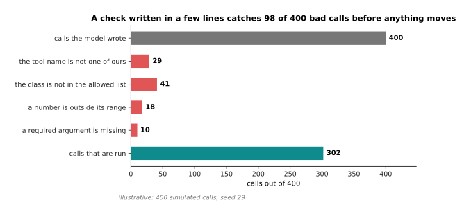

Of 400 simulated calls, 98 are thrown out before anything moves: 29 name a tool
that does not exist, 41 use a class outside the allowed list, 18 put a number
outside its range, and 10 leave out a required argument.

The four rates behind that drawing are made up, and the counts are what the
drawing gave. The lesson does not depend on them. The model writes a call as
text, so it can write anything at all, including a tool you never had and a
class name it invented. The only thing between that text and a moving arm is a
check written against the tool's own written shape. That check is a few lines
long, and it runs before anything happens. When it fails, the right thing to do
is to hand the error back to the model as an ordinary result, because the model
will usually fix the call and try again.

The second failure is a loop that does not end. The next picture counts how many
turns each simulated episode took. The red line marks where a cap of 8 turns
would sit.

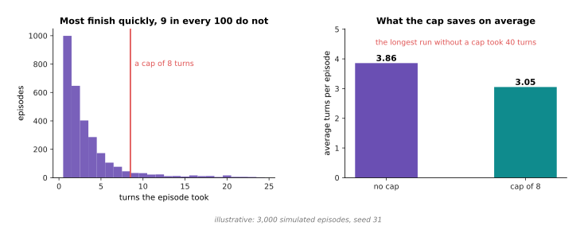

In 3,000 simulated episodes the average is 3.86 turns, 8.8 in every 100 run past
8 turns, and the longest ran to the hard limit of 40.

The simulation finishes a job on any turn with a chance of 35 in 100. However,
on any turn it may also fall into a state where it keeps asking the same thing,
and its chance of finishing then drops to 10 in 100. That is what a stuck loop
looks like from outside. It is not a crash. It is a model asking the same
question again and again in slightly different words, until somebody stops it.
Capping the turns at 8 brings the average down from 3.86 to 3.05. More
importantly, it puts a bound on the worst case instead of leaving it open.

A turn cap is not enough on its own, because a tool can be slow even when the
turn count is small. So the whole episode is given a deadline as well. The next
picture shows how long the simulated episodes took, with three lines marked on
it.

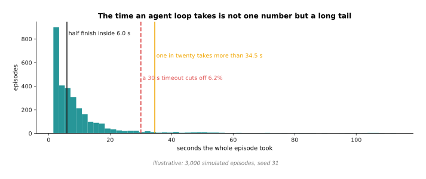

Half the simulated episodes finish inside 6.0 seconds. One in twenty takes more
than 34.5 seconds. The slowest took 112.9 seconds, and a 30 second deadline cuts
off 6.2 per cent of them.

The long tail on the right of that picture is the reason a deadline is needed.
The average episode time of 10.4 seconds describes almost none of the episodes.
So a system sized for the average will be late far more often than it was
designed to be.

The three failures and their three answers are collected in the next picture.
Read it one row at a time: the failure is on the left, what it looks like in
practice is in the middle, and the fix is on the right.

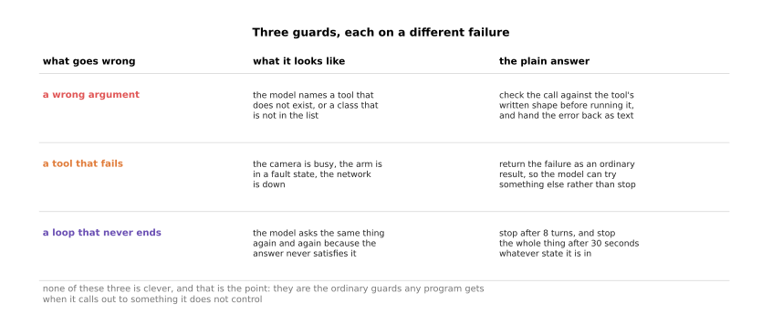

Three guards cover the three failures: check the arguments, return a tool's
failure as an ordinary result, and stop after 8 turns or 30 seconds, whichever
comes first.

None of the three guards is clever, and that is the point. They are exactly the
guards any program gets when it calls out to something it does not control. The
only unusual thing about this case is that the caller is a model that can write
any text at all. That makes the first guard more necessary than usual, rather
than different in kind.

---

## 6. An agent loop, and what it costs

An **agent loop** is the loop of section 4, run with a goal that outlives one
turn. So instead of answering one question, the model keeps going until the goal
is met or a guard stops it. Nothing new is added to the model. Everything that
is added lives in the program around it.

The next picture draws that loop with a real cell job as the goal. Start at the
goal on the left and follow the arrows round.

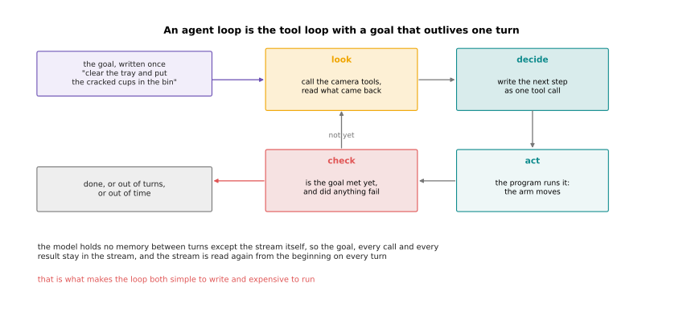

The goal is written once. Then the model looks, decides on one tool call, the
program acts, and the result is checked against the goal.

The one thing to understand about this loop is that the model has no memory
between turns except the row of tokens itself. So the goal, every call it has
made, and every result it has read all stay in that row, and the whole row is
read again from the beginning on every turn. That is what makes the loop simple
to write, because there is no state to manage. It is also what makes it
expensive to run, and the next picture measures that expense.

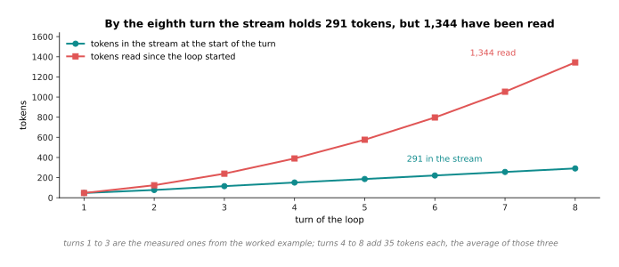

By the eighth turn the row holds 291 tokens, but 1,344 tokens have been read.

The first three turns in that picture are the measured ones from the worked
example in section 4. Turns 4 to 8 add 35 tokens each, which is the average of
those three, and that average is a stated assumption. The row itself grows in a
straight line, because each turn adds about the same amount. The reading grows
much faster than that, because turn eight reads everything that turns one to
seven wrote. This is why the turn count matters more than the size of any one
result.

Seconds behave the same way. The next picture takes one simulated episode of
five turns and breaks each turn into its parts.

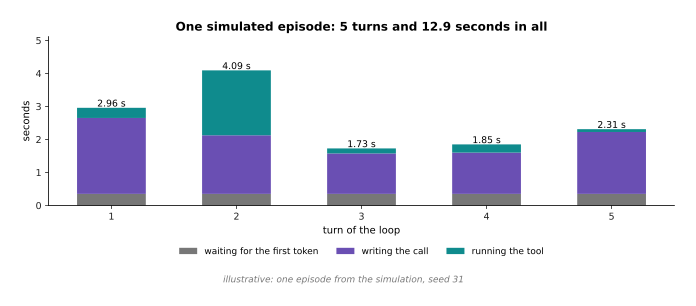

One simulated episode of five turns takes 12.93 seconds, and the longest single
turn takes 4.09 of them.

Look at where the seconds go in each bar. The grey part at the bottom of every
turn is the fixed wait before the first token. It is paid five times in this
episode, and it would be paid twenty times in a longer one. The tool time varies
a great deal between turns, because some tools answer at once and some do real
work. That variation is what the next picture is about.

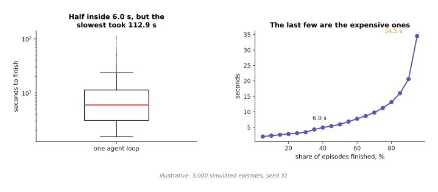

Half the episodes finish inside 6.0 seconds. One in twenty takes over 34.5
seconds. The slowest takes 112.9 seconds, which is 19 times the middle.

That spread is the real cost of an agent loop, and it is a worse problem than
the average time. A part of a system that usually takes 6 seconds and
occasionally takes 113 seconds cannot be given a job that anything else is
waiting on. The one exception is when whatever waits can carry on safely without
it. Section 7 turns that sentence into a line drawn through a robot.

---

## 7. Where this belongs on a robot

Everything on this page costs seconds, and a robot arm is run by a loop that
costs milliseconds. So the two cannot be the same loop. This section says
exactly where the line between them sits.

The next picture puts one agent turn and two faster loops on the same time axis,
so that the three can be compared directly.

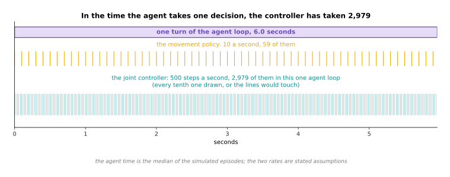

In the median simulated agent loop of 6.0 seconds, a 500 hertz joint controller
runs 2,979 times and a 10 hertz movement policy runs 59 times.

Hertz is the ordinary unit for how many times a second something happens. So 500
hertz means the controller reads the encoders, works out the next current, and
writes it, 500 times a second. An encoder is the sensor that measures where a
joint actually is. Put all three on one axis and the question answers itself.
The controller has taken nearly three thousand decisions in the time the agent
took one, and no arm can stand still for 6 seconds waiting to be told what to do
next.

The next picture widens that comparison to six parts of a robot. The axis is
logarithmic, which means each step along it multiplies the time by ten, so that
2 milliseconds and 6 seconds fit on one picture.

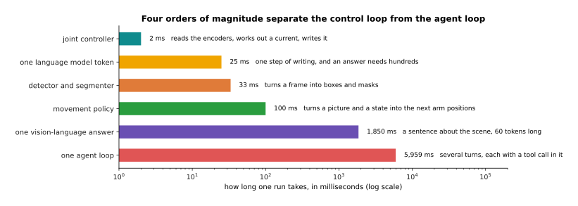

One run takes 2 milliseconds for the joint controller, 25 for one model token,
33 for the detector, 100 for the movement policy, 1,850 for one vision-language
answer and 5,959 for one agent loop.

The slowest thing on that ladder takes about three thousand times as long as the
fastest. The three fastest rungs are things a robot can put inside a loop that
keeps the arm moving. The three slowest are things it cannot. There is a clear
gap between the two groups, rather than a gradual slope.

The next picture explains that gap by zooming into one control cycle. The left
bar divides those 2 milliseconds into the four jobs they have to cover. The
right bars put the same 2 milliseconds beside two things the model does.

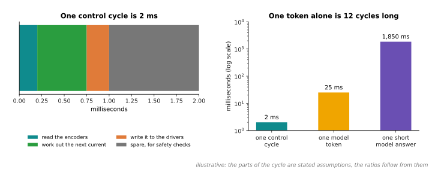

One control cycle is 2 milliseconds. One model token is 25 milliseconds, which
is 12 cycles. One short answer of 60 tokens is 1,850 milliseconds, or 925
cycles.

Read the left bar as a budget that has to balance on every single cycle: a fifth
of a millisecond to read the encoders, a little over half a millisecond to work
out the next current, a quarter of a millisecond to write it to the drivers, and
one millisecond spare for safety checks. Now set one model token beside that. A
single token takes twelve whole cycles, so the model cannot produce even one
token inside a cycle. That settles the matter. This machinery is not slow for a
control loop. It is in a different world from one.

The next picture draws the line that follows from this, with the slow parts
above it and the fast parts below it.

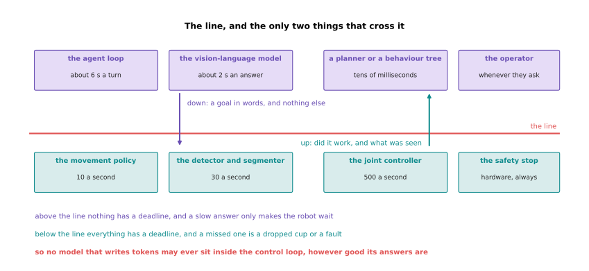

Above the line sit the agent loop at about 6 seconds a turn, the vision-language
model at about 2 seconds an answer, a planner at tens of milliseconds, and the
operator. Below it sit the movement policy at 10 runs a second, the detector at
30, the joint controller at 500, and the hardware safety stop.

Only two things cross that line. Going down is a goal in words, such as which
object to pick or which tray to clear, and nothing else. Coming up is a report
of whether it worked and what was seen. Above the line nothing has a deadline,
so a slow answer only makes the robot wait, with the arm held still or parked.
Below the line everything has a deadline, and a missed deadline is a dropped cup
or a fault. That is why no model that writes tokens may ever sit inside the
control loop, however good its answers are. It is also why the policies in
[models that act](../12_models-that-act/03_vision-language-action-models.md) are
built to run at a fixed rate with no loop around them.

---

## 8. Where to read next

- [Recipes for models that see and
  understand](../13_starting-your-own-model/04_recipes-for-models-that-see-and-understand.md)
  covers the language and vision-language jobs in its last two sections. It says
  when the answer is a prompt, when it is retrieval, and when it is neither.
- [Reinforcement learning](../11_learning-from-outcomes/01_reinforcement-learning.md)
  is the next page. It explains learning by trying something and seeing how it
  turned out, which is where the training behind long working out comes from.
- [Rewards, preferences and verifiers](../11_learning-from-outcomes/02_rewards-preferences-and-verifiers.md)
  explains where the checkable answer comes from that makes a reasoning model
  worth training in the first place.
- [Post-training a language model](02_post-training-a-language-model.md) is
  worth rereading once you have seen section 1, because it explains the training
  that makes a model write its working out without being asked.
- [Vision-language-action models](../12_models-that-act/03_vision-language-action-models.md)
  is what sits below the line in section 7, and it runs at a fixed rate with no
  loop around it.
- [Running and evaluating a model](../14_using-a-model-for-real/01_running-and-evaluating-a-model.md)
  takes the time budget of section 7 seriously, and shows how it is measured on
  a real machine.
- [Language models as planners](../../07_learned-models/07_language-models/03_also-used/01_language-models-as-planners.md)
  is the catalogue page for this machinery on an arm, with the real models and
  what they cost.

---

## 9. Using it in Python

Sections 4 and 5 described the loop and its three guards. No library hides that
loop from you, because the program that runs the tools is yours. So this code is
the loop itself, with a stand-in model that writes the three calls from section
4, and it prints the token counts this page quoted.

```python
import json, re, time

TOOLS = {"count_objects": {"class": ["cup", "bottle", "tray"]},
         "calculator": {"expression": str}}          # section 5: the written shape
MAX_TURNS, TIMEOUT = 8, 30.0                         # section 5: the two stops

def toks(text):                                      # section 4: a rough token count
    return len(re.findall(r"[A-Za-z0-9_.]+|[^\sA-Za-z0-9_]", text))

def run_tool(name, args):                            # section 4: station 3
    if name == "count_objects":
        return {"count": 4 if args.get("condition") == "cracked" else 21}
    return {"value": eval(args["expression"], {"__builtins__": {}})}

SCRIPT = ['{"tool": "count_objects", "arguments": {"class": "cup"}}',
          '{"tool": "count_objects", "arguments": {"class": "cup", "condition": "cracked"}}',
          '{"tool": "calculator", "arguments": {"expression": "(21 - 4) * 180"}}']

stream = ("You may call count_objects(class, condition) and calculator(expression). "
          "Write one call at a time and wait for its result. "
          "How many good cups are on the tray, and what do they weigh if one cup "
          "is 180 grams?")
total, started = toks(stream), time.monotonic()
for turn in range(MAX_TURNS):                        # section 6: the loop
    if turn >= len(SCRIPT) or time.monotonic() - started > TIMEOUT:
        break
    call = SCRIPT[turn]
    total += toks(call)
    asked = json.loads(call)
    if asked["tool"] not in TOOLS:                   # section 5: guard one
        result = {"error": "no such tool"}
    else:
        result = run_tool(asked["tool"], asked["arguments"])
    back = json.dumps(result, separators=(", ", ": "))
    total += toks(back)
    print(turn + 1, toks(call), back, toks(back), total)

total += toks("There are 17 good cups on the tray and they weigh 3060 grams, "
              "which is 3.06 kilograms.")
print("tokens in the whole stream:", total)          # 169
```

Running that prints 23 and 7 on the first turn, 31 and 7 on the second, 29 and 7
on the third, and 169 at the end, which are section 4's counts. The calculator
really does work (21 - 4) * 180 out and get 3060, which is the number the model
in the picture quotes.

What a library gives you is the part this code stands in for. Hugging Face's
`transformers` package takes a list of tool descriptions and a conversation, and
writes them into the exact format a given model was trained to read, through
`apply_chat_template`. It also parses the model's reply back into a tool name
and a dictionary of arguments. Hosted models do the same thing behind their own
interfaces. None of them runs your tools, keeps your row of tokens, or stops
your loop.

What you still have to decide is every number in sections 5 and 7. You choose
how many turns and how many seconds the loop may have, and section 5 showed that
the tail is long enough that both are needed. You choose what the arguments are
allowed to be, which is the cheapest safety you will ever write. You choose
which side of section 7's line each part of your robot sits on, which is the
decision that makes everything else either safe or impossible.
