# Reinforcement learning: learning by trying

The page before this one, [reasoning and tool use](../10_language-and-multimodal-models/04_reasoning-and-tool-use.md),
ended a long run of pages about models that are trained by being shown the right
answer. In every one of those methods, a person had to write the right answer down
first. This page is about the opposite situation. Sometimes nobody knows the right
answer in advance, but anybody can look at what happened afterwards and say
whether it went well.

That situation is common on a robot arm. Nobody can write down the joint angles
that pick up a particular mug, because the correct angles depend on where the mug
stands and on how the fingers touch it. After the attempt, however, it is easy to
say whether the mug is in the gripper. **Reinforcement learning** is learning from
that kind of judgement, made after the event rather than before it. The learner
tries something. Then one number comes back that says how good the result was.
Over many tries the learner changes what it does, so that the number becomes
larger.

This page explains the parts of that idea on one small example. After that it
explains the three things that make reinforcement learning hard. The first is that
the learner has to try actions it does not believe in. The second is that each
improvement has to be small, so that it does not destroy the behaviour that
already works. The third is that the number of tries needed is far larger than a
real arm can survive. By the end you will know the words that every text on this
subject uses, you will have seen a policy learned from nothing at all, and
you will know why this work is almost always done in a simulator. The page assumes
you have read [gradient descent](../03_how-training-works/02_gradient-descent.md)
and [the words everyone uses](../01_what-learning-means/02_the-words-everyone-uses.md).

The world in every picture is invented rather than measured from a real arm, and
the program `docs/diagrams/learning_from_outcomes.py` works out every number
shown. The learning is real. The policies are learned from nothing by tabular
Q-learning and by a clipped policy-gradient step, both written in NumPy, and both
are checked against exact answers from value iteration.

## Contents

1. [The pieces: state, action, reward, episode and return](#1-the-pieces-state-action-reward-episode-and-return)
2. [The policy and the value function](#2-the-policy-and-the-value-function)
3. [Learning the whole thing from nothing](#3-learning-the-whole-thing-from-nothing)
4. [Exploring against taking the best answer you know](#4-exploring-against-taking-the-best-answer-you-know)
5. [Whose attempts you learn from, and how big a step to take](#5-whose-attempts-you-learn-from-and-how-big-a-step-to-take)
6. [Why this happens in a simulator, and what the crossing costs](#6-why-this-happens-in-a-simulator-and-what-the-crossing-costs)
7. [Where to read next](#7-where-to-read-next)
8. [Using it in Python](#8-using-it-in-python)

---

## 1. The pieces: state, action, reward, episode and return

Reinforcement learning has no right answers to copy, so it needs a different set
of words from the rest of this book. This section introduces those words on one
example that is small enough to draw in full.

The example is a table top of five squares by five. A gripper stands on the table
and moves one square at a time. One block lies on the table. A bin stands in the
far corner, and the block should be placed in that bin. A tray stands near the block,
and somebody has decided that the tray also counts as a place to put things. The
picture below shows the four squares that matter.


The gripper can do seven different things, and the table below lists all of them.
Read the first column as the name of the action, the second column as the reward
that arrives immediately after it, and the third column as what the action changes
in the world. Every action costs a little, so a gripper that does nothing useful
loses reward.

| action | reward | what it does |
| --- | --- | --- |
| up, down, left, right | −0.10 | move one square; a wall leaves the gripper where it was |
| close | −0.15 | shut the fingers; this picks the block up if the gripper stands on it |
| open | −0.15 | let go; the bin then pays 10, the tray pays 2, and any other square costs 1 more because the block falls |
| wait | −0.10 | hold the pose and change nothing |

The attempt stops as soon as the block is put down on the bin or on the tray. It
also stops after 80 actions, whichever happens first.

The first word is the state. The **state** is everything the learner can see at one
moment. In this example the state is the square the gripper stands on, together
with whether the gripper holds the block. There are 25 squares and two values of
"holding", so there are 50 states in all. On a real arm the state is the joint
angles, the gripper opening and a camera picture instead.

Each of those 50 states is given a number, so that the learner can use the number
as an index into a table. The next picture shows every state number. The two
halves of the picture show the same 25 squares, once for an empty gripper and once
while the block is held.

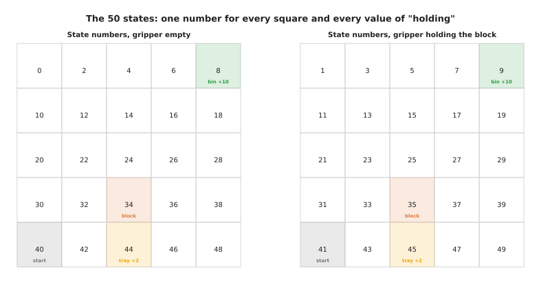

The second word is the action. An **action** is one of the things the learner can
choose to do. Here there are seven actions, which are the four moves, closing the
gripper, opening it, and waiting. Choosing an action changes the state, and the
picture below shows what each of the seven actions does from one particular state.
That state is number 34, which means the gripper stands on the block's square with
nothing in its fingers.


Closing the gripper on the block moves the learner from state 34 to state 35,
because 34 and 35 are the same square with a different value of "holding".

The third word is the reward. A **reward** is a single number that arrives after
each action and says how good the result was. A reward is not advice, because it
never says what should have been done instead. That is what makes this different
from the earlier chapters of this book, where every example came with its correct
answer attached. In this world every action costs 0.10, a gripper command costs
another 0.05, and the bin pays 10. The action that finishes the job is therefore
worth 10 minus 0.15, which is 9.85.

The next picture shows one whole attempt. The left side draws the route the gripper
took, and the right side draws the reward that came back after each of its ten
actions. Both sides describe the same attempt.


The best attempt takes ten actions. Nine of them cost a little and one pays 9.85,
so the whole attempt collects 8.90.

The fourth word is the episode. An **episode** is one whole attempt. An episode
ends here when the block is put down, or when 80 actions have been used. The fifth
word is the return. The **return** of an episode is the total of all the rewards
collected during it. The picture below shows three real attempts and the return of
each.


One more piece of the idea is less obvious. A reward that arrives later usually
counts for less than the same reward arriving now. How much less is set by the
**discount factor**, which is written as the Greek letter gamma. A reward one step
away is multiplied by gamma. A reward two steps away is multiplied by gamma twice,
and so on. The total worked out in that way is called the discounted return. The
picture below shows the weight itself for four values of gamma.

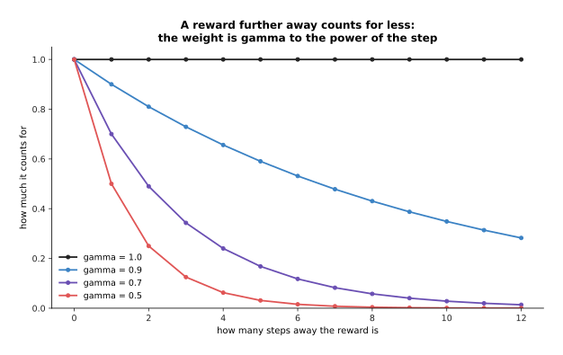

There are two reasons for discounting. The first is that a robot which finishes
sooner is worth more than one which finishes later. The second is that without the
weight the sums in section 2 would grow without limit. The next picture applies the
weight to the ten rewards of the attempt above, so you can see what it does to a
real route.

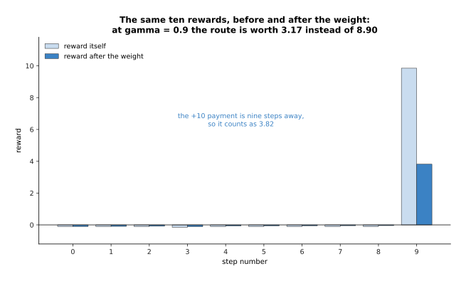

The payment at the bin is nine steps away from the start of the attempt, so at a
gamma of 0.9 it counts as 3.82 rather than 9.85. The whole route is then worth 3.17
rather than 8.90.

Discounting does more than make the numbers smaller. It can change which behaviour
is best. The bin pays five times what the tray pays, but the route to the bin is
four actions longer than the route to the tray. The picture below compares the two
routes at four values of gamma.

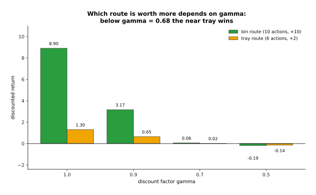

At a gamma of 0.9 the bin route is worth 3.17 and the tray route is worth 0.65. At
a gamma of 0.5 the bin route is worth minus 0.19 and the tray route is worth minus
0.14, so the tray has become the better choice. The two routes are worth exactly
the same at a gamma of 0.68. Below that value the four extra actions cost more than
the extra payment is worth. Choosing gamma is therefore part of saying what you
want, rather than a small technical detail. Values from 0.95 to 0.99 are usual, and
everything below this point uses 0.95.

---

## 2. The policy and the value function

The words above describe the problem. The two words in this section describe what a
reinforcement learner actually builds and keeps.

The first is the policy. A **policy** chooses the action. It takes a state and
gives back a chance for each of the available actions. On a real robot the policy
is a neural network whose input is the camera picture and the joint angles, and
whose output is the next movement. In this small world the policy is a table with
50 rows and seven columns. The picture below shows three rows of that table, drawn
as bar charts, before and after training.


Before training every action has the same chance, which is one in seven, or about
0.14. After training one action in each of those states holds a chance of 0.91,
and the remaining 0.09 is shared between the other six so that the learner keeps
trying them occasionally.

The second word is the value function. A **value function** takes a state and gives
back one number. That number is the discounted return the learner expects to
collect from that state onwards, if it keeps following its current policy. A value
is a prediction rather than a payment. A reward says what just happened, and a
value says what the future is worth from here. The picture below writes the exact
value into every square.


The start square is worth 5.43. The block's square is worth 6.66 with an empty
gripper. The bin's square is worth 9.85 once the block is held, because opening the
gripper there collects the payment immediately.

The policy and the value function are tied together. Once you know what every state
is worth, choosing an action becomes easy, because you take the action that leads
to the most valuable state. That is why the arrows in the next picture always point
towards larger numbers.


Every arrow leads towards the block while the gripper is empty, and towards the bin
while the block is held. The letter C marks the squares where the policy closes the
gripper, and the letter O marks the squares where it opens it.

The difference between the two is worth stating plainly. The policy answers the
question "what do I do now", and the policy is the part that runs on the robot. The
value function answers the question "how well will this go from here", and it
exists in order to make the policy better. It can do that because the gap between
what it predicted and what really happened is the signal that training uses. Some
methods learn both of them, some learn only a policy, and some learn only a value
function and then read the policy off it. Section 3 does the last of those three.

Because a value is a prediction, you can check it. You run the policy from a state,
add up the discounted rewards it really collects, and compare that total with the
prediction. The picture below does exactly that for all 50 states, early in
training and at the end.


After 600 attempts the prediction is wrong by 0.16 on average over the 50 states.
After 6,000 attempts it is wrong by 0.003, which the picture rounds to 0.00, so every
point lies on the line.

---

## 3. Learning the whole thing from nothing

Sections 1 and 2 said what gets learned. This section shows it being learned,
starting from a table of zeros and using nothing except the rewards that come back.

The method is called Q-learning. It keeps one number for every pair of a state and
an action. That number means the value of taking that action in that state and then
behaving well for the rest of the attempt. There are 50 states and seven actions,
so there are 350 numbers, and all of them start at zero. After every action the
learner changes one of those numbers. It moves the number for the action it just
took a little way towards the reward it just received, plus the value of the best
action in the state it has just arrived in. That one rule is the whole method.

The picture below follows a single one of those 350 numbers. It is the number for
state 35, which is the block's square with the block held, and the action "up".

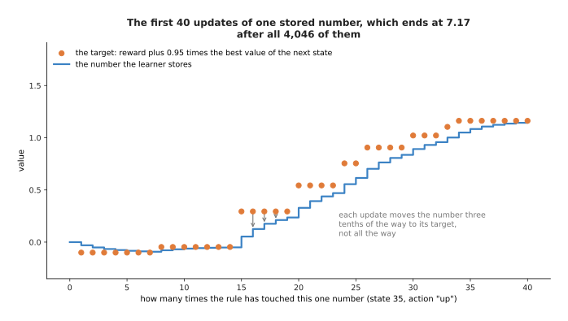

The first time the rule touched that number, the number held 0.000, it aimed at
minus 0.100, and it became minus 0.030. The number moves only three tenths of the
way towards its target each time. That fraction is the learning rate, and it is the
same idea as the step size in
[gradient descent](../03_how-training-works/02_gradient-descent.md). It is why the
climb is gradual even once the target is correct. The rule touches this one number
4,046 times during the run, and the number ends at 7.17, which is the exact
answer.

Running that rule for 6,000 attempts is enough to learn the job. The picture below
shows the reward collected in each attempt over the whole run.


The average reward rises from minus 9.09 over the first hundred attempts to 8.78
over the last hundred. The same run is drawn again below, measured by how often the
block really reached the bin rather than by the reward.

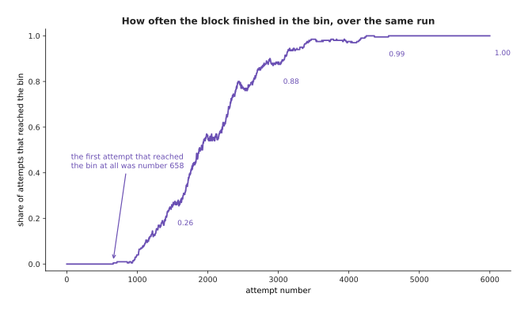

That curve has the shape that nearly every reinforcement learning run has. Nothing
happens for a long time, and in this run the first attempt that reached the bin was
attempt number 658. Then the curve climbs quickly, because each success tells the
learner that a whole chain of earlier states was worth more than it thought. After
that the curve flattens, because there is nothing left to improve.

The policy at the start and the policy at the end are easy to compare, because both
of them fit on the grid. The picture below draws the chosen action in every square,
before training and after it.


Before training every one of the 350 numbers is zero. All seven actions therefore
look equally good, and the learner takes whichever action comes first in the list,
which is "up". That is why the untrained grid is covered in identical arrows.

The learned values change in the same way. The picture below shows the learned value
of every square with an empty gripper, at three points during the run.


The start square goes from 0 to 0.94 after 600 attempts, and then to 5.43, which is
the exact answer.

What happens underneath is that the value travels backwards from the bin. The bin's
own square learns its value first. Then the square beside it learns from that one,
and so on, until the start square knows what it is worth. The picture below shows
that happening in the attempts just after the first success, by grouping the
squares according to how far they are from the bin.


After 660 attempts only the bin's own square has learned anything from that first
success, and it holds 2.95. After 800 attempts the bin square holds 5.02 and the
squares one step away hold 2.37, so the knowledge has moved one square backwards.
After 1,000 attempts it has reached four squares back. After 1,500 attempts the
whole line sits on the exact answer. The flat level of about 1.4 at the right of the
two earliest lines is not noise. It is what the learner had already worked out about
the tray, which it had been reaching for hundreds of attempts.

One state is worth looking at on its own, because it shows that the learner has
really learned rather than been lucky. The picture below gives the learned value of
all seven actions in state 35, which is the block's square with the block held.


The learner values "up" and "right" at 7.17, "wait" at 6.71 and "open" at 5.18, and
every one of those is exactly right. "Up" and "right" are worth the same, which is
correct, because the bin is three squares up and two squares to the right, so
either move makes the same amount of progress. Opening the gripper is worth the
least, which is also correct, because the block would land on an ordinary square
and would have to be picked up again. Nobody told the learner either of those two
things.

---

## 4. Exploring against taking the best answer you know

Section 3 used one setting without discussing it. That setting decides whether the
whole method works at all.

A learner that always takes the action it currently believes is best never finds
out about anything better. A learner that always acts at random finds out about
everything, and collects almost no reward while doing so. Choosing between those
two behaviours is the trade-off between **exploring**, which means taking an action
in order to find out what it does, and **exploiting**, which means taking the action
you already believe is best. The usual way to settle the trade-off is to take a
random action with some small chance, and the currently best action the rest of the
time.

The picture below compares two sets of runs. In the first set the learner never
explores. In the second set it explores on 70 attempts out of every 100.


The learner that never explores reaches the value of the tray route within about
300 attempts and then stops improving. The exploring learner stays near minus 3 for
the whole run, because 70 out of every 100 of its actions are random and random
actions are expensive. That line does not say how good its policy is. It says how
much reward was collected while the policy was being found, and those are two
different measurements. The next picture puts both of them side by side.

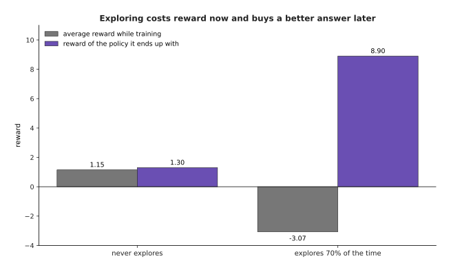

The learner that never explores collects 1.15 on average while training, against
minus 3.07 for the exploring learner, so it wins on that measurement. Its finished
policy collects 1.30, against 8.90 for the exploring learner, so it loses heavily
on the measurement that matters at the end. The exploring learner finishes nearly
seven times better.

The reason is visible in the routes the two finished policies take.


The learner that never explores chooses the tray and never finds the bin, and
the bin pays five times as much. The failure here is not bad learning, because its
policy is the best possible route to the tray. The failure is that it never saw the
bin, so the bin was never part of the problem it was solving. This is the most
common way that a reinforcement learning run fails.

Finding the bin at all is the whole difficulty. The picture below counts how many of
eight runs of each kind finished with a policy that goes to the bin.

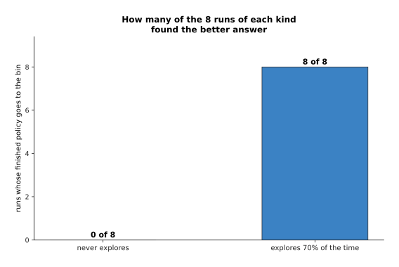

None of the eight runs that never explore ever reached the bin, and all eight of the
exploring runs did. When they first reached it varied a great deal, as the next
picture shows.


The exploring runs found the bin for the first time somewhere between attempt 26 and
attempt 4,468. The runs that never explore never found it at all, so their line
stays at zero.

How much exploring to do is not a choice between two options. It is a number
between 0 and 1, and the picture below tries seven values of it.


Raising the exploring rate from 0.00 to 0.80 lifts the finished policy from 1.30 to
8.90, and drops the reward collected while training from 1.01 to minus 7.30. The
grey line does not fall steadily. A little exploring costs almost nothing here, and
at a rate of 0.40 it even collects more than no exploring at all, because it finds
the bin. Only a lot of exploring is expensive.

In this world more exploring is always better for the finished policy, because
random wandering sooner or later arrives at the bin. That is not true in general. In
a world with a thousand states, random wandering finds nothing useful, and the
answer is then to explore in a cleverer way or to start from demonstrations given by
a person. What is true in general is the shape of the grey line, because exploring
is paid for out of the reward collected while training. On a real arm that payment
means broken parts and operator time.

---

## 5. Whose attempts you learn from, and how big a step to take

Section 4 was about which attempts get made. This section is about two further
questions. The first is whether a learner may use attempts that some other policy
made. The second is how far a learner may change itself after reading those
attempts.

A method is **off-policy** when it can learn from attempts made by any policy at
all. That includes older versions of itself, and a person driving the arm by hand.
Q-learning is off-policy, because its rule asks what the best action in the next
state is worth, rather than what the policy that collected the attempt actually
did. Any attempt can therefore be stored and used again later. The picture below
shows that happening. The table starts empty, and the only input is 1,500 attempts
made earlier by a policy that acted completely at random.


Only two of those 1,500 random attempts ever reached the bin. After one pass over
the stored attempts the table gives a policy worth minus 8.00. After five passes it
is worth 1.18, which is about the value of the tray. After six passes it reaches
8.90, which is the best possible, and further passes change nothing. The route it
finds is as short as the one section 3 learned by trying, although it turns upward
one column later.

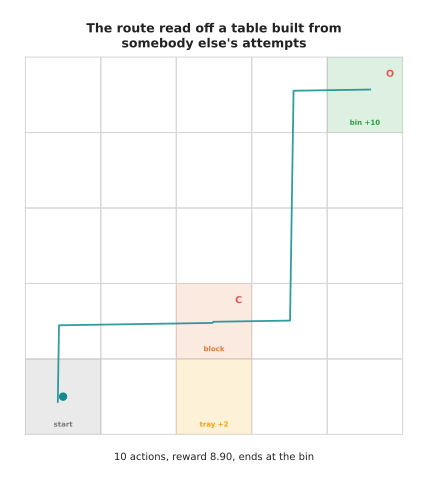

A method is **on-policy** when it can only learn from attempts made by the policy
it is currently improving. Policy-gradient methods are on-policy. A policy-gradient
method changes the policy's numbers directly, in order to make good actions more
likely. The size of the change it asks for depends on how likely the policy was to
take that action at the time the attempt was made. Once the policy has moved, the
stored attempts describe a policy that no longer exists, so they are no longer
usable. Handing a policy-gradient method the same stored attempts shows the
difference plainly.


Given 1,500 attempts from the same random policy, the policy-gradient method moves
the policy from minus 9.49 to minus 9.01 over 80 passes. Q-learning reached 8.90 on
that very same data.

Why would anybody use an on-policy method at all? The answer is that it works
directly on the policy, so it can handle actions that are real numbers rather than
a short list of choices. An arm needs exactly that, because a joint command is a
real number. The price is that every improvement needs fresh attempts, and fresh
attempts are the expensive part.

**Proximal policy optimisation**, usually shortened to PPO, is built to reduce that
price. It is the most widely used policy-gradient method. It works in two parts.
The first part is to collect a batch of attempts and then improve the policy on
that batch several times over, rather than once. The picture below shows what that
buys.

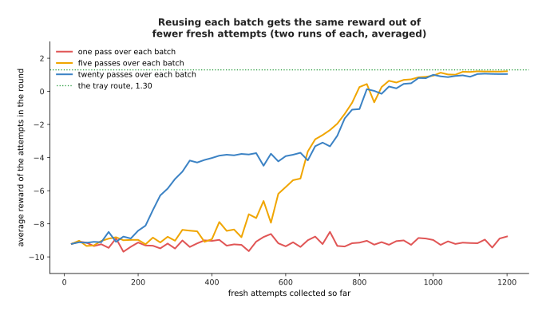

One pass over each batch collects minus 9.11 after 1,200 fresh attempts, which
means it has learned nothing at all in that time. Five passes over each batch begin
to improve after about 600 attempts. Twenty passes begin to improve after about 200
attempts and arrive at the same place sooner. That is the whole point, because
fresh attempts are what a real arm charges you for.

The second part of PPO is a limit, and the limit is needed because of the first
part. Improving the policy repeatedly on one batch pushes the policy further and
further from the policy that collected it, and the batch then describes something
that no longer exists. So PPO refuses to let any action's chance move more than a
fixed fraction away from what it was when the batch was collected. It does that by
paying the update nothing for a change beyond that band.


The two panels are the same payment rule, drawn once for an action that turned out
better than expected and once for an action that turned out worse. Raising a good
action's chance beyond 1.2 times its old value earns nothing extra, so the update
stops pushing in that direction.

Take the limit away and the result is a collapse rather than a slow decline. One
large step can push an action's chance all the way to certainty, and a policy that
only ever takes one action collects no information about any other action.


With the limit in place the reward over the last ten rounds averages 0.73, and the
best it reaches on the way is 1.05. Without the limit the best it reaches is 1.20
and the reward over the last ten rounds is minus 7.58. Both learners here choose
the near tray rather than the bin, for the reason section 4 gave, so the comparison
to make is between the two lines rather than against 8.90.

The cause of the collapse is visible in how far the policy moves in one round.

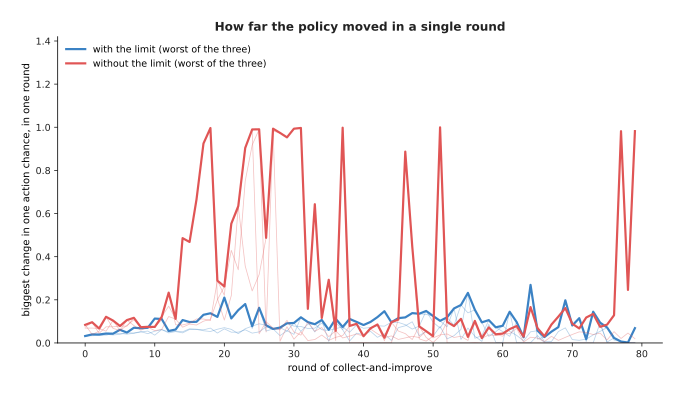

With the limit, no action's chance moves by more than 0.27 in a round. Without it,
one chance moves by the full 1.00, which means it goes from impossible to certain
in a single round.

---

## 6. Why this happens in a simulator, and what the crossing costs

Every number so far came from a world that costs nothing to run. This section is
about what happens when the world is a real arm standing on a bench.

The worked example used 6,000 attempts and 239,361 separate actions, in a world
with only 50 states. A real pick-and-place task has a state made of a camera
picture and a dozen joint angles, so it needs far more attempts rather than fewer.
The picture below shows how many actions each attempt used.


Early attempts use the full limit of 80 actions, because the learner has no idea
what to do and the attempt never ends on its own. Later attempts use about ten
actions, because the learner goes straight to the bin.

Now take those 239,361 actions as they stand, and allow three seconds for a real
arm to carry out one action and be reset when it drops something. The picture below
compares the two places the same learning could be done.

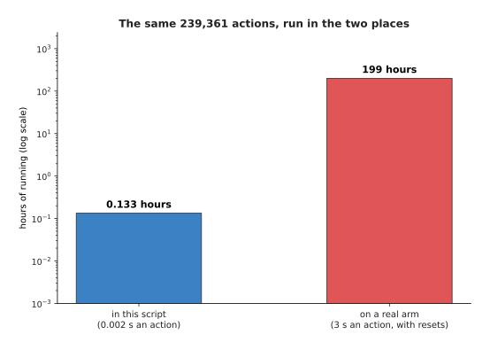

The same 239,361 actions take about eight minutes inside this script and 199 hours
on a real arm, which is 8.3 days of continuous running.

That is why reinforcement learning for arms almost always happens in a simulator. A
**simulator** is a program that pretends to be the robot and the table. It can run
many copies of the world at once, and it can run each of them faster than real
time. Moving the finished policy onto the real arm afterwards is called
**sim-to-real** transfer, where "sim" is short for simulator. The trouble is that
the simulator is never exactly right. The friction is wrong, the object is heavier
than the model says, and the bench has a fixture bolted to it that nobody put in the
simulator. That difference, together with the drop in performance it causes, is
called the **reality gap**.

The picture below shows one policy in both places. The fixture is one square of the
table that the simulator did not know about.


In the simulator the policy reaches the bin in ten actions and collects 8.90. In the
cell, the same policy pushes up into the fixture 75 times in one attempt, uses all
80 actions, and collects minus 45.55. That failure has the shape that real failures
have. The policy is not confused. It carries out a plan that was correct in the
simulator and is impossible in the cell, and because its state never changes it
repeats the same action for ever.

Six policies were trained in the perfect simulator, and all six learned the same
route. The next picture measures all six in both places.

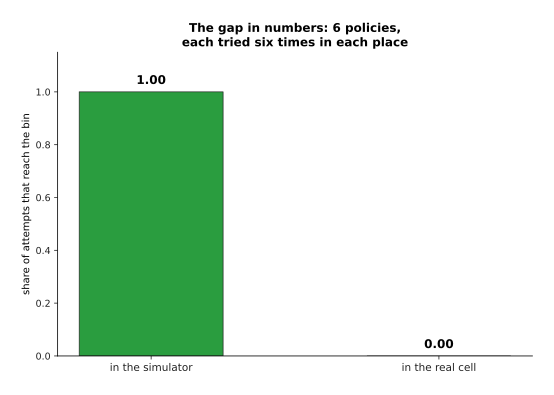

All six reach the bin on every attempt in the simulator, and none of them reaches it
even once in the cell.

The usual answer is **domain randomisation**. It means changing the simulator's
settings at random for every attempt, so that the policy has to work across a whole
range of worlds rather than one. If the friction, the lighting, the object's weight
and the fixture's position are all drawn fresh for each attempt, the policy cannot
rely on any of them. The real cell then has a good chance of being one more member
of that range. The picture below tries both kinds of policy against each of the eight
squares the fixture could stand on.


Averaged over those eight squares, the policies from the perfect simulator reach the
bin on 0.62 of attempts, and the randomised ones reach it on 0.83. The randomised
policies are not better on every square. On two of the eight squares they are worse,
and on one of those two they reach the bin on only 0.33 of attempts. What
randomisation buys is a better average over the whole range, not a guarantee. The
randomised policies also choose a different route.

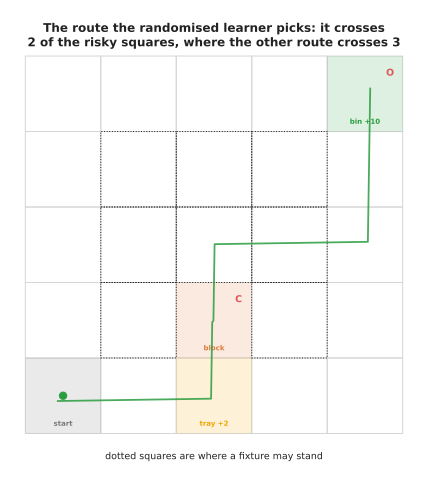

The dotted squares are the ones where a fixture may stand. This route crosses two
of them, where the route learned in the perfect simulator crosses three, and one of
those three is the square the fixture really stood on in the picture above. The
randomised learner did not avoid risk perfectly, because a shorter route is still
worth something. It avoided enough of it to survive.

What domain randomisation costs is worth saying plainly, because it is often
described as free and it is not. The randomised learner is solving a harder
problem, so it needs more attempts to learn.


Over the whole run the randomised learner reaches the bin on 0.649 of its training
attempts, against 0.679 for the learner in the perfect simulator. There is also a
second cost to look for, which is whether the randomised policy is worse back in the
easy world.

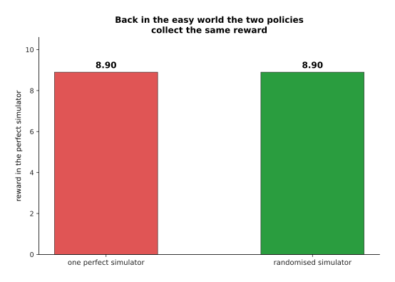

In this small world the randomised policy loses nothing when there is no fixture,
because several routes have the same length and it simply picks a safer one. In a
harder world there is usually a real price, and the policy that handles every
friction setting is a little worse at the one setting the bench turns out to have.
How wide to draw the range is a judgement, and it can be settled honestly only by
measuring on the real arm.

---

## 7. Where to read next

- [Rewards, preferences and verifiers](02_rewards-preferences-and-verifiers.md)
  is the next page, and it answers the question this page left open, which is
  where the reward number comes from when nobody can write one.
- [Behaviour cloning and action chunks](../12_models-that-act/01_behaviour-cloning-and-action-chunks.md)
  shows the other way to get a policy for an arm, which is to copy
  demonstrations rather than to try things.
- [World models](../12_models-that-act/04_world-models.md) explains how a learned
  model of what happens next can take the place of the simulator this page used.
- [Post-training a language model](../10_language-and-multimodal-models/02_post-training-a-language-model.md)
  shows the same machinery used on text, where one episode is one answer.
- [Reinforcement learning policies](../../07_learned-models/06_movement-models/03_also-used/01_reinforcement-learning-policies.md)
  is the catalogue page for arms, and it says which jobs are really done this way.
- [Learned dynamics models](../../07_learned-models/08_world-models/02_most-used/01_learned-dynamics-models.md)
  lists the real models that predict what the world does next.

---

## 8. Using it in Python

Sections 1 to 3 built a state, an action, a reward and a value table by hand. This
section shows the same loop written in NumPy, on the same small world the pictures
use. Nobody writes this rule themselves for a real robot, but a table this small
makes the rule visible.

```python
import numpy as np

BLOCK, TRAY, BIN = (3, 2), (4, 2), (0, 4)              # section 1's little world
MOVE = [(-1, 0), (1, 0), (0, -1), (0, 1)]              # up, down, left, right

def step(state, action):
    """The world answers: the next state, the reward, and whether it has ended."""
    r, c, h = state // 10, (state // 2) % 5, state % 2  # row, column, holding
    nr, nc, nh, reward, done = r, c, h, -0.1, False     # every action costs 0.1
    if action < 4:
        dr, dc = MOVE[action]
        if 0 <= r + dr < 5 and 0 <= c + dc < 5:         # a wall leaves it where it was
            nr, nc = r + dr, c + dc
    elif action == 4:                                   # close the gripper
        reward -= 0.05
        if not h and (r, c) == BLOCK:
            nh = 1
    elif action == 5:                                   # open it
        reward -= 0.05
        if h:
            if (r, c) == BIN:
                reward, done = reward + 10.0, True
            elif (r, c) == TRAY:
                reward, done = reward + 2.0, True
            else:
                reward, nh = reward - 1.0, 0            # the block is dropped
    return (nr * 5 + nc) * 2 + nh, reward, done

n_states, n_actions, gamma, alpha = 50, 7, 0.95, 0.3
Q = np.zeros((n_states, n_actions))                    # section 2's value table
rng = np.random.default_rng(7)

for attempt in range(6000):
    eps = 1.0 - 0.95 * attempt / 5999     # section 4: explore a lot, then less
    state, seen = 40, []                  # state 40 is the start square
    for _ in range(80):                   # give up after 80 moves
        if rng.random() < eps:
            action = int(rng.integers(n_actions))      # explore
        else:
            action = int(np.argmax(Q[state]))          # exploit
        nxt, reward, done = step(state, action)        # the world answers
        seen.append((state, action, nxt, reward, done))
        state = nxt
        if done:
            break
    for st, ac, nxt, reward, done in reversed(seen):   # section 3's rule, last move first
        target = reward if done else reward + gamma * Q[nxt].max()
        Q[st, ac] += alpha * (target - Q[st, ac])

print(Q[40].max())        # 5.43, the value of the start square
print(np.argmax(Q[40]))   # 0, which is "up"
```

Both printed numbers appeared in sections 2 and 3. The first one can also be checked
by hand, because the best attempt pays 9.85 ten steps away and costs about 0.1 a
step before that.

One part of the loop is worth a second look. The whole attempt is remembered in the
list called `seen`, and the rule is then applied to its moves in reverse order, with
the last move first. Applying the rule as you go also works, but it learns far more
slowly, because the reward at the bin then travels back by one square per attempt
instead of travelling the whole way at once.

A library does everything in that program except the update rule itself. For a real
arm the value table becomes a neural network, so `Q[state]` becomes a forward pass
and the update becomes a loss and a gradient step. Stable-Baselines3 and CleanRL
both ship proximal policy optimisation ready built. The `step` function above is the
interface that Gymnasium asks a simulator to provide. MuJoCo and Isaac Lab provide
the arm and the table.

What you still decide is everything this page argued about. You choose the discount
factor, and section 1 showed that it changes which behaviour counts as best. You
choose how much exploring to do, and section 4 showed that it decides whether the
good answer is ever found. You choose how far the policy may move in one step.
Above all you choose the reward, and the next page is about how often that choice
is the thing that goes wrong.
