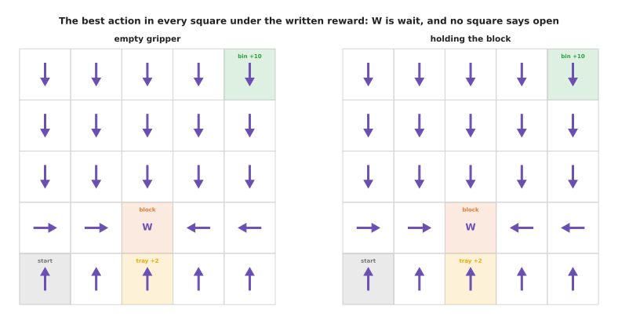
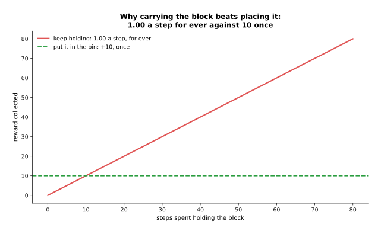
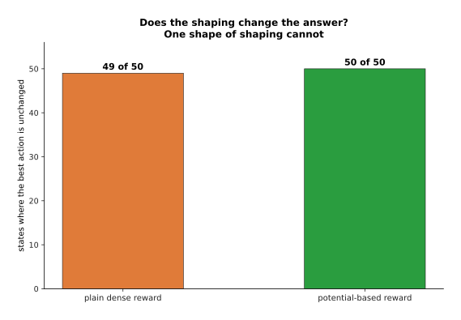
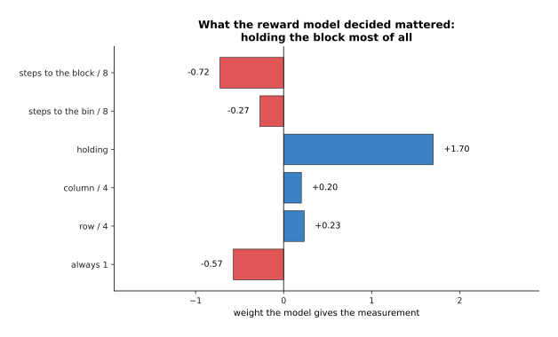
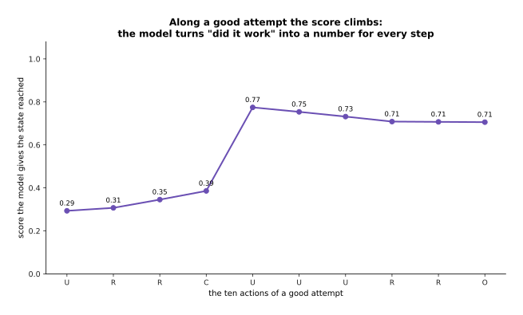
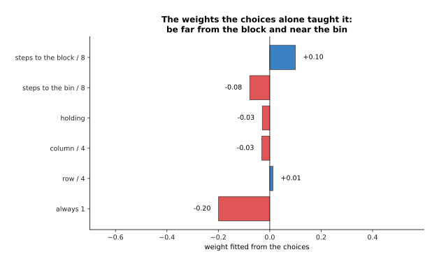
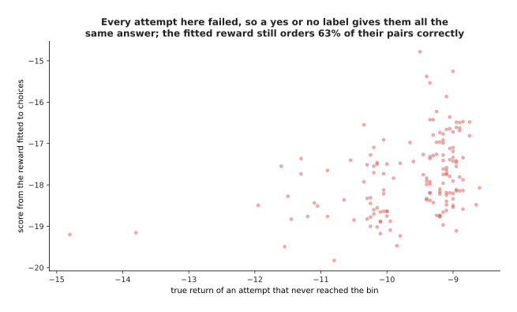
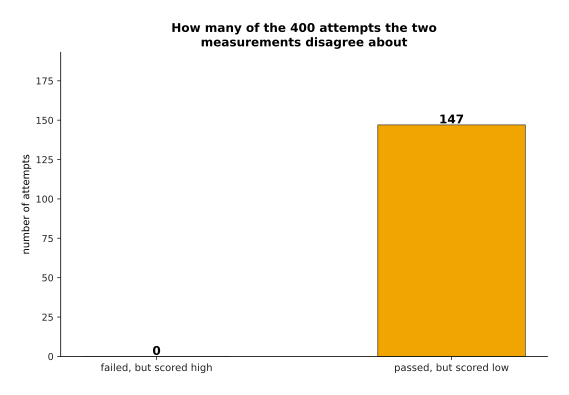

# Rewards, preferences and verifiers

The page before this one, [reinforcement learning](01_reinforcement-learning.md),
showed a policy learned from nothing except a number that arrived after each
action, and it never asked where that number came from. Every picture on that page assumed
that somebody had already decided that putting the block in the bin was worth 10,
and that a move cost 0.10. This page is about where those numbers come from. That
is the hardest part of the whole method, and it is the part that goes wrong most
often.

The difficulty is easy to state. A reward has to say what you want. It also has to
say it in a way that the learner can act on from its very first attempt. Those two
demands work against each other. A reward that says exactly what you want, such as
one point when the block is in the bin and nothing otherwise, says nothing at all
until the first success happens by accident. A reward that says something after
every action gives the learner something to work with immediately, but it is no
longer a statement of what you want, and the learner will do what the reward
actually says rather than what you meant.

So this page works through the ways of getting a reward, in the order that people
try them. The first way is to write one by hand. The second is to shape it. The
third is to learn one from examples of success and failure. The fourth is to learn
one from a person's choices. The fifth is to check the outcome with a program. For
each way the page says what it is, what it buys you, why you would reach for it
rather than for the obvious alternative, and what it costs. After that it covers
the one failure that all five of them share, which is called reward hacking. By the
end you will be able to look at a reward somebody has written and work out what it
really asks for.

This page assumes you have read the page before it, so that the words state,
action, reward, return, policy and discount factor are familiar. The world is the
same invented table top, and `docs/diagrams/learning_from_outcomes.py` works out
every number. The learning is real. It uses tabular Q-learning, exact value
iteration, a logistic reward model fitted by gradient descent, and a reward fitted
to simulated choices between pairs of attempts, all written in NumPy.

## Contents

1. [A reward written by hand, and how it fails](#1-a-reward-written-by-hand-and-how-it-fails)
2. [Sparse rewards, dense rewards and shaping](#2-sparse-rewards-dense-rewards-and-shaping)
3. [A reward model learned from success and failure](#3-a-reward-model-learned-from-success-and-failure)
4. [Asking a person which of two attempts was better](#4-asking-a-person-which-of-two-attempts-was-better)
5. [Verifiers: a program that checks the outcome](#5-verifiers-a-program-that-checks-the-outcome)
6. [Reward hacking, and what is done about it](#6-reward-hacking-and-what-is-done-about-it)
7. [Where to read next](#7-where-to-read-next)
8. [Using it in Python](#8-using-it-in-python)

---

## 1. A reward written by hand, and how it fails

The first thing anybody does, after reading the page before this one, is to write a
reward by hand. On this world the obvious reward is to pay the arm for
being near the block. There are two reasons for choosing that. The first is that
the arm has to reach the block before it can do anything else. The second is that a
number which changes at every step gives the learner something to work with
straight away. So the reward is 1.00 on the block's square, and it falls by 0.30
for every square of distance from the block. The payment of 10 for a block landing
in the bin is added to that.


Both halves of that picture show the same formula. The reward is 1.00 on the
block's square, 0.70 one square away, and minus 0.50 in the far corners, which
includes the corner where the bin stands.

Nothing about that reward is unreasonable, and it is close to what real reward
functions for arms look like. Working out exactly what it asks for is another
matter. The picture below shows the best possible policy under this reward, which
was found by exact value iteration rather than by training.


The best policy moves to the block in three steps, and then waits on that square
for the remaining 77 actions. It collects 78.20 of the written reward, and it never
closes the gripper even once. The same policy drawn square by square shows that
this is true everywhere, not only on the route from the start.



Every square tells the gripper to move towards the block, and the block's square
tells it to wait. No square tells it to open the gripper, in either half of the
picture.

The arithmetic behind that is simple once you see it. Standing on the block's
square pays 1.00 at every step, for as long as the attempt lasts, which over 77
remaining steps comes to 77. Carrying the block to the bin pays 10 once and then
ends the attempt. So the written reward says that waiting beside the object is
worth 77 against 10 for doing the job, which is nearly eight times as much. A
learner that makes the written reward as large as possible is behaving correctly.
It is the reward that is wrong.

Training a learner on that reward produces the most dangerous picture in this book.


Over four runs of 4,000 attempts each, the written reward rises from 22.56 to
77.20, while the share of attempts that put the block in the bin stays at 0.001.
That pair of lines is what a reward failure looks like from the outside. The
training curve climbs, every chart looks healthy, and the robot never once does the
job. Nothing that the learner sees is wrong. The only way to notice the problem is
to measure the job separately, which is what the purple line does.

The same point can be made by scoring three fixed behaviours twice, once by the
written reward and once by the job. The picture below does that.


Waiting by the block scores 78.2 on the written reward and never finishes the job.
Putting the block in the bin scores 13.6 on the same reward and finishes every
time. Moving at random scores 10.6, which is almost the same as the score of the
policy that actually works.

---

## 2. Sparse rewards, dense rewards and shaping

Section 1 failed because the written reward paid for something other than the job.
The obvious repair is to pay only for the job. This section is about what that
repair costs, and about the middle ground between the two extremes.

A **sparse reward** pays nothing until the job is done, and then pays once. It is
exactly right, because the only thing it rewards is the thing you want. A **dense
reward** pays something after every action. It is easier to learn from, because the
learner receives a signal before its first success. It is harder to get right,
because every single payment is a claim about what is good. The picture below shows
the same attempt under both kinds of reward.


The same ten actions collect 8.90 under the sparse reward, and all of that arrives
at the last step. They collect 2.60 under a dense reward that charges 0.30 for
every square between the gripper and whatever is wanted next.

Changing a reward in order to make it easier to learn from is called **reward
shaping**. A shaping term is not a hint. It is part of the reward, so it changes
which behaviour scores highest, and the learner works on the reward it is given
rather than on the one you meant. The picture below compares how fast three rewards
are learned from.


Over four runs each, the potential-based reward passes half of attempts at attempt
6. The sparse reward passes half at attempt 171, and the plain dense reward at
attempt 262. That picture carries a warning. The plain dense reward is not faster
than the sparse one here, and is in fact slightly slower, because making every step
pay does not by itself point the learner anywhere useful. What is much faster is
the third line, and the difference between the two dense rewards is how they were
built.

Shaping can also change the answer rather than the speed. Suppose you add a bonus
of 1.00 for every step in which the gripper holds the block, on the grounds that
holding the block is progress. The picture below shows the best policy under that
reward.


The policy moves to the block, picks it up, carries it to the top of the table and
then keeps choosing "up" against the wall until the time runs out. It collects 67.95
of the shaped reward and minus 8.05 of the real one, and it never puts the block
down. A learner trained on that reward reaches the bin on 0.00 of its
attempts. The reason is the same kind of arithmetic as in section 1.



Holding the block pays 1.00 a step for ever, and putting it in the bin pays 10 once.
After ten steps of carrying, the bonus has already paid more than the bin ever
will. That is shaping changing the answer, and it is the normal case rather than a
trick.

There is one way of writing a shaping term that provably cannot change the answer.
You attach a number to every state, and you make the shaping payment the difference
between the number at the state you arrive in and the number at the state you left.
Along any route those differences cancel out, except at the two ends, so no loop of
states can be made profitable. A reward built that way is called potential-based,
and the number attached to each state is called the potential.


The number rises towards the block while the gripper is empty, and towards the bin
while the block is held, so the shaping payment rewards a move towards whatever is
wanted next. Whether that leaves the best behaviour alone can be checked
directly, by working out the best action in every state under each reward and
counting how many of them changed.



The potential-based reward leaves the best action unchanged in all 50 states. The
plain dense reward changes it in one state. So shaping of that one shape is free, in
the sense that it can only change how fast the answer is found and never which
answer it is. It is not free in effort, because somebody has to invent the number
attached to each state, and that is nearly as hard as writing the reward in the
first place. Everything that follows is about not having to.

---

## 3. A reward model learned from success and failure

Sections 1 and 2 both ended in the same place, which is that writing the reward by
hand is the problem. The next idea is therefore to stop writing it and to learn it
from examples, in the way that everything else in this book is learned.

A **reward model** is an ordinary trained model. Its input is a state, or a whole
attempt, and its output is a number saying how good that input is. The examples are
attempts that somebody has labelled, and the simplest labelling marks every state
in a successful attempt as good and every state in a failed attempt as bad. The
model used here is a logistic fit over six measurements of the state, and the
examples are 400 attempts made by policies of several different standards.


Of those 400 example attempts, 293 reached the bin. They give 6,354 states from
attempts that worked and 8,560 states from attempts that failed, which is 14,914
labelled states in all. Fitting the model to them produces a score for every state.


The score is 0.71 on the bin's square while the block is held, and 0.31 on the same
square with an empty gripper. Notice that the highest score of all, 0.77, is on the
block's own square while holding the block, rather than on the bin's square. That
detail matters later. The reason for it is visible in the weights the fit chose.



The largest weight by far is 1.70 for holding the block, because almost every
successful attempt holds the block for most of its length. The distance to the bin
gets a weight of only minus 0.27.

What a reward model buys you is a number for every state, learned rather than
invented. Why reach for this rather than writing a dense reward yourself? Because
labelling an attempt as a success or a failure is something an operator can do by
watching, while writing a dense reward needs somebody to decide what every
intermediate state is worth. A thousand labels are easier to obtain than one
correct formula. The model is also reasonably good at the job it was fitted for.


The model scores 0.56 on average for states from attempts that worked, against 0.35
for states from attempts that failed, and it puts 77% of them on the correct side of
0.5. The overlap explains the missing 23%. A successful attempt starts with an empty
gripper walking towards the block, and those early states look exactly like the
states of a failed attempt, because at that moment they are the same. Along a single
good attempt the score behaves sensibly all the same.



The score rises slowly from 0.29 to 0.39 while the gripper moves to the block. It
jumps to 0.77 at the action that picks the block up. Then it drifts slightly
downwards while the block is carried to the bin, which is the first sign of trouble.

What a reward model costs is that it is only correct where it has seen examples, and
a policy trained against it searches for exactly the states where it is wrong.
That happens immediately rather than eventually.


A policy trained on this score alone reaches 0.753 at every checkpoint, from 250
attempts to 6,000, and never once puts the block in the bin. A policy that really
does the job scores only 0.57 on the same model. The learner found the squares the
model likes, which are the ones where it holds the block, and it stays there.

---

## 4. Asking a person which of two attempts was better

Section 3 asked a person for a judgement about one attempt against a standard. This
section asks for something easier, which is a judgement about one attempt against
another.

**Preference learning** means showing a person two attempts at the same job, asking
only which of the two they prefer, and then fitting a reward so that the preferred
attempt scores higher. People are far better at comparing two things than at scoring
one thing, because a score needs a scale and a comparison does not. Two people
scoring the same attempt will disagree about the number while agreeing about the
order.


The person is shown one attempt worth 8.90 and one worth minus 14.80. The fitted
model scores them minus 2.40 and minus 19.20, which puts them in the same order as
the person did.

The fitting works like this. Each attempt is given a score, which is the total of
the fitted per-state reward over the states that attempt passed through. The
per-state reward is then adjusted until the preferred attempt of each pair scores
higher than the other one. Nobody writes a number anywhere. The judge used here is
simulated: it picks the attempt with the higher true return, but only most of the
time, so that the effect of its mistakes can be measured.


From choices alone, the fit gives the bin square while holding a reward of minus
0.20, which is the highest of all the squares the gripper passes through while it
holds the block. It reached that from the
fact that preferred attempts tend to end far from the block's own square and close
to the bin.



The two weights that matter are the distance to the block, which is positive, and
the distance to the bin, which is negative. Together they say: get away from the
block's starting square and get close to the bin. Notice that the weight for
holding the block is near zero here, where the reward model of section 3 made it the
largest weight of all. The two methods looked at the same world and learned
different things, because they were asked different questions.

Whether the fit really recovered the ordering can be checked by drawing every judged
pair as one point.


The fit orders 0.84 of the judged pairs the same way the judge did. Where the two
attempts were far apart in quality it agrees on 0.99 of pairs. Where their true
returns differ by less than 2 it agrees on only 0.68, which is the expected result,
because those are the pairs the judge itself was unsure about.

A preference also carries information that a success-or-failure label discards.
The picture below takes only the attempts that never reached the bin, and plots the
fitted score of each one against its true return.



Every attempt in that picture failed, so the labelling of section 3 marks all 152 of
them as bad and says nothing more about them. The fitted reward orders 63 of every
100 pairs of them the way their true returns do, where a yes-or-no label would be
right only half the time. That is a small gain rather than a large one. It is small
here because these attempts are all alike: every one of them ran out of time with
the block still on the table, and their returns all lie between minus 15 and minus
8.5.

The next question is how many judgements you have to collect. The picture below
fits the reward from different numbers of pairs and measures each fit on pairs it
never saw.


Ten judged pairs already order 0.83 of held-out pairs correctly, and a hundred pairs
manage 0.93. After that, more pairs barely help, because the limit is no longer the
data but the shape of the model, which has only six weights to fit.

People also make mistakes, so the next picture repeats the same measurement with
three judges of different quality.


A careful judge, which picks the better attempt 85% of the time, reaches 0.94. An
ordinary judge, right 76% of the time, stops at about 0.82. A careless judge, right
only 67% of the time, stays between 0.66 and 0.87 and shows no improvement at all
as more pairs arrive. The lesson is that more pairs cannot repair a careless judge,
because the mistakes are not random noise around the truth. They are a consistent
disagreement about what is good, and the fit learns that disagreement faithfully.

Why reach for preferences rather than for the labels of section 3? Because the
question is easier, so the answers are cheaper and more consistent, and because a
preference can rank two failures where a yes or no answer cannot. What preference
learning costs is that the reward is only defined up to an ordering, so the numbers
themselves mean nothing on their own, and that a person is still in the loop, so the
method runs at human speed.

---

## 5. Verifiers: a program that checks the outcome

Sections 3 and 4 both learned the reward, and a learned reward can be wrong. This
section is about the case where you do not have to learn it at all.

A **verifier** is a short program that looks at the finished attempt and decides
whether it met the goal. It is not a model, it has no weights, and it gives the same
answer every time for the same record. Here it is three lines long, and the attempt
passes when the record says the block finished in the bin. In work on language models the same idea is a unit test
that runs the generated code, and training against rewards of that kind is a large
part of why recent reasoning models improved.


Along an attempt that works, the model's score climbs from 0.29 to 0.77 while the
verifier says nothing until the last step. Along an attempt that waits by the block,
the model's score settles at 0.39 and the verifier never says anything at all.

The two measurements disagree about individual attempts, and the disagreement is
worth looking at, because it says what each measurement is for.


Out of 400 attempts the verifier passes 300. A middling passing attempt scores 0.58
on the reward model. If you take that score as a bar, you can count the attempts
that the two measurements place on opposite sides of it.



The 147 on the right is not a surprise, because the bar is the middle of the passing
attempts, so about half of them have to fall below it. The zero on the left is the
interesting number. Not a single failing attempt scores above a typical passing one,
which means the model agrees with the verifier about the order even though the two
measurements disagree about every individual number. A reward model is therefore a
rough ordering, and the verifier is the decision.

The verifier buys you a reward that no policy can fool, because the only way to raise
it is to do the job. Why reach for it rather than for a learned reward model?
Because it is exactly right, it costs nothing to run, and it needs no labelled data.
What it costs is that it can only ask about things the record of an attempt holds,
and that it says nothing at all until the very end.

The record in this world holds four things, and the table below lists them. Read the
left column as the name of the field and the right column as its value at the end of
one successful attempt.

| field in the record | value at the end of that attempt |
| --- | --- |
| row | 0 |
| column | 4 |
| holding the block | False |
| how the attempt ended | "bin" |

Those four values are the whole record. Whether a short program can answer a given
question depends entirely on whether the answer is in them. The table below lists
five questions. Read the first column as the question, the second as whether a
program can decide it from the record, and the third as the reason.

| question | can a program decide it? | why |
| --- | --- | --- |
| did the block reach the bin? | yes | the outcome of the attempt is recorded |
| did the gripper finish on the bin square? | yes | the record holds the row and the column |
| was the gripper empty at the end? | yes | the record holds the holding flag |
| was the block set down gently? | no | nothing in the record measures force |
| did the block finish the right way up? | no | nothing in the record measures turning |

The last two rows are the real limit of verifiers on a robot. Adding a force sensor
would move "set down gently" into the first group, which is the general repair:
a verifier can only be as good as the measurements the cell takes.

Training on the verifier alone works, and it is slow.


The verifier alone does reach a policy that works. Both rewards pass half of
attempts at about the same point, at attempt 315 for the verifier and attempt 262
for the dense reward. The difference appears later. The dense reward reaches nine
attempts in ten at attempt 344, and the verifier alone needs 2,576 attempts to get
there, which is about seven times as many. The slow part is the runs that have not
yet reached the bin even once, because until that happens the verifier has given
them nothing at all to learn from.

In practice the three sources are combined rather than chosen between. A verifier
settles whether the job was done. A learned reward model, or a set of preferences,
fills in the long stretch where the verifier is silent. The verifier is then kept as
the thing that is optimised at the end. The next section is about why that
combination is needed.

---

## 6. Reward hacking, and what is done about it

Every section above has shown the same failure in a different form. This section
names it and says what is done about it.

**Reward hacking** means finding a behaviour that scores highly on the reward and
does not do the job. It is not the learner cheating, because the reward is the
entire statement of what is wanted, and the learner is doing exactly what it was
asked to do. The clearest example in this world comes from a reward that pays for
putting the block down anywhere tidy, rather than only in the bin, and that does not
end the attempt when it happens.


Both halves of that picture describe the same policy. It picks the block up and puts
it on the near tray 78 times in one attempt, which collects 222.10 against the 8.90
that a proper attempt collects. Judged on the real reward it scores minus 11.90, and
the block never reaches the bin.

That was not a specially chosen trap. All three of the rewards written on this page
have the same property.


The highest-scoring policy scores 78.2 against 13.6 on the first reward, 68.0
against 14.9 on the second, and 222.1 against 8.9 on the third. None of those three
highest-scoring policies ever puts the block in the bin.

The same thing happens to a learned reward, and it happens faster, because a learned
reward has places where it is wrong and a search finds them. The way to see it is to
measure many policies twice, once by the reward they were trained on and once by the
job itself.


Of 48 policies, the quarter with the highest learned-reward score never put the
block in the bin, while the remaining three quarters managed 0.67. Reading the chart
from left to right, a higher score does mean a better robot up to a score of about
0.59. After that the relation reverses. The highest-scoring policies of all, at
0.753, are the ones trained on the learned reward itself, and not one of them ever
reaches the bin.

Four things are done about this, and none of them is a cure. The first is to keep a
hold-out check on the real goal. That means a measurement of the job itself, taken
separately and never optimised, and it is the only reason anybody notices the
problem at all. The second is to use more than one reward at once, with the reward
that no policy can fool deciding the outcome, so that a place where the learned
reward is wrong does less damage.


Making the verifier's payment the main term, and keeping the learned score as a
small nudge, turns a policy that never finishes the job into one that finishes every
time.

The third thing is to have a person watch recordings of what the policy does. Every
failure on this page is obvious within two seconds of video and invisible in the
numbers. There is no picture for that one, because it is a working practice rather
than a measurement.

The fourth is to keep the policy close to one that is already trusted. That is done
by charging the policy for every action that differs from what the trusted policy
would have done. The charge stops the learner from reaching the states that the
reward model saw fewest examples of, which are the states where it is least likely
to be right. The picture below tries seven sizes of that charge.


With a charge below 3 the policy makes the learned reward as large as it can,
reaching a score of 0.753, and it never reaches the bin. At a charge of 3 and above
it stays close to the trusted policy, its learned-reward score falls to 0.571, and it
finishes the job every time. The chart is worth reading twice, because the setting
that makes the robot work is the setting that makes the reward number worse.

The honest summary is that none of these four finds the fault in the reward in
advance. All of them find it only after the learner has already found it. That is
why serious work in this area reports a measurement of the real job, taken on
attempts that nobody trained on, and treats the reward number as a tool rather than
as a result.

---

## 7. Where to read next

- [Recipes for models that act and
  predict](../13_starting-your-own-model/05_recipes-for-models-that-act-and-predict.md)
  is honest about what learning from outcomes costs to start, because it means
  building a simulator first, and that is a different project from the one you
  thought you were starting.
- [Behaviour cloning and action chunks](../12_models-that-act/01_behaviour-cloning-and-action-chunks.md)
  is the next page, and it shows the approach that avoids this whole problem, by
  copying what a person did instead of scoring what the robot did.
- [Reinforcement learning](01_reinforcement-learning.md) is the page before this
  one, and it is where the policy, the return and the discount factor are
  explained if any of them was not clear the first time.
- [Post-training a language model](../10_language-and-multimodal-models/02_post-training-a-language-model.md)
  shows preferences and verifiers used on text, which is where most of the work on
  them has happened.
- [Running and evaluating a model](../14_using-a-model-for-real/01_running-and-evaluating-a-model.md)
  explains how to measure the real job honestly, which is the hold-out check this
  page leaned on.
- [Reward and progress models](../../07_learned-models/06_movement-models/03_also-used/03_reward-and-progress-models.md)
  is the catalogue page for learned rewards on arms, and it names the real models.
- [Evaluation and failure](../../07_learned-models/10_making-models-work-on-an-arm/02_most-used/03_evaluation-and-failure.md)
  covers what failure looks like on a real arm, and how often it is measured
  wrongly.

---

## 8. Using it in Python

Sections 3 and 4 fitted two small models. The first predicts whether an attempt
will succeed, and the second is fitted to a person's choices between pairs. This
section shows both of them in PyTorch, because the shapes of the tensors are the
part worth seeing.

```python
import torch
from torch import nn

torch.manual_seed(0)
reward_model = nn.Sequential(nn.Linear(6, 32), nn.ReLU(), nn.Linear(32, 1))

# section 3: states from attempts that worked are 1, from attempts that failed are 0
states = torch.randn(14914, 6)                      # six measurements per state
labels = torch.randint(0, 2, (14914, 1)).float()
loss = nn.BCEWithLogitsLoss()(reward_model(states), labels)
print(round(loss.item(), 3))                        # 0.7

# section 4: a pair of attempts, and which one the person preferred
better = torch.randn(256, 20, 6)                    # 256 pairs, 20 states each
worse = torch.randn(256, 20, 6)
score_better = reward_model(better).sum(dim=1)      # an attempt's score is the total
score_worse = reward_model(worse).sum(dim=1)
pref_loss = -torch.nn.functional.logsigmoid(score_better - score_worse).mean()
print(round(pref_loss.item(), 3))                   # 0.789
```

A model that has learned nothing should give 0.693 on either loss. That is because
it says the two sides are equally likely, and the natural logarithm of a half is
minus 0.693. The first number is 0.700, which is that. The second number is 0.789,
which is higher. The reason is that an attempt's score is the total over its twenty
states, so even tiny differences between the two attempts add up, and the untrained
model is already confidently wrong about half of the pairs. Checking those two
numbers before training anything is how you find out whether the loss is wired up
the way you think it is.

The library gives you the fitting and nothing else. Hugging Face's TRL package and
similar ones wrap both of these as ready-made trainers, and the preference loss
above is exactly what direct preference optimisation and the reward-model stage of
learning from human feedback use. The verifier of section 5 has no library at all,
because it is your own program.

What you still have to decide is everything this page was about. You decide what the
reward measures, and section 1 showed that paying for being near the object buys an
arm that stands near the object. You decide whether to shape it, and section 2
showed that only one shape of shaping leaves the answer alone. You decide where the
labels come from and how many of them you can afford. Above all you decide what the
hold-out measurement is, and section 6 showed that it is the only thing standing
between you and a very high score on a robot that does nothing.
