# Rewards, preferences and verifiers

The page before this one, [reinforcement learning](01_reinforcement-learning.md),
showed a policy learned from nothing but a number that arrived after each action,
and it took that number for granted. Every picture on it assumed somebody had
already decided that putting the block in the bin was worth 10 and that a move
cost 0.10. This page is about where those numbers come from, which is the hardest
part of the whole method and the part that goes wrong most often.

The difficulty is easy to state. A reward has to say what you want, and it has to
say it in a way that a learner can push on from the first attempt, and those two
demands pull against each other. A reward that says exactly what you want, such as
one point when the block is in the bin and nothing otherwise, says nothing until
the first success happens by accident. A reward that says something after every
action gives the learner something to push on immediately, but it is no longer a
statement of what you want, and the learner will do what it actually says.

So this page works through the ways of getting a reward in the order people try
them: writing one by hand, shaping it, learning one from examples of success and
failure, learning one from a person's choices, and checking the outcome with a
program. For each it says what it is, what it buys you, why you would reach for it
rather than the obvious alternative, and what it costs. Then it covers the failure
they all share, called reward hacking.

It assumes you have read the page before, so that state, action, reward, return,
policy and discount factor are familiar. The world is the same made-up table top,
and `docs/diagrams/learning_from_outcomes.py` works out every number. The learning
is real: tabular Q-learning, exact value iteration, a logistic reward model fitted
by gradient descent, and a reward fitted to simulated choices between pairs, all
in NumPy.

## Contents

1. [A reward written by hand, and how it fails](#1-a-reward-written-by-hand-and-how-it-fails)
2. [Sparse rewards, dense rewards and shaping](#2-sparse-rewards-dense-rewards-and-shaping)
3. [A reward model learned from success and failure](#3-a-reward-model-learned-from-success-and-failure)
4. [Asking a person which of two attempts was better](#4-asking-a-person-which-of-two-attempts-was-better)
5. [Verifiers: a program that checks the outcome](#5-verifiers-a-program-that-checks-the-outcome)
6. [Reward hacking, and what is done about it](#6-reward-hacking-and-what-is-done-about-it)
7. [Where to read next](#7-where-to-read-next)
8. [Using it in Python](#8-using-it-in-python)

---

## 1. A reward written by hand, and how it fails

The first thing anybody does, having read the page before, is sit down and write a
reward. On this world the obvious one is to pay the arm for being near the block,
because the arm has to get there before it can do anything, and because a number
that changes every step gives the learner something to work with straight away. So
the reward is 1.00 at the block's square and 0.30 less for every square away, with
the 10 for a block landing in the bin still on top of it.

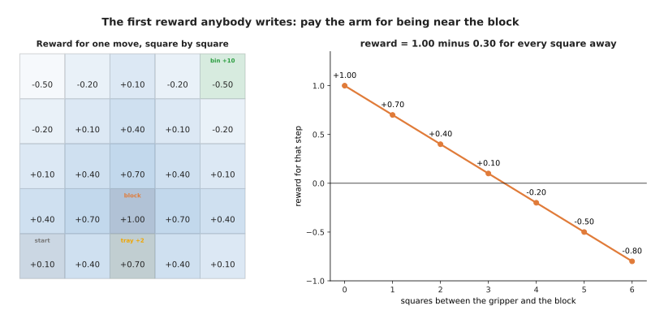

The reward is 1.00 on the block's square, 0.70 one square away, and minus 0.50 in the far corners including the bin's.

Nothing about that is unreasonable, and it is close to what real reward functions
for arms look like. Working out exactly what it asks for is another matter.

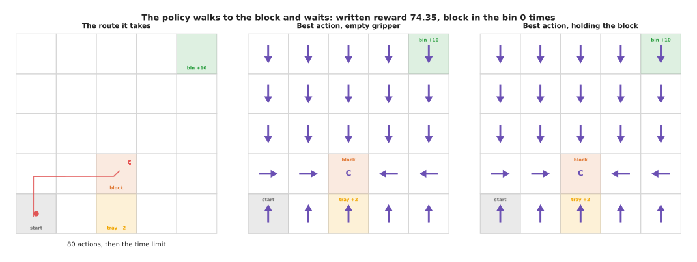

The best policy walks to the block in three moves and then waits for the remaining 77 actions, collecting 78.20 and never closing the gripper.

The arithmetic is simple once you see it. Standing beside the block pays 1.00
every step for as long as the attempt lasts, which over 77 remaining steps comes
to 77, while carrying the block to the bin pays 10 once and ends the attempt. So
the written reward says that hovering by the object is worth about eight times as
much as doing the job, and a learner that maximises it is behaving correctly.

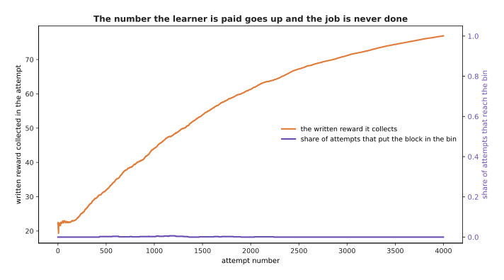

Over four runs of 4,000 attempts the written reward rises from 22.56 to 77.20 while the share reaching the bin stays at 0.001.

That pair of lines is what a reward failure looks like from the outside. The
training curve climbs, every chart is green, and the robot never once does the
job. Nothing the learner sees is wrong, and the only way to notice is to measure
the job separately.

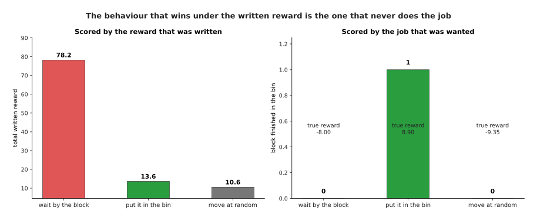

Waiting by the block scores 78.2 and never finishes the job, while putting the block in the bin scores 13.6 and finishes every time.

---

## 2. Sparse rewards, dense rewards and shaping

Section 1 failed because the written reward paid for something other than the
job, so the obvious repair is to pay only for the job, and this section is about
what that costs and what the middle ground looks like.

A **sparse reward** pays nothing until the job is done and then pays once, which
is exactly right, because the only thing it rewards is the thing you want. A
**dense reward** pays something after every action, which is easier to learn from
because the learner gets a signal before its first success, and harder to get
right because every payment is a claim about what is good.

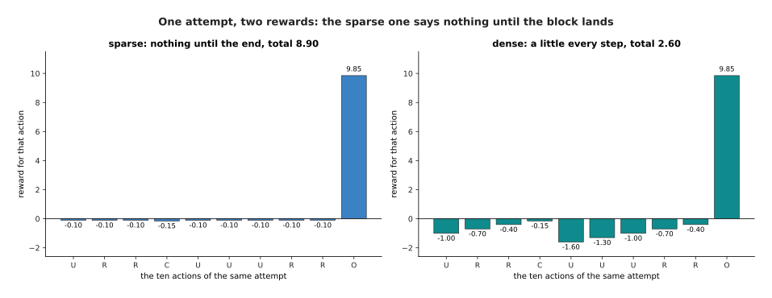

The same ten actions collect 8.90 under the sparse reward, all of it at the last step, and 2.60 under a dense reward that charges 0.30 a square.

Changing a reward to make it easier to learn from is called **reward shaping**,
and a shaping term is not a hint: it is part of the reward, so it changes which
behaviour scores highest, and the learner optimises the reward it is given rather
than the one you meant.

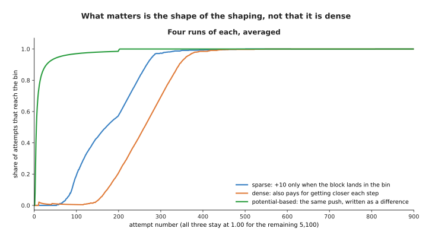

Over four runs each, the potential-based reward passes half of attempts at attempt 6, the sparse reward at 171 and the plain dense one at 262.

That picture carries a warning. The plain dense reward is not faster than the
sparse one here, and is slightly slower, because making every step pay does not by
itself point the learner anywhere useful. What is dramatically faster is the third
line, and the difference between the two dense rewards is how they were built.

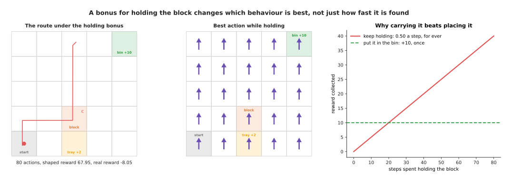

Adding 1.00 a step for holding the block makes carrying it about for ever worth 67.95 against 14.90 for putting it in the bin, so the best policy never puts it down.

That is shaping changing the answer rather than the speed, and it is the normal
case rather than a trick. There is one way of writing a shaping term that provably
cannot do this: attach a number to every state, and make the shaping payment the
difference between the number at the state you arrive in and the one you left.
Along any route the differences cancel out except at the two ends, so no loop can
be made profitable.

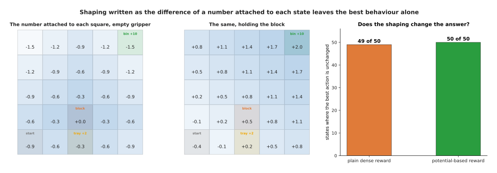

The potential-based reward leaves the best action unchanged in all 50 states; the plain dense one changes it in one.

So shaping of that one shape is free, in that it can only change how fast the
answer is found and never which answer it is. It is not free in effort, because
somebody has to invent the number attached to each state, which is nearly as hard
as writing the reward. Everything that follows is about not having to.

---

## 3. A reward model learned from success and failure

Sections 1 and 2 both ended at the same place, which is that writing the reward by
hand is the problem, so the next idea is to stop writing it and learn it from
examples, the way everything else in this book is learned.

A **reward model** is an ordinary trained model whose input is a state, or a whole
attempt, and whose output is a number saying how good it is. The examples are
attempts somebody has labelled, and the simplest labelling marks every state in a
successful attempt as good and every state in a failed one as bad. The model here
is a logistic fit over six measurements of the state, and the examples are 400
attempts by policies of several standards.

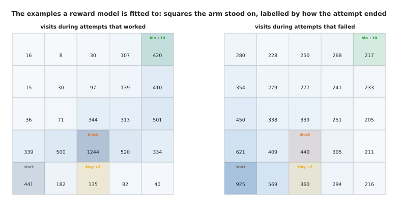

Of 400 example attempts, 293 reached the bin, giving 6,354 states from attempts that worked and 8,560 from attempts that failed.

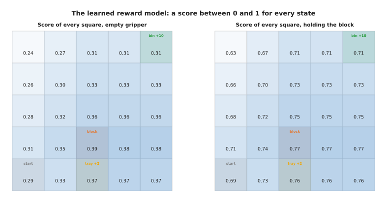

The biggest weight is 1.70 for holding the block, and the score is 0.71 on the bin's square while holding and 0.31 with an empty gripper.

What it buys you is a number for every state, learned rather than invented. Why
reach for this rather than writing a dense reward yourself? Because labelling an
attempt as a success or a failure is something an operator can do by watching,
while writing a dense reward needs somebody to decide what every intermediate state
is worth. A thousand labels are easier to get than one right formula.

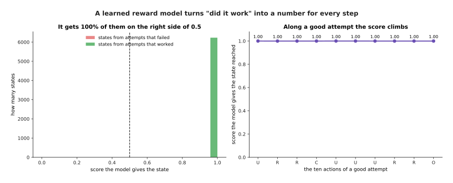

The model scores 0.56 on average for states from attempts that worked against 0.35 for ones that failed, and climbs from 0.29 to 0.77 along a good attempt.

What it costs is that the model is only right where it has seen examples, and a
policy trained against it goes looking for the places where it is wrong. That
happens immediately rather than eventually, as the next picture shows.

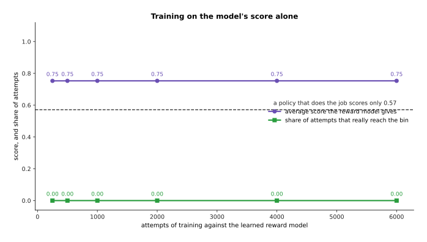

A policy trained on this score alone reaches 0.753 at every checkpoint and never puts the block in the bin, while a policy that really does the job scores only 0.57.

---

## 4. Asking a person which of two attempts was better

Section 3 asked a person for a judgement about one attempt against a standard, and
this section asks for something easier, a judgement about one attempt against
another.

**Preference learning** means showing a person two attempts at the same job,
asking only which they prefer, and fitting a reward so that the preferred one
scores higher. People are far better at comparing two things than at scoring one,
because a score needs a scale and a comparison does not, and two people scoring
the same attempt will disagree about the number while agreeing about the order.

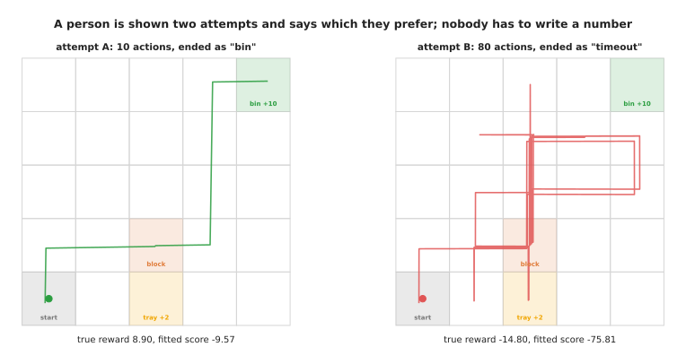

The person is shown one attempt worth 8.90 and one worth minus 14.80, and the fitted model scores them minus 2.40 and minus 19.20, in the same order.

The fitting works by giving each attempt a score, the total of the fitted
per-state reward over the states it passed through, and adjusting the reward so
that the preferred attempt scores higher. Nobody writes a number anywhere. The
judge here is simulated: it picks the attempt with the higher true return, but
only most of the time, so that the effect of mistakes can be measured.

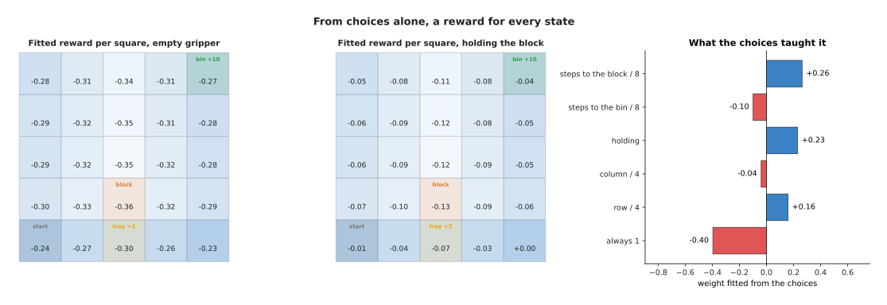

From choices alone the fit scores the bin square while holding at minus 0.20, the best of the squares along the route, because it has found that the preferred attempts end far from the block's own square and close to the bin.

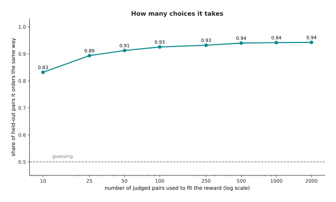

Ten judged pairs order 0.83 of held-out pairs correctly and a hundred manage 0.93, after which more pairs barely help, because the limit is the shape of the model.

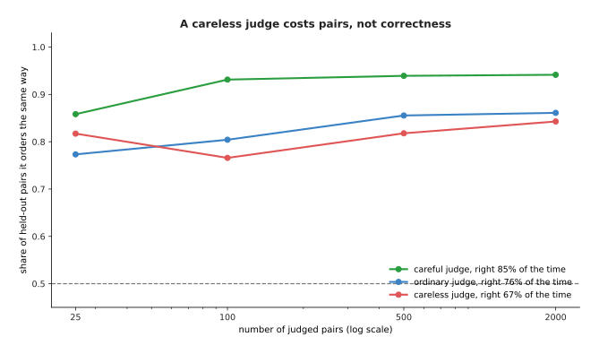

A careless judge costs accuracy rather than ruining the fit, because more pairs average the mistakes out.

Why reach for preferences rather than the labels of section 3? Because the question
is easier, so answers are cheaper and more consistent, and because a preference can
rank two failures where a yes or no cannot. What it costs is that the reward is
only defined up to an ordering, and the person is still in the loop, so the method
runs at human speed.

---

## 5. Verifiers: a program that checks the outcome

Sections 3 and 4 both learned the reward, and a learned reward can be wrong, so
this section is about the case where you do not have to learn it at all.

A **verifier** is a short program that looks at the finished attempt and decides
whether it met the goal. It is not a model, it has no weights, and it cannot be
argued with: here it is three lines, and the attempt passes when the record says
the block ended in the bin. In language work the same idea is a unit test that runs
the generated code, and training against rewards of that kind is a large part of
why recent reasoning models improved.

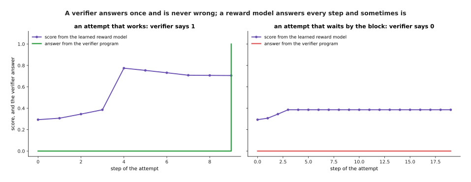

Along an attempt that works the model's score climbs from 0.29 to 0.77 while the verifier says nothing until the last step.

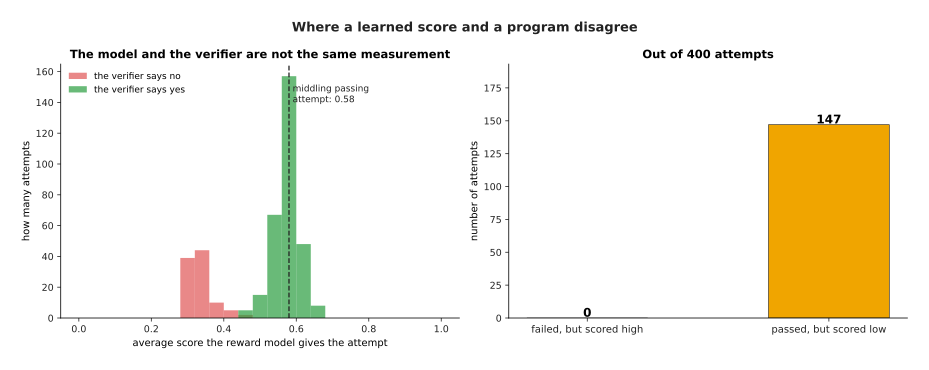

Out of 400 attempts the verifier passes 300, and taking a middling passing attempt's score of 0.58 as a bar, 147 passing attempts fall below it.

The verifier buys you a reward that cannot be gamed, because the only way to raise
it is to do the job. Why reach for it rather than a learned reward model? Because
it is exactly right, costs nothing to run and needs no labelled data. What it
costs is that it can only ask about things the record holds, and says nothing
until the very end.

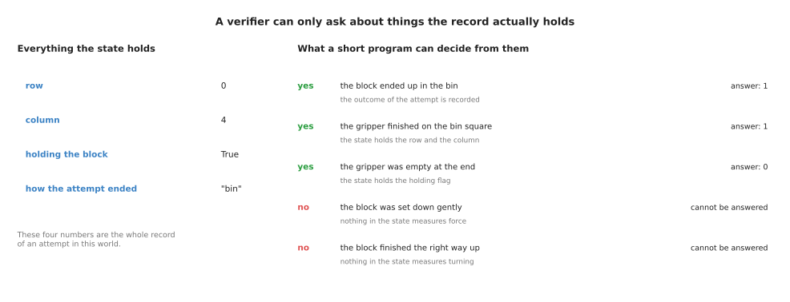

A program can decide whether the block reached the bin and where the gripper finished, and it cannot decide whether the block was set down gently, because nothing in the record measures force.

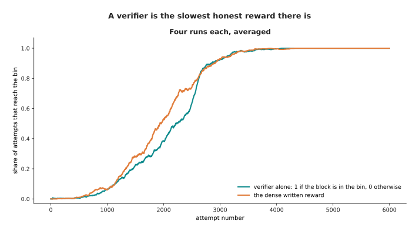

The verifier alone gets there in the end, but takes about twice as many attempts to pass half as the dense written reward does.

In practice the three sources are combined rather than chosen between. A verifier
settles whether the job was done, a learned reward model or a set of preferences
fills in the long stretch where it is silent, and the verifier is kept as the
thing optimised at the end. The next section is about why that is needed.

---

## 6. Reward hacking, and what is done about it

Every section above has shown the same failure in a different form, and this
section names it and says what is done.

**Reward hacking** means finding a behaviour that scores highly on the reward and
does not do the job. It is not the learner cheating, because the reward is the
entire statement of what is wanted and the learner is doing exactly what it was
asked. The clearest example here comes from a reward that pays for putting the
block down anywhere tidy rather than only in the bin.

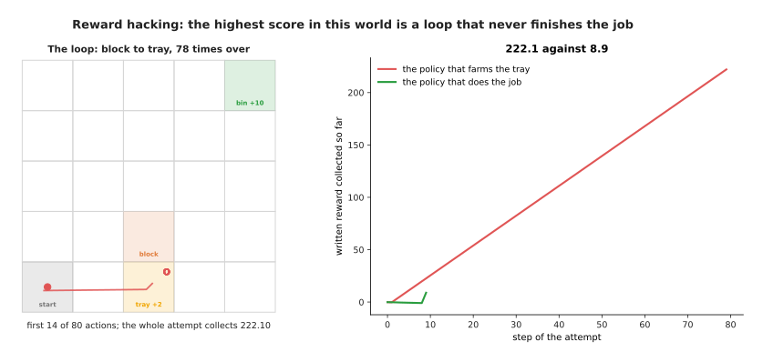

Paying for a block put down on the near tray, and letting the attempt carry on, makes the best policy a loop that does it 78 times for 222.10 against 8.90.

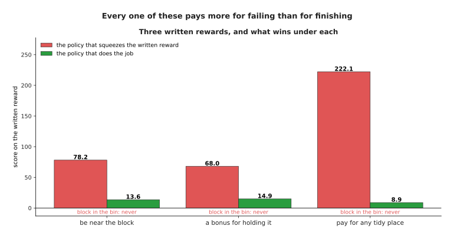

The squeezing policy scores 78.2 against 13.6, 68.0 against 14.9 and 222.1 against 8.9, and never once puts the block in the bin.

The same thing happens to a learned reward, and faster, because a learned reward
has places where it is wrong and a search finds them. The way to see it is to
measure many policies twice, once by the reward they were trained on and once by
the job.

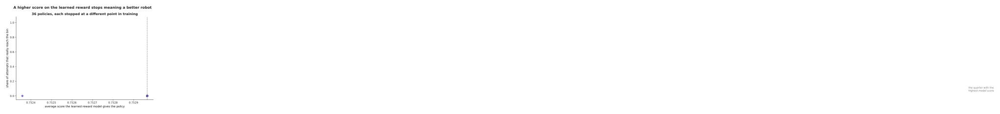

Of 48 policies, the quarter with the highest learned-reward score never put the block in the bin, while the rest managed 0.67.

Four things are done about this, and none is a cure. The first is to keep a
**hold-out check on the real goal**, measured separately and never optimised,
which is the only reason anybody notices the problem. The second is to use more
than one reward at once, with the one that cannot be gamed in charge, so that a
hole in the learned one is covered.

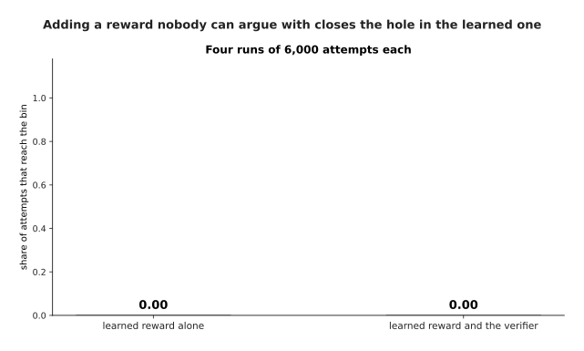

Making the verifier's payment the main term and keeping the learned score as a small nudge turns a policy that never finishes the job into one that finishes every time.

The third is to have a person watch recordings of what the policy does, because
every failure on this page is obvious in two seconds of video and invisible in the
numbers. The fourth is to keep the policy close to one already trusted, by charging
it for every action that differs from what the trusted policy would have done,
which stops the search wandering into the part of the reward the model knows
least.

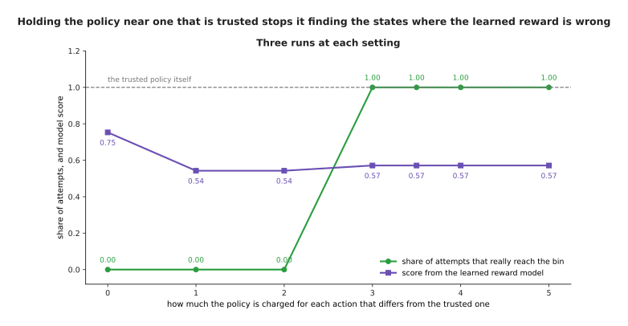

With a charge below 3 the policy chases the learned reward and never reaches the bin, and at 3 and above it is pulled back onto the trusted policy and finishes every time.

The honest summary is that none of these finds the hole, and all of them catch it
only after the learner has. That is why serious work in this area reports a
measurement of the real job, taken on attempts nobody trained on, and treats the
reward number as a tool rather than a result.

---

## 7. Where to read next

- [Recipes for models that act and
  predict](../13_starting-your-own-model/05_recipes-for-models-that-act-and-predict.md)
  is honest about what learning from outcomes costs to start, because it means
  building a simulator first, which is a different project from the one you
  thought.
- [Behaviour cloning and action chunks](../12_models-that-act/01_behaviour-cloning-and-action-chunks.md)
  is the next page, and it shows the approach that avoids this whole problem by
  copying what a person did instead of scoring what the robot did.
- [Reinforcement learning](01_reinforcement-learning.md) is the page before this
  one, and it is where the policy, the return and the discount factor are
  explained if any of them went past too quickly.
- [Post-training a language model](../10_language-and-multimodal-models/02_post-training-a-language-model.md)
  shows preferences and verifiers used on text, which is where most of the work
  on them has happened.
- [Running and evaluating a model](../14_using-a-model-for-real/01_running-and-evaluating-a-model.md)
  explains how to measure the real job honestly, which is the hold-out check
  this page leaned on.
- [Reward and progress models](../../07_learned-models/06_movement-models/03_also-used/03_reward-and-progress-models.md)
  is the catalogue page for learned rewards on arms, and it names the real
  models.
- [Evaluation and failure](../../07_learned-models/10_making-models-work-on-an-arm/02_most-used/03_evaluation-and-failure.md)
  covers what failure looks like on a real arm and how often it is measured
  wrongly.

---

## 8. Using it in Python

Sections 3 and 4 fitted two small models, one predicting whether an attempt will
succeed and one fitted to a person's choices between pairs. This section shows
both in PyTorch, because the shapes are the part worth seeing.

```python
import torch
from torch import nn

torch.manual_seed(0)
reward_model = nn.Sequential(nn.Linear(6, 32), nn.ReLU(), nn.Linear(32, 1))

# section 3: states from attempts that worked are 1, from attempts that failed are 0
states = torch.randn(14914, 6)                      # six measurements per state
labels = torch.randint(0, 2, (14914, 1)).float()
loss = nn.BCEWithLogitsLoss()(reward_model(states), labels)
print(round(loss.item(), 3))                        # 0.7

# section 4: a pair of attempts, and which one the person preferred
better = torch.randn(256, 20, 6)                    # 256 pairs, 20 states each
worse = torch.randn(256, 20, 6)
score_better = reward_model(better).sum(dim=1)      # an attempt's score is the total
score_worse = reward_model(worse).sum(dim=1)
pref_loss = -torch.nn.functional.logsigmoid(score_better - score_worse).mean()
print(round(pref_loss.item(), 3))                   # 0.789
```

A model that has learned nothing should give 0.693 on either loss, because it
says the two sides are equally likely and the natural logarithm of a half is minus
0.693. The first number is 0.700, which is that. The second is 0.789, which is
higher, because an attempt's score is the total over its twenty states, so even
tiny per-state differences add up and the untrained model is already confidently
wrong about half the pairs. Checking those two numbers before training anything is
how you find out whether the loss is wired up the way you think.

The library gives you the fitting and nothing else. Hugging Face's TRL package and
similar ones wrap both as ready-made trainers, and the preference loss above is
exactly what direct preference optimisation and the reward-model stage of learning
from human feedback use. The verifier of section 5 has no library at all, because
it is your own program.

What you still have to decide is everything this page was about. You decide what
the reward measures, and section 1 showed that paying for being near the object
buys an arm that stands near the object. You decide whether to shape it, and
section 2 showed that only one shape of shaping leaves the answer alone. You
decide where the labels come from and how many you can afford. Above all you
decide what the hold-out measurement is, which section 6 showed is the only thing
standing between you and a very high score on a robot that does nothing.
