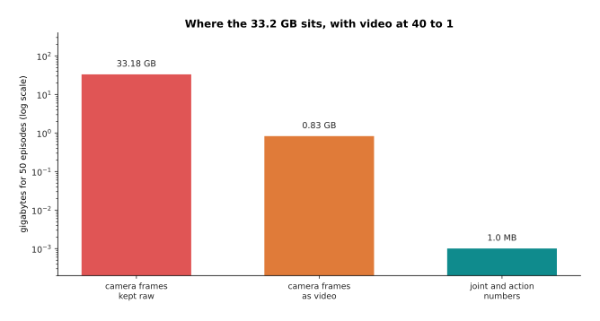
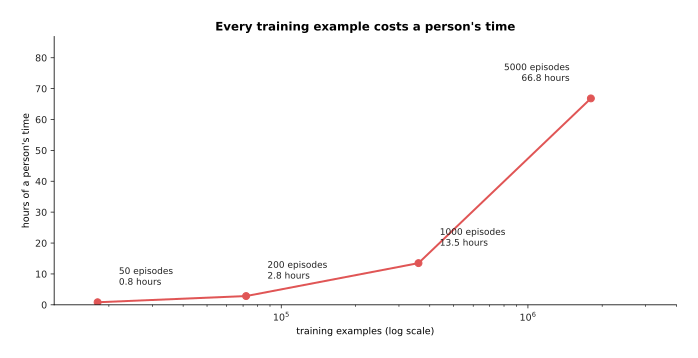
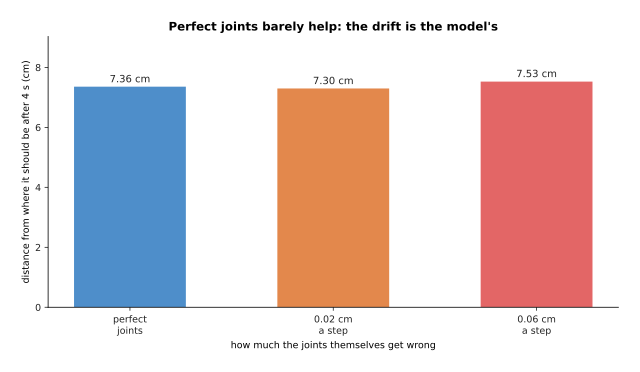
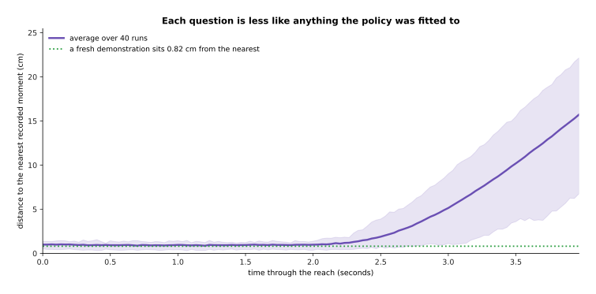
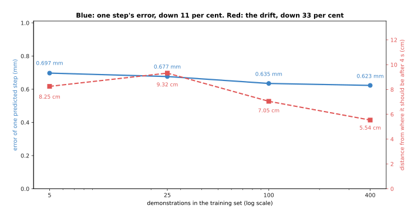
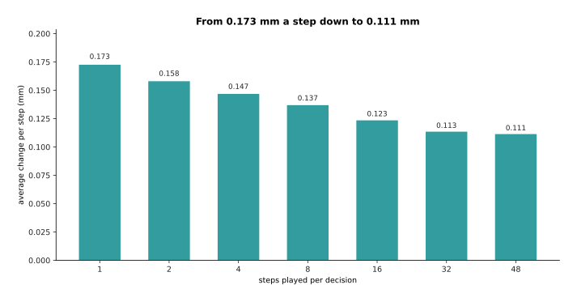
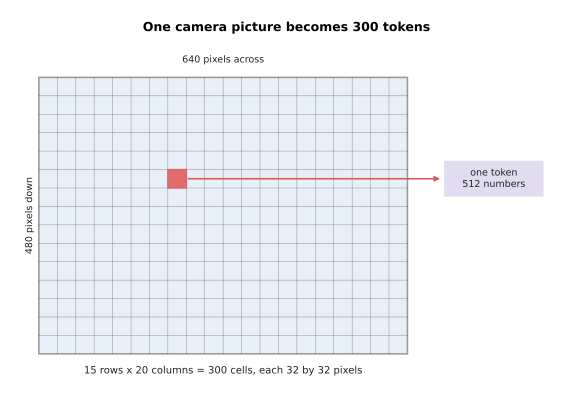
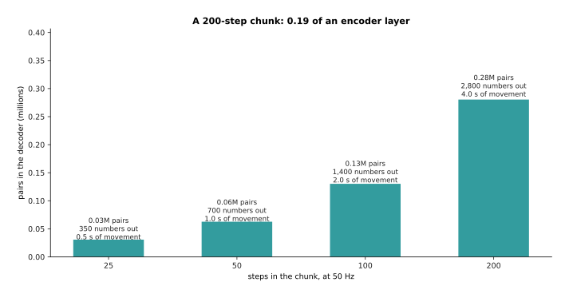
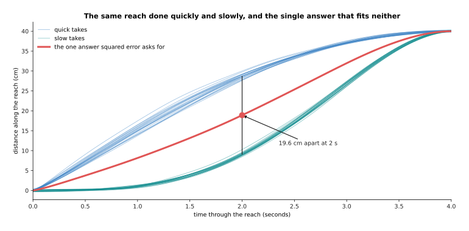
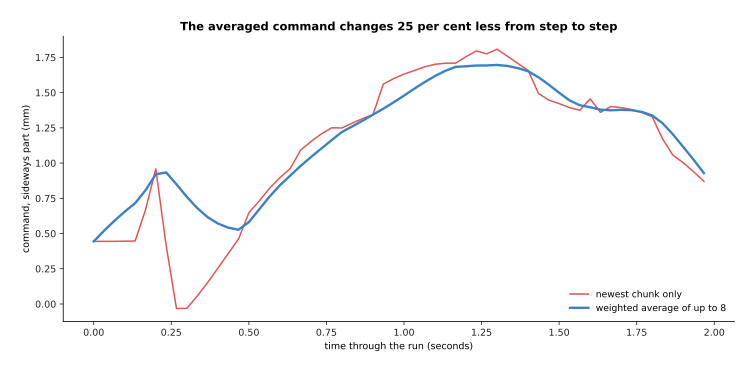

# Behaviour cloning and action chunks

The page before this one, [rewards, preferences and
verifiers](../11_learning-from-outcomes/02_rewards-preferences-and-verifiers.md),
was about the hardest part of learning from outcomes, which is saying what a good
outcome is. This page uses a different method. A person does the task properly a
few dozen times while the robot records everything, and the model is then trained
to copy that person. The method is called **behaviour cloning**, and most working
robot arms are driven this way today. Nothing in it scores the robot, and nothing
in it searches for a better movement, because the recorded movements are already
the answers the model has to learn.

This is the first page in this book where what comes out of the model is a
movement. Everything before it produced an answer that a person reads, while this
output goes directly to the joints of an arm.

By the end of the page you will know four things. You will know what a policy puts
out and in what units. You will know how the training data is recorded and what it
costs in human time. You will know why a policy that copies a person one step at a
time slowly goes wrong, even though each single step it predicts is good. Finally
you will know what an action chunk is, why it helps, and how long it should be.

The page is written for a reader who has read [what the words
mean](../01_what-learning-means/06_the-words-everyone-uses.md), so that supervised
learning, a label and a training set are familiar, and who has read [pictures,
sound and robot
states](../05_turning-the-world-into-numbers/02_pictures-sound-and-robot-states.md),
which explains how a camera picture and a joint reading become numbers and what an
action space is. Section 5 also uses the transformer from
[attention](../06_the-transformer/01_attention.md), but only its shape.

Every number in the pictures below is worked out and printed by
`docs/diagrams/models_that_act_1.py`. The arm and the recordings are simulated.
However, the policy fitted to them is a real program, and the failures it shows
are the ones people meet on real arms.

## Contents

1. [What a policy is, and what comes out of it](#1-what-a-policy-is-and-what-comes-out-of-it)
2. [Behaviour cloning is supervised learning on recorded moments](#2-behaviour-cloning-is-supervised-learning-on-recorded-moments)
3. [Why copying one step at a time drifts](#3-why-copying-one-step-at-a-time-drifts)
4. [Playing a chunk of the future instead of one step](#4-playing-a-chunk-of-the-future-instead-of-one-step)
5. [The action-chunking transformer](#5-the-action-chunking-transformer)
6. [How long a chunk should be](#6-how-long-a-chunk-should-be)
7. [Where to read next](#7-where-to-read-next)
8. [Using it in Python](#8-using-it-in-python)

---

## 1. What a policy is, and what comes out of it

The introduction said that what comes out of this model is a movement. The model
that produces one has a name of its own. A **policy** is a model that takes what
the robot can sense right now and gives back what the robot should do right now.
The robot asks the policy that question again and again while the arm moves. The
word comes from [reinforcement
learning](../11_learning-from-outcomes/01_reinforcement-learning.md), where it
means the same thing. The only difference here is that this policy is trained by
copying a person.

What the policy gives back is a short list of ordinary numbers. There is one
number for each thing the arm can move. A common small arm has six joints and a
gripper, so the answer is seven numbers. Each of those numbers is rescaled to run
from -1 to +1. The picture below shows one such answer twice: on the left are the
six joint readings in degrees inside the limits of their joints, and on the right
are the same readings after rescaling, with the gripper added.


The base joint is at +44.62 degrees inside a range of -170 to +170 degrees, so it
becomes +0.262 after rescaling. The other six numbers are worked out in the same
way.

The rescaling matters because of the way the model is scored. The loss adds the
error of all seven numbers into one total. A joint measured in degrees moves over
hundreds of units, while the gripper signal only moves between 0 and 1. If the
numbers are left in those units, the joint errors make up nearly the whole total
and the gripper error makes almost no difference to it. The next picture measures that
exactly. It supposes that the policy is wrong by one per cent of each output's own
range, and it then draws what share of the total each output is responsible for.
The red bars are the shares in raw units and the blue bars are the shares after
rescaling.


In raw units the base joint is responsible for 19.78 per cent of the total and the
gripper for 0.00017 per cent. After rescaling every output has the same range, so
each of the seven is responsible for exactly 14.29 per cent. The gripper's share
therefore grows by a factor of 83,500.

Without that rescaling the training would spend nearly all of its effort on the
joints and almost none on the gripper. That is the wrong place to spend it,
because section 2 shows that the moment the gripper closes is the part of the task
that most often goes wrong.

The second thing to be exact about is when the answer is wanted. The arm asks for
a new command at a fixed rate, and that rate sets the time budget for everything
the model does. The picture below puts the same three pieces of work inside three
different budgets, one above the other.


The same 21 milliseconds of work leaves 12.33 milliseconds spare in a loop that
runs 30 times a second. It leaves 79 milliseconds spare at 10 times a second.
However, it arrives 1.0 millisecond late at 50 times a second.

Nothing about the model changes between those three rows, and yet in one of them
the robot is already late. Section 4 answers that problem by producing more than
one command per pass through the model.

The third thing to be exact about is how a command is written down. One way is to
send the place the joint should move to, which is called an absolute command. The
other way is to send the change from where the joint is now, which is called a
delta command. The picture below takes one recorded elbow movement and draws it
both ways, with the absolute version above and the delta version below.


The same recorded elbow movement covers 105.46 degrees when it is written as places
to move to. The largest single change between one reading and the next is only
2.365 degrees, and the whole range of those changes is 4.37 degrees, which is
twenty-four times smaller.

Each way of writing the command has a cost. An absolute command carries no record
of what happened before it, so a small mistake in one command does not stay in the
arm. A delta command gives numbers in a much smaller range, which is easier for a
network to produce accurately. However, a delta command adds every mistake to the
arm's position permanently, because the arm only ever moves by what it is told.

---

## 2. Behaviour cloning is supervised learning on recorded moments

Now that the output is fixed, the training is the simplest kind there is. A person
drives the arm through the task. They usually do this by **teleoperation**, which
means that they move a small copy of the arm or a handle, and the real arm follows
what they do. While they work, the robot records a camera picture, its own joint
readings and what the person did next, many times a second. One **demonstration**,
also called an episode, is one recorded attempt at the task from start to finish.

The training is then supervised learning, as described in [what the words
mean](../01_what-learning-means/06_the-words-everyone-uses.md). The input of one
example is what the robot could see and the state it was in. The label is the
action the person made at that moment. The model is trained to make its answer
close to the label by squared error, which is the loss from [the score of being
wrong](../03_how-training-works/01_the-score-of-being-wrong.md). There is no
reward, no search and no simulator anywhere in it.

The picture below counts one such example for an arm with two cameras. The boxes
on the left are the three things recorded at one moment, and the two boxes on the
right are the question put to the model and the answer it must give.


One example from a two-camera arm is 1,843,207 numbers of question and 7 numbers of
answer, so the pictures are 99.9992 per cent of it.

Those numbers come out as follows. Each camera frame of 480 rows by 640 columns in
three colours is 921,600 numbers, so two of them come to 1,843,200. The seven joint
readings bring the question to 1,843,207, and the answer is seven numbers. Almost
everything the model reads is picture, which is why the camera part of the model is
the expensive part.

One demonstration gives a great many examples, because every recorded moment in it
is one example. The picture below draws a whole episode, with the six joint angles
above and the gripper signal below.


A simulated episode of 12 seconds recorded 30 times a second holds 360 moments, so
one episode is 360 training examples.

The gripper line falls once, five seconds into the episode. That single closing is
the part of the task that most often goes wrong, because being one centimetre out
at that moment means that nothing is picked up at all.

Many episodes therefore give many examples, and the next picture counts them. Both
axes use a logarithmic scale, which means that each step along an axis multiplies
the value rather than adding to it.


Fifty episodes give 18,000 examples, and a thousand episodes give 360,000.

Those examples have to be stored somewhere, and the camera frames are nearly all of
the storage. The next picture compares three ways of counting the same fifty
episodes, again on a logarithmic scale.



Fifty episodes are 33.18 gigabytes of raw camera frames. Stored as video at a
compression ratio of 40 to 1 they are 0.83 gigabytes. All the joint and action
numbers together come to only 1.01 megabytes.

One fact explains most of the design choices in this chapter. Every one of those
18,000 examples is a person moving an arm in real time. The next picture breaks
down where that time goes during one recording session.


The count takes 12 seconds of movement, 20 seconds to put the objects back and 8
seconds to check and save the recording, and it throws away one take in six. On
those figures 50 usable episodes cost 50 minutes of somebody's day, and only 12 of
those minutes are arm movement.

Larger training sets cost proportionally more of that day, and the next picture
follows the same arithmetic up to five thousand episodes.



That rate works out at 21,600 examples an hour. A thousand episodes therefore cost
13.5 hours and five thousand cost 66.8 hours, which is about two working weeks for
one person on one task on one robot. The text and pictures used by the models
earlier in this book are collected from the web by the billion. Robot data cannot
be collected that way, because somebody has to move the arm for every example.

---

## 3. Why copying one step at a time drifts

The training in section 2 is honest supervised learning, and yet a model fitted
that way can still fail on the robot. This section shows that failure happening
and gives it a name, because it is the central problem of behaviour cloning.
Everything after it on this page is a response to it.

The simulated task is a four-second reach of about 40 centimetres across a table,
recorded 30 times a second, which gives 120 steps. The demonstrator starts in
roughly the same place each time. They swing the gripper out on a curve of varying
size, they aim at a goal that moves a little from take to take, they vary their
speed, and their hand shakes slightly. The policy is fitted to 100 of those
demonstrations, and it writes its answer as a change rather than a place.


Over 40 runs the policy ends on average 7.65 centimetres from where it should be.
The best run is 0.26 centimetres out and the worst is 20.22 centimetres out.

Each single prediction is good. The error of one predicted step, measured on
demonstrations the policy was not fitted to, is only 0.623 millimetres. The trouble
is what those small errors do to each other over 120 steps, and the next picture
follows the error as the reach goes on.


The error climbs to 7.65 centimetres by four seconds. The dotted line shows where
the error would be if each step's mistake were unrelated wobble, and the real
error ends 2.53 centimetres above it.

There is a second thing the error could be, which is noise in the motors
themselves. A real joint does not move exactly as far as it is told. The next
picture turns that noise down to nothing and up to three times its usual size, and
measures the drift in each case.



Turning the joints' own error off entirely leaves the drift at 7.36 centimetres,
which is almost unchanged.

Those two pictures together say where the error comes from. It is not noise in the
motors, because perfect motors barely change it. It is also not a pile of
independent mistakes, because independent mistakes would grow like the square root
of the number of steps, and this grows faster than that. The mistakes must
therefore point the same way, and they do so because of what each one does to the
next question. The next picture colours one run by how unfamiliar its input was at
each moment.


The dots start pale, where the policy is being asked about situations very like the
recorded ones. They end dark red, far outside the cloud of recorded moments. The
next picture measures that same distance over time, averaged over all 40 runs.



The questions start about 1 centimetre from the nearest recorded moment, and a
fresh demonstration also sits at 0.82 centimetres from one. By four seconds the
policy's own questions are 15.72 centimetres away, which is nineteen times further
out.

That is the whole mechanism, and it is worth stating slowly. A small error moves
the arm slightly off the states the demonstrations covered. The next question is
therefore asked about a situation nobody ever recorded. The model's answer there is
worse, because it was never trained there. That worse answer then moves the arm
further off still. This is called **covariate shift**, which means that the inputs
the model meets while running come from a different spread than the inputs it was
trained on. Here the policy itself is what shifted them.

It is natural to think that more demonstrations will fix this. They help, but much
less than you would hope. The next picture fits the same policy to four training
sets of different sizes and runs each of them.


All four curves have the same climbing shape. The curve for 400 demonstrations is
the lowest of the four, but the curve for 25 demonstrations is above the curve for
5, so more data does not even help reliably. It certainly never flattens the curve.
The next picture measures the gain directly, with the error of one predicted step
in blue on the left axis and the drift after four seconds in red on the right
axis.



Going from 5 demonstrations to 400 is eighty times the data, and 28,800 recorded
moments. That takes the error of one predicted step from 0.697 to 0.623
millimetres, and the drift at four seconds from 8.25 to 5.54 centimetres.

More data makes each answer a little better, but it cannot change the shape of the
problem, because the policy still visits states that no amount of ordinary
demonstrating covers. Those states are exactly the ones a person never gets into,
since a person corrects a mistake before it grows. The fixes that work are
therefore not about collecting more of the same.

---

## 4. Playing a chunk of the future instead of one step

The last section ended with errors growing once per decision. That suggests a
simple fix, which is to make fewer decisions. An **action chunk** is a block of
future actions worked out in one go. Instead of asking the model for the next
command alone, the robot asks for the next several dozen commands and plays them
one after another before asking again.

The picture below cuts the same four-second reach into decisions four times over,
with a longer chunk on each row.


The same four-second reach takes 120 decisions when one step is played per
decision. It takes 30 decisions when four steps are played, 8 when sixteen are
played and 3 when forty-eight are played.

Each mark on those timelines is a place where the model can be wrong about a
situation the arm has drifted into. Cutting 120 of those marks down to 8 therefore
cuts the number of chances the error has to feed itself. In the four runs measured
below the policy and the training data are identical, and the only change is how
many steps are played before the model is asked again.


Playing one step per decision ends 7.65 centimetres out. Four steps ends 6.78
centimetres out, sixteen ends 6.11 centimetres out and forty-eight ends 5.62
centimetres out.

A second gain matters just as much on real hardware. The robot's reading of where
it is comes from a camera and is never exact. A policy that decides at every step
turns that measurement noise straight into a shaky command. A policy that plays a
chunk decides once and then follows commands that were worked out together, so
those commands agree with each other. The next picture measures how much the
command changes from one step to the next, for a chunk of 1 against a chunk of 16.


The red line moves constantly, because every step is a fresh decision. The blue
line is flat between the spikes, and each spike is the moment where one chunk ends
and the next begins. The next picture averages that change over the whole run for
seven different chunk lengths.



The command changes by 0.173 millimetres from one step to the next when one step is
played per decision, and by 0.111 millimetres when forty-eight are played.

Those spikes are the cost of the idea in its simplest form, because the arm has
been following one plan and is then handed another. The deeper cost is that a chunk
is decided long before most of it is played, so the robot carries on with an old
plan while the world changes. Section 6 measures both of those costs.

---

## 5. The action-chunking transformer

Section 4 showed why a chunk helps, but it did not say which model produces one.
The standard answer is the **action-chunking transformer**, usually shortened to
**ACT**. Its input is several camera pictures together with the arm's joint
readings, and its output is one whole block of future joint targets. It became the
usual starting point for arm policies because it learns a fine two-handed task from
about fifty demonstrations, and section 2 measured fifty episodes at fifty minutes
of one person's day.

The arrangement is the encoder and decoder pair from [a transformer
block](../06_the-transformer/02_a-transformer-block.md). Each camera picture first
goes through a small convolutional network called ResNet-18, which is the kind of
network described in [vision
backbones](../09_models-that-see/01_vision-backbones.md), and which turns the
picture into a grid of cells. Every cell from every camera then becomes one token, and the
joint readings become one more token. The encoder lets all of those tokens look at
each other. The decoder holds one slot for each future step, and it turns each slot
into a full set of joint targets.

The picture below counts every shape in that arrangement for the two-armed robot
ACT was built for.


On that robot each 480 by 640 picture becomes a 15 by 20 grid of 300 cells. Four
cameras therefore give 1,200 picture tokens. Two more tokens carry the joint
readings and the style setting, so there are 1,202 tokens of 512 numbers each,
which comes to 615,424 numbers going into the encoder.

The step from a picture to 300 tokens is worth seeing on its own, because it is
where nearly all of the tokens come from. The picture below draws one camera frame
with that grid laid over it.



Each cell covers 32 by 32 pixels of the frame, and each cell becomes one token of
512 numbers. One camera therefore produces 300 tokens on its own.

The decoder's 100 slots give 14 numbers apiece, so one answer is 1,400 numbers. That
robot records 50 readings a second, so those 100 steps cover 2.00 seconds of
movement. A transformer of that shape, with four encoder layers, seven decoder
layers and 512-wide tokens, holds 55,033,742 weights, and the picture encoders are
on top of that number.

Where that work goes explains why chunking is nearly free and cameras are not.
Attention compares every token with every other token, so its cost is the square of
the number of tokens, as [attention](../06_the-transformer/01_attention.md)
explains. The next picture counts those comparisons as the number of cameras grows.


Going from one camera to two takes the encoder from 91,204 token pairs to 362,404,
which is very nearly four times as many.

A longer chunk is counted the same way, and the next picture does that for the
decoder.



A chunk of 200 steps gives the decoder 280,400 pairs, which is 0.19 of what a single
encoder layer already does.

So each extra camera is expensive and each extra future step is cheap. That is the
practical reason action chunking became popular: it buys the smoothness and the
robustness of section 4 for almost no extra computation.

What the decoder produces is a block of numbers, and that block is a plan. The
picture below draws one such block twice: on the left as a grid of 100 steps by 14
joints, and on the right as two of its rows read as movement over time.


Read as movement, this simulated chunk turns the elbow steadily and shuts the
gripper 1.2 seconds ahead of the present moment.

The real version of ACT adds one more part, and that part exists during training
only. A second small network reads the block of actions the person actually made,
and it sums up how they did it that time in a few numbers. The main network gets
those few numbers as an extra input, so it does not have to blend a fast
demonstration and a slow one into a single answer. The picture below shows why that
blending would be a problem.



Two seconds into the same simulated reach, the quick takes are 28.7 centimetres
along and the slow takes are 9.1 centimetres along. One answer trained by squared
error sits at 18.9 centimetres, which is 9.8 centimetres behind the quick takes and
9.8 centimetres ahead of the slow ones. It matches neither group.

The extra numbers let the network answer the question "how was this particular take
done?" instead of averaging the takes together. When the robot runs, those numbers
are set to zero, which stands for the most ordinary way of doing the task. The
[action chunking transformers
page](../../07_learned-models/06_movement-models/02_most-used/02_action-chunking-transformers.md)
of the catalogue gives the published versions and what they were tested on.

---

## 6. How long a chunk should be

Section 4 left two problems open. The first is the jump where one chunk hands over
to the next. The second is that a chunk is decided long before most of it is
played. Both of those problems depend on how many steps are played before the model
is asked again.

The jump is dealt with by **temporal ensembling**. That means asking the model for
a fresh chunk at every step, and then averaging all the chunks that have something
to say about the step being played now. The chunk worked out this step covers the
next forty-eight steps. The chunk worked out last step covers forty-seven of those
same steps, and so on. Several blocks therefore always hold a guess for the command
that is about to be sent. The picture below takes one step of a simulated run and
draws all the guesses in hand for it.


At that step the eight chunks in hand give guesses from 1.617 to 1.758 millimetres,
and their weighted average is 1.690 millimetres.

Averaging that way smooths the command, and the next picture shows the effect over
a whole run.



Averaging this way makes the command change 24.8 per cent less from step to step.

The weights fall off with the age of the chunk, and how fast they fall is a setting
you choose. The next picture draws the eight weights at three values of that
setting, which is written as the letter m.


At the usual setting of 0.01 the newest chunk gets 0.1294 of the command and the
oldest gets 0.1207, a difference of 7.3 per cent, so this is very close to a plain
average. At a setting of 0.8 the newest chunk alone gets 0.552 of the command.

A nearly flat set of weights smooths the most, and it also makes the arm slowest to
react. That is because a change the model has only just noticed is outvoted seven
to one by chunks that were worked out before it noticed. The chunk length itself
has the same trade. The test for it is to move the goal eight centimetres sideways
at step 50 of the 120, and then to see how far from the new goal the arm ends up. The picture below measures both costs at seven chunk lengths and adds them
together.


With nothing changing, the drift falls from 7.65 centimetres at one step per
decision to 5.62 centimetres at forty-eight. When the goal moves, the miss rises
from 6.49 centimetres to 10.03 centimetres, because at forty-eight steps the arm
carries on for 1,600 milliseconds before it even looks again.

Adding the two costs together puts the best point at eight steps per decision,
which is 267 milliseconds of movement. That exact number belongs to this simulated
task and to nothing else. The shape of the curve is general, however, and it is why
real systems work out a long chunk and then play only the first part of it before
working out the next. That arrangement has a name and a timing budget of its own,
and it is the second half of the next page.

---

## 7. Where to read next

- [Diffusion and flow policies](02_diffusion-and-flow-policies.md) is the next
  page, and it fixes the one thing this page could not, which is what a policy
  should do when two different movements are both correct.
- [Vision-language-action models](03_vision-language-action-models.md) attaches the
  chunk of actions built here to a model that has also read the web, so that the
  arm can be told what to do in a sentence.
- [World models](04_world-models.md) is the other way out of covariate shift,
  because a model that predicts what happens next can be practised against with
  nobody in the room.
- [Behaviour
  cloning](../../07_learned-models/06_movement-models/02_most-used/01_behaviour-cloning.md)
  in the catalogue of movement models lists the published policies of this kind
  and what each costs to run.
- [Actions and
  observations](../../07_learned-models/06_movement-models/02_most-used/04_actions-and-observations.md)
  goes through every choice about what to feed a policy and what to ask it for.

---

## 8. Using it in Python

Section 1 rescaled one joint reading, section 4 turned one command into a block and
section 6 averaged overlapping blocks. All three of those are a few lines of
PyTorch. The code below does them in that order, on a model with the shapes of
section 5. It builds only the decoder head, because the camera encoder in front of
it is an ordinary convolutional backbone.

```python
import torch
from torch import nn

LO = torch.tensor([-170., -120., -170., -120., -170., -175.])   # section 1
HI = -LO
reading = torch.tensor([44.62, -38.51, -3.28, -2.88, -51.52, 32.04])
print((2 * (reading - LO) / (HI - LO) - 1)[0].item())           # 0.26247...

CHUNK, JOINTS, WIDTH = 100, 14, 512                             # section 5
head = nn.Linear(WIDTH, JOINTS)
slots = torch.zeros(1, CHUNK, WIDTH)        # what the decoder gives, one row a step
block = head(slots)
print(tuple(block.shape), block.numel())                        # (1, 100, 14) 1400

target = torch.zeros_like(block)            # the next 100 recorded actions
loss = nn.functional.l1_loss(block, target)  # one number out of all 1,400 at once
print(tuple(loss.shape), block.numel())                         # () 1400

m = 0.01                                                        # section 6
w = torch.exp(-m * torch.arange(8.0))
w = w / w.sum()
print(round(w[0].item(), 4), round(w[-1].item(), 4))             # 0.1294 0.1207
guesses = torch.tensor([1.758, 1.758, 1.730, 1.730, 1.675, 1.620, 1.619, 1.617])
print(round((w * guesses).sum().item(), 3))                      # 1.69
```

The library gives you the parts and none of the arrangement. `nn.Linear` turning
512 numbers into 14 is the whole of the output head. The fact that there are 100 of
those heads side by side is what makes the answer a chunk rather than a single
step, so chunking costs one extra dimension on a tensor and nothing else. The loss
is the ordinary one, either `l1_loss` or `mse_loss`, taken over all 1,400 numbers
at once. That is why a chunked policy is trained by exactly the code that trains an
unchunked one.

What you have to decide is everything this page measured. You decide how many steps
the chunk covers and how many of them you play before asking again, which section 6
showed pulling in opposite directions. You decide whether the action is a place or
a change, which section 1 showed changes whether a mistake stays in the arm. You
also decide the weights for temporal ensembling, where flatter weights are smoother
and slower.

The one thing a library cannot give you is the data. A ready-made framework such as
LeRobot will record episodes, store the video, fit an action-chunking transformer
and run it on the arm. It still cannot shorten the 50 minutes that 50 episodes take
out of somebody's day. That is why the next page is about getting more out of the
same recordings rather than about a bigger network.
