# Behaviour cloning and action chunks

The page before this one, [rewards, preferences and
verifiers](../11_learning-from-outcomes/02_rewards-preferences-and-verifiers.md),
was about the hardest part of learning from outcomes, which is saying what a good
outcome is. This page takes the other road. Instead of scoring what the robot
does and letting it search for something better, a person does the task properly a
few dozen times while the robot records everything, and the model is trained to
copy them. That is called **behaviour cloning**, and it is how most working robot
arms are driven today.

This is the first page in this book where what comes out of the model is a
movement, and everything before it produced an answer that somebody looks at,
while this output goes straight into the joints of an arm.

It is written for a reader who has read [what the words
mean](../01_what-learning-means/02_the-words-everyone-uses.md), so that supervised
learning, a label and a training set are familiar, and who has read [pictures,
sound and robot
states](../05_turning-the-world-into-numbers/02_pictures-sound-and-robot-states.md),
which explains how a camera picture and a joint reading become numbers and what an
action space is. Section 5 also uses the transformer from
[attention](../06_the-transformer/01_attention.md), but only its shape.

Every number in the pictures below is worked out and printed by
`docs/diagrams/models_that_act_1.py`. The arm and the recordings are simulated,
but the policy fitted to them is real and the failures it shows are the ones
people hit on real arms.

## Contents

1. [What a policy is, and what comes out of it](#1-what-a-policy-is-and-what-comes-out-of-it)
2. [Behaviour cloning is supervised learning on recorded moments](#2-behaviour-cloning-is-supervised-learning-on-recorded-moments)
3. [Why copying one step at a time drifts](#3-why-copying-one-step-at-a-time-drifts)
4. [Playing a chunk of the future instead of one step](#4-playing-a-chunk-of-the-future-instead-of-one-step)
5. [The action-chunking transformer](#5-the-action-chunking-transformer)
6. [How long a chunk should be](#6-how-long-a-chunk-should-be)
7. [Where to read next](#7-where-to-read-next)
8. [Using it in Python](#8-using-it-in-python)

---

## 1. What a policy is, and what comes out of it

The introduction said that what comes out of this model is a movement, and the
model that produces one has a name of its own. A **policy** is a model that takes
what the robot can sense right now and gives back what it should do right now, and
it is asked that question again and again while the arm moves. The word comes
from [reinforcement
learning](../11_learning-from-outcomes/01_reinforcement-learning.md), where it
means the same thing, and the only difference here is that this policy is trained
by copying a person.

What it gives back is a short list of ordinary numbers, one for each thing the arm
can move, so for a common small arm of six joints and a gripper the answer is
seven numbers, each rescaled to run from -1 to +1 so that no joint counts for more
than another simply because it swings further.

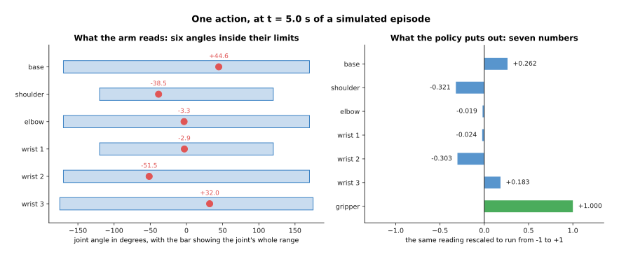

The base joint is at +44.62 degrees inside a range of -170 to +170 degrees, which
becomes +0.262 after rescaling, and the other six numbers are worked out the same
way.

That rescaling matters because the loss adds up the error over all seven numbers,
so an unscaled joint would quietly take over that sum. The second thing to be
exact about is when the answer is wanted, because the arm asks for a new command
at a fixed rate and that rate sets the budget for everything the model does.

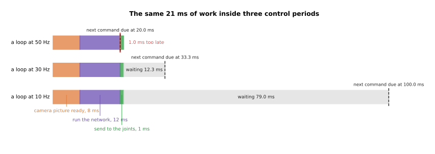

The same 21 milliseconds of work leaves 12.33 milliseconds spare in a loop running
30 times a second, leaves 79 milliseconds spare at 10 times a second, and arrives
1.0 millisecond late at 50 times a second.

Nothing about the model changes between those rows, and yet in one of them the
robot is already late, and section 4 answers that by producing more than one
command per pass. The third thing is how a command is written down, because one
way is to send the place the joint should go to and the other is to send the
change from where it is now.

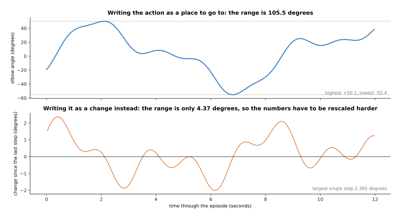

The same recorded elbow movement covers 105.46 degrees when it is written as
places to go to, and the largest single change between one reading and the next is
only 2.365 degrees.

A command that says where to end up holds no memory of what happened before, so a
small mistake does not stay in the arm, while a command that says how far to move
gives numbers twenty-four times smaller in range, at the price that every mistake
is added to the arm's position for good.

---

## 2. Behaviour cloning is supervised learning on recorded moments

Now that the output is pinned down, the training is the plainest kind there is. A
person drives the arm through the task, usually by **teleoperation**, which means
they move a small copy of the arm or a handle and the real arm follows, while the
robot records a camera picture, its own joint readings and what the person did
next, many times a second. One **demonstration**, also called an episode, is one
recorded attempt at the task from start to finish.

The training is then supervised learning, as described in [what the words
mean](../01_what-learning-means/02_the-words-everyone-uses.md): the input of one
example is what the robot could see and the state it was in, the label is the
action the person made at that moment, and the model is trained to make its answer
close to the label by squared error, which is the loss from [the score of being
wrong](../03_how-training-works/01_the-score-of-being-wrong.md). There is no
reward, no search and no simulator anywhere in it.

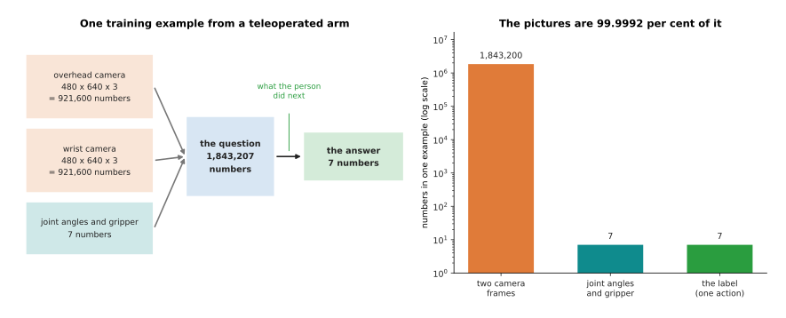

One example from a two-camera arm is 1,843,207 numbers of question and 7 of
answer, and the pictures are 99.9992 per cent of it.

Each camera frame of 480 rows by 640 columns in three colours is 921,600 numbers,
two of them come to 1,843,200, and the seven joint readings bring the question to
1,843,207 against an answer of seven. Almost everything the model reads is
picture, which is why the camera part of the model is the expensive part. One
demonstration gives a great many examples, because every moment in it is one.

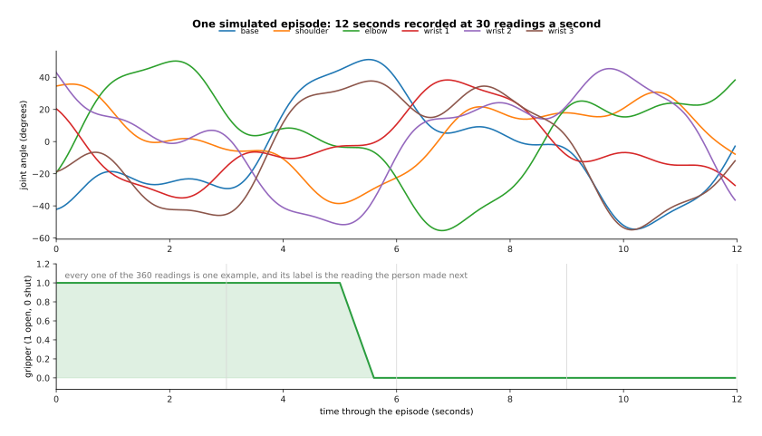

A simulated episode of 12 seconds recorded 30 times a second holds 360 moments, so
one episode is 360 training examples.

The gripper line shuts once, five seconds in, and that single closing is the part
of the task that most often goes wrong, because being a centimetre out there means
nothing is picked up at all.

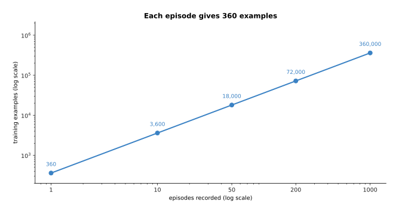

Fifty episodes give 18,000 examples, which is 33.18 gigabytes of raw camera frames,
or 0.83 gigabytes once the frames are stored as video at a ratio of 40 to 1, while
all the joint and action numbers together come to 1.01 megabytes.

One fact explains most of the design choices in this chapter, which is that every
one of those 18,000 examples is a person moving an arm in real time.

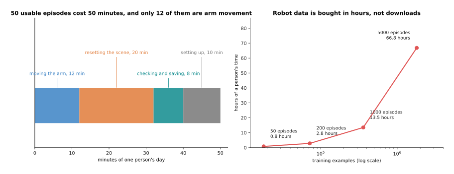

Taking 12 seconds of movement, 20 seconds to put the objects back and 8 seconds to
check and save, and throwing away one take in six, 50 usable episodes cost 50
minutes of somebody's day, of which only 12 minutes is arm movement.

That works out at 21,600 examples an hour, so a thousand episodes is 13.5 hours
and five thousand is 66.8 hours, which is a working fortnight for one person on
one task on one robot. Text and pictures for the models earlier in this book are
collected by the billion from the web, and robot data is bought in hours.

---

## 3. Why copying one step at a time drifts

The training in section 2 is honest supervised learning, and a model fitted that
way can still fail on the robot. This section shows that failure happening and
names it, because it is the central problem of behaviour cloning and everything
after it is a response.

The simulated task is a four-second reach of about 40 centimetres across a table,
recorded 30 times a second, so 120 steps. The demonstrator starts in roughly the
same place each time, swings out on an arc of varying size, aims at a goal that
moves a little from take to take, varies their speed and shakes slightly. The
policy is fitted to 100 of those demonstrations and writes its answer as a change
rather than a place.

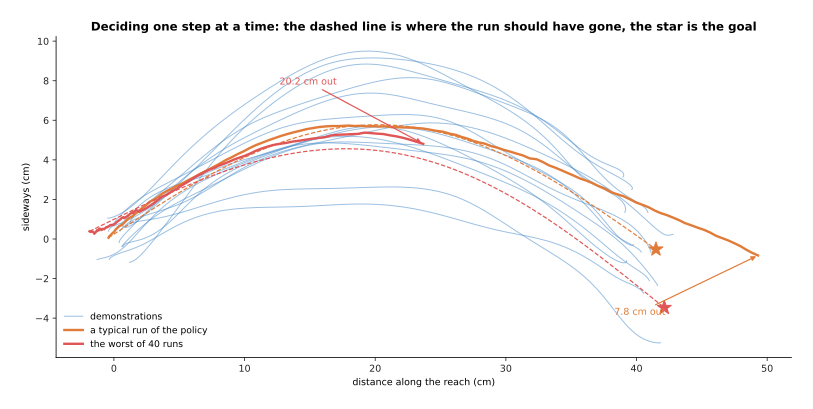

Over 40 runs the policy ends on average 7.65 centimetres from where it should be,
with the best run 0.26 centimetres out and the worst 20.22 centimetres out.

Each single prediction is good, because the error of one predicted step on
demonstrations the policy was not fitted to is 0.623 millimetres. The trouble is
what those small errors do to each other over 120 steps.

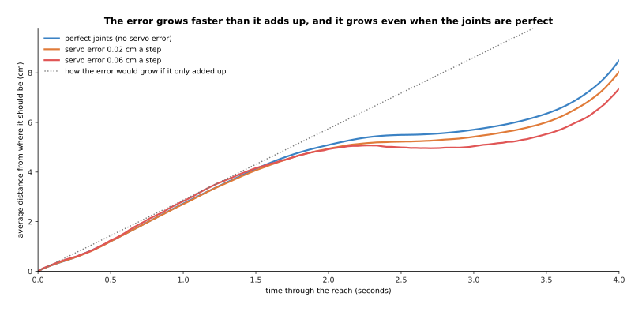

The error climbs to 7.65 centimetres by four seconds, which is 2.53 centimetres
more than it would be if each step's mistake were unrelated wobble, and turning
the joints' own error off entirely leaves it at 7.36 centimetres.

Those two facts say where the error comes from. It is not noise in the motors,
because perfect motors barely change it, and it is not independent mistakes adding
up, because those would grow like the square root of the number of steps while
this grows faster. The mistakes point the same way, because of what each one does
to the next question.

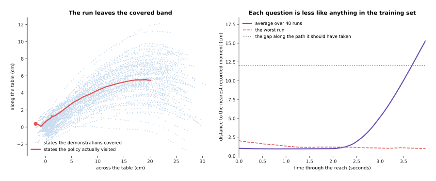

The questions start about 1 centimetre from the nearest recorded moment, where a
fresh demonstration also sits at 0.82 centimetres, and by four seconds they are
15.72 centimetres away, nineteen times further out.

That is the whole mechanism. A small error moves the arm slightly off the states
the demonstrations covered, so the next question is asked about a situation nobody
ever recorded, the model's answer there is worse because it was never trained
there, and that worse answer moves the arm further off still. This is called
**covariate shift**, which means the inputs the model meets while running come
from a different spread than the inputs it was trained on, and here the policy
itself is what shifted them.

It is tempting to think more demonstrations will fix this, and they help much less
than you would hope.

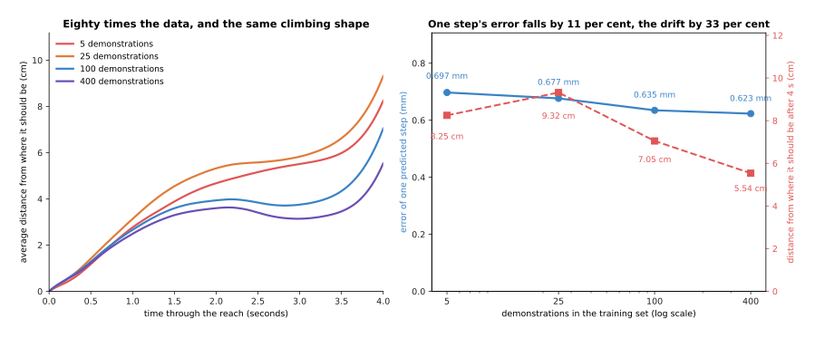

Going from 5 demonstrations to 400, which is eighty times the data and 28,800
recorded moments, takes the error of one predicted step from 0.697 to 0.623
millimetres and the drift at four seconds from 8.25 to 5.54 centimetres.

More data makes each answer a little better but cannot change the shape of the
problem, because the policy still visits states that no amount of ordinary
demonstrating covers. Those states are exactly the ones a person never gets into,
since a person corrects a mistake before it grows, so the fixes that work are not
about collecting more of the same.

---

## 4. Playing a chunk of the future instead of one step

The last section ended with errors compounding once per decision, which suggests a
blunt fix, which is to make fewer decisions. An **action chunk** is a block of
future actions worked out in one go, so instead of asking the model for the next
command, the robot asks for the next several dozen and plays them one after
another before asking again.

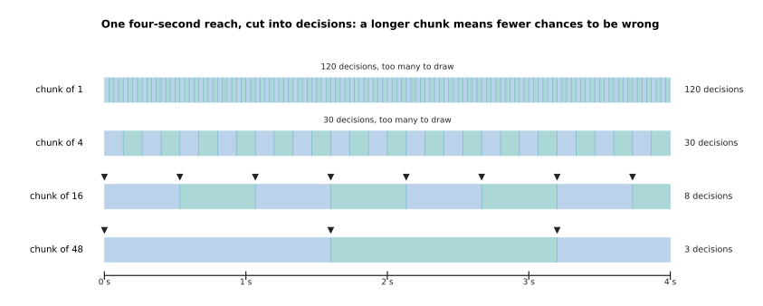

The same four-second reach takes 120 decisions when one step is played per
decision, 30 when four are, 8 when sixteen are and 3 when forty-eight are.

Each mark is a place where the model can be wrong about a situation it has
drifted into, so cutting 120 of them to 8 cuts the chances for the error to feed
itself. In the four runs below the policy and the data are identical, and the
only change is how many steps are played before it looks again.

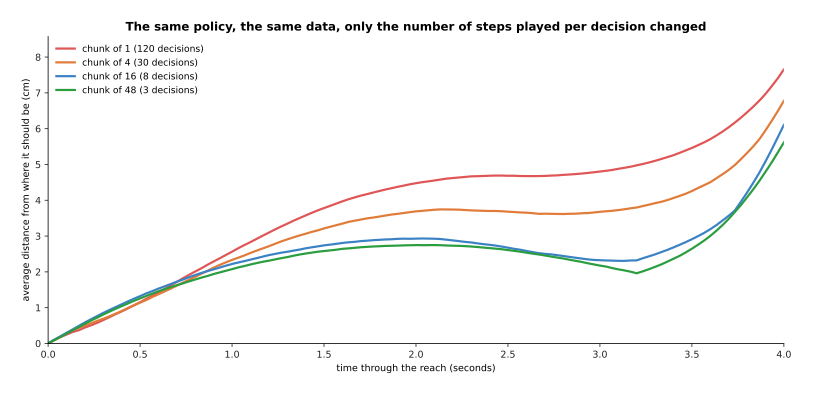

Playing one step per decision ends 7.65 centimetres out, four steps ends 6.78
centimetres out, sixteen ends 6.11 centimetres out and forty-eight ends 5.62
centimetres out.

A second gain matters just as much on real hardware. The robot's reading of where
it is comes from a camera and is never exact, so a policy that decides every step
turns that noise straight into a jittery command, while a policy playing a chunk
decides once and then follows commands that were worked out together and therefore
agree with each other.

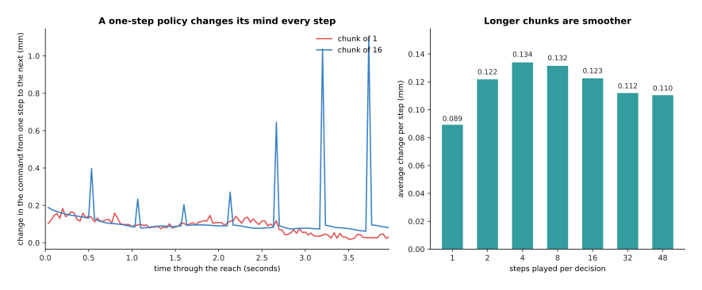

The command changes by 0.173 millimetres from one step to the next when one step
is played per decision and by 0.111 millimetres when forty-eight are, and the
spikes in the blue line are where one chunk ends and the next begins.

Those spikes are the cost of the idea in its simplest form, because the arm has
been following one plan and is handed another, and the deeper cost is that a chunk
is a promise made early. Section 6 measures both.

---

## 5. The action-chunking transformer

Section 4 showed why a chunk helps without saying what model gives one, and the
standard answer is the **action-chunking transformer (ACT)**, whose input is
several camera pictures and the arm's joint readings and whose output is one whole
block of future joint targets. It became the usual starting point for arm policies
because it learns a fine two-handed task from about fifty demonstrations, which is
the ten-minute session section 2 costed out.

The arrangement is the encoder and decoder pair from [a transformer
block](../06_the-transformer/02_a-transformer-block.md). Each camera picture goes
through a small convolutional network, the kind described in [vision
backbones](../09_models-that-see/01_vision-backbones.md), which turns it into a
grid of cells; every cell from every camera becomes one token, the joint readings
become one more, and the encoder lets all of them look at each other, while the
decoder holds one slot for each future step and turns each slot into a full set of
joint targets.

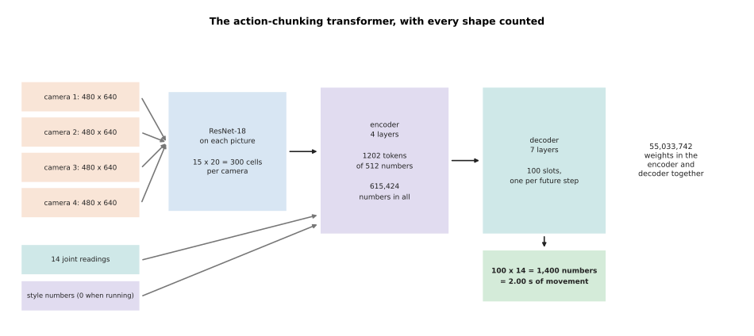

On the two-armed rig this was built for, each 480 by 640 picture becomes a 15 by
20 grid of 300 cells, four cameras give 1,200 picture tokens, two more carry the
joint readings and the style setting, and the 1,202 tokens of 512 numbers each
come to 615,424 numbers going into the encoder.

The decoder's 100 slots give 14 numbers apiece, so one answer is 1,400 numbers
covering the next 2.00 seconds at the 50 readings a second that rig records at. A
transformer of that shape, with four encoder layers, seven decoder layers and
512-wide tokens, holds 55,033,742 weights, with the picture encoders on top of
that, and where that work goes explains why chunking is nearly free and cameras
are not.

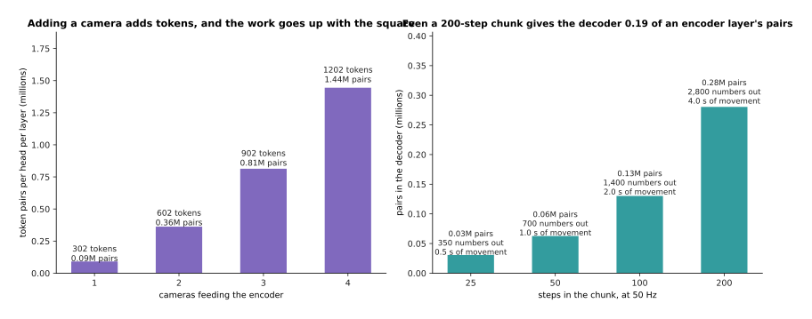

Going from one camera to two takes the encoder from 91,204 token pairs to 362,404,
very nearly four times as many, while a chunk of 200 steps gives the decoder
280,400 pairs, which is 0.19 of what a single encoder layer already does.

Attention costs the square of the number of tokens, as
[attention](../06_the-transformer/01_attention.md) explains, so each extra camera
is expensive while each extra future step is cheap, and that is the practical
reason action chunking caught on.

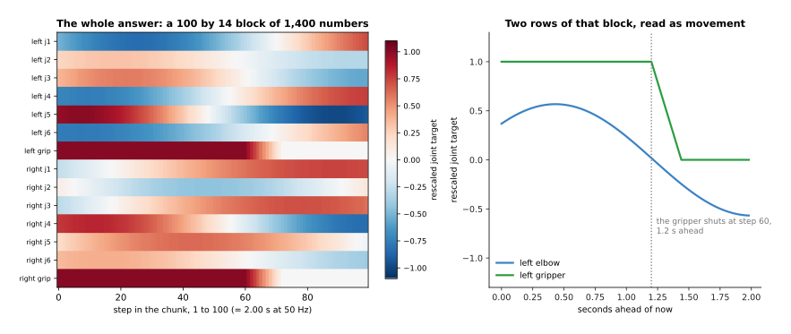

Read as movement the block is a plan, and this simulated chunk turns the elbow
steadily and shuts the gripper 1.2 seconds ahead.

The real version adds one more part during training only, because a second small
network reads the block the person actually made and sums up how they did it that
time in a few numbers, which the main network gets as an extra input so that it
does not have to blend a fast demonstration and a slow one into one answer. When
the robot runs those numbers are set to zero, which stands for the most ordinary
way of doing it. The [action chunking transformers
page](../../07_learned-models/06_movement-models/02_most-used/02_action-chunking-transformers.md)
of the catalogue gives the published versions and what they were tested on.

---

## 6. How long a chunk should be

Section 4 left two problems open, which were the jump where one chunk hands over
to the next and the fact that a chunk is a promise made early, and both depend on
how many steps are played before the model is asked again.

The jump is dealt with by **temporal ensembling**, which means asking the model
for a fresh chunk at every step and averaging all the chunks that have something
to say about the step being played now. The chunk worked out this step covers the
next forty-eight, the one worked out last step covers forty-seven of those, and so
on, so several blocks always hold a guess for the command about to be sent.

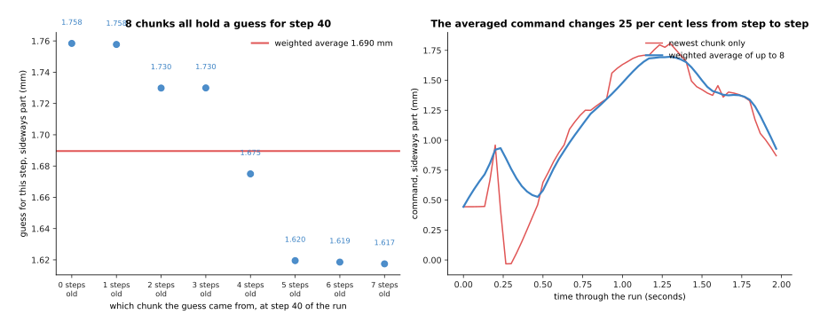

At one step of a simulated run the eight chunks in hand give guesses from 1.617 to
1.758 millimetres, their weighted average is 1.690 millimetres, and averaging this
way makes the command change 24.8 per cent less from step to step.

The weights fall off with the age of the chunk, and how fast they fall is a
setting.

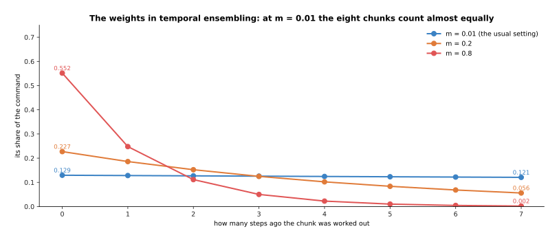

At the usual setting the newest chunk gets 0.1294 of the command and the oldest
gets 0.1207, a difference of 7.3 per cent, so this is very close to a plain
average, while at a setting of 0.8 the newest chunk alone gets 0.552.

A near-flat set of weights smooths the most and makes the arm slowest to react,
because a change the model has only just noticed is outvoted seven to one by
chunks worked out before it noticed. That is the same trade as the chunk length
itself, and the test for it is to move the goal eight centimetres sideways half
way through the reach and see how far from the new goal the arm ends up.

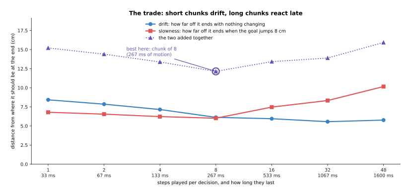

With nothing changing the drift falls from 7.65 centimetres at one step per
decision to 5.62 at forty-eight, and when the goal moves the miss rises from 6.49
centimetres to 10.03, because at forty-eight steps the arm carries on for 1,600
milliseconds before it even looks.

Adding the two costs together puts the best point at eight steps per decision,
which is 267 milliseconds of movement. That exact number belongs to this simulated
task and nothing else, but the shape of the curve is general, and it is why real
systems work out a long chunk and then play only the first part of it before
working out the next. That arrangement has a name and a timing budget of its own,
and it is the second half of the next page.

---

## 7. Where to read next

- [Diffusion and flow policies](02_diffusion-and-flow-policies.md) is the next
  page, and it fixes the one thing this page could not, which is what a policy
  should do when two different movements are both correct.
- [Vision-language-action models](03_vision-language-action-models.md) attaches the
  chunk of actions built here to a model that has also read the web, so that the
  arm can be told what to do in a sentence.
- [World models](04_world-models.md) is the other way out of covariate shift,
  because a model that predicts what happens next can be practised against with
  nobody in the room.
- [Behaviour
  cloning](../../07_learned-models/06_movement-models/02_most-used/01_behaviour-cloning.md)
  in the catalogue of movement models lists the published policies of this kind
  and what each costs to run.
- [Actions and
  observations](../../07_learned-models/06_movement-models/02_most-used/04_actions-and-observations.md)
  goes through every choice about what to feed a policy and what to ask it for.

---

## 8. Using it in Python

Section 1 rescaled one joint reading, section 4 turned one command into a block
and section 6 averaged overlapping blocks, and all three are a few lines of
PyTorch. The code below does them in that order on a model with the shapes of
section 5, building only the decoder head, because the camera encoder in front of
it is an ordinary convolutional backbone.

```python
import torch
from torch import nn

LO = torch.tensor([-170., -120., -170., -120., -170., -175.])   # section 1
HI = -LO
reading = torch.tensor([44.62, -38.51, -3.28, -2.88, -51.52, 32.04])
print((2 * (reading - LO) / (HI - LO) - 1)[0].item())           # 0.26247...

CHUNK, JOINTS, WIDTH = 100, 14, 512                             # section 5
head = nn.Linear(WIDTH, JOINTS)
slots = torch.zeros(1, CHUNK, WIDTH)        # what the decoder gives, one row a step
block = head(slots)
print(tuple(block.shape), block.numel())                        # (1, 100, 14) 1400

target = torch.zeros_like(block)            # the next 100 recorded actions
loss = nn.functional.l1_loss(block, target)  # one number out of all 1,400 at once
print(tuple(loss.shape), block.numel())                         # () 1400

m = 0.01                                                        # section 6
w = torch.exp(-m * torch.arange(8.0))
w = w / w.sum()
print(round(w[0].item(), 4), round(w[-1].item(), 4))             # 0.1294 0.1207
guesses = torch.tensor([1.758, 1.758, 1.730, 1.730, 1.675, 1.620, 1.619, 1.617])
print(round((w * guesses).sum().item(), 3))                      # 1.69
```

The library gives you the parts and none of the arrangement. `nn.Linear` turning
512 numbers into 14 is the whole of the output head, and the fact that there are
100 of them side by side is what makes the answer a chunk rather than a step, so
chunking costs one extra dimension on a tensor and nothing else. The loss is the
ordinary one, either `l1_loss` or `mse_loss`, taken over all 1,400 numbers at
once, which is why a chunked policy is trained by exactly the code that trains an
unchunked one.

What you have to decide is everything this page measured: how many steps the chunk
covers and how many of them you play before asking again, which section 6 showed
pulling in opposite directions; whether the action is a place or a change, which
section 1 showed changes whether a mistake stays in the arm; and the weights for
temporal ensembling, where flatter is smoother and slower.

The one thing a library cannot give you is the data. A ready-made framework such
as LeRobot will record episodes, store the video, fit an action-chunking
transformer and run it on the arm, and it still cannot shorten the 50 minutes that
50 episodes take out of somebody's day, which is why the next page is about
getting more out of the same recordings rather than about a bigger network.
