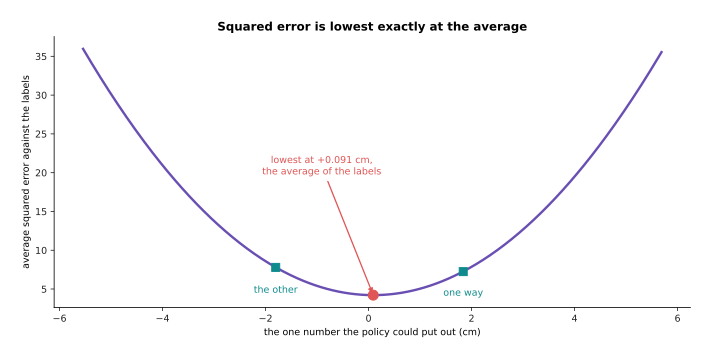
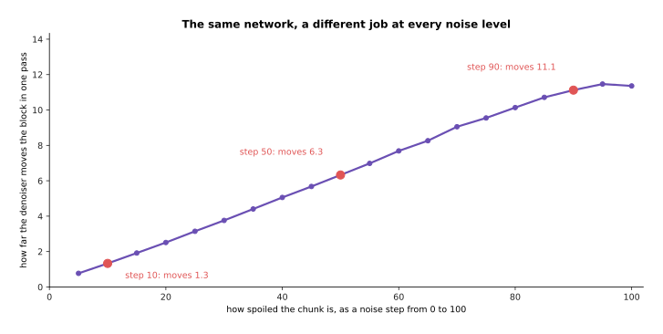
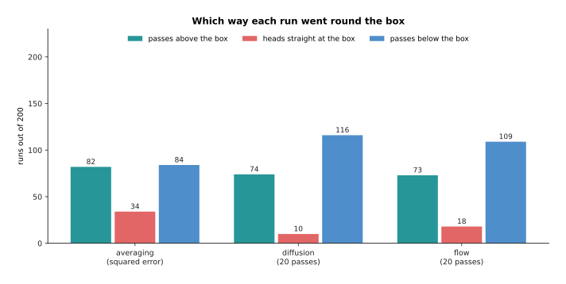
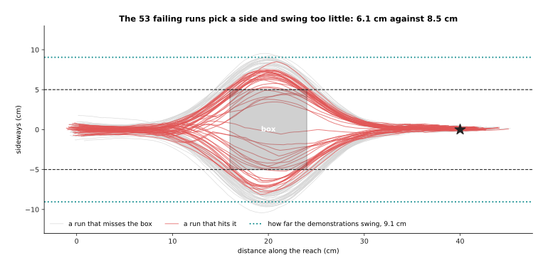
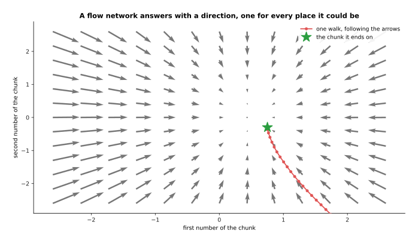
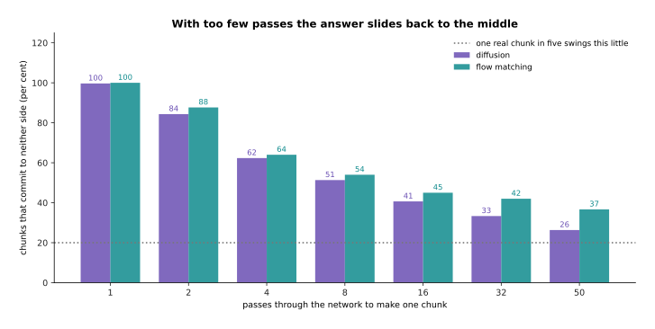
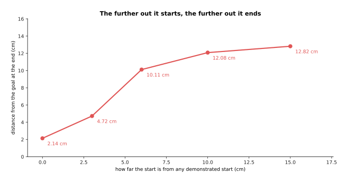

# Diffusion and flow policies

[Behaviour cloning and action chunks](01_behaviour-cloning-and-action-chunks.md),
the page before this one, built a policy that copies a person. Its input is what
the robot sees and the state the robot is in, its label is what the person did
next, and its answer is a block of future actions rather than a single step. That
page left one problem open. The problem is what the policy should answer when the
demonstrations disagree with each other, and that is what this page is about.

The problem is common, and it is not a fault in the recordings. Many robot tasks
have two or more right answers. For example, a person can go round an object on
either side, they can pick a mug up by the handle or by the rim, and they can wipe
a table from left to right or from right to left. A policy that is trained to make
one answer close to every label is pulled towards the space between those answers.
The space between two good movements is usually a bad one, because it often passes
straight through whatever the two movements were going round.

The fix is to stop asking the network for an answer and to start asking it to
generate one. [Diffusion](../08_models-that-generate/01_diffusion.md) explained how
a generative model works. It spoils something with noise step by step, and it
trains a network to undo one step of that spoiling. That page is the one to read
before this one. This page changes what is being generated: not a picture, but a
chunk of future movement for an arm.

By the end of this page you will know five things. You will know why squared error
cannot answer a question that has two answers. You will know how a diffusion policy
generates a chunk instead of choosing one, and what the extra inputs to it are for.
You will know what flow matching changes and why that change matters on a robot.
You will know how a generated chunk is fitted into the time the arm allows.
Finally you will know what these policies still cannot do.

The sections run in order from the problem, to the machinery, to the cost. Every
number in the pictures is worked out and printed by
`docs/diagrams/models_that_act_1.py`. The task, the demonstrations and the arm are
simulated, with 400 recorded reaches round a box. However, the three policies
compared are real networks, written in NumPy and trained on those recordings.

## Contents

1. [One number per joint cannot answer a question with two answers](#1-one-number-per-joint-cannot-answer-a-question-with-two-answers)
2. [The diffusion policy: generating a chunk instead of picking one](#2-the-diffusion-policy-generating-a-chunk-instead-of-picking-one)
3. [The same demonstrations, generated instead of averaged](#3-the-same-demonstrations-generated-instead-of-averaged)
4. [Flow matching, and how many passes the arm can afford](#4-flow-matching-and-how-many-passes-the-arm-can-afford)
5. [Receding horizon: generating while the arm is still moving](#5-receding-horizon-generating-while-the-arm-is-still-moving)
6. [What these policies still cannot do](#6-what-these-policies-still-cannot-do)
7. [Where to read next](#7-where-to-read-next)
8. [Using it in Python](#8-using-it-in-python)

---

## 1. One number per joint cannot answer a question with two answers

The last page's policy puts out one number for each thing the arm can move, and
training pushes that number towards the label by squared error. This section shows
what that does when the labels disagree, on a task built to make the disagreement
plain.

The simulated task is a 40 centimetre reach with a box in the way. The box is 8
centimetres long along the reach and 10 centimetres wide across it, and it sits
half way along. The demonstrator always starts in the same place. They go straight
for the first quarter of the reach, they swing about 9 centimetres to one side to
get past the box, and then they come back to the goal. They choose the side at
random, with an equal chance each way.


Of 400 demonstrations, 203 go one way and 197 go the other. The average of all of
them passes the middle of the box 0.16 centimetres off the centre line, which is
well inside the box.

That average is not a strange accident, because it is exactly what squared error
asks for. The next picture takes the moment 10 centimetres along the reach, just
before the demonstrations part from each other, and counts every label recorded at
that moment.


There are 1,017 recorded moments at that place. Over the next 32 steps they move
sideways by +1.84 centimetres one way and -1.80 centimetres the other, and the
average of all of them is +0.091 centimetres. The histogram has two humps and a dip
between them, and that average falls in the dip rather than on either hump.

The policy, however, can only give one number. The next picture scores every number
it could possibly give, by taking the average squared error of that number against
all 1,017 labels.



The squared error of the single best number is 4.21 at the average, against 7.24 at
either of the two answers people actually gave. The lowest point of the curve is
therefore in the gap between the two humps of the histogram.

That curve is the whole argument. A policy that gives one number and is scored by
squared error is being told, by the training itself, to sit between the two things
people did, because that is where the score is lowest. Any loss that rewards one
answer for being close to every label behaves the same way, and [the score of being
wrong](../03_how-training-works/01_the-score-of-being-wrong.md) explains why
squared error has this property.

Training a real network that way gives exactly the behaviour the curve predicts.


A network trained this way on the 400 demonstrations drives 159 of its 200 runs
straight through the box. It still ends up on average 0.78 centimetres from the
goal, so it looks accurate by every number except the one that matters.

That last sentence is worth remembering. The policy's training loss and its average
end point both look fine, and the task is failed anyway. The rest of this page is
about giving the policy a way to pick one of the two answers instead of answering
between them.

---

## 2. The diffusion policy: generating a chunk instead of picking one

Section 1 showed that asking for one answer forces an average, so the way out is to
ask for a sample instead. A **diffusion policy** is a policy whose output is
produced by the generative machinery of
[diffusion](../08_models-that-generate/01_diffusion.md). The network does not give
the chunk directly. Instead a chunk is built up from pure noise by a walk of small
steps, and each step of that walk is one pass through the network.

The thing being built is not a picture. It is a block of future actions. In this
task the block is 32 steps of two numbers each, which is 64 numbers covering just
over one second of movement. Training spoils that block with noise exactly as a
picture would be spoiled. The picture below draws one real block as a path on the
table, and then repeats it at five levels of spoiling.


At noise step 20 the spoiled chunk still keeps 0.948 of the real one. At step 60 it
keeps 0.584. At step 100 it keeps only 0.100, so what is left is almost all noise.

The network is then trained to look at a spoiled chunk and say what the clean one
was. Saying that is the same as saying what the noise was, because the noise is the
difference between the two. Either way, one pass through the network takes the
block one step back towards a real movement. The picture below counts what goes
into that network and what comes out.


The denoiser in this simulation reads 82 numbers. Those are the 64 numbers of the
spoiled chunk, 2 numbers that say where the gripper is, and 16 numbers that say how
spoiled the chunk is. It gives back 64 numbers through two hidden layers of 224
units, and it holds 83,392 weights in all.

The two numbers that say where the gripper is are the **conditioning**, which means
the extra input that tells the generator what to make. On a real arm the
conditioning is not two numbers but the output of a camera encoder together with
the joint readings, and nothing else about the machinery changes.

The noise level has to go in as well, because the network's job at step 90 is not
the same as its job at step 10. The next picture measures that directly. It spoils
real chunks to each level in turn, hands them to the trained network, and measures
how far the network then moves the block in one pass.



The size of that correction grows steadily with the noise step. A network that was
not told which step it was on would have to guess how large a correction to make,
and it would get that wrong at both ends of the walk.

Generating one chunk then means starting from 64 random numbers and taking the walk
back, one pass at a time. The picture below draws the same chunk at five points
along that walk.


After 5 of the 20 steps the chunk is still mostly noise. By 15 it has the shape of a
real swing. After 20 it is one clean movement rather than a blend of two.

The reason this escapes section 1's problem is worth saying slowly. The network is
never asked what the one right chunk is. It is asked, over and over, to make a
spoiled chunk slightly less spoiled. The random numbers it starts from decide which
of the real movements it ends up near. Run it twice from the same situation and you
get two different chunks, and each of them is a whole movement.

The conditioning then controls which of those movements are possible. The picture
below runs the same network 40 times from each of three places.


Told that the gripper is 10 centimetres along and in the middle, 25 of 40 chunks
stay above the box and 15 go below. Told that the gripper is already above the box,
all 40 stay above. Told that it is already below, all 40 stay below.

So the conditioning does not force one answer. Instead it narrows the spread of
answers down to the ones that make sense from where the arm actually is. That is
the behaviour section 3 puts on the robot.

---

## 3. The same demonstrations, generated instead of averaged

Section 2 generated single chunks from fixed situations. This section runs the
generator as a policy. That means working out a chunk, playing the first 8 steps of
it, looking again, working out the next chunk, and carrying on that way to the
goal. The training data is the same 400 demonstrations the averaging policy saw,
and the measurement is the same 200 runs.


The diffusion policy puts 53 of its 200 runs through the box instead of 159. Of the
200 runs, 79 pass above the box and 121 pass below it, and the policy ends on
average 1.95 centimetres from the goal.

Set the three policies side by side and the difference is plain. The next picture
counts the runs that go through the box for each of them.


The averaging policy goes through the box on 79.5 per cent of runs, the diffusion
policy on 26.5 per cent and a flow policy on 28.5 per cent.

Going through the box is not the only thing worth counting, because a run can also
fail by heading for the middle and only just missing. The next picture splits each
policy's 200 runs three ways, by where the run was sideways at the half way point.
A run counts as heading straight at the box when it is within 2 centimetres of the
centre line at that moment.



The number of runs that head straight at the box falls from 34 for the averaging
policy to 10 for diffusion and 18 for flow.

The clearest way to see the difference is to stop the runs at the moment they reach
the box and ask only where the gripper is sideways. The picture below does that for
300 runs of each policy, with the box shaded in grey.


The averaging policy spreads its 300 runs right across the middle, with 28.7 per
cent inside the box. The two generative policies leave the middle nearly empty,
with 5.0 and 10.0 per cent inside it.

Those two separate groups are the point of the whole page. The generative policy has
learned that there are two ways to do this task and that each way is whole. It has
not learned a single compromise between them.

Its remaining failures are worth naming, because they are not the failure you might
expect. A fresh chunk is generated every 8 steps, so you might expect a run to be
handed a chunk that commits to the other side and to cross the middle at the worst
possible moment. That does not happen here. Not one of the 200 runs is more than
2.5 centimetres above the centre line and more than 2.5 centimetres below it while
passing the box. The picture below draws the 53 failing runs in red over the ones
that miss the box.



Every failing run picks a side. What it does wrong is swing too little. The runs
that miss the box swing 8.50 centimetres out at their widest, the failing runs swing
only 6.06 centimetres, and the demonstrations swing 9.05 centimetres against a box
that is 5.0 centimetres wide on each side of the centre line. A run that swings only
6 centimetres clips the corner of the box as it enters, even though it is clearly on
one side.

So the generator has learned which two shapes the movement can take, and it has not
quite learned how large they are. In this simulation that is a limit of a small
network trained on 400 demonstrations, and more passes make it better, as section 4
measures.

---

## 4. Flow matching, and how many passes the arm can afford

Section 3 generated each chunk with 20 passes through the network. That number is
the whole reason this section exists, because every pass costs time and the arm is
waiting for the answer. **Flow matching**, explained in [flow matching and other
generators](../08_models-that-generate/02_flow-matching-and-other-generators.md),
is the other way to build a generator. Instead of learning to undo noise, the
network learns a direction to travel at every point between noise and a real chunk.
Generating then means starting at a random point and taking a few steps along those
directions.

That phrase, a direction at every point, is easier to see than to read. The chunk
has 64 numbers, so the directions cannot all be drawn. The picture below takes one
generated chunk half way along its walk, holds 62 of its numbers still, and sweeps
the other two over a grid, drawing the direction the network gives at each place on
that grid.



The network answers with an arrow wherever it is asked. Generating a chunk means
following those arrows from a random starting point for a fixed number of steps.

The two generators differ in the shape of the path they take from noise to answer,
and that shape can be measured directly by drawing where each walk goes.


Measured in the first two of the chunk's 64 numbers, the diffusion walk covers 1.56
against a straight-line distance of 1.41 between its two ends. The flow path covers
1.14 against 1.10. The flow path is therefore the straighter of the two.

A straighter path matters because of what happens when you take fewer and bigger
steps. On a straight path a big step lands close to where many small steps would
have landed. On a bent path it does not. The next picture asks what each generator
gives for a budget of 1, 2, 4, 8, 16, 32 and 50 passes, and measures how close the
chunk is to a real recorded chunk.


With one pass the answer is far from anything real, at 4.29 for diffusion and 5.55
for flow, against the 0.82 that separates two real chunks. By four passes the
distance is down to 2.10 and 2.87.

The second thing worth measuring is whether the chunk commits to a side at all.
Four real chunks in five swing more than 7.33 centimetres sideways, so a generated
chunk that swings less than 7.33 centimetres has not committed to either way round
the box. The next picture counts those chunks.



With one pass almost every chunk commits to neither side. By four passes 62 per
cent of diffusion chunks and 64 per cent of flow chunks still commit to neither.

Both generators improve quickly over the first few passes and then flatten out.
That shape is the one that matters on a robot, because it says that a handful of
passes buys most of the quality. The flow policy here does not beat the diffusion
one on either measure. That is a reminder that these numbers belong to one small
network on one simulated task, and that what is general is the shape of the curves
rather than the gap between them.

What those passes cost is the next thing to count. Suppose that turning the camera
pictures into numbers takes 11 milliseconds, that one pass through the action
network takes 6 milliseconds, and that packing and sending the chunk takes 2
milliseconds. The picture below adds those three costs for each pass budget, and it
marks two deadlines with lines across the chart.


Four passes take 37 milliseconds and 8 passes take 61 milliseconds. Both of those
fit easily inside the 267 milliseconds that 8 played steps last at 30 steps a
second. However, 50 passes take 313 milliseconds and 100 passes take 613
milliseconds, so neither of those fits at all.

That count is why the number of passes is the thing to design around, and why a
generator whose path from noise to answer is straight is worth having. It is not
that fifty passes give a bad answer. It is that fifty passes do not finish in time,
and a chunk that arrives after the arm has run out of commands is worse than a
slightly worse chunk that arrives early.

---

## 5. Receding horizon: generating while the arm is still moving

Section 4 counted the time one chunk costs, and this section is about where that
time has to fit. The arrangement every one of these policies uses is called a
**receding horizon**. That means the policy always works out more future than it
will use, it plays only the front part of it, and it works out the next block
before the current one runs out.


Each chunk covers 1,067 milliseconds of movement at 30 steps a second. Only its
first 267 milliseconds are played. The 37 milliseconds that make the next chunk fit
inside those 267 milliseconds, which leaves 230 milliseconds of slack.

The part of each chunk that is thrown away is not waste. It is what lets the policy
plan a whole swing round the box while still being able to change its answer eight
steps later, and it is also what makes the movement smooth.

The **control frequency** is the rate at which the arm wants a new command, which is
30 a second here, and the chunk is what keeps that rate supplied. The policy itself
runs far more slowly, about four times a second, and the arm never notices, because
it always has commands in hand. What the arm does notice is a chunk that arrives
late.


At 4 passes the network finishes in 37 milliseconds and the arm never waits. At 50
passes it takes 313 milliseconds against the 267 milliseconds of movement in hand,
so the arm stops for 46 milliseconds in every cycle.

A stopping arm is not just slow. It stops in the middle of a movement, which puts a
sudden step into the commands, and that step is exactly the sharp change that
[action chunks](01_behaviour-cloning-and-action-chunks.md#6-how-long-a-chunk-should-be)
were smoothed to avoid. The budget has to be met, not nearly met.


Inside one cycle, 2 passes use 25 of the 267 milliseconds and leave 242
milliseconds spare. 8 passes use 61 milliseconds and leave 206. 16 passes use 109
milliseconds and leave 158.

These systems are actually designed by reading that picture from the right. Somebody
decides first how much slack a real robot needs. The camera encoder and the sending
then take their fixed share. The number of passes is chosen last, out of whatever
time is left. [Running and evaluating a
model](../14_using-a-model-for-real/01_running-and-evaluating-a-model.md) goes
through the rest of that budget.

---

## 6. What these policies still cannot do

The last four sections have been about what generating buys you, so this one is
about what it does not buy. A diffusion or flow policy is still a copy of a set of
demonstrations, and everything the demonstrations contain comes along with the
parts you wanted.

In this simulation the demonstrator always slows down at the same place, about 32
centimetres along, as a person does when they check the gripper before the last few
centimetres. Nothing in the training says that slowing down is bad, because the only
thing the training says is that the policy should do what the person did.


The demonstrator's speed falls from 25.4 centimetres a second to 8.6 centimetres a
second at that place. The trained policy also slows to 8.6 centimetres a second at
the same place, so it has copied the pause as carefully as it copied the movement.

That is the deeper point about behaviour cloning of any kind. The policy has no idea
what the task is for, because it was never given a goal, a score or a preference of
the kind [rewards, preferences and
verifiers](../11_learning-from-outcomes/02_rewards-preferences-and-verifiers.md)
describes. It has only the spread of what somebody did.


Move the object 11 centimetres sideways and the policy still ends 1.81 centimetres
from where it always went, and 11.03 centimetres from where the object now is. The
object never moved in any demonstration, so nothing in the policy's input tells it
that anything has changed.

That failure is not a refusal to adapt. It is that the policy was never shown the
object as something that can move, so the policy has no way to notice. The cure is
either more varied demonstrations, which costs more of somebody's day, or a model
that has been told the task in words, which is the next page.

The last limit is the one the page before this one named. Covariate shift does not
go away when the output is generated, because a generated chunk is still only as
good as the situations the training covered.


The runs that start where every demonstration started go round the box and stop
near the goal. The runs that start further out swing much wider than any
demonstration did, and they also keep going for longer. After the same 120 steps
they have travelled past the goal instead of stopping at it. The next picture
measures how far past it they end up.



Started where every demonstration started, the policy ends 2.14 centimetres from
the goal. Started 6 centimetres away from any demonstrated start it ends 10.11
centimetres out, and that rises to 12.82 centimetres at 15 centimetres away.

So a generative policy fixes the problem of two right answers and leaves the problem
of no answer at all. A situation no demonstration covered gets whatever the network
happens to produce there. There is no warning and no attempt to get back to safety.
That is why every one of these systems is run with limits on the arm and with a
person able to stop it.

---

## 7. Where to read next

- [Vision-language-action models](03_vision-language-action-models.md) is the next
  page, and it attaches the generator built here to a model that has read the web,
  so that the arm can be told in a sentence which of the two ways to take.
- [World models](04_world-models.md) covers the other use of a generative model on
  a robot, which is predicting what the world will do rather than what the arm
  should.
- [Flow matching and other
  generators](../08_models-that-generate/02_flow-matching-and-other-generators.md)
  gives the machinery of section 4 properly, with the vector field written out.
- [Running and evaluating a
  model](../14_using-a-model-for-real/01_running-and-evaluating-a-model.md) is
  where the latency budget of section 5 is set out in full, together with how to
  test a policy honestly.
- [Diffusion and flow
  policies](../../07_learned-models/06_movement-models/02_most-used/03_diffusion-and-flow-policies.md)
  in the catalogue of movement models lists the published policies of this kind
  and what each needs to run.

---

## 8. Using it in Python

Section 2 spoiled a chunk with noise and trained a network to undo it, and section 4
counted the passes that undoing costs. The code below does both with Hugging Face's
`diffusers` package, which supplies the noise schedule and the sampler, so that you
write only the chunk shapes and the network.

```python
import torch
from torch import nn
from diffusers import DDPMScheduler

CHUNK, DIM, OBS = 32, 2, 2                  # section 2's shapes: 32 steps of 2 numbers
sched = DDPMScheduler(num_train_timesteps=100, beta_schedule="squaredcos_cap_v2")

net = nn.Sequential(nn.Linear(CHUNK * DIM + OBS + 1, 224), nn.SiLU(),
                    nn.Linear(224, 224), nn.SiLU(), nn.Linear(224, CHUNK * DIM))
print(sum(p.numel() for p in net.parameters()))        # 80032

chunk = torch.zeros(1, CHUNK * DIM)                    # one recorded block of actions
obs = torch.zeros(1, OBS)                              # where the gripper is
noise = torch.randn_like(chunk)
t = torch.randint(0, 100, (1,))
spoiled = sched.add_noise(chunk, noise, t)             # section 2's spoiling
guess = net(torch.cat([spoiled, obs, t[:, None] / 100], dim=1))
loss = nn.functional.mse_loss(guess, noise)            # train it to name the noise

sched.set_timesteps(4)                                 # section 4: four passes, not fifty
print([int(t) for t in sched.timesteps])               # [75, 50, 25, 0]
x = torch.randn(1, CHUNK * DIM)
for step in sched.timesteps:
    eps = net(torch.cat([x, obs, step.view(1, 1).float() / 100], dim=1))
    x = sched.step(eps, step, x).prev_sample
print(x.shape)                                         # torch.Size([1, 64])
```

The library gives you the two things that are fiddly to get right. The scheduler
holds the noise schedule, which is the list that says how much of the chunk survives
at each step, and `add_noise` and `step` apply that list in the two directions. The
arithmetic of section 2 is therefore never written by hand. Changing
`set_timesteps(4)` to `set_timesteps(50)` is the whole of the pass-count choice that
section 4 measured, and swapping `DDPMScheduler` for a flow-matching scheduler
changes the path without changing the network.

This network holds 80,032 weights rather than the 83,392 of section 2, because it is
handed the noise step as a single number rather than as the 16 numbers the
simulation uses. Everything else about the two is the same.

What you have to decide is everything else. You choose how many steps the chunk
covers and how many of them you play before generating again, which is section 5's
receding horizon. You choose what goes into the conditioning, and on a real arm that
means a camera encoder in front of this network, whose own time comes out of the
same budget. You choose the number of passes, with section 4's curves on one side
and section 5's timeline on the other.

The parameter count above is for a toy network with two numbers of observation. A
real diffusion policy is far larger, because the conditioning is a vision backbone,
and because the denoiser is usually a one-dimensional convolutional network or a
small transformer over the chunk rather than three linear layers. The training loop
and the sampling loop, however, are the ones printed here.
