# Diffusion and flow policies

[Behaviour cloning and action chunks](01_behaviour-cloning-and-action-chunks.md),
the page before this one, built a policy that copies a person: the input is what
the robot sees and the state it is in, the label is what the person did next, and
the answer is a block of future actions rather than a single step. It left one
problem open, which is what the policy should answer when the demonstrations
disagree, and that is what this page is about.

The problem is not rare and it is not a flaw in the recordings. A great many
robot tasks have two or more right answers, because a person can go round an
object on either side, pick a mug up by the handle or by the rim, or wipe a table
left to right or right to left. A policy trained to make one answer close to every
label gets dragged into the space between the answers, and the space between two
good movements is usually a bad one.

The fix is to stop asking the network for an answer and start asking it to
generate one. [Diffusion](../08_models-that-generate/01_diffusion.md) explained
how a generative model works, by spoiling something with noise step by step and
training a network to take one step of the spoiling back, and that page is the
one to have read before this one. This page changes what is being generated: not
a picture, but a chunk of future movement for an arm.

The sections run in order from the problem to the machinery to the cost. Every
number in the pictures is worked out and printed by
`docs/diagrams/models_that_act_1.py`. The task, the demonstrations and the arm are
simulated, with 400 recorded reaches round a box, and the three policies compared
are real networks trained on them in NumPy.

## Contents

1. [One number per joint cannot answer a question with two answers](#1-one-number-per-joint-cannot-answer-a-question-with-two-answers)
2. [The diffusion policy: generating a chunk instead of picking one](#2-the-diffusion-policy-generating-a-chunk-instead-of-picking-one)
3. [The same demonstrations, generated instead of averaged](#3-the-same-demonstrations-generated-instead-of-averaged)
4. [Flow matching, and how many passes the arm can afford](#4-flow-matching-and-how-many-passes-the-arm-can-afford)
5. [Receding horizon: generating while the arm is still moving](#5-receding-horizon-generating-while-the-arm-is-still-moving)
6. [What these policies still cannot do](#6-what-these-policies-still-cannot-do)
7. [Where to read next](#7-where-to-read-next)
8. [Using it in Python](#8-using-it-in-python)

---

## 1. One number per joint cannot answer a question with two answers

The last page's policy puts out one number for each thing the arm can move, and
training pushes that number towards the label by squared error. This section shows
what that does when the labels disagree, on a task built to make the disagreement
plain.

The simulated task is a 40 centimetre reach with a box in the way. The box is 8
centimetres along the reach and 10 centimetres across it, sitting half way, and the
demonstrator always starts in the same place, goes straight for the first quarter
of the reach, swings about 9 centimetres to one side to clear the box, and comes
back to the goal. Which side they choose is a coin toss.

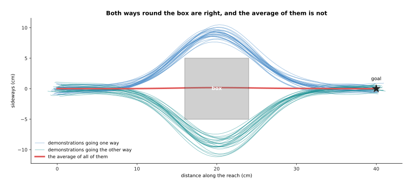

Of 400 demonstrations, 203 go one way and 197 the other, and the average of all of
them passes the middle of the box at 0.16 centimetres off the line, which is well
inside it.

That average is not a strange accident, because it is exactly what squared error
asks for. The next picture takes the moment 10 centimetres along the reach, just
before the demonstrations part, and looks at every label recorded there.

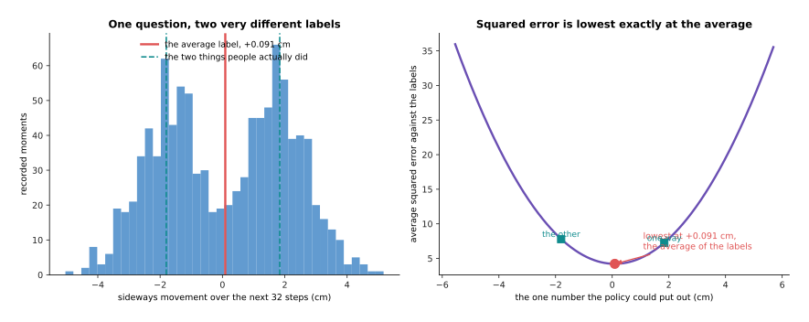

The 1,017 recorded moments at that place move sideways by +1.84 centimetres one
way and -1.80 the other over the next 32 steps, their average is +0.091
centimetres, and the squared error of the single best number is 4.21 at that
average against 7.24 at either of the two real answers.

The right-hand curve is the whole argument in one shape. A policy that gives one
number and is scored by squared error is being told, by the training itself, to
sit between the two things people did, because that is where the score is lowest.
Any loss that rewards one answer for being close to every label does the same, and
[the score of being
wrong](../03_how-training-works/01_the-score-of-being-wrong.md) explains why
squared error has this property.

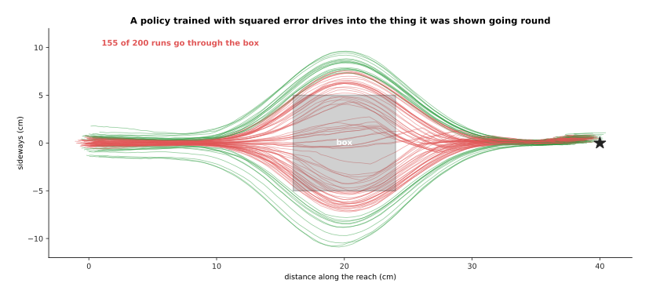

A network trained this way on the 400 demonstrations drives 159 of its 200 runs
straight through the box, and it still ends up on average 0.78 centimetres from
the goal, so it looks accurate by every number except the one that matters.

That last sentence is worth holding on to, because the policy's training loss and
its average end point both look fine, and the task is failed anyway. The rest of
this page is about giving the policy a way to pick one of the two answers instead
of splitting the difference.

---

## 2. The diffusion policy: generating a chunk instead of picking one

Section 1 showed that asking for one answer forces an average, so the way out is
to ask for a sample instead. A **diffusion policy** is a policy whose output is
produced by the generative machinery of
[diffusion](../08_models-that-generate/01_diffusion.md): instead of the network
giving the chunk directly, a chunk is built up from pure noise by a walk of small
steps, and each step is one pass through the network.

The thing being built is not a picture. It is a block of future actions, in this
task 32 steps of two numbers each, which is 64 numbers covering just over a second
of movement. Training spoils that block with noise exactly as a picture would be
spoiled.

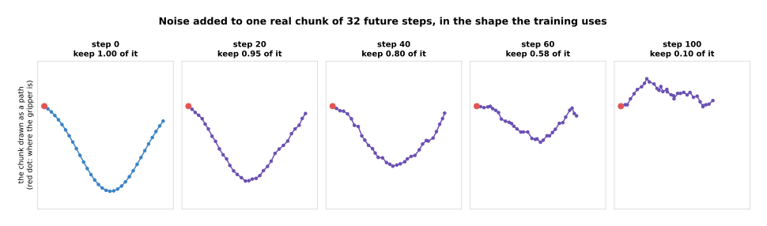

At noise step 20 the spoiled chunk still keeps 0.948 of the real one, at step 60
it keeps 0.584, and at step 100 it keeps only 0.100, so what is left is almost all
noise.

The network is then trained to look at a spoiled chunk and say what the clean one
was. Saying that is the same as saying what the noise was, because the noise is
the difference between the two, and either way one pass through the network takes
the block one step back towards a real movement.

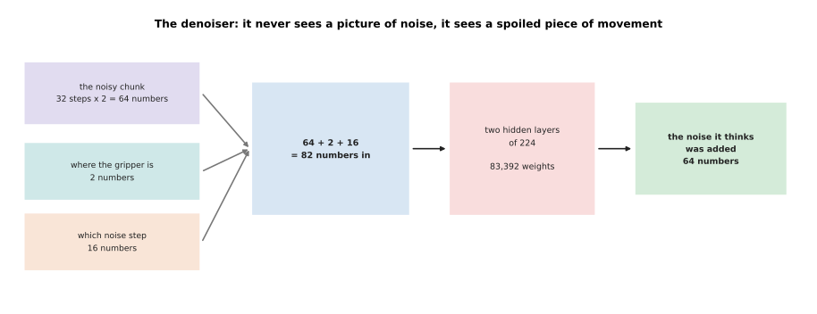

The denoiser in this simulation reads 82 numbers, which are the 64 of the spoiled
chunk, the 2 that say where the gripper is, and 16 that say how spoiled the chunk
is, and it gives back 64 numbers through two hidden layers of 224, holding 83,392
weights in all.

Those two numbers saying where the gripper is are the **conditioning**, which
means the extra input that tells the generator what to make. On a real arm they
are not two numbers but the output of a camera encoder and the joint readings, and
nothing else about the machinery changes. The noise level has to go in as well,
because the network's job is different at step 90 from its job at step 10.

Generating one chunk then means starting from 64 random numbers and taking the
walk back.

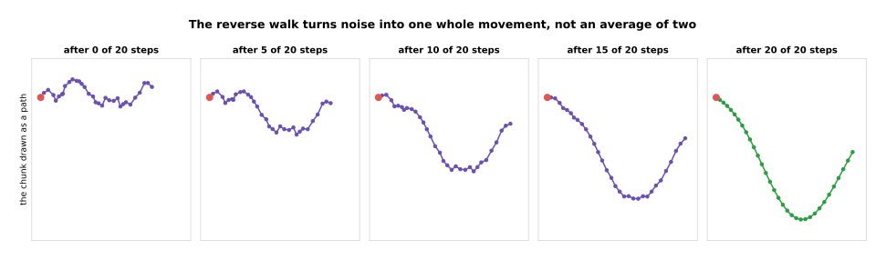

After 5 of the 20 steps the chunk is still mostly noise, by 15 it has the shape of
a real swing, and after 20 it is one clean movement rather than a blend of two.

The reason this escapes section 1's problem is worth saying slowly. The network is
never asked what the one right chunk is. It is asked, over and over, to make a
spoiled chunk slightly less spoiled, and the random numbers it starts from decide
which of the real movements it ends up near. Run it twice from the same situation
and you get two different chunks, each of them a whole movement.

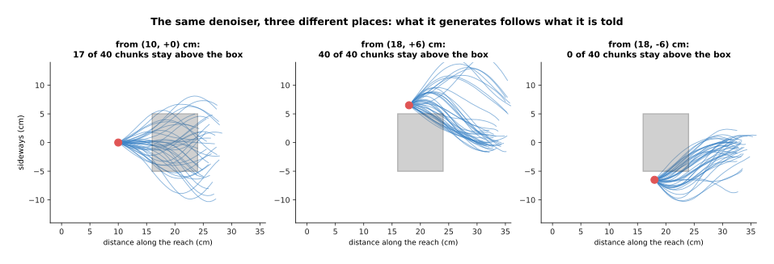

Told that the gripper is 10 centimetres along and in the middle, 25 of 40 chunks
stay above the box and 15 below; told that it is already above the box, all 40
stay above; told that it is already below, all 40 stay below.

So the conditioning does not force an answer, it narrows the spread of answers to
the ones that make sense from where the arm actually is. That is the behaviour
section 3 puts on the robot.

---

## 3. The same demonstrations, generated instead of averaged

Section 2 generated single chunks from fixed situations. This section runs the
generator as a policy, which means working out a chunk, playing the first 8 steps
of it, looking again and working out the next, all the way to the goal. The
training data is the same 400 demonstrations the averaging policy saw, and the
measurement is the same 200 runs.

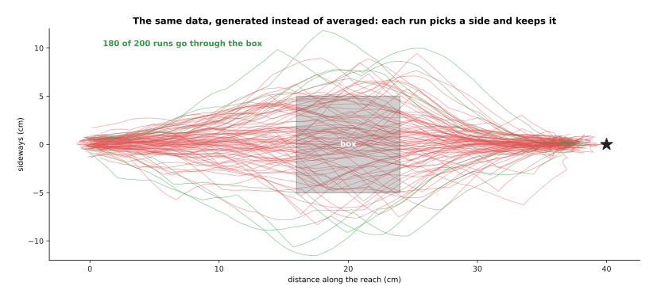

The diffusion policy puts 53 of its 200 runs through the box instead of 159, with
71 passing above and 120 below, and it ends on average 1.98 centimetres from the
goal.

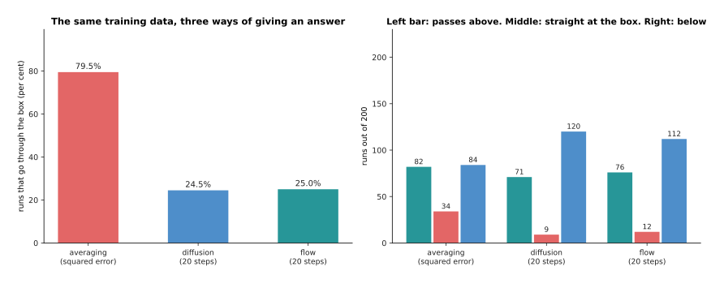

Set side by side, the averaging policy goes through the box on 79.5 per cent of
runs, the diffusion policy on 24.5 per cent and a flow policy on 25.0 per cent,
and the number of runs that aim straight at the box falls from 34 to 9 and 12.

The clearest way to see the difference is to stop the runs at the moment they
reach the box and ask only where the gripper is sideways.

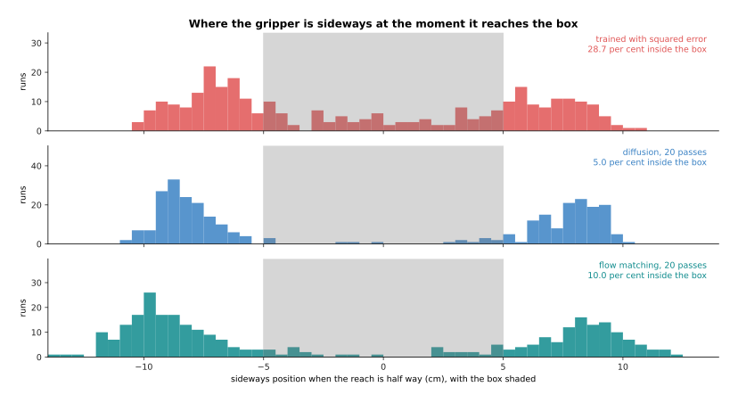

The averaging policy spreads its 300 runs right across the middle, with 28.7 per
cent inside the box, while the two generative policies leave the middle nearly
empty, with 5.0 and 10.0 per cent inside it.

Those two humps are the point of the whole page. The generative policy has learned
that there are two ways to do this and that each one is whole, rather than
learning a single compromise. Its remaining failures are honest and worth naming:
because a fresh chunk is generated every 8 steps, a run that is still near the
middle can be handed a chunk that commits the other way, and the arm then crosses
the middle at the worst moment. A longer committed chunk and a policy that is
given the last few observations rather than only the current one both cut that
down.

---

## 4. Flow matching, and how many passes the arm can afford

Section 3 generated each chunk with 20 passes through the network, and that number
is the whole reason this section exists, because every pass costs time and the arm
is waiting. **Flow matching**, explained in [flow matching and other
generators](../08_models-that-generate/02_flow-matching-and-other-generators.md),
is the other way to build a generator: instead of learning to undo noise, the
network learns a direction to travel at every point between noise and a real
chunk, and generating means starting at a random point and taking a few steps
along that direction.

The two differ in the shape of the road they take from noise to answer, which can
be measured directly by drawing where the walk goes.

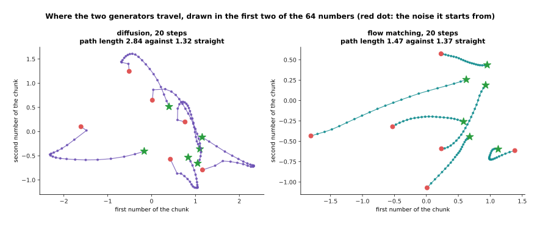

Measured in the first two of the chunk's 64 numbers, the diffusion walk covers
1.56 against a straight-line distance of 1.41 between its ends, while the flow
path covers 1.14 against 1.10, so the flow path is the straighter of the two.

A straighter road matters because taking fewer, bigger steps along a straight road
loses less than taking fewer, bigger steps along a bent one. The next picture asks
what each generator gives for a budget of 1, 2, 4, 8, 16, 32 and 50 passes, and it
measures two things: how close the chunk is to a real recorded chunk, and how
often it sits on the fence between the two ways round the box.

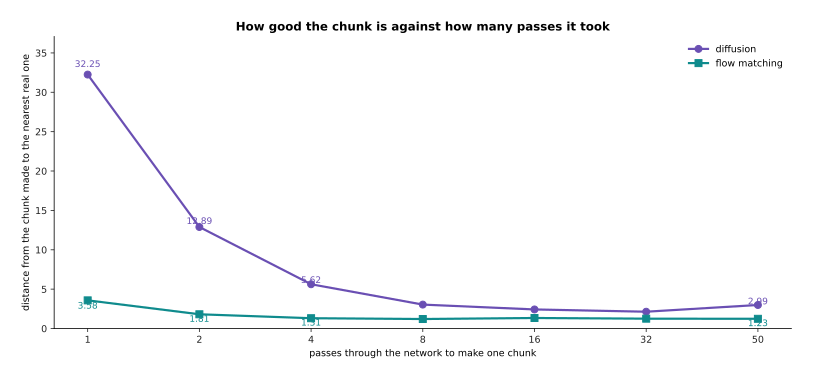

With one pass every chunk sits on the fence and the answer is far from anything
real, at 4.29 and 5.55 against the 0.82 that separates two real chunks, and by
four passes the distance is down to 2.10 and 2.87 with 62 and 64 per cent still on
the fence.

Both generators improve quickly over the first few passes and then flatten out,
which is the shape that matters on a robot, because it says a handful of passes
buys most of the quality. The flow policy here does not beat the diffusion one on
either measure, which is a reminder that these numbers belong to one small network
on one simulated task, and that what is general is the shape of the curves rather
than the gap between them.

What those passes cost is the next thing to count. Suppose that turning the camera
pictures into numbers takes 11 milliseconds, that one pass through the action
network takes 6 milliseconds, and that packing and sending the chunk takes 2
milliseconds.

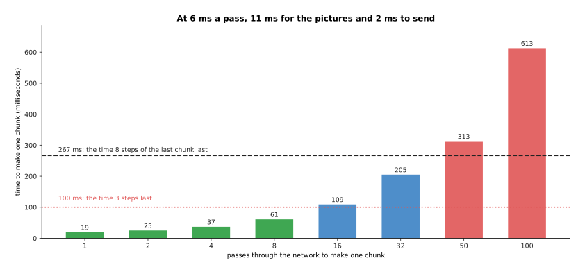

Four passes take 37 milliseconds and 8 take 61, which both fit easily inside the
267 milliseconds that 8 played steps last at 30 steps a second, while 50 passes
take 313 milliseconds and 100 take 613, so neither fits at all.

That table is why the number of passes is the thing to design around, and why a
generator whose road from noise to answer is straight is worth having. It is not
that fifty passes give a bad answer, it is that fifty passes do not finish in
time, and a chunk that arrives after the arm has run out of commands is worse than
a slightly worse chunk that arrives early.

---

## 5. Receding horizon: generating while the arm is still moving

Section 4 counted the time one chunk costs, and this section is about where that
time has to fit. The arrangement every one of these policies uses is called a
**receding horizon**, which means the policy always works out more future than it
will use, plays only the front of it, and works out the next block before the
current one runs out.

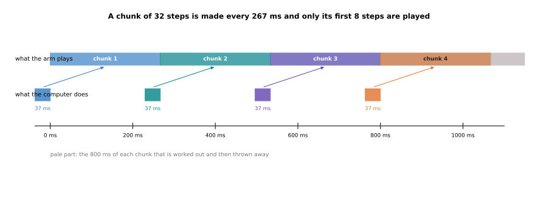

Each chunk covers 1,067 milliseconds of movement at 30 steps a second, only its
first 267 milliseconds are played, and the 37 milliseconds that make the next
chunk fit inside those 267, leaving 230 milliseconds of slack.

The part of each chunk that is thrown away is not waste, because it is what lets
the policy plan a whole swing round the box while still being able to change its
mind eight steps later, and it is also what makes the movement smooth.

The **control frequency** is the rate at which the arm wants a new command, which
is 30 a second here, and the chunk is what keeps that rate fed. The policy itself
runs far more slowly, about four times a second, and the arm never notices because
it always has commands in hand. What it does notice is a chunk that is late.

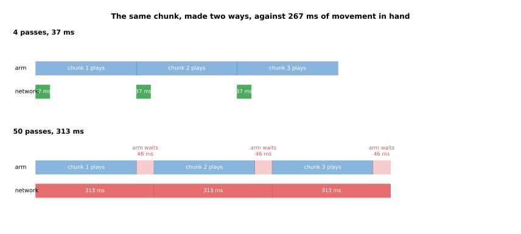

At 4 passes the network finishes in 37 milliseconds and the arm never waits, while
at 50 passes it takes 313 milliseconds against the 267 of movement in hand, so the
arm stops for 46 milliseconds in every cycle.

A stopping arm is not just slow. It stops in the middle of a movement, which puts
a step into the commands, and that step is exactly the jerk that
[action chunks](01_behaviour-cloning-and-action-chunks.md#6-how-long-a-chunk-should-be)
were smoothed to avoid. The budget has to be met, not nearly met.

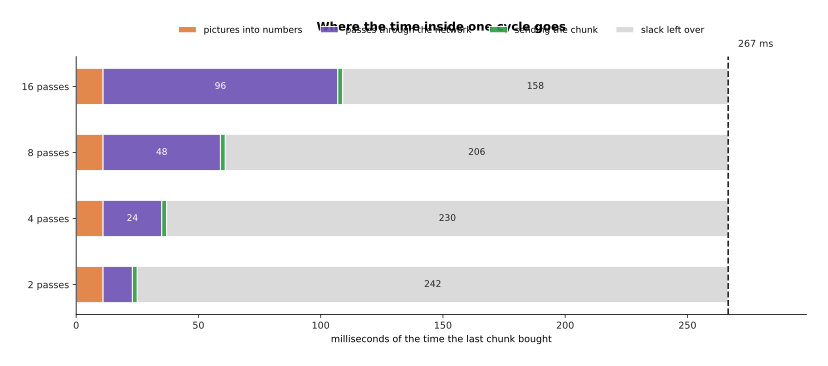

Inside one cycle, 2 passes use 25 of the 267 milliseconds and leave 242 spare, 8
passes use 61 and leave 206, and 16 passes use 109 and leave 158.

Reading that picture the other way round is how these systems are actually
designed, because the number of passes is chosen last, after the camera encoder
and the sending have taken their share and after somebody has decided how much
slack a real robot needs. [Running and evaluating a
model](../13_using-a-model-for-real/01_running-and-evaluating-a-model.md) goes
through the rest of that budget.

---

## 6. What these policies still cannot do

The last four sections have been about what generating buys you, so this one is
about what it does not. A diffusion or flow policy is still a copy of a set of
demonstrations, and everything the demonstrations contain comes along with the
parts you wanted.

In this simulation the demonstrator always slows down at the same place, about 32
centimetres along, as a person does when they are checking the gripper before the
last few centimetres. Nothing in the training says that stopping is bad, because
the only thing the training says is that the policy should do what the person did.

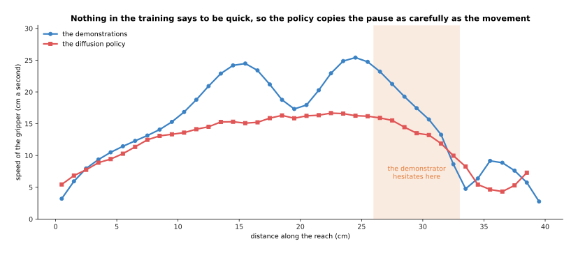

The demonstrator's speed falls from 25.4 centimetres a second to 8.6 at that
place, and the trained policy slows to 8.6 centimetres a second at the same place,
so it has copied the hesitation as carefully as it copied the movement.

That is the deeper point about behaviour cloning of any kind. The policy has no
idea what the task is for, because it was never given a goal, a score or a
preference of the kind [rewards, preferences and
verifiers](../11_learning-from-outcomes/02_rewards-preferences-and-verifiers.md)
describes. It has only the distribution of what somebody did.

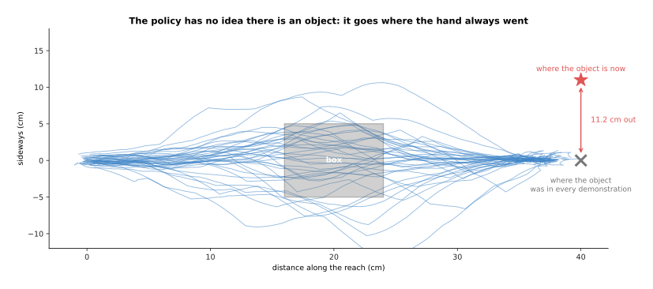

Move the object 11 centimetres sideways, and because the object never moved in any
demonstration, the policy still ends 1.81 centimetres from where it always went
and 11.03 centimetres from where the object now is.

That failure is not stubbornness, it is that the policy was never shown the object
as something that can vary, so nothing in its input tells it anything has changed.
The cure is more varied demonstrations, which costs more of somebody's day, or a
model that has been told the task in words, which is the next page.

The last limit is the one the page before this one named. Covariate shift does not
go away when the output is generated, because a generated chunk is still only as
good as the situations the training covered.

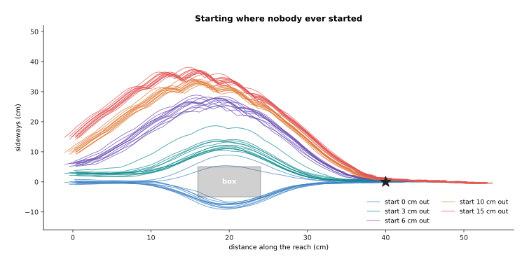

Started where every demonstration started, the policy ends 2.14 centimetres from
the goal, and started 6 centimetres away from any demonstrated start it ends 10.11
centimetres out, rising to 12.82 centimetres at 15.

So a generative policy fixes the problem of two right answers and leaves the
problem of no answer at all. A situation no demonstration covered gets whatever
the network happens to produce there, with no warning and no attempt to get back
to safety, which is why every one of these systems is run with limits on the arm
and a person able to stop it.

---

## 7. Where to read next

- [Vision-language-action models](03_vision-language-action-models.md) is the next
  page, and it attaches the generator built here to a model that has read the web,
  so that the arm can be told in a sentence which of the two ways to take.
- [World models](04_world-models.md) covers the other use of a generative model on
  a robot, which is predicting what the world will do rather than what the arm
  should.
- [Flow matching and other
  generators](../08_models-that-generate/02_flow-matching-and-other-generators.md)
  gives the machinery of section 4 properly, with the vector field written out.
- [Running and evaluating a
  model](../13_using-a-model-for-real/01_running-and-evaluating-a-model.md) is
  where the latency budget of section 5 is set out in full, together with how to
  test a policy honestly.
- [Diffusion and flow
  policies](../../07_learned-models/06_movement-models/02_most-used/03_diffusion-and-flow-policies.md)
  in the catalogue of movement models lists the published policies of this kind
  and what each needs to run.

---

## 8. Using it in Python

Section 2 spoiled a chunk with noise and trained a network to undo it, and section
4 counted the passes that undoing costs. The code below does both with Hugging
Face's `diffusers` package, which supplies the noise schedule and the sampler so
that you write only the chunk shapes and the network.

```python
import torch
from torch import nn
from diffusers import DDPMScheduler

CHUNK, DIM, OBS = 32, 2, 2                  # section 2's shapes: 32 steps of 2 numbers
sched = DDPMScheduler(num_train_timesteps=100, beta_schedule="squaredcos_cap_v2")

net = nn.Sequential(nn.Linear(CHUNK * DIM + OBS + 1, 224), nn.SiLU(),
                    nn.Linear(224, 224), nn.SiLU(), nn.Linear(224, CHUNK * DIM))
print(sum(p.numel() for p in net.parameters()))        # 80032

chunk = torch.zeros(1, CHUNK * DIM)                    # one recorded block of actions
obs = torch.zeros(1, OBS)                              # where the gripper is
noise = torch.randn_like(chunk)
t = torch.randint(0, 100, (1,))
spoiled = sched.add_noise(chunk, noise, t)             # section 2's spoiling
guess = net(torch.cat([spoiled, obs, t[:, None] / 100], dim=1))
loss = nn.functional.mse_loss(guess, noise)            # train it to name the noise

sched.set_timesteps(4)                                 # section 4: four passes, not fifty
print([int(t) for t in sched.timesteps])               # [75, 50, 25, 0]
x = torch.randn(1, CHUNK * DIM)
for step in sched.timesteps:
    eps = net(torch.cat([x, obs, step.view(1, 1).float() / 100], dim=1))
    x = sched.step(eps, step, x).prev_sample
print(x.shape)                                         # torch.Size([1, 64])
```

The library gives you the two things that are fiddly to get right. The scheduler
holds the noise schedule, which is the list that says how much of the chunk
survives at each step, and `add_noise` and `step` apply it in the two directions,
so the arithmetic of section 2 is never written by hand. Changing
`set_timesteps(4)` to `set_timesteps(50)` is the whole of the step-count choice
section 4 measured, and swapping `DDPMScheduler` for a flow-matching scheduler
changes the road without changing the network.

What you have to decide is everything else. You choose how many steps the chunk
covers and how many you play before generating again, which is section 5's
receding horizon. You choose what goes into the conditioning, and on a real arm
that means a camera encoder in front of this network, whose own time comes out of
the same budget. You choose the number of passes, with section 4's curves on one
side and section 5's timeline on the other.

The parameter count above is for the toy network with two numbers of observation.
A real diffusion policy is far larger, because the conditioning is a vision
backbone and the denoiser is usually a one-dimensional convolutional network or a
small transformer over the chunk rather than three linear layers, but the training
loop and the sampling loop are the ones printed here.
