# Vision-language-action models

The page before this one, [diffusion and flow policies](02_diffusion-and-flow-policies.md),
showed how a generative model can write a whole chunk of movement at once, and it left one
thing unfinished, because a diffusion policy or a flow policy is trained on demonstrations
of one job and so does that job and nothing else. This page is about the model that removes
that limit, since it takes a sentence as well as a picture and the sentence says which job
to do.

A **vision-language-action model** is one trained model that reads camera pictures and a
written instruction and gives back the numbers that move a robot arm. The name is a list
of what goes in and what comes out, it is usually shortened to VLA, and the point of it is
that one model covers many jobs because the job is named in words rather than built into
the weights.

This page is for a reader who has read the two pages before it, so you should already know
what a policy is in the robot sense, what behaviour cloning is and what an action chunk is,
all of which are explained on [behaviour cloning and action
chunks](01_behaviour-cloning-and-action-chunks.md). You should also have read
[vision-language models](../10_language-and-multimodal-models/03_vision-language-models.md),
because the body of this model is a vision-language model and that part is not explained
again here.

The page answers four questions. What is this model made of? How is a movement written down
so that a model built to predict words can produce one? How is it trained so that learning
to move does not destroy what it knew? And what does it really carry over to situations it
was not trained on? Every number in the pictures is worked out by
[`docs/diagrams/models_that_act_2.py`](../../diagrams/models_that_act_2.py), and the robot
episodes are simulated from smooth made-up curves, although everything done to them is real
arithmetic.

## Contents

1. [What a vision-language-action model is](#1-what-a-vision-language-action-model-is)
2. [The body: a vision-language model with an action output](#2-the-body-a-vision-language-model-with-an-action-output)
3. [Way one: every action number becomes a token](#3-way-one-every-action-number-becomes-a-token)
4. [Way two: a small continuous action head](#4-way-two-a-small-continuous-action-head)
5. [Co-training: robot episodes and web pictures together](#5-co-training-robot-episodes-and-web-pictures-together)
6. [Cross-embodiment: episodes from many different robots](#6-cross-embodiment-episodes-from-many-different-robots)
7. [What generalisation really looks like, and what it costs to run](#7-what-generalisation-really-looks-like-and-what-it-costs-to-run)
8. [How the task is given: words, and then a video](#8-how-the-task-is-given-words-and-then-a-video)
9. [Where to read next](#9-where-to-read-next)
10. [Using it in Python](#10-using-it-in-python)

---

## 1. What a vision-language-action model is

Start on the outside of the model, because once you can see what goes in and what comes
out, everything inside is easier to follow. The picture below shows one call, with the
sizes worked out for two cameras of 224 pixels by 224 pixels and a six-joint arm.

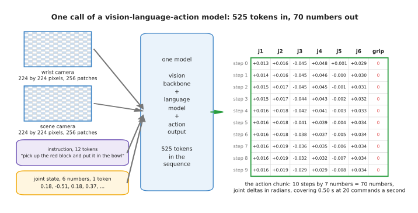

One call takes 525 tokens in and gives back 70 numbers, which are ten steps of seven.

Each camera picture is cut into squares of 14 pixels by 14 pixels, which gives 256 squares
a camera and 512 for the two, the instruction comes to about 12 tokens once an end marker
is added, and the six joint readings are packed into one more, so the sequence is 525
tokens. What comes out is ten steps of six joint movements and one gripper command, which
is 70 numbers covering half a second at 20 commands a second.

The reason this is worth doing is that the instruction changes the answer. The next
picture takes the same cameras and the same joint readings and shows what two different
instructions ask the arm to do.

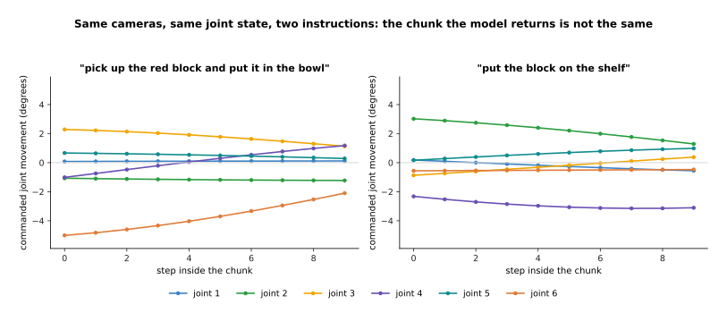

The two chunks differ by 2.53 degrees a joint a step, more than the 1.32 degrees a joint
moves in an average step, so the instruction decides the answer rather than nudging it.

This is what a per-task policy cannot do, because a per-task policy has no input that
says which task to do. The practical effect is on how many models you have to train and
keep working, and on how much data each one learns from.

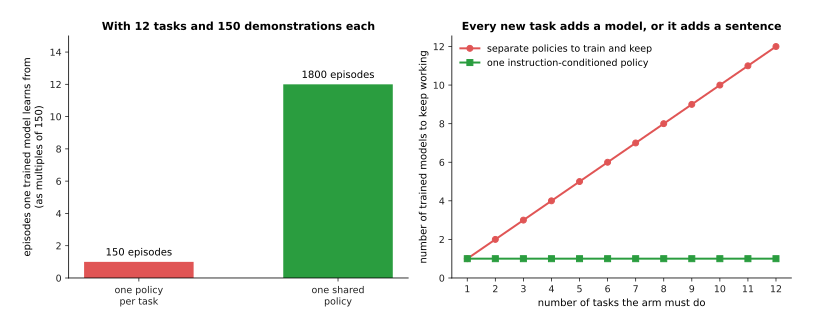

With twelve tasks and 150 demonstrations each, a separate policy learns from 150 episodes
while one instruction-conditioned policy learns from all 1,800.

That is 45,000 frames against 540,000, and the shared model also reuses what it learned
about one task when it does another. The cost is that it is much larger and much slower
than a per-task policy, which is what section 7 is about.

---

## 2. The body: a vision-language model with an action output

The next question is what sits in between, and the answer is a model you have already met.
A vision-language-action model is a
[vision-language model](../10_language-and-multimodal-models/03_vision-language-models.md)
with an action output bolted on, so almost all of it was built to read pictures and write
words, and only the last part is new.

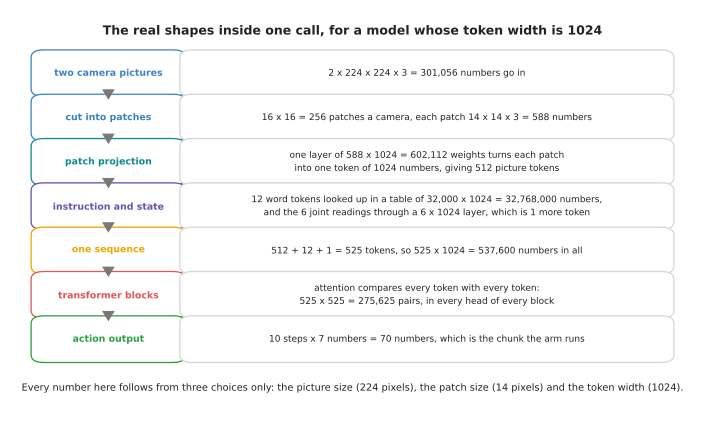

Every number here follows from the picture size, the patch size and the token width.

Two colour pictures of 224 by 224 pixels are 301,056 numbers, each patch is 588 numbers,
and one layer of 602,112 weights turns each patch into a token of 1,024 numbers. The words
are looked up in a table of 32,000 by 1,024, which is 32,768,000 numbers. The 525 tokens
are then 537,600 numbers, and inside every attention layer the model compares every token
with every token, which is 275,625 pairs, and that count is why the camera resolution is
such an expensive choice.

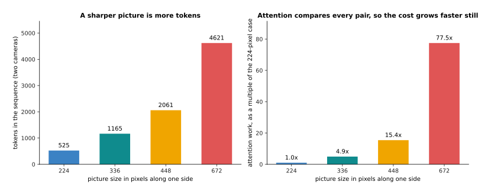

Going from 224 to 672 pixels a side multiplies the tokens by about nine and the attention
work by 77.5.

Doubling the width of the picture puts four times as many patches in, and because attention
compares every pair, four times as many tokens is about sixteen times as much work. A robot
that must see a small screw pays for that sharpness at every call, which is why these models
usually take one wide view of the scene and one close view from a wrist camera rather than
one very sharp view of everything.

The new part is the output, because something has to turn the model's last token of 1,024
numbers into the 70 numbers of a chunk, and the choice of how is the real design split.

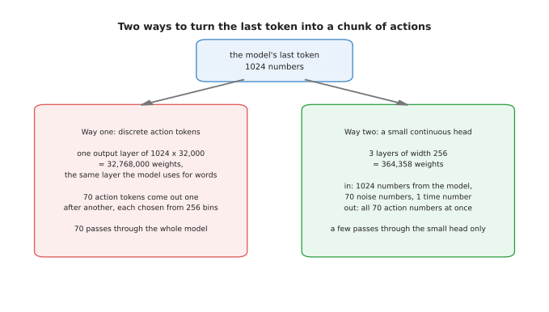

The first reuses the model's 32,768,000-weight word layer, the second adds a small network
of 364,358 weights.

The first way treats each action number as a word, giving it a place in the vocabulary, so
the model produces actions exactly as it produces text. The second attaches a small
network that produces the whole chunk directly. The next two sections take them one at a
time.

---

## 3. Way one: every action number becomes a token

The first way starts from a problem of types, because a language model chooses one entry
from a fixed list while a joint movement can take any value. **Action tokenisation** fixes
that by chopping the range of each action number into bins and treating each bin as one
entry in the vocabulary, so that saying "bin 137" is the same kind of act as saying the
word "bowl". The range the bins cover is settled from the training data rather than from
the arm's data sheet.

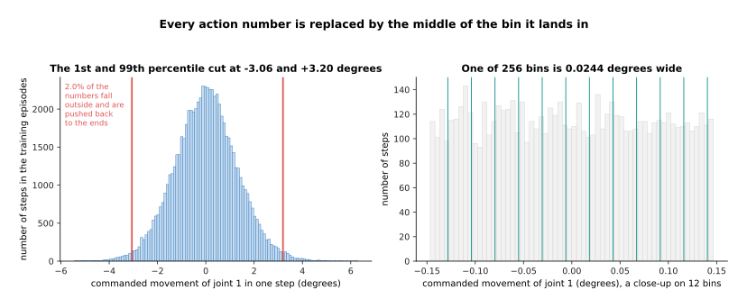

For this joint the 1st and 99th percentile of the recorded movements fall at -3.06 and
+3.20 degrees, and with 256 bins one bin is 0.0244 degrees wide.

Anything outside that range is pushed back to the end bin, which happens to 2.0 per cent of
this joint's numbers. The only question left then seems to be how many bins to use, and the
measured answer is that it stops mattering very quickly.

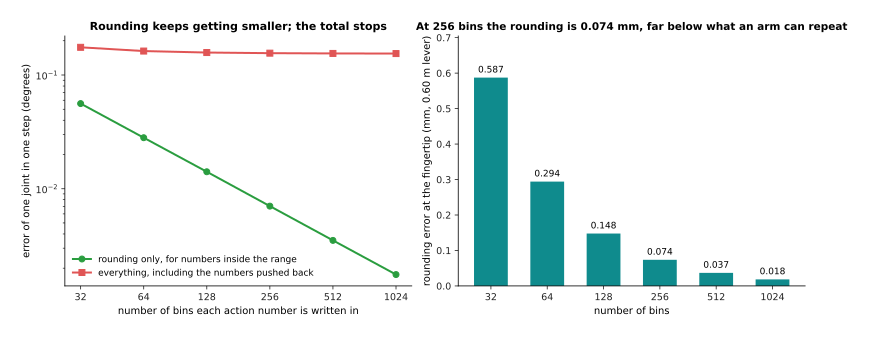

At 256 bins the rounding alone is 0.0070 degrees a joint a step, which is 0.074 millimetres
at a fingertip 0.60 metres away, and the worst single rounding is 0.0125 degrees.

That is far below what any arm can repeat, so rounding is not the cost. The cost hides in
the 2.7 per cent of numbers that fall outside the range and get pushed back, because those
are the fastest movements and pushing them back always shortens them, and since the model
produces movements rather than positions those shortfalls add up.

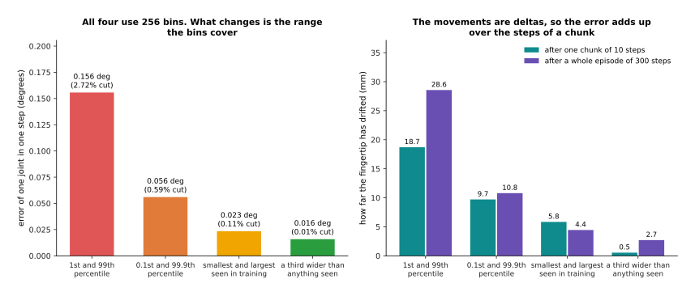

All four use 256 bins and differ only in the range covered, which moves the one-step error
from 0.156 to 0.016 degrees and the drift after one chunk from 18.70 to 0.54 millimetres.

Cutting at the 1st and 99th percentile pushes back 2.72 per cent of the numbers and leaves
the fingertip 18.70 millimetres out of place after only ten steps, cutting at the 0.1st and
99.9th pushes back 0.59 per cent and halves that to 9.71 millimetres, and making the range
a third wider than anything ever recorded leaves 0.54 millimetres, which is the floor set
by rounding alone. So the number of bins is the part people argue about and the range is
the part that costs them millimetres.

The real price of this method is not accuracy but the number of tokens, because every
action token is produced one at a time.

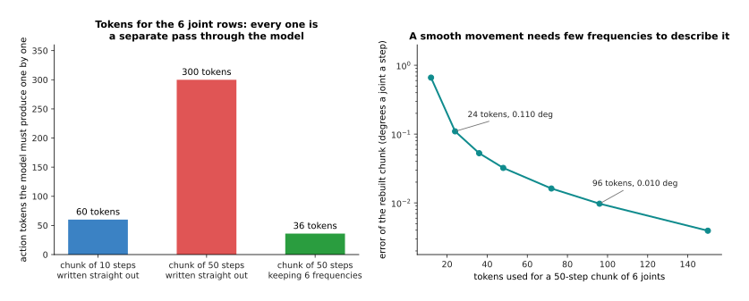

A ten-step chunk costs 60 tokens for six joints and a fifty-step chunk costs 300, while
describing the longer one by its first six frequency terms costs 36 tokens and rebuilds it
to within 0.053 degrees.

The right-hand chart uses a discrete cosine transform, which rewrites a sequence of numbers
exactly as a sum of waves of different speeds. A demonstrated movement is smooth, so almost
all of it lives in the slowest few waves, and keeping four terms a joint rebuilds the chunk
to 0.110 degrees using 24 tokens instead of 300. Several real systems compress a chunk this
way before tokenising it, and that is the honest answer to the token count rather than
fewer bins.

So action tokenisation is the simplest thing that can be done, it needs no new machinery,
it trains with the loss the language model already used, and because actions live in the
same vocabulary as words the model can take robot data and text in the same batch. Its
cost is one pass through the whole model for every number it produces.

---

## 4. Way two: a small continuous action head

The alternative keeps the same body and replaces the output. Instead of naming a bin, a
small extra network called an **action head** takes the model's last token and produces all
70 numbers at once. The head is almost always generative, built with flow matching or
diffusion, for the reason given on [diffusion and flow
policies](02_diffusion-and-flow-policies.md): a plain network trained with squared error
answers an ambiguous situation by averaging the possible movements, and the average of two
good movements is usually a bad one.

A flow-matching head starts from a list of random numbers and walks it, in a few equal
steps, into a list of action numbers, following a direction it has learned to predict. The
head in the pictures below is real, a small network trained in NumPy on the simulated
chunks by the method described on [flow matching and other
generators](../08_models-that-generate/02_flow-matching-and-other-generators.md), and what
it is told about the situation is the ten actions just before the chunk.

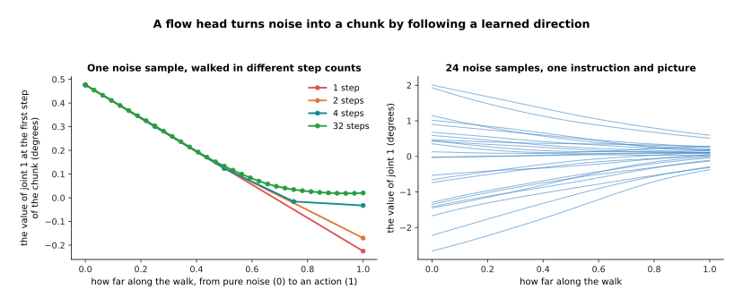

One big step lands this joint 0.245 degrees from where thirty-two small steps land it, two
steps 0.190 degrees away and four steps 0.053 degrees away.

The paths are nearly straight, which is what flow matching is for and why a handful of
steps is enough. The right-hand chart starts twenty-four random lists from the same
situation and they end close together, which is the head agreeing with itself. The number
of steps trades exactness for time, and the trade can be measured.

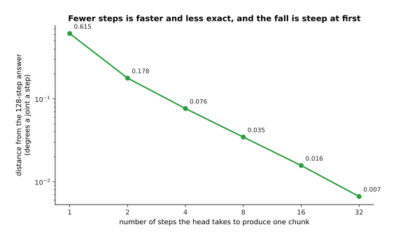

One step leaves the chunk 0.615 degrees out, two leaves 0.178, four leaves 0.077 and eight
leaves 0.035 degrees, which is 0.363 millimetres at the fingertip.

Eight steps is already below what the arm can repeat, and that is the argument for this
design, because eight passes through a small head is nothing next to seventy through the
whole model.

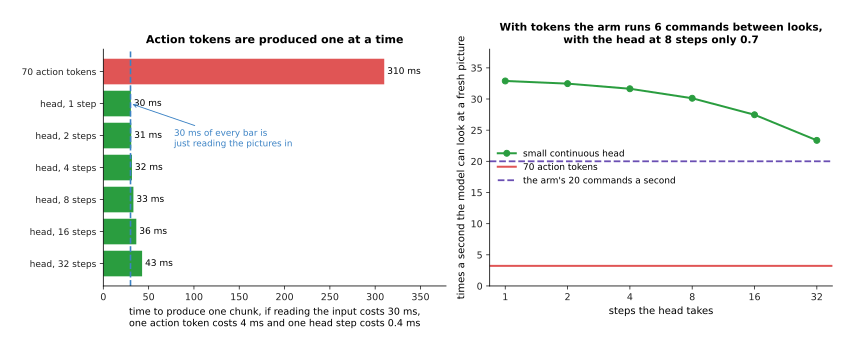

If reading the 525 input tokens costs 30 milliseconds, one action token 4 and one head step
0.4, then 70 action tokens take 310 milliseconds and the head at eight steps takes 33.2.

Those numbers decide how often the model looks at a fresh picture, which is 3.2 times a
second with action tokens and 30.1 with the head. At 20 commands a second the arm runs 6.2
commands on old information in the first case and 0.7 in the second, and a robot reacting
to something moving cares about that far more than about a hundredth of a degree.

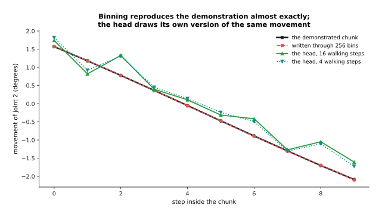

Binning moves this chunk by 0.0073 degrees, while the head's own chunk sits 0.326 degrees
from the demonstrated one, and over 200 situations it lands 0.315 degrees away a joint a
step.

The binned version copies a given chunk most exactly, which is true and not the point,
because the head is not trying to copy a chunk but to draw one of the movements that fit
the situation, and its wobble is partly the price of choosing and partly the price of a
small head trained for seconds in NumPy. So tokens are simpler and copy more exactly,
while the head is roughly ten times faster and handles ambiguity properly, and most recent
systems take the head.

---

## 5. Co-training: robot episodes and web pictures together

Both ways of producing an action leave the same question open, which is how to train the
thing without ruining it. The body knows what a bowl is because it was trained on an
enormous amount of ordinary pictures and text, and training it on robot episodes alone
destroys exactly that, for the reason set out under catastrophic forgetting on
[fine-tuning and adapters](../07_pretraining-and-adapting/03_fine-tuning-and-adapters.md).
The effect is easy to measure where one small network is trained on a general job and then
taught a second one.

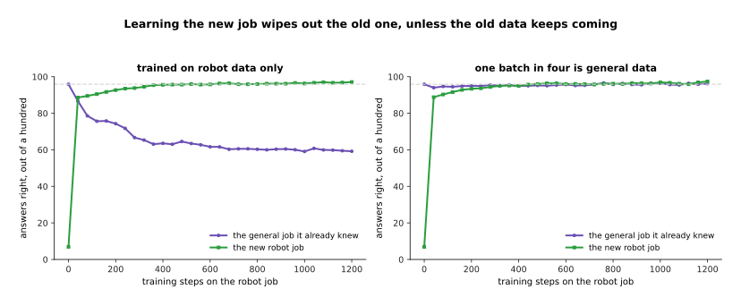

On the robot job alone the general job falls from 95.9 per cent right to 59.2, and with one
batch in four drawn from general data it stays at 96.2 while the robot job reaches 97.4.

**Co-training** is the name for the fix shown on the right, which is to keep feeding the
old data while the new job is learned, so that every batch is partly robot episodes and
partly ordinary pictures and text. It is not a clever method, it is refusing to stop
showing the model the thing you want it to remember, and the question is how much of the
old data is needed.

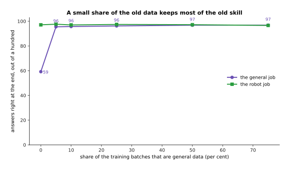

Five per cent of the batches brings the general job back from 59 to 95.5 per cent, and
three quarters gains only another 1.4 points while the robot job starts to slip.

The reason this needs saying out loud is that the natural sizes of the two sets are
nothing like the sizes you want.

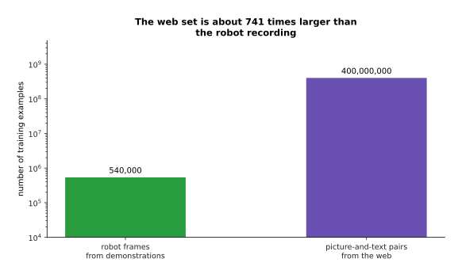

A recording of 1,800 episodes is 540,000 frames and a modest web set is 400,000,000 pairs,
so pouring them together would make robot frames 0.1348 per cent of the batches.

At that share the model would barely learn to move, so the mixture is chosen on purpose and
enforced by the sampler, and at three quarters robot data every robot frame is seen about
2,222 times for each pass through the web set. The cost is that training takes longer and
that repeating the robot data that many times risks memorising rather than learning.

---

## 6. Cross-embodiment: episodes from many different robots

Co-training keeps old knowledge while robot data is added, and the next question is where
more robot data comes from. **Cross-embodiment** training pools episodes recorded on many
different robots into one training set, and embodiment just means the particular body the
episodes were recorded on. The difficulty is that two robots do not speak the same numbers,
even when doing the same thing.

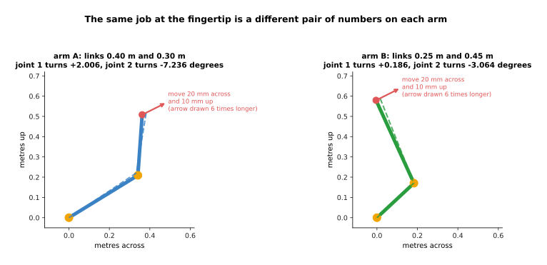

To move the fingertip 20 millimetres across and 10 up, an arm with links of 0.40 and 0.30
metres turns its joints +2.006 and -7.236 degrees, and one with links of 0.25 and 0.45
metres turns them +0.186 and -3.064 degrees.

The same job at the fingertip is a different pair of numbers at the joints, so an action
recorded on one arm means nothing on the other. There are two standard ways round this. The
first describes the action at the fingertip, recording how far the gripper should move and
leaving each robot's controller to work out the joint turns. The second scales each robot's
numbers by that robot's own range, so every robot's numbers fill the same interval.

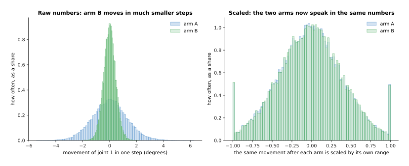

Arm A's first joint runs from -3.06 to +3.20 degrees a step and arm B's from -1.07 to
+1.11, and after each is divided by its own range the two sit on top of each other.

With the numbers made comparable, the pooling can be tried, and the result depends
entirely on one detail.

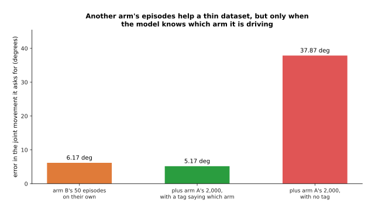

Adding 2,000 episodes from another arm cuts the error from 6.17 to 5.17 degrees when the
model is told which arm it is driving, and raises it to 37.87 when it is not.

That third bar is why real systems add an embodiment tag to the input: a model that cannot
tell the arms apart must give one answer for both, and the average of two different answers
fits neither. With the tag in place the pooled data helps, and the next chart says when.

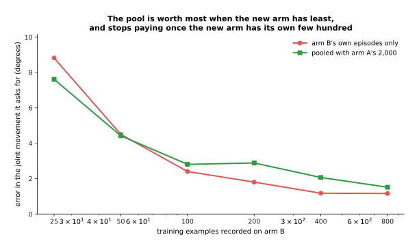

With 25 of its own examples arm B does better with the pool, 7.61 degrees against 8.82,
and with 50 the two are level, while from 100 examples upwards its own data alone is the
better teacher.

That is the honest shape of the result here. Pooling buys most where a new robot has almost
no data of its own, because the shared part of the job, which here is working out where the
object is from the camera, is learned from everybody's data at once. Once the new robot has
a few hundred episodes the shared network must split its capacity between bodies, and that
costs more than the pooling gains, so cross-embodiment data starts a new robot quickly
rather than making a well-served one better.

---

## 7. What generalisation really looks like, and what it costs to run

Pooling other robots' episodes was the last of the ways of getting more out of the data,
and this section is about what you get in return, which is the part most often described
too generously. The useful question is not whether these models generalise but which change
they survive, and the four below behave very differently. The first is moving the object,
and that works inside limits that are easy to measure.

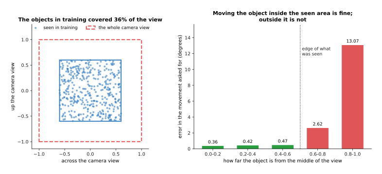

Where the training objects covered 36 per cent of the camera view the error stays between
0.36 and 0.47 degrees inside that area, and rises to 2.62 and then 13.07 degrees outside
it.

So "the same task with the object moved" is two claims. Moved within the patch of table the
demonstrations covered, the model is fine, and that is what people see in a demonstration
video. Moved to a corner nobody ever put an object in, it is thirty times worse. The second
change is a new object of a kind the model has seen, which separates cleanly from a new
kind altogether.

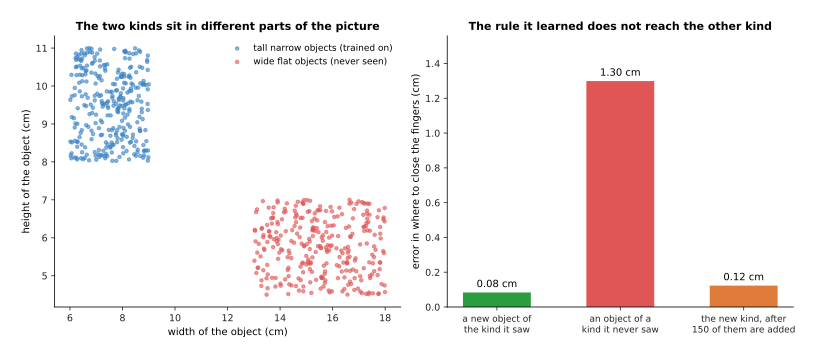

A rule learned from 200 tall narrow objects places the fingers on a new tall narrow one to
within 0.08 centimetres and on a wide flat one to 1.30 centimetres, sixteen times worse,
until 150 wide flat objects are added and it drops to 0.12.

The rule did not change between the two kinds, because in this simulation it is literally
the same rule. The new kind sits in a part of the object's description the training set
never visited, so the model is guessing rather than recalling, which means it can fail on
a new object even when the right answer follows from what it knows. The third change is
rewording the instruction, and that one genuinely works.

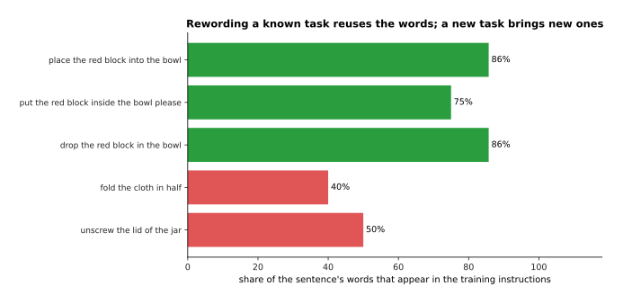

Three ways of saying the same trained task reuse between 75 and 86 per cent of the words in
the training instructions, while two new tasks reuse only 40 and 50 per cent.

The word count is a crude stand-in rather than a measurement of what the model does, and
rewording really works because the language half was trained on far more text than the
robot data holds, so it already treats those sentences as near neighbours. This is where
the web pretraining pays off directly. The fourth change is a genuinely new task, and today
it does not work, because a model shown twelve tasks does not do a thirteenth for being
asked nicely, and what people call zero-shot success here is almost always one of the first
three cases.

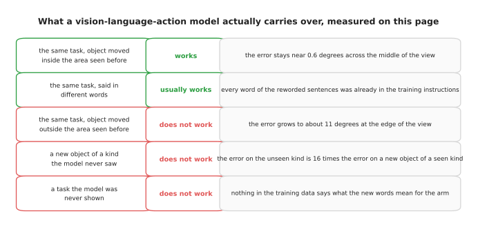

The five rows gather the measurements above, with the error figures taken from the same
experiments shown earlier on this page.

That leaves the cost of running one of these models. A model that takes 310 milliseconds
to produce a chunk cannot be asked for a new command every 20 milliseconds, and there are
three things people do about it.

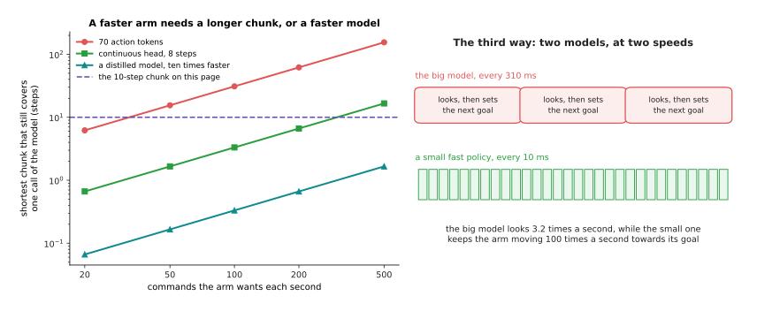

At 100 commands a second the chunk must cover at least 31 steps with action tokens, 3.3
with the head and 0.3 with a distilled model ten times faster.

The first fix is a longer chunk, which costs reaction time because the arm is acting on a
picture that is by then old. The second is a smaller model trained to copy the big one,
the distillation described on [making a model smaller and
faster](../07_pretraining-and-adapting/04_making-a-model-smaller-and-faster.md), which
costs some of the big model's knowledge. The third, on the right of the picture, runs the
big model slowly to decide what to aim for and a small fast policy underneath to move the
joints, so the big model fires about once for every 31 steps of the fast one. That split
is now usual, and it leads straight into the next page, because a model that decides what
to aim for is close to one that predicts what will happen.

---

## 8. How the task is given: words, and then a video

Everything above concerns how a model turns pictures into movement. This section is
about the other input, which is how the model is told which movement to make, because
in 2026 that is where the arrangement changed.

Every model described so far is told in words. The instruction "put the cup on the
saucer" is turned into tokens, those tokens join the picture tokens, and attention
mixes the two. Words are convenient and they are also a narrow channel: "fold the
towel" does not say which fold, in which order, or to what standard, so the model
supplies the missing detail from the average of its training data rather than from
what you wanted.

The alternative is to give the model an example of the task instead of a description of
it. The example is a short video, it enters the model as more tokens exactly as the
instruction did, and attention can then compare the current picture against the
recording. Nothing about this needs a new kind of layer, which is the point worth
taking from it: the machinery of section 2 already allows it, because a transformer
attends over whatever tokens it is given and does not care what they came from.

What it does need is pretraining that makes reading an example a thing the weights can
do. That is the same requirement that made few-shot prompting work for text, and it is
why the models that do this are built for it from the start rather than adapted to it
afterwards.

[Skild S1](https://www.skild.ai/blogs/s1), announced in August 2026, is the model that
made this claim for manipulation. It is shown one video of a task lasting up to ten
minutes and performs the task with no fine-tuning. The company reports 66 per cent
success on tasks never seen before against 9 per cent for models prompted with words,
and that one video did the work of about 380 episodes of post-training.

Those figures should be read with care, and three facts decide how much weight to put
on them. The headline comparison is an average of per-step success rather than of whole
tasks completed, which flatters a long task. No architecture, parameter count or
independent evaluation has been published. And the model is available only to
commercial partners, so none of it can be checked on your own arm.

The reason the idea belongs on this page anyway is that it separates two things this
chapter has treated as one. A model's capability lives in its weights, but the task it
performs need not. Once the task arrives as input, teaching a robot something new stops
being a training problem and becomes a recording problem, and that is a different shape
of engineering from everything else in this book.

Book 7 works through what each route costs, and measures the trade on a worked example,
in [prompting with a
demonstration](../../07_learned-models/10_making-models-work-on-an-arm/03_also-used/02_prompting-with-a-demonstration.md).

---

## 9. Where to read next

- [World models](04_world-models.md) is the next page, and it covers models that predict
  what will happen next rather than reacting to what is there now.
- [Diffusion and flow policies](02_diffusion-and-flow-policies.md) holds the generative
  machinery the action head of section 4 is built from.
- [Fine-tuning and adapters](../07_pretraining-and-adapting/03_fine-tuning-and-adapters.md)
  explains catastrophic forgetting in full, which is what co-training exists to solve,
  and its first rung is where section 8's video prompt belongs on the ladder.
- [Running and evaluating a model](../14_using-a-model-for-real/01_running-and-evaluating-a-model.md)
  takes section 7's latency arithmetic further and says how to test a policy honestly.
- [Vision-language-action models](../../07_learned-models/07_language-models/02_most-used/01_vision-language-action-models.md)
  in the next book is the catalogue for this family, with the named models and their costs.
- [Vision-language models](../../07_learned-models/07_language-models/02_most-used/02_vision-language-models.md)
  is the catalogue for the body these models are built from.

---

## 10. Using it in Python

Section 3 measured what binning does to an action and section 4 what a flow head does
instead, and both are a handful of lines of real code. The lines below use NumPy and
PyTorch, so you can see that binning is arithmetic rather than a library and that the head
is an ordinary small network. No library gives you a whole vision-language-action model as
one call, so this shows the output end, which is the part that differs between designs.

```python
import numpy as np
import torch
from torch import nn

# Section 1: a chunk is CHUNK steps by ACTION_DIM numbers.
CHUNK, ACTION_DIM, BINS = 10, 7, 256
rng = np.random.default_rng(0)
chunks = rng.normal(0.0, 0.02, (64, CHUNK, ACTION_DIM))   # stand-in for recorded actions

# Section 3: the range comes from the data, then every number becomes a whole number.
lo = np.percentile(chunks.reshape(-1, ACTION_DIM), 1.0, axis=0)
hi = np.percentile(chunks.reshape(-1, ACTION_DIM), 99.0, axis=0)
z = np.clip(2.0 * (chunks - lo) / (hi - lo) - 1.0, -1.0, 1.0)
ids = np.clip(((z + 1.0) / 2.0 * BINS).astype(int), 0, BINS - 1)   # the action tokens
back = (ids + 0.5) / BINS * 2.0 - 1.0
rebuilt = (back + 1.0) / 2.0 * (hi - lo) + lo
print('tokens per chunk:', ids.size // len(chunks))                # 70
print('worst rounding, degrees:',
      round(float(np.degrees(np.abs(rebuilt - chunks).max())), 4))

# Section 4: the head is a small network that predicts a direction to walk in.
head = nn.Sequential(nn.Linear(CHUNK * ACTION_DIM + 1 + 1024, 256), nn.ReLU(),
                     nn.Linear(256, 256), nn.ReLU(),
                     nn.Linear(256, CHUNK * ACTION_DIM))
print('weights in the head:', sum(p.numel() for p in head.parameters()))

def sample(context, steps=8):                 # context is the model's last token
    x = torch.randn(len(context), CHUNK * ACTION_DIM)
    for k in range(steps):                    # section 4's walk, in equal steps
        t = torch.full((len(context), 1), k / steps)
        x = x + (1.0 / steps) * head(torch.cat([x, t, context], dim=1))
    return x.reshape(-1, CHUNK, ACTION_DIM)

print('chunk shape from the head:', tuple(sample(torch.zeros(4, 1024)).shape))
```

PyTorch gives you the layers, the gradients and the optimiser, and a library such as
Hugging Face `transformers` gives you the vision-language model that would supply the
1,024-number context in the last line. What no library decides is everything this page has
been about: you choose the range the bins cover, which section 3 showed costs millimetres
while the number of bins costs almost nothing; you choose between the two output styles,
which section 4 showed is worth about ten times in speed; and you choose the mixture of
robot and web data, which section 5 showed is the difference between keeping and losing
what the model knew.

The subtle line is the walk inside `sample`, which starts from random numbers and takes
equal steps in a direction the head predicts, and the number of steps is the knob measured
in section 4. Training that head needs the flow-matching loss described on [flow matching
and other
generators](../08_models-that-generate/02_flow-matching-and-other-generators.md), which is
a few lines more: draw a random list, mix it with a real chunk in some proportion, and
train the head to predict the difference.

None of this code is the hard part. The hard part is collecting the demonstrations, and
section 7 says why, because what the model can do is set almost entirely by where the
objects were when somebody recorded them.
