# Before you train anything

The page before this one, [world models](../12_models-that-act/04_world-models.md), was the
last page that opens one family of model and shows what it does inside. Together with every
page before it, that page leaves you knowing what a neuron does, what a loss is, what a
transformer is for, and what a policy gives back when it looks at a camera picture. It also
leaves one question open, and that question is probably why you are here. You want to build one
of these models yourself, so where do you start?

This chapter answers that question, and every page in it is practical. This first page is about
the work that comes before the first training run. People often lose a month on a model, and
they almost never lose it inside the training loop. They lose it earlier, because the job was
never written down clearly, because the number that measured success was never agreed on,
because there was nothing to compare the model against, because nobody opened the recorded
examples and looked at them, and because the examples were divided in a way that quietly handed
the answers to the model. So this page works through five decisions, in the order you should
make them. First, decide whether a model is the right answer at all. Second, write the job down
as what goes in, what comes out, and the one number that says it worked. Third, find the cheap
answers that the model has to beat. Fourth, decide how few examples you can honestly start
with. Fifth, decide how to divide those examples, before a single weight changes.

The page assumes you know three things. A **weight** is one of the numbers inside a model that
training is allowed to change. A **loss** is a number that says how wrong one answer was, and
training tries to make it small. A **held-out set** is a group of examples that the model never
trains on, kept back so that you can measure the model on something it has not seen. The page
also assumes that you have never started a model of your own. You should read [where rules stop
working](../01_what-learning-means/02_where-rules-stop-working.md) first, because
section 1 returns to the question that page opened and answers it with measurements.

Everything below is measured on one simulated work cell. A work cell is one robot and the
space it works in. Here an arm picks small parts off 40 trays, and each tray holds 6 parts. The
camera measures each part 12 times as the arm comes down. So the recording holds 240 parts and
2,880 frames, where a frame is one set of camera measurements taken at one moment. The data is
invented by a random number generator with a fixed starting value, so it comes out the same
every time the script runs. Everything done to that data is real arithmetic, including the
rules, the baselines and the small networks. The script is
[`docs/diagrams/starting_your_own_model_1.py`](../../diagrams/starting_your_own_model_1.py).

## Contents

1. [Is a model the right answer at all](#1-is-a-model-the-right-answer-at-all)
2. [The job written down as three things](#2-the-job-written-down-as-three-things)
3. [The baseline a model has to beat](#3-the-baseline-a-model-has-to-beat)
4. [The first hundred examples](#4-the-first-hundred-examples)
5. [The split, decided before any training](#5-the-split-decided-before-any-training)
6. [The sheet you should have filled in](#6-the-sheet-you-should-have-filled-in)
7. [Where to read next](#7-where-to-read-next)
8. [Using it in Python](#8-using-it-in-python)

---

## 1. Is a model the right answer at all

The first of the five decisions comes before all the others, and the test for it is short. If a
person can write the rule down in an afternoon, and the numbers in that rule do not change over
time, then write the rule. A model is for the jobs where nobody can write the rule at all.

The first job in this work cell is on the easy side of that line. The arm needs to know whether
its gripper is holding anything. It has two measurements to decide from: how far apart the two
fingers are, in millimetres, and how much electric current the motor is drawing, in amperes. A
motor that is squeezing a part draws more current than a motor that has closed on nothing. The
first picture draws every reading as one dot, and it draws the rule as three straight lines
across those dots.

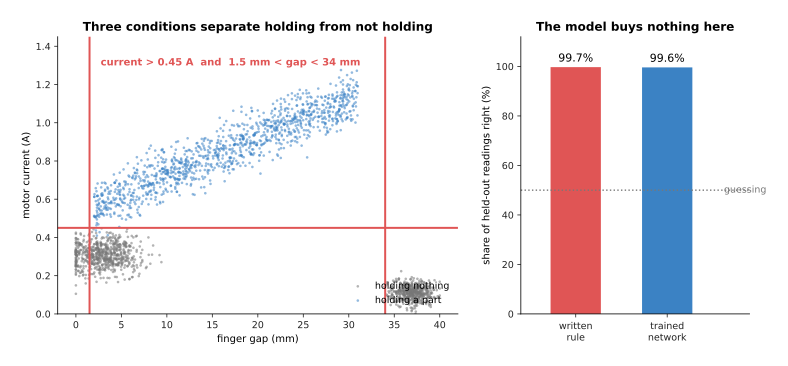

The rule is this: the current is above 0.45 amperes, and the fingers are between 1.5 and 34
millimetres apart. That rule is right on 99.7 per cent of held-out readings. A trained network
gets 99.6 per cent, which is no better.

Anybody can read those three numbers off the picture in a few minutes, and no model beats a
rule that is already right nearly every time. Other robot jobs on this side of the line include
counting how often the gripper closes, stopping the arm when a measured force passes a limit,
turning the counts from a joint sensor into an angle, and refusing a target that lies outside
the space the arm can reach. In each of those a person knows the rule, and knows why each
number in it has the value it has.

The second job is not like that. The arm has to choose one of three ways to take hold of a
part. A **pinch** squeezes the part between two fingers. A **wrap** closes the fingers right
around it. A **suction** cup sticks to a flat surface and lifts by air pressure. The right
choice depends on all five measurements together, so a rule drawn as a few straight cuts cannot
separate the three. The next picture shows two of the five measurements, with each part
coloured by the grip that is right for it, and with the two cuts a person would try.

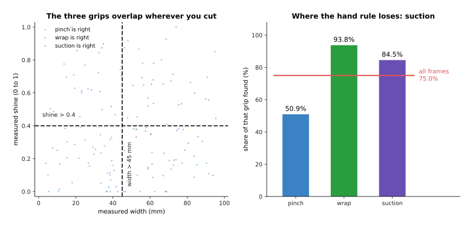

A sensible hand-written rule gets 75.0 per cent of held-out frames right. It finds 93.8 per
cent of the wraps and 84.5 per cent of the suctions, but only 50.9 per cent of the pinches.

The three colours mix wherever you cut, and the bar chart on the right shows what that mixing
costs: the rule finds most of the wraps and the suctions, and it misses half of the pinches. The obvious reaction is to add more conditions to the rule. Other jobs on this side of the
line include choosing a grip for a part the robot has never seen, finding parts in a picture of
a crowded tray, and telling a chipped part from a sound one. The next picture adds conditions
one at a time, to both jobs, and measures what each extra condition buys.

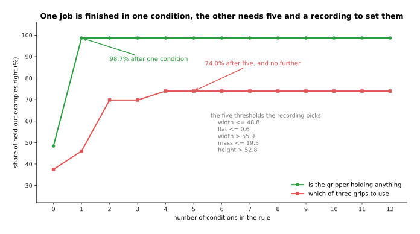

One condition finishes the holding job at 98.7 per cent. The grip job climbs from 37.5 per cent
with no conditions to 46.0 with one, 69.8 with three and 74.0 with five. After that, seven more
conditions change nothing.

A person did not write the conditions in that second curve. A search read a recording of 144
parts and chose each threshold so that it cut out as many mistakes as possible. The search
arrived at a width of 48.8 millimetres and a mass of 19.5 grams, and nobody could have written
those two numbers down beforehand. That is the real test, hiding inside the first one. The
moment you need a recording to set the numbers in your rule, you are already fitting a model,
and a worse one than a model you would train on purpose.

The other half of the test is whether the rule stays correct once it is written. Sensors change
as the machine wears, so the next picture repeats the holding job while the current sensor
slowly reads lower than it should.

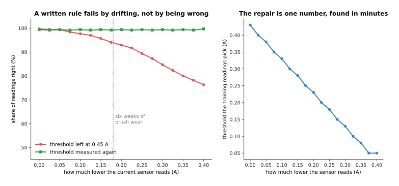

The brushes inside the motor wear down, so the current sensor comes to read 0.18 amperes lower
than the truth. The rule with its threshold left at 0.45 then falls from 99.7 per cent to 93.9.
Measuring the threshold again on fresh readings brings the rule back to 99.2 per cent.

So a written rule usually fails by drifting, and not by being wrong on the day it was written.
Somebody has to notice the drift and measure the number again. The next picture shows what that
repair costs, by plotting the threshold that fresh readings choose at each amount of drift.

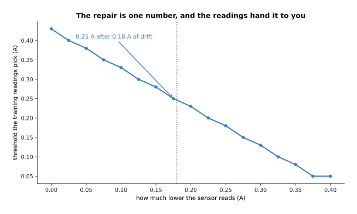

With no drift the readings choose a threshold of 0.43 amperes. After 0.18 amperes of drift they
choose 0.25, and the line between those two points is straight.

The repair is therefore one number, and finding it takes minutes rather than days. That is a
much less work than retraining a model, so drift on its own is no reason to choose a model
instead. A model is the answer only when nobody can write the rule at all.

---

## 2. The job written down as three things

Section 1 settled that the grip job needs a model. However, "choose the right grip" is not yet
a job. A job is three things written down. The first is exactly what goes in, with its units
and its count of numbers. The second is exactly what comes out. The third is the one number
that says whether the whole thing worked.

Start with what goes in, and count it rather than describe it, because the count decides what
the model costs before you have trained anything. The next picture counts four possible inputs,
and then counts the weights that the first layer of a model would need for each of them. Both
charts use a logarithmic scale, which means each step up the axis multiplies by ten, because
the smallest and largest numbers here are a hundred thousand times apart.

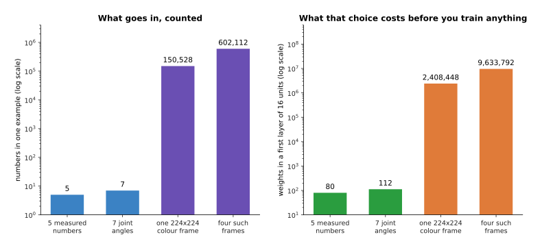

Five measured numbers is five numbers. One colour picture of 224 by 224 pixels is 150,528
numbers, because every pixel carries a red, a green and a blue value. Four such pictures is
602,112. A first layer of 16 units needs one weight for every input number and every unit, so
it needs 80 weights in the first case and 2,408,448 in the third.

The five numbers in this cell are the width in millimetres, the height in millimetres, the
estimated mass in grams, how shiny the surface is on a scale from zero to one, and how flat the
top face is on the same scale. The units matter, and writing them down is not a formality. The
next picture takes the network trained in section 3, which learnt from widths in millimetres,
and hands it the same widths in centimetres. Nothing else changes.

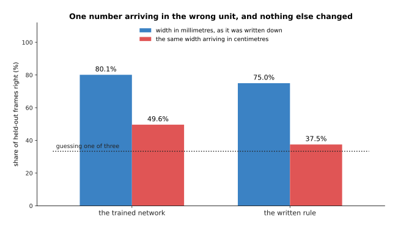

The trained network scores 80.1 per cent when the width arrives in millimetres, as it did
during training, and 49.6 per cent when the same width arrives in centimetres. The written rule
falls further, from 75.0 per cent to 37.5, which is the score of always answering "pinch".

Neither answer complains, and neither one crashes. They simply become wrong, because a width of
4.8 means a small part in millimetres and a large one in centimetres. Feeding a working system
the same quantity in a different unit is the most common way to break it later, so the unit
belongs beside the name of every input.

What comes out is shorter to write: one of pinch, wrap and suction. The third thing is the one
people usually leave vague. They write something like "the arm should pick things up reliably",
and that cannot be measured until somebody says what counts as a success. The next picture
scores one recording of attempts three times, under three definitions of success, from the
loosest to the strictest.

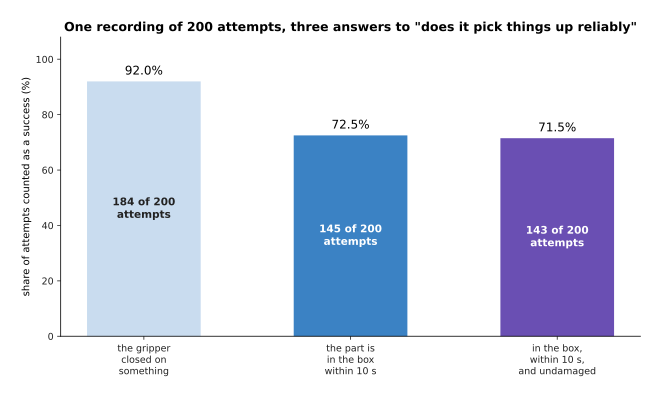

Of 200 simulated attempts, 184 ended with the gripper closed on something, 145 ended with the
part in the box within ten seconds, and 143 ended with the part in the box, in time, and
undamaged. Those are 92.0, 72.5 and 71.5 per cent of the same 200 attempts.

So the worked version of the vague sentence reads like this. The input is the five measured
numbers for one part, in the units above. The output is one of pinch, wrap and suction. The one
number is the share of attempts in which the part ends up in the box within ten seconds and
undamaged, counted over parts from trays that nobody trained on. Somebody who was not in the
room when you wrote that down can measure it, and that is the point of writing it. The
difference between the loosest definition and the strictest is 20.5 points, and those 20.5
points do not make the robot any better.

There is a second way to choose the one number badly, which is to choose a number that a
useless answer already scores well on. The crack inspection job in this cell shows it, because
only about one part in ten is cracked. **Accuracy** means the share of all answers that are
right. The next picture compares a detector against an answer that never detects anything.

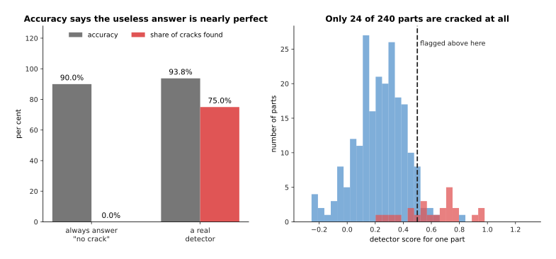

Only 24 of the 240 parts are cracked. So always answering "no crack" is 90.0 per cent accurate
while finding no cracked part at all. A real detector scores 93.8 per cent accuracy and finds
75.0 per cent of the cracks.

Accuracy is worthless as the one number for that job, because what you care about is the share
of cracked parts the detector finds. The last thing to settle is how many attempts the one
number is measured over, because a success rate taken from a few tries is mostly noise. The
next picture takes a model that really succeeds 70 times in 100, and shows what different
numbers of trials report about it. The red bar on each group is the 95 per cent interval, which
is the range of answers that are consistent with the trials you ran.

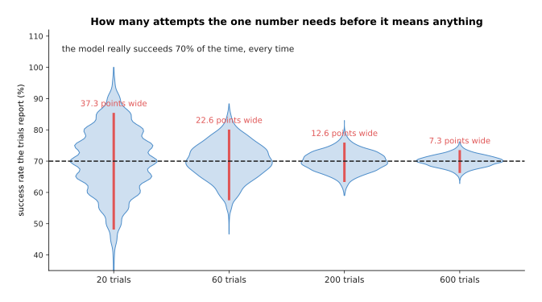

For a model that really succeeds on 70 attempts in 100, twenty trials give a range of possible
answers 37.3 points wide. Sixty trials give 22.6 points, two hundred trials 12.6 points and six
hundred trials 7.3 points.

Twenty trials on a real arm is an afternoon of work, and that afternoon produces a number that
could be anywhere from 48.1 to 85.5 per cent for one and the same model. So deciding in advance
how many attempts the final measurement needs is part of writing the job down, and that
decision also tells you how much arm time the project will cost.

---

## 3. The baseline a model has to beat

The job from section 2 now has an input, an output and one number, so anything at all can be
scored on it. A **baseline** is a cheap answer that took no training. Its score is the line a
model has to cross before anybody is allowed to be pleased. Three baselines are worth running
every time.

The first is to always give the most common answer, which measures how unbalanced the job is.
The second is the rule somebody would have written by hand, from section 1. The third is
**nearest neighbour**, which stores every training example and answers a new one by copying the
answer of the stored example whose numbers are closest to it. The next picture shows nearest
neighbour working on five new frames. It uses only two of the five measured numbers, so that
the distances can be drawn on paper, and both numbers are standardised, which means each one is
divided by its own spread so that a width in millimetres and a shine between zero and one count
equally.

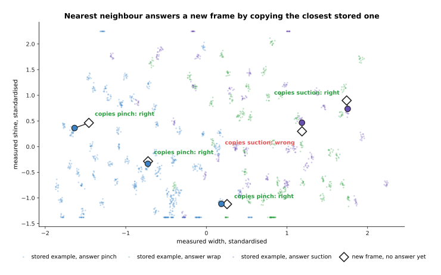

Each white diamond is a new frame with no answer yet. The line joins it to the stored frame
that sits closest to it, and the new frame simply takes that stored frame's answer. Four of the
five copy the right answer and one copies a wrong one. On these two numbers alone the method
scores 49.1 per cent on all held-out frames, against 79.2 per cent when it uses all five.

The next picture puts the three baselines and one small trained network on the same data and
the same split, so that the five scores can be read against each other.

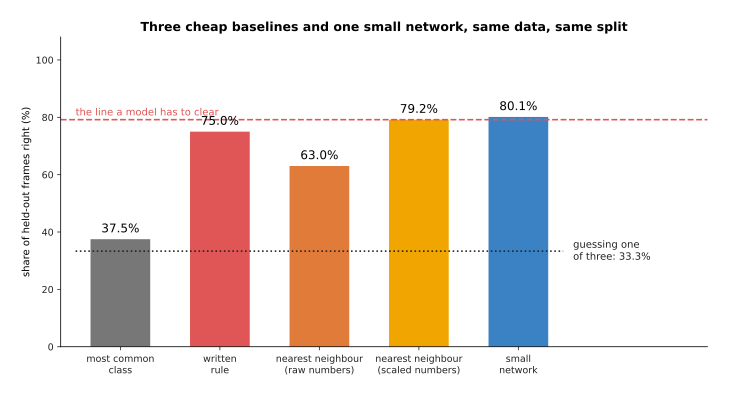

On the same 1,728 training frames and 576 held-out frames, always answering "pinch" scores 37.5
per cent. The written rule scores 75.0. Nearest neighbour on the raw numbers scores 63.0.
Nearest neighbour after scaling each number to the same spread scores 79.2. A small trained
network scores 80.1.

That is the honest shape of most first attempts. The network beats nearest neighbour by 1.0
points, and nearest neighbour is two lines of code that do no training at all. At 79.2 per
cent, most people would have called that cheap method a success. The two nearest-neighbour bars
differ in one thing only: the second divides each number by its spread before measuring any
distance, so that a width in millimetres no longer counts for more than a shine between zero
and one simply because its numbers are larger. That one change is worth 16.1 points.

The second half of the job asks for a number rather than a choice: how hard to squeeze the
part, in newtons. The baselines change with the job, so the next picture runs the baselines
that suit a job of that kind. The error here is the average distance between the answer and the
truth, so smaller is better.

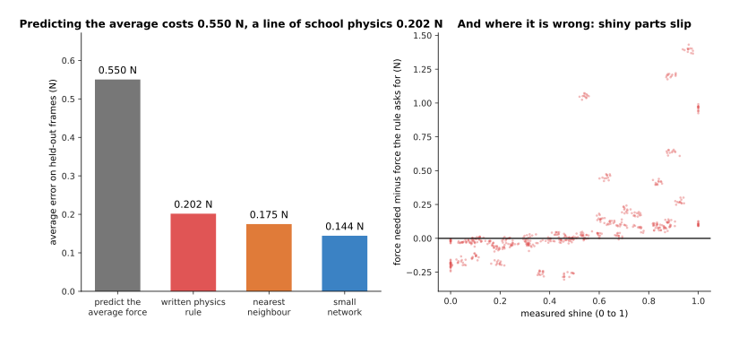

Always predicting the average squeeze force is wrong by 0.550 newtons on average. A rule from
school physics is wrong by 0.202 newtons, nearest neighbour by 0.175 and a small network by
0.144. The forces themselves spread by 0.921 newtons, so the average answer is not a silly one.

That physics rule is one line: the mass times gravity times a safety factor, divided by twice
an assumed friction. Its error comes within 0.058 newtons of the network's, and it costs
nothing to write. It is also honest about where it fails, because its error grows with
shininess. It is wrong by 0.077 newtons on dull parts and 0.337 newtons on shiny ones, because
shiny parts are more slippery than its one fixed friction number assumes. So whenever physics
or geometry gives you an approximate answer, that answer is a baseline.

A baseline also does not stand still while the model learns. The next picture trains the same
network on more and more parts and measures it against the two fixed baselines each time. The
horizontal axis uses a logarithmic scale, which is what lets 4 parts and 144 parts sit on one
chart.

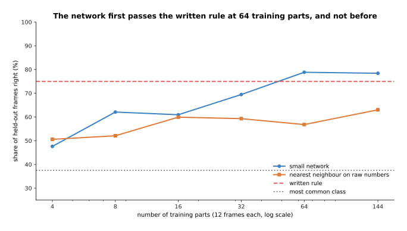

Trained on 4 parts the network scores 47.6 per cent. On 16 parts it scores 60.9, on 32 parts
69.5 and on 64 parts 78.8. Sixty-four parts is the first point at which it passes the written
rule's 75.0 per cent.

So until sixty-four parts have been recorded, the model is worse than the rule. A project that
stopped at thirty-two parts would have concluded that the model does not work, when all it had
shown was that the recording was too small. Compare a model and a baseline at the same amount
of data every time, because the two curves cross somewhere and you want to know where.

One more reading is worth taking. A single score does not say which part of the job each
method is good at, so the next picture breaks the same four methods down by the grip that was
actually right.

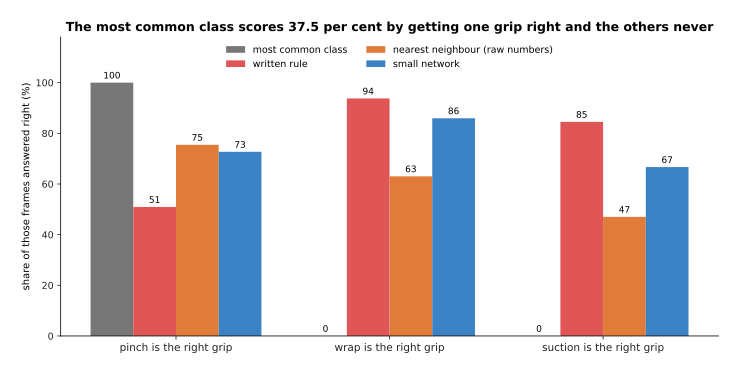

Always answering "pinch" reaches 37.5 per cent by finding every pinch and no wrap or suction at
all. The written rule finds 50.9 per cent of the pinches, 93.8 per cent of the wraps and 84.5
per cent of the suctions. The network finds 72.7, 85.9 and 66.7 per cent of the three.

Reading a score one class at a time is how you find out what a method is really doing. Here it
shows that the rule and the network fail on different parts of the same job, and that tells you
where the next examples should come from.

---

## 4. The first hundred examples

Section 3 showed a model that needed sixty-four parts before it passed a one-line rule. The
obvious plan is therefore to record as many examples as possible, and that plan is wrong in a
specific way. A hundred examples that somebody has looked at are worth more than ten thousand
that nobody has looked at, because the faults that ruin a model are visible by eye, but only if
somebody opens the examples and looks.

The first question is how few examples you can honestly start with, and the answer comes from
counting kinds of situation rather than counting examples. The next picture counts how many
kinds of part a recording has seen at least twice, as the recording grows.

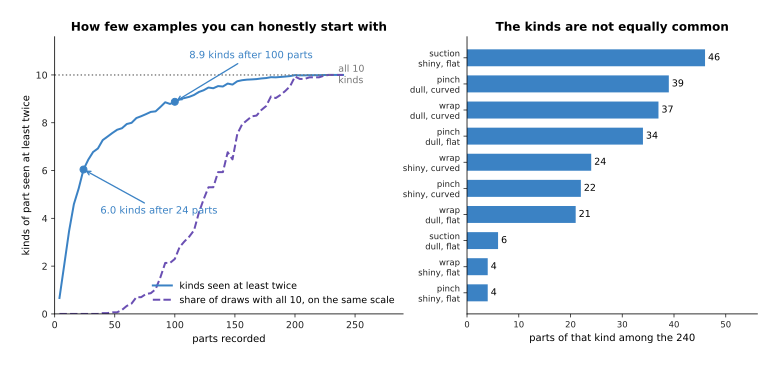

Ten combinations of grip, surface and top shape occur among the 240 parts. A recording of 8
parts has seen 2.1 of those ten kinds at least twice. A recording of 24 parts has seen 6.0, 48
parts 7.6, 100 parts 8.9, and 200 parts all ten.

That is a better argument for a number of examples than any round figure, because it is
specific to your own cell. Three grips, two surfaces and two top shapes make twelve possible
combinations here, and ten of those twelve occur among the parts. Six orientations and four
lighting conditions would make a different number. So count the kinds
of situation the robot will meet, ask for a few examples of each kind, and record that many.

Then look at a hundred of those examples rather than ten, and the reason is simple arithmetic.
The next picture gives the chance of meeting a fault at least once, for faults of three
different sizes, against the number of examples you open.

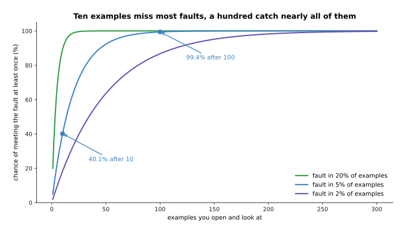

A fault that affects one example in twenty shows up in a sample of ten only 40.1 per cent of
the time. In thirty examples it shows up 78.5 per cent of the time, and in a hundred 99.4 per
cent. A fault that affects one example in fifty needs a hundred examples to reach 86.7 per
cent.

Opening ten examples feels like checking the data, and it misses three such faults out of five.
Opening a hundred finds nearly all of them, and costs an hour of somebody's time. The three faults
planted in this cell are the three that really happen, and the next picture measures what each
one costs.

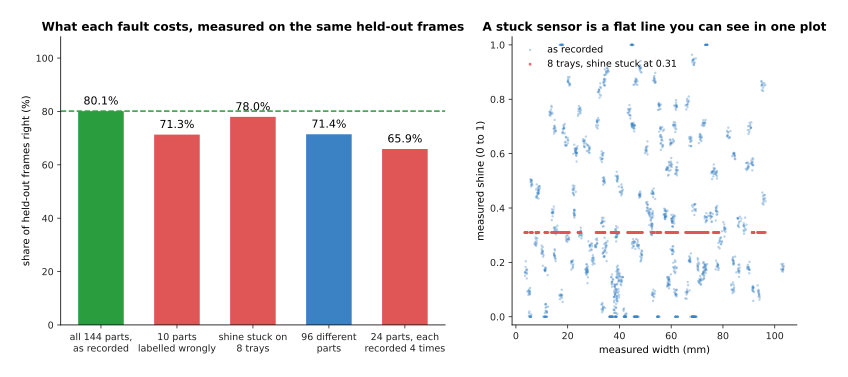

The recording as it stands gives 80.1 per cent. Labelling 10 of the 144 training parts wrongly
gives 71.3 per cent. Freezing the shine reading on 8 of the 24 training trays gives 78.0 per
cent. Recording 24 parts four times each gives 65.9 per cent, against 71.4 per cent for 96
different parts, where both of those last two use the same number of training frames.

A **label** is the answer written beside an example, and here it is the grip that was right.
Wrong labels on 10 parts in 144 cost 8.8 points, and you find them by opening examples and
asking whether you agree with the answer beside each one. A stuck sensor costs about two points
here and far more in other cells, and you find it by plotting each input against each other
input and looking for a flat line, which the right-hand picture draws as a row of red dots. The
third fault is the least obvious of the three. The same 1,152 training frames are worth 5.5
points more when they come from 96 different parts than when they come from 24 parts recorded
four times each, because a fourth recording of the same part teaches a model almost nothing.

One more thing is worth checking, which is the quality of the answers themselves. The next
picture asks two people to label the same 240 parts and compares their answers, grouped by how
clearly one grip was the best.

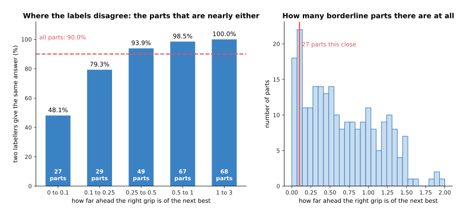

Two people labelling the same 240 parts agree on 90.0 per cent of them. On the 27 parts where
the best grip is barely ahead of the next best they agree only 48.1 per cent of the time, and
on the clearest parts they agree 100 per cent of the time.

That 90.0 per cent is a ceiling on any score you report. The reason is that the model is
trained on one person's answers and then marked against somebody's answers. If the person who
marks it is not the person who wrote the training labels, the model cannot do better than the
two people manage against each other. The next picture measures that on the held-out trays.

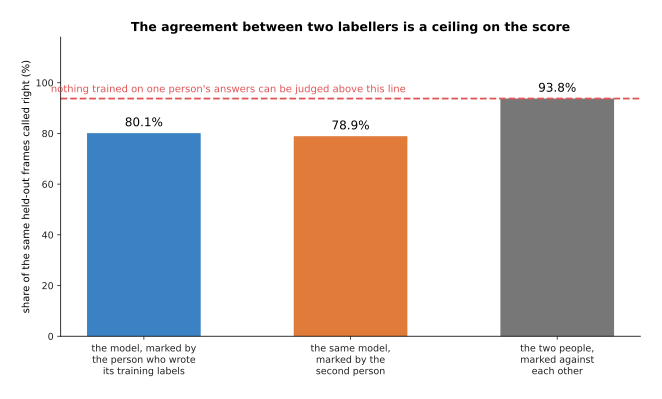

The same model scores 80.1 per cent when the person who wrote its training labels marks it, and
78.9 per cent when the second person marks it. The two people agree on 93.8 per cent of those
same held-out frames, which is higher than their 90.0 per cent over all 240 parts, because the
held-out trays happen to hold fewer borderline parts.

So who marks the answers is worth 1.2 points here, and the agreement between the two people is
the line above which no score can honestly go. Knowing that line beforehand stops you chasing
ten points that are not there. It also says that the cheapest improvement is often to sit down
and agree what the borderline cases mean, rather than to record more examples.

With the examples recorded and looked at, one decision is left.

---

## 5. The split, decided before any training

Those examples cannot all be used for training. How they are divided has to be settled before
any weight changes, because if you divide them after seeing the results, you will divide them
in whatever way makes the results look best. Why a held-back set is needed at all is explained
in [overfitting and
generalisation](../04_making-training-work/01_overfitting-and-generalisation.md). What belongs
here is the decision itself, and the mistake that is specific to robots. A robot records
continuously, so it produces many examples of the same thing, and those near-copies can end up
on both sides of the split.

The next picture divides the same recording in three different ways, trains the same model on
each, and also measures how close two frames of the same part are to each other.

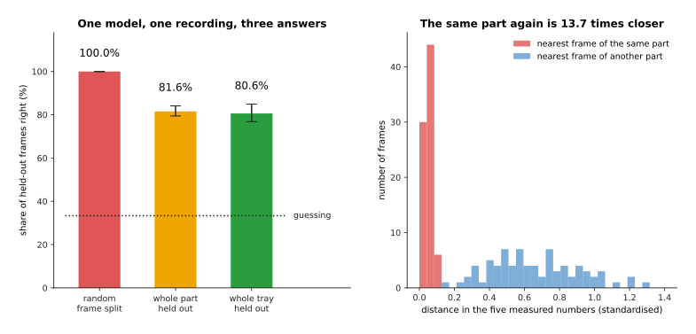

Over five draws of each kind of split, the same model scores 100.0 per cent when single frames
are divided at random, 81.6 per cent when whole parts are held out, and 80.6 per cent when
whole trays are held out. The reason is on the right: the nearest frame of the same part sits
13.7 times closer than the nearest frame of any other part.

The first of those three is the mistake to avoid. The twelve frames of one part are nearly the
same picture. Dividing frames at random puts eleven of them in the training set and the twelfth
in the held-out set. The model then answers the twelfth frame by remembering the eleventh,
scores a hundred per cent, and has learned nothing. The second and third results sit inside each
other's spread here, which is honest rather than convenient. The model has already met 24
trays, so a twenty-fifth tray is not much of a surprise to it. In a cell whose scenes differ
more from each other, that third bar falls further.

The unit you split along is whatever you want the model to work on next. Split by frame, and
the score answers "how will it do on a frame it has already seen", which is a question nobody
has. Split by part, and it answers "how will it do on another attempt at a part it has met".
Split by tray, and it answers "how will it do on a tray it has never seen", which is usually
the question you care about.

The next picture shows why a tray is a real thing rather than a label. It measures, tray by
tray, how far that tray's readings sit from the parts' real sizes.

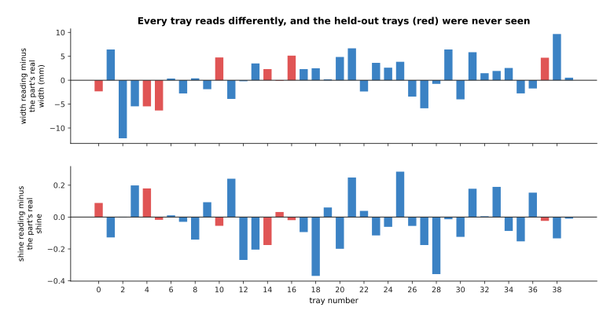

Tray by tray, the width reading sits between 12.1 millimetres below and 9.7 millimetres above
the part's real width. The twelve frames of one part, by contrast, differ from each other by
only 0.33 millimetres.

A tray therefore carries its own alignment and its own lighting, and those shift every reading
taken on it by far more than the camera's own noise. So a model tested on held-out trays is
being asked whether it copes with an alignment it has not met before. Once the unit is chosen,
the split is written down and never touched again, and writing it down means naming the trays
rather than saying "twenty per cent".

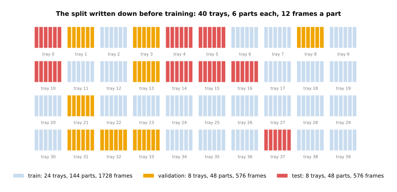

Twenty-four trays, holding 144 parts and 1,728 frames, are for training. Eight trays holding 48
parts are for choosing between models, and that set is called the validation set. The eight
trays numbered 0, 4, 5, 10, 14, 15, 16 and 37 are the test set, and they are read once at the
end.

There are three sets rather than two because the set you choose settings on cannot also be the
set you report. If it were, the number you reported would be the number you chose on. The last
thing to decide is how big that final set has to be, and the answer follows from section 2. The
next picture gives two models a held-out set of a given size each and asks how often the better
model wins.

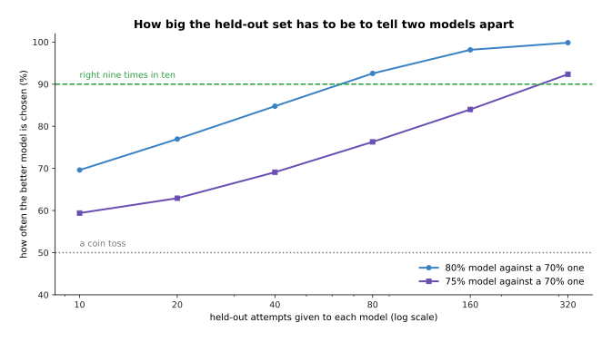

Choosing between a model that really succeeds 80 per cent of the time and one that manages 70
per cent is right 77.0 per cent of the time on 20 attempts each, and 98.2 per cent of the time
on 160 attempts each. Telling 75 per cent from 70 per cent needs 320 attempts each to be right
92.2 per cent of the time.

So the size of the held-out set is set by the smallest difference you need to see. Once a
project is running, two candidate models usually differ by about five points. A held-out set of
a few dozen examples cannot tell such models apart, so every comparison made on it is close to
a coin toss.

---

## 6. The sheet you should have filled in

Everything in the five sections above fits on one side of paper. Each line on that sheet rules
out one way of spending a month and having nothing to show for it. Two of the lines need a
measurement of their own.

The first is the target: the score the model has to clear, and the amount by which it has to
clear it. The next picture scores the written rule and three networks on the same 48 held-out
parts, and draws the 95 per cent interval around each score.

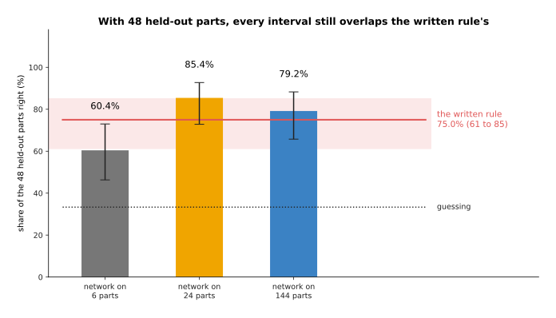

Each answer gets one vote per part, on the same 48 held-out parts. The written rule gets 36 of
them right, which is 75.0 per cent, with an interval running from 61.2 to 85.1. Networks
trained on 6, 24 and 144 parts get 29, 41 and 38 right, which is 60.4, 85.4 and 79.2 per cent.

The network trained on 24 parts looks like the winner, and it has proved nothing. Its interval
runs from 72.8 to 92.8 and the rule's runs from 61.2 to 85.1, so the two overlap between 72.8
and 85.1. With only 48 held-out parts, no result here is far enough from the rule to be
believed. The honest conclusion is not that the model works, and not that it does not work, but
that the held-out set is too small to say. Writing the target down beforehand is what makes
that conclusion available to you, because the alternative is to see 85.4 against 75.0, declare
success, and find out the truth on the arm.

The second line names which set will be read once, and it is needed because comparing
candidates uses up the set you compare them on. The next picture trains many candidate models,
picks the best of the first few on one set, and then measures the picked model on a second set
that took no part in the choice.

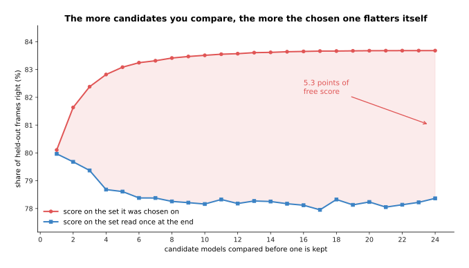

With one candidate the chosen model scores 80.1 per cent where it was chosen and 80.0 per cent
where it is finally read. The best of 4 candidates scores 82.8 against 78.7. The best of 10
scores 83.5 against 78.2, a gap of 5.3 points.

The lower line is flat, and that is the point. Comparing more candidates does not make the
chosen model better. It only raises the chosen model's score on the comparison set, because the
candidate that happens to suit that one set best is the candidate that wins. So the comparison set is
used up by the comparing, and the final number has to come from a second set that nobody has
touched.

The four shortcuts this sheet defends against are worth seeing in one place, so the next
picture puts the free points each one gives side by side.

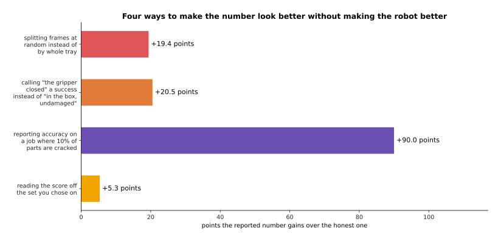

Splitting frames at random rather than by tray adds 19.4 points to the reported score. Calling
"the gripper closed" a success adds 20.5 points. Reporting accuracy on a job where one part in
ten is cracked adds 90.0 points. Reading the score off the set the model was chosen on adds 5.3
points.

Those four numbers were measured on this page rather than guessed, and together they add up to
more than the whole of the model's ability. None of them is dishonesty, and that is exactly why
the sheet exists. Each one is a reasonable thing to do when nobody wrote down beforehand what
would be done, and each one is invisible in the finished number.

The last picture is the sheet itself, filled in for this page's job. Read it one row at a time:
the left column names the line, and the right column gives the value this page measured for it.

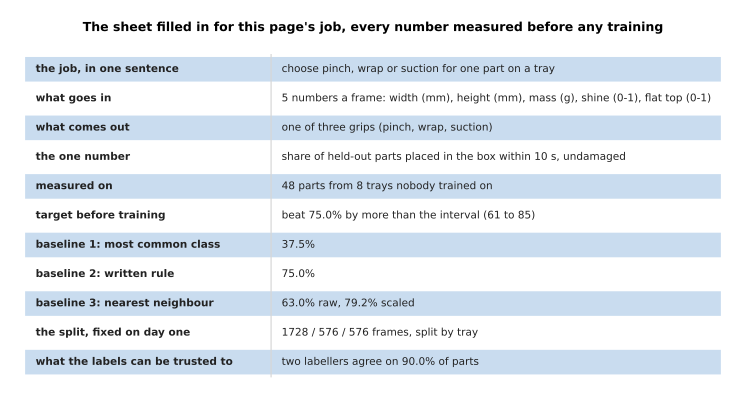

The sheet holds eleven lines. Four of them are decisions and seven are measurements, and the
longest line is the sentence saying what the job is.

Fill those eleven lines in for your own job, and you will know four things before you train
anything: what the model has to beat, how many held-out examples will judge it, how far the
labels can be trusted, and which set you may read only once. The next page starts the work.

---

## 7. Where to read next

- [The order of the work](02_the-order-of-the-work.md) is the next page, and it says what to
  run first on the job you have just written down, in the order that finds faults most cheaply.
- [What to reuse and what to train](03_what-to-reuse-and-what-to-train.md) answers the question
  this page leaves open, which is whether to train a model at all or start from somebody else's.
- [Overfitting and generalisation](../04_making-training-work/01_overfitting-and-generalisation.md)
  explains why the split of section 5 is needed, and the other ways information leaks across it.
- [Running and evaluating a model](../14_using-a-model-for-real/01_running-and-evaluating-a-model.md)
  takes the one number of section 2 onto a real arm, where every trial costs time.
- [Nearest neighbours and locally weighted regression](../../07_learned-models/02_classical-machine-learning/02_most-used/04_nearest-neighbours-and-locally-weighted-regression.md)
  is the catalogue entry for the third baseline of section 3, including when it is worth
  keeping as the finished answer.
- [Evaluation and failure](../../07_learned-models/10_making-models-work-on-an-arm/02_most-used/03_evaluation-and-failure.md)
  lists what people actually report when they measure a model on an arm, and what those
  reports leave out.

---

## 8. Using it in Python

The three baselines and the one small model of this page are short enough to write out in full.
The code below builds a simpler version of the same job, splits it by part rather than by
frame, as section 5 insists, runs the three baselines, and only then trains anything.

```python
import numpy as np
import torch
from torch import nn

rng = np.random.default_rng(0)
P, F = 240, 12                                       # 240 parts, 12 frames of each

width = rng.uniform(8, 95, P); flat = rng.random(P); shine = rng.random(P)
mass = width * rng.uniform(0.5, 2.5, P)              # section 2: what goes in
props = np.stack([width, mass, shine, flat], 1)
score = np.stack([1.3 - 1.6 * width / 95 - 0.9 * mass / 240,
                  0.1 + 1.5 * width / 95 + 1.1 * mass / 240 - 0.8 * flat,
                  -0.6 + 3.2 * flat * shine + 0.5 * width / 95], 1)
grip = score.argmax(1)                               # section 2: what comes out

X = np.repeat(props, F, 0) + rng.normal(0, [1.4, 3.0, 0.05, 0.07], (P * F, 4))
y = np.repeat(grip, F)
part = np.repeat(np.arange(P), F)
test = part >= 180                                   # section 5: split by part, not frame

maj = np.bincount(y[~test]).argmax()                 # section 3: baseline one
print('most common class  %.1f%%' % (100 * (y[test] == maj).mean()))
rule = np.where(X[:, 0] > 45, 1, np.where((X[:, 3] > .5) & (X[:, 2] > .4), 2, 0))
print('written rule       %.1f%%' % (100 * (rule[test] == y[test]).mean()))
d = ((X[test][:, None] - X[~test][None]) ** 2).sum(2)
print('nearest neighbour  %.1f%%' % (100 * (y[~test][d.argmin(1)] == y[test]).mean()))

Z = torch.tensor((X - X[~test].mean(0)) / X[~test].std(0), dtype=torch.float32)
t = torch.tensor(y)
net = nn.Sequential(nn.Linear(4, 24), nn.Tanh(), nn.Linear(24, 3))
opt = torch.optim.Adam(net.parameters(), lr=0.02)
for step in range(600):                              # section 6: training, allowed at last
    loss = nn.functional.cross_entropy(net(Z[~test]), t[~test])
    opt.zero_grad(); loss.backward(); opt.step()
print('small network      %.1f%%' % (100 * (net(Z[test]).argmax(1) == t[test]).float().mean()))
```

That program prints `most common class  53.3%`, `written rule       76.1%`,
`nearest neighbour  64.7%` and `small network      93.2%`. The network wins by a far wider
margin than the 1.0 points of section 3, and the reason is worth knowing. This simplified cell
has no trays in it, so a held-out part suffers no tray-to-tray variation at all. That is the
difference between a job as a tutorial writes it and the same job as it comes off a real
machine, and it is the most common reason a result that looked excellent on a laptop
disappoints on the arm.

PyTorch is doing two things in those lines and nothing else. It works out the gradients of the
loss with respect to every weight, which is `loss.backward()`, and it applies the update, which
is `opt.step()`. Everything else is NumPy and arithmetic. The three baselines take one line
each, and that is the point: they cost less than the time spent reading about them.

What no library decides for you is any line of the sheet from section 6. You choose what goes
in, and the count of numbers fixes the size of the first layer. You choose the one number, and
section 2 showed the same 200 attempts scoring 92.0 or 71.5 per cent on that choice alone. You
choose the split, and changing the single line `test = part >= 180` to a mask over frames
chosen at random is the fastest way to see what section 5 measured, because the printed score
will jump and nothing will have improved. Run that experiment before you trust any number here.
