# The order of the work

The page before this one, [before you train
anything](01_before-you-train-anything.md), ends with two things written down. The
first is the job, set out as an input, an output and one number that says whether
it worked. The second is a baseline, which is the simplest answer you could use
instead of a model, and which the model has to beat before anybody may call its
score evidence. This page is about the day after that. It is about the order of
the work, rather than about any one method.

The order matters because a model can fail for a dozen different reasons, and
those reasons cost wildly different amounts to find. Some of them show up in a
single pass of one batch through the model, with no training at all. Others show
up only in a run that takes a week. So the work is done in four milestones,
starting with the cheapest. This page calls them rungs, in the way that a ladder
has rungs, because each one stands on the one below it and you climb them in
order. Each rung rules out a group of causes, so that a failure on the next rung
has a short list of suspects. The four rungs are these: put one batch through the
untrained model and read the loss; make the model memorise ten examples on
purpose; do one small honest run with a held-back set; and only then make things
bigger, one change at a time.

The page assumes three things from earlier pages. It assumes the loop from [the
training loop](../03_how-training-works/04_the-training-loop.md), which is the
cycle of taking a batch, measuring the loss, and changing the weights. It assumes
the loss from [the score of being
wrong](../03_how-training-works/01_the-score-of-being-wrong.md#4-cross-entropy-the-price-of-a-wrong-probability),
and in particular cross-entropy, which is the loss used when the model has to
choose one of several classes. It assumes the held-back set from [overfitting and
generalisation](../04_making-training-work/01_overfitting-and-generalisation.md),
which is the group of examples the model never trains on. What this page adds is
what to look at, what the number should be before you look at it, and what each
result rules out.

Every number here was measured. The data is simulated. One example is sixteen
readings, standing in for features already pulled out of a camera frame, and its
label is one of ten classes. Enough noise is added that the ten classes overlap,
so the job is possible but not easy. A pool of 2,200 examples was drawn once, and
600 of them were set aside as the held-back set before any training happened.
Everything done to that pool is real PyTorch, and
`docs/diagrams/starting_your_own_model_2.py` prints every figure quoted below.

## Contents

1. [The ladder, and why the cheapest rung comes first](#1-the-ladder-and-why-the-cheapest-rung-comes-first)
2. [Rung one: one batch through an untrained model](#2-rung-one-one-batch-through-an-untrained-model)
3. [Rung two: memorise ten examples on purpose](#3-rung-two-memorise-ten-examples-on-purpose)
4. [Rung three: one small honest run](#4-rung-three-one-small-honest-run)
5. [Rung four: scale, one change at a time](#5-rung-four-scale-one-change-at-a-time)
6. [The run folder, and the run you keep](#6-the-run-folder-and-the-run-you-keep)
7. [Where to read next](#7-where-to-read-next)
8. [Using it in Python](#8-using-it-in-python)

---

## 1. The ladder, and why the cheapest rung comes first

The job and the baseline say nothing about what to do first. So this section sets
the four rungs out and measures what each one costs, counted in example-views. One
**example-view** is one example put through the model once, and it is the thing
that takes the time, because every one of them is arithmetic the machine has to
do.

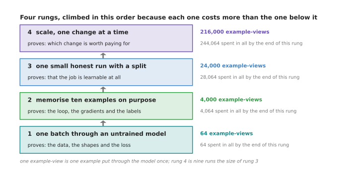

The four rungs cost 64, 4,000, 24,000 and 216,000 example-views, so 244,064 have
been spent by the time the fourth one ends.

Read that picture from the bottom. One batch of 64 examples through an untrained
model costs 64 example-views. It proves that the data arrives, that the shapes
line up and that the loss starts where it should. Four hundred steps on the same
ten examples costs 4,000 example-views, and it proves that the loop, the gradients
and the labels work together. A run over 960 examples for 25 passes costs 24,000
example-views, and it is the first run that can say whether the job is learnable
at all. Nine runs of that size cost 216,000 example-views, which is nearly nine
tenths of the whole total.

The order follows from those four numbers, because the same fault costs a
different amount depending on which rung finds it.

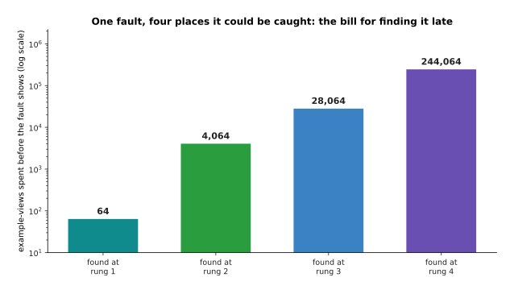

The same fault found on the fourth rung has cost 244,064 example-views instead of
64, which is 3,814 times as much work for the same answer.

Those numbers count arithmetic rather than minutes, because minutes depend on the
hardware, and this page knows nothing about your hardware. The ratio is what
matters. Catching an input that never reaches the output on the second rung costs
4,064 example-views, and catching the same fault on the fourth costs 244,064,
which is sixty times as much.

The rungs are also worth climbing in order because of what each one rules out. The
next picture lists thirteen faults that really happen and marks the first rung
that catches each one.

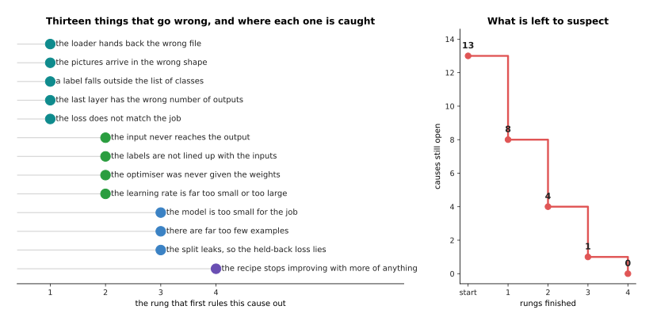

A label outside the list of classes, and a last layer with the wrong number of
outputs, both show on the very first batch. Three other faults survive the first
rung and are caught on the second: the input never reaching the output, the
labels not being lined up with the inputs, and the optimiser never having
been given the weights.

So if you are on the fourth rung wondering why the loss will not fall, the answer
is almost never something that the first two rungs would have caught. The next
picture counts the same thirteen causes a different way, as the number still open
after each rung.

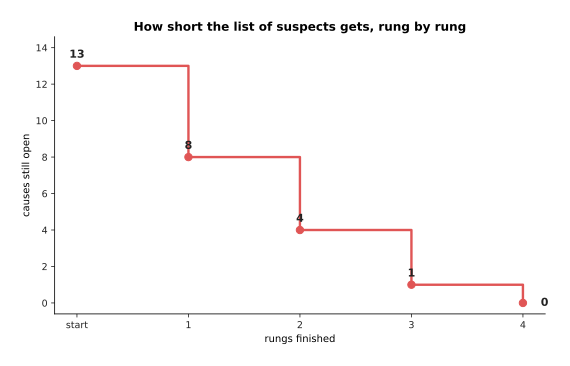

Of the thirteen faults, five are ruled out on the first rung, four more on
the second and three more on the third, so the number still open falls from
13 to 8 to 4 to 1.

That falling number is the whole argument for the order. Each rung is cheap
compared with the one above it, and each one shortens the list of things you have
to think about when the next one fails.

---

## 2. Rung one: one batch through an untrained model

The first rung costs one forward pass, which is one batch travelling through the
model from the input to the output, with no weights changed. Most people skip it,
which is why it is the most useful check on this page. You put one batch through
the model before any training, and you look at two things: the shape of what
comes out, and the loss. The loss is no mystery, because you can work out in
advance what it has to be.

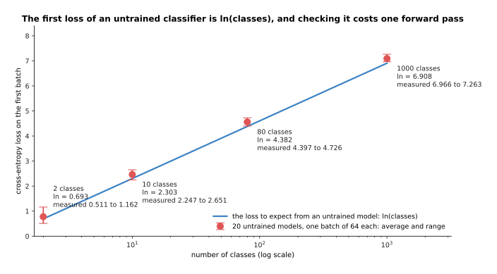

Twenty untrained models give losses between 0.511 and 1.162 on a job with 2
classes, where the expected value is 0.693. On 10 classes they give 2.247 to
2.651, against an expected 2.303. On 80 classes they give 4.397 to 4.726, against
4.382. On 1000 classes they give 6.966 to 7.263, against 6.908.

Here is where those expected values come from. A model that knows nothing spreads
its belief evenly, so it gives each class a probability of one divided by the
number of classes. The cross-entropy of that spread is the natural logarithm of
the number of classes. The natural logarithm answers the question "to what power
must 2.71828 be raised to give this number", and you do not need to know more than
that here. It gives 2.303 for ten classes, 6.908 for a thousand, and 0.693 for a
two-way choice. The measured values sit near those lines rather than exactly on
them, because random starting weights give a model mild opinions that it did not
earn. So a first loss within a few tenths of the expected value is healthy, and a
first loss of 11 on a ten-class job is a bug.

The other thing to read off the first batch is the shape of what comes out. A
**shape** is the list of sizes of a block of numbers, so a shape of (8, 10) means
eight rows of ten numbers. The next picture follows one real batch through a small
picture model and prints the shape after every layer.

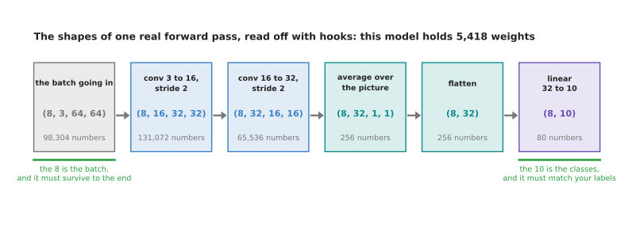

One real forward pass goes from (8, 3, 64, 64), which is 98,304 numbers, through
(8, 16, 32, 32) and (8, 32, 16, 16), down to (8, 32) and finally to (8, 10). The
model holds 5,418 weights.

Two of those numbers matter, and they are marked in green. The first number in
each shape is the batch, which is 8 here, and it must still be 8 at the end,
because a layer that loses it has mixed your examples together. The last number is
the count of classes, which is 10 here, and it must match the number of different
labels in your data. A model with eleven outputs and ten labels trains happily and
is wrong in a way that no loss curve shows.

Now for the faults this rung catches. The next picture takes one untrained model,
plants a different bug in each copy of it, and reads the first loss off each copy.

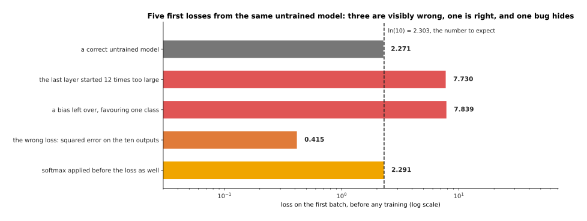

A correct untrained model gives 2.271. A last layer whose weights started twelve
times too large gives 7.730. A bias left over from something else, favouring one
class, gives 7.839. The wrong loss, which here is squared error on the ten
outputs, gives 0.415.

The two values near 7.8 are the easiest to spot. Weights that start too
large make the model certain of answers it has no reason to believe, and
cross-entropy charges most for being certain about a wrong answer. The value of 0.415 sits below the expected loss instead, because
squared error on ten outputs is a different quantity altogether, with no reason to
land near 2.303. The last bar is the honest warning. A softmax applied by hand
before a loss that applies its own softmax gives 2.291, which is nearer to 2.303
than the correct model is. A **softmax** turns raw scores into probabilities that
add up to one, and applying it twice is a real and common bug. This rung cannot
catch it, so the next rung has to.

The same check works for a job that predicts a number rather than a class, but the
value to expect is different. The next picture shows the same first-batch
measurement twice: once with the target left in millimetres, and once with the
same target centred and scaled.

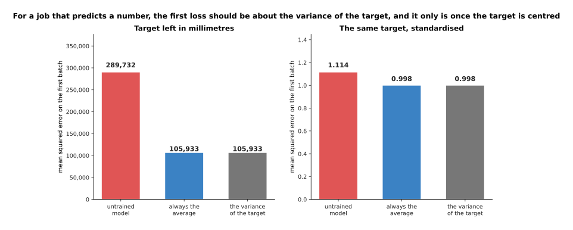

With the target left in millimetres, the untrained model scores 289,732 against a
variance of 105,933. With the same target standardised, it scores 1.114 against a
variance of 0.998.

For a job that predicts a number, compare the first loss against the variance of
the target. The **variance** is the average of the squared distances from the
average, and it is what you score by always guessing the average. The left panel
shows what happens when the target keeps its own units. The untrained model starts
near zero, while the targets average 428.7 millimetres, so most of the first loss
is that gap squared, which is 183,809 on its own. That is not a bug in itself, but
it makes any real bug impossible to see beside it, and that is why targets are
centred and scaled before training.

---

## 3. Rung two: memorise ten examples on purpose

The first rung proved that the data goes in with the right shape, and it said
nothing about whether training does anything at all. So the second rung is the
smallest experiment that does. You train on ten examples over and over, and you
demand that the loss fall to nearly zero. This is the most useful hour in the
whole process, because a model that cannot memorise ten examples will not learn
ten thousand, and finding that out costs 4,000 example-views instead of a week.

Choose one example of each class for this test, as the runs below do. Ten examples
drawn at random prove much less, and the next picture says why.

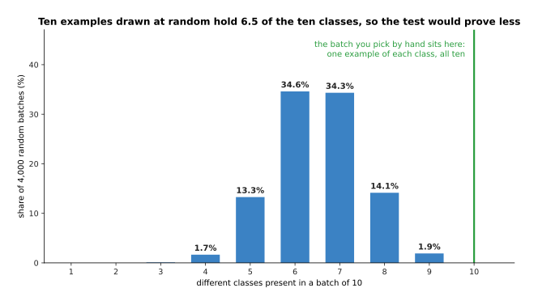

Over 4,000 batches of ten drawn at random, a batch holds 6.5 of the ten classes on
average. The most common results are six classes, in 34.6 per cent of batches, and
seven classes, in 34.3 per cent. Not one of the 4,000 batches held all ten.

So a random batch of ten leaves three or four classes untested, and the test then
says nothing about whether the model can separate those. Picking one example of
each class by hand costs a minute and removes that hole. The next picture runs the
test itself: the same ten examples, 400 times, for three different models.

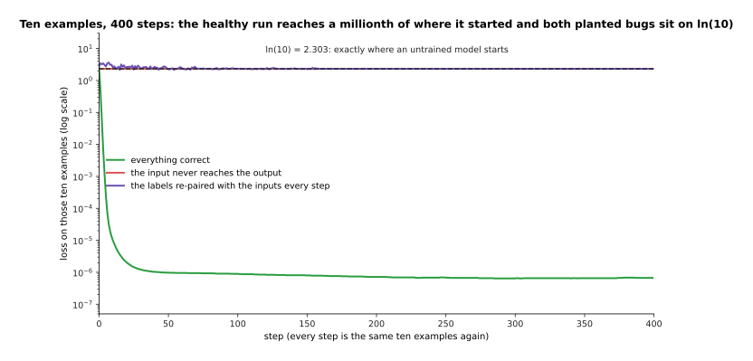

The healthy run starts at 2.553, is below 0.0001 by step 6, and ends at
6.795e-07, which is about seven ten-millionths. The run with the input zeroed and
the run with the labels re-paired with the inputs on every step both sit exactly
on 2.303.

The green line is what passing looks like, and the difference between it and
the other two is large. Both flat lines land on 2.303, which is the natural
logarithm of ten, and that is precisely where an untrained model starts.
That is no coincidence. A model that cannot see the input, or whose labels
are shuffled against the inputs on every step, can do no better than give
every class the same probability. So a flat line at exactly the first loss
says that nothing in the input is reaching the answer.

The loss is not the only thing to watch. The next picture counts how many of the
ten examples each run gets right, and adds a fourth run whose labels were shuffled
once and then left alone.

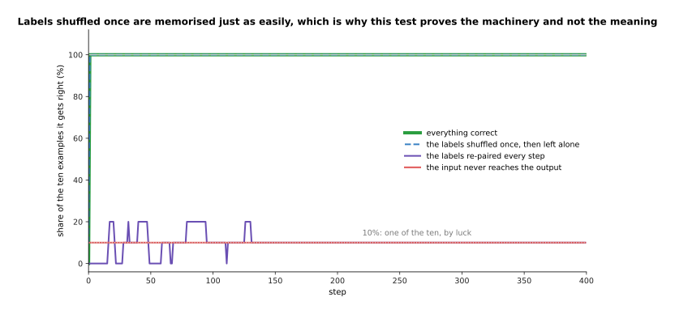

The correct run and the run whose labels were shuffled once both go to 100 per
cent right after a single step. The two broken runs stay at 10 per cent, which is
one of the ten by luck.

Shuffling the labels once does not stop the model memorising them, because
memorising is all this test asks for, and a wrong answer is as easy to memorise as
a right one. That is why this rung proves the machinery and not the meaning. It
says that gradients flow, that the optimiser is connected to the weights, and that
the model can separate these ten examples. It says nothing about whether your
labels are right. Wrong labels show up on the third rung instead.

A flat line tells you that something is broken, and the next picture tells you
what. It draws the ten-by-ten table of probabilities that each run ends up giving
the ten examples. Each row is one example and each column is one class, so a
healthy run should have one dark square in each row.

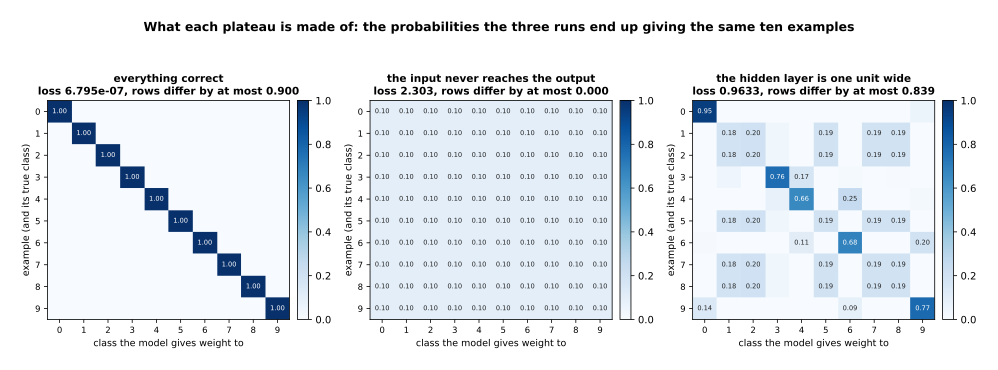

The healthy run gives 1.0000 to the right class every time. The run with the input
cut off gives 0.1000 to every class, and its rows differ from each other by
0.0000. A model with a hidden layer of one unit gets 60 per cent right and ends at
a loss of 0.9633.

The middle panel is the pattern worth memorising, because every row equals
every other row to four decimal places. The model is giving the same answer
whatever it is shown, and nothing except a broken connection does that. The
right panel is a different failure. A hidden layer of one unit can separate
examples along a single direction only, so it gets some of them right and
gives the rest a mixture of answers. That is a model too small for the job
rather than a bug, and the picture tells the two apart where the loss alone
would not.

The next picture collects seven single-batch runs and their final losses, so that
each failure can be recognised by its number alone.

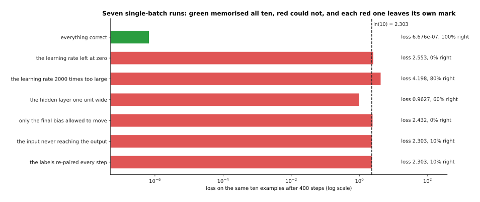

The correct run ends at 6.795e-07. A learning rate of zero stays at its first loss
of 2.553. A learning rate 2000 times too large ends at 7438. A hidden layer one
unit wide ends at 0.9633. A run in which only the final bias may move ends at
2.432. The two runs with no connection from the input end at 2.303.

Three of those leave a mark you can recognise with no other evidence. A
learning rate of zero leaves the loss at exactly the first batch's value,
which is a perfectly flat line. A learning rate far too large ends far above
the logarithm of the number of classes, which is worse than knowing nothing,
and that happens only when each step moves the weights much too far. A flat
line at exactly the logarithm means one answer for everything. An hour spent
here buys you four suspects instead of thirteen.

The claim underneath this whole rung is that a model which fails here will fail
later too. The next picture measures that claim. It takes the same model at six
different widths, runs the ten-example test on each, and then runs each one
properly on 240 examples.

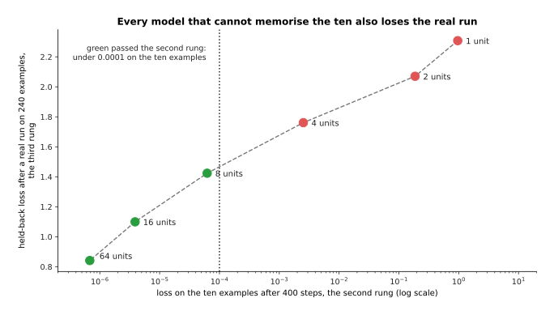

A hidden layer of 1 unit ends at 0.9633 on the ten examples and at a held-back
loss of 2.308 on the real run. Two units give 0.1864 and 2.071, four units give
0.002527 and 1.761, eight units give 0.00006233 and 1.424, sixteen units give
0.000003886 and 1.100, and sixty-four units give 6.795e-07 and 0.842.

The order is the same on both rungs, and the one-unit model is worse than useless
on the real run, because 2.308 is above the 2.303 that an untrained model scores.
So the cheap test ranks the models in the same order as the expensive one, which
is exactly what it is for.

---

## 4. Rung three: one small honest run

The second rung proved that the machinery works on ten examples. Memorising ten
examples is not learning, so the third rung is the first run that uses the split
decided on the page before. It trains on 960 examples in batches of 32 for 25
passes, which is 750 steps, and after each pass it measures the loss on the 600
examples it never trains on.

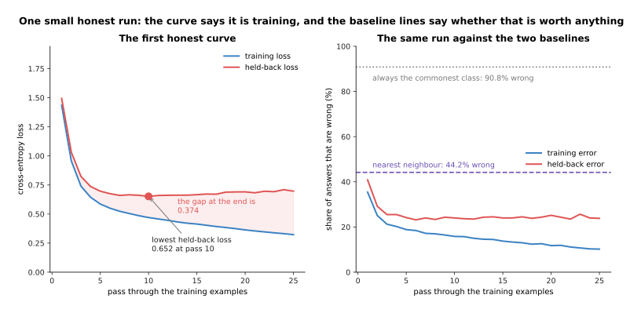

The training loss falls from 1.435 to 0.322, and the held-back loss falls from
1.494 to a lowest point of 0.652 at pass 10 and then rises slightly to 0.697. At
the end, 23.8 per cent of held-back answers are wrong, against 44.2 per cent for
nearest neighbour and 90.8 per cent for always answering the commonest class.

The left panel on its own only says that the loss went down. The right panel
answers the question the page before set, because the dashed lines are the
baselines, and the model is worth something only below them. It is worth
something here, since 23.8 per cent wrong against nearest neighbour's 44.2 per
cent is a gap the simple method cannot close. Had the held-back line settled at 46
per cent, the run would have failed while showing a perfectly healthy-looking loss
curve, and that is why the baselines are drawn on the chart.

The gap between the two curves is itself a measurement. The next picture runs the
same recipe on three sizes of training set and writes the final gap beside each
pair of curves.

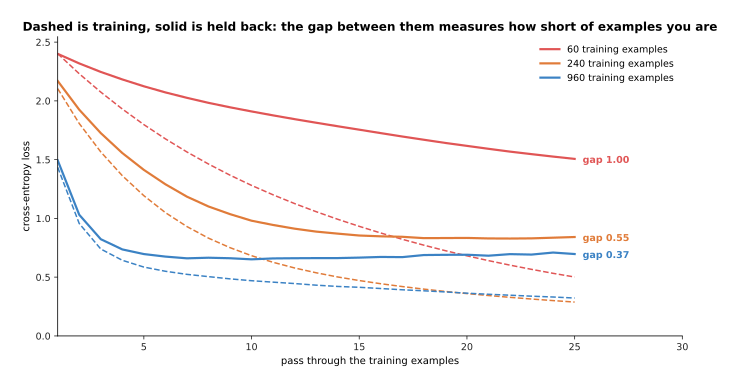

With 60 training examples the gap at the end is 1.00 and 48.0 per cent of
held-back answers are wrong. With 240 examples the gap is 0.55 and 28.3 per cent
are wrong. With 960 examples the gap is 0.37 and 23.8 per cent are wrong.

The training loss is low in all three runs, because a model with enough weights
fits whatever is put in front of it. So the held-back loss is what separates them.
A wide gap that keeps closing as examples are added is the clearest sign that the
next thing to buy is data rather than a bigger model, and here multiplying the
examples by four twice took the gap from 1.00 to 0.55 to 0.37. The 60-example run
was also still falling at pass 25, while the 960-example run had flattened by pass
10, so a number of passes that suits one size does not suit another.

One fault can make all of this look better than it is. The next picture repeats
the 240-example run twice: once with a clean split, and once with a split in which
half the held-back rows are copies of training rows.

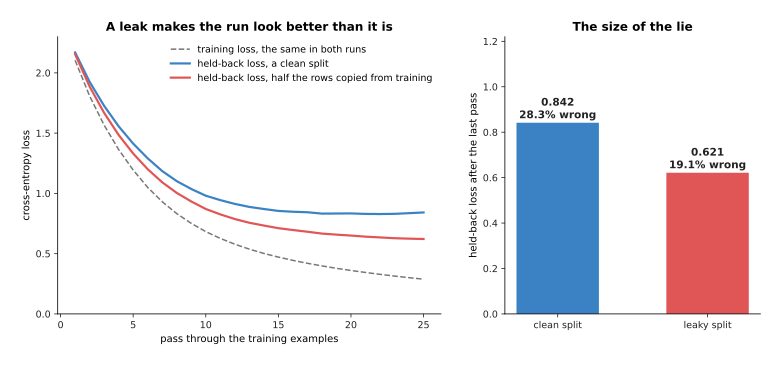

The clean split ends at a held-back loss of 0.842, with 28.3 per cent of answers
wrong. The leaky split ends at 0.621, with 19.1 per cent wrong.

A **leak** is an example that is in the held-back set and in the training set at
the same time. The leak planted here is obvious, and it makes the run look better
by 0.220 of loss and by 9.3 points of error. Real leaks are harder to see, and
they move the number in the same direction: two camera frames a tenth of a
second apart, one object photographed twice, one demonstration counted as
several examples. That is why
[overfitting and
generalisation](../04_making-training-work/01_overfitting-and-generalisation.md#3-leakage-when-the-split-tells-you-a-lie)
insists that the split be made along whatever line groups those near-copies, made
once, written down, and never made again by another piece of code.

Most first runs come back with one of four shapes, and the shape says what to do
next. The next picture shows all four, each from a real run on this job.

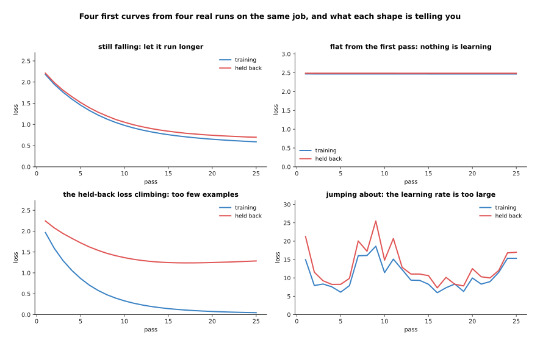

The still-falling run ends at 0.591 on training and 0.699 on held back. The flat
run sits at 2.469 and 2.488 from the first pass onwards. The run on 60 examples
reaches 0.046 on training while its held-back loss climbs to 1.286. The fourth run
jumps about, and its held-back loss reaches 25.496 at its worst.

Two lines falling together means that nothing is wrong and the run should be
longer. Two flat lines from the first pass mean that nothing is learning, and
after the second rung you already know that this is a learning rate near zero
rather than a disconnected model. A training loss near zero with a held-back loss
climbing means the model is memorising, and the cure is more examples or a smaller
model. A curve that jumps by tens means a learning rate far too large, and the
size of the numbers on the axis gives that away at a glance.

---

## 5. Rung four: scale, one change at a time

The third rung gave one run that works and one number that beats the baseline,
which is the first point at which making anything bigger makes sense. The fourth
rung is a sequence of runs with one rule: each run changes one thing from the run
before it. The measurements below are what happens when that rule is kept, and
then what happens when it is broken.

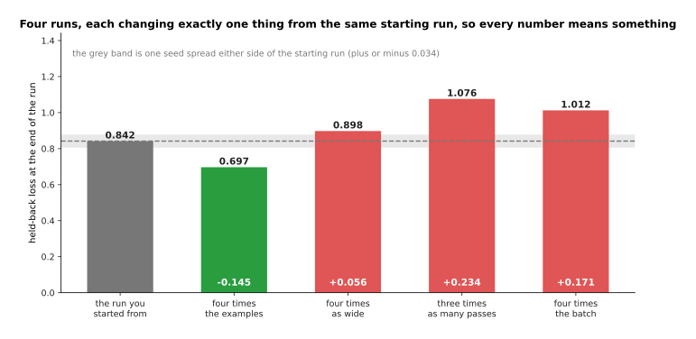

The starting run ends at a held-back loss of 0.842. Four times the examples gives
0.697. Four times the width gives 0.898. Three times as many passes gives 1.076.
Four times the batch gives 1.012.

Each of those runs is readable because exactly one thing moved. Four times the
examples is worth 0.145 of loss, and it is the only change here that helps. Three
times as many passes costs 0.234, because this run was already past its best point
at pass 10. Four times the batch costs 0.171, because the same passes with a
bigger batch mean a quarter as many steps, and a step is where the weights
actually change. Four times the width moves the answer by 0.056, which is too
small to call a result, for the reason given two pictures below.

The next picture breaks the rule on purpose. It takes one change that helps and
one that hurts, and makes both at once.

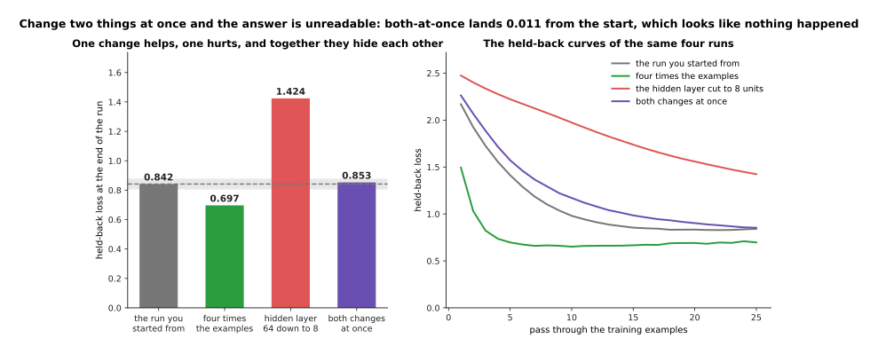

Four times the examples takes the loss from 0.842 down to 0.697. Cutting the
hidden layer from 64 units to 8 takes it up to 1.424. Doing both at once gives
0.853, which is 0.011 away from where it started.

That is the demonstration. One of those changes was worth having, the other made
the model much worse, and the run that made both came back saying that nothing had
happened.
Somebody who changed two things and saw no change would conclude that neither
mattered, and would be wrong twice over. Nothing about the combined run is faulty.
The number 0.853 simply cannot be attributed to anything, because two effects of
opposite sign landed on top of each other.

Before believing any of those differences, you need to know how much a run moves
on its own. The next picture runs the same settings six times, changing only the
seed.

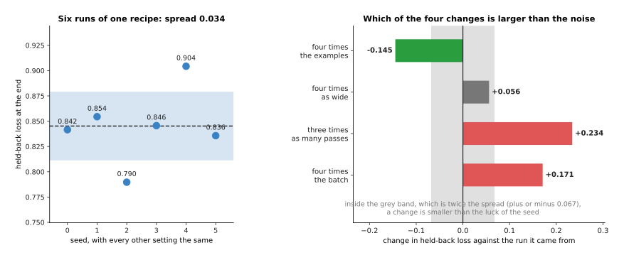

Six runs with identical settings, differing only in the seed, end at 0.842, 0.854,
0.790, 0.846, 0.904 and 0.836. Their spread is 0.034, and the difference between
the best and the worst is 0.115.

A **seed** is the number that decides every random choice a run makes, which here
means the starting weights and the order the examples are shuffled into. Six runs
that differ only in the seed land 0.115 apart. So any change smaller than that is
luck rather than progress, and twice the spread, which is 0.067, is a reasonable
line to draw. By that line, three of the four changes above are real, and the
wider model at 0.056 is not. The honest report for a change inside the band is
that you cannot tell, and two or three seeds of each setting settle it cheaply.

The rule of one change at a time has a cost, and it is worth seeing what the
alternative costs. The next picture counts the runs each approach needs, on a
logarithmic scale, because the two counts end up thousands apart.

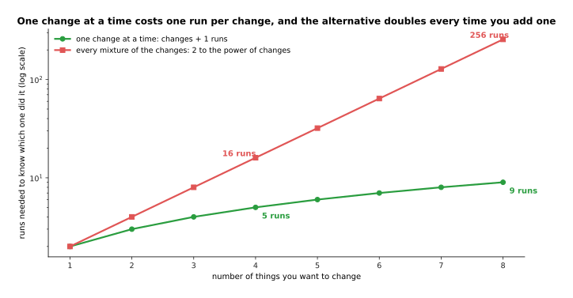

Telling eight changes apart takes 9 runs when they are made one at a time, and 256
runs when every mixture of them is tried. At 6,000 example-views a run, those are
54,000 and 1,536,000 example-views.

The obvious alternative is to try every combination. It does find effects that
appear only when two settings move together, and it costs 2 raised to the power of
the number of changes. For eight changes that is 256 runs, and at the size of a
real training job that is not a week anybody has. So people change one setting,
keep the winner, and move on, accepting that a pair of settings which only works
jointly will be missed. That is a real cost, and it is the price of an answer you
can read.

---

## 6. The run folder, and the run you keep

The fourth rung produces many runs, and a folder of runs is worth nothing unless
you can say which settings produced which number. So this section is about
what to write down. Its rule is that the run you keep is not the one with the best
number, but the one you can do again.

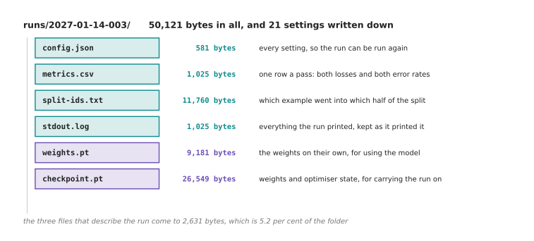

A real run folder holds config.json at 577 bytes, metrics.csv at 1,025 bytes,
split-ids.txt at 11,760 bytes, stdout.log at 1,025 bytes, weights.pt at 9,181
bytes and checkpoint.pt at 26,549 bytes, which is 50,117 bytes in all.

Those six files are a good minimum, and the first one carries most of the value,
because it holds all 21 settings the run used. The metrics file has one row per
pass, so a curve can be drawn again without running anything again. The list of
which example went into which half of the split stops the split quietly changing
between runs. The last two files are the model saved twice: once as the weights
alone, for using the model, and once together with the optimiser state, for
carrying the run on later, as [the training
loop](../03_how-training-works/04_the-training-loop.md#6-reading-the-curve-the-time-a-run-takes-and-the-checkpoint)
explains.

The seed belongs in that config file, and the next picture shows what it buys. It
runs the same settings twice with the same seed, and then twice with different
seeds.

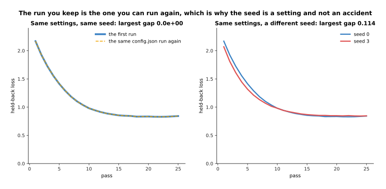

Running the same settings with the same seed twice gives two curves whose largest
difference is 0.0e+00, which means they are identical. A different seed gives
curves that differ by as much as 0.114 and end at 0.842 against 0.846.

The left panel is what reproducible means in practice. The second run lands on the
first to the last digit the computer keeps, and that happens only because the seed
was written down with everything else. A folder without a seed holds a run you can
repeat approximately, and that is not the same thing when you are looking for a
difference of 0.05.

Not every setting matters equally, and the next picture sorts them by how far
changing one moves the final answer. The grey band is twice the seed spread, so a
bar that stays inside it has moved the answer less than luck does.

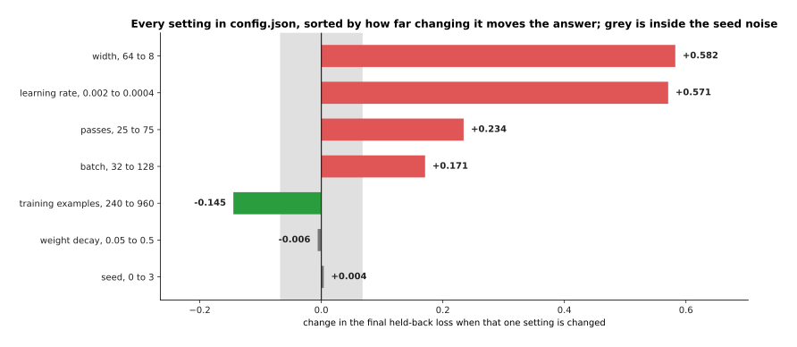

Cutting the width from 64 to 8 costs 0.582 and dropping the learning rate from
0.002 to 0.0004 costs 0.571. Tripling the passes costs 0.234 and quadrupling the
batch costs 0.171. Four times the examples gains 0.145. Changing the weight decay
and changing the seed move the answer by 0.006 and 0.004.

The two settings at the top would make a run unrecognisable if they were lost, and
the learning rate in particular is why a run folder with no config file is barely
a result at all. The two at the bottom land inside the seed band. That does not
mean they can be left out, because a setting that does not matter on this job may
matter on the next one, and writing it down costs one line.

The last question is what all this writing down costs, and the next picture
answers it in bytes, on a logarithmic scale.

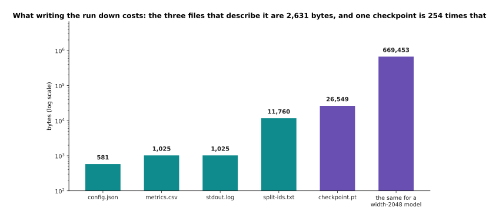

The three files that describe the run come to 2,627 bytes. A checkpoint of a model
with 55,306 weights is 669,453 bytes, which is 255 times as much.

So writing down what a run was costs 2,627 bytes against the 669,453 bytes of one
checkpoint, which is less than half of one per cent. Real models are far larger
than this one, so that share only gets smaller. There is no version of this in which logging is the expensive part. What
is expensive is a folder of twelve runs with no way of telling which one produced
the number you liked, and the cure is to write the settings down before the run
rather than after it.

---

## 7. Where to read next

- [What to reuse and what to train](03_what-to-reuse-and-what-to-train.md) is the
  next page, and it decides what the model on rung three should actually be, from
  using somebody else's model as it is through to training from nothing.
- [Before you train anything](01_before-you-train-anything.md) is the page this
  one follows, and it is where the job, the baseline and the split that rung three
  depends on are decided.
- [When it does not work](06_when-it-does-not-work.md) is the diagnosis page, and
  it picks up where the four rungs end, with the failures that survive all of them.
- [Overfitting and generalisation](../04_making-training-work/01_overfitting-and-generalisation.md)
  explains the gap in section 4 properly, and how a split is built so that it
  cannot leak.
- [The training loop](../03_how-training-works/04_the-training-loop.md) is where
  the loop, the optimiser and the checkpoint of section 6 come from.
- [Evaluation and failure](../../07_learned-models/10_making-models-work-on-an-arm/02_most-used/03_evaluation-and-failure.md)
  in the catalogue book is what the fourth rung becomes once the model is on a real
  arm, where the number to beat is counted in trials rather than in loss.

---

## 8. Using it in Python

The first two rungs are about twenty lines of PyTorch between them, and this is
all of it. The block runs as it stands on ten made-up examples. It prints the
check from section 2, and both the test and the planted bug from section 3, so
that passing and failing appear side by side.

```python
import json
import pathlib

import torch
from torch import nn
import torch.nn.functional as F

torch.manual_seed(0)
x = torch.randn(10, 16)                      # ten examples, sixteen readings each
y = torch.arange(10)                         # section 3: one example of each class
model = nn.Sequential(nn.Linear(16, 64), nn.ReLU(), nn.Linear(64, 10))

# Section 2: one batch through the untrained model, before any training at all.
with torch.no_grad():
    out = model(x)
    first = F.cross_entropy(out, y)
print('what comes out has shape', tuple(out.shape))
print('first loss %.3f, and ln(10) is %.3f' % (first, torch.tensor(10.0).log()))

# Section 3: memorise those ten on purpose. If this will not fall, stop here.
opt = torch.optim.AdamW(model.parameters(), lr=0.05)
for _step in range(200):
    loss = F.cross_entropy(model(x), y)
    opt.zero_grad()
    loss.backward()
    opt.step()
print('after 200 steps on ten examples, loss %.2e' % loss.item())

# Section 3 again, with the input cut off, which is the bug the test catches.
broken = nn.Sequential(nn.Linear(16, 64), nn.ReLU(), nn.Linear(64, 10))
opt = torch.optim.AdamW(broken.parameters(), lr=0.05)
for _step in range(200):
    loss = F.cross_entropy(broken(torch.zeros_like(x)), y)
    opt.zero_grad()
    loss.backward()
    opt.step()
print('with the input zeroed, loss %.3f' % loss.item())

# Section 6: write the settings down before the run, not after it.
cfg = {'seed': 0, 'learning_rate': 0.05, 'steps': 200, 'batch': 10, 'classes': 10}
pathlib.Path('config.json').write_text(json.dumps(cfg, indent=2) + '\n')
print('config.json is', pathlib.Path('config.json').stat().st_size, 'bytes')
```

That block prints a shape of `(10, 10)`, a first loss of 2.332 against an expected
2.303, a loss of 4.17e-07 after 200 steps, a loss of 2.303 for the run whose input
was zeroed, and a config file of 89 bytes. Those five numbers are the whole of the
first two rungs, and the only part to change for your own job is the line that
makes `x` and `y`.

The library gives you very little of this, and that is the point. PyTorch will not
tell you that your first loss is wrong, because it does not know how many classes
you meant to have. `F.cross_entropy` will cheerfully accept probabilities where it
wanted raw scores, and hand back a number that looks fine. Nothing in the library
will tell you that a model cannot memorise ten examples either, because from the
library's side nothing failed.

What you still choose is the ten examples, and one of each class is worth having,
because section 3 measured that a random ten holds only 6.5 of the ten classes.
You choose the number of steps, and a few hundred is plenty, since a model that
will memorise ten examples usually does it in under fifty. You also choose what
goes in the config file, and the rule from section 6 is that anything you would
have to guess in order to repeat the run belongs in it, with the seed first.
