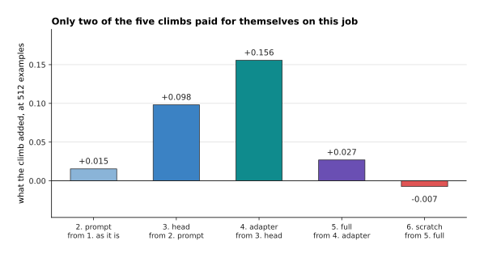
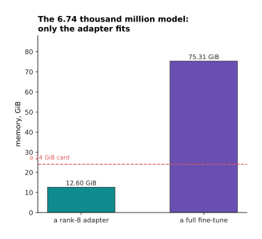
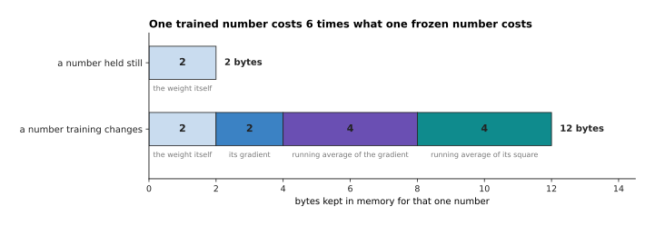
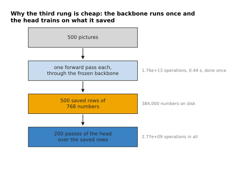
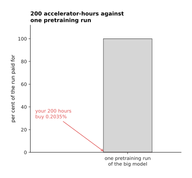
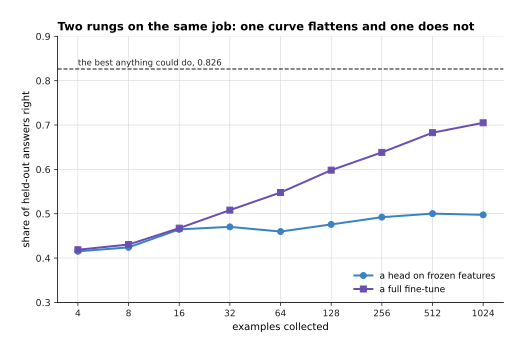
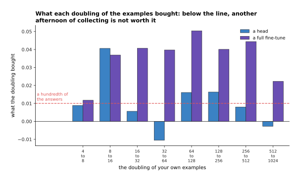

# What to reuse and what to train

The page before this one, [the order of the work](02_the-order-of-the-work.md),
set out the sequence that finds faults cheaply. First you push one batch of
examples through an untrained model. Then you make the model memorise ten examples
on purpose. Then you run one small honest training. Only after that do you scale
the work up. That page told you in what order to do the work. It did not say what
you are actually training, and this page answers that question. For almost
everybody the honest answer is that you are training very little of the model.

The reason is that somebody else has already paid for most of the model you need.
A published model has had millions of pictures, or thousands of millions of words,
pushed through it during its own training. What came out of that is a file of
numbers that already measures edges, parts, objects, words and relations. So your
job is usually a small question asked of those measurements, rather than a model
built from the beginning. The choices form a ladder with six rungs, and this page
is about which rung to stand on and what each one costs.

The page assumes you have read [fine-tuning and
adapters](../07_pretraining-and-adapting/03_fine-tuning-and-adapters.md). That page
explains what a frozen backbone is, which means a published model whose numbers
you do not let training change. It also explains what low-rank adaptation does
inside one weight matrix, and why training hard on a narrow set of examples
destroys what the model was already good at. This page does not explain those
mechanisms again. Instead it decides between them using numbers rather than habit.

Two kinds of number appear here, and it matters which kind you are reading. The
parameter counts, the memory sizes and the arithmetic counts are exact sums on one
stated model. That model is a transformer over picture patches: the picture is 224
by 224 pixels, it is cut into patches of 16 by 16 pixels, which gives 197 pieces of
input once a summary piece is added, and the model has 12 blocks, a width of 768
and a feed-forward inner width of 3072. The learning experiments are different.
They are simulated on a made-up job small enough to run hundreds of times, and the
page says so wherever it quotes one of them. The speed of the machines, the rent
and the minutes a person takes to collect one example are stated assumptions
rather than measurements. Every number below is printed by
`docs/diagrams/starting_your_own_model_3.py`.

## Contents

1. [The ladder of starting points](#1-the-ladder-of-starting-points)
2. [What each rung costs and what it buys](#2-what-each-rung-costs-and-what-it-buys)
3. [Why training a large model from nothing is out of reach](#3-why-training-a-large-model-from-nothing-is-out-of-reach)
4. [Choosing a published starting point for your job](#4-choosing-a-published-starting-point-for-your-job)
5. [Licences, read before the work and not after](#5-licences-read-before-the-work-and-not-after)
6. [Three robot jobs, taken down the ladder](#6-three-robot-jobs-taken-down-the-ladder)
7. [Where to read next](#7-where-to-read-next)
8. [Using it in Python](#8-using-it-in-python)

---

## 1. The ladder of starting points

The order of the work from the page before assumed you already knew what you were
training, so the first thing to fix is that. The choice has only six answers. You
can use a published model exactly as it is. You can write a better prompt for it.
You can train a small new layer on top of its frozen output. You can train an
adapter beside its weights. You can fine-tune the whole of it. Or you can train the
same shape of model from random numbers. They are listed in order of what they let
training change, and that is also the order of what they cost.


Each column above is the same model. The colour marks the parts that training may
move, and the count of numbers it moves is written underneath.

Working the sums out for the stated shape gives those counts. One block holds
2,362,368 numbers in its attention part and 4,722,432 in its feed-forward part, so
one block is 7,087,872 numbers and twelve blocks are 85,054,464. Adding the patch
embedding and the position table brings the backbone to 85,798,656. A head that
turns the model's output into six answers is 768 times 6 plus 6, which is 4,614
numbers. An adapter of rank 8, placed beside the attention output and both
feed-forward matrices of every block, is 884,736 numbers.


Each rung puts roughly a hundred times more numbers in play than the rung below
it. That is why the bars need a scale on which every gridline is a hundred times
the last one.

A head trains 4,614 numbers, which is 0.005377 per cent of the model. An adapter
with a head trains 889,350 numbers, which is 1.036 per cent. A full fine-tune and
a run from nothing both train all 85,803,270 numbers. Those last two differ only
in where the numbers start from: the pretrained file in one case, and a random
draw in the other.

The second thing a rung costs is storage, because every job leaves behind a file
you have to keep and ship to the robot.


Storing the changed numbers at two bytes each, a head is 9.0 KiB and an adapter is
1.7 MiB. A fine-tune, however, is the whole 163.7 MiB again, because every number
in the file has changed. So a cell that does twenty different jobs keeps 34 MiB of
adapters beside one shared base model, or 3.2 GiB of separate whole models. That
is why a fleet with many jobs reaches for adapters even when memory was never the
problem.

The last picture in this section is the test that tells you when to climb a rung.
It needs two numbers you already have: how well the model does on the examples it
trained on, and how well it does on examples it has never seen.


These numbers come from the simulated job of the next section, measured at 256
examples. A head on frozen features gets 0.570 of its own training examples right,
so it cannot even fit what it was shown. No amount of extra data fixes that,
because the frozen output simply does not contain the distinction the job needs.
The answer in that case is to climb. An adapter and a full fine-tune both reach
1.000 on their own examples, while reaching 0.631 and 0.638 on examples held back.
That gap is the opposite fault: the model has learned these particular examples
rather than the job. So the rule is short. A low left bar says climb a rung, and a
wide gap between the two bars says collect more examples.

---

## 2. What each rung costs and what it buys

The climb test says when to move. This section says what moving costs, because the
bills are of different kinds: one rung costs examples, another costs memory, and
the last one costs a person's week. The accuracy figures below come from a
simulated job, built small on purpose so that the whole ladder can be run ten
times and measured rather than asserted.

One example in that simulation is 200 numbers standing in for one look at one
object. Behind those 200 numbers lie 16 hidden ones. Six of the hidden numbers say
how strongly each part of the object is present. The other ten are nuisance, which
means they stand for the lighting, the background and the pose, and they have
nothing to do with any job. The 200 numbers are a fixed random mixture of all 16
put through a cosine, so reading a part strength back out of them is possible but
not easy. That difficulty is the point, because it is what pretraining pays for.
The published model in the simulation was pretrained on 12,000 examples of a
six-way job, which is to say which part is strongest, and it reaches 0.701 on that
job. The new job asks a different question about the same parts: whether the first
two parts are both present, exactly one of them, or neither. The best score
anything could reach on that question is 0.826, and guessing scores 0.333.


Every line above is one rung, averaged over ten separate simulated worlds, and the
number of your own examples runs along the bottom. Using the model as it is scores
0.387 whatever you do, because nothing about it changes. The prompt rung, which
here means choosing the best fixed reading of the model's existing answers without
training anything, climbs to about 0.41 and then stops. It stops because a prompt
can only reach behaviour the weights already hold. A head on frozen features
reaches 0.500 at 512 examples and goes no further. An adapter reaches 0.656 and a
full fine-tune reaches 0.683.



Read the bars above as the gain from climbing one rung, measured at 512 examples.
Climbing to the prompt adds 0.015. Climbing to the head adds 0.098. Climbing to
the adapter adds 0.156. Climbing to a full fine-tune adds 0.027, and climbing to
training from nothing takes 0.007 away. So on this job the two climbs worth making
are the climb onto the head and the climb onto the adapter.

The last line of the curve picture is the honest one. Training the same shape from
random numbers reaches 0.675 at 512 examples, which is as good as fine-tuning.
This is the one place where the simulation is kinder to training from nothing than
real work is. The reason is that its input is 200 numbers, while a real picture is
150,528 numbers. A small model on a small input is exactly the case where training
from nothing works, which section 3 returns to, and it is not the case you are in
when the input is a camera frame.


Read each bar above from the bottom. The bottom part is the frozen weights. The
middle part is what training keeps for the weights it is changing. The top part is
the values saved during the forward pass so that the backward pass can use them. On
the stated picture model a frozen backbone with a head needs 0.16 GiB. An adapter
run needs 1.25 GiB, and a full fine-tune needs 2.04 GiB at batches of 32. So every
rung fits on an ordinary small card with room to spare.

That is worth saying out loud, because people reach for adapters out of habit. At
85.8 million numbers there is no memory reason to use one. The reason appears only
at a much larger model.



At the 6.74 thousand million number language model of the fine-tuning page, a full
fine-tune needs 75.31 GiB and a rank-8 adapter needs 12.60 GiB. A 24 GiB card
holds the adapter run and not the fine-tune, so there the choice is forced. The
difference between the two bars comes from one small fact.



A number the model only reads costs 2 bytes, because only the weight is stored. A
number training changes costs 12 bytes, because training keeps the weight, its
gradient and two running averages used to smooth the steps. Those two running
averages are kept at four bytes each for accuracy. That recipe comes from the
fine-tuning page, and it is why a trained number costs six times a frozen one.


The bars above price one stated run of 500 pictures and 30 passes over them, on a
card that sustains 40 million million operations a second. A head on frozen
features costs 1.76e+13 operations and 0.44 seconds. An adapter costs 1.01e+15
operations and 25.4 seconds, because the gradient still travels back through every
block even though the blocks themselves do not change. A full fine-tune costs
1.52e+15 operations and 38.0 seconds.

The head is cheap for a reason worth drawing on its own.



Because the backbone never changes, its output for a given picture never changes
either. So you push each picture through it once, save the row of numbers that
comes out, and train the head on the saved rows as many times as you like. The one
pass over 500 pictures costs 1.76e+13 operations and 0.44 seconds. The 200 passes
of the head over the saved rows cost 2.77e+09 operations in total, which is
thousands of times less. That is the whole reason the third rung is the cheapest
one that trains anything.


Collecting and labelling 500 pictures at a stated 200 pictures an hour is 2.5
hours. Writing the code is several hours more, and judging the result is several
hours again. Added up, the rungs cost between 2.0 and 24.0 hours of somebody's
attention, while the machine never works longer than 0.6 minutes. So at this model
size, choosing a rung is mostly a choice about how much of a person's week to
spend.

---

## 3. Why training a large model from nothing is out of reach

Section 2 ended with the machine barely working at all, which makes the top rung
look tempting. So this section prices that rung properly. The argument against
training a large model from nothing is arithmetic rather than attitude, and it has
two halves. One half is about the operations and the other is about the examples.

Training costs about six operations for every parameter and every token, which the
[scale page](../07_pretraining-and-adapting/02_scale-data-and-compute.md) works out
in full. The picture below applies that rule to three model sizes.


Pretraining the stated picture backbone on 1,200,000 pictures for 300 passes is
3.65e+19 operations. That is 10.6 days on one desktop card sustaining 40 million
million operations a second, so at that size the arithmetic is not the obstacle.
Pretraining the 6.74 thousand million number language model over 1.4 million
million tokens is 5.66e+22 operations. That is 16,378 days on the same card, which
is 44.8 years, or 8.00 days on 512 rented accelerators. At a stated two dollars an
accelerator-hour, those 512 machines cost 196,537 dollars. A 70 thousand million
number model over ten million million tokens is 4.2e+24 operations, and that is
still 593 days on 512 machines.

The second half of the argument is harder to buy your way out of.


The two panels above measure the same three quantities in two different units, so
read the left one as pictures and the right one as a person's hours. The 500
pictures of the stated run are 0.042 per cent of a 1,200,000 picture pretraining
set, which is 2,400 times smaller. Collecting that pretraining set yourself takes
6,000 hours at 200 pictures an hour, which is 3.3 working years. One person
working a full year of 1,800 hours collects 360,000 pictures, which is 30 per cent
of the set. The same person could instead record 72,000 demonstrations at 40 an
hour, which is 36,000,000 frames. However, frames of one scene are nearly the same
picture again, so they cannot stand in for a million different ones. That is why
nobody teaches a robot model to see from their own demonstrations alone.

Money does not close the gap either, and the next two pictures price one stated
budget of 200 accelerator-hours, which is 1.15e+20 operations.



Spent on pretraining the big model, that budget pays for 0.2035 per cent of one
run, which is a sliver you cannot see without being told where to look. Spent on
the rungs below the top, the same budget buys a great deal.


The same 200 hours buy 75,725 full fine-tunes of the picture model, or 113,594
adapter runs, or 6,537,865 probes on frozen features. So the question is never
whether you can afford to train, but which thing you can afford to train.

There is one honest exception, and the picture below draws it beside the three
things it is not.


A model of about a million numbers, trained on 5,000 of your own examples for 200
passes, costs 6e+12 operations, which is 0.1 seconds. So if your input is already
a short list of numbers, such as joint angles, forces, or the output of a camera
model you did not train, then a small network from random numbers is a reachable
thing to build. Section 2's simulation is exactly that case. What you must not do
is reason from the small case to the large one. Once the input is a raw picture,
the structure you would have to learn is the structure a published model already
holds, and your few hundred examples cannot pay for it.

---

## 4. Choosing a published starting point for your job

Since almost every rung starts from somebody else's model, the choice of whose
model matters more than anything else on this page. It is also usually made badly.
The common way is to take whichever model sits highest on a public list of scores,
and the experiment below says that is close to useless. The reason is that such a
list measures how well a model does its own job, rather than how well it does
yours.

The experiment is simulated and needs describing honestly. Eight models are
pretrained in the simulated world of section 2, each on its own job. Two things
differ between them, and the two are set separately on purpose. The first is how
much that model's job overlaps with the two parts our job depends on. The second
is how many classes its job has, which is three for one model and eight for
another. The number of classes moves the score the model would publish without
changing what the model is worth to us. Setting the two separately is the point,
because nothing in the real world ties a model's benchmark score to your job
either.


The two panels above plot the same eight models and the same vertical axis, and
they differ only in what is measured along the bottom. Against a model's own
published score, the relation is weakly negative, with a correlation coefficient
of −0.354, so a higher published score went very slightly with a worse result for
us. Against the overlap the relation is +0.915. The overlap here is measured
rather than assumed: it is how well a straight line through the model's frozen
output recovers the two measurements our job depends on. You cannot read that
overlap off a web page, but you can measure it in an afternoon, and the next
picture shows how.


The cheap test is a head on frozen features, trained on 64 of your own examples.
It trains nothing inside the model, and it costs one forward pass for each of your
pictures. Here it put the eight models in almost the same order as the full
fine-tune did, giving a rank correlation of +0.994. Seven of the eight sit in the
same position in both orders. The one pair it swapped are two models that the
probe scored identically to four decimal places, and that the full fine-tune
separated by 0.0007, so neither test really told them apart. Most importantly,
the probe picked the same model at the top. That is the test to run before
committing a week: collect a small honest set of your own examples, push them
once through each candidate, train a head on the saved output, and read off the
order.


Picking by the published score chooses model G, which ends at 0.712. The best of
the eight is H, which ends at 0.737, so the habit costs 0.025 of the answers here.
The gap is small because all eight models are reasonable. What matters is that the
cheap measurement found the best one and the published number did not.


Screening all eight candidates with a probe takes 2.7 hours, at a stated 20
minutes for one probe. Fine-tuning all eight takes 48 hours, at a stated 6 hours
for one attempt. So the probe saves 45.3 hours, which is more than a working week.
It is worth running even when you are sure, because being sure is how people
fine-tune the wrong starting point for five days.

---

## 5. Licences, read before the work and not after

The model you chose in section 4 came with terms, and this section is about
reading them first. Reading them costs half an hour, while finding out late costs
everything you built. What follows says what to look for rather than what any
particular model allows, because terms change and no page should be trusted on the
state of a specific one.


Five separate sets of terms reach one model you put to work. Different parties
wrote them, and they do not have to agree with one another.

The first mistake is to think there is one licence. The programs that train and
serve the model have their own licence, usually an ordinary open-source one. The
**weights**, meaning the file of numbers you download, have their own licence, and
it is often not an open-source licence at all. The phrase "open weights" suggests
otherwise, but an open-weight model is simply one whose numbers you are allowed to
download. Many weights also come with an **acceptable-use policy**, which is a
separate list of things nobody may use the model for, whatever else the licence
says. The pretraining data has its own terms, and those matter whenever somebody
asks where your model's knowledge came from. Finally, your own recordings have
terms too, set by whoever owns the parts, the factory or the faces in the picture.


Read the grid above one row at a time. Each row is a kind of clause that really
appears in model terms, each column is something you might do with the result, and
a red cell is a refusal. Reading across the rows gives you the questions to ask.
Does the licence allow commercial use at all, or only research? Does it stop
applying above some size of company? May the model's outputs be used to train
another model, which matters whenever you plan to distil a large model into a
small one? Does an acceptable-use policy forbid some uses outright, which is the
one row that blocks even a demonstration in your own lab? Must anything you build
carry the same terms, which decides whether you may hand the weights to a
customer? In this stated grid 12 of the 20 pairs are refusals. A product you sell
is blocked by 4 of the 5 kinds of clause, while a demonstration in your lab is
blocked by only 1. That is the pattern to expect: the further the work travels
from your own bench, the more of the terms apply.


By the time the model is running in the cell, the project has cost 36.3 hours at
the stated rates. A clause found at that point throws all of those hours away.
Reading the terms at the first stage costs 0.5 hours, which is 73 times less.

---

## 6. Three robot jobs, taken down the ladder

The rules above are easier to trust once you watch them decide something. So this
section takes three robot jobs down the ladder and stops each one where it should,
with the reasoning shown.


The first job is to tell six part types apart on a tray under a fixed overhead
camera. A published picture model already separates rigid objects of different
shapes, so the only question left is which of six names to attach. A head on
frozen features answers that. The second job is to turn a spoken instruction into
one of twenty robot calls. A published language model already holds that
behaviour, so the job needs no training at all, only a clear prompt that lists the
twenty calls and says what each one does. The third job is to pick up one soft
part with your own gripper. The model has never seen that gripper or that part, so
the frozen output does not contain what the job needs, and the honest rung is an
adapter on a published policy.


The number of examples is a product of the things that change the answer, so read
each row above left to right as a multiplication. The first job has 6 part types,
8 ways a part can lie, 3 lighting conditions and 4 places on the tray, which is
576 combinations. Two pictures of each combination is 1,152 pictures, which is 5.8
hours at a stated 200 pictures an hour. The third job has 5 starting places, 4 ways
the part can lie and 3 heights of stack, which is 60 combinations. Two
demonstrations of each is 120 demonstrations, which is 3 hours at a stated 40
demonstrations an hour. The second job needs no examples at all, because the rung
it stops on trains nothing.


Stopping in the right place saves hours at the top of that chart and years at the
bottom. The first job is 10.8 hours at its head, and 21.8 hours if it were
fine-tuned instead. From nothing it would need 6,000 hours of collecting alone,
which is 3.3 working years. The second job is 2.0 hours as a prompt, against 24.0
hours as a fine-tune. The third job is 11.0 hours as an adapter, against those same
3.3 years from nothing. The reason the third job cannot be trained from nothing is
that its 120 demonstrations give only 60 distinct scenes, while the seeing part of
a published model came from 1,200,000 of them.

The last decision each job needs is when to stop collecting examples, and the next
two pictures answer it on the simulated job of section 2.



One curve flattens and the other does not, so the two rungs want different amounts
of data. The chart below turns each curve into what its next doubling of examples
actually bought.



A doubling that buys less than a hundredth of the answers is not worth another
afternoon of collecting. On this job the head falls below that line from 256
examples onwards: the doubling from 256 to 512 bought 0.008, and the doubling from
512 to 1,024 lost 0.003. The full fine-tune, however, is still buying 0.022 at the
last doubling. So collect a few hundred examples, draw this chart from your own
held-out set, and let its shape rather than a rule of thumb tell you whether to
collect more, climb a rung, or stop.

---

## 7. Where to read next

- [Recipes for models that see and
  understand](04_recipes-for-models-that-see-and-understand.md) is the next page.
  It applies this ladder one family at a time, with a starting recipe for a
  classifier, a detector, a segmenter, a depth model and a vision-language job.
- [The order of the work](02_the-order-of-the-work.md) is the page before, and it
  gives the milestones you climb once you have chosen a rung.
- [Fine-tuning and
  adapters](../07_pretraining-and-adapting/03_fine-tuning-and-adapters.md)
  explains how the third, fourth and fifth rungs work inside, and how much a
  fine-tune forgets.
- [Scale, data and compute](../07_pretraining-and-adapting/02_scale-data-and-compute.md)
  is where section 3's six operations for every parameter and every token come
  from.
- [When it does not work](06_when-it-does-not-work.md) takes over when the rung
  you chose is training and the numbers are wrong.
- [Recipes for models that act and
  predict](05_recipes-for-models-that-act-and-predict.md) does the same for the
  models that move the arm. There the rung you pick matters more, because every
  example costs somebody's time at the robot.
- [Fine-tuning](../../07_learned-models/10_making-models-work-on-an-arm/02_most-used/01_fine-tuning.md)
  in the models catalogue gives the same choice from the robot's side, with the
  named models people start from.

---

## 8. Using it in Python

Sections 1 and 2 counted parameters and bytes by hand. This section does the same
counting with real libraries, because those counts are what you check before
starting a run that will take somebody's afternoon. The code builds the stated
model's shape without downloading any weights, so it runs anywhere.

```python
import torchvision
from torch import nn
from peft import LoraConfig, get_peft_model

# Section 1's arithmetic, from the stated shape and nothing else.
width, blocks, ff, tokens, classes = 768, 12, 3072, 197, 6
block = 4 * width * width + 4 * width + 2 * width * ff + ff + width + 4 * width
backbone = (3 * 16 * 16 * width + width            # the patch embedding
            + tokens * width + width               # positions and the summary piece
            + blocks * block + 2 * width)
print(f'{backbone:,}')                             # 85,798,656

# The same shape built for real. weights=None means nothing is downloaded.
model = torchvision.models.vit_b_16(weights=None)
whole = sum(p.numel() for p in model.parameters())
print(f'{whole - (width * 1000 + 1000):,}')        # 85,798,656, the same count

# Rung 3: freeze every weight, then put a six-way head on top.
for p in model.parameters():
    p.requires_grad_(False)
model.heads = nn.Linear(width, classes)
head = sum(p.numel() for p in model.parameters() if p.requires_grad)
print(f'{head:,}')                                 # 4,614

# Rung 4: an adapter beside the attention output and both feed-forward matrices.
cfg = LoraConfig(r=8, lora_alpha=16, target_modules=['out_proj', 'mlp.0', 'mlp.3'])
get_peft_model(torchvision.models.vit_b_16(weights=None), cfg).print_trainable_parameters()
# trainable params: 884,736 || all params: 87,452,392 || trainable%: 1.0117

# Section 2's memory recipe: 2 bytes for a frozen number, 12 for a trained one.
def gib(frozen: int, trained: int) -> float:
    return (frozen * 2 + trained * 12) / 2 ** 30

print(f'{gib(backbone, head):.2f} GiB')            # 0.16 GiB, a head on frozen features
print(f'{gib(0, backbone + head):.2f} GiB')        # 0.96 GiB, a full fine-tune
```

The first two blocks take a second to run, and they tell you whether the model you
are about to start from is the shape you think it is. Here the hand arithmetic and
the real model agree exactly at 85,798,656 numbers, once the thousand-way head
that the library ships is taken off.

What the libraries do for you is the surgery and the bookkeeping. Setting
`requires_grad_(False)` on every parameter and then attaching a new layer is the
whole of the third rung, because anything whose gradient is not wanted is simply
not given one. `get_peft_model` does more. It walks the model, finds every layer
whose name matches `target_modules`, puts a pair of thin matrices beside each one,
marks everything else as frozen, and arranges the forward pass so that the side
path is added back in. The count it prints, 884,736, is the one section 1 worked
out by hand.

Note that the last line prints 0.96 GiB rather than the 2.04 GiB of section 2,
because this short recipe counts only the weights and their optimiser state. The
bar chart in section 2 adds the values saved during the forward pass at a batch of
32, and those come to another 1.08 GiB.

What you still decide is everything this page has been about. You decide the rung,
using the two bars of section 1 to say whether to climb. You decide which
published model to start from, using the cheap probe of section 4 rather than a
public score. You read the terms of section 5 before any of it. Finally you decide
how many examples to collect, using the product of what varies in your job and the
doubling test that says when to stop.
