# What to reuse and what to train

The page before this one, [the order of the work](02_the-order-of-the-work.md), set
out the sequence that finds faults cheaply: one batch through an untrained model,
then ten examples memorised on purpose, then one small honest run, then scale. That
page told you in what order to do the work. It did not say what you are actually
training, and this page answers that, because for almost everybody the honest answer
is that you are training very little of it.

The reason is that somebody has already paid for most of the model you need. A
published model has had millions of pictures or thousands of millions of words pushed
through it, and what came out is a file of numbers that already measures edges, parts,
objects, words and relations, so your job is usually a small question asked of those
measurements. The choices form a ladder of six rungs, from using a published model
exactly as it is up to training one from nothing, and this page is about which rung to
stand on and what each one costs.

The page assumes you have read [fine-tuning and
adapters](../07_pretraining-and-adapting/03_fine-tuning-and-adapters.md), which
explains what a frozen backbone is, what low-rank adaptation does inside one weight
matrix and why training hard on a narrow set of examples destroys what the model was
already good at. This page does not explain those mechanisms again, but decides between
them using numbers rather than habit.

Two kinds of number appear here. The parameter counts, the memory sizes and the
arithmetic counts are exact sums on one stated model: a transformer over picture
patches, 224 by 224 pixels cut into 16 by 16 patches, so 197 pieces of input, with 12
blocks, a width of 768 and a feed-forward inner width of 3072. The learning experiments
are simulated, on a made-up job small enough to run hundreds of times, and the page says
so wherever it quotes one. The speed of the machines, the rent and the minutes a person
takes to collect one example are stated assumptions, given in full where they are used.
Every number below is printed by `docs/diagrams/starting_your_own_model_3.py`.

## Contents

1. [The ladder of starting points](#1-the-ladder-of-starting-points)
2. [What each rung costs and what it buys](#2-what-each-rung-costs-and-what-it-buys)
3. [Why training a large model from nothing is out of reach](#3-why-training-a-large-model-from-nothing-is-out-of-reach)
4. [Choosing a published starting point for your job](#4-choosing-a-published-starting-point-for-your-job)
5. [Licences, read before the work and not after](#5-licences-read-before-the-work-and-not-after)
6. [Three robot jobs, taken down the ladder](#6-three-robot-jobs-taken-down-the-ladder)
7. [Where to read next](#7-where-to-read-next)
8. [Using it in Python](#8-using-it-in-python)

---

## 1. The ladder of starting points

The order of the work from the page before assumed you already knew what you were
training, so the first thing to fix is that, and the choice has only six answers: use a
published model exactly as it is, write a better prompt for it, train a small new layer
on top of its frozen output, train an adapter beside its weights, fine-tune the whole of
it, or train the same shape from random numbers. They are in order of what they let
training change, and that order is also the order of what they cost.

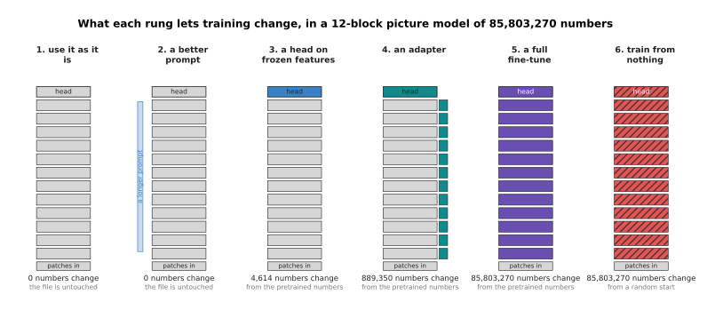

Each column is the same model, and the colour marks the parts that training is allowed
to move, with the count of numbers it moves written underneath.

Working the sums out for the stated shape gives those counts. One block holds 2,362,368
numbers in its attention part and 4,722,432 in its feed-forward part, so a block is
7,087,872 and the twelve blocks are 85,054,464; with the patch embedding and the
position table that is a backbone of 85,798,656. A head that turns its output into six
answers is 768 times 6 plus 6, which is 4,614, and an adapter of rank 8 beside the
attention output and both feed-forward matrices of every block is 884,736.

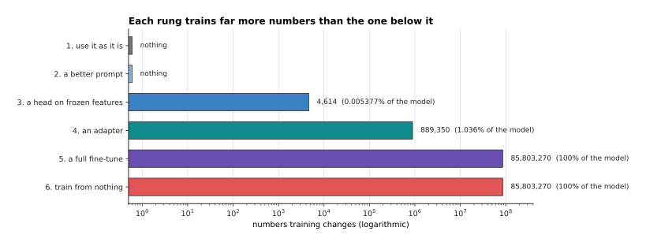

Each rung puts roughly a hundred times more numbers in play than the one below it, so
the bars need a scale on which every gridline is a hundred times the last.

A head trains 4,614 numbers, which is 0.005377 per cent of the model, and an adapter
with a head trains 889,350, which is 1.036 per cent. A full fine-tune and a run from
nothing both train all 85,803,270, and they differ only in where the numbers start from,
which is the pretrained file in one case and a random draw in the other.

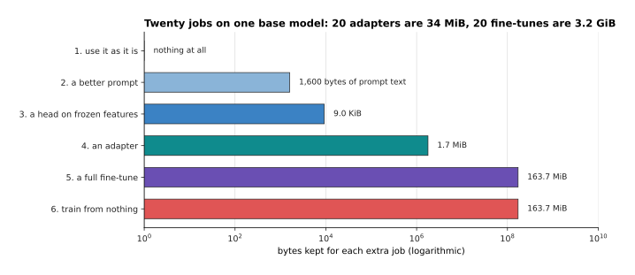

The second thing a rung costs is storage, because every job you adapt the model for
leaves behind a file you have to keep and ship.

Storing the changed numbers at two bytes each, a head is 9.0 KiB and an adapter is
1.7 MiB, while a fine-tune is the whole 163.7 MiB again. A cell that does twenty jobs
keeps 34 MiB of adapters beside one base model, or 3.2 GiB of separate models, which is
why a fleet with many jobs reaches for adapters even when memory during training was
never the problem.

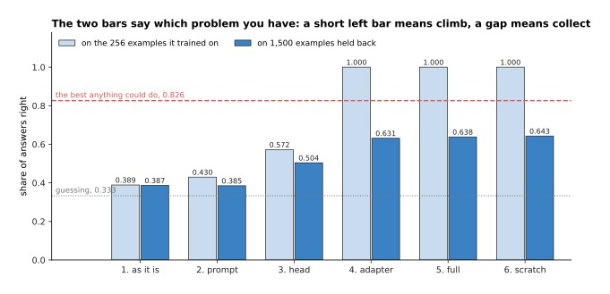

The last picture is the test that tells you to climb, and it is two numbers you already
have: how well the model does on the examples it trained on, and how well it does on
examples it has never seen.

These numbers come from the simulated job of the next section, measured at 256
examples. A head on frozen features gets 0.572 of its own training examples right, so it
cannot even fit what it was shown, and no amount of extra data fixes that, because the
frozen output does not contain the distinction the job needs; the answer is to climb. An
adapter and a full fine-tune both reach 1.000 on their own examples while reaching 0.631
and 0.638 on held-out ones, and that gap is the opposite illness, which is that the
model has learned these particular examples rather than the job; the answer there is
more examples, not a higher rung. So the rule is short: a low left bar says climb, and a
wide gap between the bars says collect.

---

## 2. What each rung costs and what it buys

The climb test says when to move, and this section says what moving costs, because the
three bills are not alike: one rung costs you examples, another costs memory, and the
last costs a person's week. The accuracy figures come from a simulated job, built so
that the whole ladder can be run ten times over and measured rather than asserted.

The simulation works like this. One example is 200 numbers standing in for one look at
one object, mixed from 16 hidden ones by a fixed random rule put through a cosine. Six
of the hidden numbers say how strongly each part of the object is present and ten are
nuisance, standing for the lighting, the background and the pose. The published model
was pretrained on 12,000 examples of a six-way job, which is to say which part is
strongest, and it reaches 0.701 on that job. The new job is a different question about
the same parts, which is whether the first two parts are both present, exactly one of
them, or neither, and the best any method could ever do on it is 0.826 while guessing
scores 0.333.

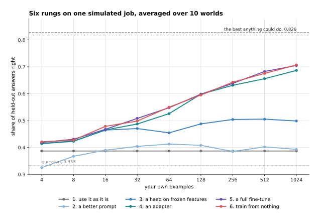

Every line is one rung, averaged over ten separate worlds, and the number of your own
examples runs along the bottom.

Using the model as it is scores 0.387 whatever you do, because nothing about it
changes. The prompt rung, which here is choosing the best fixed reading of the model's
existing answers without training anything, climbs to about 0.41 and stops, and it stops
because a prompt can only reach behaviour the weights already hold. A head on frozen
features reaches 0.505 at 512 examples and then goes no further. An adapter reaches
0.656 and a full fine-tune 0.683 at the same 512. So the gain from each climb, measured
at 512 examples, is 0.015 for the prompt, 0.103 for the head, 0.150 for the adapter and
0.027 for the full fine-tune, which says plainly that the two climbs worth making here
are onto the head and onto the adapter.

The last line is the honest one. Training the same shape from random numbers reaches
0.675 at 512 examples, which is as good as fine-tuning the pretrained model, and this
is the one place where the simulation is kinder to training from nothing than real work
is. Its input is 200 numbers, while a real picture is 150,528, and its pretraining was
12,000 examples rather than a million. A small model on a small input is exactly the
case where training from nothing works, which section 3 returns to as the one real
exception, and it is not the case you are in when the input is a camera frame.

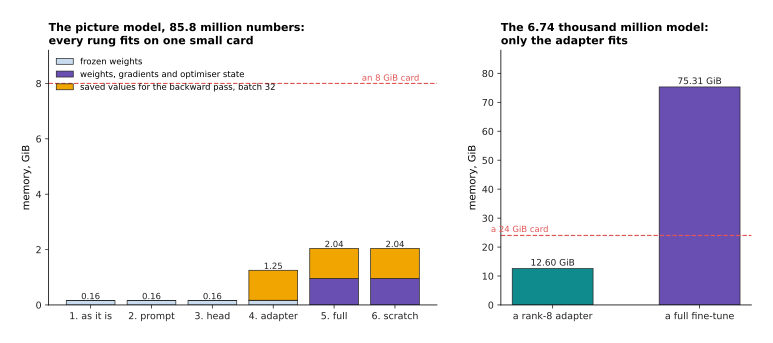

The left panel reads from the bottom as the frozen weights, then everything training
has to keep for the weights it is changing, then the values saved for the backward
pass.

A frozen weight costs 2 bytes and a trained one costs 12, because training keeps the
weight, its gradient and two running averages, and that recipe comes from the
fine-tuning page. On the stated picture model a frozen backbone with a head needs
0.16 GiB, an adapter run needs 1.25 GiB and a full fine-tune needs 2.04 GiB at batches
of 32, so every rung fits on an ordinary small card with room to spare. This is worth
saying out loud, because people reach for adapters out of habit: at 85.8 million
numbers there is no memory reason to, and the fine-tuning page's 6.74 thousand million
number model is where the reason appears, since a full fine-tune of that needs
75.31 GiB and a rank-8 adapter 12.60 GiB.

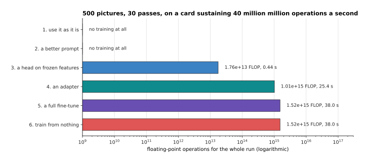

The arithmetic for one stated run of 500 pictures and 30 passes over them, with the
seconds it takes on a card that sustains 40 million million operations a second.

A head on frozen features costs one forward pass for each picture, done once, because
the output can be saved and the head trained on the saved numbers a hundred times
over, so the whole thing is 1.76e+13 operations and 0.44 seconds. An adapter costs
1.01e+15 and 25.4 seconds, because the gradient still has to travel back through every
block even though the blocks do not change. A full fine-tune costs 1.52e+15 and
38.0 seconds. These are seconds, not days, and that is the real finding of the section.

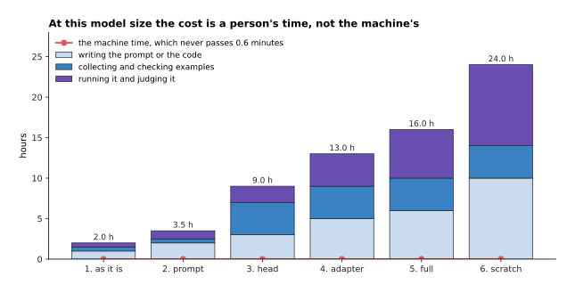

The same six rungs, priced in a person's hours at stated rates, with the machine's own
time drawn along the bottom.

Collecting and labelling 500 pictures at a stated 200 an hour is 2.5 hours, writing the
code is hours more, and judging the result is hours again, so the rungs cost between
2.0 and 24.0 hours of somebody's attention while the machine never works for longer
than 0.6 minutes. Choosing a rung is therefore mostly a choice about how much of a
person's week to spend, and that is the right way to think about it.

---

## 3. Why training a large model from nothing is out of reach

Section 2 ended with the machine barely working at all, which makes the top rung look
tempting, so this section prices it properly. The argument against training a large
model from nothing is arithmetic and not attitude, and it has two halves, one about the
operations and one about the examples.

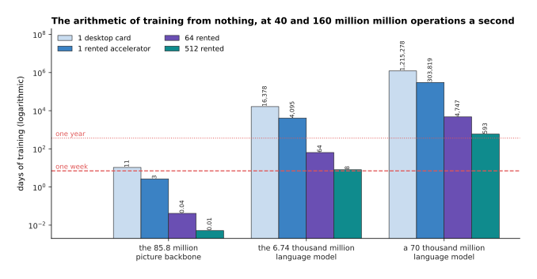

Three sizes of model, each priced on four machines, with lines drawn at one week and
one year.

Training costs about six operations for every parameter and every token, which the
[scale page](../07_pretraining-and-adapting/02_scale-data-and-compute.md) works out in
full. Pretraining the stated picture backbone on 1,200,000 pictures for 300 passes is
3.65e+19 operations, which is 10.6 days on one desktop card sustaining 40 million
million a second, so the arithmetic for a model that size is not the obstacle.
Pretraining the 6.74 thousand million number language model over 1.4 million million
tokens is 5.66e+22 operations, which is 16,378 days on that same card, or 44.8 years,
and 8.00 days on 512 rented accelerators, which at a stated two dollars an
accelerator-hour comes to 196,537 dollars. A 70 thousand million number model over ten
million million tokens is 4.2e+24 operations and still 593 days on 512 machines.

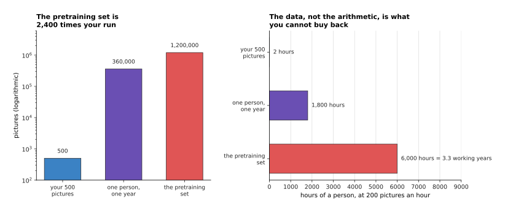

The left panel counts pictures and the right counts the hours of a person behind them,
at a stated 200 pictures an hour including the labelling.

The second half of the argument is harder to buy your way out of. The 500 pictures of
the stated run are 0.042 per cent of a 1,200,000 picture pretraining set, which is
2,400 times smaller, and collecting that set yourself takes 6,000 hours, or 3.3 working
years. One person working a full year of 1,800 hours collects 360,000 pictures, which
is 30 per cent of it, or 72,000 demonstrations at 40 an hour, which is 36,000,000
frames of the same few scenes. Frames of one scene are nearly the same picture again,
so they cannot stand in for a million different ones, and that is why nobody teaches a
robot model to see from their own demonstrations alone.

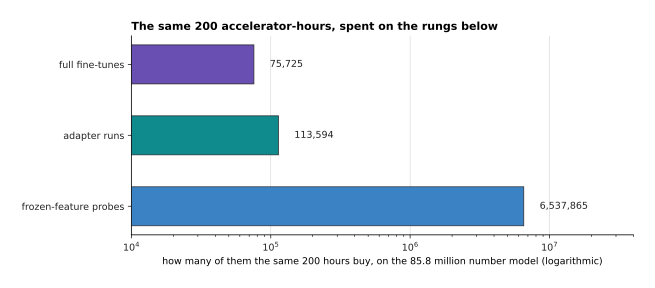

The same money, spent two ways: on the top rung on the left, and on the rungs below it
on the right.

A budget of 200 accelerator-hours is 1.15e+20 operations. Spent on pretraining the big
model it pays for 0.2035 per cent of one run, which is nothing you can use. Spent on
the rungs below it, the same budget buys 75,725 full fine-tunes of the picture model,
or 113,594 adapter runs, or 6,537,865 frozen-feature probes. There is no sense in which
the top rung is a cheaper way to the same place; it is a different and much larger
project.

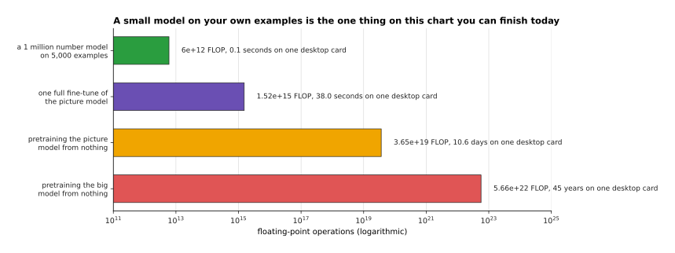

The one honest exception, drawn beside the three things it is not.

A model of about a million numbers, trained on 5,000 of your own examples for 200
passes, costs 6e+12 operations, which is 0.1 seconds. If your input is already a short
list of numbers, such as joint angles, forces, or the output of a camera model you did
not train, then a small network from random numbers is a reasonable and completely
reachable thing to build, and the simulation in section 2 is exactly that case. What
you must not do is reason from the small case to the large one. The moment the input is
a raw picture, the structure you would have to learn is the structure a published model
already holds, and your few hundred examples cannot pay for it.

---

## 4. Choosing a published starting point for your job

Since almost every rung starts from somebody else's model, the choice of whose model
matters more than anything else on this page, and it is usually made badly. The common
way is to take whichever model sits highest on a public list of scores, and the
experiment below says that this is close to useless, because such a list measures how
well a model does its own job and not how well it does yours.

The experiment is simulated and the simulation needs describing honestly. Eight models
are pretrained in the world of section 2, each on its own job, which is to say which of
several directions in part space is strongest. Two things differ between them and they
are set separately on purpose. The first is how much those directions overlap with the
two parts our job depends on. The second is how many classes its own job has, which is
three for one model and eight for another, and that alone moves the score it would
publish without changing what it is worth to us. Setting them separately is the point:
nothing in the real world ties a model's benchmark to your job either.

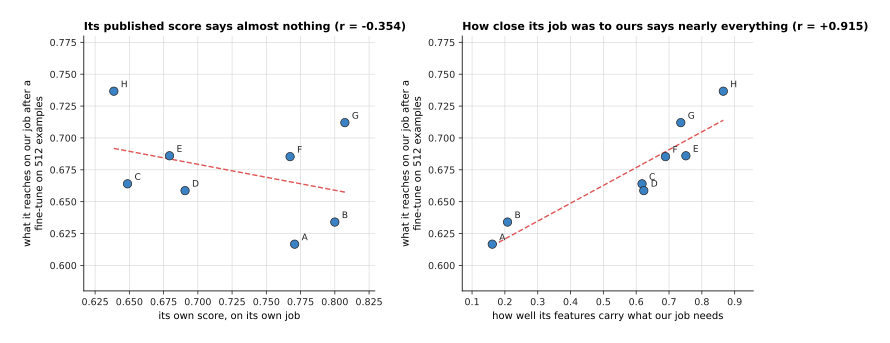

Each point is one of the eight models, placed by what it reaches on our job after a
fine-tune on 512 of our examples, against two different things you might have chosen
it by.

Against its own published score the relation is weakly negative, with a correlation
coefficient of −0.354, which means a higher score went very slightly with a worse
result for us. Against the overlap, measured as how well a straight line through the
model's frozen output recovers the two measurements our job depends on, the relation is
+0.915. The overlap is not something you read off a web page, but it is something you
can measure in an afternoon, and the next picture shows the cheap way to measure it.

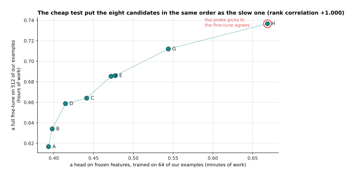

The cheap test on the bottom axis and the expensive one up the side, with the eight
models lettered A to H.

The cheap test is a head on frozen features, trained on 64 of your own examples. It
needs no training of the model itself, it costs one forward pass for each of your
pictures, and in this experiment it put all eight models in exactly the same order as
the full fine-tune did, giving a rank correlation of +1.000. That is the test to run
before committing a week: collect a small honest set of your own examples, push them
once through each candidate, train a head on the saved output, and read off the order.

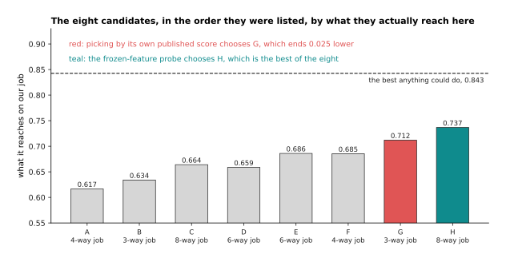

The same eight models, in the order they were listed, by what they actually reach on
our job, which has a ceiling of 0.843.

Picking by the published score chooses model G, which ends at 0.712, while the best of
the eight is H at 0.737, so the habit costs 0.025 of the answers here. The probe
chooses H. The gap is not enormous, and it would not be, because all eight models are
reasonable; what matters is that the cheap measurement found the best one and the
published number did not.

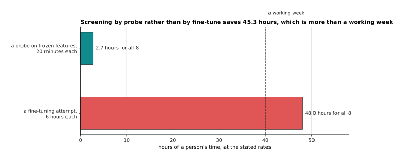

What the two ways of choosing cost a person, at a stated 20 minutes for one probe and
6 hours for one fine-tuning attempt.

Screening all eight candidates with a probe is 2.7 hours, and fine-tuning all eight is
48 hours, so the probe saves 45.3 hours, which is more than a working week. That is the
cheap test that saves the week, and it is worth running even when you are sure, because
being sure is how people end up fine-tuning the wrong starting point for five days.

---

## 5. Licences, read before the work and not after

The model you chose in section 4 came with terms, and this section is about reading
them first, because the cost of reading them is half an hour and the cost of finding
out late is everything you built. The words that follow describe what to look for
rather than what any particular model allows, since terms change and no page should be
trusted on the current state of a specific one; go to the model's own page and read it.

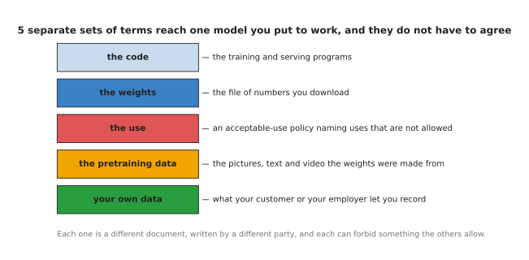

Five separate sets of terms reach one model you put to work, and they are written by
different parties and do not have to agree with one another.

The first mistake is to think there is one licence. The programs that train and serve
the model have their own, usually an ordinary open-source one. The **weights**, meaning
the file of numbers you download, have their own and it is often not an open-source
licence at all, whatever the phrase "open weights" suggests, because an open-weight
model is simply one whose numbers you can download. Many weights come with an
**acceptable-use policy**, which is a separate list of things nobody may use the model
for whatever else their licence says. The data the model was pretrained on has its own
terms, which matter when somebody asks where your model's knowledge came from. And your
own recordings have terms too, set by whoever owns the parts, the factory or the faces
in the picture.

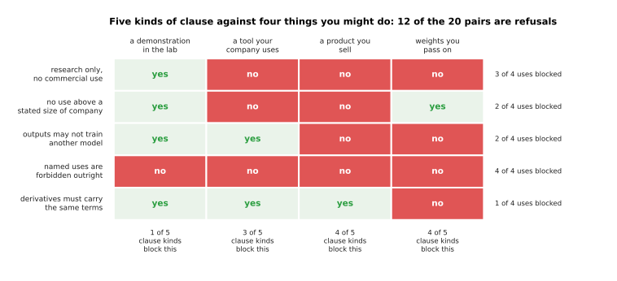

Each row is a kind of clause that really appears in model terms, each column is
something you might do with the result, and a red cell is a refusal.

Reading across the rows gives the questions to ask. Does the licence allow commercial
use at all, or only research? Does it stop applying above some size of company? May the
model's outputs be used to train another model, which matters whenever you plan to
distil a large model into a small one? Does an acceptable-use policy name uses that are
forbidden outright, which is the one row that blocks even a demonstration in your own
lab? And must anything you build from it carry the same terms, which decides whether
you may hand the weights to a customer? In this stated grid 12 of the 20 pairs are
refusals, and a product you sell is blocked by 4 of the 5 kinds while a demonstration
in the lab is blocked by only 1, which is the pattern to expect: the further the work
travels from your own bench, the more of the terms apply.

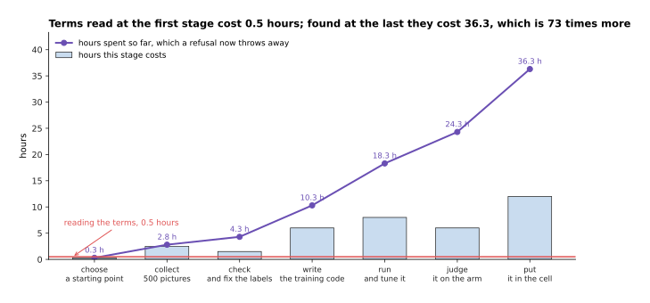

The hours a project has spent by the end of each stage, against the half hour that
reading the terms would have cost at the start.

By the time the model is in the cell the project has cost 36.3 hours at the stated
rates, and a clause found then throws all of it away, while reading the terms at the
first stage costs 0.5 hours, which is 73 times less. There is nothing clever in this
figure and that is the point: the only reason anybody skips the reading is that it feels
like it is not the work, and it is cheaper than every other thing on the chart.

---

## 6. Three robot jobs, taken down the ladder

The rules in the five sections above are easier to trust once you watch them decide
something, so this section takes three real robot jobs down the ladder and stops each
one where it should stop. The reasoning is shown, because the reasoning is the part you
will reuse.

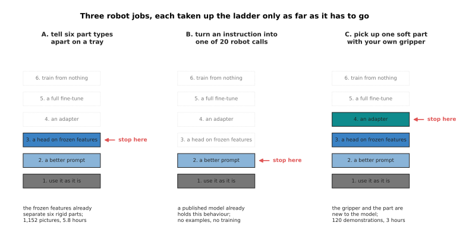

The three jobs, each taken up the ladder only as far as it has to go, with the cost at
the rung where it stops.

The first job is to tell six part types apart on a tray under a fixed overhead camera.
A published picture model already separates rigid objects of different shapes, so the
question is only which of six names to attach, and a head on frozen features answers
it; the climb test from section 1 confirms this, because such a head fits its own
examples easily. The second job is to turn a spoken instruction into one of twenty
robot calls. A published language model already holds that behaviour, so the job needs
no training at all, only a clear prompt that lists the twenty calls and says what each
one does. The third job is to pick up one soft part with your own gripper. The model
has never seen that gripper or that part, so the frozen output does not contain what
the job needs, and the honest rung is an adapter on a published policy.

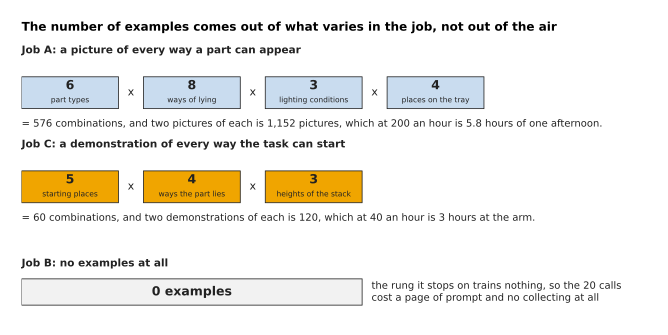

How many examples each job needs, worked out from what varies in the job rather than
guessed.

The number of examples is a product of the things that change the answer. For the first
job there are 6 part types, 8 ways a part can lie, 3 lighting conditions and 4 places on
the tray, which is 576 combinations, and two pictures of each is 1,152 pictures, or
5.8 hours at a stated 200 an hour. For the third there are 5 starting places, 4 ways the
part can lie and 3 heights of stack, which is 60 combinations and 120 demonstrations, or
3 hours at a stated 40 an hour. The second job needs none at all, because the rung it
stops on trains nothing.

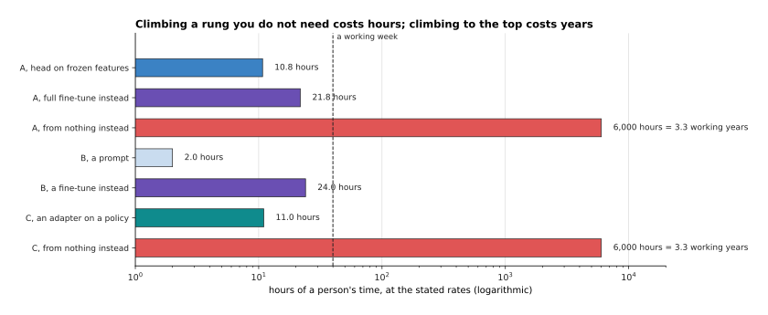

What each job costs a person at the rung it stopped on, beside what the rungs above it
would have cost, with the from-nothing rows counting only the collecting.

Stopping in the right place saves hours at the top of the chart and years at the bottom.
The first job is 10.8 hours at its head, 21.8 hours if fine-tuned instead, and the
from-nothing version would need a pretraining-sized set of pictures, which is 6,000
hours, or 3.3 working years of collecting alone. The second job is 2.0 hours as a prompt
against 24.0 hours as a fine-tune. The third is 11.0 hours as an adapter, and from
nothing it is the same 3.3 working years, because 120 demonstrations give 60 distinct
scenes while the seeing part of a published model came from 1,200,000 of them.

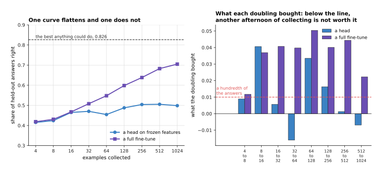

The left panel is the measured curve for two rungs on the simulated job, and the right
panel is what each doubling of the examples bought.

The last decision each job needs is when to stop collecting, and the right panel answers
it. A doubling that buys less than a hundredth of the answers is not worth another
afternoon, and on the simulated job the head rung crosses below that line between 16 and
32 examples while the full fine-tune is still buying 0.022 at the last doubling. So
collect a few hundred, draw this chart from your own held-out set, and let the shape of
it rather than a rule of thumb tell you whether to collect more, climb a rung, or stop.

---

## 7. Where to read next

- [Recipes for models that see and
  understand](04_recipes-for-models-that-see-and-understand.md) is the next page, and it
  applies this ladder one family at a time, with a starting recipe for a classifier, a
  detector, a segmenter, a depth model and a vision-language job.
- [The order of the work](02_the-order-of-the-work.md) is the page before, and it gives
  the milestones you climb once you have chosen a rung.
- [Fine-tuning and
  adapters](../07_pretraining-and-adapting/03_fine-tuning-and-adapters.md) explains how
  the third, fourth and fifth rungs work inside, and how much a fine-tune forgets.
- [Scale, data and compute](../07_pretraining-and-adapting/02_scale-data-and-compute.md)
  is where section 3's six operations for every parameter and every token come from.
- [When it does not work](06_when-it-does-not-work.md) takes over when the rung you
  chose is training and the numbers are wrong.
- [Fine-tuning](../../07_learned-models/10_making-models-work-on-an-arm/02_most-used/01_fine-tuning.md)
  in the models catalogue gives the same choice from the robot's side, with the named
  models people start from.

---

## 8. Using it in Python

Sections 1 and 2 counted parameters and bytes by hand, and this section does the same
counting with real libraries, because those counts are what you check before starting a
run that will take somebody's afternoon. The code builds the stated model's shape
without downloading any weights, so it runs anywhere.

```python
import torchvision
from torch import nn
from peft import LoraConfig, get_peft_model

# Section 1's arithmetic, from the stated shape and nothing else.
width, blocks, ff, tokens, classes = 768, 12, 3072, 197, 6
block = 4 * width * width + 4 * width + 2 * width * ff + ff + width + 4 * width
backbone = (3 * 16 * 16 * width + width            # the patch embedding
            + tokens * width + width               # positions and the summary piece
            + blocks * block + 2 * width)
print(f'{backbone:,}')                             # 85,798,656

# The same shape built for real. weights=None means nothing is downloaded.
model = torchvision.models.vit_b_16(weights=None)
whole = sum(p.numel() for p in model.parameters())
print(f'{whole - (width * 1000 + 1000):,}')        # 85,798,656, the same count

# Rung 3: freeze every weight, then put a six-way head on top.
for p in model.parameters():
    p.requires_grad_(False)
model.heads = nn.Linear(width, classes)
head = sum(p.numel() for p in model.parameters() if p.requires_grad)
print(f'{head:,}')                                 # 4,614

# Rung 4: an adapter beside the attention output and both feed-forward matrices.
cfg = LoraConfig(r=8, lora_alpha=16, target_modules=['out_proj', 'mlp.0', 'mlp.3'])
get_peft_model(torchvision.models.vit_b_16(weights=None), cfg).print_trainable_parameters()
# trainable params: 884,736 || all params: 87,452,392 || trainable%: 1.0117

# Section 2's memory recipe: 2 bytes for a frozen number, 12 for a trained one.
def gib(frozen: int, trained: int) -> float:
    return (frozen * 2 + trained * 12) / 2 ** 30

print(f'{gib(backbone, head):.2f} GiB')            # 0.16 GiB, a head on frozen features
print(f'{gib(0, backbone + head):.2f} GiB')        # 0.96 GiB, a full fine-tune
```

The first two blocks are worth running before anything else, because they take a second
and they tell you whether the model you are about to start from is the shape you think
it is. The hand arithmetic and the real model agree exactly at 85,798,656, once the
thousand-way head the library ships is taken off, and that agreement is a good sign that
you have understood the shape rather than copied a number.

What the libraries do for you is the surgery and the bookkeeping. Setting
`requires_grad_(False)` on every parameter and then attaching a new layer is the whole
of the third rung, because anything whose gradient is not wanted is simply not given
one. `get_peft_model` walks the model, finds every layer whose name matches
`target_modules`, puts a pair of thin matrices beside it, marks everything else as
frozen and arranges the forward pass so the side path is added; the count it prints,
884,736, is the same one section 1 worked out by hand. Nothing here downloads weights,
and in real work the line that does is where you pass a published model's name instead
of `None`.

What you still decide is everything this page has been about. You choose the rung, using
the two bars of section 1 to say whether to climb; you choose which published model to
start from, using the cheap probe of section 4 rather than a public score; you read the
terms of section 5 before any of it; and you decide how many examples to collect, using
the product of what varies in your job from section 6 and the doubling test that says
when to stop.
