# Recipes for models that see and understand

The page before this one, [What to reuse and what to
train](03_what-to-reuse-and-what-to-train.md), set out a ladder of starting
points. The bottom of that ladder is using somebody else's finished model exactly
as it is. Above it come a prompt, then a small new layer trained on the model's
output, then an adapter, then a full fine-tune, and at the top training a model
from random numbers. That page gave you a method for choosing one rung. This page
applies the method one family of model at a time. So a reader who already knows
which kind of model they want can turn to the right recipe and start work this
afternoon.

There are six recipes, and each one has the same six parts in the same order.
Because the parts are always in the same order, you can use the page as a
reference instead of reading it from start to finish. Each recipe says what one
training example actually is, down to the files and the words inside them. Then it
says roughly how many examples you need, and it shows the reasoning that sets that
number, rather than giving you a figure to copy. After that it says which kind of
published starting point to begin from. Then it gives the first milestone that
tells you the work is going in the right direction. Then it names the one number
to watch. Finally it names the mistake almost everybody makes first.

This page assumes you have read the three pages before it. That means your job is
already written down as an input, an output and one number that says it worked. It
also means you have a baseline to beat and a held-out set, which is a group of
examples you decided to keep back before training and never train on. The page
also assumes you know roughly what these families of model are, because [Models
that see](../09_models-that-see/01_vision-backbones.md) and [Language and
multimodal models](../10_language-and-multimodal-models/01_large-language-models.md)
have already explained how each one works inside. So where a recipe needs that
machinery, it links back to it rather than explaining it again.

Every number on this page was worked out by
`docs/diagrams/starting_your_own_model_4.py`, and that script prints each number
so that you can check it. Some of the pictures come from models that the
script really trains, which are a classifier with six classes and a small depth
model. The data those two models learn from is simulated, which means it was
drawn from seeded random numbers rather than photographed. No published model,
dataset size or benchmark score appears anywhere on this page. A recipe built on a
half-remembered figure is worse than no recipe at all, so a figure that cannot be
checked here is not used here.

## Contents

1. [Naming a picture or a region: the classifier](#1-naming-a-picture-or-a-region-the-classifier)
2. [Finding a thing: the detector](#2-finding-a-thing-the-detector)
3. [Which pixels: the segmenter, and the cheaper way round it](#3-which-pixels-the-segmenter-and-the-cheaper-way-round-it)
4. [Depth and the third dimension: measure before you train](#4-depth-and-the-third-dimension-measure-before-you-train)
5. [A language model job: a prompt, retrieval, a fine-tune, or none of them](#5-a-language-model-job-a-prompt-retrieval-a-fine-tune-or-none-of-them)
6. [A vision-language job: asking a question about a scene](#6-a-vision-language-job-asking-a-question-about-a-scene)
7. [Where to read next](#7-where-to-read-next)
8. [Using it in Python](#8-using-it-in-python)

---

## 1. Naming a picture or a region: the classifier

The first recipe is the cheapest in this book, which is why it comes first. It is
also the one people reach for when they should not. A **classifier** is a model
that takes one picture and gives back one name. The name comes from a list of
names that you fixed before training started, and the model can never answer with
anything outside that list.

The picture below shows what one training example looks like on disk.

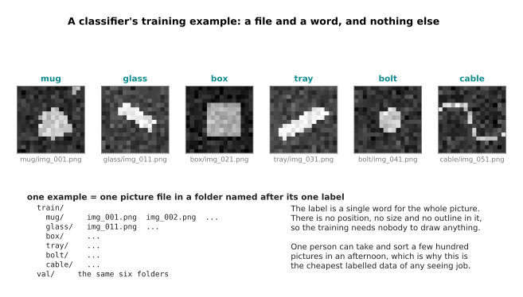

One training example is one picture file and one word. The word is almost always
the name of the folder that the file sits in, so you label a picture by dragging
it into the right folder. Nobody draws a box, nobody traces an outline and nobody
measures anything. Because of that, one person can take and sort a few hundred
pictures in an afternoon, and this is the cheapest labelled data of any seeing
job. The six pictures above are simulated, but the folder layout is the real one
that every library expects.

The same model can name a region of a picture instead of the whole picture. To do
that you cut the region out first and hand the cut-out over on its own. This is
how a classifier usually sits behind a detector, which is the family in section 2.

How many examples you need is not set by the number of classes, and this is the
part people get wrong. It is set by the number of **conditions** the object can be
in. A condition here means one combination of the things that change how the
object looks, such as how it is lying and how it is lit. The model has to see each
condition several times before it treats that condition as ordinary rather than as
a surprise.

Suppose the object can be upright, tipped, on its side, upside down, half hidden
or at an angle, which is six ways of lying. Suppose the light can be dim, room
light, bright, or daylight through a window, which is four lightings. Six ways of
lying times four lightings is 24 conditions, and you want at least three examples
of each one. The picture below counts what one random collection of 96 pictures
actually delivered.

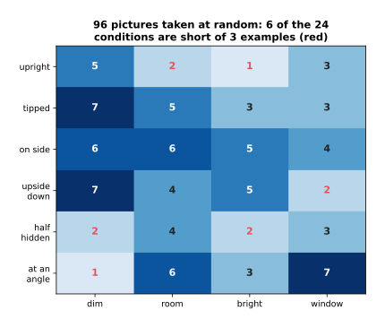

Collecting pictures as they come, rather than going round the conditions on
purpose, leaves gaps. In the collection above, 96 pictures left 6 of the 24
conditions with fewer than three examples. The next picture repeats that
experiment 4,000 times at each size, so that the gaps are measured rather than
guessed.

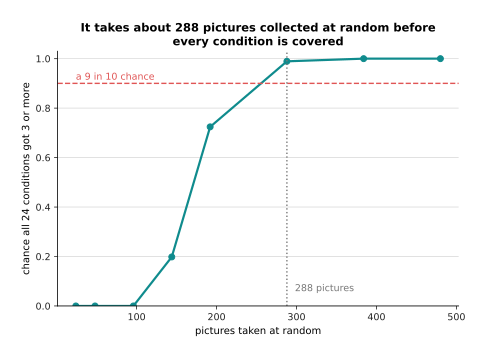

It takes about 288 pictures collected at random before the chance that every
condition is covered reaches nine in ten. That reasoning turns the vague advice
"a few hundred a class" into an answer you can defend. It also names the cheaper
alternative, which is to go round the 24 conditions deliberately and take three
pictures of each, because that needs 72 pictures rather than 288.

The next picture is a measurement rather than a claim. The script draws six
classes of simulated object, really trains a classifier on them by gradient
descent, and then scores it on 720 held-out pictures it never saw. Guessing would
score 0.167 on that test, because there are six classes.

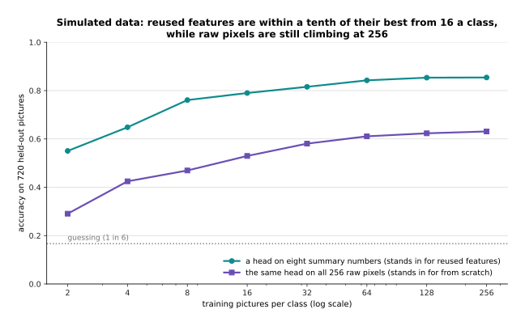

The teal line is a head trained on eight summary numbers about the object, such as
its area and how elongated it is. Those eight numbers stand in for the output of a
published backbone, which is a model somebody else already trained. The purple
line is the same head trained on all 256 raw pixels instead, which stands in for
training from nothing. The reused features score 0.550 with two pictures a class
and 0.761 with eight. After that they climb slowly, reaching 0.853 at 128 pictures
a class and 0.854 at 256. The raw pixels start at 0.291, are still climbing at 256
pictures a class, and have only reached 0.631 there. So reusing features is worth
more than collecting several times as much data.

The starting point is therefore a published vision backbone with a new head on
top, trained with the backbone held still. [Fine-tuning and
adapters](../07_pretraining-and-adapting/03_fine-tuning-and-adapters.md) describes
how to hold a backbone still. The first milestone is the one from [The order of
the work](02_the-order-of-the-work.md): make the model memorise a single batch of
examples on purpose, and only then run a small honest training.

The one number to watch after that is the accuracy of the worst class, not the
average over classes. The picture below says why, using the same classifier
trained on 16 pictures a class.

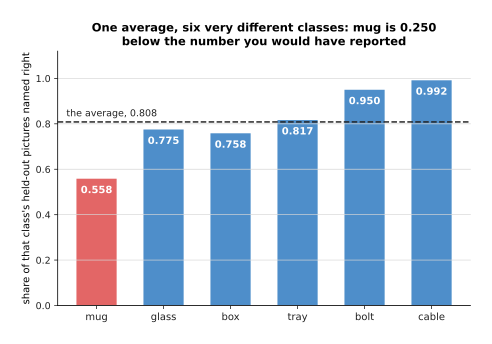

The average over the six classes is 0.808, which sounds acceptable. However, the
mug is right only 0.558 of the time, which is 0.250 below that average. If you
report the average, nobody learns that one class in six barely works. So report
the worst class instead, and report the average beside it.

The mistake almost everybody makes first is to train a classifier when the arm
needs a place rather than a name. The next two pictures measure how badly that
goes wrong, using one simulated table scene.

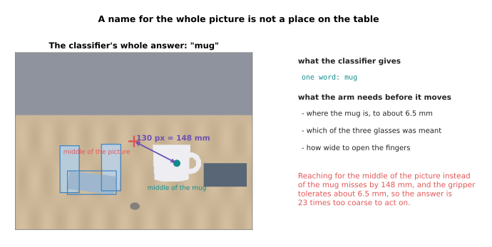

The whole answer the classifier gives is the word "mug", so the only place the arm
can reach for is the middle of the picture. The camera in this scene sits 0.80
metres from the table and has a focal length of 700 pixels, so one pixel on the
table is 1.143 millimetres across. The middle of the mug is 130 pixels from the
middle of the picture, which is 148 millimetres. A gripper tolerates about 6.5
millimetres of error, so that reach is 23 times too coarse to act on.

The second problem is that one name cannot choose between objects of the same
kind, and the scene holds three glasses.

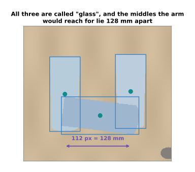

All three objects are called "glass", so the word "glass" does not say which one
was meant. The middles the arm might reach for lie 128 millimetres apart, which is
again far outside the gripper's 6.5 millimetres. A classifier is the right choice
when the question really is about the whole picture, such as whether the cell is
empty. It is the wrong choice the moment the next step is a movement.

---

## 2. Finding a thing: the detector

When the answer has to be a place, the next family up is the detector. A
**detector** gives back a box round each object it finds. With each box it also
gives a class name and a confidence, which is a number between zero and one saying
how sure the model is. Everything in this recipe follows from one fact, which is
that a detector's labels are drawn by hand.

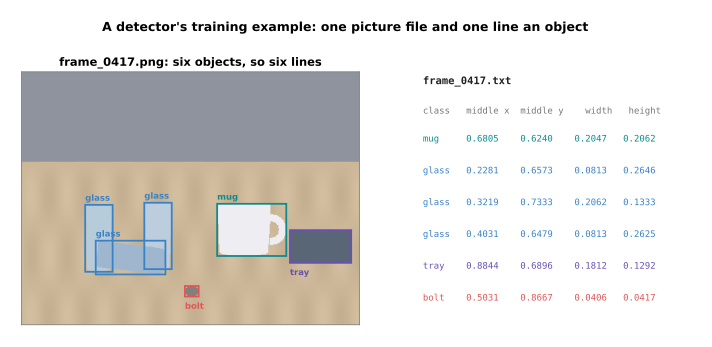

One training example is one picture file and one text file beside it. The text
file holds one line for each object in the picture. Each line is a class name
followed by four numbers: the middle of the box across, the middle of the box
down, the width of the box and its height. All four numbers are written as
fractions of the picture rather than in pixels, so the same line means the same
box whatever size the picture is later resized to.

What matters most is what a missing line says, because a missing line is not a
gap. It is a statement that there is nothing there.

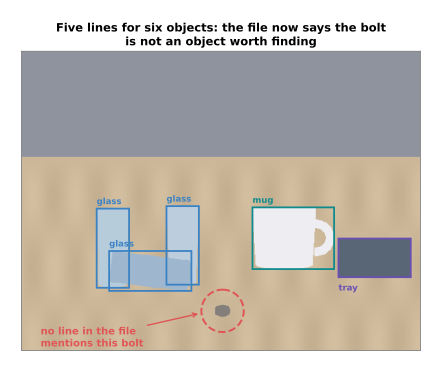

In the picture above the bolt is plainly on the table, but the label file holds
five lines rather than six. During training the model is punished every time it
guesses a box where the file says there is nothing. So one lazily labelled picture
teaches the model that bolts are not worth finding. For that reason a picture you
cannot be bothered to finish should be thrown away rather than half labelled.

How many examples you need is best answered in hours, because hours are what
actually stop people.

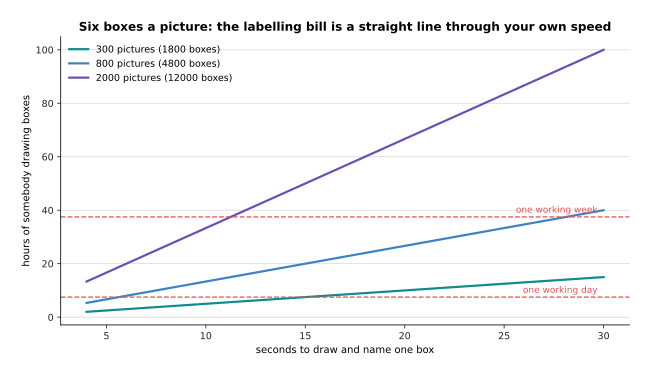

This scene holds six objects, so 300 pictures are 1,800 boxes. At 12 seconds a box
that is 6.0 hours of somebody drawing boxes. Two thousand pictures at 20 seconds a
box is 66.7 hours, which is 8.9 working days of one person doing nothing else.
Your own speed will differ, so measure the seconds a box on twenty of your own
pictures before you promise anybody a dataset. The line through your own measured
speed is the only honest estimate.

The count that decides whether you can measure anything is instances of each
class, not pictures. An instance is one labelled object, so a picture holding
three glasses gives three glass instances.

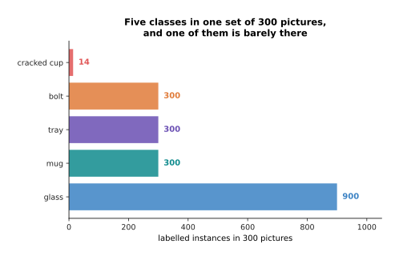

In 300 pictures of this scene the glasses give 900 instances and the mug gives
300. However, a cracked cup that appears in only 14 pictures gives 14 instances,
and that is too few to measure. The reason is the held-out split, which here puts
one picture in five on the held-out side.

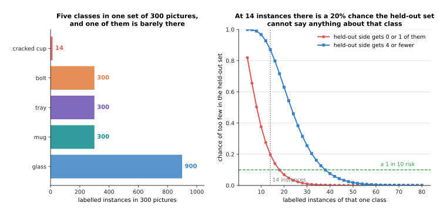

With 14 instances there is a 0.198 chance that no more than one of them lands on
the held-out side. A score measured on one example is not a measurement at all, so
that class cannot be checked. It takes 38 instances before there is a nine in ten
chance of at least five held-out examples. That makes 38 instances a floor you can
defend to whoever asks for the rare class.

The starting point is a published detector with its last layer replaced by a new
one that names your classes, fine-tuned on your own pictures. The first milestone
is that it finds the objects in the very pictures it trained on. A model that
cannot do even that has a fault in the data loading or in the label format, rather
than a model that is too small.

The one number to watch is **average precision** for the class you care about.
Average precision is the area under the curve that plots precision against recall.
Precision is the share of the model's guesses that were right, and recall is the
share of the real objects that it found. A guess counts as right only when its box
overlaps the true box by more than a threshold you choose, and the usual threshold
is 0.5.

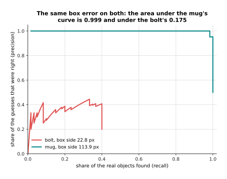

In this experiment every guessed box is moved by the same six pixels on each edge,
so both classes suffer exactly the same error. The mug's box is 113.9 pixels
across, and six pixels is a small share of that, so the mug still scores 0.999.
The bolt's box is only 22.8 pixels across, and six pixels is a large share of
that, so the bolt scores 0.175.

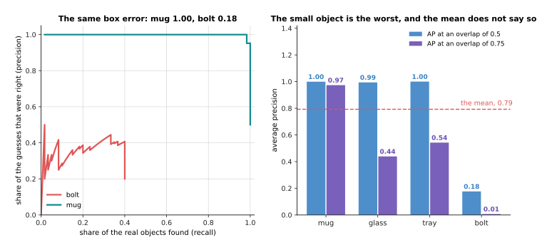

The mean over the four classes is 0.792, and that number describes neither the mug
nor the bolt. Demanding a tighter overlap of 0.75 drops the glass from 0.994 to
0.437, and nothing about the detector changed. This is why [Detection and
segmentation](../09_models-that-see/02_detection-and-segmentation.md) insists that
a score means nothing until the threshold is quoted beside it.

The mistake almost everybody makes first is to label the easy pictures. People
photograph the objects nicely spaced on a clean table, the model learns that
arrangement, and the first cluttered frame from the real cell defeats it. So label
the awkward pictures first, because those are the ones that carry the information.

---

## 3. Which pixels: the segmenter, and the cheaper way round it

A box is enough to point a camera at a thing, but it is not enough to close a
gripper round it. That brings us to the family that answers in pixels. A
**segmenter** gives one number for every pixel of the picture, saying whether that
pixel belongs to the object. That grid of numbers is called a **mask**.

One training example is a picture and one mask for each object in it. A mask is
made by a person clicking round the outline of the object, and the clicks become
the corners of a polygon. So the cost of a mask is the number of clicks, and the
next picture measures what each click buys.

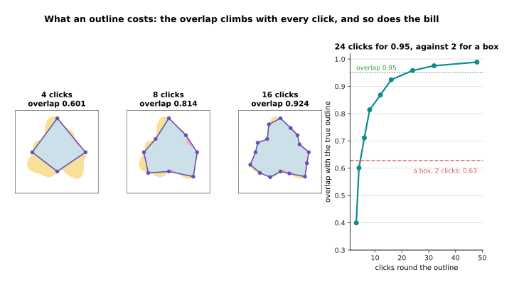

The part in the picture holds 12,472 pixels. Four clicks give an overlap of 0.601
with the true outline, eight clicks give 0.814 and sixteen clicks give 0.924. The
next picture carries that measurement out to 48 clicks and marks what a box gets.

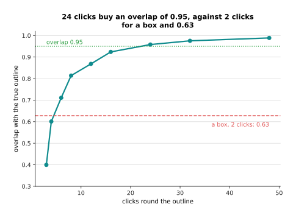

It takes 24 clicks to reach an overlap of 0.958. Two clicks give a box, and the
box overlaps the part by 0.628. So a careful outline costs roughly twelve times
the clicking of a box for the same object.

That cost is why the right answer is so often not to train a segmenter at all.

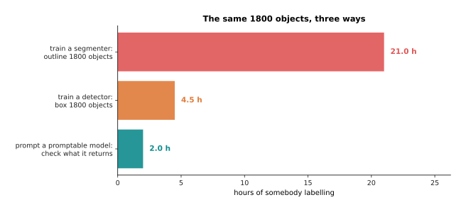

Outlining 1,800 objects with 24 clicks each takes 21.0 hours. Boxing the same
1,800 objects takes 4.5 hours. Checking masks that somebody else's model handed
back takes 2.0 hours, and no mask is drawn at all. The model that hands them back
is a **promptable segmentation** model, which takes a point or a box and returns
the pixels of whatever is there. Somebody else trained it on far more pictures
than you will ever label, so you spend nothing on training it.

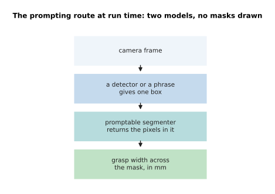

The chain above is what runs in the cell once you take this route. You hand the
promptable model the box your detector already produces, and it hands back the
pixels. The honest costs are these. You run two models rather than one, so there
are two things to load and two things to time. The masks carry no class name, so
the box still has to come from somewhere. A single point is a genuinely ambiguous
prompt, so a box prompt is the safer one. Finally, you cannot improve the result
by labelling more pictures, because you are not training it. For most arms that
trade is worth taking, and [Detection and
segmentation](../09_models-that-see/02_detection-and-segmentation.md#6-masks-and-models-that-take-a-prompt)
explains how such a model works inside.

If you do train a segmenter, the starting point is a published segmentation model
fine-tuned on a few hundred masks. The first milestone is physical rather than
numerical: measure the narrow way across the mask, turn that into millimetres, and
check it against a steel rule held across the real object.

The one number to watch is the overlap on the thin part of the object rather than
the overlap overall. A segmenter usually works on a coarse grid and then stretches
its answer back up to the size of the picture, and the two numbers come apart
sharply when it does.

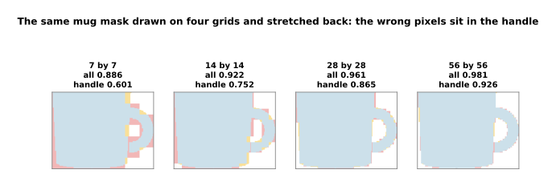

The four panels above are the same mug mask at four grid sizes. The body of the
mug is right in all four, and almost every wrong pixel sits in the handle. The
next picture measures that gap.

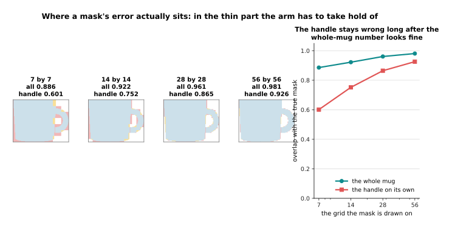

On a 7 by 7 grid the mask overlaps the truth by 0.886 over the whole mug and by
only 0.601 on the handle. On a 14 by 14 grid it is 0.922 overall and 0.752 on the
handle. Even on a 28 by 28 grid it is 0.961 overall and 0.865 on the handle. The
handle is the part the fingers have to go round, so the overall number is the one
that matters least.

The mistake almost everybody makes first is to pay for pixels before checking
whether a box would have done. Two quick tests settle it, and both are shown
below.

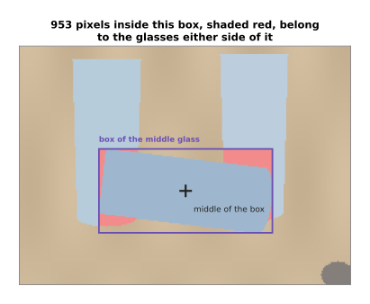

The first test is whether objects of the same kind touch one another. The box
round the lying glass holds 953 pixels that belong to the glasses either side of
it, which is 11.0 per cent of the box. A grasp worked out from that box can close
on the wrong glass, so this scene needs pixels.

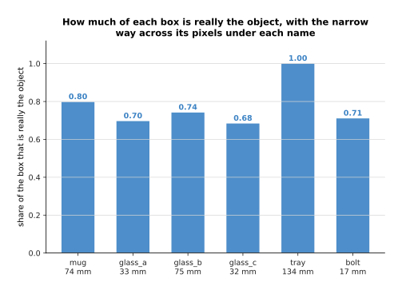

The second test is how much of the box is really the object. Read the bars above
as the share of the box that the object fills, and read the millimetre figure
under each name as the narrow way across that object. The tray fills its box
completely, because the tray is a rectangle. The mug fills 0.798 of its box and
the bolt only 0.711, so nearly three pixels in ten inside the bolt's box are table
rather than bolt. If both tests come back clean, use a detector and keep the ten
hours.

---

## 4. Depth and the third dimension: measure before you train

The three recipes so far all end in a place on a flat picture, but an arm needs a
place in the room. That is what this family supplies. The important thing about it
is that most depth problems are not model problems. For that reason this recipe
spends its first half talking you out of training anything.

Before anything else, find out what the camera-to-arm transform already costs.
**Calibration** here means measuring where the camera sits and which way it points
relative to the base of the arm. The arithmetic of a calibration error is one
multiplication: the distance to the object times the tangent of the angle error.

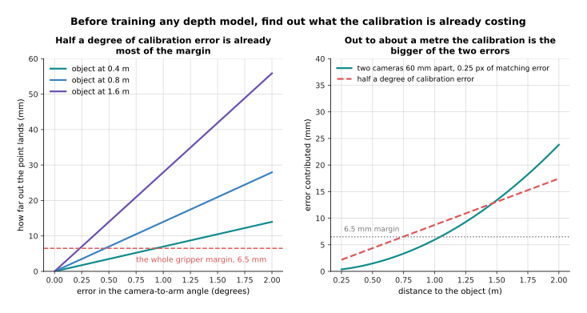

Half a degree of angle error moves the point by 3.5 millimetres at 0.4 metres and
by 7.0 millimetres at 0.8 metres. A whole degree at 0.8 metres moves it 14.0
millimetres. The gripper tolerates about 6.5 millimetres, so at 0.8 metres the
whole margin is used up by 0.466 of a degree. The next picture compares that one
error against the noise of a stereo camera, which is a pair of cameras a fixed
distance apart that works out depth by matching the same point in both pictures.

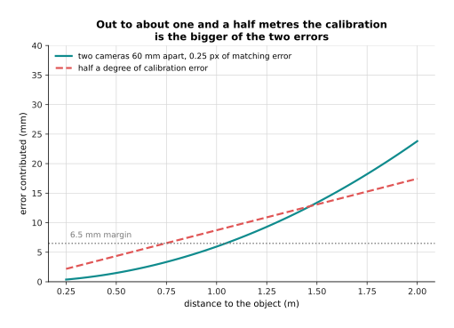

Out to about one and a half metres the single calibration angle contributes more
error than the stereo camera's own noise does. So a day spent calibrating buys
more than a month spent training.

If you do need a model, one training example is three files.

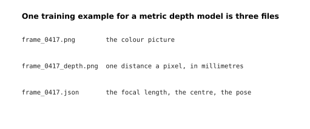

The third file is the one people forget. Without it a distance in millimetres
means nothing, because there is no way to turn a pixel into a direction in the
room. The focal length and the centre of the picture are what turn a pixel into a
direction, and the pose says where the camera was standing when the frame was
taken.

Where those millimetres came from sets the best the model can ever be, so the next
picture compares three honest ways of measuring them.


At 0.80 metres a stereo pair 60 millimetres apart, matching to a quarter of a
pixel, puts 3.8 millimetres of error into every label. Judging the distance from
the apparent size of a known object, measured to one pixel, puts in 8.1
millimetres, which is already more than the gripper's margin. A steel rule held up
by hand puts in about 1.0 millimetre, so the slowest method is the most accurate
one.

How many examples you need has an unwelcome answer, which is that the number of
examples is rarely what holds you back. The script really fits a small depth model
on a simulated cue and scores it against the clean truth on 6,000 held-out
examples. A cue here means the thing in the picture that the model reads the
distance from, and this cue is the apparent height of an object whose real height
is about 80 millimetres.

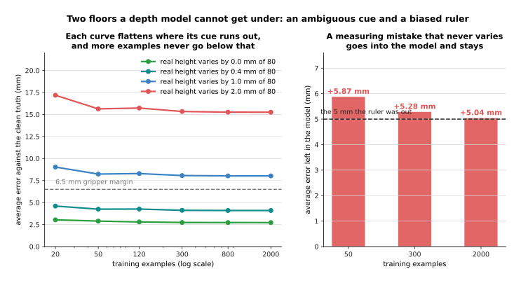

When the real height varies by 1 millimetre in 80, going from 20 to 2,000 training
examples takes the error from 9.0 millimetres down to 8.0. When it varies by 2
millimetres in 80, the error goes from 17.2 millimetres down to 15.3, so a
hundredfold increase in data bought 1.9 millimetres. The cue simply does not
contain the answer, and no amount of data puts it there.

The second floor is worse, because it is invisible from inside the data.

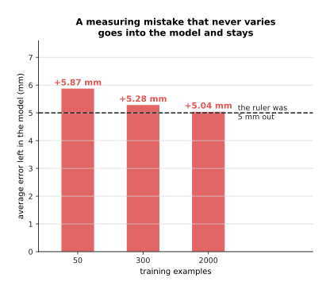

Suppose the rule you measured with reads 5 millimetres long every time. At 2,000
examples the model is still 5.04 millimetres out, and collecting more examples
will never reveal it. The reason is that the training data agrees with itself
perfectly, so nothing inside the data looks wrong. For both reasons, collect a
hundred examples, find where the error stops falling, and only then ask whether
data is what you are short of.

The starting point is a stereo camera or a pattern-projecting camera. The other
option is a published relative-depth model pinned to two real distances, which
[Depth and the third
dimension](../09_models-that-see/04_depth-and-3d.md#3-relative-depth-and-metric-depth)
explains. The first milestone is an **error budget** that passes. An error budget
means writing every source of error down in millimetres, squaring each one, adding
the squares and taking the square root of the total. That way of adding is called
adding in quadrature, and it is the right way to combine errors that are
independent of one another.

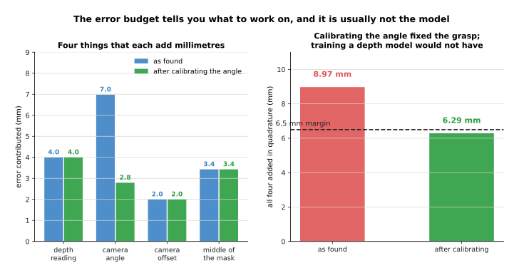

In this budget the depth reading contributes 4.00 millimetres, the camera-to-arm
angle contributes 6.98, the camera-to-arm offset contributes 2.00 and the middle
of the mask contributes 3.43. Calibrating the angle from half a degree down to a
fifth of a degree takes that one term from 6.98 to 2.79, and it changes nothing
else.

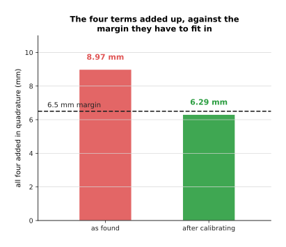

Added in quadrature the four terms come to 8.97 millimetres, against a margin of
6.5, so the grasp fails. The angle alone is 61 per cent of that squared total, so
it is the term worth working on. After calibrating it the total is 6.29
millimetres, which passes.

The one number to watch is the error of the final grasp point against a rule, and
not the model's own loss. The mistake almost everybody makes first is to train a
depth model while that camera angle is still wrong, and then to blame the model
for the millimetres.

---

## 5. A language model job: a prompt, retrieval, a fine-tune, or none of them

The recipes so far all end in millimetres, and this one ends in words. That makes
it the family where people most often build something far larger than the job
needs. The honest headline is that most robot language jobs need none of the three
things in this section's title.

Start by writing the requests down and matching them against a list of words. The
script does exactly that for a simulated cell with 12 commands and 42 written
operator requests. It matches each request to a command by counting the rare words
they share, and no model of any kind is involved.

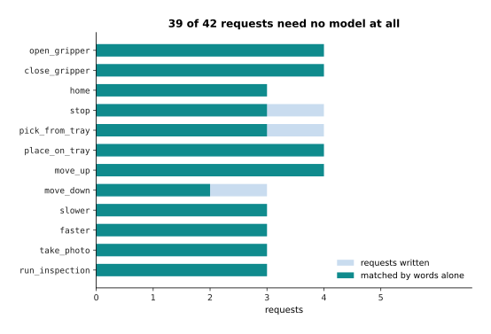

The word list gets 39 of the 42 requests right. That is the baseline the first page
of this chapter insisted on, and it reframes the whole job. The question is no
longer whether a model can do the job, but whether a model is worth paying for to
fix the remaining three. Those three are "freeze", which the list matched to
opening the gripper, "fetch me a part", which it matched to placing a part on the
tray, and "go down a little", which it also matched to opening the gripper. Every
one of them is a person saying a listed command in a different way, and that is
what a language model is reliably good at. So the answer is to put the twelve
commands into a prompt and ask a published model to pick one.

When the job is answering questions about facts rather than issuing commands, the
answer is **retrieval**. Retrieval means finding the relevant piece of text first
and putting it into the prompt, so that the model reads the fact there rather than
recalling it from training. One example for this job is not a training example at
all. It is a note, which is one line of text that somebody wrote down, and the
whole store here is 48 of them.

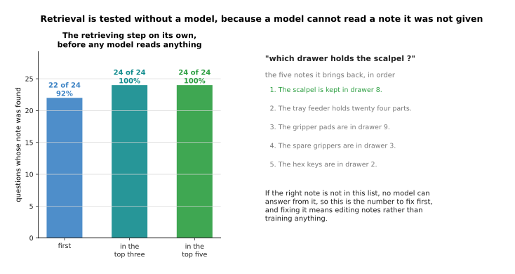

The first milestone is to test the finding on its own, before any model is
involved, because a model cannot answer from a note it was never handed. Here the
right note comes back first for 22 of the 24 questions, and in the top three for
all 24. The picture below shows what one question actually brings back.

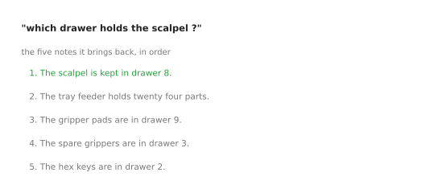

When the right note does not come back, the fix is to edit the notes rather than
to train anything. The cost of retrieval is tokens and time on every single
question, which [Large language
models](../10_language-and-multimodal-models/01_large-language-models.md#5-retrieval-keeping-the-knowledge-outside-the-weights)
sets out.

Only when a prompt and retrieval have both been tried does a fine-tune earn its
place. Then one training example is a pair of written strings.

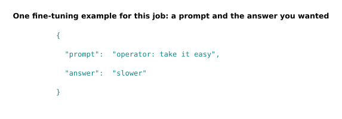

How many pairs you need is set by counting rather than guessing. There are 12
commands, and a person can say each of them about five different ways, so 60 pairs
is the floor. Every pair is a sentence somebody writes rather than a picture
somebody takes, so a day of writing gets you several hundred.

The starting point is a low-rank adapter rather than a full fine-tune. An adapter
is a small pair of matrices trained beside a frozen weight matrix, and its rank is
how thin that pair is.

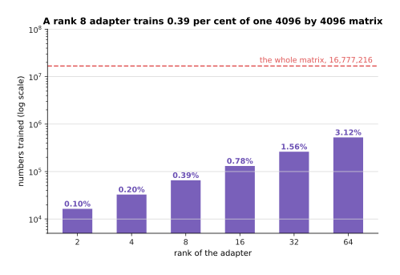

On a weight matrix of 4096 by 4096 numbers, a rank 8 adapter trains 65,536
numbers. That is 0.39 per cent of the matrix's 16,777,216 numbers. Even a rank 64
adapter trains only 3.12 per cent of it, so the whole family is cheap compared
with changing the matrix itself.

The one number to watch is the share of a written list of questions that the
system answers exactly right. The thing to watch about that number is how little
it means on a short list.

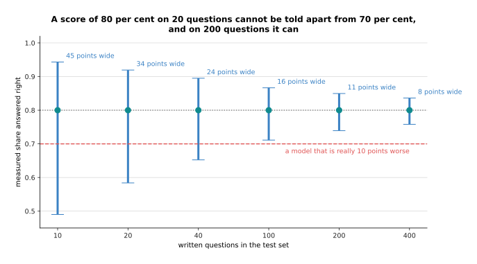

On 20 questions a score of 80 per cent carries an interval 34 points wide, running
from 58 to 92. A system that is really 10 points worse would fall comfortably
inside that interval, so the two cannot be told apart. On 200 questions the
interval is 11 points wide, and then they can. The mistake almost everybody makes
first is to begin with the fine-tune, and so never to write the forty questions
that would have shown the word list was already good enough.

---

## 6. A vision-language job: asking a question about a scene

The recipe before this one answered questions about written notes. This last one
answers questions about what the camera sees. A cell reaches for this family when
the question is about a state or a relation that no list of class names contains.
A **vision-language model** takes a picture and a question in ordinary words, and
it writes an answer in ordinary words.

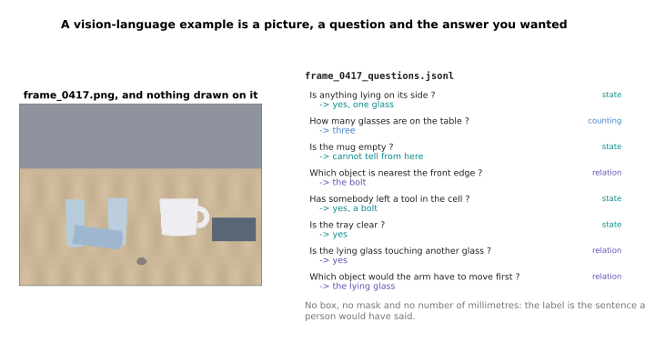

One example is a picture, a question and the answer you wanted. There is no box,
no mask and no measurement in millimetres anywhere in it. What is unusual here is
that the examples you write are almost always a test set rather than a training
set. The reason is that published models already answer this kind of question, so
what you do not know is whether they answer it correctly about your cell. The
number you need is therefore the number that makes a measurement, which section 5
put at a hundred or two. You write them by looking at your own frames and
answering the questions yourself. The eight questions above are split into the
ones about a state, the one about counting and the ones about a relation, because
those three kinds fail differently and one score averaged over them tells you
nothing.

What this family costs on a robot is time, and the picture is nearly all of that
time. A model that works on crops of 224 pixels cuts a wider picture into several
such crops, and it adds one shrunk copy of the whole picture so that nothing is
lost. Each crop of 224 pixels is divided into patches of 14 pixels, which gives
16 by 16 patches, and each patch becomes one token.

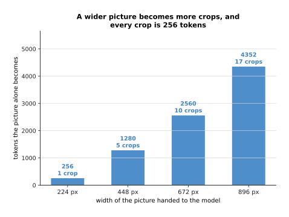

A 224 pixel picture is one crop and 256 tokens. A 672 pixel picture is nine crops
plus the whole-picture copy, so ten crops and 2,560 tokens, before the question is
even asked. An 896 pixel picture is seventeen crops and 4,352 tokens. The number
of crops grows with the square of the width, because doubling the width doubles
the number of crops across and doubles it down as well.

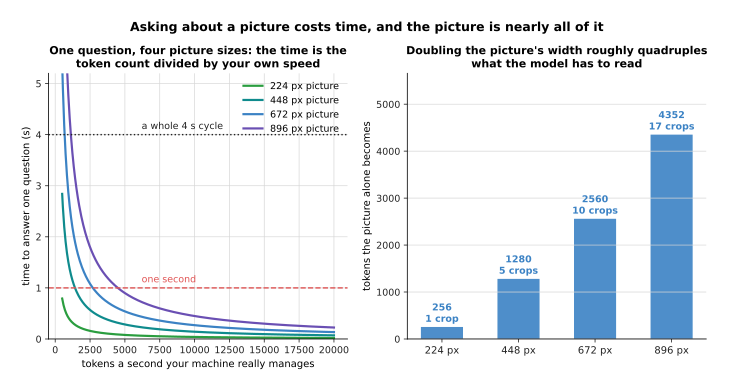

Add a twenty token question to the 672 pixel picture, and add a dozen tokens of
answer. The answer is written far more slowly than the prompt is read, at about a
tenth of the speed, so the work comes to about 2,700 tokens. At 4,000 tokens a
second that is 0.68 seconds, which is 17 per cent of a four second cycle. At 896
pixels the same sum gives 1.12 seconds, which is 28 per cent. You measure the
tokens a second on your own machine, and then the curves say what each picture
size costs you. [Vision-language
models](../10_language-and-multimodal-models/03_vision-language-models.md#5-resolution-why-one-small-square-is-not-enough)
explains why the crops are needed at all.

The starting point is a published vision-language model used through a prompt,
with no training at all. The first milestone is that it agrees with you on the
questions a person answers instantly. The one number to watch is that share of
agreement, measured separately for each kind of question.

The mistake almost everybody makes first is to let the model answer in free text
and then to score the text against an expected string.

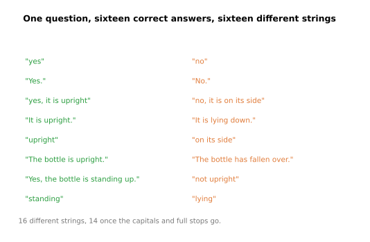

All sixteen answers above are correct, and all sixteen are different strings.
Fourteen of them are still different after the capitals and the full stops are
dropped. A scoring program that matches the string "yes" or "no" exactly counts
only four of them as right.

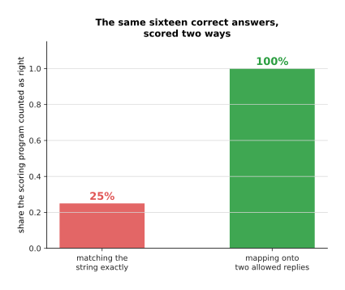

So exact string matching scores a working system at 25 per cent. Write the allowed
replies into the prompt instead, and map whatever comes back onto that short list.
The same sixteen answers then score 100 per cent, and the score finally measures
the model rather than its punctuation.

---

## 7. Where to read next

- [Recipes for models that act and
  predict](05_recipes-for-models-that-act-and-predict.md) is the next page and the
  other half of this one. It covers a generative model, a policy, a
  vision-language-action model, a world model and a reinforcement-learned policy,
  and it says honestly which of them one person with one arm should attempt.
- [When it does not work](06_when-it-does-not-work.md) is the page to turn to the
  first time one of these recipes gives a loss that will not fall, or a model that
  works on the training objects and nothing else.
- [Detection and
  segmentation](../09_models-that-see/02_detection-and-segmentation.md) explains
  what a box and a mask are inside, how overlap is worked out, and why a detector
  guesses many times. That is the machinery under sections 2 and 3.
- [Depth and the third dimension](../09_models-that-see/04_depth-and-3d.md) gives
  the stereo arithmetic, and the difference between relative depth and metric
  depth that section 4 leans on.
- [Object
  detection](../../07_learned-models/03_seeing-models/02_most-used/01_object-detection.md)
  is the catalogue of real detectors, with what each one costs and where each one
  fails. Turn to it when the recipe in section 2 has you choosing a starting
  point.
- [Vision-language
  models](../../07_learned-models/07_language-models/02_most-used/02_vision-language-models.md)
  is the matching catalogue for section 6, listing the models that take a picture
  and a question.

---

## 8. Using it in Python

Section 1 trained a head on features somebody else had already learned. Section 2
scored a guessed box against a true one. Section 6 counted the tokens a picture
becomes. This section does all three with real libraries, so that you can see that
each recipe is a few lines once the parts are named. The published weights are
deliberately not downloaded here, because the point is the shape of the code
rather than the quality of the model.

```python
import torch
from torch import nn
from torchvision.models import resnet18
from torchvision.ops import box_iou

# Section 1: a head on frozen features. In real work you pass the published
# weights instead of None, and everything below is unchanged.
backbone = resnet18(weights=None)
frozen = nn.Sequential(*list(backbone.children())[:-1])   # all but the old head
for p in frozen.parameters():
    p.requires_grad = False                               # the backbone is held still
head = nn.Linear(512, 6)                                  # section 1's six classes
print(sum(p.numel() for p in frozen.parameters()))        # 11176512 held still
print(sum(p.numel() for p in head.parameters()))          # 3078 trained
print(tuple(frozen(torch.zeros(2, 3, 224, 224)).shape))   # (2, 512, 1, 1)

# Section 2: the overlap of a guessed box with a true one, for a big object
# and a small one, with the same six pixels of error on every edge.
mug_true = torch.tensor([[370., 250., 501., 349.]])
mug_guess = mug_true + torch.tensor([[6., 6., -6., -6.]])
bolt_true = torch.tensor([[309., 406., 335., 426.]])
bolt_guess = bolt_true + torch.tensor([[6., 6., -6., -6.]])
print(round(box_iou(mug_true, mug_guess).item(), 4))      # 0.7983
print(round(box_iou(bolt_true, bolt_guess).item(), 4))    # 0.2154

# Section 6: what a 672 pixel picture costs before the question is asked.
tiles = (672 // 224) ** 2 + 1                             # nine crops plus a thumbnail
print(tiles, tiles * (224 // 14) ** 2)                    # 10 2560
```

The libraries give you every part these recipes name. `torchvision` holds the
backbones of section 1 and the box arithmetic of section 2. Hugging Face's
`transformers` holds the language and vision-language models of sections 5 and 6.
`peft` holds the low-rank adapter of section 5, and the rank you pass to it is the
number whose cost section 5 drew. What you decide is everything the library cannot
know: which rung to start on, how many examples to collect and in what conditions,
what the held-out set is, and which single number says the work succeeded.

The two overlaps printed above make the point about that last decision better than
any argument does. The same six pixels of error on every edge leave the mug at an
overlap of 0.7983, which is comfortably above the usual threshold of a half. The
same six pixels drop the bolt to 0.2154, which is comfortably below it. So one
threshold chosen for the whole dataset quietly decides that small objects do not
count. For that reason the one thing worth writing yourself is the scoring
program, since it is the only part that records what you actually wanted. Write it
first, run it against your baseline, and only then start training.
