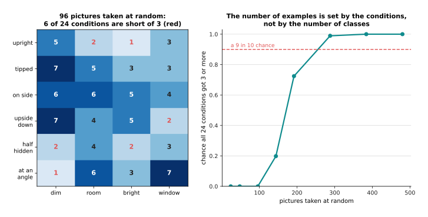
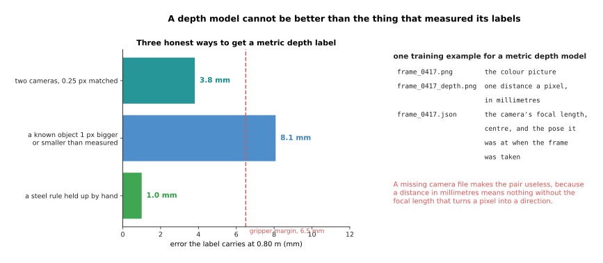
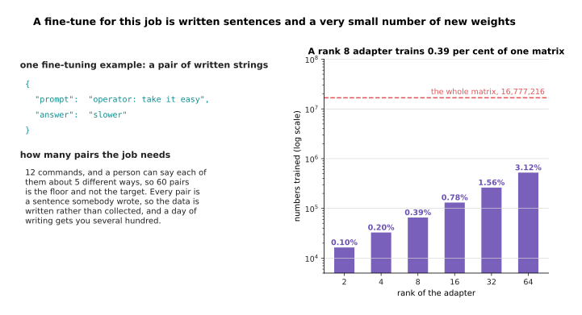

# Recipes for models that see and understand

The page before this one, [What to reuse and what to
train](03_what-to-reuse-and-what-to-train.md), set out the ladder of starting
points, from using somebody else's model as it is, up through a prompt, a head on
frozen features, an adapter and a full fine-tune, to training from nothing. That
page gave you the method for choosing a rung. This page applies the method one
family at a time, so that a reader who already knows which kind of model they want
can turn to the right recipe and start work this afternoon.

Each of the six recipes has the same six parts in the same order, so the page can
be used as a reference rather than read straight through. Each one says what one
training example actually is, down to the files and the words in them; roughly how
many examples you need, and the reasoning that sets that number rather than a
figure to copy; which kind of published starting point to begin from; the first
milestone that tells you it is working; the one number to watch; and the mistake
almost everybody makes first.

It assumes you have read the three pages before it, so that the job is already
written down as an input, an output and one number that says it worked, with a
baseline to beat and a held-out set decided on beforehand. It also assumes you
know what these families are, because [Models that
see](../09_models-that-see/01_vision-backbones.md) and [Language and multimodal
models](../10_language-and-multimodal-models/01_large-language-models.md) have
explained how each works inside, so a recipe that needs that machinery links back
to it.

Every number here was worked out by `docs/diagrams/starting_your_own_model_4.py`,
which prints each one so you can check it. Two pictures come from models really
trained in that script, a six-class classifier and a small depth model, and the
data they learn from is simulated, which means drawn from seeded random numbers
rather than photographed. No published model, dataset size or benchmark score
appears anywhere here, because a recipe built on a half-remembered figure is worse
than no recipe at all.

## Contents

1. [Naming a picture or a region: the classifier](#1-naming-a-picture-or-a-region-the-classifier)
2. [Finding a thing: the detector](#2-finding-a-thing-the-detector)
3. [Which pixels: the segmenter, and the cheaper way round it](#3-which-pixels-the-segmenter-and-the-cheaper-way-round-it)
4. [Depth and the third dimension: measure before you train](#4-depth-and-the-third-dimension-measure-before-you-train)
5. [A language model job: a prompt, retrieval, a fine-tune, or none of them](#5-a-language-model-job-a-prompt-retrieval-a-fine-tune-or-none-of-them)
6. [A vision-language job: asking a question about a scene](#6-a-vision-language-job-asking-a-question-about-a-scene)
7. [Where to read next](#7-where-to-read-next)
8. [Using it in Python](#8-using-it-in-python)

---

## 1. Naming a picture or a region: the classifier

The first recipe is the cheapest in the book, which is why it comes first, and it
is also the one people reach for when they should not. A **classifier** takes one
picture and gives back one name from a list you fixed in advance.


One training example is a picture file sitting in a folder named after its label, and the label is a single word for the whole picture.

One training example is one picture file and one word, and the word is usually the
name of the folder the file sits in. Nobody draws a box, traces an outline or
measures anything, which is why one person can take and sort a few hundred
pictures in an afternoon. The pictures above are simulated, but the folder layout
is the real one every library expects.

How many you need is not set by the number of classes, and this is the part people
get wrong. It is set by the number of **conditions** the object can be in, because
the model has to see each condition several times before it treats it as ordinary
rather than as a surprise.



If a thing can lie six ways under four lightings, 96 pictures taken at random leave 6 of the 24 conditions with fewer than three examples, and it takes about 288 pictures before there is a nine in ten chance that every condition is covered.

If the object can be upright, tipped, on its side, upside down, half hidden or at
an angle, and the light can be dim, room light, bright or daylight through a
window, there are 24 conditions and you want at least three examples of each.
Collecting pictures as they come, 96 of them leave 6 conditions short, and it
takes about 288 before the chance that all are covered reaches nine in ten. That
reasoning turns "a few hundred a class" from a guess into an answer, and it names
the cheaper alternative, which is to go round the conditions deliberately instead
of collecting at random.


On simulated pictures of six classes, a head trained on eight summary numbers scores 0.550 with two pictures a class and 0.854 with 128, while the same head on all 256 raw pixels starts at 0.291 and has only reached 0.631 by 256 a class.

That curve is a measurement rather than a claim. The script draws six classes of
simulated object, really trains a classifier by gradient descent and scores it on
720 held-out pictures it never saw, where guessing would score 0.167. The teal
line is a head on eight summary numbers, standing in for a head on a published
backbone's features, and the purple line is the same head on all 256 raw pixels,
standing in for starting from nothing. Reused features reach 0.761 with eight
pictures a class and most of their final score by about 32, while raw pixels are
still climbing at 256 and never catch up.

So the starting point is a published vision backbone with a new head on top,
trained with the backbone held still, as [Fine-tuning and
adapters](../07_pretraining-and-adapting/03_fine-tuning-and-adapters.md)
describes. The first milestone is the one from [The order of the
work](02_the-order-of-the-work.md): make the model memorise a single batch on
purpose, and only then run a small honest training. The one number to watch after
that is the accuracy of the worst class rather than the average, because an
average over six classes hides a class that is never right.


At 0.80 metres through a lens of 700 pixels one pixel is 1.143 millimetres, so the mug's middle sits 130 pixels or 148 millimetres from the middle of the picture, which is 23 times the 6.5 millimetres a gripper tolerates.

The mistake almost everybody makes first is to train a classifier when the arm
needs a place rather than a name. The whole answer here is the word "mug", so
reaching for the middle of the picture misses by 148 millimetres against a gripper
that tolerates about 6.5, and nothing in it says which of three glasses was meant,
whose middles are spread over 128 millimetres. A classifier is right when the
question really is about the whole picture, such as whether the cell is empty, and
wrong the moment the next step is a movement.

---

## 2. Finding a thing: the detector

When the answer has to be a place, the next family up is the detector, and
everything in this recipe follows from one fact, which is that its labels are
drawn by hand. A **detector** gives back a box round each object it finds, with a
name and a confidence for each box.


One training example is a picture file and a text file beside it holding one line for each object, and each line is a class name and four numbers written as fractions of the picture.

One training example is a picture and a list holding one line an object, and each
line is a name and four numbers: the middle of the box across, the middle down,
the width and the height, all as fractions of the picture so the line means the
same box at any size. What matters most is what a missing line says, because it is
not a gap but a statement that there is nothing there, so one lazily labelled
picture teaches the model to ignore that kind of object.


At six objects a picture, 300 pictures cost 6.0 hours of somebody drawing boxes if a box takes 12 seconds, and 2000 pictures cost 66.7 hours, which is 8.9 working days.

How many you need is best answered in hours, because that is what actually stops
people. This scene holds six objects, so 300 pictures are 1,800 boxes, which at 12
seconds a box is 6.0 hours. Two thousand pictures at 20 seconds a box is 66.7
hours, or 8.9 working days of one person doing nothing else. Measure your own
seconds a box on twenty pictures before promising anybody a dataset, because the
line through your own speed is the only honest estimate.


A class with 14 instances has a 20 per cent chance that a one-in-five held-out split leaves it with no more than one example there, and it takes 38 instances before there is a nine in ten chance of at least five held-out examples.

The count that matters is instances of each class, not pictures. In 300 pictures
the glasses give 900 instances and the mug 300, but a cracked cup appearing in 14
pictures gives 14, and splitting those one way in five leaves a 0.198 chance that
no more than one lands on the held-out side, so its held-out score is not a
measurement at all. It takes 38 instances before there is a nine in ten chance of
at least five held out, which makes 38 a floor you can defend.

The starting point is a published detector with its last layer replaced by one
naming your classes, fine-tuned on your pictures. The first milestone is that it
finds the objects in the very pictures it trained on, because a model that cannot
do that has a fault in the data loading or the label format rather than in its
size.


With every guessed box moved by the same six pixels on each edge, the mug scores 0.999 and the bolt 0.176, and the mean over the four classes is 0.792, which says nothing about the bolt.

The one number to watch is the average precision of the class you care about, at
the overlap you need, and never the mean over classes. Above, every guessed box is
moved by the same six pixels on each edge, and the mug, whose box is 113.9 pixels
across, still scores 0.999 while the bolt, whose box is 22.8 pixels across, scores
0.176, because those six pixels are a far larger share of a small box. The mean of
0.792 describes neither. Demanding a tighter overlap of 0.75 drops the glass to
0.439 with nothing about the detector changing, which is why [Detection and
segmentation](../09_models-that-see/02_detection-and-segmentation.md) insists that
a score means nothing until its threshold is quoted with it.

The mistake almost everybody makes first is to label the easy pictures. People
photograph the objects nicely spaced on a clean table, the model learns that, and
the first cluttered frame from the real cell defeats it. Label the awkward
pictures first, because they carry the information.

---

## 3. Which pixels: the segmenter, and the cheaper way round it

A box is enough to point a camera and not enough to close a gripper, which brings
us to the family that answers in pixels. A **segmenter** gives one number for
every pixel saying whether it belongs to the thing, and that grid of numbers is
called a mask.


Clicking four corners round a simulated part overlaps the true outline by 0.601, eight corners by 0.814 and 24 by 0.958, while the box that two clicks give overlaps it by only 0.628.

One training example is a picture and one mask an object, and a mask is made by a
person clicking round the outline. On a simulated part of 12,472 pixels, four
clicks give an overlap of 0.601 with the true outline, eight give 0.814, sixteen
give 0.924, and 24 are needed for 0.958. Two clicks give a box, which overlaps the
part by 0.628, so a careful outline is roughly twelve times the clicking of a box
for the same object.


Outlining 1,800 objects at 24 clicks each takes 21.0 hours, boxing the same objects takes 4.5, and checking the masks that a promptable model hands back takes 2.0 hours with no mask drawn at all.

That cost is why the right answer is so often not to train a segmenter at all. A
**promptable segmentation** model takes a point or a box and returns the pixels of
whatever is there, having been trained by somebody else on far more pictures than
you will ever label. Hand it the box your detector already produces and the 21.0
hours of outlining becomes 2.0 hours of looking at what came back. The honest cost
is that you run two models rather than one, the masks carry no class name so the
box has to come from somewhere, and you cannot improve the result by labelling
more, because you are not training it. For most arms that trade is worth taking,
and [Detection and
segmentation](../09_models-that-see/02_detection-and-segmentation.md#6-masks-and-models-that-take-a-prompt)
explains how such a model works inside.


Drawn on a 14 by 14 grid and stretched back, the mug's mask overlaps the true one by 0.922 overall and by only 0.752 on the handle, which is the part the fingers have to go round.

If you do train one, the starting point is a published segmentation model
fine-tuned on a few hundred masks, and the first milestone is that the narrow way
across the mask, turned into millimetres, agrees with a steel rule held across the
real object. The one number to watch is the overlap on the thin part rather than
overall, because the two differ sharply: on a 7 by 7 grid the mug's mask overlaps
the truth by 0.886 overall and 0.601 on the handle, and even on a 28 by 28 grid it
is 0.961 overall and 0.865 on the handle.


The box round the glass lying between two others holds 953 pixels, or 11.0 per cent of itself, that belong to the glasses either side, and the bar chart gives the share of each box that is really its object with the narrow way across its pixels under each name.

The mistake almost everybody makes first is to pay for pixels before checking
whether a box would do, and two quick tests settle it. The first is how much of
the box is really the object: the tray fills its box completely, the mug fills
0.798 of it and the bolt only 0.711, so a point taken from the middle of the
bolt's box lands on the table about three times in ten. The second is whether
objects of the same kind touch, since the box round the lying glass holds 953
pixels of its neighbours and a grasp worked out from it can close on the wrong
glass. If both tests come back clean, use a detector and keep the ten hours.

---

## 4. Depth and the third dimension: measure before you train

The last three recipes end in a place on a flat picture, and an arm needs a place
in the room, which is what this family supplies. The important thing about it is
that most depth problems are not model problems, so this recipe spends its first
half talking you out of training anything.


Half a degree of error in the camera-to-arm angle moves the point by 3.5 millimetres at 0.4 metres and 7.0 at 0.8, so at 0.8 metres the whole 6.5 millimetre gripper margin is used up by 0.466 of a degree.

Before anything else, find out what the camera-to-arm transform already costs.
**Calibration** here means measuring where the camera sits and which way it points
relative to the arm's base, and the arithmetic is one multiplication: the distance
to the object times the tangent of the angle error. Half a degree at 0.8 metres
moves the point 7.0 millimetres, already more than the 6.5 a gripper tolerates,
and a whole degree moves it 14.0. Out to about a metre that single angle
contributes more error than a stereo camera's own noise, so a day spent
calibrating buys more than a month spent training.



At 0.80 metres a stereo pair 60 millimetres apart matching to a quarter of a pixel puts 3.8 millimetres of error into every label, judging distance from a known object's size one pixel out puts in 8.1, and a steel rule puts in about 1.0.

If you do need a model, one training example is three files: the colour picture, a
second picture holding one distance in millimetres for every pixel, and a small
file giving the camera's focal length and centre and the pose it was at. The third
is the one people forget, and without it a distance in millimetres means nothing,
because there is no way to turn a pixel into a direction. Where those millimetres
came from sets the best the model can ever be, which is what the bars above
compare.


Going from 20 to 2000 training examples takes the error from 9.0 millimetres to 8.0 when the real object's height varies by 1 millimetre in 80, and a ruler that reads 5 millimetres long leaves the model 5.04 millimetres out however many examples it has.

How many examples you need has an unwelcome answer, which is that the count is
rarely what holds you back. The script really fits a small depth model on a
simulated cue and scores it against the clean truth on 6,000 held-out examples.
When the object's real height varies by 2 millimetres in 80, the error is 17.2
millimetres at 20 examples and 15.3 at 2000, so a hundredfold more data bought 1.9
millimetres. The second panel is worse, because a rule reading 5 millimetres long
leaves the model 5.04 millimetres out at 2000 examples and collecting more will
never show it, since the training data agrees with itself. Collect a hundred
examples, find the floor, and only then ask whether data is what you are short
of.


Four errors added in quadrature come to 8.97 millimetres against a 6.5 millimetre margin, and turning the camera angle error from half a degree into a fifth brings the total to 6.29, which passes.

The starting point is a stereo or pattern-projecting camera, or a published
relative-depth model pinned to two real distances, as [Depth and the third
dimension](../09_models-that-see/04_depth-and-3d.md#3-relative-depth-and-metric-depth)
explains. The first milestone is an error budget that passes, which means writing
every term down, squaring them, adding them and taking the root. Here the depth
reading contributes 4.00 millimetres, the camera angle 6.98, the camera offset
2.00 and the middle of the mask 3.43, giving 8.97 against a margin of 6.5, so the
grasp fails; the angle alone is 61 per cent of that squared total, and taking it
from half a degree to a fifth brings the total to 6.29, which passes. The one
number to watch is the error of the final grasp point against a rule, not the
model's own loss, and the mistake almost everybody makes first is to train a depth
model while that angle is still wrong and then blame the model.

---

## 5. A language model job: a prompt, retrieval, a fine-tune, or none of them

Those three recipes end in millimetres and this one ends in words, which makes it
the family where people most often build something far larger than the job needs.
The honest headline is that most robot language jobs need none of the three things
in this section's title.


Matching 42 written operator requests against 12 commands by shared rare words, with no model involved at all, gets 39 of them right, and the three it misses are "freeze", "fetch me a part" and "go down a little".

Start by writing the requests down and matching them against a list of words. The
script does that for a simulated cell with 12 commands and 42 written requests,
matching by counting the rare words a request and a command share, and it gets 39
of the 42 right with no model of any kind. That is the baseline the first page of
this chapter insisted on, and it reframes the job, because the question becomes
whether a model is worth it for the remaining three. Those three are all a person
saying a listed command a different way, which a language model is reliably good
at, so the answer is to put the twelve commands in a prompt and ask one to pick.


Searching 48 written notes about a cell for the right one, by shared rare words and with no model reading anything, puts the right note first for 22 of 24 questions and in the top three for all 24.

When the job is answering questions about facts rather than issuing commands, the
answer is **retrieval**, which means finding the relevant text and putting it into
the prompt so the model reads it there. One training example for this is not a
training example at all but a note, a line of text somebody wrote, and the whole
store here is 48 of them. The first milestone is to test the finding on its own,
before any model is involved, because a model cannot answer from a note it was
never handed. Here the right note comes back first for 22 of 24 questions and in
the top three for all 24, and when it does not, the fix is to edit notes. The
cost, as [Large language
models](../10_language-and-multimodal-models/01_large-language-models.md#5-retrieval-keeping-the-knowledge-outside-the-weights)
sets out, is tokens and time on every question.



One fine-tuning example is a pair of written strings, a prompt and the answer you wanted, and a rank 8 adapter on a 4096 by 4096 matrix trains 65,536 numbers, which is 0.39 per cent of it.

Only when a prompt and retrieval have both been tried does a fine-tune earn its
place, and then one training example is a pair of written strings. How many pairs
is set by counting: 12 commands and about five ways of saying each gives 60 as a
floor, and every pair is a sentence somebody writes rather than a picture somebody
takes, so a day of writing gets several hundred. The starting point is a low-rank
adapter rather than a full fine-tune, because on a 4096 by 4096 weight matrix a
rank 8 adapter trains 65,536 numbers against the matrix's 16,777,216, and even a
rank 64 adapter is only 3.12 per cent of it.


A score of 80 per cent measured on 20 questions carries an interval 34 points wide, which overlaps 70 per cent completely, while the same score on 200 questions carries an interval 11 points wide.

The one number to watch is the share of a written list of questions answered
exactly right, and the thing to watch about it is how little it means on a short
list. On 20 questions a score of 80 per cent carries an interval 34 points wide,
from 58 to 92, so it cannot be told apart from a system that is really 10 points
worse, while on 200 questions the interval is 11 points wide. The mistake almost
everybody makes first is to begin with the fine-tune and never write the forty
questions that would have shown the word list was already good enough.

---

## 6. A vision-language job: asking a question about a scene

The recipe before this one answered questions about written notes, and the last
one answers questions about what the camera sees, which is the family a cell
reaches for when the question is about a state or a relation no class list
contains. A **vision-language model** takes a picture and a question in ordinary
words and writes an answer in ordinary words.


One example is a picture, a question and the answer you wanted, with no box, no mask and no millimetres anywhere in it.

One example is a picture, a question and an answer. What is unusual here is that
the examples you write are almost always a test set rather than a training set,
because published models already answer this kind of question and what you do not
know is whether they answer it correctly about your cell. So the number you need
is the number that makes a measurement, which the section above put at a hundred
or two, and you write them by looking at your own frames and answering them
yourself. The questions above are split into the ones about a state, the one about
counting and the ones about a relation, because those three kinds fail differently
and one score averaged over them tells you nothing.


A 672 pixel picture is cut into nine crops of 224 pixels plus one whole-picture copy, which is 2,560 tokens before the question is even asked, and doubling the width roughly quadruples that.

What it costs on a robot is time, and the picture is nearly all of it. A model
working on crops of 224 pixels cuts a 672 pixel picture into nine crops plus one
shrunk copy of the whole thing, and each crop becomes 256 tokens, so the picture
alone is 2,560. Add a twenty token question and a dozen tokens of answer written
far more slowly than the prompt is read, and the work is about 2,700 tokens, which
at 4,000 tokens a second is 0.68 seconds, or 17 per cent of a four second cycle;
at 896 pixels it is 1.12 seconds, or 28 per cent. You measure the tokens a second
on your own machine and the curve says what each picture size costs, while
[Vision-language
models](../10_language-and-multimodal-models/03_vision-language-models.md#5-resolution-why-one-small-square-is-not-enough)
explains why the crops are needed at all.


Sixteen correct answers to "is the bottle upright?" are sixteen different strings, and a scoring program that matches the string "yes" or "no" exactly counts only 4 of them as right.

The starting point is a published vision-language model used through a prompt with
no training at all, and the first milestone is that it agrees with you on the
questions a person answers instantly. The one number to watch is that share of
agreement, measured separately for each kind of question. The mistake almost
everybody makes first is to let the model answer in free text and then score the
text, which is what the picture above is about: sixteen answers that are all
correct are sixteen different strings, still fourteen after the capitals and full
stops are dropped, and a program matching "yes" or "no" exactly counts four of
them right and scores a working system at 25 per cent. Write the allowed replies
into the prompt, map whatever comes back onto that short list, and the same
sixteen answers score 100.

---

## 7. Where to read next

- [Recipes for models that act and
  predict](05_recipes-for-models-that-act-and-predict.md) is the next page and the
  other half of this one, covering a generative model, a policy, a
  vision-language-action model, a world model and a reinforcement-learned policy,
  with the honest warning about which of them one person with one arm should
  attempt.
- [When it does not work](06_when-it-does-not-work.md) is the page to turn to the
  first time one of these recipes gives a loss that will not fall or a model that
  works on the training objects and nothing else.
- [Detection and
  segmentation](../09_models-that-see/02_detection-and-segmentation.md) explains
  what a box and a mask are inside, how overlap is worked out and why a detector
  guesses many times, which is the machinery under sections 2 and 3.
- [Depth and the third dimension](../09_models-that-see/04_depth-and-3d.md) gives
  the stereo arithmetic and the difference between relative and metric depth that
  section 4 leans on.
- [Object
  detection](../../07_learned-models/03_seeing-models/02_most-used/01_object-detection.md)
  is the catalogue of real detectors, with what each costs and where each fails,
  for when the recipe in section 2 has you choosing a starting point.
- [Vision-language
  models](../../07_learned-models/07_language-models/02_most-used/02_vision-language-models.md)
  is the matching catalogue for section 6, listing the models that take a picture
  and a question.

---

## 8. Using it in Python

Section 1 trained a head on features somebody else had already learned, section 2
scored a guessed box against a true one, and section 6 counted the tokens a
picture becomes. This section does all three with real libraries, so you can see
that each recipe is a few lines once the parts are named. The published weights
are deliberately not downloaded here, because the point is the shape of the code
rather than the quality of the model.

```python
import torch
from torch import nn
from torchvision.models import resnet18
from torchvision.ops import box_iou

# Section 1: a head on frozen features. In real work you pass the published
# weights instead of None, and everything below is unchanged.
backbone = resnet18(weights=None)
frozen = nn.Sequential(*list(backbone.children())[:-1])   # all but the old head
for p in frozen.parameters():
    p.requires_grad = False                               # the backbone is held still
head = nn.Linear(512, 6)                                  # section 1's six classes
print(sum(p.numel() for p in frozen.parameters()))        # 11176512 held still
print(sum(p.numel() for p in head.parameters()))          # 3078 trained
print(tuple(frozen(torch.zeros(2, 3, 224, 224)).shape))   # (2, 512, 1, 1)

# Section 2: the overlap of a guessed box with a true one, for a big object
# and a small one, with the same six pixels of error on every edge.
mug_true = torch.tensor([[370., 250., 501., 349.]])
mug_guess = mug_true + torch.tensor([[6., 6., -6., -6.]])
bolt_true = torch.tensor([[309., 406., 335., 426.]])
bolt_guess = bolt_true + torch.tensor([[6., 6., -6., -6.]])
print(round(box_iou(mug_true, mug_guess).item(), 4))      # 0.7983
print(round(box_iou(bolt_true, bolt_guess).item(), 4))    # 0.3684

# Section 6: what a 672 pixel picture costs before the question is asked.
tiles = (672 // 224) ** 2 + 1                             # nine crops plus a thumbnail
print(tiles, tiles * (224 // 14) ** 2)                    # 10 2560
```

The libraries give you every part these recipes name. `torchvision` holds the
backbones of section 1 and the box arithmetic of section 2, Hugging Face's
`transformers` holds the language and vision-language models of sections 5 and 6,
and `peft` holds the low-rank adapter of section 5, where the rank you pass is the
number whose cost that section drew. What you decide is everything the library
cannot know: which rung to start on, how many examples to collect and in what
conditions, what the held-out set is, and which single number says it works.

The two overlaps printed above make the point about that last decision better than
any argument, because the same six pixels of error leave the mug at 0.7983,
comfortably above the usual half, and drop the bolt to 0.3684, comfortably below
it, so one threshold chosen for the whole dataset quietly decides that small
objects do not count. The one thing worth writing yourself is the scoring program,
since it is the only part that records what you actually wanted. Write it first,
run it against your baseline, and only then start training.
