# Recipes for the models that act and predict

[Recipes for the models that see and understand](04_recipes-for-models-that-see-and-understand.md),
the page before this one, gave a starting recipe for each family of model that
looks at the world and says what is in it. This page does the same job for the
other half, which is the models that move the arm or predict what happens to it,
and it keeps the same shape so that the two pages read as one reference.

One thing changes, and it changes nearly every number here. A picture of a mug
can be downloaded and labelled by somebody who has never seen a robot, while a
recording of an arm doing a job can only be made by a person driving that arm in
real time, so every example below is expensive in a way that nothing on the
previous page was.

Each recipe answers the same six questions. What is one training example, as a
thing on disk? Roughly how many do you need, and what reasoning sets that number?
Which published starting point do you begin from? What is the first milestone?
What is the one number to watch? And what is the mistake almost everybody makes
first?

The page assumes you have read
[models that act](../12_models-that-act/01_behaviour-cloning-and-action-chunks.md)
and the three pages after it, so that a policy, an action chunk and a world model
are familiar, and that you have worked through
[before you train anything](01_before-you-train-anything.md) and
[what to reuse and what to train](03_what-to-reuse-and-what-to-train.md). Three
warnings run through it, because each costs weeks: the action space has to be
written down before any data is collected, two people's demonstrations are not
interchangeable, and a simulator is a project in itself. Section 6 ends by saying
which of the six families a person with one arm and a few weeks should attempt.

Every number in the pictures is worked out and printed by
[`docs/diagrams/starting_your_own_model_5.py`](../../diagrams/starting_your_own_model_5.py).
The table, the gripper, the box in its way and the person demonstrating are
simulated, but everything done to them is real: the policies are networks trained
by Adam in NumPy, the generating policy is a real diffusion model over action
chunks, the dynamics model is a real one-step predictor, and the searched policy
comes from a real search against a reward.

## Contents

1. [A policy that copies a person](#1-a-policy-that-copies-a-person)
2. [A policy that writes a chunk of actions](#2-a-policy-that-writes-a-chunk-of-actions)
3. [A policy that generates its answer](#3-a-policy-that-generates-its-answer)
4. [A model that is told the job in words](#4-a-model-that-is-told-the-job-in-words)
5. [A model that predicts what happens next](#5-a-model-that-predicts-what-happens-next)
6. [A policy found by trying](#6-a-policy-found-by-trying)
7. [Where to read next](#7-where-to-read-next)
8. [Using it in Python](#8-using-it-in-python)

---

## 1. A policy that copies a person

The introduction said every example here is made by a person in real time, and
this recipe is where that is most directly true, because behaviour cloning is
supervised learning on moments a person produced. The method is explained on
[behaviour cloning and action chunks](../12_models-that-act/01_behaviour-cloning-and-action-chunks.md),
so this section only covers starting one.

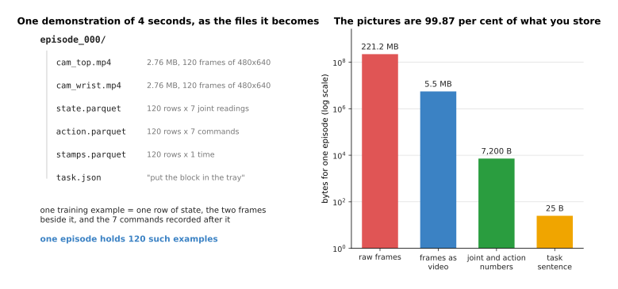

One four-second episode recorded 30 times a second holds 120 moments, and storing
it costs 5.54 megabytes, of which the two camera videos are 99.87 per cent.

One training example is one row of the state table, the two camera frames beside
it, and the block of commands recorded after it, so one episode gives 120
examples. The raw frames would be 221.18 megabytes, and writing them as video at
forty to one is the only reason a thousand episodes fits on a laptop. The joint
and action numbers come to 7,200 bytes, so almost everything the model reads is
picture. What governs the recipe, though, is not bytes but minutes.

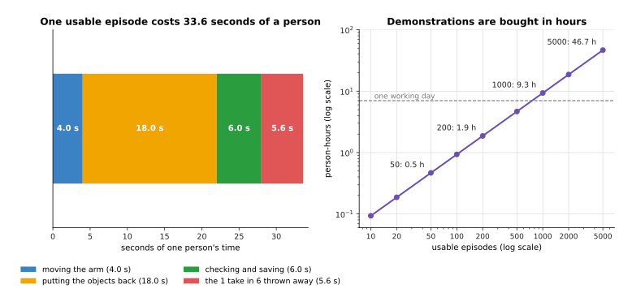

Taking four seconds of movement, eighteen seconds to put the objects back, six
seconds to check and save, and throwing one take in six away, one usable episode
costs 33.6 seconds of a person, so fifty cost 28 minutes and five thousand cost
46.7 hours.

How many you need is set by how much the job varies, which is best seen by
measuring the same task twice with one more thing moving about. In the simulated
reach below a gripper must get to a goal somewhere on a patch of table without
touching a box in the way, and a run works only if it ends within 1.5 centimetres
of the goal and never touches the box.

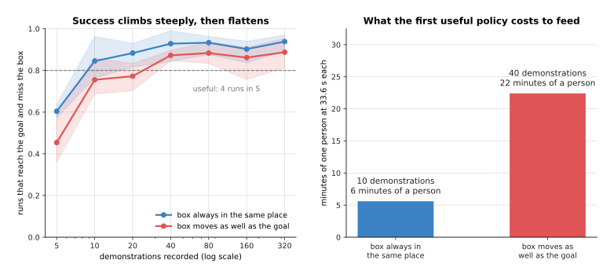

With the box always in the same place the policy works on four runs in five by 10
demonstrations, and with the box moving as well it takes 40, which is four times
as many for one extra thing varying.

Both curves climb steeply and then flatten, from 0.604 to 0.938 in the first case
and from 0.454 to 0.887 in the second, so once a policy is stuck at four runs in
five, recording another two hundred episodes of the same thing is the wrong move.
Count instead what has to be covered before you start, which is every way the
object can lie times every lighting condition times every starting pose with a
few examples of each, and for six orientations and four lighting conditions that
is a few hundred episodes rather than a few dozen. This simulated task needs tens
only because the policy reads six clean numbers instead of two camera pictures.

The starting point is a library rather than a model, since there is no useful
pretrained plain cloning policy to download.
[LeRobot](https://github.com/huggingface/lerobot) records demonstrations in a
fixed format, trains policies on them and runs them, while
[robomimic](https://github.com/ARISE-Initiative/robomimic) has plain behaviour
cloning already built, camera encoder included. The first milestone is the one
from [the order of the work](02_the-order-of-the-work.md), which is to drive the
training loss on a single batch to nearly zero, and the one number to watch
afterwards is the share of whole runs on the arm that finish the job, because the
loss falls while the drift measured in
[why copying one step at a time drifts](../12_models-that-act/01_behaviour-cloning-and-action-chunks.md#3-why-copying-one-step-at-a-time-drifts)
quietly gets worse.

The first warning belongs here, because it destroys work already done. The action
space is the list of numbers a command is made of, with what they mean and how
they are scaled, and it must be written down before the first episode.

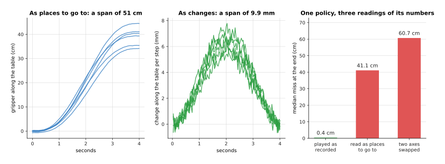

The same recordings span 50.74 centimetres written as places to go to and 9.89
millimetres written as changes per step, and a policy trained on one and read as
the other ends 41.12 centimetres from the goal instead of 0.38.

Those three bars are one trained policy on one arm. Played as trained it misses
by 0.38 centimetres, read as places rather than changes it misses by 41.12, and
with its two axes swapped, which is what happens when the order of the joints in
the recording is not the order the runner sends, it misses by 60.70. No amount of
extra data fixes any of that, because the recordings and the runner disagree
about what a number means, so write the joint order, the units, place or change,
the rate and the scaling numbers into a file and save it beside the weights.

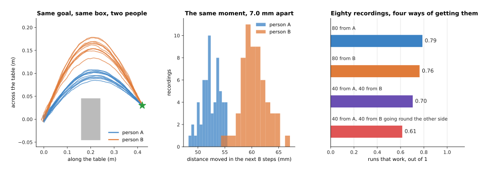

At the same moment of the same job one person's recordings differ from each other
by 1.68 millimetres while the two people differ by 7.01, and eighty recordings
from one person train a better policy than forty from each.

The training asks for one answer close to every label, so where two people
answered differently it gives the average, and on the mixed set the best possible
single answer is wrong by 6.47 times as much, squared. Here the cost is small,
because both people pass the box on the same side and the average of two safe
paths is still safe, so success only falls from 0.788 to 0.704; when they pass on
opposite sides it falls to 0.614, because then the average goes through the box.
One person on two days counts as two people, since a handle set up differently
shows up in the labels the same way. The mistake almost everybody makes first is
to judge the policy by its loss, which is driven down on moments a person
visited while the arm visits moments nobody did.

---

## 2. A policy that writes a chunk of actions

Section 1 ended with a policy judged by whole runs, and the cheapest way to
improve those runs is to stop asking for one command at a time. A chunk is a
block of future commands worked out in one go, and
[playing a chunk of the future instead of one step](../12_models-that-act/01_behaviour-cloning-and-action-chunks.md#4-playing-a-chunk-of-the-future-instead-of-one-step)
measures why it helps, which is that the error feeds itself once per decision.

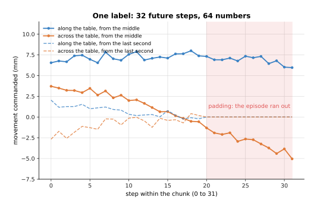

One episode still gives 120 examples, but with a chunk of 32 steps each label is
64 numbers instead of two, so the episode carries 7,680 label numbers rather than
240.

The pictures, the recordings and the number of examples are unchanged, which is
the best thing about this recipe, and only the label grows. The last 31 examples
of every episode run past its end, which is 25.8 per cent of them, and those
labels are padded by repeating the final command, so an episode that ends with
the gripper already closed teaches the policy to keep doing nothing, while an
episode truncated mid-job teaches it to stop half way. How long the chunk should
be is decided twice, and the first answer comes from the clock.

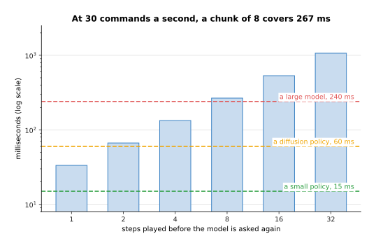

At 30 commands a second the arm wants one every 33.33 milliseconds, so a model
taking 240 milliseconds to answer needs at least 8 steps a chunk, which buys
266.7 milliseconds of movement and leaves 26.7 to spare.

Read that table from the right and it sets a floor: time one pass of your model,
divide by the command period, and that is the shortest chunk you are allowed,
because a shorter one leaves the arm without commands and it stops mid-movement.
The second answer comes from the task, and it is a trade.

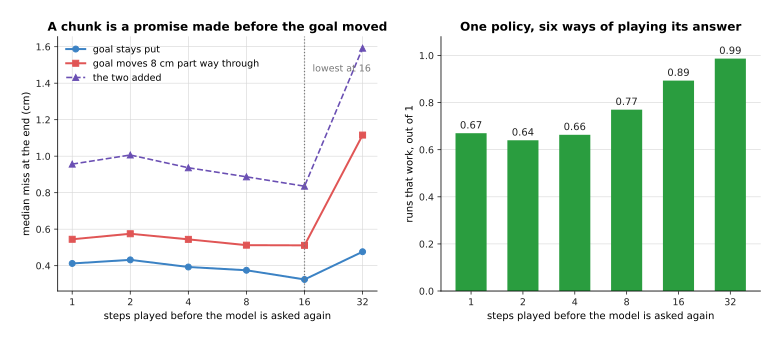

Playing more of each chunk raises the share of runs that work from 0.67 at one
step a decision to 0.99 at thirty-two, while the miss after the goal moves part
way through rises from 0.48 to 0.61 centimetres.

The long chunk wins easily here, and the cost of the promise only shows at the
far end where the arm carries on for more than a second before looking again. On
a task where things move while the arm works that cost arrives much sooner, which
is why the usual arrangement is to work out a long chunk and play only its front,
as
[receding horizon](../12_models-that-act/02_diffusion-and-flow-policies.md#5-receding-horizon-generating-while-the-arm-is-still-moving)
describes.

The starting point is the action-chunking transformer packaged in LeRobot, which
reads the recordings LeRobot already made. The first milestone is the single
batch again, followed by one whole run of the job on the arm however ugly, and
the one number to watch is the share of runs that work at the chunk length you
intend to ship, since success at one length says nothing about another. The
mistake almost everybody makes first is to take a chunk length from a paper and
run it at a different command rate, because the floor is set by your clock and
your model and nobody else's.

---

## 3. A policy that generates its answer

Sections 1 and 2 both trained a policy to give one answer, and this section is
about when that is the wrong thing to ask for. A diffusion or flow policy builds
its answer out of noise instead of reading it off, which lets it produce one of
several good movements rather than their average, and
[diffusion and flow policies](../12_models-that-act/02_diffusion-and-flow-policies.md)
explains the machinery. One question decides whether you need one, and you can
answer it on recordings you already have.

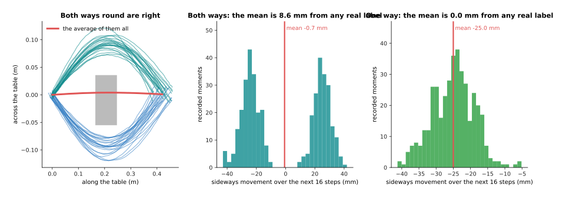

Where the demonstrator went both ways round the box, the average of the labels
lies 41.0 millimetres from the nearest label anybody recorded, and where only one
way was ever recorded it lies 0.0 millimetres from one.

That distance is the whole test, because when it is near zero the average is
itself a reasonable answer and a plain policy is fine, while when it is several
times the spread within one group the average is a movement nobody would make and
a plain policy makes it anyway.

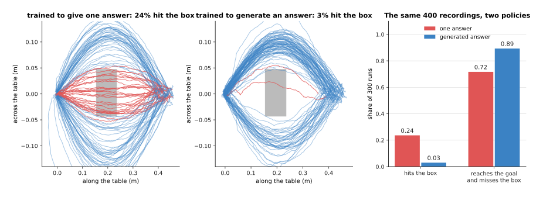

Trained on the same 400 recordings, the policy that gives one answer drives
through the box on 0.24 of its runs and finishes the job on 0.72, while the
policy that generates one drives through on 0.03 and finishes on 0.89.

One training example is exactly what it was in section 2, so a generating policy
can be fitted to recordings you already hold. How many you need hardly changes
either, because the policy is still copying, except that both answers must appear
often enough to be learned, so a job with two ways of doing it wants roughly
twice the demonstrations of a job with one. What it costs is passes through the
network.

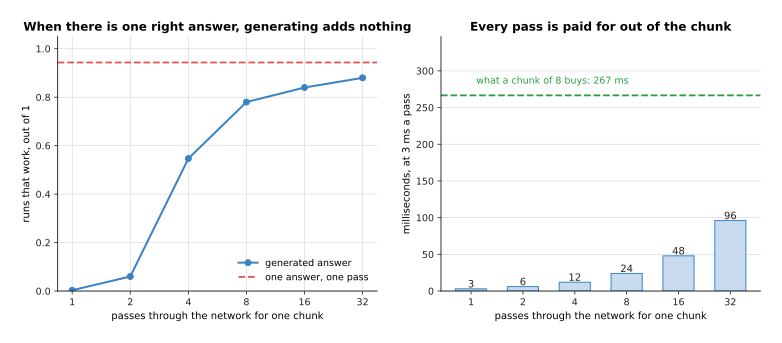

On the same task recorded with one right answer, the generating policy needs
sixteen passes to match what the plain policy does in one, and at three
milliseconds a pass those sixteen eat 48 of the 267 milliseconds a chunk of eight
buys.

The starting point is the diffusion policy packaged in LeRobot, which trains on
the same dataset as the action-chunking transformer, so swapping between them is
a configuration change. The first milestone is a picture rather than a run:
generate twenty chunks at one observation, draw them, and check that they fall
into the groups the demonstrations fall into instead of one blurred lump. The one
number to watch is the share of runs that fail the way the averaging failed,
which here is the share that hit the box.

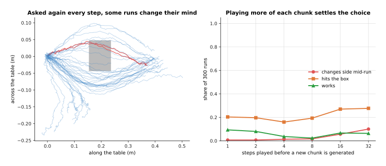

Asked for a new chunk at every step the policy changes which side of the box it
is passing on 0.15 of its runs, and playing eight steps of each chunk before
asking again brings that down to 0.05.

That is the mistake almost everybody makes first, because generating a fresh
chunk every step sounds safer and is not. A policy that gives one answer gives
the same answer twice, while a policy that samples can sample the other answer
next time, and a movement that starts round one side of a box and switches goes
through it.

---

## 4. A model that is told the job in words

The three policies so far each do one job, and this section covers the model that
takes a sentence as well as a picture so that one model can do several.
[Vision-language-action models](../12_models-that-act/03_vision-language-action-models.md)
explains what is inside one, and the question here is what fine-tuning one
involves and whether it is a sensible first project. Start with what must fit in
the graphics card, since that decides more first projects than anything else.

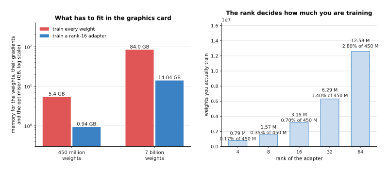

Training every weight of a 450-million-weight model needs 5.40 gigabytes and
training a rank-16 adapter on it needs 0.94, while the same two numbers for a
7-billion-weight model are 84.00 and 14.04 gigabytes.

A trained weight costs memory for itself, its gradient and the optimiser's two
running averages, which is twelve bytes if the weights are kept in two, while a
frozen weight costs only its two. An adapter, explained on
[fine-tuning and adapters](../07_pretraining-and-adapting/03_fine-tuning-and-adapters.md),
replaces each big square matrix with two thin ones, so a rank-16 adapter on a
1,024-wide matrix trains 32,768 weights instead of 1,048,576, and across 24
blocks of four such matrices that is 3,145,728 weights, or 0.70 per cent of the
small model. So a small model can be adapted on an ordinary graphics card while a
seven-billion-weight one cannot be fully trained on anything you are likely to
own. One training example is a section 2 example with a sentence attached, and
the sentence is where first attempts are wasted.

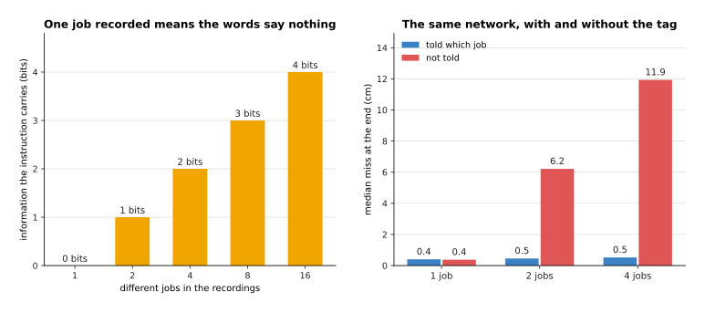

With one job in the recordings the instruction carries no information at all and
the same network does as well without it, while with four jobs the model told
which job misses by 0.5 centimetres and the model not told misses by 11.9.

Those two bars are the same network on the same recordings, differing only in
whether the job was part of the input, and the untold one fails because it is
averaging four jobs. The reasoning that sets how many demonstrations you need
follows: the model must learn every job, so the recordings must cover every job.

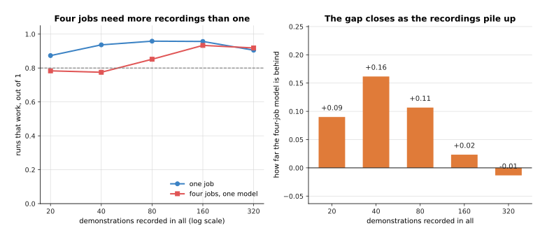

At the same total number of recordings the four-job model trails the one-job
model, and the gap closes as the pile of recordings grows.

The starting points are real and downloadable and differ mostly in what they
demand of your hardware. [SmolVLA](https://huggingface.co/blog/smolvla) has 450
million parameters and runs on an ordinary computer, which makes it the usual
first choice with a small arm;
[OpenVLA](https://huggingface.co/openvla/openvla-7b) has 7 billion parameters and
an MIT licence; the π0 models and NVIDIA's GR00T need an NVIDIA graphics card.
The first milestone is unusual and worth insisting on, which is to run the
downloaded model on your own arm before any training, because a starting point
that already half works is a different project from one that does not. The one
number to watch while fine-tuning is the success rate per job rather than the
average, since an average hides a job that has collapsed.

So is it a sensible first project? Only if you really need one model to do
several jobs chosen by a sentence, because for one job a chunk policy from
section 2 is smaller, faster, trains on less and is far easier to debug. The
mistake almost everybody makes first is to reach for the biggest model because it
generalises, and then to find that it generalises in the ways measured in
[what generalisation really looks like](../12_models-that-act/03_vision-language-action-models.md#7-what-generalisation-really-looks-like-and-what-it-costs-to-run)
rather than the way they needed.

---

## 5. A model that predicts what happens next

Every model so far answers what to do, and this one answers what will happen,
which is a different job with a different kind of data.
[World models](../12_models-that-act/04_world-models.md) explains the family. One
training example is a state, the command sent at that moment, and the state one
step later, which means a script can produce them by pushing the arm around
inside safe limits with nobody in the room.

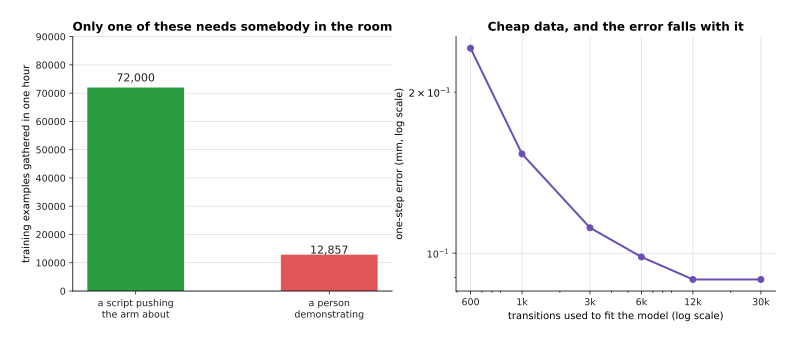

A script pushing the arm about for twenty seconds and resetting for ten gathers
72,000 transitions an hour against the 12,857 examples an hour a person
demonstrating produces, and the one-step error falls from 0.242 to 0.089
millimetres as the transitions go from 600 to 12,000.

That right-hand curve answers how many you need, and it is the friendliest answer
on this page, because 12,000 transitions is about ten minutes of pushing and more
buys nothing. The data is cheap for a reason worth stating, which is that
predicting what happens next needs no judgement about what should happen, so
nobody has to supply any. What you must measure before trusting the model is how
far ahead it may be believed.

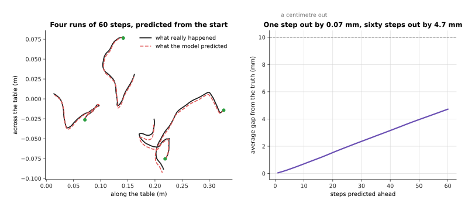

One step ahead the model is out by 0.07 millimetres, sixty steps ahead it is out
by 4.7, and it passes a millimetre of error at step 14, which is 0.47 seconds.

Each step is fed the model's own answer from the step before, so a small bias
piles up exactly as
[error that piles up over a rollout](../12_models-that-act/04_world-models.md#3-error-that-piles-up-over-a-rollout)
measures on another system, and the habit to build is to find your own crossing
point and plan no further ahead than that. Within that limit, here is when
predicting ahead earns its keep, stated honestly: not because the predictions
beat a demonstration, which they do not, but because a model of what happens lets
you write a new job as a cost and solve it without recording anything.

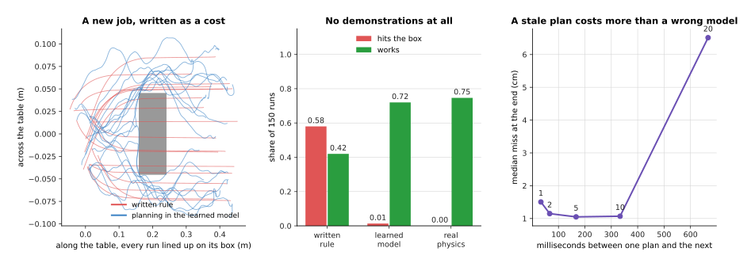

A plain written rule reaches the goal to within 0.07 centimetres and drives
through the box on 0.58 of its runs, while a planner searching inside the learned
model hits the box on 0.01 and finishes the job on 0.72, with no demonstrations
recorded for either.

The model there was fitted to random pushing with no goal, no box and no person,
and the box was introduced afterwards as a penalty in the cost the planner scores
futures against, so the job changed without the data changing. The right-hand
curve carries the other half of the method, which is that the plan is remade
constantly, since remaking it every five steps leaves the arm 1.05 centimetres
from the goal while remaking it every twenty leaves 6.51. What limits all of this
is arithmetic worth doing before you start.

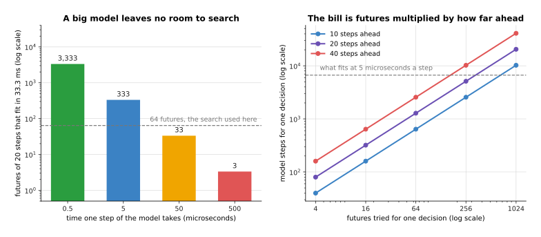

Between two commands at 30 a second there is room for 3,333 futures of twenty
steps if one model step costs half a microsecond, and room for 3 if it costs five
hundred.

Every step of every candidate future is one call of the model, so one decision
with 64 futures of 20 steps is 1,280 calls, which is why the models planned
against on arms predict a few dozen numbers rather than pictures. The starting
points are designs rather than downloads, because a model of your arm can only be
fitted to your arm, and TD-MPC2 and the Dreamer family are the two to copy, with
DayDreamer showing the approach running on real robots without a simulator. The
first milestone is the one-step error on held-out transitions, the one number to
watch after that is the horizon at which the rollout error crosses your
tolerance, and the mistake almost everybody makes first is to judge the model by
its one-step error alone, which looks superb and says nothing about the rollout.

---

## 6. A policy found by trying

The five recipes so far learn from something somebody provided, and this one
learns from its own attempts scored by a reward, which is
[reinforcement learning](../11_learning-from-outcomes/01_reinforcement-learning.md).
One training example is not a thing you collect but an episode the policy itself
produced together with the reward it earned, so the data does not exist until the
policy does and is thrown away as the policy changes. The question is therefore
not how many examples you need but how many attempts.

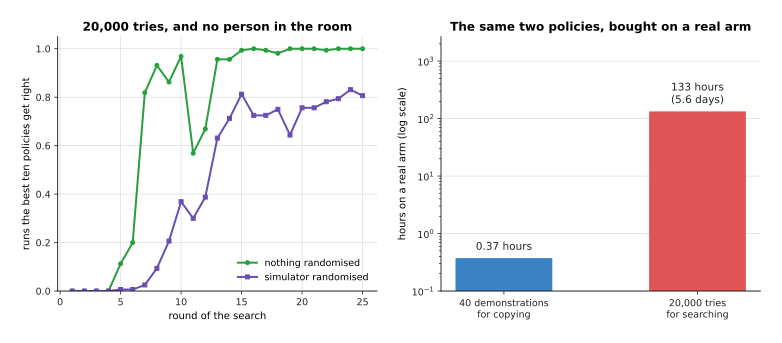

The search here took 20,000 episodes to go from working on none of its runs to
working on all of them, which on a real arm at four seconds a try and twenty
seconds to reset would be 133 hours, or 5.6 days of continuous running, against
the 22 minutes of a person that forty demonstrations cost.

That comparison is the third warning, and it is why this recipe starts with a
sentence nobody wants to hear. Choosing reinforcement learning means building a
simulator first, and a simulator is a project in itself: a model of the arm, a
model of the objects, contact that behaves, a camera view if the policy uses
pictures, a reset that puts everything back, and a reward that cannot be earned
the wrong way. MuJoCo, PyBullet and Isaac give you the physics and
Stable-Baselines3 gives you PPO and SAC already written, so what is left to you
is exactly the part specific to your cell, which is also the part that decides
whether any of it transfers.

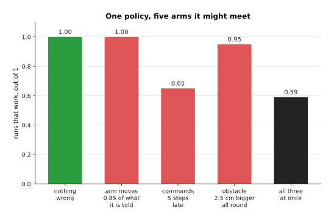

A policy that works on every run in its own simulator still works on every run
when the arm moves only 0.85 of what it is told, drops to 0.65 when commands
arrive five steps late, and drops to 0.59 when three things are wrong at once.

The two curves on the right show what is done about that. The policy searched in
one simulator survives a delay of four steps and collapses to nothing by six,
while the policy searched in many, with the gain, the obstacle size and the
reported goal drawn fresh for every task, works at every delay tested. That is
domain randomisation, described in
[why this happens in a simulator](../11_learning-from-outcomes/01_reinforcement-learning.md#6-why-this-happens-in-a-simulator-and-what-the-crossing-costs),
and its cost is visible in the learning curve above, where the randomised search
needs many more rounds to reach a worse score in its own simulator.

This is nonetheless the right call when the job cannot be demonstrated because it
needs force or speed a person cannot produce through a handle, when the outcome
can be scored by a program as
[rewards, preferences and verifiers](../11_learning-from-outcomes/02_rewards-preferences-and-verifiers.md)
sets out, and when what is being learned is contact a simulator can represent.
The mistake almost everybody makes first is to start the simulator and the policy
in the same week.

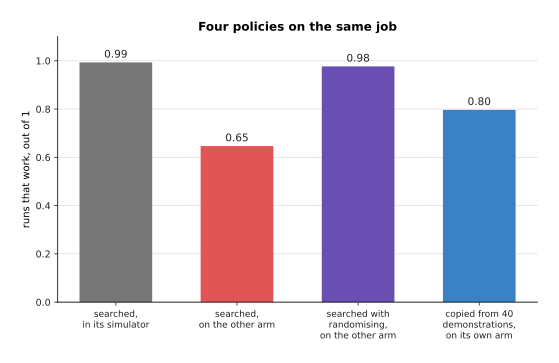

The searched policy works on 0.99 of runs in its own simulator and 0.65 on a
different arm, randomising brings that back to 0.98, and the policy cloned from
forty demonstrations works on 0.80 of runs on the arm its recordings came from.

Reading that chart beside the hours gives the answer for a person with one arm
and a few weeks. Attempt the chunk policy of section 2 first, because it is the
smallest thing that works and the others are variations on it. Attempt the
generating policy of section 3 only if the test in that section says your task
has more than one right answer. Attempt the world model of section 5 if you want
a planner rather than a policy, since its data is the only cheap data here. Do
not attempt a vision-language-action model as a first project unless you truly
need several jobs chosen by a sentence, and do not attempt a reinforcement-learned
policy at all unless you already have a simulator you trust, because the few
weeks will go into the simulator and the policy will never arrive. The cloned
policy has no reality gap at all, for the plain reason that its data came from
the arm itself, and at the start that is worth more than everything the other
families offer.

---

## 7. Where to read next

- [When it does not work](06_when-it-does-not-work.md) is the next page, and it
  takes each failure named above, from a loss that will not fall to a policy that
  works for one person and not another, and gives the cheapest test that says
  which one you have.
- [Recipes for the models that see and understand](04_recipes-for-models-that-see-and-understand.md)
  is the other half of this reference, and its perception models are usually what
  a policy here stands on.
- [The order of the work](02_the-order-of-the-work.md) gives the milestone ladder
  every recipe here refers to, including the single-batch test.
- [Running and evaluating a model](../14_using-a-model-for-real/01_running-and-evaluating-a-model.md)
  takes over once a policy works, and sets out the timing budget section 2 only
  touches.
- [Behaviour cloning](../../07_learned-models/06_movement-models/02_most-used/01_behaviour-cloning.md)
  in the catalogue of movement models lists the published policies of this kind
  and what each costs to run.
- [Vision-language-action models](../../07_learned-models/07_language-models/02_most-used/01_vision-language-action-models.md)
  in the same catalogue gives the current models, their licences and what they
  need to run.

---

## 8. Using it in Python

Section 1 insisted that the action space is written down, section 2 turned one
command into a block with padding at the end, and section 4 counted what an
adapter really trains. The code below does those three in that order on one
simulated recording, so every shape and count it prints is the one those sections
describe.

```python
import torch
from torch import nn

HZ, CHUNK, DIM, STEPS = 30, 16, 7, 120          # 7 numbers: six joints and a gripper
torch.manual_seed(0)
episode = torch.cumsum(torch.randn(STEPS + 1, DIM) * 0.002, 0)   # one recording

# section 1: the action space, decided once and saved beside the weights
actions = episode[1:] - episode[:-1]            # commands as changes, not as places
lo, hi = actions.min(0).values, actions.max(0).values
scaled = 2 * (actions - lo) / (hi - lo) - 1     # what the network actually sees
print(tuple(actions.shape), round(float(scaled.min()), 2), round(float(scaled.max()), 2))
# (120, 7) -1.0 1.0

# section 2: one label is a block of CHUNK future steps, padded past the end
pad = torch.cat([actions, actions[-1:].repeat(CHUNK, 1)], 0)
labels = torch.stack([pad[t:t + CHUNK] for t in range(STEPS)])
print(tuple(labels.shape), labels.numel())      # (120, 16, 7) 13440

head = nn.Linear(512, CHUNK * DIM)              # the policy's last layer
block = head(torch.zeros(1, 512)).view(1, CHUNK, DIM)
loss = nn.functional.l1_loss(block, labels[:1])  # one number out of all 112 at once
print(tuple(block.shape), sum(p.numel() for p in head.parameters()))  # (1, 16, 7) 57456

# section 4: how much of a model an adapter really trains
from peft import LoraConfig, get_peft_model
body = nn.Sequential(*[nn.Linear(1024, 1024) for _ in range(4)])
small = get_peft_model(body, LoraConfig(r=16, target_modules=["0", "1", "2", "3"]))
small.print_trainable_parameters()
# trainable params: 131,072 || all params: 4,329,472 || trainable%: 3.0274
```

What the libraries give you is narrow and worth being clear about, because
PyTorch supplies the loss and the layer while `peft` supplies the adapter, which
is the only one of the three that would be real work to write yourself.
Everything about the action space is yours, since PyTorch has no idea whether
your seven numbers are places or changes, which order the joints are in, or what
the scaling constants were, and it will train happily on a mixture of two
conventions while the loss falls.

The two constants `lo` and `hi` deserve a last word, because they are computed
from the dataset and so change when you add data to it, which makes a policy
trained with one pair and run with another the failure measured in section 1.
Save them in the file that holds the weights, load them with the weights, and
never work them out again at run time. In a real project `LeRobotDataset` from
LeRobot does the recording, the storage and the loading, and its packaged
policies already contain the chunk head above with a camera encoder in front of
it, so the lines written out here are the parts you still decide even when you
use it.
