# Recipes for the models that act and predict

[Recipes for the models that see and
understand](04_recipes-for-models-that-see-and-understand.md), the page before this one,
gave a starting recipe for each family of model that looks at the world and says what is
in it. This page does the same for the other half of the subject, which is the models that
move the arm or predict what happens to it. It keeps the same shape as that page, so that
the two read as one reference.

One thing changes here, and it changes nearly every number on the page. A picture of a mug
can be downloaded, and it can be labelled by somebody who has never seen a robot. A
recording of an arm doing a job cannot. Somebody has to drive the arm in real time to
produce it, so every example below is expensive, and the recipes are shaped by that cost.

Each recipe answers the same six questions. What is one training example, as a thing on
disk? How many of them do you need, and what sets that number? Which published starting
point do you begin from? What is the first milestone? Which one number should you watch?
What is the mistake almost everybody makes first? By the end you will be able to pick one
family, estimate what it will cost you in recordings and in hours, and know which number
tells you whether it is working.

The page assumes you have read [models that
act](../12_models-that-act/01_behaviour-cloning-and-action-chunks.md) and the three pages
after it, so that a policy, an action chunk and a world model are already familiar. It
also assumes you have read [before you train anything](01_before-you-train-anything.md)
and [what to reuse and what to train](03_what-to-reuse-and-what-to-train.md). Three
warnings appear throughout the page, and each one costs weeks when it is ignored. The
action space must be written down before any data is collected. Two people's
demonstrations are not interchangeable. A simulator is a project in itself. Section 6 ends
by saying which family to attempt first.

Every number in the pictures is worked out and printed by
[`docs/diagrams/starting_your_own_model_5.py`](../../diagrams/starting_your_own_model_5.py).
The work surface, the gripper, the box and the demonstrator in those pictures are
simulated, but
everything done to them is real. The policies are real networks trained in NumPy by Adam,
which is the standard training algorithm. The generating policy is a real diffusion model
over action chunks, and the dynamics model is a real one-step predictor.

## Contents

1. [A policy that copies a person](#1-a-policy-that-copies-a-person)
2. [A policy that writes a chunk of actions](#2-a-policy-that-writes-a-chunk-of-actions)
3. [A policy that generates its answer](#3-a-policy-that-generates-its-answer)
4. [A model that is told the job in words](#4-a-model-that-is-told-the-job-in-words)
5. [A model that predicts what happens next](#5-a-model-that-predicts-what-happens-next)
6. [A policy found by trying](#6-a-policy-found-by-trying)
7. [Where to read next](#7-where-to-read-next)
8. [Using it in Python](#8-using-it-in-python)

---

## 1. A policy that copies a person

A **policy** is a model that looks at the robot's situation and says what command to send
next. The simplest way to get one is **behaviour cloning**, which means recording a person
doing the job and training the model to give the command that person gave. It is ordinary
supervised learning, which means training a model on pairs of an input and the right
answer, and here the pairs are moments a person produced, as [behaviour cloning and action
chunks](../12_models-that-act/01_behaviour-cloning-and-action-chunks.md) explains. The
introduction said every example on this page is made by a person in real time, and that is
most directly true here.

One recording of the job from start to finish is called an **episode**. The next picture
shows one episode as a strip of 120 moments, with the one training example that is cut out
of it marked in red.

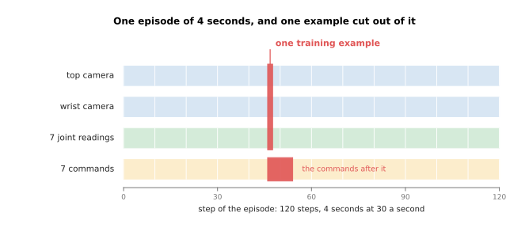

One training example is one row of joint readings, the two camera frames recorded beside
it, and the commands recorded after it, so one episode of 120 moments gives 120 examples.

On disk that episode is a folder of files. Read the table below as a listing of that
folder: the first column is the file name, and the second says what is inside it.

| File | What it holds |
| --- | --- |
| `cam_top.mp4` | 2.76 MB, 120 frames of 480 by 640 from the camera above the table |
| `cam_wrist.mp4` | 2.76 MB, 120 frames of 480 by 640 from the camera on the wrist |
| `state.parquet` | 120 rows of 7 joint readings, which is six joints and a gripper |
| `action.parquet` | 120 rows of 7 commands |
| `stamps.parquet` | 120 rows of 1 time, so that the files can be lined up |
| `task.json` | the sentence `"put the block in the tray"` |

Almost all of those bytes are pictures. The next picture compares the four kinds of thing
the episode holds, on a scale where each step up the axis is ten times more.

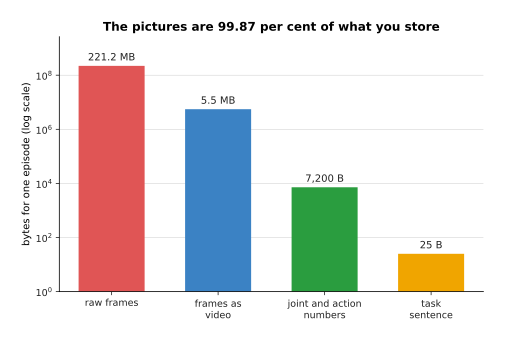

One four-second episode recorded 30 times a second holds 120 moments. Storing it costs
5.54 megabytes, of which the two camera videos are 99.87 per cent, and the raw frames
would be 221.18 megabytes if they were not stored as video.

So bytes are not what limits you. What limits you is minutes of a person's time, because
somebody has to sit at the arm and drive it. The next picture breaks one usable episode
into the four things that person spends time on.

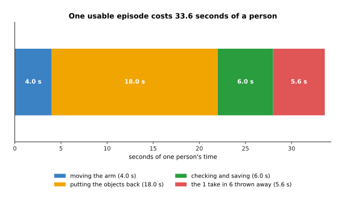

With four seconds of movement, eighteen seconds to put the objects back, six seconds to
check and save, and one take in six thrown away, one usable episode costs 33.6 seconds.

Notice that the movement itself is only four of those seconds. The other work is putting
the world back the way it was, which no amount of practice removes. The next picture takes
that 33.6 seconds and multiplies it out.


Fifty episodes cost 28 minutes of one person, and five thousand episodes cost 46.7 hours,
which is nearly seven working days.

How many episodes you actually need is set by how much the job varies. The clearest way to
see that is to measure the same task twice, with one more thing moving about the second
time. In the simulated job below a gripper must reach a goal somewhere on a patch of table
without touching a box, and a run counts as working only if it ends within 1.5 centimetres
of the goal and never touches the box. The next picture measures that at seven
training-set sizes, first with the box always in one place and then with the box moving as
well.


With the box always in the same place the policy works on four runs in five by 10
demonstrations, and with the box moving as well it takes 40 demonstrations, which is four
times as many for one extra thing varying.

Both curves climb steeply and then flatten, from 0.604 to 0.938 and from 0.454 to 0.887.
This means that once a policy is stuck at four runs in five, recording two hundred more
episodes of the same thing does not help. Count instead what has to be covered, which is
every way the object can lie multiplied by every lighting condition. For six orientations
and four lightings that is a few hundred episodes rather than a few dozen. The next
picture turns the two numbers above into the time they cost.

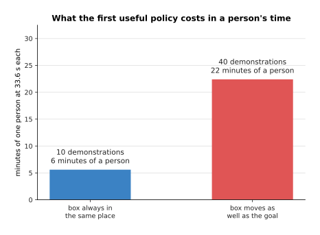

The first policy that works four runs in five costs 10 demonstrations, or 6 minutes of one
person, with the box fixed, and 40 demonstrations, or 22 minutes, with the box moving.

The starting point for this recipe is a library rather than a model, because no pretrained
plain cloning policy is worth downloading.
[LeRobot](https://github.com/huggingface/lerobot) records demonstrations, trains policies
on them and runs them, while [robomimic](https://github.com/ARISE-Initiative/robomimic)
has plain behaviour cloning already built. The first milestone is the single-batch test
from [the order of the work](02_the-order-of-the-work.md), which checks that your code can
learn at all. The number to watch afterwards is the share of whole runs on the arm that
finish the job. Watch that rather than the loss, because the loss keeps falling while the
drift measured in [why copying one step at a time
drifts](../12_models-that-act/01_behaviour-cloning-and-action-chunks.md#3-why-copying-one-step-at-a-time-drifts)
gets worse.

The first warning belongs here. The **action space** is the list of numbers that one
command is made of, together with what each number means and how it is scaled. It must be
settled before the first episode is recorded, because the same movement can be written
down in more than one way. The next picture shows one set of recordings written down both
ways.

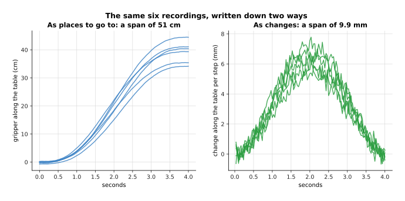

The same recordings span 50.74 centimetres when they are written down as places to go to,
and 9.89 millimetres when they are written down as changes per step.

Those are the same movements, so a program cannot tell from the numbers which convention
was used. If the recordings use one convention and the program that runs the policy
assumes the other, every command is wrong. The next picture measures what that costs.


Those three bars are one trained policy on one arm. Played as it was trained it misses by
0.38 centimetres, read as places rather than changes it misses by 41.12 centimetres, and
with its two axes swapped it misses by 60.70 centimetres.

No amount of extra data fixes that, because the recordings and the program that runs them
disagree about what a number means. So write the joint order, the units, whether the
numbers are places or changes, the command rate and the scaling constants into a file that
sits beside the weights.

The second warning is about who records the demonstrations. Two people doing the same job
do not produce the same numbers. The next picture shows twelve recordings from each of two
simulated people, reaching the same goal past the same box.


Person A keeps close to the box and person B passes further from it, and both reach the
goal, so both sets of recordings are correct.

Those two habits disagree most clearly if you stop at one moment of the job and ask how
far the gripper moves next. The next picture does that, half way through the job.

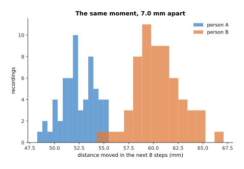

At the same moment of the same job one person's recordings differ from each other by 1.68
millimetres, while the two people differ from each other by 7.01 millimetres.

Training asks for one answer that is close to every label, so where two people answered
differently it settles on the average of the two. On the mixed set the best single answer
is wrong by 6.47 times as much, measured as squared error. The next picture shows what
that costs in runs that work, with eighty recordings gathered four different ways.

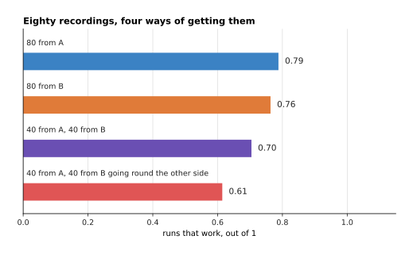

Eighty recordings from one person train a better policy than forty recordings from each of
two people, and the cost is small while both people pass the box on the same side, because
success falls only from 0.788 to 0.704. It falls to 0.614 when they pass on opposite
sides.

One person recording on two days also counts as two people, because the hand-held
controller used to drive the arm is set up a little differently each day, and that shows
up in the labels in exactly the same way. The mistake almost everybody makes first is to
judge the policy by its loss, where the loss is one number saying how wrong the model's
answers are on the recordings. The loss is measured on moments a person visited, while the
arm visits moments nobody did.

---

## 2. A policy that writes a chunk of actions

Section 1 ended with a policy judged by whole runs, and the cheapest way to improve those
runs is to stop asking for one command at a time. A **chunk** is a block of future
commands worked out in one go, so the model is asked once and then the arm plays several
steps of the answer. [Playing a chunk of the future instead of one
step](../12_models-that-act/01_behaviour-cloning-and-action-chunks.md#4-playing-a-chunk-of-the-future-instead-of-one-step)
measures why this helps: the model's own error feeds back into its next input only once
per decision instead of once per step.

Nothing about the recordings changes. Only the label changes, because the label is now a
block of steps rather than one step. The next picture shows one such label, taken from the
middle of an episode and from its last second.


One label is 32 future steps of 2 numbers each, and the last 31 examples of every episode
run past the end of the episode, so they are padded by repeating the final command.

Padding matters because an episode that was truncated in the middle of the job teaches the
policy to stop half way. The next picture counts how much bigger the labels get.

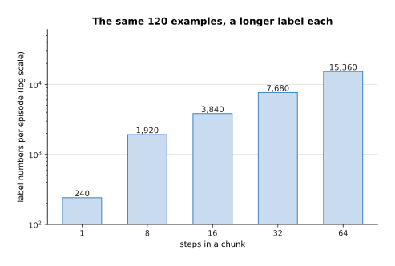

One episode still gives 120 examples, but with a chunk of 32 steps each label is 64
numbers instead of 2, so the episode carries 7,680 label numbers rather than 240.

How long the chunk should be is decided twice, and the first answer comes from the clock.
The arm needs a command at a fixed rate, so a chunk has to last at least as long as the
model takes to produce the next one. The next picture compares the time each chunk length
gives the model against how long three kinds of model take to answer.


At 30 commands a second the arm wants one command every 33.33 milliseconds, and a chunk of
8 steps covers 266.7 milliseconds of movement.

Read the table below as a floor rather than a recommendation: for each speed of model, the
second column is the shortest chunk you are allowed to use, and the third is how much time
is left over after the model has answered.

| Model | Shortest chunk | Spare time |
| --- | --- | --- |
| a small policy, 15 ms | 1 step, 33.3 ms | 18.3 ms |
| a diffusion policy, 60 ms | 2 steps, 66.7 ms | 6.7 ms |
| a large model, 240 ms | 8 steps, 266.7 ms | 26.7 ms |

So time one pass of your model, divide by the command period, and that is the shortest
chunk you may use. A shorter chunk leaves the arm without commands, and the arm then stops
in the middle of a movement.

The second answer comes from the task, and it is a trade. A chunk is decided once and then
played without looking at the world again, so a longer chunk means a longer time during
which the arm cannot react. The next picture measures what that costs when the goal moves
8 centimetres part way through the run.


The miss after the goal moves part way through rises from 0.54 centimetres at one step a
decision to 1.12 centimetres at thirty-two. The dashed line adds the two misses together,
and it is lowest at 16 steps a decision.

The next picture measures what the same long chunk gives you when nothing moves.

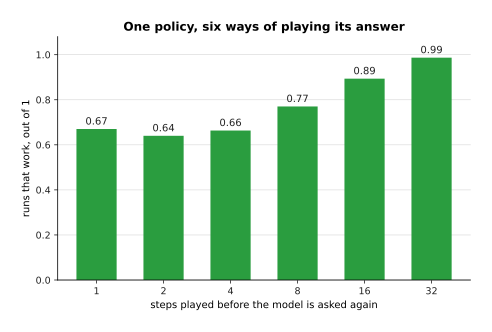

Playing more of each chunk raises the share of runs that work from 0.67 at one step a
decision to 0.99 at thirty-two.

The long chunk is clearly better in this job, and the cost appears only at the longest
chunk, where the arm carries on for over a second before looking again. Where things
move while the arm works, that cost appears much sooner. This is why the usual arrangement
is to work out a long chunk and play only the front of it, as [receding
horizon](../12_models-that-act/02_diffusion-and-flow-policies.md#5-receding-horizon-generating-while-the-arm-is-still-moving)
describes.

The starting point is the action-chunking transformer packaged in LeRobot, which reads the
recordings LeRobot already made. The first milestone is the single-batch test again, and
then one whole run of the job on the arm, however clumsy that run is. The number to watch
is the share of runs that work at the chunk length you intend to ship, because success at
one chunk length says nothing about another. The mistake almost everybody makes first is
to take a chunk length from a paper and run it at a different command rate.

---

## 3. A policy that generates its answer

Sections 1 and 2 both trained a policy to give one answer. This section is about when one
answer is the wrong thing to ask for. A diffusion policy or a flow policy builds its
answer out of random noise over several passes, instead of producing one answer directly
in a single pass. Because it builds the answer a little at a time, it can produce one of
several good movements rather than their average, as [diffusion and flow
policies](../12_models-that-act/02_diffusion-and-flow-policies.md) explains.

One question decides whether you need such a policy, and you can answer it on recordings
you already have. The question is whether the average of your labels is itself a
reasonable answer. The next picture shows a case where it is not.

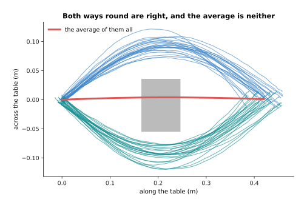

Both ways round the box are correct, and the average of the two is a movement that drives
through the box.

To turn that into a number, stop at one moment, take the sideways movement each recording
asks for over the next 16 steps, and measure how far the average of those numbers is from
the nearest number anybody actually recorded. The next picture does that twice, once on a
task where both ways round were recorded and once on a task where only one way was.


Where the demonstrator went both ways round the box, the average of the labels lies 27.9
millimetres from the nearest label anybody recorded, against a spread of 6.2 millimetres
inside one group. Where only one way was recorded, the average lies 0.0 millimetres from a
real label.

That distance is the whole test. Near zero, the average is itself a reasonable answer, and
a plain policy is fine. Several times the spread inside one group, the average is a
movement nobody would make, and a plain policy produces it anyway. The next picture shows
both policies driving, trained on the same 400 recordings.


The policy that gives one answer drives through the box on many of its runs, while the
policy that generates its answer goes round one side or the other.

The next picture counts those runs.

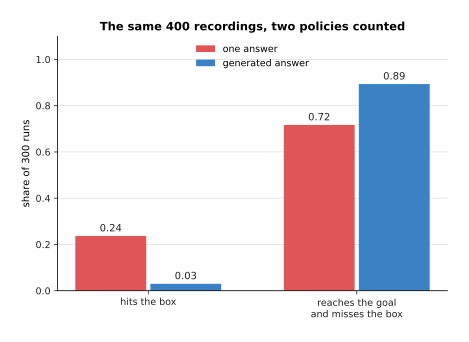

Trained on the same 400 recordings, the policy that gives one answer drives through the
box on 0.24 of its runs and finishes the job on 0.72 of them, while the policy that
generates one drives through on 0.03 and finishes on 0.89.

One training example is exactly what it was in section 2, so a generating policy can be
fitted to recordings you already hold. How many you need hardly changes either, except
that both answers must appear often enough in the recordings to be learned. What it costs
is passes through the network. Each **pass** is one run of the network, and the policy
builds its answer by repeating passes, each one removing a little more noise. The next
picture measures what those passes gain on a task that has one right answer.


On a task recorded with one right answer, the plain policy works on 0.94 of runs in a
single pass, while the generating policy reaches 0.84 only after sixteen passes.

The next picture shows what those passes cost in milliseconds, against the time a chunk of
eight steps covers.

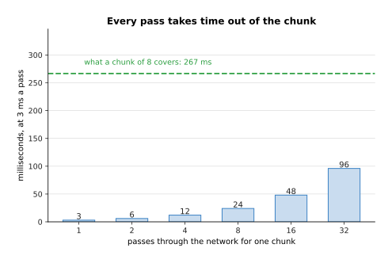

Sixteen passes take 48 of the 267 milliseconds that a chunk of eight steps covers.

The starting point is the diffusion policy packaged in LeRobot, which trains on the same
dataset as the action-chunking transformer, so swapping between the two is a configuration
change rather than new work. The first milestone is a picture rather than a run: generate
twenty chunks at one observation and check that they fall into the groups the
demonstrations fall into, rather than into a single group between them. The number to watch is the
share of runs that fail in the way the averaging policy failed, which here is the share
that hit the box.

The passes are the slowest part of the policy, so cutting them is the obvious way to meet
the clock from section 2. The next picture shows what that does on the two-answer task.


At two passes a chunk the same policy produces movements that follow neither way round the
box, and at sixteen passes it produces clean movements round both sides.

The next picture counts that across six numbers of passes.

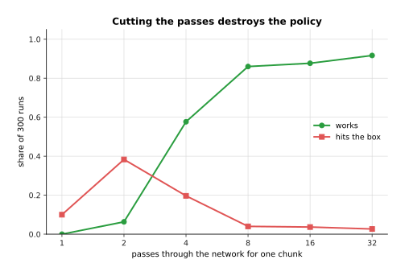

On the two-answer task the same policy works on 0.06 of runs with two passes a chunk, 0.58
with four and 0.88 with sixteen, while the share that drives through the box falls from
0.38 to 0.04.

That is the mistake almost everybody makes first. A half-built chunk is not a slightly
worse answer, it is noise, because the answer is only finished after the last pass. So fix
the chunk length first and the number of passes second. If both cannot be met, use a flow
policy, which needs fewer passes, as [flow
matching](../08_models-that-generate/02_flow-matching-and-other-generators.md) explains.

---

## 4. A model that is told the job in words

The three policies so far each do one job. This section covers the model that takes a
sentence as well as a picture, so that one model can do several jobs and you choose which
one by typing a sentence. These are called vision-language-action models, and
[vision-language-action models](../12_models-that-act/03_vision-language-action-models.md)
explains how they work. The question here is what fine-tuning one involves, and whether it
is a sensible first project.

Start with what must fit in the graphics card, because that decides whether you can do it
at all. Training one weight costs memory three times over. The weight itself is stored,
its gradient is stored, which is the number saying which way to change it, and the two
running averages of that gradient which the training algorithm keeps are stored as well.
That is twelve bytes for every weight you train. A weight that is frozen, meaning that
training is not allowed to change it, costs two bytes, because only the weight itself is
kept. So the question that decides the memory is how many weights you train. The next
picture compares training every weight with training only an adapter.


Training every weight of a 450-million-weight model needs 5.40 gigabytes, and training a
rank-16 adapter on it needs 0.94 gigabytes, while the same two numbers for a
7-billion-weight model are 84.00 and 14.04 gigabytes.

An **adapter**, explained on [fine-tuning and
adapters](../07_pretraining-and-adapting/03_fine-tuning-and-adapters.md), replaces each
big square matrix of weights with two thin ones, and trains only those. The
**rank** is how thin those two matrices are. The next picture shows how the rank decides
the number of weights you are actually training.

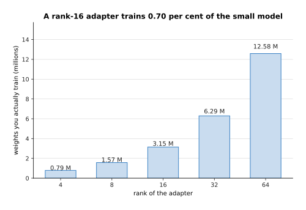

A rank-16 adapter on a 1,024-wide matrix trains 32,768 weights instead of 1,048,576, and
over 24 blocks of four matrices each that is 3.15 million weights, which is 0.70 per cent
of the small model.

One training example here is a section 2 example with a sentence attached. The sentence is
where first attempts are wasted, because a sentence only carries information when the
recordings differ in what it says. The next picture measures how much a sentence can
possibly say.


With one job recorded, the instruction carries no information at all, because there is
nothing for it to choose between.

The next picture shows what happens when the model is told which job it is doing and when
it is not, on the same recordings.

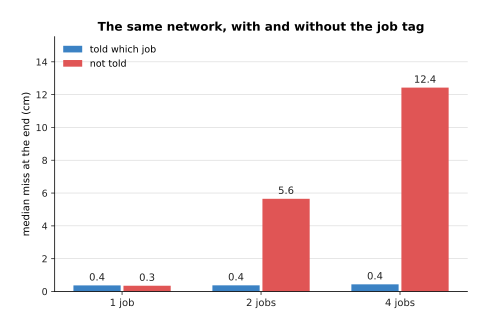

With one job recorded the same network does as well without the instruction as with it,
while with four jobs the model that is told which job misses by 0.4 centimetres and the
model that is not told misses by 12.4 centimetres.

Those two bars are the same network on the same recordings, and they differ only in
whether the job was part of the input. The model that is not told fails because it
averages the four jobs together, exactly as in section 3. How many demonstrations you need
follows from this, because the model has to learn every job. The next picture compares a
one-job model with a four-job model at the same total number of recordings.


At 20, 40, 80 and 160 recordings in all, the four-job model scores below the one-job model,
because those recordings have to be divided between four jobs. By 320 recordings the two
are level.

The next picture draws the distance between those two curves on its own.

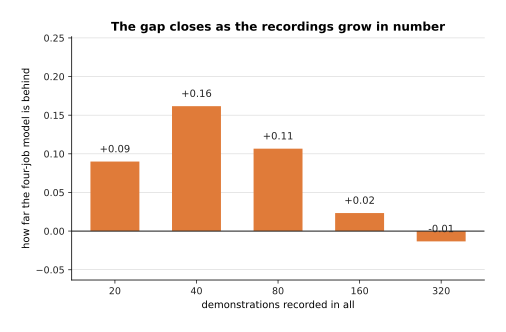

The gap is widest at 40 recordings, where the four-job model is 0.16 behind. It then
shrinks to 0.02 at 160 recordings and disappears at 320, because by then each job has
enough recordings of its own.

The starting points differ mostly in what they demand of your hardware.
[SmolVLA](https://huggingface.co/blog/smolvla) has 450 million parameters, which is
another name for weights, and it runs on an ordinary computer, which makes it the usual
first choice with a small arm. [OpenVLA](https://huggingface.co/openvla/openvla-7b) has 7
billion parameters and an MIT licence. The π0 models and NVIDIA's GR00T need an NVIDIA
graphics card. The first milestone is to run the downloaded model on your own arm before
any training, because a starting point that already half works is a different project from
one that does nothing. The number to watch while fine-tuning is the success rate for each
job separately rather than the average, because an average hides one job that has stopped
working altogether.

So is this a sensible first project? Only if you really need one model for several jobs
chosen by a sentence. For one job a chunk policy is smaller, faster and far easier to
debug. The mistake almost everybody makes first is to choose the biggest model because it
generalises, and then to find that it generalises in the ways measured in [what
generalisation really looks
like](../12_models-that-act/03_vision-language-action-models.md#7-what-generalisation-really-looks-like-and-what-it-costs-to-run)
rather than in the way they needed.

---

## 5. A model that predicts what happens next

Every model so far answers the question of what to do. This one answers a different
question, which is what will happen. A model of that kind is called a **world model** or a
dynamics model, and [world models](../12_models-that-act/04_world-models.md) explains it.
One training example is a **transition**: the state the arm was in, the command sent at
that moment, and the state one step later.

Because a transition needs no judgement about what should happen, nobody has to be in the
room to produce it. A script can push the arm around inside safe limits and record what
follows. The next picture compares what that script gathers in an hour with what a person
demonstrating gathers.


A script that pushes the arm about for twenty seconds and resets for ten gathers 72,000
transitions an hour, against the 12,857 examples an hour that a person demonstrating
produces.

The next picture shows how many of those transitions the model actually needs.

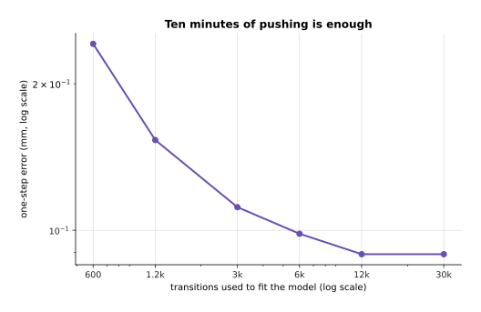

The one-step error falls from 0.242 millimetres to 0.089 millimetres as the transitions go
from 600 to 12,000, and more transitions after that add nothing.

That is the easiest answer on this page, because 12,000 transitions is ten minutes of
pushing. What you must measure next is how far ahead the model may be believed, because a
one-step model is used by feeding its own answer back in as the next input. The next
picture draws four real paths with the model's predictions over them.

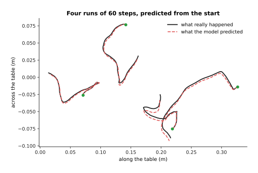

Each prediction starts on top of its real path and slowly drifts away from it, because
every step is fed the model's own answer from the step before.

The next picture measures that drift across 400 runs.


One step ahead the model is out by 0.07 millimetres, sixty steps ahead it is out by 4.7
millimetres, and it passes a millimetre of error at step 14, which is 0.47 seconds.

A small error at one step becomes part of the input to the next step, so sixty steps of it
grow into a visible gap. That is exactly what [error that piles up over a
rollout](../12_models-that-act/04_world-models.md#3-error-that-piles-up-over-a-rollout)
measures on another system. The habit to build is to find your own crossing point and to
plan no further ahead than that.

Predicting ahead is worth the effort for one reason. It lets you write a new job down as a
cost and then solve it, without recording anything. A **planner** tries many possible
futures inside the model, scores each one by the cost, and sends the first commands of the
best. The next picture compares a planner with a written rule on a job that neither of them was
given any demonstrations of, with the two drawn on the same table.


The written rule drives towards the goal and through the box, while the planner goes round
it, although the model it plans inside was never shown a box.

The next picture counts those runs.

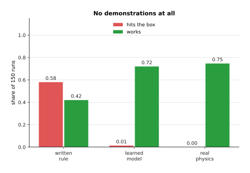

A written rule reaches the goal to within 0.07 centimetres but drives through the box on
0.58 of its runs, while a planner searching inside the learned model hits the box on 0.01
and finishes the job on 0.72, with no demonstrations recorded at all. The third pair of
bars is the same planner searching inside the real physics instead of the learned model,
and it finishes on 0.75, so the learned model costs almost nothing here.

The model was fitted to random pushing, with no goal, no box and no person. The box was
added afterwards as a penalty in the planner's cost, so the job changed without the data
changing. That is the whole value of this family. The other half of the method is that the
plan must be made again constantly, and the next picture measures why.

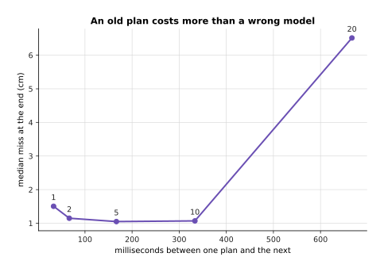

Remaking the plan every five steps leaves the arm 1.05 centimetres from the goal, while
remaking it every twenty steps leaves it 6.51 centimetres away.

Replanning that often has a price, because every step of every candidate future is one
call of the model. The next picture shows how many futures fit between two commands, for
four speeds of model.


Between two commands at 30 a second there is room for 3,333 futures of twenty steps if one
model step costs half a microsecond, and room for 3 futures if it costs five hundred
microseconds.

The next picture shows the same arithmetic from the other side, as the number of calls one
decision costs.

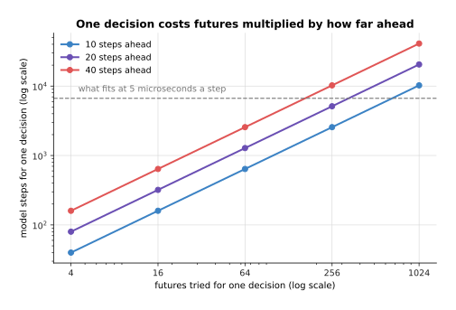

One decision with 64 futures of 20 steps is 1,280 calls of the model, because the cost is
the number of futures multiplied by how far ahead each one goes.

This is why the models that planners use on real arms predict a few dozen numbers rather
than whole pictures. The starting points here are designs rather than downloads, because a model of
your arm fits only your arm, and TD-MPC2 and the Dreamer family are the two to copy. The
first milestone is the one-step error on held-out transitions, which are transitions the
model was not trained on. The number to watch is the number of steps at which the drift
crosses your tolerance. The mistake almost everybody makes first is to judge the model by
its one-step error, which says nothing about how far ahead it can be trusted.

---

## 6. A policy found by trying

The five recipes so far all learn from something that somebody provided. This one learns
from its own attempts, each scored by a **reward**, which is a number saying how good the
attempt was. That is [reinforcement
learning](../11_learning-from-outcomes/01_reinforcement-learning.md). One training example
is not collected but produced: the policy drives an episode, the episode earns a reward,
and the episode is thrown away as soon as the policy changes. So the question is not how
many examples you need, but how many attempts.

The next picture shows one such search learning, and a second search in a simulator whose
settings are drawn fresh every time.


The search took 20,000 episodes, which is 25 rounds of 50 candidates on 16 tasks each, to
go from working on none of its runs to working on all of them.

The next picture puts those episodes on a real arm instead of in a simulator.

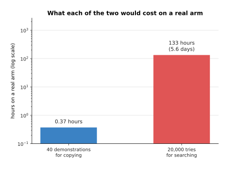

On a real arm at four seconds a try and twenty seconds to reset, those 20,000 episodes
would be 133 hours, against the 22 minutes of a person that forty demonstrations cost.

That comparison is the third warning. Choosing reinforcement learning means building a
simulator first, and a simulator is a project in itself. It needs a model of the arm and
the objects, contact that behaves like real contact, a camera view if the policy needs
one, a reset that puts everything back, and a reward that cannot be earned the wrong way.
MuJoCo, PyBullet and Isaac give you the physics, and Stable-Baselines3 gives you the
search algorithms PPO and SAC. What is left is the part specific to your own cell, and
that part decides whether anything transfers to the arm. The next picture measures what
happens when the arm is not quite what the simulator assumed.


A policy that works on every run in its own simulator still works on every run when the arm
moves only 0.85 of what it is told. It drops to 0.95 when the obstacle is 2.5 centimetres
bigger all round, to 0.65 when commands arrive five steps late, and to 0.59 when those
three things are wrong at once.

What is done about that is to search in many simulators rather than one, drawing the gain,
the obstacle size and the reported goal fresh for every task. That is called **domain
randomisation**, and [why this happens in a
simulator](../11_learning-from-outcomes/01_reinforcement-learning.md#6-why-this-happens-in-a-simulator-and-what-the-crossing-costs)
describes it. The next picture measures what it gains.

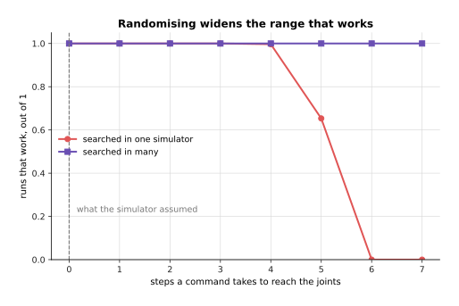

The policy searched in one simulator survives a delay of four steps and collapses by six,
while the policy searched in many works at every delay tested.

Searching in many simulators is not free, and its cost appears in the learning curve above,
where the randomised search needs many more rounds to reach a worse score in its own
simulator. Reinforcement learning is nonetheless the right choice in three situations: when the job
cannot be demonstrated because it needs force or speed that no hand-held controller can
produce, when the outcome can be scored by a program as [rewards, preferences and
verifiers](../11_learning-from-outcomes/02_rewards-preferences-and-verifiers.md) sets out,
and when what has to be learned is contact that a simulator can represent. The mistake
almost everybody makes first is to start the simulator and the policy in the same week.

The next picture puts the two families side by side on the same job.


The searched policy works on 0.99 of runs in its own simulator and 0.65 on a different
arm, randomising brings that back to 0.98, and the policy cloned from forty demonstrations
works on 0.80 of runs on the arm its recordings came from.

Read the table below one row at a time: the first column names a question, and the other
two columns answer it for the two families.

| Question | Copying a person | Searching for a policy |
| --- | --- | --- |
| What it needs first | somebody to drive the arm | a simulator and a reward |
| Data it uses here | 40 episodes, 22 minutes | 20,000 episodes |
| Where that data comes from | the real arm | the simulator only |
| What goes wrong | the copy drifts | the simulator is not the arm |
| First milestone | one run works from start to finish | the reward keeps rising |

That chart and that table, together with the hours above, answer the question for a person
with one arm and a few weeks. Attempt the chunk policy of section 2 first, because it is
the smallest thing that works and the others are variations on it. Attempt the generating
policy of section 3 only if the test there says your task has more than one right answer.
Attempt the world model of section 5 if you want a planner rather than a policy. Do not
attempt a vision-language-action model as a first project unless you truly need several
jobs chosen by a sentence. Do not attempt a reinforcement-learned policy at all unless you
already have a simulator you trust. The cloned policy has no reality gap, meaning no
difference between what it trained on and what it meets, because its data came from the
arm itself, and at the start that is worth more than everything the other families offer.

---

## 7. Where to read next

- [When it does not work](06_when-it-does-not-work.md) is the next page, and it takes each
  failure named above, from a loss that will not fall to a policy that works for one person
  and not another, and gives the cheapest test for each.
- [Recipes for the models that see and understand](04_recipes-for-models-that-see-and-understand.md)
  is the other half of this reference, and its models are what a policy here usually stands
  on.
- [Running and evaluating a model](../14_using-a-model-for-real/01_running-and-evaluating-a-model.md)
  takes over once a policy works, and sets out the timing budget in full.
- [Behaviour cloning](../../07_learned-models/06_movement-models/02_most-used/01_behaviour-cloning.md)
  in the catalogue of movement models lists the published policies of this kind.
- [Vision-language-action models](../../07_learned-models/07_language-models/02_most-used/01_vision-language-action-models.md)
  in the same catalogue gives the current models and their licences.

---

## 8. Using it in Python

Section 1 insisted that the action space is written down, section 2 turned one command
into a block with padding at the end, and section 4 counted what an adapter really trains.
The code below does those three things in that order, on one simulated recording, so every
shape and count it prints is the one those sections describe.

```python
import torch
from torch import nn

HZ, CHUNK, DIM, STEPS = 30, 16, 7, 120          # 7 numbers: six joints and a gripper
torch.manual_seed(0)
episode = torch.cumsum(torch.randn(STEPS + 1, DIM) * 0.002, 0)   # one recording

# section 1: the action space, decided once and saved beside the weights
actions = episode[1:] - episode[:-1]            # commands as changes, not as places
lo, hi = actions.min(0).values, actions.max(0).values
scaled = 2 * (actions - lo) / (hi - lo) - 1     # what the network actually sees
print(tuple(actions.shape), round(float(scaled.min()), 2), round(float(scaled.max()), 2))
# (120, 7) -1.0 1.0

# section 2: one label is a block of CHUNK future steps, padded past the end
pad = torch.cat([actions, actions[-1:].repeat(CHUNK, 1)], 0)
labels = torch.stack([pad[t:t + CHUNK] for t in range(STEPS)])
print(tuple(labels.shape), labels.numel())      # (120, 16, 7) 13440

head = nn.Linear(512, CHUNK * DIM)              # the policy's last layer
block = head(torch.zeros(1, 512)).view(1, CHUNK, DIM)
loss = nn.functional.l1_loss(block, labels[:1])  # one number out of all 112 at once
print(tuple(block.shape), sum(p.numel() for p in head.parameters()))  # (1, 16, 7) 57456

# section 4: how much of a model an adapter really trains
from peft import LoraConfig, get_peft_model
body = nn.Sequential(*[nn.Linear(1024, 1024) for _ in range(4)])
small = get_peft_model(body, LoraConfig(r=16, target_modules=["0", "1", "2", "3"]))
small.print_trainable_parameters()
# trainable params: 131,072 || all params: 4,329,472 || trainable%: 3.0274
```

What the libraries give you here is narrow. PyTorch supplies the loss and the layer, and
`peft` supplies the adapter, which is the only one of the three that would be real work to
write yourself. Everything about the action space is yours, because PyTorch has no idea
whether your seven numbers are places or changes, which order the joints are in, or what
the scaling constants were. It will train happily on a mixture of two conventions while
the loss falls.

The constants `lo` and `hi` deserve a last word. They are worked out from the dataset, so
they change when you add to it. A policy trained with one pair and run with another is
exactly the failure measured in section 1, so save them in the file that holds the
weights. In a real project `LeRobotDataset` does the recording and the loading, and
LeRobot's packaged policies already contain the chunk head above, so the lines here are
the parts you still decide even when you use it.
