# When it does not work

The page before this one,
[recipes for models that act and predict](05_recipes-for-models-that-act-and-predict.md),
gave a starting recipe for each family of model that makes a robot move, and every
recipe ends with you typing a training command and waiting. This page is about what
to do when the thing does not work, which is the normal first outcome rather than a
rare accident, and saying so plainly matters, because otherwise a first failure reads
as proof that you are not clever enough.

The page is organised by symptom rather than by cause, because a symptom is what you
have: a curve that did not fall, two curves that parted company, or an arm that
knocked a mug over. Each section takes one symptom and answers what it means, what
the cheapest test is, and what to change, and it assumes you have read
[the order of the work](02_the-order-of-the-work.md).

Two pages elsewhere own machinery this page only diagnoses against.
[Overfitting and generalisation](../04_making-training-work/01_overfitting-and-generalisation.md)
owns what a held-out set is and what early stopping, dropout and weight decay do, and
[running and evaluating a model](../14_using-a-model-for-real/01_running-and-evaluating-a-model.md)
owns how a model is judged on an arm, including why a **success rate**, the fraction
of whole attempts that worked, needs many trials to mean anything.

Every number below is printed by `docs/diagrams/starting_your_own_model_6.py`, and
all of its data is simulated. In its first job a gripper is driven to an object on a
table, a written controller plays the demonstrator, a network copies its noisy
recorded commands, and those weights are then run in closed loop, which gives a task
success rate as well as a loss. In the second, two demonstrators pass one obstacle on
opposite sides, and in the third a model says how wide to open a gripper.

## Contents

1. [The loss does not fall at all](#1-the-loss-does-not-fall-at-all)
2. [The loss falls to a floor well above zero and stops](#2-the-loss-falls-to-a-floor-well-above-zero-and-stops)
3. [The training loss falls and the held-out loss does not follow](#3-the-training-loss-falls-and-the-held-out-loss-does-not-follow)
4. [Both losses look fine and the robot still fails the task](#4-both-losses-look-fine-and-the-robot-still-fails-the-task)
5. [It works on the objects it was trained on and on nothing else](#5-it-works-on-the-objects-it-was-trained-on-and-on-nothing-else)
6. [It works in the simulator and not on the arm](#6-it-works-in-the-simulator-and-not-on-the-arm)
7. [It worked last week and does not now](#7-it-worked-last-week-and-does-not-now)
8. [Where to read next](#8-where-to-read-next)
9. [Using it in Python](#9-using-it-in-python)

---

## 1. The loss does not fall at all

The first symptom arrives within a minute of starting the run, and it is a flat line.
It never means too few examples, because a network with enough weights can memorise
anything, so a model that cannot drive the error down on its own training examples is
wrongly arranged rather than short of data.

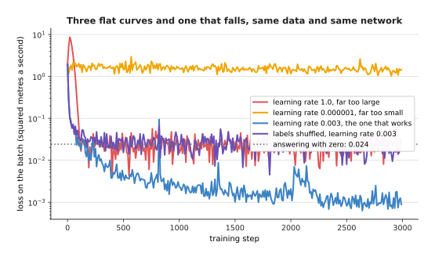

One network and 8,000 recorded commands: the loss falls at a learning rate of 0.003 and stays flat at 1.0, at 0.000001, and when the labels are shuffled.

The **learning rate** says how big a step training takes down the slope of the loss,
and [gradient descent](../03_how-training-works/02_gradient-descent.md) explains what
it is a step of. The fourth curve has the good rate and is flat only because its
labels were shuffled, so it ends at 0.02568, no better than the 0.024181 that
answering zero every time scores, which is the number to write down before any
run.

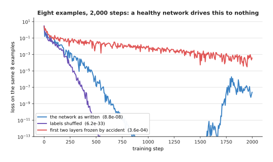

Eight examples and 2,000 steps: the network as written ends at 0.000000088, and the same network with its first two layers frozen by accident stops at 0.00036.

That is the cheapest test there is, since eight examples is a thing any correctly
wired network memorises, and the red curve is one whose layers were locked when a
published starting point was loaded. The shuffled labels pass it too, so it proves
only that your code can learn.

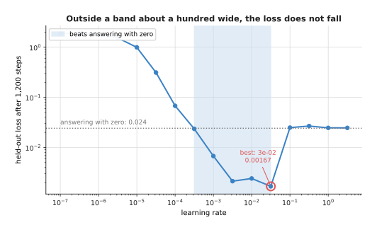

Only the band from 0.00032 to 0.03162 beats answering with zero, and the best value in this short run of 1,200 steps is 0.03162, at a held-out loss of 0.00167.

If that test passes, the rate is usually outside its band, which is a hundred times
wide against the ten powers of ten people try. Below the band the loss falls so
slowly that a few thousand steps look flat and above it the steps overshoot, and
since both draw the same line you try a rate ten times smaller and one ten times
larger.

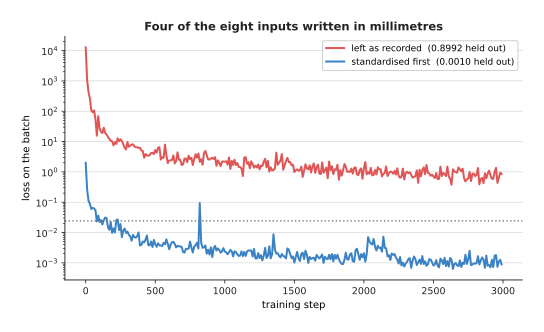

Four of the eight inputs written in millimetres instead of metres leave the run at a held-out loss of 0.89920, and standardising every column brings it to 0.00105.

The last common cause is inputs never put on one scale, and here the column spreads
are 138, 148, 125 and 134 against 0.289, 0.0494, 0.586 and 0.997, so no single rate
suits both groups.
[Normalisation and stability](../04_making-training-work/02_normalisation-and-stability.md)
explains why the arithmetic needs that repair, and once the loss falls the next
question is how far down it goes.

---

## 2. The loss falls to a floor well above zero and stops

The second symptom follows a fixed version of the first, because the loss falls,
flattens at a value that is not zero, and stays there. The model is learning, so the
question is whether that floor is a fault or the right answer, and since most people
assume a fault and reach for a bigger model, this section is about finding the floor
first.

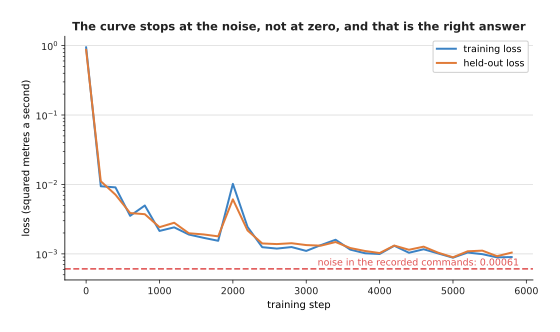

Both curves flatten at 0.000978, against a dashed line at 0.000608, which is the variance of the noise in the recorded commands themselves.

The demonstrator here is sloppy far from the object and careful close to it, so every
recorded command carries noise that no model can predict, and the run ends at 1.61
times that noise. On real data you find the same floor by recording one situation
twice, since half the variance of the difference between the two recordings is a
lower limit on the loss.

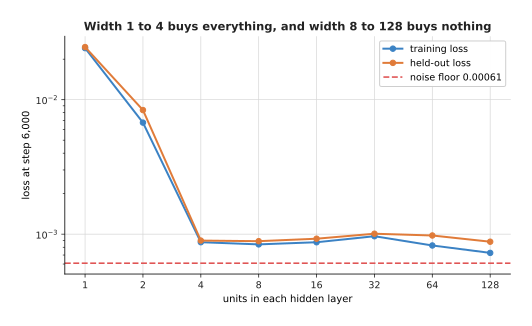

Widening the hidden layers moves the held-out loss from 0.024602 at width 1 to 0.000896 at width 4, and then only to 0.000879 by width 128.

With a floor in hand you can ask whether the model is what holds you above it, and
the test is one number to change and one run to wait for. Width 1 scores the
answering-with-zero number from section 1, but the thirty-two fold increase from
width 4 to width 128 moves the held-out loss only from 0.000896 to 0.000879, so the
model was never the problem here.

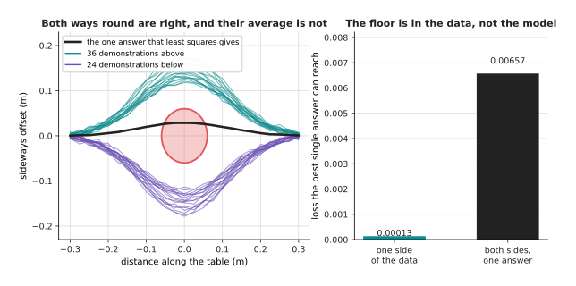

Thirty-six demonstrations go above the obstacle and twenty-four below, each clearing its edge by at least 53.3 mm, while the single path least squares gives passes 31.4 mm inside that edge.

The floor no model size will move is the one in the data, because two demonstrators
passed the obstacle on opposite sides and a model making its squared error small
cannot pick a side. The repairs are to narrow the job, to add a reading saying which
way this attempt goes, or to move to a model that holds several answers at once,
which is what
[diffusion and flow policies](../12_models-that-act/02_diffusion-and-flow-policies.md)
are for.

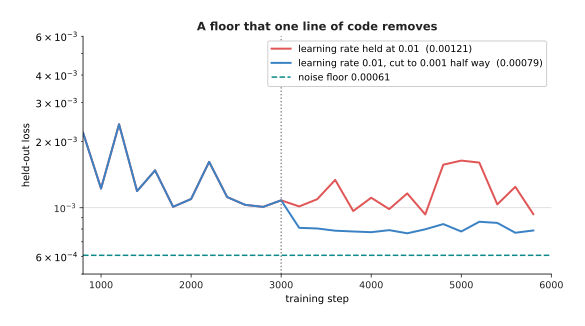

The same run with the learning rate held at 0.01 ends at 0.001213, and with the rate cut to 0.001 half way through it ends at 0.000788.

The last cause is the cheapest to remove, because a rate large enough to make early
progress is too large to settle at the end. Cutting it by ten part way through
removes a third of the remaining loss for one line of code. A floor is at least an
honest number, which is more than can be said for the number in the next section.

---

## 3. The training loss falls and the held-out loss does not follow

The third symptom is the one everybody has been warned about and few recognise in
time, since the training loss keeps falling while the loss on examples kept back
stops or turns upwards. That means the model is learning the particular examples
rather than the pattern in them, which is called **overfitting**, and since the other
page owns the cures, this section is about recognising it.

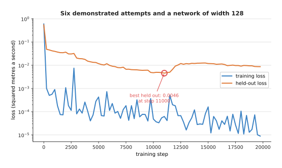

Six demonstrated attempts and a network of width 128: the held-out loss is best at 0.00458 at step 11,000 and climbs to 0.00870 by step 20,000, while the training loss falls to 0.000009.

Those two numbers finish a factor of 971 apart, so somebody watching only the
training curve would stop at step 20,000 holding a model almost twice as bad as the
one they had at step 11,000. The first thing to do therefore costs nothing: score the
held-back examples often and keep a copy of the weights at every new low.

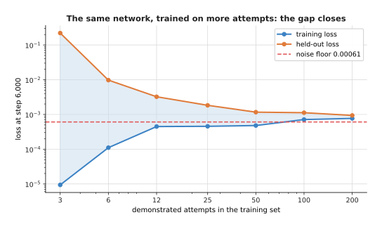

More attempts close the gap between the two losses from more than twenty thousand times at 3 attempts, to 7.2 times at 12, to 2.4 times at 50, to 1.2 times at 200.

The second thing is to find out whether more data would fix it, using the data you
have, by training the same model on a quarter of your attempts, a half and all of
them. A curve still falling steeply at the right-hand end says collecting more is
worth the effort, and three short runs answer it.

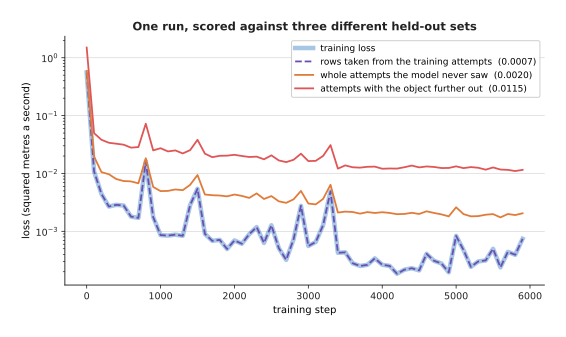

One run scored four ways: 0.00074 on its own training rows, 0.00074 on rows taken out of the training attempts, 0.00205 on whole attempts it never saw, and 0.01154 on attempts with the object further out.

Now for the thing that looks like overfitting and is not. The dashed purple curve
holds rows taken at random out of the training attempts, which leaves nearly
identical moments of one recording on both sides of the split, so it lies on the
training curve and reports a lie. Read the shape rather than the height, because a
curve that falls and then turns upwards is overfitting, while one that was never low,
like the red curve, asks a different question.

---

## 4. Both losses look fine and the robot still fails the task

The fourth symptom confuses people most, and unlike the three above it belongs to
robots rather than to machine learning in general. Both losses fell, they agree, the
flattening happened near section 2's floor, and then you run the thing on the arm and
it misses the object half the time.

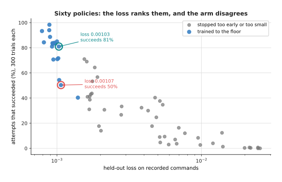

Sixty policies scored twice: two of them have held-out losses of 0.00103 and 0.00107, four parts in a hundred apart, and succeed 81% and 50% of the time.

Those sixty differ only in width, seed and number of steps, and each is scored on
held-out commands and again by 300 attempts in which the policy drives the arm and
succeeds if the gripper finishes within 15 mm of the object. The two scores agree
across all sixty, with a rank correlation of -0.950, where a **rank correlation**
says how closely one ordering matches another.

The agreement comes entirely from the bad policies, because the eighteen that trained
down to the floor have losses between 0.00079 and 0.00140 and success rates from
40.3% to 98.3%. The lowest loss of all succeeds 93.3% while the best of the sixty
succeeds 98.3% with a worse loss.

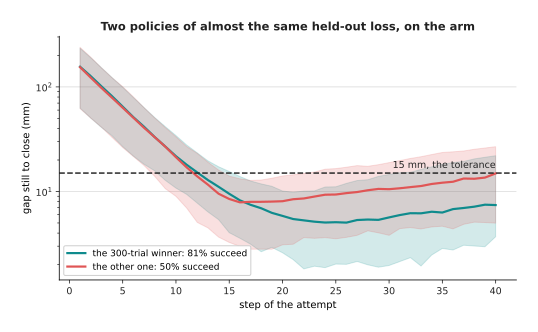

The two circled policies finish a median of 7.4 mm and 14.9 mm from the object, and the tolerance is 15 mm, so the second one's attempts land astride the line that decides them.

The first reason is the shape of the two measurements, because the loss averages over
all forty steps of every attempt while the task is a threshold applied once at the
end. The whole gap in success comes from a few millimetres on one side of one
line.

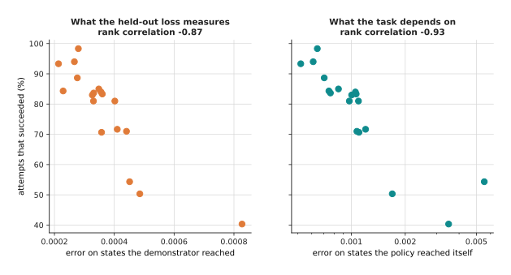

On the situations the demonstrator reached, these eighteen policies have errors within a factor of four of each other, and on the situations they drive themselves into the errors spread over a factor of ten.

The second reason is deeper and is the one to carry away, since the held-out loss
asks whether the model would have sent the demonstrator's command from a moment the
demonstrator was in, while the task asks whether the arm arrives with the model
driving. They differ because the model's own errors move the arm away from anywhere
the demonstrator went, and
[behaviour cloning and action chunks](../12_models-that-act/01_behaviour-cloning-and-action-chunks.md)
explains why copying a demonstrator has that built in.

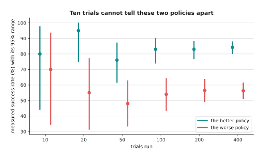

Ten trials give 80.0% and 70.0% for two policies that really differ by 28 points, with ranges of 44.4% to 97.5% and 34.8% to 93.3%, while 400 trials give 84.2% and 56.2% with ranges that do not touch.

So the cheapest test is to run the thing, and what to change is either the data, by
recording demonstrations that start from the situations the policy drives itself
into, or the model, by moving to one that commits to a chunk of commands. The warning
is that this measurement is far noisier than the loss it replaces, and
[running and evaluating a model](../14_using-a-model-for-real/01_running-and-evaluating-a-model.md)
shows how its range is built.

---

## 5. It works on the objects it was trained on and on nothing else

The fifth symptom arrives on the day you show somebody the robot and they put a
seventh object on the table. It means the model learned which of your six objects it
was looking at rather than the property you cared about, and since that answers every
question in your training and held-out sets, nothing you measured could have told
you. Here the right opening depends on an object's shape alone, an answer is right
within 4 mm, and the colour readings are crisp while the shape readings are noisy.

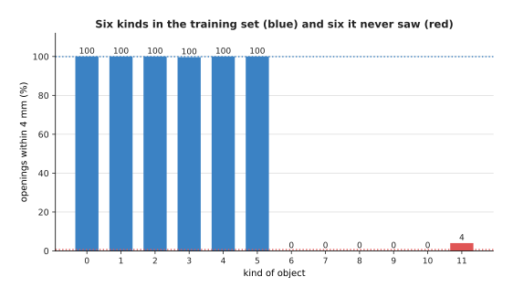

One model trained on six kinds of object gets 99.9% of their openings right, and 0.7% right on six kinds it never saw.

Those two numbers are what a learned lookup table looks like from outside, since
nothing is broken and the model answers confidently. The failure being total rather
than gradual is the clue, because a model that had learned the shape imperfectly
would be somewhat right rather than entirely wrong.

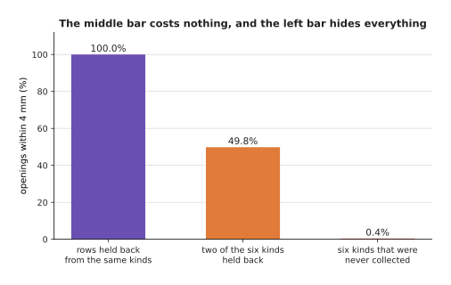

Holding back rows from the same six kinds gives 100.0%, holding back two whole kinds gives 49.8%, and the truth on six kinds nobody had collected is 0.4%.

The cheapest test is the middle bar and it costs one extra training run, because you
hold back kinds rather than rows. The left-hand bar is what a random split reports,
and the middle bar is still too kind, since two held-back kinds that resemble the
four trained ones flatter the model.

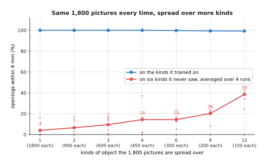

The same 1,800 pictures spread over more kinds: one kind gives 4% on objects it never saw, four give 14%, nine give 20% and twelve give 39%, while the score on its own kinds stays near 100%.

That answers the question everybody asks next, which is whether to collect more
pictures, because the total is held at 1,800 and only the number of distinct objects
changes. The faint dots are the four runs behind each point, and they show how much
the result depends on which objects you own.

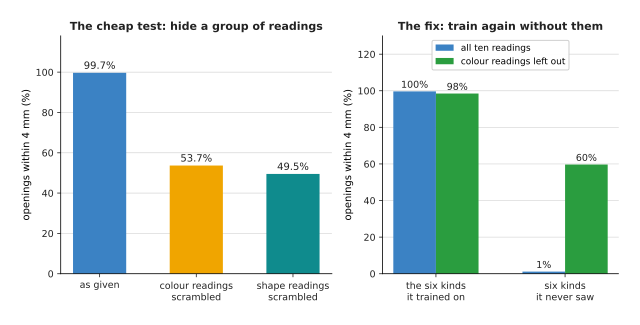

Scrambling the colour readings drops the model from 99.7% to 53.7%, and training again with those readings left out gives 98.5% on the trained kinds and 59.7% on kinds it never saw.

The left-hand panel names the shortcut without retraining, by shuffling one group of
readings between your held-out examples, and although the opening cannot depend on
colour, hiding it costs 46 points. The right-hand panel is the repair, and
[where the data comes from](../../07_learned-models/01_what-models-are/05_where-the-data-comes-from.md)
describes how robot datasets come to contain such shortcuts.

---

## 6. It works in the simulator and not on the arm

The sixth symptom is section 5's problem with the whole world as the object, since
the policy succeeds in the simulator it trained in and fails on the arm. The useful
response is not to call this the reality gap and give up, but to treat the gap as a
list of named differences, each of which can be put into the simulator and
measured.

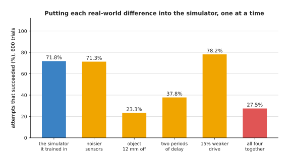

The policy succeeds 71.8% of the time in the simulator it trained in, 71.3% with noisier sensors, 23.3% with the object reported 12 mm out, 37.8% with two periods of delay, 78.2% with 15% weaker drive, and 27.5% with all four.

That is the cheapest test, because every bar is a run of the simulator rather than an
hour on the arm, and it reads as a ranking of suspects. The sensor noise costs
nothing and the weaker drive helps, since this policy overshoots, so almost the whole
gap is the calibration error and the delay.

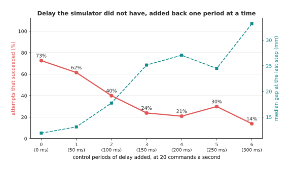

Adding delay one control period at a time, at twenty commands a second, takes the success rate from 72.6% to 61.5%, 40.0% and 23.9%, while the median gap at the last step grows from 11.9 mm to 25.1 mm.

Delay deserves its own picture because it is the difference people forget. A
simulator usually hands the policy the world as it is now and applies the answer at
once, while a real cell spends time exposing the camera, moving it and putting the
command on the bus, so the repair is a faster loop and the measured delay put into
the simulator.

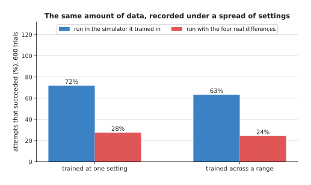

Randomising delay, drive and sensor noise, and then measuring the 12 mm calibration error and taking it out, lifts the arm from 27.5% to 88.2%, while the same randomised training with that error left in gives 5.3%.

Recording demonstrations in simulators whose delay, drive strength and sensor noise
are each drawn from a range is called domain randomisation, and it works because a
policy that has seen every value cannot rely on any one, which makes it right for a
quantity you cannot measure. A fixed calibration error is not such a quantity,
because a ruler will find it, and leaving it in makes things worse, since a
decisively acting policy follows a steady lie to the wrong place.

---

## 7. It worked last week and does not now

The last symptom destroys mornings, because the cell and the model file are the same
and a task that went ten times out of twelve on Thursday now fails more often than
not. Before spending a day on what changed, it is worth knowing how often nothing
changed and the difference is in the measurement.

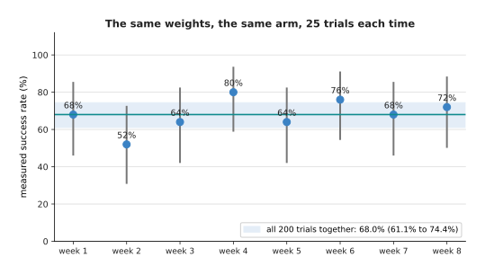

One unchanged policy measured eight times with 25 trials each gives 68%, 52%, 64%, 80%, 64%, 76%, 68% and 72%, while all 200 trials together give 68.0%.

Only the places the object was put differ between those eight measurements, and the
spread is 28 points, so the week that measured 52% and the week that measured 80%
would both be reported as a real change and neither is one. The cheapest test is to
run last week's file again today beside today's.

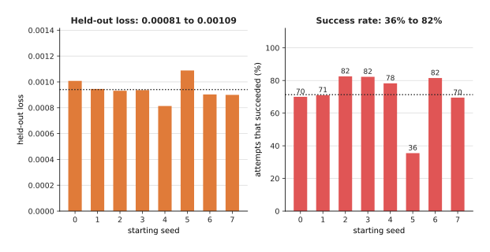

Eight runs of the same training, differing only in the random number that sets the starting weights, end with held-out losses from 0.00081 to 0.00109 and success rates from 35.5% to 82.5%.

That is the other half of the answer, because training does not give the same result
twice when the starting weights are drawn at random. A difference of ten points
between two models trained by the same recipe with different seeds is not evidence of
anything, so train the same thing three or four times to learn the spread.

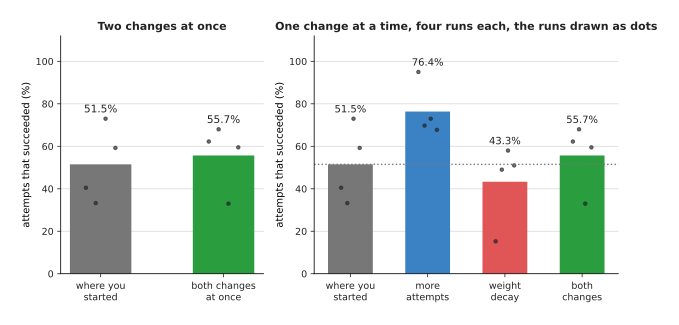

Making two changes together takes the success rate from 51.5% to 55.7%, while measuring them separately shows more attempts was worth 24.9 points on its own and the weight decay cost 8.2 points.

That leads to the discipline the whole page depends on, which is to change one thing
at a time, and which everybody drops because a failed run leaves four promising
things to try and one night to try them in. In the picture both changes were made
together, so the person who made them writes that both helped, and is wrong about
one, since the decay made things worse in all four paired runs.

The habit that prevents this is three lines of work per run. Write down before the
run what the one difference is and what you expect, write down afterwards what
happened with the seed, the number of trials and the range around the success rate,
and re-run the thing you changed from in the same session, because the cell has moved
since your last notebook entry. Read each row of the table below as: if you see the
thing in the first column, do the thing in the second column next.

| Symptom | The cheapest test | What it usually means |
| --- | --- | --- |
| The loss does not fall at all | Train on eight examples until the loss reaches nothing | The rate is outside its band, the inputs are not on one scale, or something is frozen |
| The loss stops at a floor | Work out the noise in the labels, then try a wider model and a cut learning rate | The floor is in the data, or the rate is too large to settle |
| The held-out loss does not follow | Read the held-out curve from step one, and retrain on a quarter of the data | Overfitting if the curve turned upwards, a split across a gap if it was never low |
| The losses are fine and the arm fails | Run twenty closed-loop attempts | The loss averages over steps, the task is a threshold, and the policy visits its own situations |
| It works only on the trained objects | Hold back whole kinds, and scramble a group of readings | The model learned which object it was looking at, not the property |
| It works in the simulator only | Put each real-world difference into the simulator one at a time | Delay and calibration, usually, not the model |
| It worked last week | Run last week's file again today, beside today's | The trials or the seed, not any change you made |

---

## 8. Where to read next

- [Running and evaluating a model](../14_using-a-model-for-real/01_running-and-evaluating-a-model.md)
  is what to read next, because a model that now works has to be run on a real
  machine and judged honestly, and it owns the trials and ranges sections 4 and 7
  lean on.
- [Recipes for models that act and predict](05_recipes-for-models-that-act-and-predict.md)
  is the page this one follows, and where to return once a symptom has told you which
  recipe decision to revisit.
- [Recipes for models that see and understand](04_recipes-for-models-that-see-and-understand.md)
  holds the same for classifiers, detectors and vision-language jobs, where section
  5's object problem bites hardest.
- [The order of the work](02_the-order-of-the-work.md) arranges the milestones so
  that each of these symptoms appears as early and as cheaply as it can.
- [Overfitting and generalisation](../04_making-training-work/01_overfitting-and-generalisation.md)
  is the full treatment of section 3, including how to split robot data along the
  right seam.
- [Evaluation and failure](../../07_learned-models/10_making-models-work-on-an-arm/02_most-used/03_evaluation-and-failure.md)
  is the catalogue page for testing a model on a real arm, with a worked evaluation
  of a picking job.

---

## 9. Using it in Python

The four most useful checks on this page are short, and this block is all of them,
with comments naming the section each comes from. It runs as it stands, and the
numbers in the comments are what it printed.

```python
import os
os.environ.setdefault("OMP_NUM_THREADS", "1")

import numpy as np
import torch
from torch import nn
from scipy.stats import beta

torch.manual_seed(0)
policy = nn.Sequential(nn.Linear(8, 32), nn.ReLU(), nn.Linear(32, 32), nn.ReLU(),
                       nn.Linear(32, 2))

# Section 1. The single-batch test. Eight examples, 2,000 steps, and the loss
# has to reach nothing. If it does not, the fault is in the code, not the data.
x = torch.randn(8, 8)
y = torch.randn(8, 2)
opt = torch.optim.Adam(policy.parameters(), lr=3e-3)
for step in range(2000):
    loss = ((policy(x) - y) ** 2).mean()
    opt.zero_grad()
    loss.backward()
    opt.step()
print(f"single batch: {loss.item():.2e}")          # single batch: 3.49e-15

# Section 1. Nothing reaches a weight whose gradient is missing or all zero,
# so this names every layer the training is not actually changing.
blocked = [name for name, p in policy.named_parameters()
           if p.grad is None or float(p.grad.abs().max()) == 0.0]
print("weights nothing reaches:", blocked)         # weights nothing reaches: []

# The same two lines catch a layer that somebody froze and forgot about.
opt.zero_grad(set_to_none=True)
policy[0].weight.requires_grad_(False)
((policy(x) - y) ** 2).mean().backward()
print("after freezing one layer:",
      [name for name, p in policy.named_parameters()
       if p.grad is None or float(p.grad.abs().max()) == 0.0])   # ['0.weight']

# Section 2. The floor. Record the same situation twice, and the spread between
# the two recordings is the part of the loss no model can remove.
rng = np.random.default_rng(0)
truth = rng.normal(0.0, 0.25, size=4000)
first = truth + rng.normal(0.0, 0.11, size=4000)
second = truth + rng.normal(0.0, 0.11, size=4000)
print(f"floor at least {0.5 * float(np.mean((first - second) ** 2)):.4f}")
                                                   # floor at least 0.0120

# Section 4. A success rate is a count of whole attempts, and this is its exact
# 95% range, which is what says whether two policies really differ.
for successes, trials in ((17, 20), (170, 200)):
    lo = beta.ppf(0.025, successes, trials - successes + 1)
    hi = beta.ppf(0.975, successes + 1, trials - successes)
    print(f"{successes}/{trials} = {100 * successes / trials:.0f}%"
          f" from {100 * lo:.1f}% to {100 * hi:.1f}%")
          # 17/20 = 85% from 62.1% to 96.8%
          # 170/200 = 85% from 79.3% to 89.6%

# Section 7. One change is worth reporting only if it beats the spread between
# seeds, so train the same thing several times before believing anything.
big_x, big_y = torch.randn(256, 8), torch.randn(256, 2)
scores = []
for seed in range(5):
    torch.manual_seed(seed)
    net = nn.Sequential(nn.Linear(8, 16), nn.ReLU(), nn.Linear(16, 2))
    opt = torch.optim.Adam(net.parameters(), lr=3e-3)
    for step in range(300):
        loss = ((net(big_x) - big_y) ** 2).mean()
        opt.zero_grad()
        loss.backward()
        opt.step()
    scores.append(loss.item())
print(f"five seeds: {min(scores):.4f} to {max(scores):.4f}")
                                                   # five seeds: 0.6171 to 0.6975
```

The library does two of these four for you. PyTorch keeps a gradient on every
parameter it was asked to track, so the check for a layer nothing reaches is two
lines, and `scipy.stats.beta` gives the exact range around a count of successes.

What no library will do is the single-batch test or the floor, because neither
produces an error message and both answer a question the framework does not know you
are asking. You also still decide everything in section 7, since no library keeps
your experiment log, none will stop you changing two things at once, and none knows
that your old number was measured in different light.
