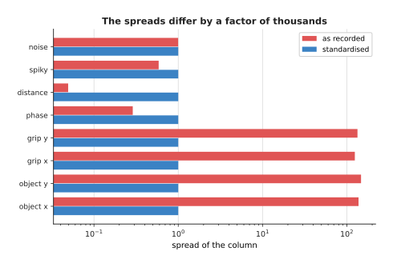
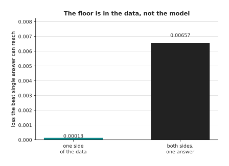
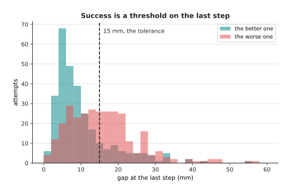
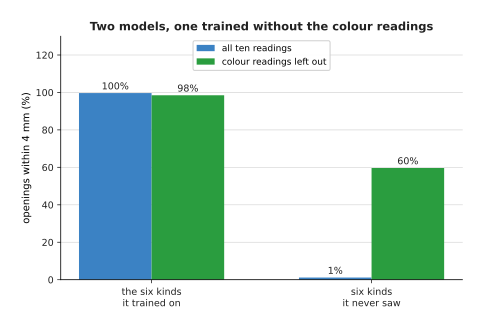
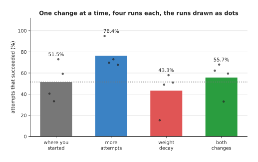

# When it does not work

The page before this one, [recipes for models that act and
predict](05_recipes-for-models-that-act-and-predict.md), gave a starting recipe for each
family of model that makes a robot move. Every one of those recipes ends in the same
place. You type a training command, and then you wait. This page is about what to do when
the result does not work. That outcome is the normal first one rather than a rare
accident, and saying so plainly matters, because otherwise a first failure reads as proof
that you are not clever enough.

The page is organised by symptom rather than by cause, because a symptom is what you
actually have in front of you. You have a curve that did not fall, or two curves that
moved apart, or an arm that knocked a mug over. Each section takes one symptom and answers
three questions about it. What does the symptom mean? What is the cheapest test that tells
you which cause you have? What do you change afterwards? By the end you will have a short
list of tests to run in order, and you will know which numbers to write down so that your
next run can be compared with this one. The page assumes you have read [the order of the
work](02_the-order-of-the-work.md).

Three words are used here in a narrow sense. The **loss** is a single number that says how
wrong the model's answers are on a set of examples, and training works by making it
smaller. A **held-out set** is a group of examples that training never sees, kept back on
purpose so that the model can be scored on examples it did not learn from; the loss
measured on that group is the held-out loss. A **success rate** is the fraction of whole
attempts that worked, counted by letting the model drive the robot and looking at where it
ended.

Two other pages own machinery that this page only diagnoses against. [Overfitting and
generalisation](../04_making-training-work/01_overfitting-and-generalisation.md) owns the
held-out set, and it also owns early stopping, dropout and weight decay, which are the
usual cures for the symptom in section 3. [Running and evaluating a
model](../14_using-a-model-for-real/01_running-and-evaluating-a-model.md) owns how a model
is judged on an arm, including why a success rate needs many attempts before it means
anything.

Every number below is printed by `docs/diagrams/starting_your_own_model_6.py`, and all of
its data is simulated. The script runs three simulated jobs. In the first, a gripper is
driven to an object lying on a table; a short written controller plays the part of the
demonstrator, a network is trained to copy its noisy recorded commands, and those weights
are then run in closed loop, which means the network's own commands move the arm. That
closed loop is what gives a task success rate as well as a loss. In the second job, two
demonstrators pass one obstacle on opposite sides. In the third job, a model says how wide
to open a gripper for the object in front of it.

## Contents

1. [The loss does not fall at all](#1-the-loss-does-not-fall-at-all)
2. [The loss falls to a floor well above zero and stops](#2-the-loss-falls-to-a-floor-well-above-zero-and-stops)
3. [The training loss falls and the held-out loss does not follow](#3-the-training-loss-falls-and-the-held-out-loss-does-not-follow)
4. [Both losses look fine and the robot still fails the task](#4-both-losses-look-fine-and-the-robot-still-fails-the-task)
5. [It works on the objects it was trained on and on nothing else](#5-it-works-on-the-objects-it-was-trained-on-and-on-nothing-else)
6. [It works in the simulator and not on the arm](#6-it-works-in-the-simulator-and-not-on-the-arm)
7. [It worked last week and does not now](#7-it-worked-last-week-and-does-not-now)
8. [Where to read next](#8-where-to-read-next)
9. [Using it in Python](#9-using-it-in-python)

---

## 1. The loss does not fall at all

The first symptom arrives within a minute of starting the run. You expect the loss to
fall, and instead you see a flat line.

This symptom almost never means too few examples. A network with enough weights can
memorise anything it is shown, so it can drive the loss to nothing even on a handful of
examples. This means that a model which cannot drive the error down on its own training
examples is wrongly arranged rather than short of data.

Before any run, work out one number to compare against: the loss you would get by
answering zero every time, without looking at the input at all. On this data that number
is 0.024181. Any loss near it means the model has learned nothing, whatever shape the
curve has.

The picture below shows four training runs. All four use the same data and the same
network. Only the learning rate differs between three of them, and the fourth has its
labels shuffled.


One network and 8,000 recorded commands: the loss falls at a learning rate of 0.003, and
it stays flat at a learning rate of 1.0, at a learning rate of 0.000001, and when the
labels are shuffled.

The **learning rate** says how big a step training takes down the slope of the loss, and
[gradient descent](../03_how-training-works/02_gradient-descent.md) explains what it is a
step of. The fourth curve uses the good learning rate, and it is flat only because its
labels were shuffled, which broke the connection between each input and its answer. It
ends at 0.02568, which is no better than the 0.024181 that answering zero every time
scores.

The cheapest test for this symptom is to shrink the data until the model cannot possibly
be short of it. The next picture does exactly that, with eight examples and 2,000 steps.


Eight examples and 2,000 steps: the network as written ends at 0.000000088, and the same
network with its first two layers frozen by accident stops at 0.00036.

Eight examples is a set that any correctly wired network memorises, so a run that cannot
reach nothing on them has a fault in the code. The red curve is such a run. Its first two
layers were locked when a published starting point was loaded, so training could not
change them, and no error message said so. Note that the shuffled labels pass this test as
well, which means the test proves only that your code can learn, not that it is learning
anything useful.

If that test passes, the usual cause is a learning rate outside the band that works. The
next picture measures how wide that band is, by running the same training at sixteen
learning rates between 0.0000001 and 3.2.


Only the band from 0.00032 to 0.03162 beats answering with zero, and the best value in
this short run of 1,200 steps is 0.03162, at a held-out loss of 0.00167.

That band is about a hundred times wide, which is narrow compared with the whole range of
rates people try. Below the band the loss falls so slowly that a few thousand steps look
flat. Above the band each step overshoots the bottom, so the loss bounces instead of
falling. Both cases draw the same flat line, so you cannot tell them apart by looking.
This means the sensible next step is to try a rate ten times smaller and a rate ten times
larger, and to see which direction helps.

The last common cause is inputs that were never put on one scale. The next picture shows
what happens when four of the eight input numbers are written in millimetres and the other
four are left as they were.


Four of the eight inputs written in millimetres instead of metres leave the run at a
held-out loss of 0.89920, and standardising every column brings it to 0.00105.

Standardising a column means subtracting its average and dividing by its spread, so that
every column arrives at the network with an average near zero and a spread near one. The
next picture shows what that does to the eight columns of this input.



The four columns written in millimetres have spreads of 138, 148, 125 and 134, while the
other four have spreads of 0.289, 0.0494, 0.586 and 0.997, and standardising sets all
eight to 1.

A single learning rate has to suit every weight at once. However, a weight that feeds on a
column with a spread of 138 needs much smaller steps than a weight that feeds on a column
with a spread of 0.05, so no single rate suits both groups. [Normalisation and
stability](../04_making-training-work/02_normalisation-and-stability.md) explains why the
arithmetic needs that repair. Once the loss does fall, the next question is how far down
it goes.

---

## 2. The loss falls to a floor well above zero and stops

The second symptom follows a fixed version of the first. The loss falls, then flattens at
a value that is not zero, and then stays there. The model is learning, so the question is
whether that floor is a fault or the right answer. Most people assume a fault and choose a
bigger model, so this section is about finding the floor first.

A floor exists whenever the labels themselves contain something no model can predict. In
this simulated job the demonstrator is sloppy far from the object and careful close to it,
so every recorded command carries some noise. The next picture shows one such run, with
the size of that noise drawn as a dashed line.


The training loss flattens at 0.000824 and the held-out loss at 0.000978, against a dashed
line at 0.000608, which is the variance of the noise in the recorded commands themselves.

The variance of the noise is the average of the squared difference between a recorded
command and the command the demonstrator meant to give. No model can predict that
difference, because nothing in the input tells it what the noise was. So the run ending at
1.61 times that number is close to the best that any model could do here. On real data you
find the same floor by recording one situation twice, because half the variance of the
difference between the two recordings is a lower limit on the loss.

Once you know the floor, you can ask whether the model is what holds you above it. The
test is one number to change and one run to wait for, and the next picture runs it eight
times.


Widening the hidden layers moves the held-out loss from 0.024602 at width 1 to 0.000896 at
width 4, and then only to 0.000879 by width 128.

The width of a hidden layer is how many units it has, so it is the simplest measure of how
big the model is. Width 1 scores the answering-with-zero number from section 1, which
means a model that small cannot do the job at all. However, going from width 4 to width
128 is a thirty-two fold increase in width, and it moves the held-out loss only from
0.000896 to 0.000879. This means the model was never the problem here.

There is a second kind of floor, and no model size will move it either, because it is in
the data. It appears when the same situation was demonstrated two different ways. The next
picture shows sixty demonstrated paths past a round obstacle, half of them going above it
and half going below it, together with the single path that least squares gives.


Thirty-six demonstrations go above the obstacle and twenty-four below, and each one clears
the obstacle's edge by at least 53.3 mm, while the single path that least squares gives
passes 31.4 mm inside that edge.

Least squares means choosing the one answer whose squared distance to all the labels is
smallest, which is what a plain network trained on a squared-error loss does. Here that
one answer is the average of going above and going below, and the average goes straight
through the obstacle. The next picture puts a number on the floor this creates.



The best single answer reaches a loss of 0.000133 when it is fitted to the paths that go
above only, and a loss of 0.006573 when it is fitted to both groups, which is 49.3 times
higher.

So the floor here is a property of the labels, and no amount of extra width or extra
training moves it. There are three repairs. You can narrow the job, so that only one way
round is demonstrated. You can add a reading to the input saying which way this attempt
goes, which turns one ambiguous question into two clear ones. You can also move to a model
that holds several answers at once, which is what [diffusion and flow
policies](../12_models-that-act/02_diffusion-and-flow-policies.md) are for.

The last cause of a floor is the cheapest one to remove. A learning rate large enough to
make good early progress is too large to settle at the end, because each step keeps
jumping past the bottom. The next picture compares one run that keeps its rate with one
that cuts the rate by ten part way through.


The same run with the learning rate held at 0.01 ends at a held-out loss of 0.001213, and
with the rate cut to 0.001 half way through it ends at 0.000788.

Cutting the rate removed a third of the remaining loss, and it took one line of code. A
floor is at least an honest number. The number in the next section is not.

---

## 3. The training loss falls and the held-out loss does not follow

The third symptom is the one everybody has been warned about, and few people recognise it
in time. The training loss keeps falling, while the loss on the examples kept back stops
falling or turns upwards. That means the model is learning the particular examples it was
given rather than the pattern in them, which is called **overfitting**. The other page
owns the cures, so this section is about recognising the symptom.

The next picture shows one long run on a deliberately small training set, with both losses
scored every 250 steps.


Four demonstrated attempts, 160 recorded rows and a network of width 128: the held-out
loss is best at 0.00956 at step 15,500 and climbs to 0.01336 by step 20,000, while the
training loss falls to 0.000012.

Those two numbers finish 1,155 times apart, and the held-out loss at the end is 1.40 times
its own best value. So somebody watching only the training curve would stop at step 20,000
holding a model noticeably worse than the one they already had at step 15,500. The first
thing to do therefore costs nothing. Score the held-back examples often, and keep a copy
of the weights every time they reach a new low.

The second thing to find out is whether more data would fix it, and you can answer that
with the data you already have. Train the same model on a quarter of your attempts, then
on half, then on all of them, and watch how the two losses move. The next picture does
that at seven sizes.


More attempts close the gap between the two losses from more than twenty thousand times at
3 attempts, to 7.2 times at 12 attempts, to 2.4 times at 50 attempts, to 1.2 times at 200
attempts.

Read the right-hand end of that picture. A curve still falling steeply there says that
collecting more attempts is worth the effort, and three short runs are enough to tell you.

There is also a curve that looks like overfitting and is not, and a curve that looks fine
and is not. Both come from choosing the held-out set badly. The next picture scores one
single run against its own training rows and against three different held-out sets.


One run scored four ways: 0.00074 on its own training rows, 0.00074 on rows taken out of
the training attempts, 0.00205 on whole attempts it never saw, and 0.01154 on attempts
with the object further out.

The dashed purple curve holds rows that were taken at random out of the training attempts.
One attempt is forty steps long, and two steps next to each other look nearly the same, so
this split leaves nearly identical moments on both sides of it. That is why the purple
curve lies on the training curve and reports a score that is too good. The orange curve
holds whole attempts instead, which is the honest split for robot data. The red curve
holds attempts where the object was placed further out than anything in the training set,
so it asks a different question: not whether the model learned the pattern, but whether
the pattern reaches that far. This means you should read the shape of a curve rather than
its height. A curve that falls and then turns upwards is overfitting. A curve that was
never low, like the red one, is asking a question the training data cannot answer.

---

## 4. Both losses look fine and the robot still fails the task

The fourth symptom confuses people most. Unlike the three above, it belongs to robots
rather than to machine learning in general. Both losses fell, they agree with each other,
the flattening happened near the floor from section 2, and then you run the thing on the
arm and it misses the object half the time.

To show why, the script trains sixty policies on the same data, differing only in width,
in starting seed and in how many steps they ran for. Each one is then scored twice: once
on held-out commands, and once by 300 attempts in which the policy drives the arm itself
and succeeds if the gripper finishes within 15 mm of the object. The next picture puts
those two scores against each other.


Sixty policies scored twice: two of them have held-out losses of 0.00103 and 0.00107, four
parts in a hundred apart, and they succeed 81% and 50% of the time.

Across all sixty the two scores do agree, with a rank correlation of -0.950. A **rank
correlation** says how closely one ordering matches another, where -1 means the two
orderings are exact opposites, 0 means they are unrelated, and the sign is negative here
because a lower loss goes with a higher success rate. However, that agreement comes
entirely from the bad policies. The eighteen policies that trained all the way down to the
floor have losses between 0.00079 and 0.00140 and success rates from 40.3% to 98.3%, and
within that group the rank correlation falls to -0.825. The lowest loss of all succeeds
93.3%, while the best of the sixty succeeds 98.3% with a worse loss.

There are two reasons for this, and the first is the shape of the two measurements. The
loss averages over all forty steps of every attempt, while the task is a threshold applied
once, at the end. The next picture follows the two circled policies step by step.


The two circled policies close almost the same amount of the gap over the attempt, and
they finish a median of 7.4 mm and 14.9 mm from the object.

The tolerance is 15 mm, so the second policy's attempts finish right on the line that
decides them. The next picture shows where all 300 attempts of each policy finished.



The better policy's attempts are grouped below the 15 mm line, while the worse policy's
attempts fall on both sides of it, so a few millimetres on one side of one line produce
the whole 31-point gap in success.

The second reason is deeper, and it is the one worth remembering. The held-out loss asks
whether the model would have sent the demonstrator's command from a moment the
demonstrator was in. The task asks whether the arm arrives when the model is driving.
Those two questions differ because the model's own small errors move the arm away from
where the demonstrator ever went, and from there the model is answering about situations
it was never trained on. The next picture measures the model's command error in both
places, on the eighteen policies that reached the floor.


On the situations the demonstrator reached, these eighteen policies have errors within a
factor of four of each other, and on the situations they drive themselves into the errors
spread over a factor of ten.

The error on the policy's own situations also tracks success more closely, with a rank
correlation of -0.932 against -0.874 for the error on the demonstrator's situations.
[Behaviour cloning and action
chunks](../12_models-that-act/01_behaviour-cloning-and-action-chunks.md) explains why
copying a demonstrator has this problem built in.

So the cheapest test for this symptom is to run the thing on the arm. That measurement is
far noisier than the loss it replaces, because each attempt either works or does not, and
a small number of attempts can come out either way by chance. The next picture shows how
the range around a measured success rate shrinks as the number of attempts grows.


Ten trials give 80.0% and 70.0% for two policies that really differ by 28 points, with
ranges of 44.4% to 97.5% and 34.8% to 93.3%, while 400 trials give 84.2% and 56.2% with
ranges that do not touch.

What to change afterwards is either the data or the model. You change the data by
recording demonstrations that start from the situations the policy drives itself into, so
that those situations stop being unfamiliar. You change the model by moving to one that
commits to a chunk of commands at once, because the model is then asked fewer times and
its own error has fewer chances to grow. [Running and evaluating a
model](../14_using-a-model-for-real/01_running-and-evaluating-a-model.md) shows how the
range around a success rate is built.

---

## 5. It works on the objects it was trained on and on nothing else

The fifth symptom arrives on the day you show somebody the robot and they put a seventh
object on the table. It means the model learned which of your six objects it was looking
at, rather than the property you cared about. That answer is correct for every question in
your training set and in your held-out set, so nothing you measured could have warned you.

The job used here is the third simulated one. A model is given ten readings about the
object in front of it and has to say how wide to open the gripper. The right opening
depends on the object's shape alone, and an answer counts as right within 4 mm. Four of
the readings describe the shape and are noisy. Three describe the colour and are crisp.
The remaining three are pure noise. Because the colour readings are the cleanest way to
tell one of six objects apart, the model is pulled towards reading the colour and then
giving the answer it memorised for that colour.

The next picture scores one such model on each of twelve kinds of object, six of which it
trained on.


One model trained on six kinds of object gets 99.9% of their openings right, and 0.7%
right on six kinds it never saw.

Those two numbers are what a learned lookup table looks like from outside. Nothing is
broken, no warning appears, and the model answers confidently. The failure being total
rather than gradual is the clue, because a model that had learned the shape imperfectly
would be somewhat right on new objects rather than entirely wrong.

The cheapest test is to hold back whole kinds of object instead of individual pictures. It
costs one extra training run. The next picture compares what the two splits report with
the truth.


Holding back rows from the same six kinds gives 100.0%, holding back two whole kinds gives
49.8%, and the truth on six kinds nobody had collected is 0.4%.

The left-hand bar is what a random split reports, and it hides the problem completely. The
middle bar is the cheap test, and it is still too generous, because two held-back kinds
that resemble the four trained ones make the model look better than it is. However, 49.8%
against 100.0% is already enough to tell you that something is wrong.

The question everybody asks next is whether to collect more pictures. The next picture
answers it by holding the total number of pictures at 1,800 and changing only how many
distinct objects those pictures are spread over.


The same 1,800 pictures spread over more kinds: one kind gives 4% on objects it never saw,
four kinds give 14%, nine kinds give 20% and twelve kinds give 39%, while the score on its
own kinds stays near 100%.

Because the total is fixed, the only thing that improved is the variety, so variety rather
than volume is what gives you an answer on a new object. The faint dots are the four runs
behind each point, and they are spread widely, which shows how much the result depends on
which objects you happen to own.

There is also a way to name the shortcut without training anything again. You take your
held-out examples, shuffle one group of readings between them, and score the model again.
If the score falls, the model was using that group. The next picture does this twice.


Scrambling the colour readings drops the model from 99.7% to 53.7%, and scrambling the
shape readings drops it to 49.5%.

The right opening cannot depend on colour, because the colour was assigned to each kind of
object at random. Even so, hiding the colour costs 46 points, which proves the model was
relying on it. The repair is to train again with those readings left out, and the next
picture shows what that costs and what it gains.



Training again with the colour readings left out gives 98.5% on the trained kinds, against
99.7% with them, and 59.7% on kinds it never saw, against 1.2% with them.

So removing the colour readings cost 1.2 points on familiar objects and gained 58.5 points
on new ones. [Where the data comes
from](../../07_learned-models/01_what-models-are/05_where-the-data-comes-from.md)
describes how robot datasets come to contain such shortcuts in the first place.

---

## 6. It works in the simulator and not on the arm

The sixth symptom is section 5's problem with the whole world as the object. The policy
succeeds in the simulator it trained in, and it fails on the arm. The phrase people use
for this is the reality gap. The useful response is not to name the gap and give up, but
to treat it as a list of named differences, because each difference can be put into the
simulator on its own and measured there.

The next picture does that for five differences, with 600 attempts behind every bar.


The policy succeeds 71.8% of the time in the simulator it trained in, 71.3% with noisier
sensors, 23.3% with the object reported 12 mm away from where it is, 37.8% with two
periods of delay, 78.2% with 15% weaker drive, and 27.5% with all four differences
together.

That is the cheapest test, because every bar is a run of the simulator rather than an hour
on the arm, and it puts the possible causes in order. The sensor noise costs almost
nothing. The weaker drive actually helps, because this policy overshoots the object and a
weaker arm overshoots less. So almost the whole gap here is the calibration error and the
delay.

Delay means the time between the world being as the policy sees it and the policy's answer
reaching the joints. It deserves its own picture, because it is the difference people
forget. The next picture adds it back one control period at a time.


Adding delay one control period at a time, at twenty commands a second, takes the success
rate from 72.6% to 61.5%, then 40.0%, then 23.9%, while the median gap at the last step
grows from 11.9 mm to 25.1 mm.

A simulator usually hands the policy the world as it is now and applies the answer at
once, so it has no delay at all. A real cell spends time exposing the camera, moving the
picture to the computer and putting the command on the bus, so it always has some. The
repair has two parts: make the loop faster, and put the delay you measured into the
simulator so that training sees it.

Some quantities you cannot measure, and for those there is a different repair. You record
in several simulators whose settings are each drawn from a range, which is called domain
randomisation. The next picture compares training at one setting with training across a
range, and it also separates out the one difference that should not be randomised.


Randomising delay, drive and sensor noise, and then measuring the 12 mm calibration error
and taking it out, lifts the arm from 27.5% to 88.2%, while the same randomised training
with that error left in gives 5.3%.

Domain randomisation works because a policy that has seen every value of a quantity cannot
rely on any one value of it, which makes it the right repair for a quantity you cannot
measure. A fixed calibration error is not such a quantity, because a ruler will find it.
Leaving it in makes things worse, and the reason is that randomising makes the policy act
more decisively, so it follows a steady wrong reading all the way to the wrong place.

---

## 7. It worked last week and does not now

The last symptom costs whole mornings. The cell and the model file are the same as they
were, and a task that worked ten times out of twelve on Thursday now fails more often than
it works. Before spending a day on what changed, it is worth knowing how often nothing
changed and the difference is only in the measurement.

The next picture measures one unchanged policy eight times, with 25 attempts each time, as
if each measurement were a different week.


One unchanged policy measured eight times with 25 trials each gives 68%, 52%, 64%, 80%,
64%, 76%, 68% and 72%, while all 200 trials together give 68.0%.

Only the places the object was put differ between those eight measurements. The spread is
28 points, so the week that measured 52% and the week that measured 80% would both be
reported as a real change, and neither one is. The cheapest test is therefore to run last
week's file again today, beside today's file, in the same session.

The other half of the answer is that training itself does not give the same result twice.
The starting weights are drawn at random, so a different random number gives a different
model from the same recipe and the same data. The next picture trains the same thing eight
times, changing only that number.


Eight runs of the same training, differing only in the random number that sets the
starting weights, end with held-out losses from 0.00081 to 0.00109 and success rates from
35.5% to 82.5%.

The losses are nearly identical and the success rates are not, which is section 4's point
again. It also means a difference of ten points between two models trained by the same
recipe with different random numbers is not evidence of anything. So train the same thing
three or four times before believing any comparison, in order to learn how wide its own
spread is.

That leads to the discipline the whole page depends on, which is to change one thing at a
time. Everybody abandons it, because a failed run leaves four promising things to try and
one evening to try them in. The next picture shows what the person who made two changes
together sees.


Making two changes together, more attempts and some weight decay, takes the success rate
from 51.5% to 55.7%, a gain of 4.2 points.

Weight decay is a small pull on every weight towards zero during training, and
[overfitting and
generalisation](../04_making-training-work/01_overfitting-and-generalisation.md) explains
what it is for. The person who made both changes writes down that both helped, because the
number went up. The next picture measures the same four conditions separately and shows
that they are wrong about one of them.



Measured separately, more attempts was worth 24.9 points on its own, taking 51.5% to
76.4%, while the weight decay cost 8.2 points on its own, taking 51.5% to 43.3%.

So the weight decay made things worse, and it made things worse in all four paired runs at
200 attempts. Making both changes together hid that, because the gain from one change was
larger than the loss from the other.

Three short notes per run prevent this. Before the run, write down what the one difference
is and what you expect from it. After the run, write down what happened, with the random
number you used, the number of attempts you measured, and the range around the success
rate. Then run the thing you changed from once more in the same session, because the cell
has changed since your last notebook entry, even if nobody changed it on purpose. Read
each row of the table below as follows: if you see the thing in the first column, do the
thing in the second column next, and expect the cause named in the third column.

| Symptom | The cheapest test | What it usually means |
| --- | --- | --- |
| The loss does not fall at all | Train on eight examples until the loss reaches nothing | The rate is outside its band, the inputs are not on one scale, or something is frozen |
| The loss stops at a floor | Work out the noise in the labels, then try a wider model and a cut learning rate | The floor is in the data, or the rate is too large to settle |
| The held-out loss does not follow | Read the held-out curve from step one, and retrain on a quarter of the data | Overfitting if the curve turned upwards, a split across a gap if it was never low |
| The losses are fine and the arm fails | Run twenty closed-loop attempts | The loss averages over steps, the task is a threshold, and the policy visits its own situations |
| It works only on the trained objects | Hold back whole kinds, and scramble a group of readings | The model learned which object it was looking at, not the property |
| It works in the simulator only | Put each real-world difference into the simulator one at a time | Delay and calibration, usually, not the model |
| It worked last week | Run last week's file again today, beside today's | The trials or the random number, not any change you made |

---

## 8. Where to read next

- [Running and evaluating a model](../14_using-a-model-for-real/01_running-and-evaluating-a-model.md)
  is what to read next, because a model that now works has to be run on a real machine and
  judged honestly, and it owns the trials and ranges that sections 4 and 7 lean on.
- [Recipes for models that act and predict](05_recipes-for-models-that-act-and-predict.md)
  is the page this one follows, and it is where to return once a symptom has told you which
  recipe decision to revisit.
- [Recipes for models that see and understand](04_recipes-for-models-that-see-and-understand.md)
  holds the same for classifiers, detectors and vision-language jobs, where section 5's
  object problem is worst.
- [The order of the work](02_the-order-of-the-work.md) arranges the milestones so that each
  of these symptoms appears as early and as cheaply as it can.
- [Overfitting and generalisation](../04_making-training-work/01_overfitting-and-generalisation.md)
  is the full treatment of section 3, including how to split robot data along the right
  seam.
- [Evaluation and failure](../../07_learned-models/10_making-models-work-on-an-arm/02_most-used/03_evaluation-and-failure.md)
  is the catalogue page for testing a model on a real arm, with a worked evaluation of a
  picking job.

---

## 9. Using it in Python

The four most useful checks on this page are short, and the block below is all of them,
with comments naming the section each one comes from. It runs as it stands, and the
numbers in the comments are what it printed.

```python
import os
os.environ.setdefault("OMP_NUM_THREADS", "1")

import numpy as np
import torch
from torch import nn
from scipy.stats import beta

torch.manual_seed(0)
policy = nn.Sequential(nn.Linear(8, 32), nn.ReLU(), nn.Linear(32, 32), nn.ReLU(),
                       nn.Linear(32, 2))

# Section 1. The single-batch test. Eight examples, 2,000 steps, and the loss
# has to reach nothing. If it does not, the fault is in the code, not the data.
x = torch.randn(8, 8)
y = torch.randn(8, 2)
opt = torch.optim.Adam(policy.parameters(), lr=3e-3)
for step in range(2000):
    loss = ((policy(x) - y) ** 2).mean()
    opt.zero_grad()
    loss.backward()
    opt.step()
print(f"single batch: {loss.item():.2e}")          # single batch: 1.06e-14

# Section 1. Nothing reaches a weight whose gradient is missing or all zero,
# so this names every layer the training is not actually changing.
blocked = [name for name, p in policy.named_parameters()
           if p.grad is None or float(p.grad.abs().max()) == 0.0]
print("weights nothing reaches:", blocked)         # weights nothing reaches: []

# The same two lines catch a layer that somebody froze and forgot about.
opt.zero_grad(set_to_none=True)
policy[0].weight.requires_grad_(False)
((policy(x) - y) ** 2).mean().backward()
print("after freezing one layer:",
      [name for name, p in policy.named_parameters()
       if p.grad is None or float(p.grad.abs().max()) == 0.0])   # ['0.weight']

# Section 2. The floor. Record the same situation twice, and the spread between
# the two recordings is the part of the loss no model can remove.
rng = np.random.default_rng(0)
truth = rng.normal(0.0, 0.25, size=4000)
first = truth + rng.normal(0.0, 0.11, size=4000)
second = truth + rng.normal(0.0, 0.11, size=4000)
print(f"floor at least {0.5 * float(np.mean((first - second) ** 2)):.4f}")
                                                   # floor at least 0.0120

# Section 4. A success rate is a count of whole attempts, and this is its exact
# 95% range, which is what says whether two policies really differ.
for successes, trials in ((17, 20), (170, 200)):
    lo = beta.ppf(0.025, successes, trials - successes + 1)
    hi = beta.ppf(0.975, successes + 1, trials - successes)
    print(f"{successes}/{trials} = {100 * successes / trials:.0f}%"
          f" from {100 * lo:.1f}% to {100 * hi:.1f}%")
          # 17/20 = 85% from 62.1% to 96.8%
          # 170/200 = 85% from 79.3% to 89.6%

# Section 7. One change is worth reporting only if it beats the spread between
# seeds, so train the same thing several times before believing anything.
big_x, big_y = torch.randn(256, 8), torch.randn(256, 2)
scores = []
for seed in range(5):
    torch.manual_seed(seed)
    net = nn.Sequential(nn.Linear(8, 16), nn.ReLU(), nn.Linear(16, 2))
    opt = torch.optim.Adam(net.parameters(), lr=3e-3)
    for step in range(300):
        loss = ((net(big_x) - big_y) ** 2).mean()
        opt.zero_grad()
        loss.backward()
        opt.step()
    scores.append(loss.item())
print(f"five seeds: {min(scores):.4f} to {max(scores):.4f}")
                                                   # five seeds: 0.6187 to 0.6976
```

The library does two of these four for you. PyTorch keeps a gradient on every parameter it
was asked to track, so the check for a layer that nothing reaches is two lines. The
function `scipy.stats.beta` gives the exact range around a count of successes, so you do
not have to work the arithmetic out yourself.

What no library will do is the single-batch test or the floor. Neither one produces an
error message, and both answer a question the framework does not know you are asking. You
also still decide everything in section 7 yourself, because no library keeps your
experiment log, none will stop you changing two things at once, and none knows that your
old number was measured in different light.
