# Running and evaluating a model

The chapter before this one ended with
[a page on what to do when your model does not work](../13_starting-your-own-model/06_when-it-does-not-work.md),
and the chapter before that finished the book's tour of the model families. Both leave you
in the same place. You have a model that has been trained. This page is about what happens
next, because a trained model is a file on a disk, and a working robot is something else.
The page answers two questions. The first question is what has to happen between that file
and an arm that moves. The second question is how you then find out, honestly, whether it
works.

The page is for a reader who has followed the book this far, so it assumes you know what
weights are, what a loss is, and what a policy gives back. It does not assume you have ever
put software into daily use. The things that go wrong here are not the things that go wrong
during training, and almost none of them show up as an error message. The page explains
each new word where that word first appears. Those words are **inference**, which means
running a trained model rather than training it, **runtime**, which is the program that
carries out the arithmetic, **throughput** and **latency**, which are two different ways of
being fast, **latency budget**, **success rate**, **ablation**, and
**out-of-distribution**. By the end you will be able to list what a checkpoint must contain,
work out whether a model fits inside your control loop, and say how many trials your claim
about a robot actually needs.

Every number in the pictures is worked out and printed by
`docs/diagrams/using_a_model_for_real.py`. One example policy runs through the whole page,
and one example machine runs it. That machine's speed, its memory bandwidth, and the
timings of the camera and of the arm's bus are stated example figures. They are not
measurements of any named piece of hardware. The colour-object experiments and the trial
experiments use made-up data from a random number generator with a fixed seed, so every run
of the script gives the same answer.

## Contents

1. [What a trained model is when it is a set of files](#1-what-a-trained-model-is-when-it-is-a-set-of-files)
2. [When the preprocessing does not match the training](#2-when-the-preprocessing-does-not-match-the-training)
3. [Export and runtimes: making the file run fast](#3-export-and-runtimes-making-the-file-run-fast)
4. [Batching: more answers a second, each one later](#4-batching-more-answers-a-second-each-one-later)
5. [A latency budget for one arm](#5-a-latency-budget-for-one-arm)
6. [Judging a model honestly: trials, not loss](#6-judging-a-model-honestly-trials-not-loss)
7. [Reading a failure, and the safety layer that is not learned](#7-reading-a-failure-and-the-safety-layer-that-is-not-learned)
8. [Where to read next](#8-where-to-read-next)
9. [Using it in Python](#9-using-it-in-python)

---

## 1. What a trained model is when it is a set of files

Training ends by writing files to a disk. Those files are the whole of what you have, so it
is worth knowing exactly what is in them.

The example policy used through this page works like this. It takes two camera pictures,
each 224 pixels high and 224 pixels wide. It also takes a reading of the arm's seven joints
and a short instruction written in words. It gives back the next sixteen commands. Inside,
its picture encoder is twelve transformer blocks at width 384, and its trunk is six blocks
at width 512. A **word piece** is a short piece of a word, such as `gras` or `ing`, and the
policy uses a table of 32,000 of them to turn the written instruction into numbers.

The picture below shows the five files that this one trained policy leaves on the disk. The
number under each box is how many things that file holds.

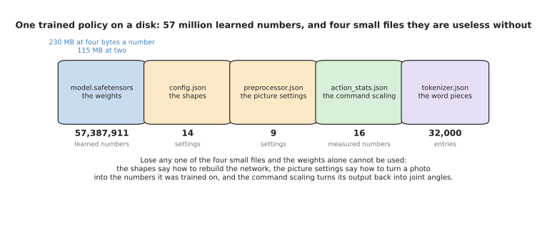

The trained policy is one large file of 57,387,911 learned numbers, together with four
small files that say what those numbers mean.

The large file holds the weights. Each weight is stored as four bytes, so the file is 229.6
megabytes. The four small files are the ones people forget, and each of them does a
separate job. The configuration file says how many blocks there are and how wide they are,
so that the right empty network can be built before the weights are poured into it. The
preprocessor file says what size to resize a photo to, what part of it to cut out, and
which mean and which spread to subtract and divide by. The command-scaling file holds the
smallest and the largest value that each controlled joint took during training. The
tokeniser file holds the 32,000 word pieces, so that the same sentence becomes the same
numbers it became in training.

It helps to know where the weights actually sit, because people assume the picture encoder
holds almost all of them. The chart below gives each part of the policy one bar, and the
bar is how many learned numbers that part holds.

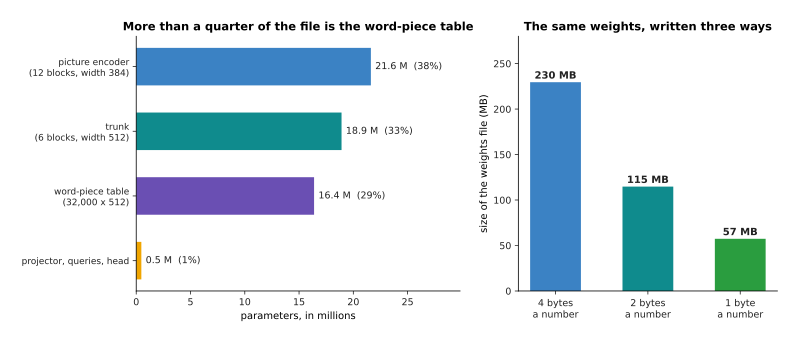

The picture encoder holds 37.7% of the weights, the trunk holds 33.0%, and the table of
word pieces holds 28.5%, which is more of the file than most people expect.

That table does no arithmetic at all. It is a lookup table, and it is large because 32,000
word pieces each turned into 512 numbers come to 16,384,000 parameters. So more than a
quarter of the file exists only to turn words into numbers.

The size of the file also depends on how many bytes each weight is written with. Writing a
weight with fewer bytes stores it less precisely, which the page on
[making a model smaller and faster](../07_pretraining-and-adapting/04_making-a-model-smaller-and-faster.md)
explains in full. The chart below shows the same weights written three ways.

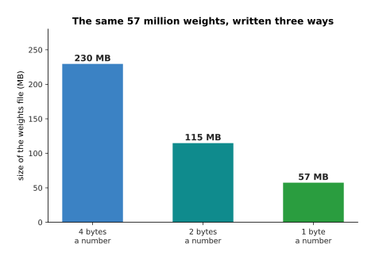

Writing the weights with two bytes a number instead of four halves the file to 114.8
megabytes, and one byte a number brings it to 57.4 megabytes.

That matters when the file has to be copied onto a robot's own small computer, because such
a computer often has little storage and little memory. After that, the preprocessor file
deserves the same care as the weights, because two sensible settings can give the network
two different pictures of one scene.

The four panels below are one scene seen four ways. The first panel is the picture the
camera produced. The second and third panels are that same picture prepared in the two ways
that real models use. The fourth panel shows, for each pixel, how far apart the two
prepared pictures are.

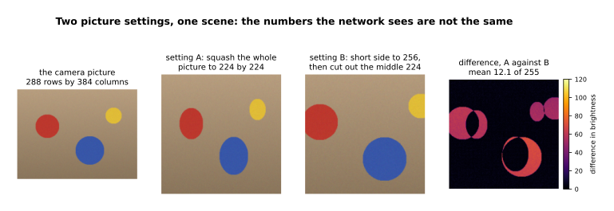

Squashing the whole simulated picture into a square, and cutting a square out of the middle
instead, leave numbers that differ by 12.1 out of 255 on average, and 16% of the pixels
differ by more than 10.

Neither setting is wrong, and real models use both. What is wrong is to use one of them
during training and the other one when the robot runs. The network is then shown a kind of
picture it never trained on, and nothing in the system knows that this has happened.

---

## 2. When the preprocessing does not match the training

Section 1 said that the small files decide what the weights mean. This section measures what
one wrong small file costs you.

The measurements come from a simulated experiment that the script runs in full. There are
four kinds of object, and each kind has its own colour. Each object is photographed under
lighting that varies at random. A small classifier is trained on 4,000 of these objects in
NumPy, and it is then tested on 2,000 more. With the same settings it trained with, it gets
95.5% of the test objects right.

Preprocessing a picture means subtracting a mean and dividing by a spread, so that the
numbers the network sees are centred near zero. If you divide by the wrong spread, nothing
breaks and no message is printed. The curve below shows what that costs. The horizontal
axis is the spread used when the model runs, written as a multiple of the spread it trained
with, so 1.0 means the setting is correct.

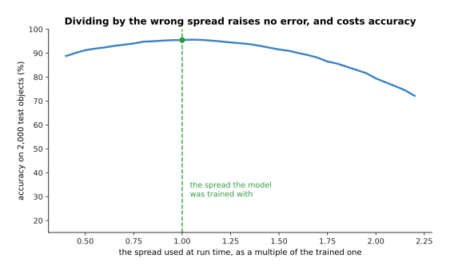

Dividing by twice the right spread drops the classifier from 95.5% to 79.5%, and dividing
by half the right spread drops it to 91.2%.

The second setting is the mean that is subtracted. The curve below is the same experiment
done on that setting instead. The horizontal axis is how far the mean is out, measured in
brightness units that run from 0 to 1.

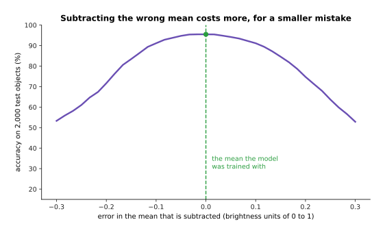

Subtracting a mean that is 0.2 too large drops the classifier from 95.5% to 74.8%, and a
mean that is 0.2 too small drops it to 71.7%.

The second curve falls more steeply for a smaller mistake. The reason is that shifting
every input by a fixed amount moves the whole cloud of points away from the boundaries the
classifier learned, while stretching the cloud leaves its centre where it was. In both
cases nothing fails and nothing is written to a log. The model answers every question
confidently, and it is simply worse than it was.

The commonest version of this fault is not a wrong number at all. It is a wrong order. A
colour picture is three numbers for each pixel, one for red, one for green and one for
blue, and those three are called the channels. One popular library hands back a picture
with blue first, and another hands it back with red first. The chart below compares the
same weights reading the channels in the trained order against the same weights reading
them with red and blue swapped.

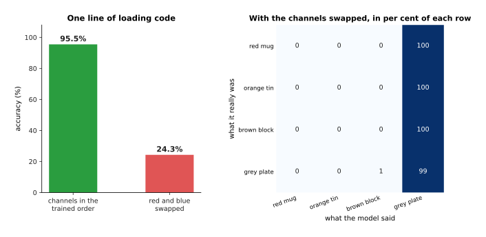

Swapping red and blue takes the same weights from 95.5% down to 24.3%.

With four kinds of object, guessing at random gets about 25% right, so the swap has taken
this model down to guessing. The next picture says why this fault is hard to notice. It is
a confusion matrix, which means a table whose rows are what the object really was and whose
columns are what the model said. Read along a row to see where that kind of object ended
up.

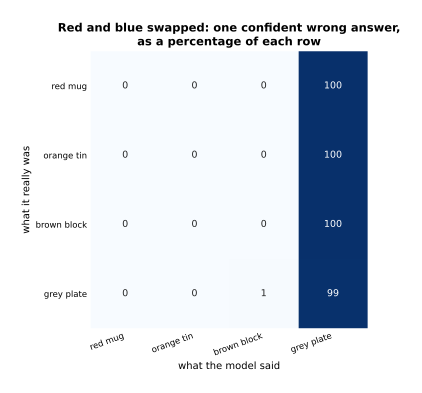

With red and blue swapped, the model calls a red mug, an orange tin and a brown block a
grey plate 100% of the time, and it calls a grey plate a grey plate 99% of the time.

So the model is not scattering its answers at random. It is giving one confident wrong
answer, over and over. That looks much more like a broken camera than like a broken
settings file, which is why people look in the wrong place for it.

The same fault has a second form, and this one is on the output side. A policy gives back
numbers between -1 and 1. Those numbers have to be turned back into joint angles, and the
command-scaling file does that by stretching the range -1 to 1 onto the range of angles
that the training data covered. The chart below draws the lowest and the highest value of
each joint, for the right file and for a wrong one that was loaded by mistake.

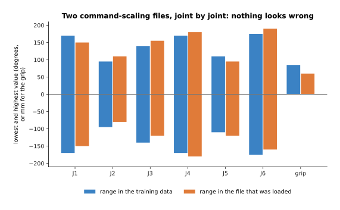

The two files look almost alike, and that is exactly the problem, because nobody checking
them by eye would stop on this picture.

The cost of the mistake only appears once the commands are sent. The chart below takes 400
commands from the policy, un-scales each one with the right file and again with the wrong
file, and shows how far apart the two answers are, joint by joint.

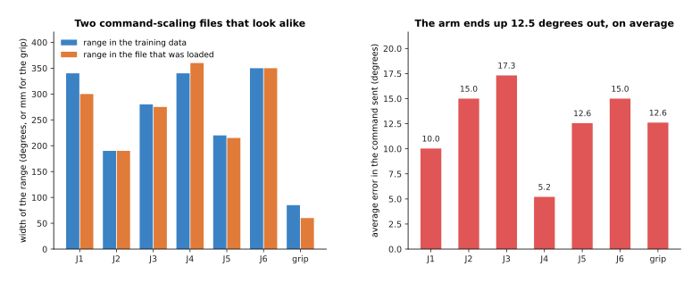

The wrong file sends the arm an average of 12.5 degrees away from where the model meant,
and up to 25.0 degrees on a single command.

Joint 3 is the worst at 17.3 degrees. The reason is not that its two ranges differ most in
width, because they differ by only 5 degrees. The reason is that the middle of its range
moves furthest: the right file runs from -140 to 140 degrees and the wrong one runs from
-120 to 155, so the centre shifts by 17.5 degrees and every command inherits that shift. An
arm that is 12 degrees out does not look like a software fault. It looks like a badly
trained policy, and people then spend weeks collecting more data to fix a one-line mistake.
The habit that prevents all of this is to save the preprocessing settings inside the
checkpoint, beside the weights, and never to retype them anywhere else.

---

## 3. Export and runtimes: making the file run fast

Section 2 got the right numbers into the model. This section gets the answer out of it
quickly.

Running a trained model is called **inference**, and the word exists to separate it from
training. The obvious way to do inference is to call the same training framework that made
the model. That works, and it is slow, for reasons that have nothing to do with the
arithmetic.

Start with the arithmetic itself, because that is the floor that nothing can go below. The
unit here is the multiply-add, which is one multiplication followed by one addition, and it
is the operation a neural network spends nearly all of its time on. The chart below counts
the multiply-adds in one decision and splits them by which part of the policy does them.
The scale is logarithmic, so each step along the axis is ten times the one before.

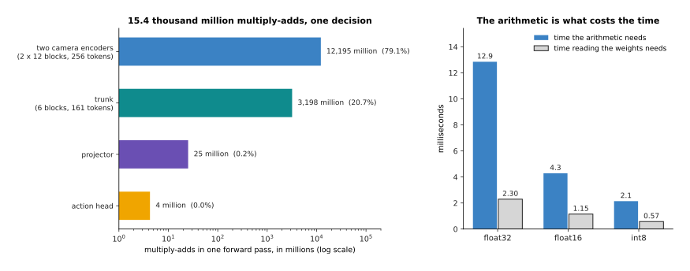

One decision costs 15.4 thousand million multiply-adds, and 79.1% of them belong to the two
camera encoders.

The example machine is stated to get through 1.2 million million multiply-adds a second
when numbers are four bytes, 3.6 million million when they are two bytes, and 7.2 million
million when they are one byte. It is also stated to move 100 thousand million bytes a
second to and from its memory. Those two abilities compete, because the machine has to read
every weight out of memory before it can use it. The chart below compares the time the
arithmetic needs with the time that reading the weights needs, at all three precisions.

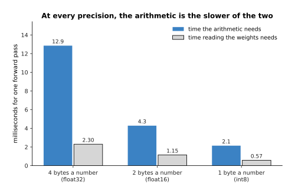

At four bytes a number the arithmetic takes 12.85 milliseconds and reading the weights takes
2.30, so the arithmetic is the slower of the two, and it stays the slower one at every
precision.

A model whose arithmetic is slower than its memory reading is said to be limited by
arithmetic, and this one is. So 12.85 milliseconds is the floor at four bytes a number. The
training framework does not reach that floor, because it hands the graphics processor one
small piece of work at a time and then waits for the answer before sending the next one.

Each of those hand-offs costs time whether the piece of work is large or small. The chart
below counts the pieces of work in one decision, first as the training framework runs them,
and then after they have been joined together.

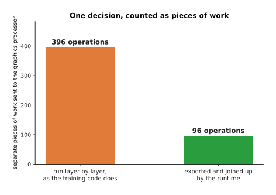

Joining the operations up turns 396 hand-offs into 96.

**Exporting** a model means writing it out as a fixed graph of operations, with no Python
left inside the loop. A **runtime** is the program that then carries that graph out. The
runtime sees the whole graph at once, so it can join a normalisation, a matrix multiply and
an activation into a single piece of work, and that is how 396 becomes 96. The chart below
turns that saving into milliseconds, at the example cost of five microseconds for each
hand-off.

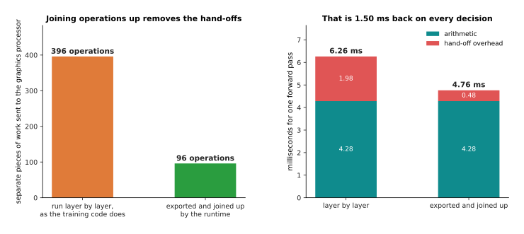

Removing 300 hand-offs at five microseconds each gives 1.50 milliseconds back, which is 24%
of the time the layer-by-layer version took.

Export is not one change, it is several, and they do not all buy the same thing. The
picture below lists them in the order you would apply them, with the time one forward pass
takes after each step.

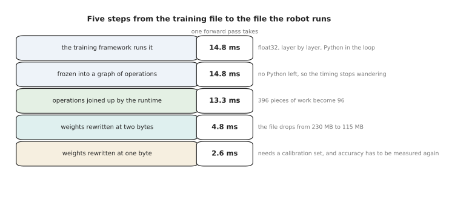

The same model goes from 14.8 milliseconds to 2.6 milliseconds in five steps, and each step
costs you something different.

Freezing the graph buys steadiness rather than speed, because the time one call takes stops
wandering with whatever else Python happened to be doing. Rewriting the weights with two
bytes a number is the large win, at 4.8 milliseconds, and one byte a number gets to 2.6.
However, that last step needs a calibration set, which is a small batch of real inputs used
to choose the scale of the smaller numbers, and the accuracy has to be measured again
afterwards, as
[making a model smaller and faster](../07_pretraining-and-adapting/04_making-a-model-smaller-and-faster.md)
explains. The reason to export rather than to keep calling the training framework is those
numbers. The cost is that the exported file is harder to look inside, and it has to be
built again every time the model changes.

---

## 4. Batching: more answers a second, each one later

Section 3 made one forward pass fast. The obvious next idea is to do several forward passes
at once.

Working out several answers in one call is called **batching**, and it is the first thing
anybody suggests when a model is too slow. It works because each call pays a fixed cost
once, however many items are in it. Here that fixed cost is 0.48 milliseconds of hand-offs,
1.15 milliseconds of reading the weights out of memory, and a stated 1.2 milliseconds of
waking the machine up and waiting for it to answer, which comes to 2.83 milliseconds. Each
item in the batch then pays 4.36 milliseconds of its own arithmetic and copying.

The two panels below are the same batching experiment measured two ways. The left panel
counts answers a second. The right panel counts milliseconds, both for the whole call and
for one decision's share of it.

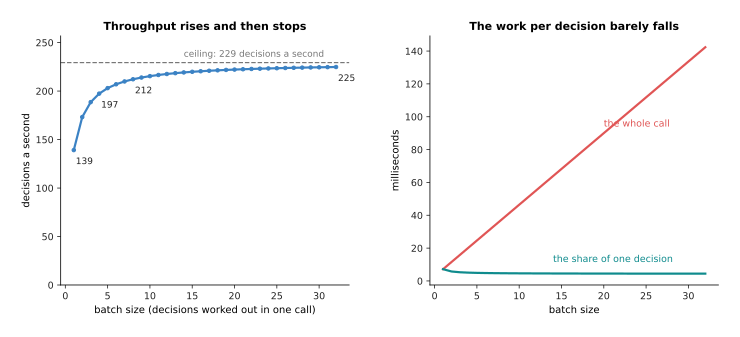

**Throughput**, which means answers a second, rises from 139 at a batch of one to 212 at a
batch of eight, and then creeps towards a ceiling of 229.

Most of the gain has arrived by a batch of four, which gives 197 a second. The reason is
that all batching can do is spread one fixed cost over more items, and that fixed cost is
only 2.83 milliseconds of the 7.19 milliseconds a single call takes. A batch of 32 gives
1.62 times the throughput of a batch of one, so batching is a modest win for a model whose
cost is mostly its own arithmetic.

The cost of that win falls on **latency**, which means the time from one picture arriving
to the command for that same picture going out. Latency gets worse because an arm cannot be
given an answer until the batch it is sitting in has been filled, and filling it means
waiting for other arms to ask. The chart below shows the worst time from picture to command,
for four different numbers of arms sharing one machine.

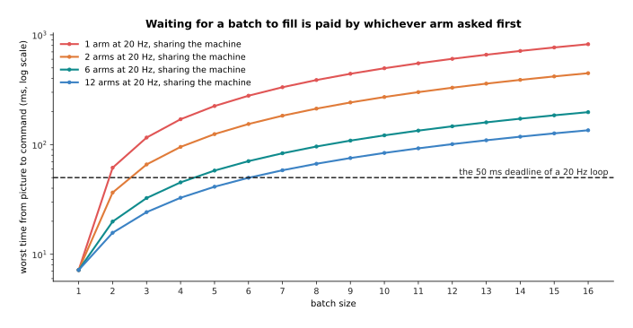

With one arm asking twenty times a second, no batch larger than one meets the 50
millisecond deadline, and it takes twelve arms sharing the machine before a batch of six
does.

Every extra place in the batch adds one more arrival interval of waiting for whoever asked
first. The timeline below follows that unhappy case all the way through, for two arms
sharing a batch of eight.

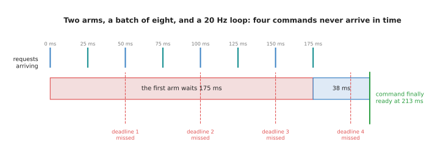

The first arm waits 175 milliseconds for the batch to fill, and its command is ready 213
milliseconds after its own picture arrived, by which time four 50 millisecond deadlines
have passed.

So batching is right in two situations. It is right when many arms share one machine, and
it is right when you are scoring a recorded dataset and nobody is waiting for the answer.
It is wrong for one arm inside a control loop.

---

## 5. A latency budget for one arm

Section 4 measured the model's own time. This section puts that time next to everything
else in the loop, because the model is never the only thing in it.

A **latency budget** is a written list of every stage between the light reaching the camera
sensor and the command reaching the arm, added up and compared with the period of the
control loop. The period is how long one turn of the loop is allowed to take. The example
here runs at 20 hertz, which means twenty turns a second, so the period is 50 milliseconds.
Every stage time below is a stated example except the forward pass, which is section 3's
measured 4.76 milliseconds.

The bar below is the whole budget, drawn end to end. Each coloured block is one stage, and
the dashed lines mark the periods of three different control rates.

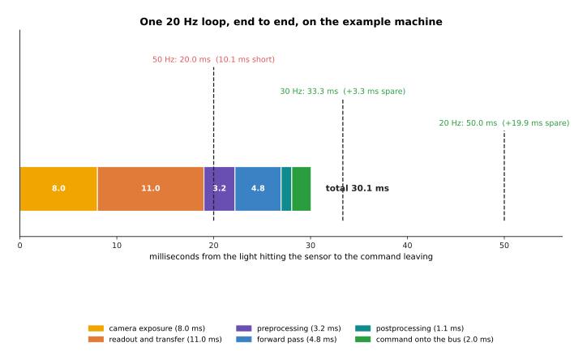

The whole loop takes 30.1 milliseconds, which leaves 19.9 milliseconds spare at 20 hertz
and 3.3 milliseconds spare at 30 hertz, and which falls 10.1 milliseconds short at 50
hertz.

The stages are these. The camera exposes for 8.0 milliseconds. It then reads the picture
out and sends it over the cable, which takes 11.0 more. The preprocessing of section 1
takes 3.2 milliseconds. The network takes 4.76. Turning the network's output back into joint
angles takes 1.1. Putting the command on the arm's bus takes 2.0. The budget does not fit
at 50 hertz, and that is a fact about the camera rather than about the network.

The two panels below are the same 30.1 milliseconds grouped two ways. The left panel gives
each stage its own bar. The right panel puts the two camera stages together and everything
else together.

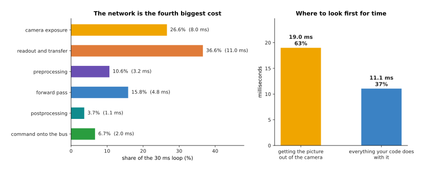

Getting the picture out of the camera takes 19.0 milliseconds, which is 63.2% of the loop,
while the network takes 15.8% of it.

The network is only the third largest cost, behind the camera's readout and its exposure.
So shaving a millisecond off the network is hard work for a small return, while buying a
faster camera is usually worth more. Exposing the next picture while the current one is
still being processed is worth more again, and it costs nothing but code.

There is one more way to buy time, and it comes from the policies of
[diffusion and flow policies](../12_models-that-act/02_diffusion-and-flow-policies.md),
which give back a whole chunk of future commands rather than one command. The timeline
below shows three such chunks, each one started before the last one ran out.

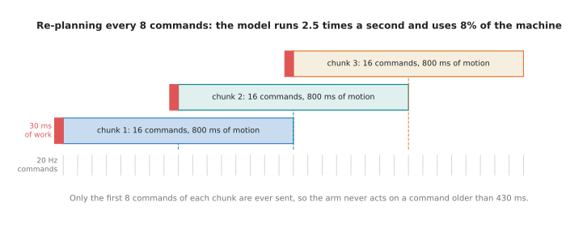

A chunk of sixteen commands covers 800 milliseconds of motion, so re-planning after every
eight commands means the model runs 2.5 times a second and uses 7.5% of the machine.

The arm still receives a command every 50 milliseconds. However, those commands now come
out of a list that the model wrote earlier, so the model's own deadline is 400 milliseconds
rather than 50. What this costs is freshness. The last command of each half-chunk was
worked out from a picture taken up to 430 milliseconds before it is used, which is far too
old if something in the scene is moving. So the question to ask is not how fast the arm can
be commanded. The question is how fast the world changes.

---

## 6. Judging a model honestly: trials, not loss

Sections 1 to 5 got the model running. This section asks whether it works.

The number that training gives you is a loss on a held-out set, which means a score on
examples the model never trained on. It is tempting to treat a lower loss as a better
robot, but those two things are only loosely tied together. The script shows this with 180
simulated policies. Each policy makes a small position mistake at every step of a 40-step
reach. The arm carries part of its error forward from one step to the next, and the grasp
succeeds only if the error never leaves an 11 millimetre tolerance. Some policies also make
a rare large mistake. Each dot below is one of those 180 policies, and the colour says how
often that policy makes a large mistake.

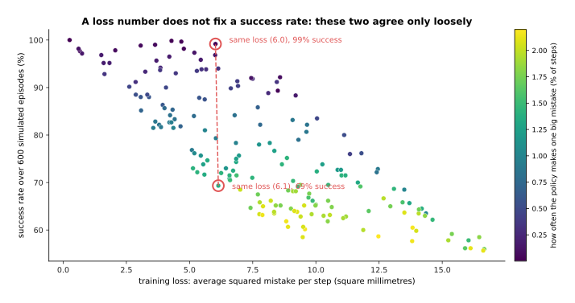

Loss and success rate agree only loosely, and two of the simulated policies, with losses of
6.1 and 6.0 square millimetres, succeed 69% and 99% of the time.

The reason is in the colour. A policy whose mistakes are small and steady keeps the arm
inside the tolerance even when its average squared error is large. A policy that throws one
large mistake every seventy steps fails whenever that mistake happens to land during a
grasp. The loss averages over steps, and the task does not average over anything, because
one bad step ruins the whole attempt. So the only honest measure of a robot policy is a
**success rate**, which means the fraction of whole attempts that worked.

That rate is only honest if the attempts were chosen before you saw any results. An
evaluation protocol is a list, written in advance, of how many trials you will run, where
the object starts in each one, and what counts as a success. The heat map below is that
list drawn out. The workspace is divided into 48 cells, twelve trials are run in each cell,
and the number in each cell is the share of those twelve that succeeded. The dots are where
the demonstrations put the object during training, and the dashed box encloses them.

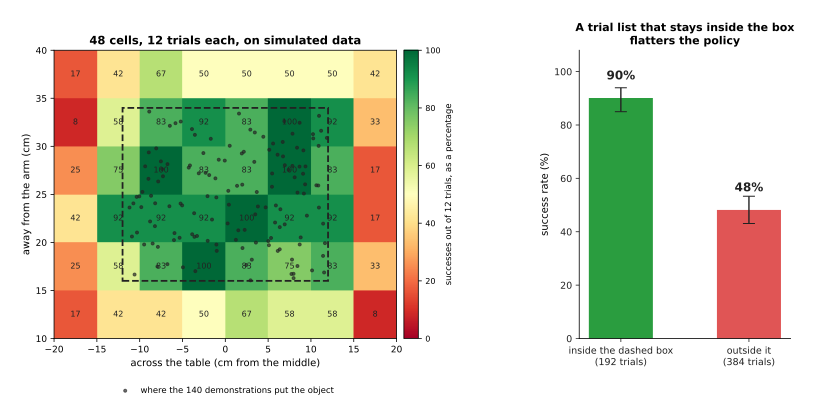

The policy succeeds almost everywhere inside the dashed box, and it falls away quickly
outside it.

The chart below adds those cells up on each side of the dashed box, so the two scores can
be compared directly. The black bars show the 95% confidence interval, which the next
picture explains.

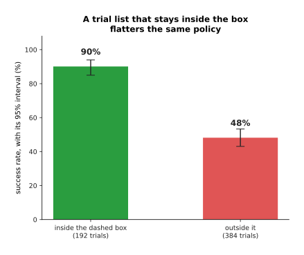

In this simulation the same policy scores 90% in the 192 trials inside the box the
demonstrations covered, and 48% in the 384 trials outside it.

Inputs that the model was not trained on are called **out-of-distribution**, which means
they come from a different mix of situations than the training data did. A trial list that
stays inside the green middle reports 90%, and that number is not a lie about anything
except what the robot will do tomorrow. The second thing the trial list decides is how many
trials to run, and this is where most reported numbers fall apart.

A 95% confidence interval is a range built so that, if you repeated the whole experiment
many times, the range would contain the true rate 95 times in 100. The chart below draws
that range for two scores, 70% and 90%, measured with six different numbers of trials.

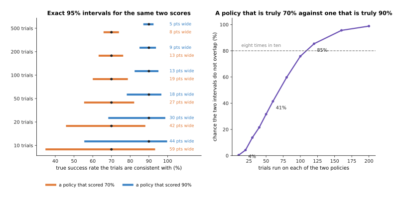

Eighteen successes in twenty trials is consistent with a true rate anywhere from 68.3% to
98.8%, so that interval is 30.5 percentage points wide, and the interval for a score of 70%
at twenty trials is 42.4 points wide.

Those two intervals overlap heavily, so twenty trials cannot tell the two policies apart.
The chart below puts an exact number on that. It takes two policies that really are 70% and
90%, runs the same number of trials on each, and asks how often the two intervals come out
separated.

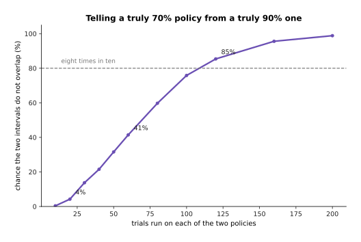

Twenty trials each tell a truly 70% policy from a truly 90% one only 4 times in 100, and it
takes about 120 trials each before that happens 85 times in 100.

So a table of twenty-trial numbers is a table of noise. The same arithmetic governs
**ablations**, which means taking one part of the system away and measuring what happens,
in order to find out which parts matter. The chart below runs four versions of the same
policy, 80 simulated trials each, and writes each version's training loss inside its bar.

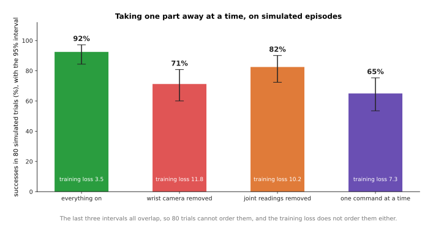

With 80 simulated trials each, the last three versions score 71%, 82% and 65%, their
intervals all overlap, and their training losses of 11.8, 10.2 and 7.3 put them in a
different order again.

Each bar is a separate simulation in which exactly one thing changes. Removing the wrist
camera makes every step noisier. Removing the joint readings adds a steady lean to one
side. Giving one command at a time, instead of a chunk, makes consecutive mistakes repeat.
The full system at 92% beats all three. However, the three cannot be put in order against
each other at 80 trials, and the loss ranks them differently again, so neither number on
its own would have told you which part to keep.

The last thing to be careful about is a benchmark number. A benchmark tells you how a model
did on somebody else's objects, lighting and arm. That helps you choose what to try, and it
says nothing about your own cell. The chart below measures the shape of that gap, using the
colour classifier from section 2 under four conditions.

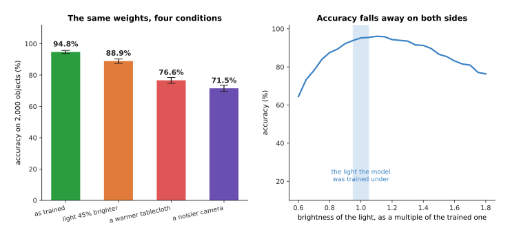

The same weights score 95.5% on the conditions they trained on, 87.8% under light that is
45% brighter, 76.6% against a warmer tablecloth and 71.5% through a noisier camera.

None of those four changes is dramatic, and none of them is anything a person would
mention, which is the point. The curve below sweeps the brightness continuously instead of
testing four fixed conditions, so you can see the whole shape of the fall.

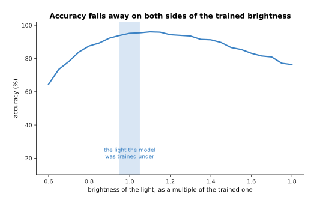

Accuracy falls away on both sides of the brightness the model trained under, reaching 64%
when the light is 0.6 times as bright and 76% when it is 1.8 times as bright.

On a real arm the list of such changes includes a sunnier afternoon, a new tablecloth, and
a replacement gripper whose fingers are three millimetres narrower, so that every grasp
closes slightly too early. Any one of them means running the evaluation again, because
nothing in the training promised anything about them.

---

## 7. Reading a failure, and the safety layer that is not learned

Section 6 counted failures. This section is about understanding a single one of them.

When an arm knocks a mug over, three different things can have happened, and from outside
the robot they look the same. The perception may have lost the object. The policy may have
chosen badly while seeing the scene perfectly well. The hardware may have refused to do
what it was told. Telling them apart means reading three recorded streams against each
other, so the next three pictures are three simulated episodes, one for each kind of
failure.

The first episode is a perception failure. The detector score is how sure the detector is
that it has found the object, and the target is the position the policy was handed.

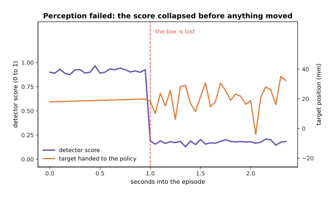

The detector score collapses first, and only after that does the target start jumping
about, by up to 25 millimetres from one step to the next.

The second episode is a policy failure. Here the detector keeps working, and the command
itself goes wrong, so the picture draws the command against the smooth answer a steady
policy would have sent.

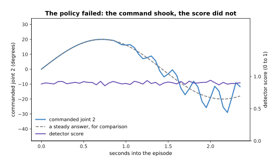

The command shakes at 4 hertz and grows to 9.8 degrees away from the smooth answer, while
the detector score stays at 0.90 and never moves by more than 0.07.

The third episode is a hardware failure. Here the command is smooth and correct, and the
joint does not follow it.

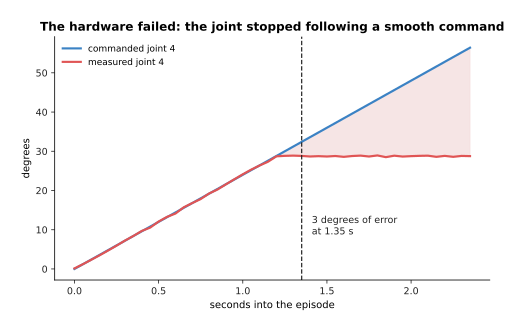

The measured joint stops at 28.8 degrees while the command keeps rising to 56.4, so the
tracking error passes 3 degrees at 1.35 seconds.

Read those three pictures as a procedure. Look at the perception output first, because if
the detector score fell before anything else moved then the policy was acting on nonsense.
If perception held steady, compare the command with what a steady policy would send,
because a command that oscillates at a few hertz is a policy flipping between two answers.
If the command is smooth, compare it with the measured joint position, because a gap that
grows is a motor, a cable or a collision, and no amount of retraining will help with any of
those.

That procedure only works if the streams were recorded, and recording everything is not
free. The two panels below are the same list of streams counted two ways. The left panel
gives each stream its own bar, on a logarithmic scale because they differ enormously. The
right panel adds them up.

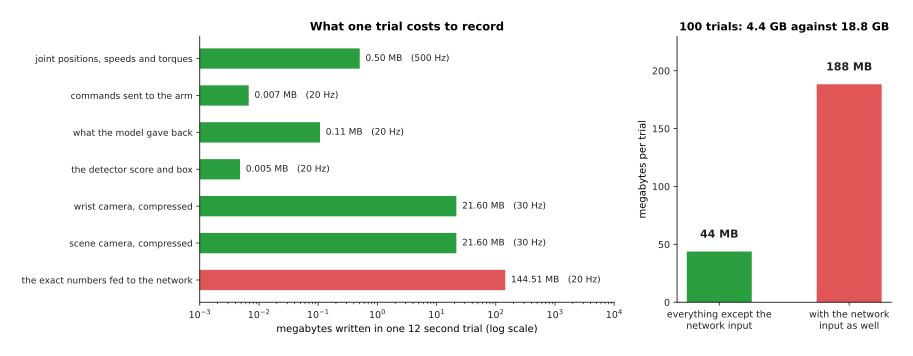

A twelve-second trial costs 43.8 megabytes when you keep the two compressed camera streams,
the joint readings at 500 hertz and the model's own output, so 100 trials come to 4.4
gigabytes.

The joint readings cost half a megabyte a trial, and the two compressed camera streams cost
21.6 megabytes each. The exact block of numbers fed into the network costs 144.5 megabytes
on its own, which is more than three times everything else put together, so keep that one
only for trials that failed. The page on
[sensor streams](../../06_programming-techniques/04_fitting-and-estimation/02_most-used/04_sensor-streams.md)
describes how such streams are recorded with their timestamps lined up, which matters here
because a log whose timestamps are not lined up cannot say which thing happened first.

The last thing to say about failure is that the model must not be the only thing protecting
the arm, because a trained network comes with no guarantee at all. Nothing in the training
says that its output will stay inside the joint limits. Nothing says that it will not ask
for an impossible speed. Nothing says that it will answer at all.

So a layer of ordinary written code sits between the model and the motors, and that layer
is not learned. Its first job is to clamp every command, which means refusing to pass on
anything outside the joint limits and anything that moves further in one period than the
speed limit allows. The chart below shows that clamp working on simulated commands.

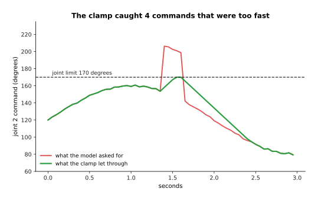

The clamp caught 4 of the 59 command changes, and it held the peak speed at the 90 degrees
a second limit instead of the 1,132 degrees a second the policy asked for.

The clamp's second job is to notice when no command arrives at all. A watchdog is a timer
that is reset by every command and that stops the arm if it ever runs out. The timeline
below shows one.

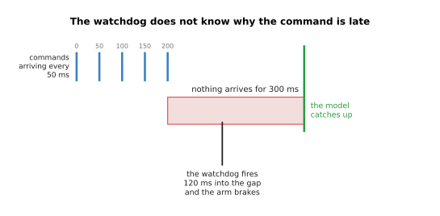

The watchdog brakes the arm 120 milliseconds into a 300 millisecond silence, which is 2.4
command periods, and it does that without knowing why the commands stopped.

So the written layer clamps every command to the joint limits, it limits how far a command
may move in one period, which at 20 hertz and 90 degrees a second is 4.5 degrees, it stops
the arm when the measured force passes a threshold, and it brakes the arm if no command
arrives within 120 milliseconds. The reason to write this layer rather than to train it is
that written code can be read, argued about and tested exhaustively, while a network
cannot. The cost is that the clamp sometimes spoils a legitimate fast motion. The
[safety monitoring](../../06_programming-techniques/07_control-and-motion/02_most-used/04_safety-monitoring.md)
page describes how such a layer is built, and
[proportional-integral-derivative (PID) control](../../06_programming-techniques/07_control-and-motion/02_most-used/01_pid-control.md)
describes the controller that sits underneath it.

---

## 8. Where to read next

- [The map of models](02_the-map-of-models.md) is the next page and the last of this book,
  and it maps every family the book explained, with a table of what to reach for.
- [Diffusion and flow policies](../12_models-that-act/02_diffusion-and-flow-policies.md)
  explains the action chunks and the control frequencies that section 5's budget depends on.
- [Making a model smaller and faster](../07_pretraining-and-adapting/04_making-a-model-smaller-and-faster.md)
  explains quantisation and distillation, which are the two largest levers in section 3's
  list of steps.
- [Overfitting and generalisation](../04_making-training-work/01_overfitting-and-generalisation.md)
  explains the split that section 6's loss number comes from.
- [Running a model on a robot](../../07_learned-models/10_making-models-work-on-an-arm/02_most-used/02_running-a-model-on-a-robot.md)
  is the catalogue page for this subject, written about real named models.
- [Evaluation and failure](../../07_learned-models/10_making-models-work-on-an-arm/02_most-used/03_evaluation-and-failure.md)
  is the catalogue page for section 6, with a worked mug-picking evaluation.

---

## 9. Using it in Python

Section 1 said that a checkpoint is weights plus settings. Section 3 timed a forward pass.
Section 6 turned a count of successes into a range. The code below does all three, with a
model small enough to run on any computer.

```python
import time
import numpy as np
import torch
from torch import nn

# Section 1. Save the settings with the weights, so the two cannot drift apart.
policy = nn.Sequential(nn.Linear(14, 64), nn.ReLU(), nn.Linear(64, 7))
settings = {
    "image_size": 224, "crop": "centre",                      # the preprocessor file
    "pixel_mean": [0.485, 0.456, 0.406], "pixel_std": [0.229, 0.224, 0.225],
    "channel_order": "RGB",                                   # section 2's commonest fault
    "action_low": [-170.0] * 7, "action_high": [170.0] * 7,   # the command scaling
}
torch.save({"weights": policy.state_dict(), "settings": settings}, "policy.pt")
print(sum(p.numel() for p in policy.parameters()))            # 1415

# Section 3. Freeze the graph, then time one forward pass properly: warm up first.
policy.eval()
example = torch.zeros(1, 14)
frozen = torch.jit.trace(policy, example)
with torch.inference_mode():
    for _ in range(50):
        frozen(example)
    start = time.perf_counter()
    for _ in range(500):
        frozen(example)
print(f"{(time.perf_counter() - start) / 500 * 1000:.3f} ms per call")

# Section 2. Un-scale with the settings that were saved, never with retyped ones.
low = np.array(settings["action_low"])
high = np.array(settings["action_high"])
with torch.inference_mode():
    raw = frozen(example).numpy()[0]                          # the -1 to 1 output
print(np.round(low + (raw + 1) * 0.5 * (high - low), 1))      # joint angles in degrees

# Section 6. The exact 95% interval for 18 successes in 20 trials.
from scipy.stats import beta
successes, trials = 18, 20
lo = beta.ppf(0.025, successes, trials - successes + 1)
hi = beta.ppf(0.975, successes + 1, trials - successes)
print(f"{100 * successes / trials:.0f}%  from {100 * lo:.1f}% to {100 * hi:.1f}%")
# 90%  from 68.3% to 98.8%
```

The parameter count of 1,415 is 14 times 64, plus 64 biases, plus 64 times 7, plus 7
biases. The interval of 68.3% to 98.8% is the one section 6's picture draws for eighteen
successes in twenty trials, and `scipy` works it out from the beta distribution in two
lines. The timing line prints whatever your own machine gives, and that is the one number
on this page that nobody can work out for you.

The libraries do a lot of this work for you. `torch.jit.trace` and the newer
`torch.compile` freeze the graph of section 3. ONNX Runtime and TensorRT are runtimes that
then join the operations up, where ONNX is the Open Neural Network Exchange format that
holds the frozen graph. The `transformers` and `timm` packages ship preprocessing settings
beside their weights, which makes section 2's fault harder to make in the first place.

What you still have to decide is everything the libraries have no view on. You choose the
control rate, and therefore the budget that every stage in section 5 must fit inside. You
choose what to log and what to throw away. You write the trial list of section 6 before you
run it, knowing now that twenty trials distinguish almost nothing. And you write the safety
layer of section 7 yourself, because it is the one part of the system that must still work
when the model is wrong.
