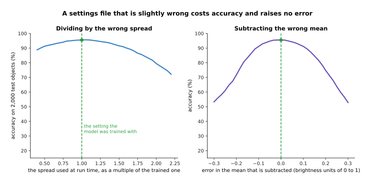
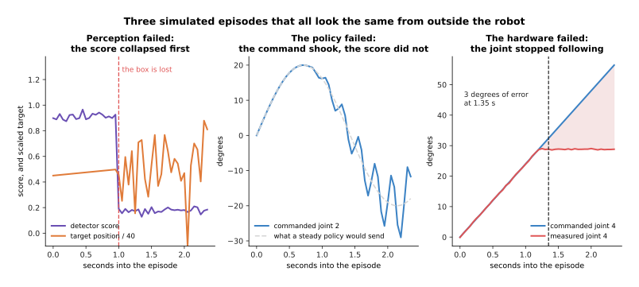
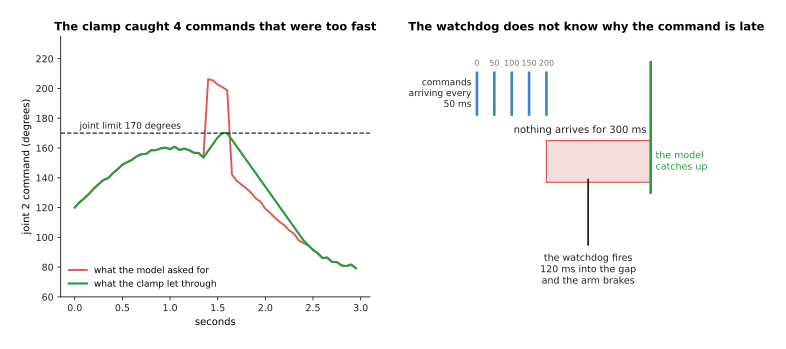

# Running and evaluating a model

The chapter before this one ended with [a page on what to do when your model does not
work](../13_starting-your-own-model/06_when-it-does-not-work.md), and the chapter before
that finished the book's tour of the families. Both leave you in the same place, with a
model that has been trained. This page is about what happens after that, because a
trained model is a file on a disk and a working robot is something else. It answers two
questions: what has to happen between that file and an arm that moves, and how do you
then find out honestly whether it works?

It is for a reader who has followed the book this far, so it assumes you know what
weights are, what a loss is and what a policy gives back. It does not assume you have
ever shipped anything, because the things that go wrong here are not the things that go
wrong in training, and almost none of them show up as an error message. The page
explains these words as it goes: **inference**, which is running a trained model rather
than training it, **runtime**, which is the program that carries out the arithmetic,
**throughput** and **latency**, which are two different ways of being fast, **latency
budget**, **success rate**, **ablation** and **out-of-distribution**.

Every number in the pictures is worked out and printed by
`docs/diagrams/using_a_model_for_real.py`. One example policy runs through the page and
one example machine runs it, and that machine's speed, its memory bandwidth and the
timings of the camera and the arm's bus are stated example figures rather than
measurements of any named hardware. The colour-object and trial experiments use made-up
data from a seeded random number generator.

## Contents

1. [What a trained model is when it is a set of files](#1-what-a-trained-model-is-when-it-is-a-set-of-files)
2. [When the preprocessing does not match the training](#2-when-the-preprocessing-does-not-match-the-training)
3. [Export and runtimes: making the file run fast](#3-export-and-runtimes-making-the-file-run-fast)
4. [Batching: more answers a second, each one later](#4-batching-more-answers-a-second-each-one-later)
5. [A latency budget for one arm](#5-a-latency-budget-for-one-arm)
6. [Judging a model honestly: trials, not loss](#6-judging-a-model-honestly-trials-not-loss)
7. [Reading a failure, and the safety layer that is not learned](#7-reading-a-failure-and-the-safety-layer-that-is-not-learned)
8. [Where to read next](#8-where-to-read-next)
9. [Using it in Python](#9-using-it-in-python)

---

## 1. What a trained model is when it is a set of files

Training ends by writing files to a disk, and those files are the whole of what you have.
The example policy used through this page takes two camera pictures of 224 by 224, a
reading of the arm's seven joints and a short instruction, and gives back the next
sixteen commands. Its picture encoder is twelve transformer blocks at width 384, its
trunk is six blocks at width 512, and a table of 32,000 word pieces turns the instruction
into numbers.


The trained policy is one large file of 57,387,911 learned numbers and four small files that say what those numbers mean.

The large file holds the weights, and at four bytes a number it is 229.6 megabytes.
The four small files are the ones people forget. The configuration file says how many
blocks there are and how wide, so the right empty network can be built before the
weights are poured into it. The preprocessor file says what size to resize a photo to,
what to cut out of it, and which mean and spread to subtract and divide by. The
command-scaling file holds the smallest and largest value each controlled joint took in
training, and the tokeniser file holds the 32,000 word pieces, so the same sentence
becomes the same numbers it became in training.


The picture encoder holds 37.7% of the weights, the trunk 33.0% and the table of word pieces 28.5%, which is more of the file than most people expect.

That table does no arithmetic at all, and 32,000 word pieces each turned into 512
numbers still comes to 16,384,000 parameters. Writing the weights with two bytes a
number instead of four halves the file to 114.8 megabytes, and one byte brings it to
57.4 megabytes, which matters when the file has to be copied onto a robot's own small
computer.

The preprocessor file deserves the same care as the weights, because two sensible
settings give the network two different pictures of one scene.


Squashing the whole simulated picture to a square and cutting a square out of the middle leave numbers that differ by 12.1 out of 255 on average, and 16% of the pixels differ by more than 10.

Neither setting is wrong, and both are used by real models. What is wrong is using one at
training time and the other when the robot runs, because the network is then shown a
picture it never trained on and nothing in the system knows it.

---

## 2. When the preprocessing does not match the training

Section 1 said the small files decide what the weights mean, so this section measures
what a wrong one costs. The measurements come from a simulated experiment the script runs
in full: four kinds of object, each with its own colour, photographed under lighting that
varies at random, with a small classifier trained on 4,000 of them in NumPy and tested on
2,000 more. With the settings it trained with it gets 95.5% right.



Dividing by twice the right spread drops the classifier from 95.5% to 79.5%, and subtracting a mean that is 0.2 too large drops it to 74.8%.

The green mark is the setting the model trained with. The right curve is steeper, because
shifting every input by a fixed amount moves the whole cloud of points away from the
boundaries the classifier learned. In both cases nothing fails and nothing is logged, and
the model answers every question confidently and is simply worse.

The commonest version of this fault is not a wrong number but a wrong order, because
one popular library hands back a picture with blue first and another with red first.


Swapping red and blue takes the same weights from 95.5% to 24.3%, and the model then answers "grey plate" for almost everything.

With four kinds of object, guessing at random gets about 25% right, so the swap has taken
this model down to guessing. The confusion matrix shows why it is hard to spot: the model
is not scattering its answers but giving one confident wrong answer, which looks more
like a broken camera than a broken settings file.

The same fault has a second form on the output side, because a policy gives numbers
between -1 and 1 that have to be turned back into joint angles using the ranges the
training data covered.


Two command-scaling files whose ranges differ by a few degrees send the arm an average of 12.5 degrees away from where the model meant, and up to 25.0 degrees on a single command.

The two files on the left look almost the same, which is the problem, and joint 3 is
worst at 17.3 degrees because its ranges differ most. An arm that is 12 degrees out does
not look like a software fault, it looks like a badly trained policy, and people spend
weeks collecting more data to fix a one-line mistake. The habit that prevents all of this
is to save the preprocessing settings inside the checkpoint and never retype them.

---

## 3. Export and runtimes: making the file run fast

Section 2 got the right numbers into the model, and this section gets the answer out
quickly. Running a trained model is called **inference**, to
separate it from training, and the obvious way to do it is to call the training framework
that made the model, which works and is slow for reasons that have nothing to do with the
arithmetic.


One decision costs 15.4 thousand million multiply-add operations, of which 79.1% is the two camera encoders, and on the example machine the arithmetic takes 12.85 milliseconds at four bytes a number.

The example machine is stated to get through 1.2 million million multiply-adds a second
at four bytes a number, 3.6 million million at two bytes and 7.2 million million at one
byte, and to move 100 thousand million bytes a second to and from memory. The right-hand
chart compares the time the arithmetic needs with the time it takes just to read the
weights, and the arithmetic wins at every precision, so this model is limited by
arithmetic. That is the floor, and the training framework does not reach it, because it
hands the graphics processor one small piece of work at a time and waits.


Joining operations up turns 396 hand-offs into 96, which at five microseconds each gives 1.50 milliseconds back, 24% of the layer-by-layer time.

**Exporting** a model means writing it out as a fixed graph of operations with no Python
left in the loop, and a **runtime** is the program that then carries that graph out. The
runtime sees the whole graph at once, so it can join a normalisation, a matrix multiply
and an activation into one piece of work, which is where 396 drops to 96.


The same model goes from 14.8 milliseconds to 2.6 milliseconds in five steps, and each step costs something different.

Freezing the graph buys steadiness rather than speed, because the time one call takes
stops wandering with whatever Python was doing. Rewriting the weights with two bytes a
number is the large win at 4.8 milliseconds, and one byte gets to 2.6, but that last step
needs a calibration set and the accuracy has to be measured again, as
[making a model smaller and faster](../07_pretraining-and-adapting/04_making-a-model-smaller-and-faster.md)
explains. The reason to export rather than keep calling the training framework is those
numbers, and the cost is that the exported file is harder to inspect and has to be built
again whenever the model changes.

---

## 4. Batching: more answers a second, each one later

Section 3 made one forward pass fast, and the obvious next idea is to do several at once.
Working out several answers in one call is called **batching**, and it is the first thing
anybody suggests when a model is too slow. Each call pays a fixed cost once, which here
is 0.48 milliseconds of hand-offs, 1.15 of reading the weights out of memory and a stated
1.2 of waking the machine, giving 2.83 milliseconds, and each item then pays 4.36
milliseconds of its own arithmetic and copying.


**Throughput**, which is answers a second, rises from 139 at a batch of one to 212 at a batch of eight, and then creeps towards a ceiling of 229.

Most of the gain arrives by a batch of four, at 197 a second, because all batching can
do is spread one fixed cost over more items, and that cost is only 2.83 of the 7.19
milliseconds a single call takes. A batch of 32 gives 1.62 times the throughput of a
batch of one, so batching is a modest win for a model whose cost is mostly its own
arithmetic.

The cost of that win falls on **latency**, which is the time from a picture arriving
to the command going out for that same picture, because an arm cannot be given an
answer until the batch it is in has been filled.


With one arm asking twenty times a second, no batch larger than one meets the 50 millisecond deadline, and it takes twelve arms sharing the machine before a batch of six does.

Every extra place in the batch adds one more arrival interval of waiting for whoever
asked first, and the timeline below follows the unhappy case in full.


Two arms sharing a batch of eight means the first arm waits 175 milliseconds for the batch to fill, and its command arrives 213 milliseconds late, four deadlines after it was needed.

So batching is right when many arms share one machine, or when you are scoring a
recorded dataset and nobody is waiting, and wrong for one arm in a control loop.

---

## 5. A latency budget for one arm

Section 4 measured the model's own time, and this section puts it next to everything
else, because the model is never the only thing in the loop. A **latency budget** is a
written list of every stage between the light reaching the camera sensor and the command
reaching the arm, added up and compared with the period of the control loop. The example
here runs at 20 hertz, so the period is 50 milliseconds, and the stage times are stated
examples apart from the forward pass, which is section 3's 4.76 milliseconds.


The whole loop takes 30.1 milliseconds, which leaves 19.9 milliseconds spare at 20 hertz, 3.3 milliseconds spare at 30 hertz, and falls 10.1 milliseconds short at 50 hertz.

The camera exposes for 8.0 milliseconds, reads out and sends the picture for 11.0 more,
the preprocessing of section 1 takes 3.2, the network takes 4.76, turning its output
back into joint angles takes 1.1, and putting the command on the arm's bus takes 2.0.
The dashed lines show which control rates this budget fits inside, and the fact that it
does not fit at 50 hertz is a fact about the camera rather than the network.


Getting the picture out of the camera takes 19.0 milliseconds, which is 63.2% of the loop, while the network takes 15.8%.

The model is only the fourth largest cost, so shaving a millisecond off the network is
work, while buying a faster camera, or exposing the next picture while the current one is
still being processed, is usually worth more.

There is one more trick, and it comes from the policies of
[diffusion and flow policies](../12_models-that-act/02_diffusion-and-flow-policies.md),
which give a whole chunk of future commands rather than one.


A chunk of sixteen commands covers 800 milliseconds of motion, so re-planning every eight commands means the model runs 2.5 times a second and uses 7.5% of the machine.

The arm still receives a command every 50 milliseconds, but those commands come out of a
list the model wrote earlier, so its own deadline is now 400 milliseconds rather than
50. The cost is freshness, because the last command of each half-chunk was worked out
from a picture taken up to 430 milliseconds earlier, which is too stale if something in
the scene is moving. The question to ask is how fast the world changes, not how fast the
arm can be commanded.

---

## 6. Judging a model honestly: trials, not loss

Sections 1 to 5 got the model running, and this section asks whether it works. The
number training gives you is a loss on a held-out set, and it is tempting to treat a
lower loss as a better robot, but those two things are only loosely tied together. The
script shows this with 180 simulated policies. Each makes a small position mistake at
every step of a 40-step reach, the arm carries part of its error forward, and the grasp
succeeds only if the error never leaves an 11 millimetre tolerance. Some also make a rare
large mistake.


Loss and success rate agree only loosely, and two of the simulated policies, with losses of 6.1 and 6.0 square millimetres, succeed 69% and 99% of the time.

The reason is in the colour. A policy whose mistakes are small and steady keeps the arm
inside the tolerance even though its average squared error is large, while a policy that
throws one big mistake every seventy steps fails whenever that mistake lands during a
grasp. The loss averages over steps and the task does not, so the only honest measure of
a robot policy is a **success rate**, which is the fraction of whole attempts that
worked.

That rate is only honest if the attempts were chosen before you saw the results. An
evaluation protocol is a list, written in advance, of how many trials you will run, where
the object starts in each one, and what counts as a success.


In this simulation the same policy scores 90% in the 192 trials inside the box the demonstrations covered and 48% in the 384 trials outside it.

Inputs the model was not trained on are called **out-of-distribution**, which means they
come from a different mix of situations than the training data did. A trial list that
stays in the green middle reports 90% and is not a lie about anything except what the
robot will do tomorrow. The second thing the list decides is how many trials to run, and
this is where most reported numbers fall apart.


Eighteen successes in twenty trials is consistent with a true rate anywhere from 68.3% to 98.8%, and twenty trials tell a truly 70% policy from a truly 90% one only 4 times in 100.

A 95% confidence interval is a range built so that, if you repeated the whole experiment
many times, the range would hold the true rate 95 times in 100. At twenty trials the
interval for a score of 90% is 30.5 percentage points wide and the one for 70% is 42.4
points wide, so they overlap heavily. The right-hand panel puts a number on the
consequence: two policies that really are 70% and 90% produce separated intervals only
4% of the time at twenty trials each, and you need about 120 trials each before that
happens 85% of the time. A table of twenty-trial numbers is a table of noise.

The same arithmetic governs **ablations**, which means taking one part of the system
away and measuring what happens, in order to find out which parts matter.


With 80 simulated trials each, the last three versions score 71%, 82% and 65%, their intervals all overlap, and their training losses of 11.8, 10.2 and 7.3 put them in a different order again.

Each bar is a separate simulation in which one thing changes: removing the wrist camera
makes every step noisier, removing the joint readings adds a steady lean, and giving one
command at a time makes consecutive mistakes repeat. The full system at 92% beats all
three, the three cannot be ordered against each other at 80 trials, and the loss ranks
them differently again.

A benchmark number tells you how a model did on somebody else's objects, lighting and
arm, which helps you choose what to try and says nothing about your cell. The script
measures the shape of that gap on the colour classifier from section 2.


The same weights score 95.5% on the conditions they trained on, 87.8% under light 45% brighter, 76.6% against a warmer tablecloth and 71.5% through a noisier camera.

None of those changes is dramatic and none is anything a person would mention, which is
the point. On a real arm the list includes a sunnier afternoon, a new tablecloth, and a
replacement gripper whose fingers are three millimetres narrower, so that every grasp
closes slightly too early. Any of them means running the evaluation again, because
nothing in the training promised anything about them.

---

## 7. Reading a failure, and the safety layer that is not learned

Section 6 counted failures, and this section is about understanding one. When an arm
knocks a mug over, three different things can have happened and from outside they look
the same: the perception lost the object, the policy chose badly while seeing perfectly
well, or the hardware refused to do what it was told. Telling them apart means reading
three recorded streams against each other.



In the perception failure the detector score collapses first, in the policy failure the command shakes by up to 9.8 degrees while the score stays high, and in the hardware failure the measured joint stops following its command and the tracking error passes 3 degrees at 1.35 seconds.

Read the three panels as a procedure. Look at the perception output first, because if
the detector score fell before anything else moved then the policy was acting on
nonsense. If perception held steady, compare the command with what a steady policy would
send, because a command that oscillates at a few hertz is a policy flipping between two
answers. If the command is smooth, compare it with the measured joint position, because
a gap that grows is a motor, a cable or a collision, and no amount of retraining will
help. That procedure only works if the streams were recorded, and recording everything
is not free.


A twelve-second trial costs 43.8 megabytes with the two compressed camera streams, the joint readings at 500 hertz and the model's own output, so 100 trials come to 4.4 gigabytes.

The joint readings cost half a megabyte a trial and the two compressed camera streams
cost 21.6 megabytes each, while the exact block of numbers fed into the network costs
144.5 megabytes on its own, so keep that one only for trials that failed. The page on
[sensor streams](../../06_programming-techniques/04_fitting-and-estimation/02_most-used/04_sensor-streams.md)
describes how such streams are recorded with their timestamps lined up, which matters
because an unaligned log cannot say which thing happened first.

The last thing to say about failure is that the model must not be the only thing
protecting the arm, because a trained network comes with no guarantee. Nothing in the
training says its output will stay inside the joint limits, nothing says it will not ask
for an impossible speed, and nothing says it will answer at all.



The clamp caught 4 of the 59 command changes, holding the peak speed at the 90 degrees a second limit instead of the 1,132 the policy asked for, and the watchdog brakes 120 milliseconds into a 300 millisecond silence.

So a layer of ordinary written code sits between the model and the motors, and it is not
learned. It clamps every command to the joint limits, it limits how far a command may
move in one period, which at 20 hertz and 90 degrees a second is 4.5 degrees, it stops
the arm when the measured force passes a threshold, and it brakes the arm if no command
arrives within 120 milliseconds. The reason to write this rather than train it is that
written code can be read, argued about and tested exhaustively while a network cannot,
and the cost is that the clamp sometimes spoils a legitimate fast motion. The
[safety monitoring](../../06_programming-techniques/07_control-and-motion/02_most-used/04_safety-monitoring.md)
page describes how such a layer is built, and
[proportional-integral-derivative (PID) control](../../06_programming-techniques/07_control-and-motion/02_most-used/01_pid-control.md)
describes the controller underneath it.

---

## 8. Where to read next

- [The map of models](02_the-map-of-models.md) is the next page and the last of this
  book, and it maps every family the book explained, with a table of what to reach for.
- [Diffusion and flow policies](../12_models-that-act/02_diffusion-and-flow-policies.md)
  explains the action chunks and control frequencies section 5's budget depends on.
- [Making a model smaller and faster](../07_pretraining-and-adapting/04_making-a-model-smaller-and-faster.md)
  explains quantisation and distillation, the two largest levers in section 3's table.
- [Overfitting and generalisation](../04_making-training-work/01_overfitting-and-generalisation.md)
  explains the split that section 6's loss number comes from.
- [Running a model on a robot](../../07_learned-models/10_making-models-work-on-an-arm/02_most-used/02_running-a-model-on-a-robot.md)
  is the catalogue page for this subject, for real named models.
- [Evaluation and failure](../../07_learned-models/10_making-models-work-on-an-arm/02_most-used/03_evaluation-and-failure.md)
  is the catalogue page for section 6, with a worked mug-picking evaluation.

---

## 9. Using it in Python

Section 1 said a checkpoint is weights plus settings, section 3 timed a forward pass, and
section 6 turned a count of successes into a range. This code does all three, with a
model small enough to run anywhere.

```python
import time
import numpy as np
import torch
from torch import nn

# Section 1. Save the settings with the weights, so the two cannot drift apart.
policy = nn.Sequential(nn.Linear(14, 64), nn.ReLU(), nn.Linear(64, 7))
settings = {
    "image_size": 224, "crop": "centre",                      # the preprocessor file
    "pixel_mean": [0.485, 0.456, 0.406], "pixel_std": [0.229, 0.224, 0.225],
    "channel_order": "RGB",                                   # section 2's commonest fault
    "action_low": [-170.0] * 7, "action_high": [170.0] * 7,   # the command scaling
}
torch.save({"weights": policy.state_dict(), "settings": settings}, "policy.pt")
print(sum(p.numel() for p in policy.parameters()))            # 1415

# Section 3. Freeze the graph, then time one forward pass properly: warm up first.
policy.eval()
example = torch.zeros(1, 14)
frozen = torch.jit.trace(policy, example)
with torch.inference_mode():
    for _ in range(50):
        frozen(example)
    start = time.perf_counter()
    for _ in range(500):
        frozen(example)
print(f"{(time.perf_counter() - start) / 500 * 1000:.3f} ms per call")

# Section 2. Un-scale with the settings that were saved, never with retyped ones.
low = np.array(settings["action_low"])
high = np.array(settings["action_high"])
with torch.inference_mode():
    raw = frozen(example).numpy()[0]                          # the -1 to 1 output
print(np.round(low + (raw + 1) * 0.5 * (high - low), 1))      # joint angles in degrees

# Section 6. The exact 95% interval for 18 successes in 20 trials.
from scipy.stats import beta
successes, trials = 18, 20
lo = beta.ppf(0.025, successes, trials - successes + 1)
hi = beta.ppf(0.975, successes + 1, trials - successes)
print(f"{100 * successes / trials:.0f}%  from {100 * lo:.1f}% to {100 * hi:.1f}%")
# 90%  from 68.3% to 98.8%
```

The parameter count of 1,415 is 14 times 64 plus 64 biases, then 64 times 7 plus 7
biases. The interval of 68.3% to 98.8% is the one section 6's picture draws for eighteen
successes in twenty trials, and `scipy` gets it from the beta distribution in two lines.
The timing line prints whatever your own machine gives, which is the one number on this
page nobody can work out for you.

The libraries do a lot here, because `torch.jit.trace` and the newer `torch.compile`
freeze the graph of section 3, ONNX Runtime and TensorRT are runtimes that then join the
operations up, where ONNX is the Open Neural Network Exchange format that holds the
frozen graph, and the `transformers` and `timm` packages ship preprocessing settings
beside their weights so that section 2's fault is harder to make.

What you still have to decide is everything the libraries have no view on. You choose the
control rate, and therefore the budget every stage in section 5 must fit inside, and what
to log and what to throw away. You write the trial list of section 6 before you run it,
knowing now that twenty trials distinguish almost nothing. And you write the safety layer
of section 7 yourself, because it is the one part of the system that must still work when
the model is wrong.
