# The map of models

The page before this one,
[running and evaluating a model](01_running-and-evaluating-a-model.md), took a trained file
and made it drive an arm, and then measured whether it worked. This page is the last page
of the book, so it teaches nothing new. It gathers what the other forty-five pages
explained into one map, and then it answers the question a reader is left with, which is
what to reach for when you have a job to do.

The page is for somebody who has read most of the book and wants the shape of it in one
place. It is also for somebody coming back later with a problem in hand. Every family named
here was explained from scratch earlier in the book, and every mention links to the page
that did the explaining, so this page is a set of signposts rather than an account.

The page has one more duty, which is to be honest about the parts that do not work yet.
Section 5 is the list of what is not solved, written plainly, because a book that spent
forty-six pages explaining how this machinery works owes its reader a clear account of
where the machinery stops. By the end you will be able to say which family a job calls for,
whether that family fits inside your control loop, and what it would cost to prove that one
version of it is better than another.

Every number in the pictures is worked out and printed by
`docs/diagrams/using_a_model_for_real.py`. The arithmetic costs come from stated example
configurations of each family. The machine that runs them is the same example machine as
the page before, and it gets through 3.6 million million multiply-adds a second when
numbers are two bytes each. The training-data figures are rough orders of magnitude rather
than measurements of any named dataset, and the page says so where they appear.

## Contents

1. [The whole book in one map](#1-the-whole-book-in-one-map)
2. [The families, side by side](#2-the-families-side-by-side)
3. [What to reach for, given a job](#3-what-to-reach-for-given-a-job)
4. [When the answer is not a neural network](#4-when-the-answer-is-not-a-neural-network)
5. [What is not solved](#5-what-is-not-solved)
6. [What this book left out, and which book holds it](#6-what-this-book-left-out-and-which-book-holds-it)
7. [Where to read next](#7-where-to-read-next)
8. [Using it in Python](#8-using-it-in-python)

---

## 1. The whole book in one map

The book was written to be read in order, and that order was not arbitrary, because each
chapter needs particular earlier chapters and no others. Drawing those needs as arrows
gives the map of the whole book.

In the picture below, each row holds the chapters that sit at the same depth in the reading
order. An arrow runs from a chapter to every chapter that needs it first, and the arrows
that skip a row are routed down the right-hand side so that no line crosses a box.

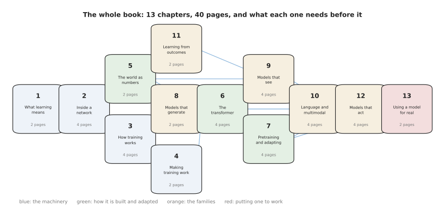

The book is fourteen chapters and forty-six pages, and the arrows say which chapters have
to be read before which.

Read the picture downwards. Chapter 1 asks why some jobs cannot be written as rules, and
chapter 2 opens a network up. Chapter 3 trains one, and chapter 5 turns pictures, sounds
and joint readings into numbers. The transformer in chapter 6 needs chapter 5 for its
inputs and chapter 4 for the training tricks that make it work. After the transformer the
map widens, because models that see, models that use words and models that act all stand on
the same machinery and can be read in almost any order. Chapter 13 shows you how to start
your own model, and chapter 14, where this page sits, needs everything before it.

The chapters are not all the same size, and it is worth knowing where the pages actually
are. The chart below gives each chapter one bar for its own page count, and the black line
running across is the running total, so you can read off how far through the book you are.

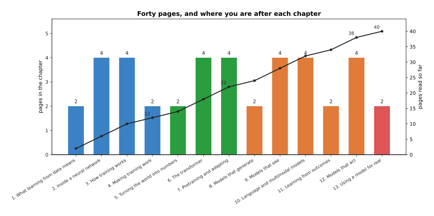

Twelve of the forty-six pages are the four chapters on how the machinery works, and sixteen
are the five chapters on the families built from it.

The running total is the more useful line. After chapter 4 you have read 12 pages, and you
know what a network is and how one is trained. After chapter 7 you have read 22, and you
know how a model is pretrained and adapted. The remaining 24 pages are the families
themselves and the two practical chapters at the end. So the first half of the book is
machinery, and the second half is what the machinery is used for and how to use it.

The row a chapter sits on in the map is worth a chart of its own, because it is not the
same as the chapter number. The chart below counts, for each chapter, the longest chain of
chapters that has to be read before it.

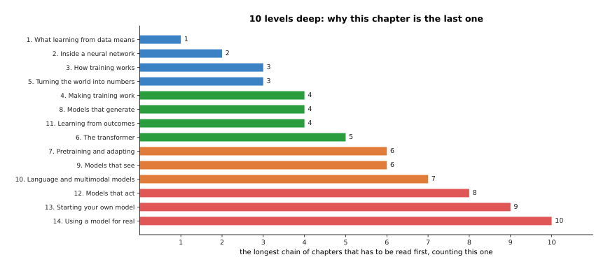

Following the longest chain of arrows, chapter 14 sits ten levels deep, which is why it is
the last one.

The script works this depth out from the arrows rather than from the chapter numbers, and
the two mostly agree. The exceptions are worth noticing. Chapter 11, on learning from
outcomes, sits only four levels deep, because it needs training and a loss and nothing
else, so you could read it straight after chapter 3. Chapter 8, on models that generate, is
the same. Chapter 10 sits seven levels deep, because it needs both the transformer and the
chapter on models that see.

---

## 2. The families, side by side

Section 1 said which chapters stand on which. This section puts the families those chapters
explain next to each other.

The simplest way to compare two families is by what goes in and what comes out, counted in
plain numbers, because a family is in the end one shape of input turned into one shape of
output. The chart below gives each family two bars, one for the count of numbers going in
and one for the count coming out. The scale is logarithmic, because the counts differ by a
factor of millions.

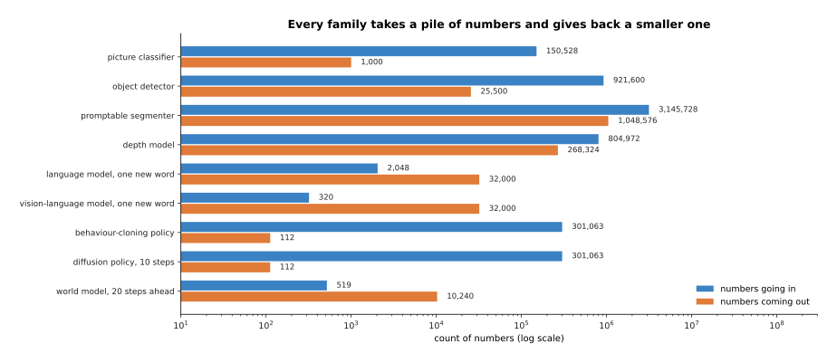

A picture classifier turns 150,528 numbers into 1,000, a promptable segmenter turns
3,145,728 into 1,048,576, and a behaviour-cloning policy turns 301,063 into 112.

Three shapes stand out. The segmenter of
[detection and segmentation](../09_models-that-see/02_detection-and-segmentation.md) and
the depth model of [depth and 3D](../09_models-that-see/04_depth-and-3d.md) each give back
one number for every three that go in, because they answer something about every single
pixel. The models that use words give back 32,000 numbers, which is one score for each word
piece they could say next, as
[large language models](../10_language-and-multimodal-models/01_large-language-models.md)
explains. And the policies of
[behaviour cloning and action chunks](../12_models-that-act/01_behaviour-cloning-and-action-chunks.md)
give back 112 numbers, which is sixteen future commands for seven joints, out of an input
of two whole pictures. A policy throws almost everything away, and that is exactly what
makes it hard to train.

The second way to compare families is by what each one costs. There are two separate costs,
one paid once when the model is trained and one paid again on every decision. The scatter
below puts training examples along the horizontal axis and arithmetic per decision up the
vertical axis, with one dot for each family and a logarithmic scale on both axes.

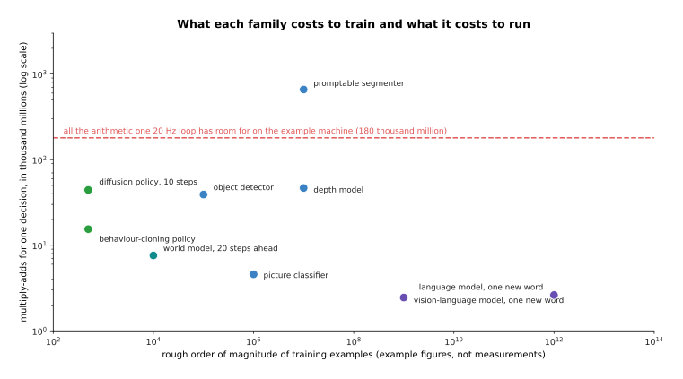

The nine families spread over about ten powers of ten in training data and between two and
three in arithmetic per decision, and only the segmenter sits above what one 20 hertz loop
allows.

The two axes are nearly independent, and that is the point of this picture. A language model
is the most expensive thing in the book to train and one of the cheapest to run once,
because each new word costs only one pass through the weights, with the earlier words kept
in a cache. A policy is the opposite, because a few hundred demonstrations are enough to
train it and every single decision pays for two whole picture encoders. The training-data
figures here are rough orders of magnitude, not measurements.

The third way to compare families is to watch them work together, because on a real arm
they do not take turns fairly. The two panels below describe one six-second pick-and-place.
They have the same six rows. The left panel counts how many times each family is called,
and the right panel counts the arithmetic those calls cost.

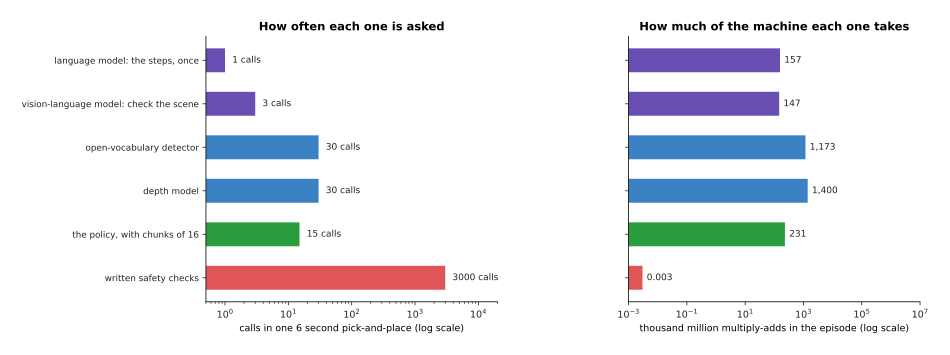

In one six-second pick-and-place the language model is asked once and the written safety
checks run 3,000 times, while the detector and the depth model together cost 2,573 of the
episode's 3,108 thousand million multiply-adds.

This is how the families actually sit together on a working arm. Each one runs at the rate
its own job needs, rather than at the rate of the control loop. The language model plans
once. The vision-language model checks the scene once every two seconds. The detector and
the depth model run five times a second. The policy writes a chunk of commands 2.5 times a
second. The written safety layer of the page before runs 500 times a second. The whole
episode comes to 3,079 calls and 3,108 thousand million multiply-adds, and the thing being
called most often costs almost nothing.

---

## 3. What to reach for, given a job

Section 2 compared the families against each other. This section compares them against
jobs.

The first question is not which model to use, because for a good number of jobs the answer
is no model at all. The picture below is four questions asked in a fixed order. Answering
yes to a question takes you down to a family. Answering no takes you right, to the next
question.

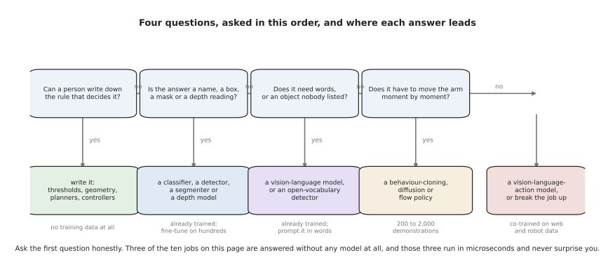

Four questions, asked in this order, pick the family, and the first of them sends four of
the ten jobs below away from machine learning entirely.

Ask first whether a person can write the rule down, because if they can then writing it is
cheaper, faster and inspectable. If they cannot, ask what shape the answer is, because a
name, a box, a mask or a depth reading is a job the seeing models already do, and their
weights can be downloaded. If the job needs words, or an object that nobody listed in
advance, ask for a vision-language model or for the open-vocabulary detectors of
[open-vocabulary vision](../09_models-that-see/03_open-vocabulary-vision.md). Only when the
answer is a stream of movement does a policy become the right tool, and only when the
instruction varies freely does a
[vision-language-action model](../12_models-that-act/03_vision-language-action-models.md)
earn its cost.

The next question is whether the chosen method fits in the time available. The chart below
gives each of the ten jobs one bar for what its method costs in arithmetic, and one red
marker for everything the example machine can do inside one period at that job's control
rate. A bar to the left of its marker fits.

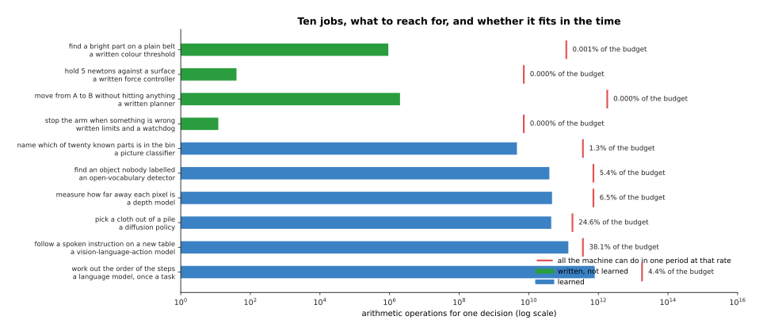

A written force controller uses one part in 180,000,000 of what its 500 hertz loop allows,
while a vision-language-action model at 10 hertz uses 38.1% of what its loop allows.

The four written methods are so far to the left of their markers that the comparison is
hard to draw at all, and the learned methods crowd up against theirs. The diffusion policy
at 20 hertz takes 24.6% of its budget, and the vision-language-action model at 10 hertz
takes 38.1%, and neither of them leaves room for a second large model in the same loop.

The last question is what the method costs in data. The chart below gives each learned
answer one bar for the number of training examples it needs, on a logarithmic scale,
together with a note saying what kind of example that is.

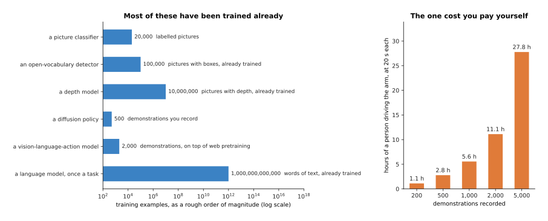

Most of these have been trained already by somebody else, so the numbers are what the model
cost to make rather than what it will cost you.

The one line in that chart you usually do pay for yourself is the demonstrations. A
demonstration is one attempt at the task with a person driving the arm, and at twenty
seconds each they add up quickly. The chart below turns counts of demonstrations into hours
of a person's time.

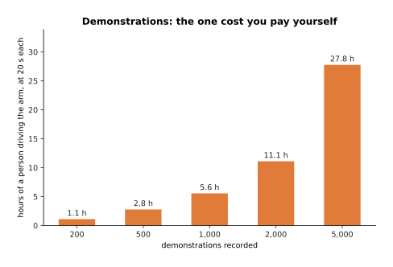

Recording 200 demonstrations takes 1.1 hours of a person driving the arm, and recording
5,000 takes 27.8 hours.

The table below puts all of it in one place. Read each row from left to right: the job,
what to reach for, what that costs in data, what it costs in arithmetic for one decision,
and the page of this book that explains it.

| The job | Reach for | Data it needs | Arithmetic for one decision | Page to re-read |
| --- | --- | --- | --- | --- |
| Find a bright part on a plain belt | A written colour threshold | none | 921,600 operations | [thresholds and colour masks](../../06_programming-techniques/05_image-and-point-cloud-processing/02_most-used/01_thresholding-and-colour-masks.md) |
| Hold 5 newtons against a surface | A written force controller | none | 40 operations | [proportional-integral-derivative (PID) control](../../06_programming-techniques/07_control-and-motion/02_most-used/01_pid-control.md) |
| Move from A to B without hitting anything | A written planner | none | about 2 million operations | [sampling-based planning](../../06_programming-techniques/06_planning-and-search/02_most-used/01_sampling-based-planning.md) |
| Stop the arm when something is wrong | Written limits and a watchdog | none | 12 operations | [running and evaluating a model](01_running-and-evaluating-a-model.md) |
| Name which of twenty known parts is in the bin | A picture classifier | about 20,000 labelled pictures, or a fine-tune of a few hundred | 4.6 thousand million | [what a network can learn](../02_inside-a-network/04_what-a-network-can-learn.md) |
| Find an object nobody labelled | An open-vocabulary detector | already trained; you write a text prompt | 39.1 thousand million | [open-vocabulary vision](../09_models-that-see/03_open-vocabulary-vision.md) |
| Measure how far away each pixel is | A depth model | already trained | 46.7 thousand million | [depth and 3D](../09_models-that-see/04_depth-and-3d.md) |
| Pick a cloth out of a pile | A diffusion policy | 200 to 2,000 demonstrations you record | 44.2 thousand million | [diffusion and flow policies](../12_models-that-act/02_diffusion-and-flow-policies.md) |
| Follow a spoken instruction on a new table | A vision-language-action model | demonstrations on top of web pretraining | 137.1 thousand million | [vision-language-action models](../12_models-that-act/03_vision-language-action-models.md) |
| Work out the order of the steps | A language model, once a task | already trained | 785.6 thousand million for 300 words | [large language models](../10_language-and-multimodal-models/01_large-language-models.md) |

Two things in that table are worth saying out loud. Three of the six learned answers need
no training data from you at all, because somebody else trained them and you either
download the weights or write a prompt, which is what
[fine-tuning and adapters](../07_pretraining-and-adapting/03_fine-tuning-and-adapters.md)
and the pretraining chapter made possible. And the four written answers cost so little
arithmetic that they can run inside every single control cycle, which the learned ones
cannot.

---

## 4. When the answer is not a neural network

Section 3's table had four rows with no model in them. This section says why, because a
book about neural networks should be clear about where they are the wrong tool.

The clearest case is when you have very little data. The script trains the colour
classifier from the page before on a growing number of examples, and it compares that
classifier with a rule a person wrote. The written rule is to pick whichever nominal colour
is nearest to what the camera measured. The chart below plots both. The shaded band around
the learned curve is how much its accuracy moved across nine runs with different examples.

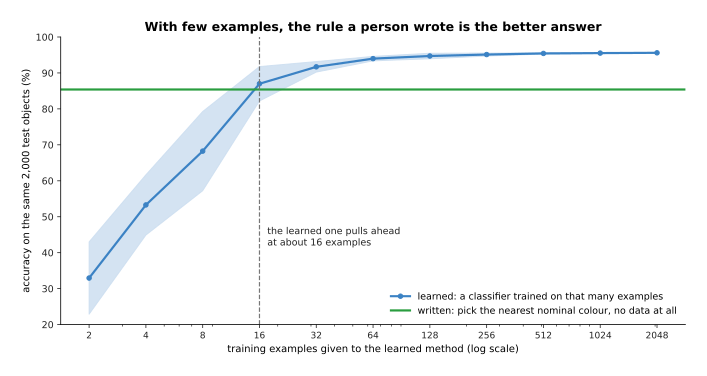

The written rule scores 85.4% with no training data at all, and the learned classifier
needs about 16 examples before it draws level and 64 before it reaches 94.0%.

Below sixteen examples the learned method is not merely worse, it is unstable. Its accuracy
across nine runs has a standard deviation of 11.0 points at eight examples, and still 4.8
points at sixteen, depending on which examples it happened to be given. The written rule
has no such spread, because it has nothing to fit. This is the real shape of the trade.
Learning buys accuracy with data, and if you have no data then it buys nothing.

The second case is speed. The two panels below are the same two methods measured in two
units. The left panel counts arithmetic operations and the right panel counts milliseconds
on the example machine.

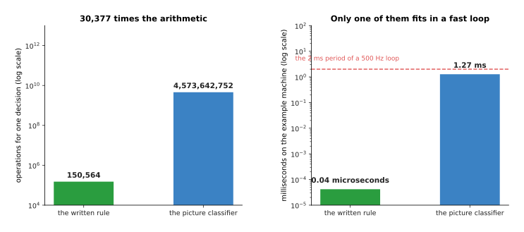

The classifier does 30,377 times the arithmetic of the written rule, which on the example
machine is 1.27 milliseconds against 0.04 microseconds.

A 500 hertz force loop has 2 milliseconds for everything it must do, and the classifier
alone would take most of that, so no network goes inside a loop that fast. This is why the
layer that keeps the arm safe is written rather than learned, and it is why
[calibration](../../06_programming-techniques/02_geometry-and-cameras/02_most-used/03_calibration.md)
and [inverse kinematics](../../01_robotics-intro/04_kinematics/02_inverse-kinematics.md)
stay written even on robots whose perception is entirely learned.

The third case is honesty about failure, and it is the one that should stop anybody from
thinking the choice is between a fragile rule and a robust network. The chart below puts
both methods through the same four conditions.

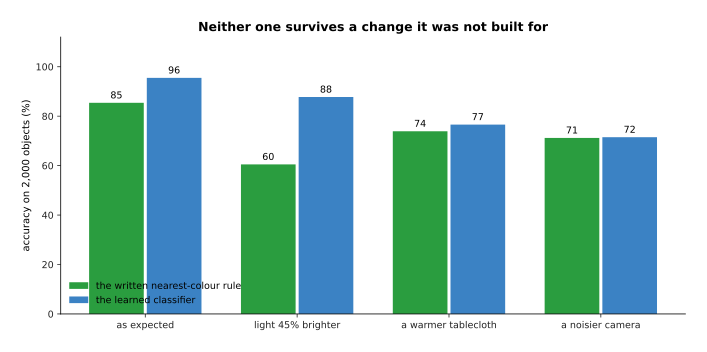

Neither method survives a change it was not built for, because brighter light takes the
written rule from 85.4% to 60.5% and the learned one from 95.5% to 87.8%, and a warmer
tablecloth takes them to 73.9% and 76.6%.

Both of them fall over, in different places, and neither of them says so at the time. What
differs is what you can find out afterwards. A written rule carries a number you can read
off for each answer it gives. The nearest-colour rule measures how far the reading is from
each of the four nominal colours, so the gap between the nearest and the second nearest
says how close that answer came to a border. The chart below groups the test objects by
that gap.

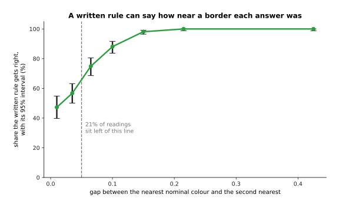

The written rule is right 47% of the time when the gap is under 0.02 and 100% of the time
when the gap is over 0.18, and 21% of the readings sit within 0.05 of a border, which is
where nearly all of its mistakes are.

So a written rule fails in a way you can read and repair, because you can see the border
that was crossed and move it. A network fails in a way you can only measure, by running the
trials of the page before. That difference, rather than accuracy, is usually what should
decide which one you use. The
[map of techniques](../../06_programming-techniques/01_what-techniques-are/04_the-map-of-techniques.md)
lists the written methods in full, and
[classical machine learning](../../07_learned-models/02_classical-machine-learning/01_overview.md)
covers the fitted methods that are not neural networks and that often win on a few hundred
examples.

---

## 5. What is not solved

Section 4 said where a neural network is the wrong tool. This section says where it is the
right tool and still does not work. None of what follows is a reason not to use these
models, and all of it is a reason to be careful about what you promise.

The first unsolved thing is the cost of robot data. Pictures and text come by the billion
from the internet, and demonstrations of an arm come one at a time from a person driving
it, which is why
[scale, data and compute](../07_pretraining-and-adapting/02_scale-data-and-compute.md)
calls robot data the scarce ingredient. The curve below is an illustration of how that cost
grows, not a measurement of any real system.

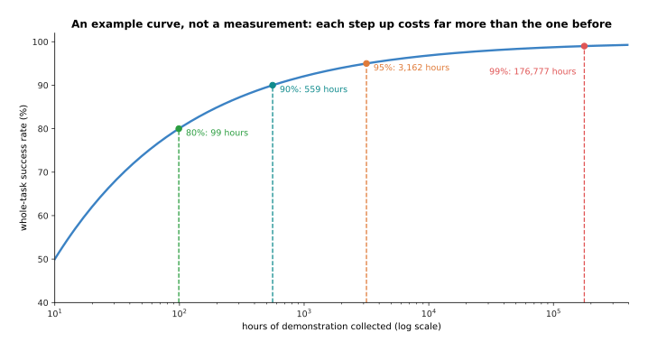

On this example curve, 80% costs 99 hours of demonstration, 95% costs 3,162 hours, and 99%
costs 176,777 hours.

The shape matters more than the numbers. Every curve of this kind that anybody has measured
bends over, so each step up costs several times as much as the last one. At twenty seconds
a demonstration, those 3,162 hours are 569,210 demonstrations, which is about two years of
one person working six hours a day. Simulation, shared datasets across many robot types,
and generated data all push the curve down, and none of them has flattened it.

The second unsolved thing is reliability, and it is the one that keeps learned policies out
of unattended production. The trouble is that a task is many steps and every step can go
wrong. The curves below take four per-step success rates and multiply them out over a
growing number of steps.

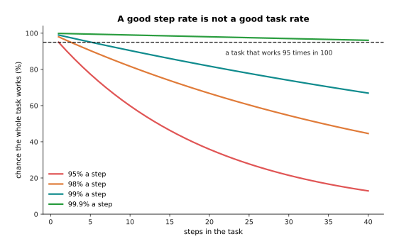

A policy that gets 99% of its steps right finishes a 20-step task 81.8% of the time, and
one that gets 95% of its steps right finishes it 35.8% of the time.

That is a warning about per-step numbers, which is what papers usually report. The next
chart turns whole-task rates into the number a factory actually cares about, which is how
long the cell runs before somebody has to walk over to it. The scale is logarithmic,
because the gap grows by factors of ten.

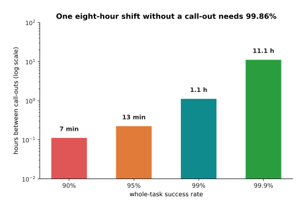

At one task every 40 seconds, a 95% policy calls for help every 13 minutes and a 99.9%
policy every 11.1 hours, so a cell that must run one unattended eight-hour shift needs a
whole-task success of 99.86%.

Today's best arm policies on varied everyday tasks are far below that number, which is why
they appear in demonstrations and in cells with a person standing nearby, rather than in
factories that run with the lights off.

The third unsolved thing is that nothing in training says anything about inputs the
training did not cover. The chart below measures the same policy at a growing distance from
the nearest training example.

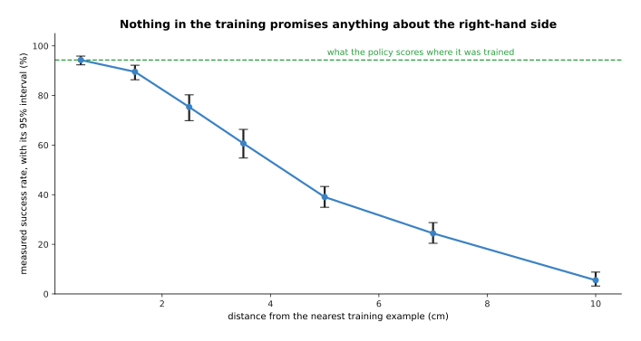

In this simulation the policy scores 94% within 1 centimetre of a training example, 61% at
3 to 4 centimetres and 6% beyond 8 centimetres, and nothing in the training predicted any
of that.

A written method has a domain you can state, because a colour threshold works while the
colour is in range and you can say what that range is. A network has no such statement. It
will answer any input, confidently, and the only way to find out whether that answer is any
good is to measure it. That brings us to the fourth unsolved thing, which is what measuring
costs. The curve below asks how many trials it takes to prove that a policy has improved by
a given amount.

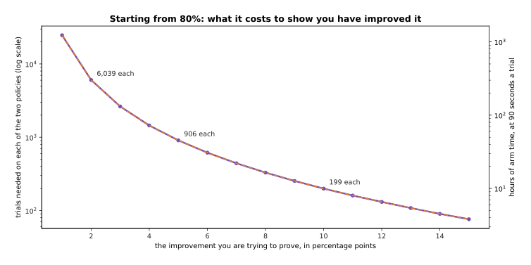

Proving that a policy has gone from 80% to 85% needs 906 trials of each version, which is
1,812 trials and 45.3 hours of arm time at 90 seconds a trial.

Evaluation is expensive in exactly the place where it is needed most, because the
improvements people make are usually a few points, and a few points is what costs thousands
of trials. Worse, those trials are run on one laboratory's arm, objects and lighting, so
two laboratories' numbers cannot be compared at all, which
[simulation and evaluation](../../03_frameworks/08_frontier/04_simulation-and-evaluation.md)
covers in detail.

The fifth unsolved thing has no picture, because it is not a number. A model that can
describe a task correctly in words is not thereby able to do it. A vision-language model can
look at a cluttered table and say, correctly, that the fork should be picked up by its
handle and laid to the left of the plate. The same system can then fail to close its
fingers on the handle at all. Describing and doing are different problems, the second one
has far less data behind it, and joining the two is what the whole vision-language-action
line of work is about.

---

## 6. What this book left out, and which book holds it

Section 5 was the honest list of what the field cannot do. This section is the honest list
of what this book did not cover, because the book explains the machinery of neural networks
and a working robot arm needs a great deal besides.

The picture below draws the whole library as a shelf. Each book is a box, and the height of
the box is how many chapters that book holds.

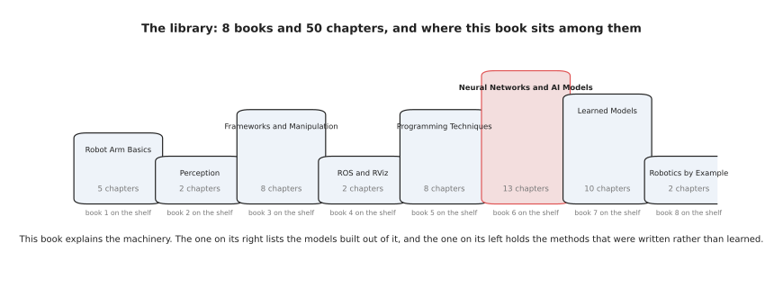

The library is nine books and 71 chapters, and this one is the fourteen chapters in the
middle that explain how the machinery works.

Its two neighbours matter most. On one side, Programming Techniques holds the methods
nobody had to train, which section 4 said are the right answer more often than people
expect. On the other side, Learned Models is the catalogue: for each family of model that
an arm uses, it names the real models, what they cost, how they are licensed and where they
fail. This book explains how a diffusion policy works, and that book tells you which
diffusion policies exist.

The picture below is more specific. Each row pairs one thing this book leaves out with the
book that covers it.

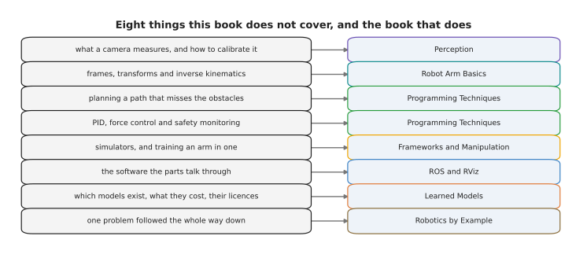

Nine things this book deliberately does not cover, and the book that does cover each one.

Each row is a real gap. This book never says what a camera actually measures or how to
calibrate one, and [Perception](../../02_perception/01_camera/01_basics.md) does. It never
explains frames, transforms or
[inverse kinematics](../../01_robotics-intro/04_kinematics/02_inverse-kinematics.md),
without which a joint command means nothing. It says nothing about planning a path, about
PID control or about force control, which are all in Programming Techniques. It says
nothing about simulators or about how an arm is trained in one, which is in Frameworks and
Manipulation. It says nothing about [ROS](../../04_ros-and-rviz/01_ros/01_ros-intro.md),
which is how the parts of a robot talk to each other.

If you want to read the rest of the library rather than dip into it, the picture below is
one suggested order, with a note under each book saying what it is for.

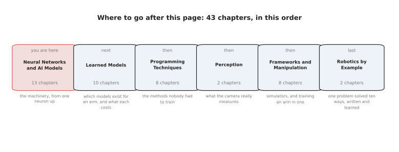

One suggested path onwards covers 64 chapters in seven books, starting with the catalogue
of real models and ending with one manipulation problem solved several ways.

The order is a suggestion rather than a rule. Learned Models comes first because it is the
direct continuation of this book. Programming Techniques comes second, because section 4's
argument only lands once you can see the written methods in full. Perception and Frameworks
fill in the camera and the simulator. The last two books come last because each of them
takes a single real problem and answers it several ways, written and learned side by side,
measured on one bench. Seeing the Glasses does that for a perception problem, and Pushing
the Glasses Apart does it for a manipulation problem where the written rule wins. That is
this book's closing question asked once more, with an answer attached.

---

## 7. Where to read next

This is the last page of the book, so these links point outwards rather than onwards.

- [The map of models](../../07_learned-models/01_what-models-are/06_the-map-of-models.md)
  in Learned Models is the catalogue's own map, and it sorts the real models an arm uses
  into seven kinds, which is the next thing to read after this page.
- [Making models work on an arm](../../07_learned-models/10_making-models-work-on-an-arm/01_overview.md)
  is that book's chapter on fine-tuning, running, testing and trusting a model, with named
  tools.
- [The map of techniques](../../06_programming-techniques/01_what-techniques-are/04_the-map-of-techniques.md)
  lists every written method a robot arm uses, which is section 4's half of the answer.
- [Cameras](../../02_perception/01_camera/01_basics.md) explains what a camera measures,
  which this book assumed throughout and never said.
- [Simulation and evaluation](../../03_frameworks/08_frontier/04_simulation-and-evaluation.md)
  covers the benchmark problem of section 5 as the research field sees it.
- [Seeing the glasses](../../08_seeing-the-glasses/04_the-six-solutions/01_how-the-six-compare.md)
  takes one perception problem and answers it six ways, written and learned side by side,
  and measures all six on one bench.
- [Pushing the glasses apart](../../09_pushing-the-glasses-apart/03_the-six-solutions/01_how-the-six-compare.md)
  does the same for one manipulation problem, where the written rule wins.

---

## 8. Using it in Python

The whole page comes down to two sums you can do before writing any code. The first sum
asks whether the model fits in the time you have. The second asks how good the model has to
be. The code below is both of them, in plain Python, with the numbers that section 3 and
section 5 printed.

```python
# Section 3. The example machine at two bytes a number, and what one period allows.
machine = 3.6e12                       # multiply-adds a second
hertz = 20
budget = machine / hertz               # 180,000,000,000 per decision

families = {                           # section 2's stated example configurations
    "picture classifier":          4_573_642_752,
    "behaviour-cloning policy":   15_422_650_368,
    "diffusion policy, 10 steps": 44_243_202_048,
    "promptable segmenter":      659_545_915_392,
}
for name, work in families.items():
    share = 100 * work / budget
    print(f"{name:28s} {share:7.1f}% of a {hertz} Hz budget "
          f"{'fits' if share < 100 else 'does not fit'}")
# picture classifier               2.5% of a 20 Hz budget fits
# behaviour-cloning policy         8.6% of a 20 Hz budget fits
# diffusion policy, 10 steps      24.6% of a 20 Hz budget fits
# promptable segmenter           366.4% of a 20 Hz budget does not fit

# Section 5. Steps multiply, so a good step rate is not a good task rate.
for step_rate in (0.95, 0.98, 0.99, 0.999):
    print(f"{100 * step_rate:5.1f}% a step -> {100 * step_rate ** 20:5.1f}% over 20 steps")
# 95.0% a step ->  35.8% over 20 steps
# 98.0% a step ->  66.8% over 20 steps
# 99.0% a step ->  81.8% over 20 steps
# 99.9% a step ->  98.0% over 20 steps

# Section 5. One task every 40 seconds: how long before somebody is called over.
tasks_per_hour = 3600 / 40
for task_rate in (0.90, 0.95, 0.99, 0.999):
    gap = 1 / ((1 - task_rate) * tasks_per_hour)
    print(f"{100 * task_rate:5.1f}% a task -> a call-out every {gap:5.2f} hours")
# 90.0% a task -> a call-out every  0.11 hours
# 99.9% a task -> a call-out every 11.11 hours
```

Those printed numbers are the same ones that the pictures in sections 3 and 5 draw. The
budget line is the single most useful thing in this file, because it is quick, it needs no
model and no robot, and it rules out a great many plans before anybody downloads anything.
The compounding line is the second most useful, because it turns the per-step number that
papers report into the whole-task number that a user cares about.

What the libraries give you after that is almost everything else. Hugging Face's
`transformers` and `timm` hold pretrained weights for most of the seeing and language
families in section 2. The `lerobot` package holds policies and the recording tools for the
demonstrations that section 3 priced. PyTorch holds the layers and the training loop that
the first half of this book explained.

What you still have to decide is the part no library has a view on. You decide whether the
job needs a model at all, which section 4 says is the question people skip. You decide
which family the shape of your answer calls for, and whether its arithmetic fits your
control rate. You decide how many demonstrations you are willing to record, knowing from
section 5 what the next ten points of success rate will cost. And you decide what you are
prepared to promise, which should be no more than your trials can support.
