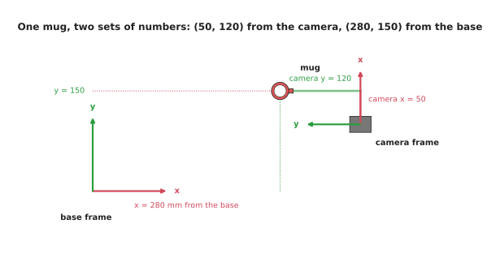
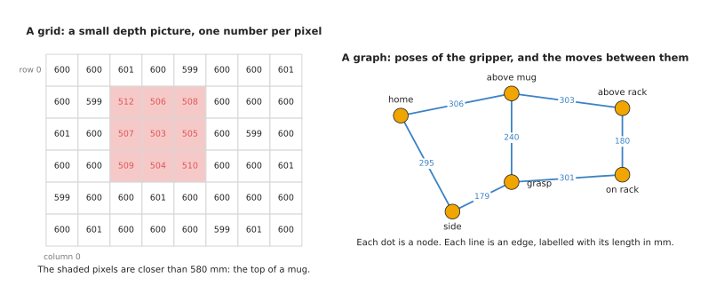
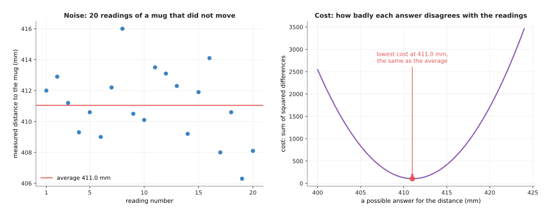

# The building blocks

The techniques in this book look very different from each other at first. One
turns a pixel into a position. Another finds a path round a table. Another keeps
a motor at the right angle. But almost all of them are built from the same six
ingredients. This page explains those six ingredients, one at a time, with a small
example of each on a robot arm.

It is for a reader who has read [programmed, not learned](01_programmed-not-learned.md)
and has never studied algorithms. Once you know the six ingredients, each later
technique page reads as a new way of putting familiar pieces together.

The six ingredients are these:

1. frames and transforms, for saying where things are;
2. arrays and grids, for holding many numbers in order;
3. graphs, for places and the ways between them;
4. noise and uncertainty, for the fact that every sensor is a little wrong;
5. cost functions, for saying which answer is best;
6. loops that run at a fixed rate, for doing the same work many times a second.

## Contents

1. [Frames and transforms](#1-frames-and-transforms)
2. [Arrays and grids](#2-arrays-and-grids)
3. [Graphs](#3-graphs)
4. [Noise and uncertainty](#4-noise-and-uncertainty)
5. [Cost functions](#5-cost-functions)
6. [Loops that run at a rate](#6-loops-that-run-at-a-rate)
7. [Where each building block appears in this book](#7-where-each-building-block-appears-in-this-book)
8. [Where to read next](#8-where-to-read-next)

---

## 1. Frames and transforms

A position is always measured from somewhere. "The mug is 300 mm away" means
nothing until you say 300 mm from what, and in which direction.

A **frame** is the "from what". It is a starting point, called the **origin**,
together with a set of directions, called the **axes**. Each axis is a direction
in which you measure. On a flat table there are two axes, x and y. In space there
are three: x, y and z. A frame is fixed to one physical thing. A robot arm has a
**base frame** fixed to its base. A camera has a **camera frame** fixed to the
camera. Book 1 introduces frames in
[position, frames and transforms](../../01_robotics-intro/03_arm/01_overview.md).

The same mug has different numbers in different frames. The camera measures the
mug from the camera. The arm needs to know where the mug is from the base. So the
program must convert the camera's numbers into the base's numbers. A
**transform** is the recipe for that conversion. For a solid object that does not
bend, the transform has two parts. A **rotation** turns the directions of one
frame to line up with the other. A **translation** then shifts the origin from
one place to the other.

Here is a small example on a flat table, seen from above. The camera sits at
x = 400 mm, y = 100 mm in the base frame. It is turned by 90 degrees, so its x
axis points the same way as the base's y axis. The camera sees a mug at
camera x = 50 mm, camera y = 120 mm.



The mug is at (50, 120) when measured along the camera's axes, and at (280, 150)
when measured along the base's axes; the red arrows are x axes and the green
arrows are y axes.

The conversion goes in two steps, in this order:

1. Rotate. Turning the camera's numbers by 90 degrees uses the rule
   new x = cos(90°) × 50 − sin(90°) × 120, and
   new y = sin(90°) × 50 + cos(90°) × 120.
   Since cos(90°) is 0 and sin(90°) is 1, this gives new x = −120 and new y = 50.
2. Translate. Add the camera's position in the base frame. That gives
   x = 400 + (−120) = 280, and y = 100 + 50 = 150.

So the mug is at (280, 150) in the base frame. You can check it against the
picture. Real arms do the same in three dimensions, with three numbers instead of
two. Programs usually pack the rotation and the translation into one 4 by 4 table
of numbers, called a **homogeneous transform matrix**, so that one multiplication
does both steps. The [rigid transforms](../02_geometry-and-cameras/03_rigid-transforms.md)
page explains that matrix.

Transforms can be chained. If you know the camera from the wrist, and the wrist
from the base, you can combine them to get the camera from the base. An arm
program does this all the time. Getting one link in the chain wrong is one of the
most common bugs in robotics. Book 3 spends a whole page on it:
[frames, conventions, and the bug class that comes from mixing them](../../03_frameworks/03_arm-movement/08_frames-and-conventions.md).

---

## 2. Arrays and grids

An **array** is a list of numbers kept in a fixed order. Each number has a
position in the list, called its **index**. Most programming languages count the
index from 0, so the first number is number 0. The row of 16 depth readings on
the [previous page](01_programmed-not-learned.md#4-written-rules-or-a-trained-model)
was an array with indexes 0 to 15.

A **grid** is an array with rows and columns, like a spreadsheet. You find one
number by giving its row and its column. A picture from a camera is a grid. Each
cell of the grid is a pixel. A picture 640 pixels wide and 480 pixels tall is a
grid of 480 rows and 640 columns, which is 307,200 pixels. A colour picture holds
three numbers per pixel: red, green and blue. A depth picture holds one number
per pixel: the distance in millimetres.

The left side of the picture below is a very small depth picture, 6 rows by
8 columns, taken from above a mug.



On the left, most cells read about 600 mm, which is the table, and the nine
shaded cells read between 503 and 512 mm, which is the top of a mug; the right
side is a graph, explained in the next section.

A computer works through a grid in order: row 0 from left to right, then row 1,
and so on. Many techniques in this book are loops over a grid. The depth rule on
the previous page is one: it visits each cell and compares its number with 580.
On this grid it marks 9 cells.

A **point cloud** is also an array. It is a list of points, and each point has
three numbers: x, y and z. You can think of it as a grid with one row per point
and three columns. A depth camera with 307,200 pixels gives up to 307,200 points,
one for each pixel that got a reading.

Grids are also used for space itself. A planner can split the table top into small
squares and mark each square as free or full. This is called an **occupancy
grid**. The [graph search](../06_planning-and-search/02_graph-search.md) page
finds paths across such a grid.

Arrays matter for a practical reason too. Libraries such as NumPy in Python and
Eigen in C++ can do the same sum on every cell of a large array very quickly. Book 1
introduces this in [NumPy intro](../../01_robotics-intro/01_python-and-numpy/02_numpy-intro.md).

---

## 3. Graphs

In this book, a **graph** is not a chart. It is a set of places and the
connections between them.

- Each place is called a **node**. A node can be a pose of the gripper, a square
  of an occupancy grid, or a state of a task, such as "holding a mug".
- Each connection is called an **edge**. An edge says you can go directly from
  one node to another.
- An edge can carry a number, called its **weight** or its **cost**. It often
  means distance or time.

The right side of the picture above is a graph. Its six nodes are poses of the
gripper: "home", "above mug", "grasp", "side", "above rack" and "on rack". The
lines are moves the arm can make safely. Each line is labelled with its length in
millimetres.

A question you can ask of a graph is: what is the shortest way from one node to
another? From "home" to "on rack" there are three routes in this graph. You add
the lengths along each one:

- home, above mug, above rack, on rack: 306 + 303 + 180 = 789 mm;
- home, above mug, grasp, on rack: 306 + 240 + 301 = 847 mm;
- home, side, grasp, on rack: 295 + 179 + 301 = 775 mm.

The third route is the shortest. With six nodes you can check every route by
hand. A real planning graph can have millions of nodes. The techniques on the
[graph search](../06_planning-and-search/02_graph-search.md) page find the
shortest route without trying every one.

Graphs appear in many places on a robot arm. A grid of squares is a graph, where
each square is joined to its neighbours. A **roadmap** is a graph of arm poses
known to be free of collisions, used by
[sampling-based planning](../06_planning-and-search/03_sampling-based-planning.md).
A [behaviour tree](../08_decisions-and-task-logic/03_behaviour-trees.md) is a
special kind of graph that holds the order of a task.

---

## 4. Noise and uncertainty

Every sensor is a little wrong, and the error changes each time you read it. This
changing error is called **noise**.

Here is an example. A depth camera looks at a mug that does not move. The program
reads the distance to the mug 20 times in a row.



On the left, the 20 readings of the same still mug fall between 406.3 mm and
416.0 mm, around an average of about 411.0 mm; the right side is a cost curve,
explained in the next section.

The mug did not move, yet the readings differ by up to 9.7 mm. No single reading
is the truth. The best you can say is that the mug is probably near 411 mm, give
or take a few millimetres. That "give or take" is the **uncertainty**. For these
readings, 16 of the 20 fall within 3 mm of the average.

Noise is not the only kind of error. Sometimes a reading is completely wrong, for
example when light bounces off a shiny surface. A reading like that is called an
**outlier**. Outliers need different handling from ordinary noise, because one
outlier can pull an average far away from the truth.
[Choosing a technique](03_choosing-a-technique.md#4-robustness-to-noise-and-bad-readings)
shows this with a picture.

Three chapters of this book exist mostly because of noise and outliers.
[Fitting and estimation](../04_fitting-and-estimation/01_overview.md) gets a clean
shape or a steady number out of many noisy readings. The
[Kalman filter](../04_fitting-and-estimation/04_kalman-filter.md) combines each
new reading with what it already knew. [Random sample consensus (RANSAC)](../04_fitting-and-estimation/03_ransac.md)
ignores outliers. And every technique page has a section on what goes wrong, which
is very often about noise.

---

## 5. Cost functions

Many techniques have to choose the best answer from many possible answers. To do
that, they need a way to say how good each answer is, as a single number.

A **cost function** is that way. It takes one possible answer and gives back one
number, called its **cost**. A smaller cost means a better answer. The technique's
job then becomes: find the answer with the smallest cost. This is called
**minimising** the cost. Some techniques use the opposite, a score to make as
large as possible. The idea is the same.

Here is a cost function for the 20 noisy readings above. The question is: what
single number best describes the distance to the mug? Take any possible answer.
Subtract it from each reading. Square each difference, so that a reading below and
a reading above count the same way. Add up the 20 squares. That total is the cost
of that answer. It is called the **sum of squared differences**.

The table below shows the cost of four possible answers. Read it top to bottom:
the cost falls, reaches its lowest value near the average, and rises again.

| Possible answer (mm) | Cost (sum of squared differences) |
| --- | --- |
| 405.0 | 835.7 |
| 410.0 | 126.7 |
| 411.0 | 104.9 |
| 415.0 | 417.7 |

The right side of the picture in section 4 draws this cost for every possible
answer from 400 to 424 mm. The curve is shaped like a bowl. Its lowest point is at
411.0 mm, the same as the average. That is not an accident. For the sum of squared
differences, the lowest point is always at the average. This is the simplest case
of **least squares**, which the
[least-squares fitting](../04_fitting-and-estimation/02_least-squares-fitting.md)
page uses to fit lines and planes.

Cost functions appear all through this book:

- In [graph search](../06_planning-and-search/02_graph-search.md), the cost of a
  route is the sum of its edge lengths.
- In [trajectory optimisation](../06_planning-and-search/04_trajectory-optimisation.md),
  the cost of a path adds up its length, its jerkiness and how close it comes to
  obstacles.
- In [assignment and matching](../03_searching-and-matching/04_assignment-and-matching.md),
  the cost of matching two detections is how far apart they are.
- In [numerical inverse kinematics](../06_planning-and-search/05_numerical-inverse-kinematics.md),
  the cost is how far the gripper is from where you want it.

When a technique gives a strange answer, the cost function is often the first
thing to check. The technique found the answer with the lowest cost. If that
answer is wrong, the cost function may be measuring the wrong thing.

---

## 6. Loops that run at a rate

A robot arm does not answer a question once. It answers the same question again
and again, as fast as new readings arrive. The camera sends a new picture. The
joints report new angles. The program must use each new reading before the next
one arrives.

A **loop** is a set of steps that repeats. A loop that **runs at a rate** repeats
on a fixed clock: for example, 1,000 times a second. The rate is measured in
**hertz (Hz)**, which means "times per second". So 1,000 Hz is 1,000 times a
second, which is once every 1 millisecond.

Here is the loop that holds one joint at its target angle, in pseudocode:

```
every 1 millisecond:
    angle   = read the joint's angle sensor
    error   = target angle - angle
    command = a push that grows with the error
    send command to the joint's motor
```

This is the shape of [proportional-integral-derivative (PID) control](../07_control-and-motion/02_pid-control.md),
which explains how to work out the push.

Each loop gives the technique inside it a **time budget**. At 1,000 Hz, all four
steps must finish in less than 1 millisecond. If they take longer, the next
reading is late, and the arm stops moving smoothly. A camera loop at 30 Hz has
about 33 milliseconds per picture. A technique that is fine in the camera loop
can be far too slow for the joint loop.

Different parts of an arm run at different rates. A joint controller often runs
at 500 or 1,000 Hz. A camera runs at 15 to 60 Hz. A planner may run once before
each move. The "decide what to do next" logic may run only when something changes.
[Choosing a technique](03_choosing-a-technique.md#2-speed-the-time-budget) draws
these budgets side by side.

---

## 7. Where each building block appears in this book

The table below shows where each of the six building blocks matters most. Read
each row as one block, with the chapters in which it does most of the work.

| Building block | Main chapters | One example |
| --- | --- | --- |
| Frames and transforms | [geometry and cameras](../02_geometry-and-cameras/01_overview.md), [planning and search](../06_planning-and-search/01_overview.md) | turning the mug's camera position into a base position |
| Arrays and grids | [image and point cloud processing](../05_image-and-point-cloud-processing/01_overview.md), [searching and matching](../03_searching-and-matching/01_overview.md) | marking every depth pixel closer than 580 mm |
| Graphs | [planning and search](../06_planning-and-search/01_overview.md), [decisions and task logic](../08_decisions-and-task-logic/01_overview.md) | the shortest route from "home" to "on rack" |
| Noise and uncertainty | [fitting and estimation](../04_fitting-and-estimation/01_overview.md), [geometry and cameras](../02_geometry-and-cameras/01_overview.md) | 20 readings of one still mug |
| Cost functions | [fitting and estimation](../04_fitting-and-estimation/01_overview.md), [planning and search](../06_planning-and-search/01_overview.md), [decisions and task logic](../08_decisions-and-task-logic/01_overview.md) | the sum of squared differences |
| Loops at a rate | [control and motion](../07_control-and-motion/01_overview.md), [fitting and estimation](../04_fitting-and-estimation/01_overview.md) | the 1,000 Hz joint loop |

Learned models in Book 6 use the same building blocks. A model's input is an
array. Its training minimises a cost function, which Book 6 calls a loss. And a
trained model runs inside a loop at a rate, as
[running a model on a robot](../../06_neural-network-models/01_what-models-are/05_running-a-model-on-a-robot.md)
describes.

---

## 8. Where to read next

- [Choosing a technique](03_choosing-a-technique.md) is the next page. It uses
  these building blocks to compare techniques.
- [Vectors and matrices for a robot arm](../../01_robotics-intro/02_maths/02_vectors-and-matrices.md)
  in Book 1 explains the maths behind rotations and translations.
- [Rigid transforms](../02_geometry-and-cameras/03_rigid-transforms.md) takes
  section 1 into three dimensions.
- [How a model learns](../../06_neural-network-models/01_what-models-are/02_how-a-model-learns.md)
  in Book 6 shows a cost function being used to train a model.
