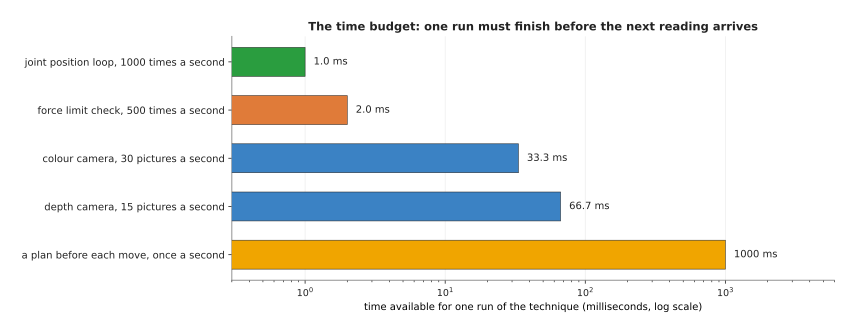
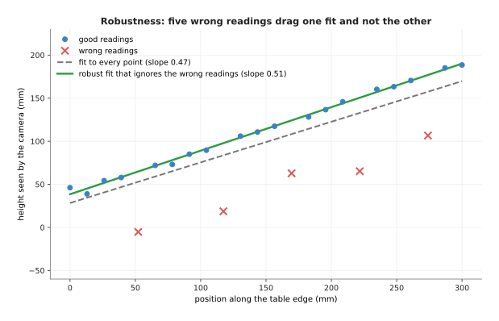
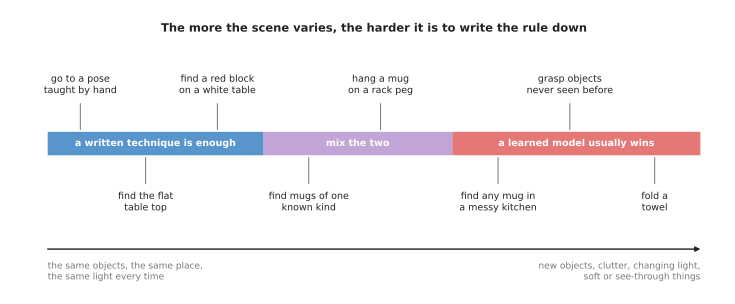

# Choosing a technique

For almost every job on a robot arm there is more than one technique that could
do it. For example, you can find the table top by assuming its height, by
averaging many points, or by a method that ignores bad points. Or, to find a
path, you can search a grid or try random poses. So this page explains how to
choose between them.

It answers one question: when two techniques could both do a job, which one
should you use? It gives five things to check, and shows each one with a small
example on an arm. The last of the five is whether to use a written technique at
all, or a learned model from Book 6 instead.

It is for a reader who has read
[programmed, not learned](01_programmed-not-learned.md) and
[the building blocks](02_the-building-blocks.md). Every technique page later in
the book answers the same five questions for its own technique, so this page is
also a guide to reading those pages.

## Contents

1. [The five questions](#1-the-five-questions)
2. [Speed: the time budget](#2-speed-the-time-budget)
3. [Accuracy: how close is close enough](#3-accuracy-how-close-is-close-enough)
4. [Robustness to noise and bad readings](#4-robustness-to-noise-and-bad-readings)
5. [How much tuning it needs](#5-how-much-tuning-it-needs)
6. [When to switch to a learned model](#6-when-to-switch-to-a-learned-model)
7. [A worked choice: finding the table top](#7-a-worked-choice-finding-the-table-top)
8. [A checklist](#8-a-checklist)
9. [Where to read next](#9-where-to-read-next)

---

## 1. The five questions

The introduction promised five things to check, so here they are, in the order
that the rest of this page takes them:

1. Is it fast enough for the loop it has to run in?
2. Is it accurate enough for what the arm does with the answer?
3. Does it still work when some readings are noisy or plain wrong?
4. How many parameters must you choose, and how hard are they to choose?
5. Would a learned model do this job better?

No technique wins on all five, because a fast technique is often less accurate
and a technique that ignores bad readings is often slower. So the aim is not to
find the best technique in general, but to find the simplest technique that
passes all five questions for your job.

"Simplest" matters here, because a simple technique has fewer steps that can go
wrong, is easier to test, and is easier for the next person to understand. So
start with the simplest technique that could work, and move to a harder one only
when you can point to the question the simple one fails.

---

## 2. Speed: the time budget

The first of the five questions is whether a technique is fast enough, and the
answer comes from the loop it runs in. A technique on an arm runs inside a loop,
as [the building blocks](02_the-building-blocks.md#6-loops-that-run-at-a-rate)
explained. So the loop's rate sets a **time budget**, which is the time one run
of the technique may take before the next reading arrives. You work that budget
out by dividing 1,000 milliseconds by the number of runs per second.

The joint position loop at 1,000 times a second leaves 1.0 ms, a force check at
500 times a second leaves 2.0 ms, a colour camera at 30 pictures a second leaves
33.3 ms, a depth camera at 15 pictures a second leaves 66.7 ms, and a plan made
once a second may take up to 1,000 ms.

The scale along the bottom is a **log scale**, which means that each labelled
step is ten times the one before it. This lets a 1 ms bar and a 1,000 ms bar fit
on the same picture.

The budget is for everything in that loop, not just your technique. In the
camera loop, 33.3 ms has to cover reading the picture, finding the mugs, working
out their positions and passing them on. So a technique that takes 30 ms by
itself is already too slow there.

The budgets differ by a factor of a thousand, which is why the same arm uses
very different techniques in different places. The joint loop can only afford a
few multiplications, such as
[proportional-integral-derivative (PID) control](../07_control-and-motion/02_most-used/01_pid-control.md).
A planner that runs once before each move, in contrast, can afford to try
thousands of poses, such as
[sampling-based planning](../06_planning-and-search/02_most-used/01_sampling-based-planning.md).

Speed also depends on how much data there is, so it helps to ask how the time
grows when the data grows. Take the brute-force way of finding, for every point
in a point cloud, which other point is closest to it. That method compares each
point with every other point, so with 1,000 points that is 499,500 pairs, while
with
2,000 points it is 1,999,000 pairs, so twice the points means four times the
work. A depth picture can have 300,000 points, and this simple method therefore
becomes far too slow. The
[nearest-neighbour search](../03_searching-and-matching/02_most-used/01_nearest-neighbour-search.md)
page shows how a k-d tree, which sorts the points into boxes ahead of time,
avoids most of those comparisons.

So when you judge speed, ask two things: how long one run takes on your data
today, and how much longer it will take if the data grows.

---

## 3. Accuracy: how close is close enough

Speed is only the first question, because an answer that arrives on time is no
use if it is wrong. **Accuracy** is how close a technique's answer is to the
truth, and no technique is perfectly accurate, because its input is noisy. So
the useful question is how accurate the answer needs to be for what the arm does
next.

You work that out from the task, not from the technique. Here is an example. A
gripper's fingers open to 80 mm and a mug is 70 mm wide. So if the gripper comes
down centred on the mug, there is (80 − 70) ÷ 2 = 5 mm of room on each side. This
means the mug's position must be right to within about 5 mm, or a finger lands
on the rim.

Now compare two techniques against that 5 mm. A technique that is right to
within 1 mm passes easily, while a technique that is right to within 10 mm
fails, however fast it is. And a technique that is right to within 0.1 mm is no
better for this job than the 1 mm one, so the extra time it probably costs buys
nothing.

Accuracy also adds up along a chain, because the mug's position passes through
the camera model, the camera's calibration, the transform to the base, and the
arm's own joints. Each one adds a little error, so if each of four steps adds 2
mm, the total can reach 8 mm, which is more than the 5 mm of room. The
[calibration](../02_geometry-and-cameras/02_most-used/03_calibration.md) page is
about removing the largest of these errors.

When you judge accuracy, ask: how much error can the next step accept? Then
check the whole chain against that number, not just one technique.

---

## 4. Robustness to noise and bad readings

The accuracy question assumed that the readings are merely noisy, but some
readings are worse than that. A technique is **robust** if it still gives a good
answer when some of its input is bad. The
[building blocks](02_the-building-blocks.md#4-noise-and-uncertainty) page
described two kinds of bad input: **noise**, which is a small error on every
reading, and an **outlier**, which is a reading that is completely wrong.

Many simple techniques handle noise well and outliers badly. Here is an example.
A depth camera looks along the straight edge of a table and measures 24 points
along it. The edge truly rises 0.5 mm for every 1 mm along it, and starts at a
height of 40 mm, so most readings are close to that line. However, five of them
are 60 to 90 mm too low, because of a reflection.

The grey dashed line is fitted to all 24 points and is dragged down by the five
wrong readings; the green line comes from a robust method that ignores them and
lies on the good points.

Those two lines come from two techniques that answer the same question in
different ways:

- The grey dashed line is **least squares** on all 24 points. It finds the line
  with the smallest sum of squared differences, the cost function from
  [the building blocks](02_the-building-blocks.md#5-cost-functions). It gives a
  slope of 0.472 and a starting height of 28.3 mm. At the far end of the edge,
  300 mm along, it says the height is 169.8 mm. The truth is 190.0 mm. It is
  about 20 mm too low.
- The green line is **random sample consensus (RANSAC)**. It tries many lines,
  each through two points chosen at random. For each line it counts how many
  points lie within 8 mm of it. It keeps the line that the most points agree with,
  and then fits it again to just those points. Here 19 of the 24 points agree. It
  gives a slope of 0.505 and a starting height of 38.5 mm. At 300 mm it says
  190.1 mm.

Least squares is pulled down because squaring makes large differences count a
great deal, and each outlier is 60 to 90 mm off, so its square is very large.
RANSAC is not pulled down, because it never lets the outliers vote for the final
line.

This does not make RANSAC always better. It is slower, because it tries many
lines, and it is random, so two runs can give slightly different answers. It
also needs two parameters that least squares does not, as the next section
shows. So if your readings have noise but no outliers, least squares is faster
and just as good. The
[least-squares fitting](../04_fitting-and-estimation/02_most-used/01_least-squares-fitting.md)
and [RANSAC](../04_fitting-and-estimation/02_most-used/02_ransac.md) pages
compare them in detail.

When you judge robustness, look at real readings from your own camera, and ask
whether there are outliers, how many of them there are, and how far off they
are. Then test the technique on those readings, not on clean ones.

---

## 5. How much tuning it needs

Section 4 ended with the two parameters that RANSAC needs, so this section looks
at parameters in general. A **parameter** is a number you choose before a
technique runs, and **tuning** is the work of choosing those numbers. Every
parameter is a question someone has to answer, and has to answer again when the
scene changes.

Here are the parameters needed by some of the techniques this book has already
mentioned:

- The depth rule on [the first page](01_programmed-not-learned.md#4-written-rules-or-a-trained-model)
  has one: the 580 mm limit.
- The RANSAC line in section 4 has two: the 8 mm distance that counts as
  "agreeing", and how many lines to try, which was 200.
- A [PID controller](../07_control-and-motion/02_most-used/01_pid-control.md) has three per
  joint, so eighteen on a six-joint arm.
- A colour mask in [thresholding and colour masks](../05_image-and-point-cloud-processing/02_most-used/01_thresholding-and-colour-masks.md)
  has six: a low and a high limit for each of three colour numbers.

A parameter is easy to tune if it has a physical meaning you can measure. For
example, the 580 mm limit is easy, because you measure the table's distance and
subtract a margin. A parameter is hard to tune if it has no clear meaning, or if
it interacts with other parameters, and changing one PID number changes how the
other two behave.

Parameters also go stale, because the 580 mm limit is right for only one table
height. Move the camera 50 mm higher, and every depth reading grows by about 50
mm, so the limit is wrong. In the same way, a colour mask tuned in the morning
may fail in the evening light.

When you judge tuning, count the parameters and ask of each one: can I measure
it, or must I guess and test it? And what change in the scene would make it
wrong?

---

## 6. When to switch to a learned model

The fifth question is whether a written technique is the right kind of tool at
all.
[Programmed, not learned](01_programmed-not-learned.md#4-written-rules-or-a-trained-model)
showed a written rule failing on a glass. Book 6 explains the alternative:
[a model learned from examples](../../06_learned-models/01_what-models-are/01_what-a-model-is.md).

The main thing that decides is how much the scene varies. If the objects, their
places and the light are the same every time, a written rule can describe them
exactly. However, if they change a lot, a rule cannot list every case.

Jobs on the left, such as finding the flat table top, are done well by written
techniques; jobs on the right, such as grasping objects never seen before, are
usually done better by learned models; jobs in the middle often use both.

These are the signs that a written technique is running out:

- You keep adding special cases, and each one breaks another.
- You cannot describe the failures in words. You can only say "it looks wrong".
- One set of parameters cannot suit all the scenes you see in a day.
- The thing to recognise has no simple shape or colour, such as "a mug of any
  kind" or "a good place to grab a towel".

These are the signs that a written technique is still the right choice:

- The job is geometry or arithmetic, such as a transform or a camera model.
- The answer must be exact, and you must be able to check it.
- It must run in a millisecond, on a small processor.
- You have no examples to learn from, or cannot afford to collect them.

Most arms mix the two. A learned model does the part that needs variety, such as
[object detection](../../06_learned-models/03_seeing-models/02_most-used/01_object-detection.md)
to find the mugs in a colour picture. Written techniques, meanwhile, do the
parts that need exactness: turning pixels into positions, planning the path and
driving the motors. So when you switch, you usually replace one step in the chain, not the
whole chain.

---

## 7. A worked choice: finding the table top

Now that all five questions have been described, this section runs them on one
real job to show how they work together. The job is to find the height and tilt
of the table top, from a depth camera on the arm's wrist. Every later step uses
the table top, because it tells the arm how low the gripper can go, and it lets
the program remove the table points so that only the objects are left.

There are four candidates for the job, and they run from a hand measurement to a
learned model:

1. Measure the table once by hand, and write the height into the program.
2. Fit a plane to all the depth points with
   [least squares](../04_fitting-and-estimation/02_most-used/01_least-squares-fitting.md).
3. Fit a plane with [RANSAC](../04_fitting-and-estimation/02_most-used/02_ransac.md), which
   ignores points that are not on the plane, such as mugs.
4. Use a learned model that labels which pixels are table, such as a
   [segmentation](../../06_learned-models/03_seeing-models/02_most-used/02_segmentation.md) model.

The table below runs the five questions on each candidate. Read each row across
to see how one candidate does on all five.

| Candidate | Fast enough? | Accurate enough? | Robust? | Tuning | Needs learning? |
| --- | --- | --- | --- | --- | --- |
| 1. Measured by hand | yes, no work at run time | only while nothing moves | fails as soon as the table or camera moves | none, but must be re-measured | no |
| 2. Least squares on all points | yes | no: the mugs pull the plane up | no | none | no |
| 3. RANSAC plane | yes, at camera rate for a downsampled cloud | yes | yes, the mugs are treated as outliers | a distance and a number of tries | no |
| 4. Learned segmentation | usually, with a graphics card | only as good as its labels; still needs a plane fit for the height | good on scenes like its training data | training data and training time | yes |

Candidate 1 is simplest, but it fails the robustness question the first time
someone moves the table. Candidate 2 fails because the mugs on the table are
outliers from the table's point of view. Candidate 3 passes all five, with two
parameters that have a physical meaning. Candidate 4 would also work, but it
costs training data, and it still needs a plane fit afterwards to get the height
as a number.

So candidate 3, RANSAC, is the usual choice for this job. Book 2 uses exactly
this approach in
[remove the plane, then cluster](../../02_perception/02_object-perception/03_programmed-methods.md#16-point-clouds-remove-the-plane-then-cluster).

---

## 8. A checklist

So the five questions collect into the checklist below. Read each row as one
question: what to measure to answer it, and the sign that the technique fails
it.

| Question | What to measure | Sign that it fails |
| --- | --- | --- |
| Fast enough? | the time for one run on real data, and the loop's budget | the loop misses its rate; the arm jerks or the picture lags behind |
| Accurate enough? | the error against a known truth, such as a ruler or a marker | the gripper lands off-centre by more than its room allows |
| Robust? | the answer on real readings, including shiny, dark or cluttered scenes | one bad reading moves the answer a long way |
| Easy to tune? | the number of parameters, and whether each can be measured | it works after tuning and fails the next day |
| Written or learned? | how many special cases you have written, and how varied the scene is | each fix breaks another case |

Every technique page in this book has a section on where the technique is useful
and where it is not, and that section answers these five questions for its own
technique. It also names what people use instead when the technique fails.

---

## 9. Where to read next

- [The map of techniques](04_the-map-of-techniques.md) is the next page. It lists
  all 34 techniques in this book and places them on one arm task.
- [RANSAC](../04_fitting-and-estimation/02_most-used/02_ransac.md) explains the robust fit from
  section 4 in full.
- [Running a model on a robot](../../06_learned-models/10_making-models-work-on-an-arm/02_most-used/02_running-a-model-on-a-robot.md)
  in Book 6 shows the time budget from the learned side.
- [Making it work](../../02_perception/02_object-perception/07_making-it-work.md)
  in Book 2 is about testing perception on real scenes, which is how you answer
  the robustness question in practice.
