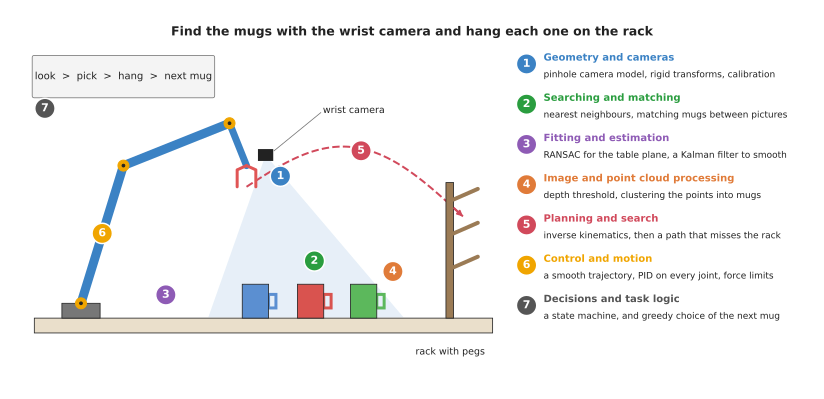
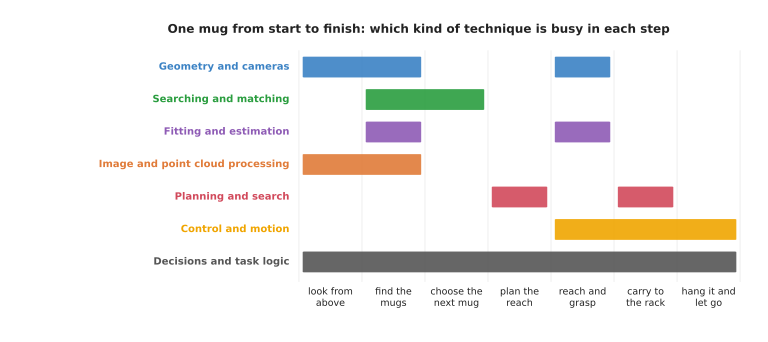

# The map of techniques

This book describes 34 programming techniques, and they have different names,
take in different things and give back different answers. This page is the map
of all of them, because it sorts them into seven kinds, which this book calls
**categories**. For each category it then says what the techniques do and where
to read about them.

It answers three questions. What are the seven categories, and which techniques
are in each? Where does each category do its job when one robot arm does one
task? And in what order should you read the chapters of this book?

It is for a reader who has read the earlier pages of this chapter, especially
[programmed, not learned](01_programmed-not-learned.md). You can also come back
to it at any time, when you want to see where one technique fits among the
others. Book 6 has a page with the same shape for learned models,
[the map of models](../../06_learned-models/01_what-models-are/06_the-map-of-models.md).

## Contents

1. [One task, seven kinds of technique](#1-one-task-seven-kinds-of-technique)
2. [The seven categories](#2-the-seven-categories)
   · [Geometry and cameras](#geometry-and-cameras)
   · [Searching and matching](#searching-and-matching)
   · [Fitting and estimation](#fitting-and-estimation)
   · [Image and point cloud processing](#image-and-point-cloud-processing)
   · [Planning and search](#planning-and-search)
   · [Control and motion](#control-and-motion)
   · [Decisions and task logic](#decisions-and-task-logic)
3. [All 34 techniques in one table](#3-all-34-techniques-in-one-table)
4. [When each kind does its job](#4-when-each-kind-does-its-job)
5. [How the categories connect](#5-how-the-categories-connect)
6. [Find a method by job](#6-find-a-method-by-job)
7. [A suggested reading order](#7-a-suggested-reading-order)
8. [Where to read next](#8-where-to-read-next)
9. [Using it in Python](#9-using-it-in-python)

---

## 1. One task, seven kinds of technique

The easiest way to see all seven categories is to follow one task from start to
finish. A robot arm has a camera on its wrist, and there are three mugs on a
table with a rack of pegs at one end. The task is to find the mugs with the
wrist camera and hang each one on the rack.

To do this, the robot must do several separate things. It must turn what the
camera sees into positions measured from its own base, and it must pick the mug
pixels out of the picture and ignore the table. It must find the table top and
keep each mug's position steady while the camera moves, and then decide which
mug is which from one picture to the next. After that it must find a path to
each mug and on to the rack that hits nothing, and drive its motors smoothly
along that path. Finally it must keep track of the whole job: which mug is next,
and what to do if a grasp fails.

Each of these jobs is done by a different kind of technique, and those kinds are
the seven categories.



The picture shows the task with the seven categories numbered; each number sits
next to the part of the scene that its techniques work on: the camera, the mugs,
the table top, the mug pixels, the path to the rack, the joints and the task
list.

A real arm does not always use every technique in this book, and a simple
pick-and-place arm may use only six or seven of them. However, almost every arm
task uses at least one technique from each of the seven categories.

---

## 2. The seven categories

Section 1 numbered the seven categories on the picture, so this section
describes each of them in turn. Each category below has one paragraph that says
what its techniques do, followed by a link to the chapter overview, which
explains each technique in one line and compares them.

Inside each chapter, the technique pages are split into two groups. The **most
used** group holds the techniques that nearly every arm program needs, or that
matter most when they go wrong. However, the **also used** group holds
techniques that are used often, but only for some tasks or some kinds of arm. So read the
most used group of a chapter first, and each paragraph below names the most used
techniques first and then the also used ones.

### Geometry and cameras

Geometry and cameras turn pixels, frames and joint angles into positions you can
trust, and four of these techniques are most used. The
[pinhole camera model](../02_geometry-and-cameras/02_most-used/01_pinhole-camera-model.md)
says which pixel a point in space lands on, and turns a pixel and its depth back
into a point.
[Rigid transforms](../02_geometry-and-cameras/02_most-used/02_rigid-transforms.md)
move a position from one frame to another, such as from the camera to the arm's
base. [Calibration](../02_geometry-and-cameras/02_most-used/03_calibration.md)
measures the numbers that the other two need: the camera's own settings, and
where the camera sits on the arm.
[Pose from points](../02_geometry-and-cameras/02_most-used/04_pose-from-points.md)
finds where a known object sits from a few of its points seen in one picture, a
problem called perspective-n-point (PnP). One technique is also used:
[multi-view geometry](../02_geometry-and-cameras/03_also-used/01_multi-view-geometry.md)
combines pictures taken from different places to find where points are in space.
So in the mug task, these techniques turn each mug's pixels into a position the
arm can reach. Read the [geometry and cameras overview](../02_geometry-and-cameras/01_overview.md).

### Searching and matching

Searching and matching find the closest thing, and decide which thing is which,
and three of these techniques are most used.
[Nearest-neighbour search](../03_searching-and-matching/02_most-used/01_nearest-neighbour-search.md)
finds the point or object closest to a given one, as in the closest-mug example
on
[the first page](01_programmed-not-learned.md#2-a-first-technique-the-closest-mug).
[Iterative closest point](../03_searching-and-matching/02_most-used/02_iterative-closest-point.md)
lines up two sets of points, such as a stored 3D model of a mug and a fresh
scan.
[Assignment and matching](../03_searching-and-matching/02_most-used/03_assignment-and-matching.md)
pairs up two lists, such as the mugs seen in this picture and the mugs seen in
the last one. One technique is also used:
[image features and matching](../03_searching-and-matching/03_also-used/01_image-features-and-matching.md)
finds the same small spots in two pictures and pairs them up. So in the mug
task, these techniques make sure that "mug 2" in one picture is still "mug 2" in
the next. Read the
[searching and matching overview](../03_searching-and-matching/01_overview.md).

### Fitting and estimation

Fitting and estimation get a clean shape or a steady number out of noisy
measurements, and four of these techniques are most used.
[Least-squares fitting](../04_fitting-and-estimation/02_most-used/01_least-squares-fitting.md)
finds the line, plane or circle that is closest to many points.
[Random sample consensus (RANSAC)](../04_fitting-and-estimation/02_most-used/02_ransac.md)
does the same while ignoring points that are plainly wrong. The
[Kalman filter](../04_fitting-and-estimation/02_most-used/03_kalman-filter.md)
combines each new reading with what it already knew, to give a steady estimate
of something that may be moving.
[Sensor streams](../04_fitting-and-estimation/02_most-used/04_sensor-streams.md)
covers how to handle readings that arrive one after another from many sensors,
at different rates and times. One technique is also used:
[system identification](../04_fitting-and-estimation/03_also-used/01_system-identification.md)
measures the numbers inside a physical model of the arm, such as a joint's
friction or the mass in the gripper. So in the mug task, RANSAC finds the table
top, and a Kalman filter keeps each mug's position steady as the camera moves.
Read the
[fitting and estimation overview](../04_fitting-and-estimation/01_overview.md).

### Image and point cloud processing

Image and point cloud processing clean up and cut up pictures and point clouds
so objects stand out, and three of these techniques are most used.
[Thresholding and colour masks](../05_image-and-point-cloud-processing/02_most-used/01_thresholding-and-colour-masks.md)
keep the pixels whose colour or depth is in a chosen range.
[Morphology and the distance transform](../05_image-and-point-cloud-processing/02_most-used/02_morphology-and-distance-transform.md)
tidy up those pixels, and find the point most central in a shape.
[Clustering](../05_image-and-point-cloud-processing/02_most-used/03_clustering.md)
groups nearby points into separate objects. Two techniques are also used, and
the first of them,
[edges and contours](../05_image-and-point-cloud-processing/03_also-used/01_edges-and-contours.md),
finds the outline of each shape. The second,
[volumetric maps](../05_image-and-point-cloud-processing/03_also-used/02_volumetric-maps.md),
divides the space around the arm into small cubes and records which ones are
full, empty or not yet seen. So in the mug task, a depth threshold removes the
table, and clustering splits the remaining points into one group per mug. Read
the
[image and point cloud processing overview](../05_image-and-point-cloud-processing/01_overview.md).

### Planning and search

Planning and search find a way for the arm to get from here to there without
hitting anything, and three of these techniques are most used.
[Sampling-based planning](../06_planning-and-search/02_most-used/01_sampling-based-planning.md)
tries random arm poses and joins the safe ones into a path.
[Numerical inverse kinematics](../06_planning-and-search/02_most-used/02_numerical-inverse-kinematics.md)
finds the joint angles that put the gripper at a chosen pose.
[Trajectory optimisation](../06_planning-and-search/02_most-used/03_trajectory-optimisation.md)
takes a path and makes it shorter, smoother and further from obstacles. Three
techniques are also used, and the first of them,
[graph search](../06_planning-and-search/03_also-used/01_graph-search.md), finds
the shortest route through a grid or a graph of poses.
[Sampling-based optimisation and model predictive control (MPC)](../06_planning-and-search/03_also-used/02_sampling-based-optimisation-and-mpc.md)
tries many random plans, keeps the best, and plans again a moment later from
where the arm now is.
[Visibility and next best view](../06_planning-and-search/03_also-used/03_visibility-and-next-best-view.md)
works out what a camera can see from a pose, and chooses where to look next. So
in the mug task, inverse kinematics turns "gripper above mug 2" into joint
angles, and a planner finds a path to the rack that does not hit the rack
itself. Read
the [planning and search overview](../06_planning-and-search/01_overview.md).

### Control and motion

Control and motion turn a planned path into smooth, safe motor commands, and
four of these techniques are most used.
[Proportional-integral-derivative (PID) control](../07_control-and-motion/02_most-used/01_pid-control.md)
makes each joint follow its target angle, many times a second.
[Trajectory generation](../07_control-and-motion/02_most-used/02_trajectory-generation.md)
decides how fast to move along the path at each moment, so the arm starts and
stops smoothly.
[Arm dynamics](../07_control-and-motion/02_most-used/03_arm-dynamics.md) works
out the torque each joint needs to hold the arm up and to speed it up, so the
controller does not have to wait for an error.
[Safety monitoring](../07_control-and-motion/02_most-used/04_safety-monitoring.md)
checks the arm's limits in software and stops it when one is broken or a person
comes too close. One technique is also used:
[impedance and force control](../07_control-and-motion/03_also-used/01_impedance-and-force-control.md)
makes the arm give way when it touches something, and stop if it pushes too
hard. So in the mug task, these techniques move the arm to each mug, and let it
feel the peg when it hangs the mug on the rack. Read the
[control and motion overview](../07_control-and-motion/01_overview.md).

### Decisions and task logic

Decisions and task logic decide what the robot does next, and in what order, and
two of these techniques are most used. A
[finite state machine](../08_decisions-and-task-logic/02_most-used/01_finite-state-machines.md)
moves the robot from one named step to the next, such as "looking", "picking"
and "hanging". A
[behaviour tree](../08_decisions-and-task-logic/02_most-used/02_behaviour-trees.md)
arranges the steps as a tree, which makes it easier to add retries and
fallbacks. Two techniques are also used, and the first of them,
[greedy algorithms and set cover](../08_decisions-and-task-logic/03_also-used/01_greedy-algorithms-and-set-cover.md),
makes a good choice quickly by taking the best-looking option at each step.
[Optimisation solvers](../08_decisions-and-task-logic/03_also-used/02_optimisation-solvers.md)
find the best order or assignment when the greedy choice is not good enough. So
in the mug task, a state machine runs the job, and a greedy rule picks the
closest mug next. Read the
[decisions and task logic overview](../08_decisions-and-task-logic/01_overview.md).

---

## 3. All 34 techniques in one table

Section 2 described the categories one at a time, and the table below now
gathers every technique page in the book into one place, in the order of the
chapters. Read each row across: the category, the technique, whether it is in
the chapter's most used or also used group, what it does in one line, and what
it does in the mug task. The technique names are links to their pages.

| Category | Technique | Group | What it does | In the mug task |
| --- | --- | --- | --- | --- |
| Geometry and cameras | [Pinhole camera model](../02_geometry-and-cameras/02_most-used/01_pinhole-camera-model.md) | most used | turns a point into a pixel, and a pixel plus its depth into a point | turns a mug's centre pixel and depth into a 3D point |
| Geometry and cameras | [Rigid transforms](../02_geometry-and-cameras/02_most-used/02_rigid-transforms.md) | most used | moves a position from one frame to another | turns the mug's camera position into a base position |
| Geometry and cameras | [Calibration](../02_geometry-and-cameras/02_most-used/03_calibration.md) | most used | measures the camera's settings and where it sits on the arm | done once, before the task, so the first two are right |
| Geometry and cameras | [Pose from points](../02_geometry-and-cameras/02_most-used/04_pose-from-points.md) | most used | finds a known object's pose from a few of its points in one picture (PnP) | finds the rack's pose from the corners of a marker on it |
| Geometry and cameras | [Multi-view geometry](../02_geometry-and-cameras/03_also-used/01_multi-view-geometry.md) | also used | finds points in space from pictures taken from different places | finds the depth of a mug's rim from two wrist-camera views |
| Searching and matching | [Nearest-neighbour search](../03_searching-and-matching/02_most-used/01_nearest-neighbour-search.md) | most used | finds the closest point or object | finds which mug is closest to the gripper |
| Searching and matching | [Iterative closest point](../03_searching-and-matching/02_most-used/02_iterative-closest-point.md) | most used | lines up two sets of points | lines up a stored mug model with the scan to find the handle |
| Searching and matching | [Assignment and matching](../03_searching-and-matching/02_most-used/03_assignment-and-matching.md) | most used | pairs up two lists at the lowest total cost | matches each mug in this picture to one in the last picture |
| Searching and matching | [Image features and matching](../03_searching-and-matching/03_also-used/01_image-features-and-matching.md) | also used | finds the same small spots in two pictures and pairs them | finds a printed label on the rack in a new picture |
| Fitting and estimation | [Least-squares fitting](../04_fitting-and-estimation/02_most-used/01_least-squares-fitting.md) | most used | finds the line, plane or circle closest to many points | fits a circle to a mug's rim to find its centre |
| Fitting and estimation | [RANSAC](../04_fitting-and-estimation/02_most-used/02_ransac.md) | most used | fits a shape while ignoring wrong points | finds the table top, with the mugs ignored |
| Fitting and estimation | [Kalman filter](../04_fitting-and-estimation/02_most-used/03_kalman-filter.md) | most used | combines each new reading with what it knew | keeps each mug's position steady as the camera moves |
| Fitting and estimation | [Sensor streams](../04_fitting-and-estimation/02_most-used/04_sensor-streams.md) | most used | handles readings that arrive at different rates and times | pairs each camera picture with the joint angles at the moment it was taken |
| Fitting and estimation | [System identification](../04_fitting-and-estimation/03_also-used/01_system-identification.md) | also used | measures the numbers inside a physical model of the arm | measures the mass of a full mug from the joint torques |
| Image and point cloud processing | [Thresholding and colour masks](../05_image-and-point-cloud-processing/02_most-used/01_thresholding-and-colour-masks.md) | most used | keeps pixels in a chosen colour or depth range | keeps the pixels closer than the table |
| Image and point cloud processing | [Morphology and distance transform](../05_image-and-point-cloud-processing/02_most-used/02_morphology-and-distance-transform.md) | most used | tidies a mask, and finds its most central point | removes speckles from the mug mask |
| Image and point cloud processing | [Clustering](../05_image-and-point-cloud-processing/02_most-used/03_clustering.md) | most used | groups nearby points into objects | splits the points above the table into three mugs |
| Image and point cloud processing | [Edges and contours](../05_image-and-point-cloud-processing/03_also-used/01_edges-and-contours.md) | also used | finds outlines and their shapes | traces the outline of each mug in the picture |
| Image and point cloud processing | [Volumetric maps](../05_image-and-point-cloud-processing/03_also-used/02_volumetric-maps.md) | also used | records which small cubes of space are full, empty or unseen | marks the space around the rack as full, for the planner |
| Planning and search | [Sampling-based planning](../06_planning-and-search/02_most-used/01_sampling-based-planning.md) | most used | tries random poses and joins the safe ones | finds a path round the rack |
| Planning and search | [Numerical inverse kinematics](../06_planning-and-search/02_most-used/02_numerical-inverse-kinematics.md) | most used | finds joint angles for a gripper pose | finds the joint angles for "gripper above mug 2" |
| Planning and search | [Trajectory optimisation](../06_planning-and-search/02_most-used/03_trajectory-optimisation.md) | most used | makes a path shorter, smoother and safer | smooths the path from the mug to the peg |
| Planning and search | [Graph search](../06_planning-and-search/03_also-used/01_graph-search.md) | also used | finds the shortest route through a graph or grid | finds a route between stored safe poses |
| Planning and search | [Sampling-based optimisation and MPC](../06_planning-and-search/03_also-used/02_sampling-based-optimisation-and-mpc.md) | also used | tries many random plans, keeps the best, and plans again as the arm moves | adjusts the reach while the mug is still sliding |
| Planning and search | [Visibility and next best view](../06_planning-and-search/03_also-used/03_visibility-and-next-best-view.md) | also used | works out what a camera sees from a pose, and where to look next | chooses a second view that shows the handle hidden behind a mug |
| Control and motion | [PID control](../07_control-and-motion/02_most-used/01_pid-control.md) | most used | makes a joint follow its target | holds each joint on its planned angle |
| Control and motion | [Trajectory generation](../07_control-and-motion/02_most-used/02_trajectory-generation.md) | most used | decides the speed along a path at each moment | starts and stops the arm smoothly with a full mug |
| Control and motion | [Arm dynamics](../07_control-and-motion/02_most-used/03_arm-dynamics.md) | most used | works out the torque each joint needs for a motion | adds the full mug's weight to the torques so the arm does not sag |
| Control and motion | [Safety monitoring](../07_control-and-motion/02_most-used/04_safety-monitoring.md) | most used | checks limits in software, and stops or slows the arm | slows the arm when a person reaches for a mug |
| Control and motion | [Impedance and force control](../07_control-and-motion/03_also-used/01_impedance-and-force-control.md) | also used | makes the arm give way on contact, and limits force | feels the peg and stops pushing |
| Decisions and task logic | [Finite state machines](../08_decisions-and-task-logic/02_most-used/01_finite-state-machines.md) | most used | moves between named steps | runs look, pick, hang, next mug |
| Decisions and task logic | [Behaviour trees](../08_decisions-and-task-logic/02_most-used/02_behaviour-trees.md) | most used | arranges steps as a tree with fallbacks | tries a second grasp if the first one slips |
| Decisions and task logic | [Greedy algorithms and set cover](../08_decisions-and-task-logic/03_also-used/01_greedy-algorithms-and-set-cover.md) | also used | takes the best-looking option at each step | picks the closest mug next; picks the fewest camera views that see every mug |
| Decisions and task logic | [Optimisation solvers](../08_decisions-and-task-logic/03_also-used/02_optimisation-solvers.md) | also used | finds the best order or assignment | chooses which peg each mug goes on |

So of the 34 pages, 23 are in a most used group and 11 are in an also used
group.

A few of these do the same job in two ways. For example, finite state machines
and behaviour trees both run the task, least squares and RANSAC both fit shapes,
and graph search and sampling-based planning both find paths. So the
[choosing a technique](03_choosing-a-technique.md) page explains how to pick
between them, and each technique page compares itself with its neighbour.

---

## 4. When each kind does its job

The map picture in section 1 shows where each category works, but it is also
useful to see when each one works. So the task for one mug can be split into
seven steps: look from above, find the mugs, choose the next mug, plan the reach,
reach and grasp, carry the mug to the rack, and hang it and let go.



Each coloured bar shows the steps during which one category is busy; decisions
and task logic run for the whole task, perception techniques are busy at the
start, and control is busy from the reach to the end.

Read the picture from left to right. At the start, image and point cloud
processing and geometry turn the camera's pictures into mug positions. Fitting
and searching then tidy those positions and match them to the mugs seen before,
and planning works out the reach. After that, control drives the arm for the
rest of the task. Geometry and fitting come back during the grasp, because the
camera takes a closer look as the gripper comes down. Decisions and task logic
run from start to finish, because they decide when every other step begins.

This is one way to build the task, not the only one. For example, a task where
the mugs are always in the same place would not need the perception bars at all.
However, a task where the arm must avoid people would have planning running
during the carry as well.

---

## 5. How the categories connect

Section 4 showed when each category is busy, and this section shows how they
hand work to each other. The seven categories are separate chapters, but the
techniques in them depend on each other, because the output of one is very often
the input of the next.

First a threshold and clustering cut the mugs out of the depth picture, and then
the pinhole camera model turns each mug's pixels into points. A rigid transform
moves those points into the base frame, and RANSAC and least squares fit the
table and the mug's rim. Nearest-neighbour search and assignment then keep track
of which mug is which, so that a greedy rule can choose the next mug. After
that, inverse kinematics and a planner find the joint angles and the path. Then
trajectory generation and PID control drive the motors, with arm dynamics
supplying most of the torque and safety monitoring watching every command. A
state machine or behaviour tree runs all of it in order, and this chain, from
picture to motors, is the most common way to build a programmed picking robot.

Many of the categories also share the building blocks from
[the building blocks](02_the-building-blocks.md). Planning and decisions both
use graphs, while fitting, planning and optimisation solvers all minimise a cost
function, and geometry and planning both use transforms. So once you know one
chapter, the next one is easier.

The categories also connect to Book 6, because some steps in the chain are often
done by a learned model instead of a written technique. The table below shows
the most common swaps, so read each row as one job: the written technique in
this book, and the kind of learned model that can replace it.

| Job | Written technique (this book) | Learned model (Book 6) |
| --- | --- | --- |
| cut the objects out of the picture | [thresholding](../05_image-and-point-cloud-processing/02_most-used/01_thresholding-and-colour-masks.md), [clustering](../05_image-and-point-cloud-processing/02_most-used/03_clustering.md) | [segmentation](../../06_learned-models/03_seeing-models/02_most-used/02_segmentation.md) |
| find where objects are | [edges and contours](../05_image-and-point-cloud-processing/03_also-used/01_edges-and-contours.md) | [object detection](../../06_learned-models/03_seeing-models/02_most-used/01_object-detection.md) |
| follow objects between pictures | [assignment and matching](../03_searching-and-matching/02_most-used/03_assignment-and-matching.md), [Kalman filter](../04_fitting-and-estimation/02_most-used/03_kalman-filter.md) | [tracking and motion](../../06_learned-models/03_seeing-models/03_also-used/03_tracking-and-motion.md) |
| find an object's pose | [iterative closest point](../03_searching-and-matching/02_most-used/02_iterative-closest-point.md) | [keypoints and object pose](../../06_learned-models/03_seeing-models/02_most-used/04_keypoints-and-object-pose.md) |
| find a path | [sampling-based planning](../06_planning-and-search/02_most-used/01_sampling-based-planning.md) | [learned motion planners](../../06_learned-models/06_movement-models/03_also-used/02_learned-motion-planners.md) |
| work out the torque the joints need | [arm dynamics](../07_control-and-motion/02_most-used/03_arm-dynamics.md) | [learned arm models](../../06_learned-models/09_touch-and-body-models/03_also-used/02_learned-arm-models.md) |
| decide the steps of a task | [behaviour trees](../08_decisions-and-task-logic/02_most-used/02_behaviour-trees.md) | [language models as planners](../../06_learned-models/07_language-models/03_also-used/01_language-models-as-planners.md) |

Even when a learned model takes over one job, the written techniques around it
usually stay. For example, a detection model gives only a box in the picture, so
the pinhole camera model and a rigid transform still have to turn that box into
a position the arm can reach.

---

## 6. Find a method by job

Most people come to these books with a job in mind rather than a method, so this
section starts from the job instead of the technique. Read each row across: a
job the arm must do, the Book 2 or Book 3 page that helps you choose how to do
it, the written techniques in Book 5 that can do it, and the learned models in
Book 6 that can do it.

| Job on the arm | Book 2 or 3 page that helps choose | Written techniques (Book 5) | Learned models (Book 6) |
| --- | --- | --- | --- |
| find an object in a picture | [object perception](../../02_perception/02_object-perception/01_overview.md) (Book 2) | [thresholding and colour masks](../05_image-and-point-cloud-processing/02_most-used/01_thresholding-and-colour-masks.md), [clustering](../05_image-and-point-cloud-processing/02_most-used/03_clustering.md), [edges and contours](../05_image-and-point-cloud-processing/03_also-used/01_edges-and-contours.md) | [object detection](../../06_learned-models/03_seeing-models/02_most-used/01_object-detection.md), [segmentation](../../06_learned-models/03_seeing-models/02_most-used/02_segmentation.md), [open-vocabulary models](../../06_learned-models/03_seeing-models/02_most-used/03_open-vocabulary-models.md) |
| turn a pixel into a position the arm can reach | [frames and conventions](../../03_frameworks/03_arm-movement/08_frames-and-conventions.md) | [pinhole camera model](../02_geometry-and-cameras/02_most-used/01_pinhole-camera-model.md), [rigid transforms](../02_geometry-and-cameras/02_most-used/02_rigid-transforms.md), [calibration](../02_geometry-and-cameras/02_most-used/03_calibration.md) | [depth from pictures](../../06_learned-models/03_seeing-models/03_also-used/02_depth-from-pictures.md) |
| measure an object's pose | [models that measure](../../02_perception/02_object-perception/05_models-that-measure.md) (Book 2) | [pose from points](../02_geometry-and-cameras/02_most-used/04_pose-from-points.md), [iterative closest point](../03_searching-and-matching/02_most-used/02_iterative-closest-point.md) | [keypoints and object pose](../../06_learned-models/03_seeing-models/02_most-used/04_keypoints-and-object-pose.md), [point cloud models](../../06_learned-models/04_3d-models/02_most-used/01_point-cloud-models.md) |
| build a 3D map of the space round the arm | [the planning scene](../../03_frameworks/03_arm-movement/03_planning-a-path.md#7-the-planning-scene-and-what-collision-checking-really-checks) | [volumetric maps](../05_image-and-point-cloud-processing/03_also-used/02_volumetric-maps.md), [multi-view geometry](../02_geometry-and-cameras/03_also-used/01_multi-view-geometry.md) | [scene reconstruction](../../06_learned-models/04_3d-models/02_most-used/02_scene-reconstruction.md), [shape completion](../../06_learned-models/04_3d-models/03_also-used/01_shape-completion.md), [3D feature maps](../../06_learned-models/04_3d-models/03_also-used/02_3d-feature-maps.md) |
| track an object over time | [tracking and association](../../02_perception/02_object-perception/10_tracking-and-association.md) (Book 2) | [Kalman filter](../04_fitting-and-estimation/02_most-used/03_kalman-filter.md), [assignment and matching](../03_searching-and-matching/02_most-used/03_assignment-and-matching.md), [sensor streams](../04_fitting-and-estimation/02_most-used/04_sensor-streams.md) | [tracking and motion](../../06_learned-models/03_seeing-models/03_also-used/03_tracking-and-motion.md) |
| choose a grasp | [choosing a grip](../../03_frameworks/02_gripping/03_choosing-a-grip.md), [models that grasp](../../03_frameworks/02_gripping/04_models-that-grasp.md) | [morphology and distance transform](../05_image-and-point-cloud-processing/02_most-used/02_morphology-and-distance-transform.md), [least-squares fitting](../04_fitting-and-estimation/02_most-used/01_least-squares-fitting.md) | [six-DoF grasps](../../06_learned-models/05_grasp-models/02_most-used/01_six-dof-grasps.md), [suction and affordance](../../06_learned-models/05_grasp-models/02_most-used/02_suction-and-affordance.md), [grasp quality models](../../06_learned-models/05_grasp-models/03_also-used/02_grasp-quality-models.md), [linear and logistic regression](../../06_learned-models/02_classical-machine-learning/02_most-used/01_linear-and-logistic-regression.md), [decision trees and forests](../../06_learned-models/02_classical-machine-learning/02_most-used/02_decision-trees-and-forests.md) |
| check the arm can reach a pose | [reaching and reachability](../../03_frameworks/03_arm-movement/02_reaching-and-reachability.md) | [numerical inverse kinematics](../06_planning-and-search/02_most-used/02_numerical-inverse-kinematics.md) | none in common use |
| plan a motion that hits nothing | [planning a path](../../03_frameworks/03_arm-movement/03_planning-a-path.md) | [sampling-based planning](../06_planning-and-search/02_most-used/01_sampling-based-planning.md), [trajectory optimisation](../06_planning-and-search/02_most-used/03_trajectory-optimisation.md), [graph search](../06_planning-and-search/03_also-used/01_graph-search.md) | [learned motion planners](../../06_learned-models/06_movement-models/03_also-used/02_learned-motion-planners.md) |
| correct a sensor's readings | [sensors](../../02_perception/02_object-perception/02_sensors.md) (Book 2) | [calibration](../02_geometry-and-cameras/02_most-used/03_calibration.md), [least-squares fitting](../04_fitting-and-estimation/02_most-used/01_least-squares-fitting.md) | [linear and logistic regression](../../06_learned-models/02_classical-machine-learning/02_most-used/01_linear-and-logistic-regression.md), [Gaussian processes and Bayesian optimisation](../../06_learned-models/02_classical-machine-learning/02_most-used/03_gaussian-processes-and-bayesian-optimisation.md) |
| control the joints along the plan | [controlling the move](../../03_frameworks/03_arm-movement/04_controlling-the-move.md) | [trajectory generation](../07_control-and-motion/02_most-used/02_trajectory-generation.md), [PID control](../07_control-and-motion/02_most-used/01_pid-control.md), [arm dynamics](../07_control-and-motion/02_most-used/03_arm-dynamics.md) | [learned arm models](../../06_learned-models/09_touch-and-body-models/03_also-used/02_learned-arm-models.md), [Gaussian processes and Bayesian optimisation](../../06_learned-models/02_classical-machine-learning/02_most-used/03_gaussian-processes-and-bayesian-optimisation.md), [nearest neighbours and locally weighted regression](../../06_learned-models/02_classical-machine-learning/02_most-used/04_nearest-neighbours-and-locally-weighted-regression.md) |
| tune a controller's gains or a grip force | [controlling the move](../../03_frameworks/03_arm-movement/04_controlling-the-move.md) | [PID control](../07_control-and-motion/02_most-used/01_pid-control.md), [sampling-based optimisation and MPC](../06_planning-and-search/03_also-used/02_sampling-based-optimisation-and-mpc.md) | [Bayesian optimisation](../../06_learned-models/02_classical-machine-learning/02_most-used/03_gaussian-processes-and-bayesian-optimisation.md) |
| go straight from what the camera sees to a movement | [learned motion](../../03_frameworks/03_arm-movement/05_learned-motion.md) | [sampling-based optimisation and MPC](../06_planning-and-search/03_also-used/02_sampling-based-optimisation-and-mpc.md) | [behaviour cloning](../../06_learned-models/06_movement-models/02_most-used/01_behaviour-cloning.md), [diffusion and flow policies](../../06_learned-models/06_movement-models/02_most-used/03_diffusion-and-flow-policies.md), [reinforcement learning policies](../../06_learned-models/06_movement-models/03_also-used/01_reinforcement-learning-policies.md) |
| learn a motion from a few demonstrations | [learned motion](../../03_frameworks/03_arm-movement/05_learned-motion.md) | [trajectory generation](../07_control-and-motion/02_most-used/02_trajectory-generation.md) | [movement primitives](../../06_learned-models/02_classical-machine-learning/03_also-used/02_movement-primitives.md), [mixture models and hidden Markov models](../../06_learned-models/02_classical-machine-learning/03_also-used/01_mixture-models-and-hidden-markov-models.md), [behaviour cloning](../../06_learned-models/06_movement-models/02_most-used/01_behaviour-cloning.md) |
| react to contact and force | [holding on](../../03_frameworks/02_gripping/05_holding-on.md) | [impedance and force control](../07_control-and-motion/03_also-used/01_impedance-and-force-control.md) | [force and slip models](../../06_learned-models/09_touch-and-body-models/02_most-used/01_force-and-slip-models.md), [touch sensing models](../../06_learned-models/09_touch-and-body-models/03_also-used/01_touch-sensing-models.md), [mixture models and hidden Markov models](../../06_learned-models/02_classical-machine-learning/03_also-used/01_mixture-models-and-hidden-markov-models.md), [support vector machines](../../06_learned-models/02_classical-machine-learning/03_also-used/04_support-vector-machines.md) |
| notice a collision and stop | [what "the move failed" actually means](../../03_frameworks/03_arm-movement/04_controlling-the-move.md#3-what-the-move-failed-actually-means) | [safety monitoring](../07_control-and-motion/02_most-used/04_safety-monitoring.md) | [collision and failure detection](../../06_learned-models/09_touch-and-body-models/02_most-used/02_collision-and-failure-detection.md), [decision trees and forests](../../06_learned-models/02_classical-machine-learning/02_most-used/02_decision-trees-and-forests.md) |
| decide the next step | [scripted logic](../../03_frameworks/04_one-arm-training/02_programmed-methods.md#3-scripted-logic-state-machines-and-behaviour-trees) | [finite state machines](../08_decisions-and-task-logic/02_most-used/01_finite-state-machines.md), [behaviour trees](../08_decisions-and-task-logic/02_most-used/02_behaviour-trees.md) | [language models as planners](../../06_learned-models/07_language-models/03_also-used/01_language-models-as-planners.md) |
| choose the order to deal with objects | [ordering and rearrangement](../../03_frameworks/03_arm-movement/07_ordering-and-rearrangement.md) | [greedy algorithms and set cover](../08_decisions-and-task-logic/03_also-used/01_greedy-algorithms-and-set-cover.md), [optimisation solvers](../08_decisions-and-task-logic/03_also-used/02_optimisation-solvers.md) | [language models as planners](../../06_learned-models/07_language-models/03_also-used/01_language-models-as-planners.md) |
| follow an instruction in words | [directed by language](../../03_frameworks/04_one-arm-training/03_learned-methods.md#5-directed-by-language) | none: a written program only accepts commands it was given in a fixed form | [vision-language-action models](../../06_learned-models/07_language-models/02_most-used/01_vision-language-action-models.md), [vision-language models](../../06_learned-models/07_language-models/02_most-used/02_vision-language-models.md) |
| predict what happens next | [learned world models](../../03_frameworks/08_frontier/04_simulation-and-evaluation.md#4-learned-world-models) | [arm dynamics](../07_control-and-motion/02_most-used/03_arm-dynamics.md), [system identification](../04_fitting-and-estimation/03_also-used/01_system-identification.md) | [learned dynamics models](../../06_learned-models/08_world-models/02_most-used/01_learned-dynamics-models.md), [video prediction models](../../06_learned-models/08_world-models/03_also-used/01_video-prediction-models.md), [learned simulators](../../06_learned-models/08_world-models/03_also-used/02_learned-simulators.md) |
| check that the task worked | [judging whether it works](../../03_frameworks/03_arm-movement/05_learned-motion.md#6-judging-whether-it-works) | [behaviour trees](../08_decisions-and-task-logic/02_most-used/02_behaviour-trees.md), [thresholding and colour masks](../05_image-and-point-cloud-processing/02_most-used/01_thresholding-and-colour-masks.md) | [vision-language models](../../06_learned-models/07_language-models/02_most-used/02_vision-language-models.md), [reward and progress models](../../06_learned-models/06_movement-models/03_also-used/03_reward-and-progress-models.md) |

Most jobs have both a written and a learned answer, and the Book 2 or Book 3
page says which one suits which case. However, two rows have only one side. No
learned model is in common use to check whether the arm can reach a pose,
because inverse kinematics already gives an exact answer quickly. And no written
technique can follow an instruction in free wording, because a person can say
the same thing in too many ways to list them all. Many real arms therefore mix
the two sides, so that a learned model finds the object and written techniques
do the rest.

The learned column also includes the methods of Book 6's
[classical machine learning](../../06_learned-models/02_classical-machine-learning/01_overview.md)
chapter, which are not neural networks. They appear in the rows where the input
is only a few measured numbers: correcting a sensor, tuning a controller's
gains, learning a motion from a few demonstrations, and scoring grasps or
spotting faults from logged numbers.

---

## 7. A suggested reading order

Section 6 lets you jump to a technique by job, but if you want to read the book
through, the chapters are numbered in the order this book suggests. Read them
from 01 to 08, which is the same order as the folders. Each chapter explains its
own terms, so you can also start anywhere, and the list below gives the reason
for each step.

1. This chapter, starting with [programmed, not learned](01_programmed-not-learned.md).
   Everything else uses its words: technique, parameter, frame, graph, noise, cost
   and loop.
2. [Geometry and cameras](../02_geometry-and-cameras/01_overview.md). Every other
   chapter needs positions in the right frame.
3. [Searching and matching](../03_searching-and-matching/01_overview.md). It finds
   the closest thing and decides which thing is which.
4. [Fitting and estimation](../04_fitting-and-estimation/01_overview.md). It turns
   noisy pixels and points into clean shapes and steady numbers.
5. [Image and point cloud processing](../05_image-and-point-cloud-processing/01_overview.md).
   It cuts the objects out of a picture or a point cloud.
6. [Planning and search](../06_planning-and-search/01_overview.md). It needs
   positions and shapes from the chapters before it.
7. [Control and motion](../07_control-and-motion/01_overview.md). It carries out
   what the planner decided.
8. [Decisions and task logic](../08_decisions-and-task-logic/01_overview.md). It
   ties all the others together into a whole task.

Chapters 03, 04 and 05 lean on each other, so you can read those three in any
order, because each one uses a little of the other two. For example, clustering
in chapter 05 uses the nearest-neighbour search from chapter 03, while RANSAC in
chapter 04 is often run on the points that chapter 05 cut out. And the matching
in chapter 03 often works on positions that a Kalman filter from chapter 04 has
made steady. So whichever of the three you read first, the other two will be
easier after it.

So if you have one job in mind, you can jump straight to its chapter. For example,
if you only want the arm to move smoothly to a known pose, read planning and
search, and then control and motion.

---

## 8. Where to read next

- The [geometry and cameras overview](../02_geometry-and-cameras/01_overview.md)
  is the next chapter in the suggested order.
- [The map of models](../../06_learned-models/01_what-models-are/06_the-map-of-models.md)
  in Book 6 does the same job for learned models.
- [Programmed methods for one arm](../../03_frameworks/04_one-arm-training/02_programmed-methods.md)
  in Book 3 shows how these techniques are combined into whole systems.
- [Tools and libraries](../../03_frameworks/01_tools-and-libraries.md) in Book 3
  shows the software, such as MoveIt 2, OpenCV and Open3D, that provides many of
  these techniques ready to call.

---

## 9. Using it in Python

Section 3 listed all 34 techniques in one table and section 6 lets you find one
by the job you have. This section adds the practical layer under both of them,
which is the library you would actually import for each of the seven categories.
After reading it you should be able to look at a job on your arm and know which
package to install first.

Each line below is the usual starting point for one category in Python, and the
whole block is a real set of imports rather than a picture of one.

```python
import cv2                                       # geometry and cameras: cv2.solvePnP
from scipy.spatial import KDTree                 # searching and matching: tree.query
from scipy.optimize import least_squares         # fitting and estimation: a robust fit
import open3d as o3d                             # image and point cloud processing
from moveit.planning import MoveItPy             # planning and search, through ROS 2
from ruckig import Ruckig, InputParameter, OutputParameter   # control and motion
import py_trees                                  # decisions and task logic
```

Those seven cover the mug task from section 1 almost completely. OpenCV and
Open3D turn the wrist camera's pictures into mug positions, SciPy's `KDTree` and
`least_squares` tidy those positions and match each mug to the mug seen in the
last picture, `MoveItPy` plans a reach that hits nothing, Ruckig turns the plan
into joint commands that respect the arm's speed and acceleration limits, and
`py_trees` holds the order of the whole job. Book 3's
[tools and libraries](../../03_frameworks/01_tools-and-libraries.md) shows working
code for `MoveItPy` and `py_trees` on a six-joint arm.

What the libraries do for you is the hard arithmetic inside each technique, which
is why this book explains the steps rather than asking you to write them. What
you write yourself is everything between the seven lines: the code that carries
numbers from one library to the next in the right frame and the right unit, and
the code that decides what to do when a step returns nothing. That glue is
usually larger than all seven calls together, and it is where the bugs live,
because no library checks that the pose you hand to `MoveItPy` is measured from
the base rather than from the camera.

What you have to decide first is which of the seven you need at all. As section 1
said, a simple pick-and-place arm uses only six or seven of the 34 techniques, so
importing all seven libraries into one program before you need them buys you
trouble. It is real trouble, too, because these packages do not arrive together:
`MoveItPy` and Ruckig come with a ROS 2 installation, while OpenCV and Open3D come
from pip or conda, and two of them in one Python process can insist on different
versions of NumPy. Adding one library at a time, and checking the arm still runs
after each one, is slower to start and much faster to finish.
