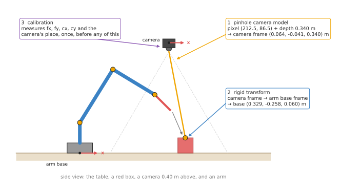
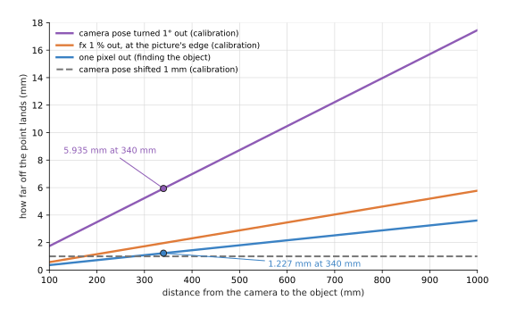

# Geometry and cameras: overview

This chapter covers the techniques that turn pixels, frames and joint angles into
positions you can trust. A robot arm can only move to a place given in metres,
measured from its own base. A camera only gives it pixels. The techniques in this
chapter connect the two.

The chapter is for a reader who knows what a camera, a pixel, a frame and a
transform are, from Books 1 and 2, but who has not yet seen these ideas written
as general methods that can be used on any arm and any camera. This page says what
the five techniques are for, how they fit together, which ones are used most, and
how they connect to the rest of the book.

## Contents

1. [What this family of techniques is for](#1-what-this-family-of-techniques-is-for)
2. [The question it answers for an arm](#2-the-question-it-answers-for-an-arm)
3. [The five techniques](#3-the-five-techniques)
4. [How they compare](#4-how-they-compare)
5. [Why small mistakes here matter so much](#5-why-small-mistakes-here-matter-so-much)
6. [How this chapter connects to the others](#6-how-this-chapter-connects-to-the-others)
7. [Where to read next](#7-where-to-read-next)

---

## 1. What this family of techniques is for

Every robot arm program that uses a camera has to answer the same question many
times a second: where is that thing, in the arm's own terms? The camera sees a red
box at pixel (212, 86). The arm needs to hear "the box is 0.33 m in front of my
base, 0.26 m to the right, and 0.06 m up". Nothing else in the program can start
until that sentence exists.

The techniques in this chapter build that sentence. They are pieces of geometry:
fixed rules about straight lines, angles and distances. They do not learn
anything, and they do not guess. Given the same numbers in, they give the same
numbers out, every time. That is why they sit underneath almost every other
technique in this book.

Here is an everyday example. Think of giving someone directions to a shop. You say
"it is two streets north of the station". That only helps if they know where the
station is and which way north is. A robot has the same problem. A position is only
useful when it comes with its starting point and its directions. This chapter is
about writing positions down with their starting points, and moving them from one
starting point to another.

---

## 2. The question it answers for an arm

The question is: **which point in the arm's space does this pixel show?** It
splits into three smaller questions, and each of the first three techniques in this
chapter answers one of them.

1. Which direction does a pixel look along, and how far along that direction is
   the surface? The **pinhole camera model** answers this. It turns a pixel and a
   depth reading into a point measured from the camera.
2. How do you move that point from the camera's frame into the arm's base frame?
   **Rigid transforms** answer this. They turn and shift a point from one frame
   into another, and they join several such moves into one.
3. Where do the numbers for steps 1 and 2 come from? **Calibration** answers this.
   It measures the camera's lens numbers and the camera's exact place on the arm or
   in the room.

The picture below shows the three steps on one scene. A camera hangs 0.40 m above
a table and looks straight down. A red box stands on the table, and an arm stands
to one side.

The orange line is the direction that pixel (212.5, 86.5) looks along. The depth
reading says the surface is 0.340 m ahead, which gives the point in the camera's
frame. A rigid transform then moves it into the arm base's frame, where it becomes
(0.329, -0.258, 0.060) m. Calibration measured the numbers that both steps use.

Two more techniques answer the questions that come next. When there is no depth
reading, **pose from points** finds a whole object's position and rotation from
the pixels of points whose places on the object are known. And **multi-view
geometry** finds depth from two pictures taken from two known places, or from one
picture and the fact that the point lies on the table.

This is the same scene that Book 2 uses in
[cameras: the basics](../../02_perception/01_camera/01_basics.md) and
[finding one box](../../02_perception/01_camera/03_one-box-intro.md). The numbers
match those pages, so you can check each step against them.

---

## 3. The five techniques

Each technique has its own page. The pages sit in two groups.

The **most used** group holds the four techniques that nearly every arm with a
camera needs. The first three are in the order the steps happen in a running
program, except that calibration comes third. Calibration happens first on a real
robot, but it only makes sense once you know what it is measuring. Pose from points
comes fourth, because it builds on all three, and calibration already uses it on
every picture of the board.

- [The pinhole camera model](02_most-used/01_pinhole-camera-model.md) is the rule for how a
  camera turns a point in the world into a pixel, and how to turn a pixel and a
  depth back into a point. It covers the four lens numbers, how many millimetres
  one pixel covers, and how to find a point with no depth reading when you know the
  table it stands on.
- [Rigid transforms](02_most-used/02_rigid-transforms.md) are the rule for moving a point from
  one frame to another. They cover rotation matrices, the 4 × 4 matrix that holds a
  turn and a shift together, joining frames in a chain, undoing a transform, and
  quaternions, the four numbers most robot software uses for a rotation.
- [Calibration](02_most-used/03_calibration.md) is the method for measuring the numbers the
  other two need. It covers intrinsic calibration with a printed checkerboard, which
  finds the lens numbers, and hand-eye calibration, which finds where the camera
  sits relative to the arm.
- [Pose from points](02_most-used/04_pose-from-points.md), also called
  Perspective-n-Point (PnP), finds an object's full pose, its position and its
  rotation, from the pixels of points whose places on the object are known. It
  covers the reprojection error, PnP inside RANSAC for wrong matches, and why a
  small printed marker seen face-on gives a poor rotation.

The **also used** group holds one technique that many arms use, but not all. Most
table-top arms get depth from a depth camera, so they do not need to work it out
from two pictures themselves. Arms with a wrist camera, a stereo pair, or no depth
sensor at all use it often.

- [Multi-view geometry](03_also-used/01_multi-view-geometry.md) finds depth from two
  pictures. It covers triangulation, epipolar lines and the essential matrix,
  rectified stereo and disparity, height from how far a point shifts when the camera
  slides, and depth from one camera when the point is known to lie on the table.

---

## 4. How they compare

The first three techniques do different jobs, so they are not alternatives to each
other. A working arm with a camera uses all three. The last two are two ways of
getting 3D information when a depth reading is missing or not good enough. The
table below shows, for each technique, what goes in, what comes out, when it runs,
and the most common way it goes wrong. Read each row as one technique.

| Technique | What goes in | What comes out | When it runs | The usual mistake |
| --- | --- | --- | --- | --- |
| [Pinhole camera model](02_most-used/01_pinhole-camera-model.md) | a pixel, a depth, and four lens numbers | a point in the camera's frame, in metres | for every pixel you use, on every picture | using `fx` from a different resolution than the picture |
| [Rigid transforms](02_most-used/02_rigid-transforms.md) | a point, and a turn and shift for each frame on the way | the same point in another frame | every time a number crosses from one frame to another | joining two transforms in the wrong order |
| [Calibration](02_most-used/03_calibration.md) | pictures of a known pattern, and the arm's joint readings | the lens numbers, and the camera's place on the arm | once at set-up, and again after anything is bumped | trusting a low error number from poor pictures |
| [Pose from points](02_most-used/04_pose-from-points.md) | known points on an object, their pixels, and the lens numbers | the object's position and rotation in the camera's frame | on every picture where the object is found | trusting the rotation of a small marker seen face-on |
| [Multi-view geometry](03_also-used/01_multi-view-geometry.md) | the same point's pixels in two pictures, and the two camera poses | the point in 3D, or a depth for every pixel | whenever two pictures of the scene are taken | a baseline too short for the distance |

The first two are short formulas that run in microseconds. Pose from points is a
small search over six numbers that runs in well under a millisecond. Calibration is
a larger optimisation that runs for seconds, once. But calibration decides how
accurate all the others can be, as the next section shows.

---

## 5. Why small mistakes here matter so much

The formulas in this chapter are exact. The numbers you feed them are not. Every
error in a lens number or a camera pose becomes an error in where the arm goes,
and most of these errors grow with distance.

The chart below shows four small mistakes, each on its own, and how far off each
one puts a point, as the object gets further from the camera. The numbers use the
Book 2 camera, with `fx` = 277.1 pixels.

The blue line is a one-pixel mistake in finding the object. It costs 1.227 mm at
340 mm, because one pixel covers `depth / fx` there. The purple line is a camera
pose that is turned 1° away from the truth. It costs 5.935 mm at the same
distance, nearly five times as much. That is a calibration error, not a vision
error.

The lesson is the same one Book 2 draws in
[where the millimetres go](../../02_perception/02_object-perception/01_overview.md#8-where-the-millimetres-go):
a better object detector cannot fix a camera whose position was measured badly.
Calibration is usually the largest error in a robot cell, and it is the one
nobody sees, because the program still produces sensible-looking numbers.

---

## 6. How this chapter connects to the others

The other six chapters of this book all use points, frames and transforms. So this
chapter comes first after the introduction.

- [Searching and matching](../03_searching-and-matching/01_overview.md) works on
  the 3D points the pinhole model makes. Nearest-neighbour search and iterative
  closest point (ICP) both need points in one shared frame. ICP's answer is itself
  a rigid transform. Its page on image features finds the matched points that
  pose from points and multi-view geometry need.
- [Fitting and estimation](../04_fitting-and-estimation/01_overview.md) fits planes
  and shapes to those points. Its RANSAC page is how pose from points and the
  essential matrix cope with wrong matches.
  Calibration is itself a fitting problem: it finds the lens numbers that best
  explain the pictures, by least squares.
- [Image and point cloud processing](../05_image-and-point-cloud-processing/01_overview.md)
  decides which pixels belong to an object. The pinhole model then turns just those
  pixels into points.
- [Planning and search](../06_planning-and-search/01_overview.md) needs the goal
  pose in the arm's base frame. Numerical inverse kinematics chains the same rigid
  transforms that this chapter explains.
- [Control and motion](../07_control-and-motion/01_overview.md) moves the arm between
  poses. Blending two orientations smoothly uses the quaternion blend from the
  rigid transforms page.
- [Decisions and task logic](../08_decisions-and-task-logic/01_overview.md) chooses
  where the camera should look next, which needs the camera's pose for each
  candidate view.

Book 6 has learned models that do parts of this job differently.
[Depth from pictures](../../06_neural-network-models/02_seeing-models/03_also-used/02_depth-from-pictures.md)
guesses a depth for every pixel from a colour picture alone, or from a stereo pair,
which replaces the depth sensor but not the pinhole model: the guessed depth still
goes through the same formula. Multi-view geometry is the measured alternative to
that guess. [Keypoints and object pose](../../06_neural-network-models/02_seeing-models/02_most-used/04_keypoints-and-object-pose.md)
estimates an object's full pose, a rotation and a shift, which is a rigid transform
in the camera's frame. Most of those models find keypoints and then hand them to
[pose from points](02_most-used/04_pose-from-points.md) for the last step. Both
kinds of model still need the lens numbers and the camera's pose that calibration
measures. No learned model removes the need for this chapter.

---

## 7. Where to read next

- Start with [the pinhole camera model](02_most-used/01_pinhole-camera-model.md).
- After calibration, read [pose from points](02_most-used/04_pose-from-points.md),
  then [multi-view geometry](03_also-used/01_multi-view-geometry.md).
- [The map of techniques](../01_what-techniques-are/04_the-map-of-techniques.md)
  shows where this chapter sits among all seven.
- [The building blocks](../01_what-techniques-are/02_the-building-blocks.md)
  introduces frames and transforms as one of the common ingredients.
- Book 1's [position, frames and transforms](../../01_robotics-intro/03_arm/01_overview.md)
  builds transforms by hand on a flat two-joint arm, and is the gentlest start.
- Book 3's [frames, conventions, and the bug class that comes from mixing them](../../03_frameworks/03_arm-movement/08_frames-and-conventions.md)
  lists the conventions that differ between libraries, and the bugs they cause.
