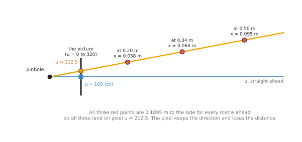
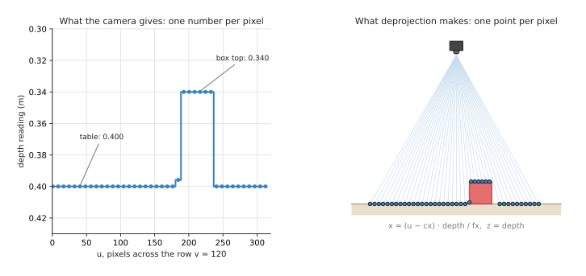
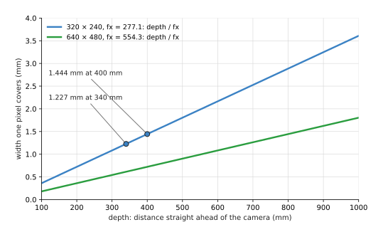
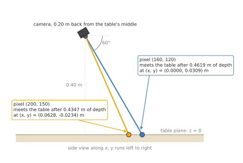

# The pinhole camera model

This page explains the pinhole camera model as a technique you can use in any
program. It answers four questions. How does a camera turn a point in the room into
a pixel? How do you turn a pixel and a depth reading back into a point? How many
millimetres does one pixel cover? And how do you find a point when the camera gives
no depth at all?

It is for a reader who has read Book 2's
[cameras: the basics](../../../02_perception/01_camera/01_basics.md), which explains
pixels, focal length and the four lens numbers from the start, and
[finding one box](../../../02_perception/01_camera/03_one-box-intro.md), which works
through one pixel slowly. This page does not repeat those explanations. It
collects the formulas into one method, adds the parts those pages leave out, and
shows where the method is used on an arm.

## Contents

1. [The idea in one sentence](#1-the-idea-in-one-sentence)
2. [How it works](#2-how-it-works)
   · [Projection: a point to a pixel](#projection-a-point-to-a-pixel)
   · [The same rule as one matrix](#the-same-rule-as-one-matrix)
   · [Back-projection: a pixel and a depth to a point](#back-projection-a-pixel-and-a-depth-to-a-point)
   · [A whole depth picture at once](#a-whole-depth-picture-at-once)
   · [Pixels to millimetres](#pixels-to-millimetres)
   · [No depth: where a pixel's ray meets a known plane](#no-depth-where-a-pixels-ray-meets-a-known-plane)
   · [Lens distortion: where the pinhole stops being true](#lens-distortion-where-the-pinhole-stops-being-true)
   · [Pseudocode](#pseudocode)
3. [Where it is used on a robot arm](#3-where-it-is-used-on-a-robot-arm)
4. [Where it works, and where it does not](#4-where-it-works-and-where-it-does-not)
5. [Libraries that provide it](#5-libraries-that-provide-it)
6. [Why this model, and what it costs](#6-why-this-model-and-what-it-costs)
7. [The learned alternative](#7-the-learned-alternative)
8. [Where to read next](#8-where-to-read-next)

---

## 1. The idea in one sentence

**Every pixel looks out from one point along one straight line, and a camera
records only which line, never how far along it.**

The one point is called the **pinhole**, or the camera's **optical centre**. In a
real camera it is the middle of the lens. The straight line through the pinhole and
a pixel is called that pixel's **ray**.

Here is an everyday example. Hold up a finger at arm's length and close one eye.
Your finger covers a distant tree. Both the finger and the tree lie on the same
line from your eye, so they land on the same spot in your eye. Your one eye cannot
tell which is nearer. A camera has the same limit. The pinhole model is the
arithmetic of that line.

The picture below shows two rays out of a pinhole, drawn from the side.



The blue ray goes straight ahead and lands on the middle of the picture, pixel
u = 160. The orange ray lands on pixel u = 212.5. The three red points sit on that
ray at 0.20 m, 0.34 m and 0.50 m ahead. They are different points in the room, but
all three land on the same pixel.

---

## 2. How it works

The whole model is two formulas, one for each direction. This section writes them
out, puts them in matrix form, and then adds the practical pieces around them.

Every number on this page uses Book 2's simulated camera. Its picture is 320 × 240
pixels. Its four lens numbers are `fx` = `fy` = 277.1 pixels, `cx` = 160 and
`cy` = 120. It hangs 0.40 m above the middle of a table and looks straight down.
The numbers were checked by running the formulas in Python.

### Projection: a point to a pixel

**Projection** takes a point measured from the camera and gives the pixel it lands
on. The camera's axes follow the picture: `x` points right, `y` points down, and
`z` points straight out of the lens. This frame is called the camera's **optical
frame**.

```
u = fx · (x / z) + cx
v = fy · (y / z) + cy
```

In words: divide the sideways distance by the distance ahead, multiply by the focal
length in pixels, and add the position of the middle of the picture.

Take the spot on top of the red box from Book 2. It is at `x` = 0.06442 m,
`y` = -0.04110 m and `z` = 0.340 m from the camera.

```
u = 277.1 · (0.06442 / 0.340) + 160 = 277.1 · 0.18946 + 160 = 212.5
v = 277.1 · (-0.04110 / 0.340) + 120 = 277.1 · -0.12089 + 120 = 86.5
```

The spot lands on pixel (212.5, 86.5). Now double all three distances, to
(0.12884, -0.08220, 0.680). The ratios `x / z` and `y / z` do not change, so the
pixel does not change either. That is the ray from the picture above, written as
arithmetic. The division by `z` is exactly where the distance is lost.

### The same rule as one matrix

Libraries store the four lens numbers as a 3 × 3 grid called the **intrinsic
matrix**, written `K`. Book 2 shows it arriving in ROS's `CameraInfo` message, in
[k in detail](../../../04_ros-and-rviz/01_ros/03_ros-camera.md#23-k-in-detail-what-it-is-why-the-camera-sends-it-and-who-reads-it).

```
      [ fx   0   cx ]   [ 277.1    0    160 ]
K  =  [  0  fy   cy ] = [   0    277.1  120 ]
      [  0   0    1 ]   [   0      0      1 ]
```

Projection is then one multiplication followed by one division. Multiply `K` by the
point, and you get three numbers. Divide the first two by the third.

```
K · (0.06442, -0.04110, 0.340) = (72.25, 29.41, 0.340)
pixel = (72.25 / 0.340, 29.41 / 0.340) = (212.5, 86.5)
```

The third number is the depth. The division by it is the step that loses distance.
You will see this form in every library, and in papers, where it is often written
with a scale factor: `s · (u, v, 1) = K · (x, y, z)`, with `s` equal to `z`.

### Back-projection: a pixel and a depth to a point

**Back-projection** runs the formula the other way. It is also called
**deprojection**, and Book 2 uses that word. It needs one extra number: the depth
reading for that pixel, from a depth camera.

```
x = (u - cx) · depth / fx
y = (v - cy) · depth / fy
z = depth
```

For pixel (212.5, 86.5) with a depth of 0.340 m:

```
x = (212.5 - 160) · 0.340 / 277.1 =  52.5 · 0.0012270 =  0.06442 m
y = ( 86.5 - 120) · 0.340 / 277.1 = -33.5 · 0.0012270 = -0.04110 m
z = 0.340 m
```

That is the point we started from. Book 2 walks through the same four steps with
pictures of the two similar triangles in
[pixel plus depth gives back the point](../../../02_perception/01_camera/03_one-box-intro.md#11-pixel-plus-depth-gives-back-the-point).

Two details decide whether the answer is right.

First, the depth must be the distance straight ahead, along `z`, not the distance
along the slanted ray. Nearly every depth camera reports it this way, and
[depth is not distance](../../../02_perception/01_camera/01_basics.md#depth-is-not-distance)
explains why. If a sensor reports the slanted distance instead, divide it by the
length of the ray direction `((u - cx) / fx, (v - cy) / fy, 1)` first. For our
pixel that length is 1.0249, so a slanted reading of 0.3485 m becomes a depth of
0.340 m.

Second, `u` and `v` should be the middle of the pixel. Pixel number 212 covers the
strip from 212 to 213, so its middle is 212.5. Using 212 moves the point by half a
pixel, which is 0.61 mm at this depth.

### A whole depth picture at once

A depth camera gives a depth for every pixel. Back-projecting all of them gives a
**point cloud**: a list of 3D points, one per pixel. Book 2's camera makes 76,800
points from one picture.

The picture below shows one row of pixels, `v` = 120, across the table and the red
box. The left side is what the camera gives: one depth per pixel. The right side is
what back-projection makes: one point per pixel, placed along its ray.



The picture draws every eighth pixel. The table pixels read 0.400 m and the box-top
pixels read 0.340 m. Just to the left of the box, one drawn pixel sees the box's
side and reads 0.396 m, in between. To the right of the
box there is a gap in the points. The box hides that strip of table from the
camera, so no pixel ever looks at it. This missing strip is called a **shadow**,
and every point cloud from one camera has them.

In a program you rarely loop over pixels one at a time. You compute the `x` and `y`
factors once for every pixel, `(u - cx) / fx` and `(v - cy) / fy`, and multiply the
whole depth picture by them in one step. The factors never change while the camera
and resolution stay the same, so they can be stored.

### Pixels to millimetres

Back-projection also tells you how much of the world one pixel covers. At depth
`z`, moving one pixel to the side moves the point by `z / fx` metres.

```
one pixel covers = depth / fx
at 0.340 m: 0.340 / 277.1 = 0.001227 m = 1.227 mm
at 0.400 m: 0.400 / 277.1 = 0.001444 m = 1.444 mm
```

This is the most useful single number for judging whether a camera can do a job.
If a gap you must measure is 1 mm wide, and one pixel covers 1.4 mm, no program can
measure it. The chart below shows the number against depth for Book 2's camera and
for the same lens on a sensor with twice the pixels across.



Both lines are straight, because the width grows in proportion to depth. Doubling
the resolution halves the width at every depth. Book 2 explains the trade between
field of view and resolution in
[field of view and resolution are separate knobs](../../../02_perception/01_camera/01_basics.md#7-field-of-view-and-resolution-are-separate-knobs).

The same rule measures size. The red box's top is 6 cm wide. At 0.340 m, 6 cm
covers `0.060 / 0.001227` = 48.9 pixels. Read the other way, a box 48.9 pixels wide
at 0.340 m is 6 cm wide.

### No depth: where a pixel's ray meets a known plane

A colour-only camera gives no depth. But if you know the surface the object lies
on, you can still find the point. The ray from the pixel is known. The plane of the
table is known. The point is where the two meet. Book 2 calls this
[knowing the surface the object sits on](../../../02_perception/02_object-perception/01_overview.md#7-the-three-ways-to-supply-the-missing-fact).

The method has three steps.

1. Turn the pixel into a ray direction in the camera's frame:
   `d = ((u - cx) / fx, (v - cy) / fy, 1)`.
2. Turn that direction into the room's frame with the camera's rotation, which the
   [rigid transforms](02_rigid-transforms.md) page explains. The ray now starts at
   the camera's position `c` and runs along the turned direction `d'`.
3. Find how far along the ray the table is. For a table at height 0, the point is
   `c + t · d'`, where `t = -c_z / d'_z`. Because `d` had a 1 in its `z` place, `t`
   is also the depth that pixel would have read.

The picture below uses a tilted camera, the usual case on a wrist. The camera is
0.40 m above the table and 0.20 m back from its middle, looking forward and 60°
down.



The middle pixel (160, 120) looks straight along the camera's axis. Its ray meets
the table after a depth of 0.4619 m, at (0.0000, 0.0309) m in the room. Pixel
(200, 150) meets the table after 0.4347 m, at (0.0628, -0.0234) m. Neither number
came from a depth sensor. Both came from the pixel, the lens numbers, the camera's
pose, and the fact that the table is flat.

The method breaks the moment the object is not on the plane you assumed. A pixel
on top of a box 6 cm tall would give a point on the table behind the box instead.

### Lens distortion: where the pinhole stops being true

A real lens bends light a little, so straight lines in the room come out slightly
curved in the picture. The pinhole model assumes no bending. So real programs
correct the bending first, and then use the pinhole formulas on the corrected
pixels. The correction step is called **undistortion**.

The bending is described by a few more numbers, usually five, called the
**distortion coefficients**. They are measured by
[calibration](03_calibration.md), which also shows how large the bending can be:
several pixels near the corners of a wide lens. Book 2's simulated camera has no
bending at all, so its five distortion numbers are zero.

### Pseudocode

Here is the whole technique in plain steps. It works in any language.

```
lens numbers: fx, fy, cx, cy

project(point):                       # a point in the camera frame to a pixel
    if point.z <= 0: return nothing   # behind the camera, or on it
    u = fx * point.x / point.z + cx
    v = fy * point.y / point.z + cy
    return (u, v)

back_project(u, v, depth):            # a pixel and a depth to a point
    if depth is missing or depth <= 0: return nothing
    x = (u - cx) * depth / fx
    y = (v - cy) * depth / fy
    return (x, y, depth)

depth_picture_to_points(depth_picture):
    points = empty list
    for each pixel (column i, row j):
        p = back_project(i + 0.5, j + 0.5, depth_picture[j][i])
        if p is not nothing: add p to points
    return points

ray_meets_plane(u, v, camera_rotation, camera_position, plane_height):
    d = camera_rotation * ((u - cx) / fx, (v - cy) / fy, 1)
    if d.z is almost 0: return nothing    # the ray runs along the plane
    t = (plane_height - camera_position.z) / d.z
    if t <= 0: return nothing             # the plane is behind the camera
    return camera_position + t * d
```

Note the checks. A missing depth reading is common on shiny or clear objects, and
many cameras report it as 0. Back-projecting a 0 puts a point right on the lens,
which later code will happily treat as a real object.

---

## 3. Where it is used on a robot arm

The pinhole model is under almost every camera measurement on an arm. Here are
concrete places.

- **Turning a detection into a grasp target.** A detector gives a box around a mug.
  The program takes the middle pixel, reads its depth, and back-projects it. That
  point, moved into the base frame, is where the gripper goes. Book 6's
  [object detection](../../../06_neural-network-models/02_seeing-models/02_most-used/01_object-detection.md#6-where-it-is-used-on-a-robot-arm)
  page walks through this.
- **Making a point cloud for the rest of the pipeline.** Plane removal, clustering,
  nearest-neighbour search and ICP all start from back-projected points. The
  project [v1-touch-biggest-face](https://github.com/RobinNagpal/robot-arm-projects/blob/main/v1-touch-biggest-face/docs/step2-pictures-to-points.md)
  back-projects every box pixel from three cameras into one pile of points.
- **Measuring sizes.** The width of an object in pixels, times `depth / fx`, gives
  its width in metres. Book 2's
  [one calculation underneath everything](../../../02_perception/02_object-perception/01_overview.md#6-the-one-calculation-underneath-everything)
  builds a whole measuring method on this.
- **Placing a colour-only camera's detections on the table.** A cheap camera without
  depth can still find where a part lies, by meeting each pixel's ray with the table
  plane.
- **Checking a plan by drawing it.** Projection runs the other way. To check that
  the arm's planned grasp point is on the object, project it into the picture and
  draw a dot. If the dot misses the object, one of the frames is wrong.
- **Deciding whether a pose can see an object.** A planner that chooses camera
  views projects each object's corners. If they land outside 0 to 320 and 0 to 240,
  the view cannot see the object. Book 2's
  [choosing where to look](../../../02_perception/02_object-perception/09_choosing-where-to-look.md)
  relies on this.
- **Checking contact from above.** When the gripper touches a part, a wrist camera
  can project the fingertips' known positions into the picture to see whether they
  line up with the part's edges.

---

## 4. Where it works, and where it does not

The pinhole model is exact for an ideal camera. Real cameras differ from it in a
few ways, and each one shows itself with a sign you can look for. The table below
lists them. Read each row as: what goes wrong, what you see, and what to do.

| What goes wrong | The sign you see | What to do instead |
| --- | --- | --- |
| lens distortion is ignored | straight edges bow; points near the picture's corners are off by several millimetres while the middle is fine | calibrate, then undistort the picture or the pixels first |
| lens numbers from the wrong resolution | every point is too far out or too close to the middle, by the ratio of the two resolutions | scale `fx`, `fy`, `cx` and `cy` with the picture, or read them from the same stream |
| colour and depth pictures not lined up | the object's points are shifted to one side, worst at its edges | use the camera's "aligned depth" stream, or map depth into the colour camera with its own transform |
| no depth reading on glass, chrome or black parts | holes in the point cloud, or points on the lens at depth 0 | skip zero depths; use the table-plane method; see Book 2's [depth hole](../../../02_perception/02_object-perception/03_programmed-methods.md#17-the-depth-hole-for-glass-and-chrome) |
| depth noise at edges | points smeared between the object and the table behind it | shave one pixel off each mask edge, or reject points far from their neighbours |
| a very wide lens, such as a fisheye | the five usual distortion numbers cannot describe the bending | use a fisheye camera model, which libraries offer as a separate set of functions |
| rolling shutter on a moving arm | straight edges lean while the arm moves | stop the arm before taking the picture, or use a camera with a global shutter |

Where it works well: any ordinary camera lens with a field of view up to about
90°, after calibration. That covers almost every camera that is fixed on or near a
robot arm.

---

## 5. Libraries that provide it

You rarely need to write these formulas yourself, although they are short enough
that many projects do. The table lists libraries that provide them. Read each row
as: where to find it, which languages, and what to call.

| Library | Languages | What to call | Note |
| --- | --- | --- | --- |
| OpenCV | C++, Python | `projectPoints`, `undistortPoints`, `undistort` in the `calib3d` module | the reference for projection with distortion; back-projection is `undistortPoints` followed by multiplying by depth |
| Open3D | Python, C++ | `PinholeCameraIntrinsic`; `PointCloud.create_from_depth_image` | turns a whole depth picture into a point cloud in one call |
| ROS `image_geometry` | Python, C++ | `PinholeCameraModel`, with `project3dToPixel` and `projectPixelTo3dRay` | reads the lens numbers straight from a `CameraInfo` message |
| ROS `depth_image_proc` | C++ nodes | the point cloud nodes in the package | publishes a point cloud from a depth topic without any code |
| Intel RealSense SDK (librealsense) | C, C++, Python | `rs2_project_point_to_pixel`, `rs2_deproject_pixel_to_point` | applies the camera's own distortion model |
| NumPy | Python | plain array arithmetic | the whole depth picture in two lines, as Book 2's [one-box code](../../../02_perception/01_camera/04_one-box-code.md) does |
| Eigen | C++ | plain matrix arithmetic | the usual choice when writing it yourself in C++ |

Whatever you use, check which frame it expects. OpenCV and `image_geometry` use
the optical frame, with `z` ahead and `y` down. A robot model's `camera_link`
frame has `x` ahead and `z` up instead. Book 3 explains the difference in
[the camera link and the camera optical frame](../../../03_frameworks/03_arm-movement/08_frames-and-conventions.md#22-the-camera-link-and-the-camera-optical-frame).

---

## 6. Why this model, and what it costs

This section answers the four questions for the pinhole model: what it is, what it
does for you, why it rather than the obvious alternative, and what it costs.

It is the rule that a camera is one point with rays out of it, and that a pixel
records only which ray. It lets you go from a point to a pixel and, with a depth,
from a pixel back to a point, using four numbers that the camera reports.

The obvious alternative is a **lookup table**: put a marker at many known places,
record which pixel each lands on, and interpolate between them. Some old industrial
systems did this. It needs no model at all. But it only works at the heights where
you measured, it must be redone whenever the camera moves, and it needs hundreds of
measurements. The pinhole model needs four numbers, works at every depth, and moves
with the camera through one transform.

The cost is this. The model is only as good as its four numbers and its
distortion numbers, so you must calibrate. It needs a depth reading or a known
plane, because the camera alone never records distance. And it describes one
camera. A stereo pair or a colour camera beside a depth sensor needs one model per
lens, plus the transform between them.

---

## 7. The learned alternative

No learned model replaces the pinhole model itself, because learned models that
measure need the same rule. Book 6's
[depth from pictures](../../../06_neural-network-models/02_seeing-models/03_also-used/02_depth-from-pictures.md)
guesses a depth for each pixel from colour alone, and
[keypoints and object pose](../../../06_neural-network-models/02_seeing-models/02_most-used/04_keypoints-and-object-pose.md)
finds named points on an object in the picture. Both answers still go through the
projection or back-projection formula on this page. The real alternative is to skip
the camera model and train a **policy**, a network that turns pictures straight into
arm movements, as Book 6's [movement models](../../../06_neural-network-models/05_movement-models/01_overview.md)
do. Such a policy absorbs distortion and odd lenses without anyone describing them.
But it needs tens to hundreds of demonstrations for each task, a camera moved by a
few centimetres can confuse it, and it cannot tell you when it is wrong, while every
number in the pinhole model can be checked with a ruler.

---

## 8. Where to read next

- The next page is [rigid transforms](02_rigid-transforms.md). It moves the points
  this page makes from the camera's frame into the arm's frame.
- [Calibration](03_calibration.md) measures the lens numbers and distortion this page
  assumes.
- [Nearest-neighbour search](../../03_searching-and-matching/02_most-used/01_nearest-neighbour-search.md)
  and [iterative closest point](../../03_searching-and-matching/02_most-used/02_iterative-closest-point.md)
  work on the point clouds that back-projection makes.
- [Clustering](../../05_image-and-point-cloud-processing/02_most-used/03_clustering.md) splits those
  point clouds into objects.
- Book 2 goes deeper in [cameras: the basics](../../../02_perception/01_camera/01_basics.md),
  [finding one box](../../../02_perception/01_camera/03_one-box-intro.md) and
  [the wrist camera, end to end](../../../02_perception/02_object-perception/08_the-wrist-camera.md).
