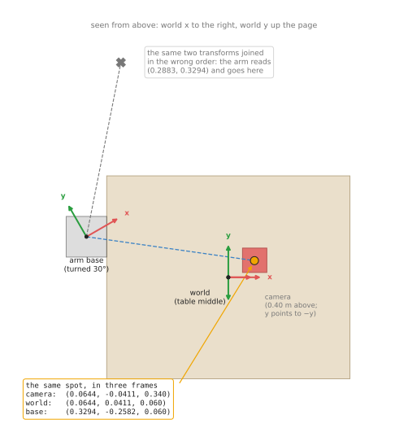
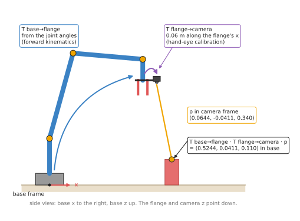
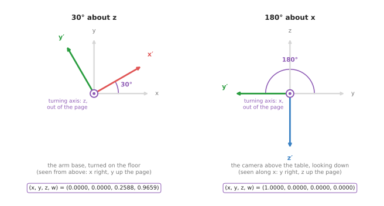
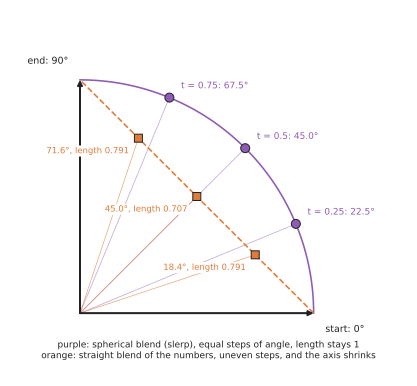

# Rigid transforms

This page explains rigid transforms as a technique you can use in any program,
and it answers five questions. How do you move a point from one frame into
another? How do you store a turn and a shift together? How do you join several
frames in a chain, and undo one? What is a quaternion, in plain words? And how
do you blend smoothly from one orientation to another?

It is for a reader who has met frames and transforms in Book 1. The page
[position, frames and transforms](../../../01_robotics-intro/03_arm/01_overview.md)
builds them by hand on a flat arm, and
[vectors and matrices](../../../01_robotics-intro/02_maths/02_vectors-and-matrices.md)
introduces the 4 × 4 matrix. This page does not rebuild those ideas, but instead
writes them as one general method in 3D, adds quaternions and blending, and
shows where each piece is used on a real arm with a camera.

## Contents

1. [The idea in one sentence](#1-the-idea-in-one-sentence)
2. [How it works](#2-how-it-works)
   · [The turn: a rotation matrix](#the-turn-a-rotation-matrix)
   · [Applying a transform: turn, then shift](#applying-a-transform-turn-then-shift)
   · [The 4 × 4 matrix](#the-4--4-matrix)
   · [Undoing a transform](#undoing-a-transform)
   · [Joining frames in a chain](#joining-frames-in-a-chain)
   · [Quaternions, in plain words](#quaternions-in-plain-words)
   · [Blending two orientations](#blending-two-orientations)
   · [Pseudocode](#pseudocode)
3. [Where it is used on a robot arm](#3-where-it-is-used-on-a-robot-arm)
4. [Where it works, and where it goes wrong](#4-where-it-works-and-where-it-goes-wrong)
5. [Libraries that provide it](#5-libraries-that-provide-it)
6. [Why transforms, and what they cost](#6-why-transforms-and-what-they-cost)
7. [The learned alternative](#7-the-learned-alternative)
8. [Where to read next](#8-where-to-read-next)
9. [Using it in Python](#9-using-it-in-python)

---

## 1. The idea in one sentence

**A rigid transform is one turn followed by one shift, and it moves every point
of a frame together without stretching or bending anything.**

A **frame** is a starting point with three axes, fixed to one physical thing
such as the table, the arm's base, the camera or the gripper, so a position
always belongs to one frame. The word **rigid** means that distances and angles
do not change, which is why a box that is 6 cm wide in the camera's frame is
still 6 cm wide in the base's frame.

So think of an everyday example. Carry a tray with three cups across a room, and
each cup stays at the same place on the tray while only the tray moves. To say
where a cup is in the room, you need the cup's place on the tray and the tray's
place in the room. That tray's place in the room is the rigid transform, because
the cup's place on the tray never changes.

On an arm, the camera plays the part of the tray. The camera reports each object
in its own frame, but the arm needs it in the base frame, so a rigid transform
does the move.

---

## 2. How it works

Section 1 described a transform as one turn and one shift, so this section
builds it as arithmetic. It takes the pieces in the order you use them: the
turn, then applying a turn and a shift, then storing both in one matrix, undoing
it, and joining several, while quaternions and blending come last.

The examples use the scene from Book 2, where a camera hangs 0.40 m above the
middle of a table, looking straight down. The **world** frame sits at the middle
of the table, with `z` up, while the arm's **base** frame sits 0.35 m to the
left and 0.10 m back from the middle, turned 30° about `z`. The spot on top of
the red box is at (0.06442, -0.04110, 0.340) m in the camera's frame, as the
[pinhole camera model](01_pinhole-camera-model.md) page worked out, and all the
numbers were checked in Python.

### The turn: a rotation matrix

A **rotation matrix** is a 3 × 3 grid of numbers that turns a point about the
frame's starting point. Its three columns are where the frame's `x`, `y` and `z`
axes end up after the turn. Book 1 explains why in
[the columns are the turned axes](../../../01_robotics-intro/02_maths/02_vectors-and-matrices.md#the-columns-are-the-turned-axes).

The camera above the table has this rotation, relative to the world:

```
                  camera x   camera y   camera z
world x    [         1          0          0     ]
world y    [         0         -1          0     ]
world z    [         0          0         -1     ]
```

Read it by columns. The camera's `x` points along the world's `x`, while the
camera's `y`, which points down the picture, points along the world's -`y`. The
camera's `z`, which points out of the lens, points along the world's -`z`, which
is straight down at the table.

A rotation matrix is a special grid, because each column has length 1 and each
column is at right angles to the other two. This matters in practice, because if
you round a rotation's numbers it stops being a rotation. For example, rounding
a 30° turn from 0.866 to 0.87 makes every turned point 1.0034 times too far out,
which is 0.34 mm at 10 cm. So keep full precision, or store the rotation as a
quaternion, described below.

### Applying a transform: turn, then shift

A transform from frame A to frame B holds B's rotation and B's position, both
measured in A. It is written `T_A_B`, and you read it as "B, seen from A".
Applying it to a point measured in B gives the same point measured in A:

```
p_A = R · p_B + t
```

where `R` is the rotation and `t` is the shift, and the turn comes first, then
the shift. Book 1 shows in
[order matters](../../../01_robotics-intro/03_arm/01_overview.md#applying-a-transform-turn-then-shift)
why the other order gives a different answer.

For example, take `T_world_camera`, whose rotation is the matrix above and whose
shift is (0, 0, 0.40), because the camera is 0.40 m above the table's middle.

```
turn:   R · (0.06442, -0.04110, 0.340) = (0.06442, 0.04110, -0.340)
shift:  (0.06442, 0.04110, -0.340) + (0, 0, 0.40) = (0.06442, 0.04110, 0.060)
```

So the spot is 0.060 m above the table, which is the height of the box, and
nothing in the arithmetic was told how tall the box is. Book 2 reaches the same
answer by walking along the camera's axes in
[where the camera is](../../../02_perception/01_camera/03_one-box-intro.md#12-where-the-camera-is).

### The 4 × 4 matrix

Programs keep the turn and the shift together in one 4 × 4 matrix. The rotation
fills the top-left 3 × 3 block, the shift fills the last column, and the bottom
row is always `0 0 0 1`:

```
                 [ 1   0   0   0.00 ]
T_world_camera = [ 0  -1   0   0.00 ]
                 [ 0   0  -1   0.40 ]
                 [ 0   0   0   1    ]
```

To apply it, write the point with a 1 on the end, (0.06442, -0.04110, 0.340, 1),
and multiply. The 1 picks up the shift column, so the turn and the shift happen
in one multiplication. This form is called **homogeneous coordinates**, and its
real value is that joining two transforms becomes one matrix multiplication, as
the next parts show.

A direction, such as a surface normal or a velocity, is written with a 0 on the
end instead of a 1. The 0 skips the shift column, so a direction is turned but
not moved. Mixing these up is a common bug: a surface normal that gets shifted
by 0.40 m points somewhere meaningless.

### Undoing a transform

The arm wants the spot in its base frame, not the world frame. We know
`T_world_base`, the base seen from the world, which is turned 30° about `z` and
shifted to (-0.35, 0.10, 0), so we need the opposite, `T_base_world`.

Undoing a rigid transform is cheap, because a rotation's inverse is just its
transpose, the grid flipped across its diagonal, and we write `Rᵀ` for that
transpose.

```
inverse rotation = Rᵀ
inverse shift    = -(Rᵀ · t)
```

For the base:

```
Rᵀ  = [  0.866   0.5    0 ]         -(Rᵀ · t) = (0.2531, -0.2616, 0)
      [ -0.5     0.866  0 ]
      [  0       0      1 ]
```

Applying it to the spot in the world frame, (0.06442, 0.04110, 0.060), gives
(0.3294, -0.2582, 0.060) in the base frame. In other words, you take away the
base's position, which leaves (0.4144, -0.0589, 0.060), and then turn back by
30°.

Never undo a transform by inverting the 4 × 4 matrix with a general-purpose
inverse routine. It works, but it is slower, and small rounding errors creep
into the rotation block, while the transpose rule is exact.

### Joining frames in a chain

Two transforms that meet at a shared frame join into one, by multiplying their
matrices:

```
T_base_camera = T_base_world · T_world_camera
```

The names show whether the order is right, because written this way the inner
names match (`world` next to `world`) and the outer names give the answer
(`base` and `camera`). So the result takes a point in the camera's frame
straight to the base frame.

The picture below shows one spot, seen from above, with its numbers in all three
frames.



All three triples describe the same spot. The camera's triple says "0.340 m in
front of me", the world's says "0.060 m above the table", and the base's says
"0.329 m ahead of me and 0.258 m to my right". The grey cross shows what happens
if the two transforms are joined in the wrong order, as `T_world_camera ·
T_base_world`. The arm then reads (0.2883, 0.3294, 0.060) as its target and goes
to a place 0.589 m from the real spot, and no error message warns about it.

A camera on the arm's wrist makes a longer chain, and one link of it changes
every time the arm moves:

```
p_base = T_base_flange · T_flange_camera · p_camera
```

`T_base_flange` comes from the joint angles, by forward kinematics, and it says
where the arm's last mechanical face, the **flange**, is. `T_flange_camera` is
fixed instead, and comes from [hand-eye calibration](03_calibration.md). The
picture below shows the chain with the flange 0.45 m above the base, pointing
straight down, and the camera 0.06 m along the flange's `x`.



The same camera reading as before, (0.06442, -0.04110, 0.340), now lands at
(0.5244, 0.0411, 0.110) in the base frame. The reading did not change, because
only the chain behind it did. This is how every wrist camera turns what it sees
into a place the arm can reach, and it must use the flange pose from the moment
the picture was taken, not the moment the calculation runs.

### Quaternions, in plain words

A rotation matrix uses nine numbers to describe something that has only three
degrees of freedom, which is more numbers than the job needs. So robot software
usually stores a rotation as four numbers instead, called a **quaternion**.

The idea behind it is simple, because every rotation, however complicated, is
one turn by some angle about some single axis, and this fact is known as Euler's
rotation theorem. So a quaternion stores that axis and that angle, in a
particular way:

```
x, y, z = the axis, as a direction of length 1, times sin(angle / 2)
w       = cos(angle / 2)
```

The picture below shows the two rotations in this page's scene. Each panel looks
straight down the turning axis, so the turn is a plain turn on the page.



The arm's base is turned 30° about `z`, so its axis is (0, 0, 1) and half the
angle is 15°, which makes the quaternion (0, 0, sin 15°, cos 15°) = (0, 0,
0.2588, 0.9659). The camera is turned 180° about `x`, so its axis is (1, 0, 0)
and half the angle is 90°, which makes the quaternion (1, 0, 0, 0). That half
turn is what makes the camera look down, because its `y` and `z` both flip.

So four facts are enough to use quaternions safely.

1. **The four numbers always have length 1.** That is, `x² + y² + z² + w² = 1`. If
   rounding or averaging breaks this, divide all four by their length. This one
   step is much simpler than repairing a rotation matrix.
2. **`q` and `-q` are the same rotation.** (0, 0, 0.2588, 0.9659) and
   (0, 0, -0.2588, -0.9659) both turn 30° about `z`. So never compare
   quaternions number by number, and compare the rotations they make instead.
3. **The order of the four numbers differs between libraries.** ROS and SciPy put
   `w` last, as (x, y, z, w), while MuJoCo and Eigen's constructor put `w`
   first. So reading one as the other gives a wrong rotation with no error, and
   Book 3 lists who uses which in
   [quaternion ordering](../../../03_frameworks/03_arm-movement/08_frames-and-conventions.md#21-quaternion-ordering).
4. **You do not have to multiply them by hand.** Every library converts a
   quaternion to a rotation matrix and back. The conversion from `(x, y, z, w)` to a
   matrix is:

```
[ 1 - 2(y² + z²)    2(xy - zw)       2(xz + yw)     ]
[ 2(xy + zw)        1 - 2(x² + z²)   2(yz - xw)     ]
[ 2(xz - yw)        2(yz + xw)       1 - 2(x² + y²) ]
```

Putting in (0, 0, 0.2588, 0.9659) gives the 30° turn about `z`, with 0.866 and
0.5 in the usual places.

The other common way to write a rotation is three angles, such as roll, pitch
and yaw. They are easy to read, which is why URDF files and user interfaces use
them. But they need a stated axis order and convention, and at some poses two of
the three axes line up so that one direction of turning is lost, and this is
called **gimbal lock**. So use three angles for people to read and type, and
convert to a quaternion or a matrix for the arithmetic. Book 3 covers the
convention problem in
[Euler angles, intrinsic and extrinsic](../../../03_frameworks/03_arm-movement/08_frames-and-conventions.md#24-euler-angles-intrinsic-and-extrinsic).

### Blending two orientations

A motion from one gripper orientation to another needs the orientations in
between. The obvious way is to blend the numbers directly, so that at the
halfway point you take half of each. However, for rotations this goes badly
wrong, as the picture below shows.

The picture below blends from a turn of 0° to a turn of 90° about `z`, and
follows the tip of the turned `x` axis.



The purple points blend along the circle, so at a quarter, half and three
quarters of the way they are at 22.5°, 45° and 67.5°, which are equal steps, and
the axis keeps its length of 1. This is called **spherical linear
interpolation**, or **slerp** for short. The orange points instead blend the
matrix numbers in a straight line, so they are at 18.4°, 45° and 71.6°. This
means the motion speeds up and slows down, and the axis shrinks to 0.707 of its
length at halfway. A shrunken axis is not a rotation at all.

For quaternions, slerp between `q0` and `q1` at fraction `s` is:

```
angle between them:  a = arccos(q0 · q1)          (the dot product of the four numbers)
blend:               q = (sin((1 - s)·a) · q0 + sin(s·a) · q1) / sin(a)
```

If `q0 · q1` is negative, flip the sign of `q1` first. Because `q` and `-q` are
the same rotation, this picks the shorter way round. Without it the gripper can
swing the long way, nearly a full turn. When the two are almost equal, `sin(a)`
is almost 0; blend the numbers directly and then set the length back to 1.

### Pseudocode

Here is the whole technique in plain steps, and it works in any language.

```
transform = (R: 3x3 rotation, t: 3-vector shift)

apply(T, point):              # point in the child frame -> point in the parent frame
    return T.R * point + T.t

apply_to_direction(T, d):     # a direction is turned, never shifted
    return T.R * d

join(T_a_b, T_b_c):           # the inner frame names must match
    return (T_a_b.R * T_b_c.R,  T_a_b.R * T_b_c.t + T_a_b.t)

invert(T_a_b):                # gives T_b_a
    Rt = transpose(T_a_b.R)
    return (Rt, -(Rt * T_a_b.t))

quaternion_to_rotation(x, y, z, w):
    n = sqrt(x*x + y*y + z*z + w*w)
    x, y, z, w = x/n, y/n, z/n, w/n        # always make the length 1 first
    return the 3x3 matrix above

slerp(q0, q1, s):
    d = dot(q0, q1)
    if d < 0: q1 = -q1; d = -d             # take the shorter way round
    if d > 0.9995:                         # almost the same: blend and renormalise
        q = q0 + s * (q1 - q0)
        return q / length(q)
    a = arccos(d)
    return (sin((1 - s) * a) * q0 + sin(s * a) * q1) / sin(a)
```

---

## 3. Where it is used on a robot arm

Section 2 built the arithmetic, and this section says where an arm program uses
it. Rigid transforms appear everywhere a number crosses from one part of the
robot to another, and here are the concrete places.

- **Camera to base, for every detection.** Every back-projected point is moved into
  the base frame before the arm can use it. With a fixed camera this is one fixed
  transform. With a wrist camera it is the chain through the flange.
- **Forward kinematics.** The gripper's pose is the product of one transform per
  joint, from the base outwards, and Book 1's
  [forward kinematics](../../../01_robotics-intro/04_kinematics/01_forward-kinematics.md)
  is exactly this chain.
- **Tool centre point.** The arm's controller reports the flange. The point that
  touches the object is the tool tip, typically 100 to 200 mm further on. One fixed
  transform, flange to tool, turns one into the other.
- **Grasp poses stored relative to the object.** A good grasp on a mug is stored
  once, in the mug's own frame. When the mug is found at a new pose, one join gives
  the grasp in the base frame. Book 6's
  [six-DoF grasps](../../../06_learned-models/05_grasp-models/02_most-used/01_six-dof-grasps.md)
  output poses that go through this step.
- **Merging views.** Point clouds from three camera positions are each moved into
  the world frame and added together. The result of
  [iterative closest point](../../03_searching-and-matching/02_most-used/02_iterative-closest-point.md)
  is itself a rigid transform that lines two clouds up.
- **Force readings.** A force sensor reports in its own frame. Before the controller
  compares a force with "straight down", it turns the force into the base frame.
  A force is a direction, so it is turned but not shifted.
- **Smooth orientation changes.** A planner that moves the gripper from one
  orientation to another blends them with slerp, and the
  [trajectory generation](../../07_control-and-motion/02_most-used/02_trajectory-generation.md)
  page uses this.
- **ROS's TF.** ROS keeps a tree of every frame on the robot and joins transforms on
  request. Book 1 explains it in
  [ask instead of working it out](../../../01_robotics-intro/03_arm/01_overview.md#7-step-5-ask-instead-of-working-it-out).

---

## 4. Where it works, and where it goes wrong

The uses in section 3 all depend on getting the frames right, which is where the
trouble starts. The arithmetic of rigid transforms is exact, so the mistakes
come from feeding it the wrong things, and each mistake has a sign you can look
for. The table below lists them, so read each row as what goes wrong, what you
see, and what to do.

| What goes wrong | The sign you see | What to do instead |
| --- | --- | --- |
| two transforms joined in the wrong order | the answer is off by tens of centimetres, often in a plausible-looking place | name every variable `T_parent_child`, and check that the inner names match |
| a transform used in the wrong direction | the answer is mirrored or rotated; moving the camera moves the result the wrong way | name it; test with a point you can measure with a ruler |
| quaternion order `(w, x, y, z)` read as `(x, y, z, w)` | objects appear turned by large, odd angles; the identity looks like a half turn | check the library's documentation; Book 3's [quaternion ordering](../../../03_frameworks/03_arm-movement/08_frames-and-conventions.md#21-quaternion-ordering) |
| a rotation that drifted from being a rotation | lengths grow or shrink slowly over many joins | renormalise the quaternion, or re-orthogonalise the matrix |
| a direction shifted as if it were a point | surface normals and forces point the wrong way | apply only the rotation to directions |
| a wrist camera's picture paired with the wrong arm pose | points smear or jump while the arm moves, and are fine when it is still | look up the flange pose at the picture's timestamp |
| degrees read as radians | turns of 57 times the intended size | keep radians inside the program; convert only at the edge |
| the transform itself is wrong | everything is consistently off by a few millimetres or a degree | the arithmetic cannot fix this; it is a [calibration](03_calibration.md) problem |

Rigid transforms work only for rigid things, because a cable, a soft gripper
finger or a bending arm under a heavy load does not move rigidly, and a rigid
transform will then describe it only approximately.

---

## 5. Libraries that provide it

Every robotics stack provides rigid transforms, and you should use one rather
than writing your own for anything beyond a small script. The table below lists
well-known libraries, so read each row as where to find it, which languages it
covers, and what to call.

| Library | Languages | What to call | Note |
| --- | --- | --- | --- |
| Eigen | C++ | `Eigen::Isometry3d`, `Eigen::Quaterniond`, `Eigen::AngleAxisd` | the base of MoveIt, PCL and most C++ robotics code; the `Quaterniond` constructor takes `w` first |
| SciPy | Python | `scipy.spatial.transform.Rotation`, `Slerp` | converts between matrices, quaternions, axis-angle and Euler angles; `w` last by default |
| ROS 2 tf2 | C++, Python | `tf2_ros.Buffer` and its `lookup_transform`; `tf2_geometry_msgs` for applying one | keeps the whole frame tree and joins transforms for you, at a given time |
| Pinocchio | C++, Python | `pinocchio.SE3` | rigid transforms plus the arm's kinematics in one library |
| KDL (Kinematics and Dynamics Library) | C++, Python | `KDL::Frame`, `KDL::Rotation` | used by many ROS kinematics plugins |
| Open3D | Python, C++ | `PointCloud.transform` | applies a 4 × 4 matrix to a whole point cloud |
| PCL (Point Cloud Library) | C++ | `pcl::transformPointCloud` | the same, for PCL clouds |
| NumPy | Python | plain 4 × 4 arrays and `@` | enough for small programs; Book 1's [NumPy page](../../../01_robotics-intro/01_python-and-numpy/02_numpy-intro.md) shows how |

---

## 6. Why transforms, and what they cost

This section answers the four questions for rigid transforms: what they are,
what they do for you, why they rather than the obvious alternative, and what
they cost.

A rigid transform is one turn and one shift, kept together. So it lets every
part of the robot describe positions in its own simplest frame, and lets any
program ask for any position in any other frame.

The obvious alternative is to write one formula for each question: "the box,
from the base, is this sum of sines and cosines". Book 1 does this in
[two joints, worked out by hand](../../../01_robotics-intro/03_arm/01_overview.md#3-step-1-two-joints-worked-out-by-hand)
and shows why it breaks: every new joint, every move to 3D, and every new
question means a new formula. With transforms you describe each part once,
against its neighbour, and let joining do the rest. Adding a wrist camera adds
one transform to the chain, not a new formula.

A second alternative is to store orientations as three angles everywhere. Three
angles are easy to read, but they depend on a convention that differs between
libraries, they lose a direction at gimbal lock, and they cannot be blended
correctly. Quaternions and matrices have none of these problems, so use angles
only where people read and type them.

The cost is this. Each transform has a direction, and each quaternion library
has an order, and neither of those is visible in the numbers themselves. A wrong
one gives a plausible answer rather than an error. So you must name frames
carefully and test with a known point. And the transforms are only as right as
the measurements behind them: the joint readings, and the calibration.

---

## 7. The learned alternative

There is no learned model that replaces rigid transforms, because joining,
undoing and blending them is exact arithmetic, and a network could only make it
approximate. Instead, learned models produce transforms that this arithmetic
then uses. Book 6's
[keypoints and object pose](../../../06_learned-models/03_seeing-models/02_most-used/04_keypoints-and-object-pose.md)
estimates an object's rigid transform from a picture with a trained model, and
that answer still has to be joined into the chain on this page to reach the
arm's base. Where a part of the arm is not quite rigid, such as a link that
bends a little under its own weight, Book 6's
[learned arm models](../../../06_learned-models/09_touch-and-body-models/03_also-used/02_learned-arm-models.md#34-calibration)
describes a small network that learns the leftover error and adds a correction
to the tool's position. So the transforms still do the main work.

---

## 8. Where to read next

- The next page is [calibration](03_calibration.md). It measures the transform from
  the flange to the camera, which this page took as given.
- The previous page, [the pinhole camera model](01_pinhole-camera-model.md), makes
  the camera-frame points this page moves.
- [Iterative closest point](../../03_searching-and-matching/02_most-used/02_iterative-closest-point.md)
  finds the rigid transform that lines two point clouds up.
- [Numerical inverse kinematics](../../06_planning-and-search/02_most-used/02_numerical-inverse-kinematics.md)
  runs the transform chain backwards, from a wanted pose to joint angles.
- [Trajectory generation](../../07_control-and-motion/02_most-used/02_trajectory-generation.md)
  uses slerp to move the gripper smoothly between orientations.
- Book 3's [frames, conventions, and the bug class that comes from mixing them](../../../03_frameworks/03_arm-movement/08_frames-and-conventions.md)
  goes much deeper into the conventions and how to check them.

---

## 9. Using it in Python

Section 2 built a transform by hand, joined two of them, undid one, and blended
two orientations, and section 5 listed the libraries that already do all of that.
This section shows the two you are most likely to use in Python, because they
answer two different questions. SciPy answers "what is this rotation in another
form", while tf2 answers "where is this frame right now". After reading it you
should know which of the two a given line of your program needs.

SciPy's `Rotation` class converts between matrices, quaternions, axis-angle and
Euler angles, and NumPy holds the 4 by 4 matrix and multiplies it.

```python
import numpy as np
from scipy.spatial.transform import Rotation, Slerp

def make_transform(quaternion_xyzw, translation):
    T = np.eye(4)
    T[:3, :3] = Rotation.from_quat(quaternion_xyzw).as_matrix()
    T[:3, 3] = translation
    return T

T_base_flange = make_transform([0.0, 0.0, 0.0, 1.0], [0.40, 0.10, 0.30])
T_flange_camera = make_transform([0.0, 0.7071, 0.0, 0.7071], [0.05, 0.0, 0.02])

T_base_camera = T_base_flange @ T_flange_camera     # join: read right to left
T_camera_base = np.linalg.inv(T_base_camera)        # undo

point_camera = np.array([0.064, -0.041, 0.340, 1.0])   # the 1.0 applies the shift
point_base = (T_base_camera @ point_camera)[:3]

# Blending two orientations along the shortest turn, which is slerp.
ends = Rotation.from_quat([[0.0, 0.0, 0.0, 1.0], [0.0, 0.0, 0.7071, 0.7071]])
halfway = Slerp([0.0, 1.0], ends)(0.5)
print(halfway.as_euler("xyz", degrees=True))        # [0. 0. 45.]
```

On a running robot you do not build those matrices yourself, because every part of
the robot already publishes where it is. tf2 collects all of that into one tree and
joins the chain for you.

```python
import rclpy, tf2_ros
from geometry_msgs.msg import PointStamped
from tf2_geometry_msgs import do_transform_point

buffer = tf2_ros.Buffer()
listener = tf2_ros.TransformListener(buffer, node)      # node is your rclpy node

transform = buffer.lookup_transform("base_link", "camera_optical_frame",
                                    rclpy.time.Time())  # the latest available
point_base = do_transform_point(stamped_point, transform)
```

The libraries do three things that are easy to get wrong by hand. SciPy converts
between the four ways of writing a turn without you writing a single sine, and its
`Slerp` blends along the shortest turn rather than through the long way round. tf2
joins every link in the chain from the camera to the base, including the joints that
moved since the last picture, and it can give you the chain as it was at the moment
the picture was taken rather than as it is now, which matters on a moving arm.

What you still write yourself is the naming. Nothing in either library records that
`T_base_camera` means "the camera's frame expressed in the base frame", so the
direction of every transform lives only in your variable names and your head. The
order in `T_base_flange @ T_flange_camera` is yours to get right, and writing it
with the matching frame names touching, as above, is the cheapest way to check it.
You also have to wrap `lookup_transform` in a `try` block for
`tf2_ros.LookupException` and `tf2_ros.ExtrapolationException`, because the tree is
incomplete for the first moments after start-up and a transform can be asked for
too far in the past.

What you have to decide or measure is the quaternion order and the frame names.
SciPy's `from_quat` takes x, y, z, w in that order, while ROS messages, Eigen's
`Quaterniond` constructor and many papers put w first, and a swapped quaternion
gives a rotation that is wrong without being obviously wrong. The frame names must
match what the robot description publishes exactly, letter for letter, and the
numbers inside `T_flange_camera` come from
[hand-eye calibration](03_calibration.md#3-hand-eye-calibration-where-the-camera-is-on-the-arm)
rather than from a drawing. The one test worth writing is the one section 4
describes: transform a point you have measured with a ruler, and check the answer
in millimetres.
