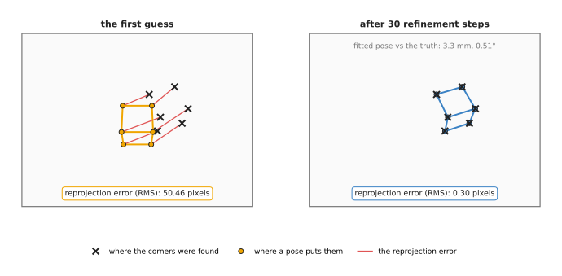
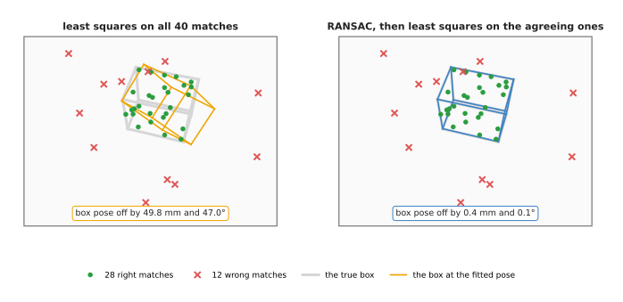
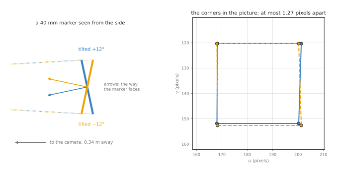
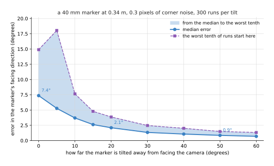

# Pose from points: Perspective-n-Point

This page explains how a program finds an object's full pose from one colour
picture. The object's **pose** is where it is and which way it is turned: three
numbers for its position and three for its rotation, six in all. Robotics people
call this a **six degrees of freedom (6-DoF)** pose. The method on this page is
called **Perspective-n-Point**, or **PnP**. It answers four questions. What does
PnP need? How does it find the pose? What happens when some of its inputs are
wrong? And why is a flat printed marker hard to read when it faces the camera
squarely?

It is for a reader who has read the three pages before this one.
[The pinhole camera model](01_pinhole-camera-model.md) turns a point into a pixel.
[Rigid transforms](02_rigid-transforms.md) describe a pose as a rotation and a
shift. [Calibration](03_calibration.md) already uses PnP once, to find the board in
each picture. This page opens that step up. Every number on this page comes from a
real run of the diagram script, `docs/diagrams/geometry_and_cameras_2.py`, with
Book 2's camera: 320 × 240 pixels, `fx` = `fy` = 277.1, `cx` = 160, `cy` = 120.

## Contents

1. [The idea in one sentence](#1-the-idea-in-one-sentence)
2. [How it works, step by step](#2-how-it-works-step-by-step)
   · [What goes in and what comes out](#what-goes-in-and-what-comes-out)
   · [Reprojection error, again](#reprojection-error-again)
   · [A first guess, then refinement](#a-first-guess-then-refinement)
   · [A worked run: the red cube](#a-worked-run-the-red-cube)
   · [How many points are needed](#how-many-points-are-needed)
   · [Pseudocode](#pseudocode)
3. [PnP inside RANSAC: when some matches are wrong](#3-pnp-inside-ransac-when-some-matches-are-wrong)
4. [A flat target, and why face-on is unstable](#4-a-flat-target-and-why-face-on-is-unstable)
5. [Where it is used on a robot arm](#5-where-it-is-used-on-a-robot-arm)
6. [Where it works, and where it does not](#6-where-it-works-and-where-it-does-not)
7. [Libraries that provide it](#7-libraries-that-provide-it)
8. [Why PnP, and what it costs](#8-why-pnp-and-what-it-costs)
9. [Where to read next](#9-where-to-read-next)

---

## 1. The idea in one sentence

**If you know where some points are on an object, and you can see which pixels
they land on, there is only one pose of the object that puts all of them on those
pixels.**

Here is an everyday example. You are lost in a town, but you can see three
landmarks you know: a church tower, a bridge and a tall chimney. You know where
each one is on your map. You can also see in which direction each one lies from
where you stand. Only one spot on the map gives those three directions at once.
That spot is where you are. Sailors call this "taking a fix".

PnP is the same idea. The "map" is the object's own shape, written as points in
millimetres. The "directions" are the pixels, because each pixel is a direction
from the camera, as [the pinhole camera model](01_pinhole-camera-model.md) shows.
The answer is the object's pose relative to the camera. Turned around, it is also
the camera's pose relative to the object, which is exactly what calibration needs.

---

## 2. How it works, step by step

### What goes in and what comes out

PnP needs three things.

1. **The object's points, in the object's own frame.** For a 6 cm cube, the corners
   are at (±30, ±30, 0) mm and (±30, ±30, 60) mm, measured from the middle of its
   base. These come from a drawing, a computer-aided design (CAD) model, or a
   printed pattern.
2. **The pixel where each of those points appears.** Something else finds these: a
   corner detector, a marker detector, a feature matcher, or a neural network that
   finds keypoints. PnP does not look at the picture at all.
3. **The camera's lens numbers**, `fx`, `fy`, `cx` and `cy`, and its distortion.
   [Calibration](03_calibration.md) measures them.

Each point must be paired with its own pixel. The pairing is called a
**correspondence**: "this pixel shows that corner". PnP trusts the pairing
completely. Section 3 deals with pairings that are wrong.

What comes out is a rotation `R` and a shift `t`. Together they are the transform
`T_camera_object`. It moves a point from the object's frame into the camera's frame.
[Rigid transforms](02_rigid-transforms.md) then carry it into the arm's base frame.

### Reprojection error, again

Suppose you guess a pose. With that guess, you can place each object point in the
camera's frame and project it to a pixel. That is **reprojection**. The distance
between where a point reprojects and where it was really seen is its
**reprojection error**, in pixels. The [calibration](03_calibration.md#reprojection-error-the-number-the-method-makes-small)
page introduced it.

PnP is a search for the pose with the smallest reprojection error. It combines the
errors of all the points into one number, the **root mean square (RMS)**: square
each distance, take the mean, and take the square root. When the pose is right, the
RMS is about as large as the noise in the pixels, usually a few tenths of a pixel.

### A first guess, then refinement

The projection formula divides by depth, so the error is not a simple straight-line
function of the pose. PnP therefore works in two stages, like calibration does.

1. **A first guess.** A short formula gives an approximate pose directly. The
   simplest one is the **direct linear transform (DLT)**. It treats the 12 numbers
   of the 3 × 4 matrix `[R | t]` as unknowns, writes two straight-line equations
   for each point, and solves them all at once. It needs six or more points that
   are not all on one plane. Better formulas exist. **EPnP** (efficient PnP) needs
   only four points and is very fast. **P3P** (perspective-three-point) uses exactly
   three.
2. **Refinement.** Starting from the guess, the program nudges all six pose numbers
   at once in the direction that shrinks the RMS fastest. It repeats until the RMS
   stops falling. The usual method is **Levenberg–Marquardt**, the same one
   calibration uses. It is fast because there are only six unknowns.

The first guess matters. Refinement only walks downhill from where it starts. If
the start is poor, it can settle in the wrong valley. Section 4 shows this happening
with flat markers.

### A worked run: the red cube

Here is a real run. Book 2's red box, a 6 cm cube, stands on the table, turned 20°.
The camera is the tilted one from the pinhole page: 0.40 m above the table, 0.20 m
back from its middle, and looking 60° down. From there it can see six corners of the
cube: the four on top and the two bottom corners of the near face.

We projected those six corners with the true pose, then added random noise of 0.3
pixels to each pixel, which is what a good corner detector achieves. We then gave
the refinement a deliberately poor start: the cube in the middle of the table, not
turned. The picture shows the start and the end.



On the left, the orange cube is where the first guess puts the corners. The red lines
are the reprojection errors. Their RMS is 50.46 pixels. On the right, after the
refinement, every orange dot sits on its black cross. The RMS fell like this, one
step at a time:

| Step | 0 | 1 | 2 | 3 | 4 and after |
| --- | --- | --- | --- | --- | --- |
| RMS reprojection error (pixels) | 50.46 | 5.25 | 0.43 | 0.30 | 0.30 |

Read the table from left to right. Three steps took the error from 50 pixels to the
noise level, and the steps after that changed nothing. The final pose was 3.3 mm and
0.51° from the truth. The cube was about 0.47 m from the camera, where one pixel
covers 1.7 mm, so 3.3 mm is about what 0.3 pixels of noise on six points allows.

For comparison, the DLT first guess on the same six points gave an RMS of 2.80
pixels, a position 5.1 mm off, and a rotation 4.6° off. The DLT is a good place to
start, but not a place to stop.

### How many points are needed

A pose has six unknown numbers, and each point gives two measurements: its `u` and
its `v`. So three points give six measurements, which is just enough. But three
points can fit up to four different poses, so a fourth point is needed to choose
between them. In practice:

- **3 points** give up to four answers. This is P3P, used inside RANSAC.
- **4 points** give one answer, if they are well spread. A square marker has four
  corners.
- **6 or more points** make the answer steady, because the noise averages out.

Points that are close together, or almost in a straight line, give a poor pose even
when there are many of them. Spread matters as much as count. The object should
also fill a fair part of the picture. A small object far away gives short
distances between its pixels, and the same noise then means a larger turn.

### Pseudocode

Here is PnP in plain steps. The first-guess formula is named rather than written
out, because every library provides one.

```
inputs: object_points (N points, in the object's frame, in metres)
        pixels        (N pixels, in the same order)
        K, distortion (from calibration)

pixels = undistort(pixels, K, distortion)
R, t = first_guess(object_points, pixels, K)     # DLT, EPnP or P3P

repeat up to 30 times:
    predicted = project(R * object_points + t, K)
    errors = predicted - pixels
    step = the change to (R, t) that shrinks sum(errors²) fastest   # Levenberg–Marquardt
    apply step to R and t
    if the error stopped falling: stop

rms = sqrt(mean(|errors|²))
if rms > about 2 pixels: report failure, do not use the pose
return T_camera_object = (R, t), rms
```

---

## 3. PnP inside RANSAC: when some matches are wrong

In real pictures, the pairings are not all right. A feature matcher pairs a pattern
on one side of a box with a similar pattern on the other side. A keypoint model
puts a point on a reflection. One wrong pairing can pull the whole pose away,
because refinement tries to satisfy every pairing at once.

**RANSAC (random sample consensus)** is the standard cure. The
[RANSAC page](../../04_fitting-and-estimation/02_most-used/02_ransac.md) explains
it for lines and planes. For PnP it works like this.

1. Pick a few pairings at random: 3 or 4 for P3P or EPnP.
2. Find the pose that those few imply.
3. Reproject every object point with that pose. Count the pairings whose
   reprojection error is under a limit, such as 3 pixels. These are the
   **inliers**: the pairings that agree.
4. Repeat many times. Keep the pose with the most inliers.
5. Refine that pose using only its inliers.

We tested this on a printed box, 120 × 80 × 100 mm, with 40 matched features on its
top and front faces. We gave the true pixels 0.5 pixels of noise. Then we replaced
12 of the 40 pixels, 30 per cent, with random places in the picture. Our RANSAC drew
6 pairings per try, because our simple DLT needs six, and made 200 tries.



The grey box is the truth. On the left, refinement on all 40 pairings produced the
orange box. It is 49.8 mm and 47.0° away from the truth, which is useless. On the
right, RANSAC found 28 inliers. They were exactly the 28 right pairings: it caught
all 12 wrong ones and dropped none of the right ones. The final pose was 0.4 mm and
0.1° from the truth.

How many tries are enough? A try succeeds when every pairing it draws is right. With
70 per cent right pairings, a draw of 6 is all right with a chance of 0.7⁶, about
12 per cent. To be 99 per cent sure of at least one clean draw, you need about 37
tries. A draw of 4 is all right 24 per cent of the time, and needs about 17 tries.
That is why real libraries use four-point or three-point solvers inside RANSAC.

---

## 4. A flat target, and why face-on is unstable

Many robot cells find objects with a **fiducial marker**: a printed black-and-white
square, such as an ArUco or AprilTag marker, stuck on the object or on a fixture.
Its pattern tells the detector which marker it is and which corner is which. Book 2
describes them in
[a marker of known size](../../../02_perception/02_object-perception/03_programmed-methods.md#24-a-marker-of-known-size).
The four corners of the square, with the marker's known size, are exactly a PnP
problem with four points on one plane.

Four points on a plane are enough in theory. In practice there is a trap. When the
marker is nearly face-on to the camera, **two different poses fit the corners almost
equally well**. One is tilted a little towards the camera; the other is tilted the
same amount away. The picture shows this for a 40 mm marker, 0.34 m away, tilted
12° one way or the other.



On the left, the two markers are seen from the side. They face clearly different
ways: the arrows show the direction each one faces, 24° apart. On the right are the
four corners each pose puts in the picture. They differ by at most 1.27 pixels. At
5° of tilt, the gap is only 0.53 pixels. A corner detector with 0.3 pixels of noise
cannot reliably tell the two apart.

The reason is perspective. When the marker is tilted, its near edge looks a little
longer than its far edge. That small difference is the only clue to which way it
tilts. A marker 40 mm wide at 0.34 m covers only 32.6 pixels, so the difference is
a fraction of a pixel.

We measured how bad this is. For each tilt, we added 0.3 pixels of noise to the four
corners 300 times, solved each time from both possible starting poses, and kept the
one with the smaller reprojection error. This is what the solvers built for squares
do. The chart shows the error in the direction the marker faces.



The table gives the same numbers. Read each row as one tilt: the typical error, the
error that the worst tenth of runs reached or passed, and how often the solver chose
the wrong one of the two poses.

| Tilt | Median error | Worst tenth | Chose the mirrored pose |
| --- | --- | --- | --- |
| 0° (face-on) | 7.4° | 14.9° or more | (both poses are the same) |
| 5° | 5.3° | 18.0° or more | 19 per cent of runs |
| 10° | 3.7° | 7.7° or more | 7 per cent |
| 20° | 2.1° | 3.9° or more | 2 per cent |
| 30° | 1.3° | 2.5° or more | none |
| 60° | 0.7° | 1.3° or more | none |

Face-on, the facing direction is typically 7.4° wrong. At 30° of tilt, the same
marker and the same noise give 1.3°. The distance to the marker, by contrast, came
out about 2 mm wrong at every tilt. **A small, face-on marker gives a good position
and a poor rotation.**

Here is what people do about it.

- **Tilt the camera or the marker** so that the marker is seen at 20° to 45°, not
  face-on.
- **Make the marker bigger in the picture.** A larger marker, or a closer camera,
  makes the perspective clue larger.
- **Use several markers**, or a board of them, spread apart. Points that are far
  apart and not all on one small square fix the rotation well.
- **Use the rotation you already know.** If the marker is on a flat table, its
  facing direction is the table's up direction, and only its turn about that
  direction needs to come from the picture.
- **Filter over time.** A rotation that flips from frame to frame is the sign of
  this problem. A [Kalman filter](../../04_fitting-and-estimation/02_most-used/03_kalman-filter.md)
  or a simple median over a few frames smooths it.

---

## 5. Where it is used on a robot arm

PnP runs wherever a program knows an object's shape and can find points on it in a
colour picture. Here are concrete places.

- **Reading a fiducial marker.** A marker on a fixture, a tray or a rack gives its
  pose in one picture. Book 3's
  [place-glass case study](../../../03_frameworks/04_one-arm-training/07_case-study/01_place-glass.md)
  finds a glass rack this way, with an AprilTag.
- **Calibration.** Every calibration picture uses PnP to find the board's pose in
  the camera's frame. Hand-eye calibration then compares those poses with the arm's,
  as the [calibration](03_calibration.md#a-x--x-b-in-plain-words) page shows.
- **Keypoint models.** A neural network finds named points on an object, such as a
  mug's handle and rim. PnP turns them into a pose. Book 6's
  [keypoints and object pose](../../../06_neural-network-models/02_seeing-models/02_most-used/04_keypoints-and-object-pose.md#from-keypoints-to-pose)
  describes this split: the network finds the points, and geometry does the rest.
- **Matching against a stored picture.** A program stores a picture of a boxed
  product with the 3D position of each of its features. At run time it matches
  features in the new picture to the stored ones, then runs PnP inside RANSAC.
  [Image features and matching](../../03_searching-and-matching/03_also-used/01_image-features-and-matching.md)
  covers the matching step.
- **Checking where the camera is.** A wrist camera that sees a fixed marker on the
  table can check its own pose against the arm's reported pose. A growing
  difference means the hand-eye calibration has drifted or the camera was knocked.
- **Placing a part in a fixture.** A part with drilled holes or printed corners gives
  PnP several well-spread points, and the arm then inserts it.

---

## 6. Where it works, and where it does not

PnP is exact geometry, so it fails only when its inputs are wrong or too weak. The
table lists the common failures. Read each row as: what goes wrong, what you see,
and what to do.

| What goes wrong | The sign you see | What to do instead |
| --- | --- | --- |
| some pairings are wrong | a large RMS, or a pose that jumps between frames | run PnP inside RANSAC; check the inlier count |
| a small flat marker seen face-on | position steady, rotation wobbling by several degrees, sometimes flipping | tilt the view 20° to 45°; use a bigger marker or several |
| the points bunch together in the picture | a good RMS but a pose that changes a lot with small noise | use points spread over the whole object; move closer |
| wrong lens numbers or distortion ignored | a pose that is consistently off, worse near the picture's edges | calibrate; undistort the pixels first |
| the object's model does not match the real object | a small but steady RMS well above the pixel noise | measure the real object; use only points you trust |
| a poor first guess with few points | refinement settles on a wrong pose with a moderate RMS | use a proper first-guess solver such as EPnP or SQPnP |
| the object is symmetric | two or more poses fit equally well; the answer flips | use a feature that breaks the symmetry, or accept the ambiguity |

PnP cannot find points itself. It cannot tell which pixel shows which corner. And
it gives no answer for an object whose shape you do not know. For those, a depth
camera and a matching method such as
[iterative closest point](../../03_searching-and-matching/02_most-used/02_iterative-closest-point.md)
are the usual choice.

---

## 7. Libraries that provide it

PnP is in almost every computer vision library. The table lists well-known ones.
Read each row as: where to find it, which languages, and what to call.

| Library | Languages | What to call | Note |
| --- | --- | --- | --- |
| OpenCV (`calib3d` module) | C++, Python | `solvePnP`, `solvePnPRansac`, `solvePnPRefineLM`, `solvePnPGeneric`, `projectPoints` | `solvePnP` takes a flag for the solver: `SOLVEPNP_ITERATIVE`, `SOLVEPNP_EPNP`, `SOLVEPNP_P3P`, `SOLVEPNP_SQPNP`, `SOLVEPNP_IPPE`, and `SOLVEPNP_IPPE_SQUARE` for a square marker. `solvePnPGeneric` returns both answers for a flat target |
| OpenCV `aruco` module | C++, Python | `ArucoDetector`, then `solvePnP` on the corners | finds ArUco markers and ChArUco boards |
| AprilTag library | C, Python bindings | `estimate_tag_pose` | finds both poses of a tag and keeps the one with the smaller error |
| PoseLib | C++, Python | `estimate_absolute_pose` | fast minimal solvers with RANSAC built in |
| ROS 2 marker packages | C++, Python | christianrauch/apriltag_ros, fictionlab/ros_aruco_opencv | publish each marker's pose on TF; Book 2 explains [which forks are maintained](../../../02_perception/02_object-perception/02_sensors.md#15-the-software-that-comes-with-each-sensor) |

---

## 8. Why PnP, and what it costs

This section answers the four questions for PnP: what it is, what it does for you,
why it rather than the obvious alternative, and what it costs.

PnP is the geometry that turns known points and their pixels into a pose. It gives
you a full 6-DoF pose from one colour picture, in well under a millisecond, with a
reprojection error that tells you how well it fits.

The obvious alternative is a depth camera. A depth camera gives a 3D point for
every pixel, and a matching method such as iterative closest point fits the
object's shape to those points. That needs no printed marker and no known feature
points. But depth cameras struggle with shiny, black and see-through surfaces, and
their depth noise at 0.4 m is a millimetre or more. PnP needs only a colour camera,
works on objects that depth cameras cannot see, and is precise when the points are
well spread. Many systems use both: PnP for a marker on a fixture, and depth for
the parts in it.

A second alternative is a neural network that outputs the pose directly. That
removes the need for known points on the object, but it must be trained for each
object, and it gives no reprojection error to check. Most learned pose methods keep
PnP as their last step for that reason.

The cost is this. You need the object's shape as points, and a reliable way to find
those points in the picture. You need a calibrated camera. You need RANSAC when
pairings can be wrong. And for flat targets you must plan the viewing angle,
because a face-on marker gives a poor rotation.

---

## 9. Where to read next

- [Calibration](03_calibration.md) uses PnP on every picture of the board.
- [Multi-view geometry](../03_also-used/01_multi-view-geometry.md) finds points from
  two pictures when the object's shape is not known.
- [RANSAC](../../04_fitting-and-estimation/02_most-used/02_ransac.md#how-many-tries-are-enough)
  explains the tries formula used in section 3.
- [Image features and matching](../../03_searching-and-matching/03_also-used/01_image-features-and-matching.md)
  finds the pairings PnP needs, when there is no marker.
- Book 6's [keypoints and object pose](../../../06_neural-network-models/02_seeing-models/02_most-used/04_keypoints-and-object-pose.md)
  shows neural networks finding the points and PnP finishing the job.
- The [overview](../01_overview.md) shows where this page sits in the chapter.
