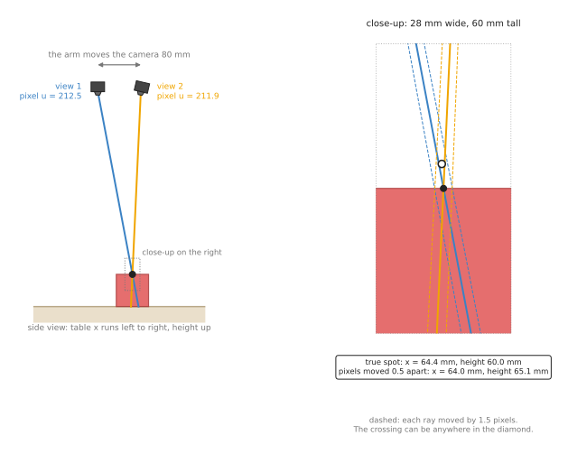
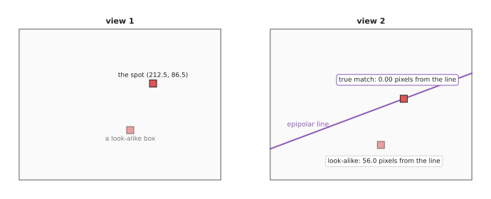
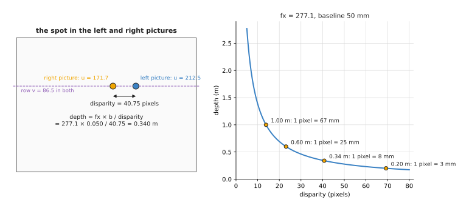
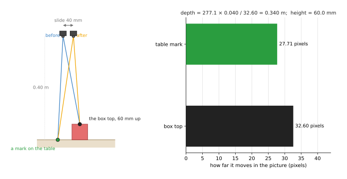

# Multi-view geometry: depth from two pictures

This page explains how a program finds depth from two pictures of the same
scene, without a depth sensor. One picture only tells you the direction of each
point, but two pictures, taken from two known places, tell you where the point
is. The page covers five ideas, and the first two of them work together.
**Triangulation** finds a point from two lines of sight, and **epipolar lines**
say where to look for a match in the second picture. **Rectified stereo** turns
the shift between two side-by-side pictures into depth, while **parallax** finds
a height from how far a point shifts when the camera slides. And the **ground-plane constraint** gets depth from a single
camera when the point is known to be on the table.

It is for a reader who has read
[the pinhole camera model](../02_most-used/01_pinhole-camera-model.md) and
[rigid transforms](../02_most-used/02_rigid-transforms.md). Book 2 already uses
some of these ideas.
[Baseline, not count](../../../02_perception/02_object-perception/08_the-wrist-camera.md#5-baseline-not-count)
shows why two views far apart beat many views close together, and
[two photos from one moving camera](../../../02_perception/02_object-perception/03_programmed-methods.md#23-two-photos-from-one-moving-camera)
measures an object's width and height by moving the camera. So this page
explains the geometry underneath both. Every number here comes from a real run of the
diagram script, `docs/diagrams/geometry_and_cameras_2.py`, with Book 2's camera:
320 × 240 pixels, `fx` = `fy` = 277.1, `cx` = 160, `cy` = 120, 0.40 m above the
table.

## Contents

1. [The idea in one sentence](#1-the-idea-in-one-sentence)
2. [How it works, step by step](#2-how-it-works-step-by-step)
   · [Triangulation: where two rays cross](#triangulation-where-two-rays-cross)
   · [Epipolar lines: where to look for the match](#epipolar-lines-where-to-look-for-the-match)
   · [The essential matrix, in plain words](#the-essential-matrix-in-plain-words)
   · [Rectified stereo: disparity to depth](#rectified-stereo-disparity-to-depth)
   · [Parallax: height from a sliding camera](#parallax-height-from-a-sliding-camera)
   · [The ground-plane constraint: one camera and a known table](#the-ground-plane-constraint-one-camera-and-a-known-table)
   · [Pseudocode](#pseudocode)
3. [Where it is used on a robot arm](#3-where-it-is-used-on-a-robot-arm)
4. [Where it works, and where it does not](#4-where-it-works-and-where-it-does-not)
5. [Libraries that provide it](#5-libraries-that-provide-it)
6. [Why two views, and what it costs](#6-why-two-views-and-what-it-costs)
7. [The learned alternative](#7-the-learned-alternative)
8. [Where to read next](#8-where-to-read-next)

---

## 1. The idea in one sentence

**A pixel tells you the direction of a point; two pixels of the same point, seen
from two known places, tell you where the two directions cross, and that
crossing is the point.**

So here is an everyday example: hold a finger up in front of your face, then
close your left eye and then your right. The finger jumps sideways against the wall
behind it, and a near finger jumps a lot while a far one jumps a little. Your
brain uses that jump to judge distance, and two cameras, or one camera that
moves, can do the same, because they can measure the jump in pixels.

Everything on this page depends on knowing where the two viewpoints are relative
to each other. On a robot arm that knowledge is often free, because the arm
itself moved the camera, and its joints report exactly how far.

---

## 2. How it works, step by step

### Triangulation: where two rays cross

Section 1 said that two directions cross at the point, so this section starts
with the arithmetic of that crossing. Each pixel defines a **ray**, which is a
straight line that starts at the camera and runs out into the scene.
[The pinhole camera model](../02_most-used/01_pinhole-camera-model.md) gives its
direction, `((u - cx) / fx, (v - cy) / fy, 1)` in the camera's frame, and the
camera's pose turns that direction into the room's frame.

**Triangulation** means finding the point where two rays cross. With perfect
numbers they cross exactly, but with real, noisy pixels two rays in 3D usually
miss each other by a little. So the program looks for the point that is closest
to both rays. The standard way writes two straight-line equations for each view
and solves them together, the same kind of step as the direct linear first guess
in
[pose from points](../02_most-used/04_pose-from-points.md#a-first-guess-then-refinement).

Here is a worked example, in which a wrist camera looks straight down from 0.40
m and sees Book 2's spot on top of the red box at pixel (212.5, 86.5). The arm then
moves the camera 80 mm to the side and turns it 13.2° so that it still faces the
box, and in the second picture the spot is at pixel (211.9, 86.0).



On the left, the two rays cross on top of the box, and triangulating the two
exact pixels gives (64.4, 41.1, 60.0) mm, which is the true spot. On the right
is a close-up, where we moved each pixel by 0.5 pixels, in opposite directions.
The rays now cross at (64.0, 40.5, 65.1) mm, which is 5 mm higher. Almost all of
the error is along the line of sight, because two rays that meet at a narrow
angle slide along each other easily. The dashed lines show each ray moved by 1.5
pixels, and the diamond between them is the region where the answer could land.

The distance between the two viewpoints is the **baseline**, and a wider
baseline makes the rays meet at a wider angle, which makes the diamond shorter.
So we repeated the example 2,000 times with 0.5 pixels of random noise on each
pixel, for four baselines. Read each row as one baseline and how far the
triangulated point landed from the truth.

| Baseline | Median error | Worst tenth of runs | Book 2's formula, `z² · e / (fx · b)` |
| --- | --- | --- | --- |
| 18 mm | 11.3 mm | 27.0 mm or more | 11.6 mm |
| 40 mm | 4.8 mm | 12.1 mm or more | 5.2 mm |
| 80 mm | 2.5 mm | 6.1 mm or more | 2.6 mm |
| 200 mm | 1.3 mm | 2.7 mm or more | 1.0 mm |

The run agrees with the formula from Book 2's
[baseline, not count](../../../02_perception/02_object-perception/08_the-wrist-camera.md#5-baseline-not-count),
with `z` = 0.34 m and `e` = 0.5 pixels, so doubling the baseline halves the
error.

### Epipolar lines: where to look for the match

Triangulation needs to know which pixel in picture 2 shows the same point as a
pixel in picture 1. Finding that pixel is called **matching**, and it is the
hard part, but geometry makes it much easier.

The pixel in picture 1 is a ray, and the point is somewhere along that ray,
although we do not know where. So now look at that whole ray from camera 2. A
straight line in the room looks like a straight line in a picture, so the match
must lie somewhere on one line in picture 2. That line is called the **epipolar
line**, and it shrinks the search for the match from the whole picture to one
line.

For a second worked example, camera 2 is now 80 mm to the side, 30 mm forward,
and turned 13.2°. There is also a second red box on the table that looks the
same as the first one.



The spot is at (212.5, 86.5) in view 1, and its epipolar line in view 2 is the
purple line. The true match, at (211.9, 110.8), lies on that line, 0.00 pixels
away, while the look-alike box is 56.0 pixels from it and therefore cannot be
the match, however similar it looks. Book 2 uses exactly this test to match
objects between two views in
[matching two views taken at one moment](../../../02_perception/02_object-perception/10_tracking-and-association.md#21-matching-two-views-taken-at-one-moment-geometry-answers-it).

However, the test fails when two candidates both lie on or near the line. Then
geometry alone cannot choose, and the program needs appearance or a third view.

### The essential matrix, in plain words

The epipolar line comes from one 3 × 3 matrix called the **essential matrix**,
`E`, which holds how camera 2 is turned and shifted relative to camera 1. Write
a pixel with the lens numbers taken out, `x = ((u - cx) / fx, (v - cy) / fy,
1)`. Then for any point seen in both pictures,

```
x2ᵀ · E · x1 = 0,    where E = [t]× · R
```

`R` is the turn from camera 1 to camera 2, and `t` is the shift. `[t]×` is a
small matrix that does a cross product with `t`. The equation says one thing in
plain words: **the two rays and the line between the two cameras all lie in one
flat plane.** They must, because they form a triangle with the point at its tip.
So `E · x1` is the epipolar line in picture 2, in lens-free units.

In our example, `t` = (-77.9, 30.0, 18.3) mm in camera 2's frame, and the
equation gives -3.5 × 10⁻¹⁸ for the true match, which is zero apart from
rounding. When the pixels still carry the lens numbers, the same matrix is
written with them folded in: `F = K⁻ᵀ · E · K⁻¹`. `F` is called the
**fundamental matrix**, and `K` is the 3 × 3 matrix of lens numbers.

The essential matrix can also run backwards. Given five or more matched points,
and no knowledge of how the camera moved, a program can find `E`, and from it
`R` and the direction of `t`. This is how a camera works out its own movement
from pictures alone, and it always uses RANSAC, because some matches are wrong.
However, it cannot find the **length** of `t`, because two pictures of a small
scene taken close together look exactly like two pictures of a large scene taken
far apart. So the scale must come from somewhere else: the arm's own movement, a
known object size, or a depth reading. On a robot arm, the arm's joints almost
always know the movement, so the program uses the known `R` and `t` directly.

### Rectified stereo: disparity to depth

A **stereo camera** is two cameras side by side, fixed to one bar, and the
distance between them is its baseline. When the two cameras point the same way
and their rows line up, the pair is called **rectified**. Real stereo cameras
are never built perfectly, so their pictures are corrected in software to make
them rectified, and that correction uses a stereo calibration.

In a rectified pair, every epipolar line is simply a row of pixels, so a point in
row 86 of the left picture is in row 86 of the right picture. The only difference
is how far along the row it appears, and that difference is the **disparity**,
which is `u_left` minus `u_right`, measured in pixels. Depth then follows from
one division:

```
depth = fx · b / d
```

So here is the worked example, with a 50 mm baseline, which is typical of a
small stereo depth camera.



The spot on the box top is at `u` = 212.5 in the left picture and 171.7 in the
right one, in the same row. So the disparity is 40.75 pixels, and 277.1 × 0.050
/ 40.75 = 0.340 m, which is the right depth.

However, the chart on the right shows the catch. Depth falls as one over the
disparity, so a far point has a small disparity, and a one-pixel mistake there
costs a lot. The table gives the numbers, so read each row as one depth: its
disparity, and the depth change caused by a mistake of one pixel and of a
quarter of a pixel. Good stereo matchers reach about a quarter of a pixel.

| Depth | Disparity | 1-pixel mistake | 0.25-pixel mistake |
| --- | --- | --- | --- |
| 0.20 m | 69.3 pixels | 2.8 mm | 0.7 mm |
| 0.34 m | 40.8 pixels | 8.1 mm | 2.1 mm |
| 0.50 m | 27.7 pixels | 17.4 mm | 4.5 mm |
| 1.00 m | 13.9 pixels | 67.3 mm | 17.7 mm |
| 2.00 m | 6.9 pixels | 252.3 mm | 69.7 mm |

The error grows with the square of the depth, so stereo is precise close up and
poor far away. For a table-top arm, where most things are under 0.6 m away, it
works well.

To get depth for every pixel, a **stereo matcher** searches each row of the
right picture for the best match of each left pixel. That search needs texture,
because a blank white table has nothing to match, and neither does a shiny
surface that reflects different things into each camera. So many stereo depth
cameras add a projector that throws a dot pattern onto the scene to give plain
surfaces some texture. Book 2 compares these sensors in
[sensors](../../../02_perception/02_object-perception/02_sensors.md).

### Parallax: height from a sliding camera

A wrist camera can make its own stereo pair. The arm slides the camera sideways,
and the program compares the two pictures. How far a point moves in the picture
is its **parallax**, which is the same thing as disparity, except that the
baseline comes from the arm rather than from a fixed bar.

This is especially useful for heights. A camera looking straight down at a table
sees every table point shift by the same amount, `fx · b / H`, where `H` is the
camera's height. A point above the table is closer to the camera, so it shifts
more, and that extra shift tells you how far above the table it is.



So here is the worked example. The camera is 0.40 m above the table and slides
40 mm. A mark on the table shifts 277.1 × 0.040 / 0.40 = 27.71 pixels. The spot on
the box top shifts 32.60 pixels. So its depth is 277.1 × 0.040 / 32.60 = 0.340
m, and its height is 0.40 - 0.340 = 60.0 mm, the true height of the 6 cm cube.

A mistake of half a pixel in the shift gives 54.7 mm or 65.1 mm instead of 60.0,
which is a 5 mm error. This is about the same size as in the triangulation
example above, because it is the same geometry. A longer slide makes it smaller.

The table's shift is a useful check, because every table point should shift by
27.71 pixels. If they do not, the slide was not what the arm reported, or the
camera was not looking straight down. Book 2 works through the same idea for an
object's width in
[two photos from one moving camera](../../../02_perception/02_object-perception/03_programmed-methods.md#23-two-photos-from-one-moving-camera).

### The ground-plane constraint: one camera and a known table

Sometimes one picture is enough. If a point is known to lie on the table, its
depth is wherever its ray meets the table. So the table acts as the "second
view", because it is a second surface that the point must lie on, and a ray and
a plane cross at exactly one point.
[The pinhole camera model](../02_most-used/01_pinhole-camera-model.md#no-depth-where-a-pixels-ray-meets-a-known-plane)
works the method through step by step.

However, the constraint is only as good as the claim that the point is on the
table. Here is what happens when the claim is wrong. The straight-down camera
sees the spot on top of the 6 cm cube at pixel (212.5, 86.5). If the program
assumes the spot is on the table, it places it at (75.8, 48.4, 0) mm, while the
truth is (64.4, 41.1, 60) mm. So the position on the table is 13.5 mm wrong, as
well as the height. With the tilted camera from the pinhole page, which looks
60° down, the same 60 mm mistake puts a point 44.1 mm too far away. This is
because a slanted ray travels a long way sideways for each millimetre of height.

So the ground-plane constraint suits flat things that really lie on the table:
sheets, coins, the bottom edge of an object where it touches the table. For the
top of an object, use one of the two-view methods above, or subtract the
object's known height before intersecting the ray with a plane at that height.

### Pseudocode

So here are the three most common jobs of this page, written as plain steps.

```
# 1. Triangulate one point from two views with known poses
ray1 = T_base_camera1 * direction(pixel1, K)
ray2 = T_base_camera2 * direction(pixel2, K)
point = the point closest to both rays            # linear least squares (DLT)
gap = the shortest distance between the two rays
if gap > a few millimetres: reject the match       # the pixels were not the same point

# 2. Match along the epipolar line
E = skew(t) * R                                  # from the two known camera poses
F = inverse(K)ᵀ * E * inverse(K)
line = F * (u1, v1, 1)
candidates = features in picture 2 within 2 pixels of line
match = the candidate that looks most like the feature in picture 1

# 3. Height from a sideways slide of a downward camera
shift = u_after - u_before                        # in pixels, for the same point
depth = fx * slide_length / shift
height = camera_height - depth
check: table points must shift by fx * slide_length / camera_height
```

---

## 3. Where it is used on a robot arm

Section 2 described five methods, and this section says where an arm uses them.
Two views appear on a robot arm more often than it seems, and here are the
concrete places.

- **Stereo depth cameras.** Most depth cameras on arms are stereo pairs with a dot
  projector. The rectification and the disparity search run inside the camera, and
  the depth picture that comes out is `fx · b / d` for every pixel.
- **Measuring with a wrist camera.** The arm moves the camera between two poses and
  triangulates corners, holes or edges. The baseline comes from the joints, so it is
  known exactly. Book 2's
  [wrist camera](../../../02_perception/02_object-perception/08_the-wrist-camera.md)
  page measures with this.
- **Heights of objects a depth camera cannot see.** Glass and shiny metal give no
  depth reading, but their outlines still shift with parallax.
- **Matching the same object in two cameras.** A cell with two fixed cameras uses
  epipolar lines to decide which detection in one picture is the same object as a
  detection in the other.
- **Reading items on a flat table.** A single colour camera above a conveyor or a
  table uses the ground-plane constraint to place flat parts, with no depth sensor.
- **Building a 3D model of the scene.** A camera that moves through many poses and
  triangulates many points builds a 3D model. Book 6's
  [scene reconstruction](../../../06_learned-models/04_3d-models/02_most-used/02_scene-reconstruction.md)
  covers the learned methods that do this.

---

## 4. Where it works, and where it does not

The uses in section 3 all depend on knowing the two camera poses and matching
the right pixels. Two-view geometry is exact, so its failures come from the
inputs, and the table below lists the common ones. Read each row as what goes
wrong, what you see, and what to do.

| What goes wrong | The sign you see | What to do instead |
| --- | --- | --- |
| the baseline is short for the distance | depth that jumps by centimetres between frames | move the camera further between views; get closer |
| a wrong match | a triangulated point far from anything, or a large gap between the rays | match along the epipolar line; reject large gaps; use RANSAC |
| plain or shiny surfaces | holes or noise in the stereo depth picture | add a projected dot pattern; use a learned matcher |
| the camera poses are wrong | table points that do not shift by the expected amount; a consistent tilt in the depth | recalibrate the hand-eye transform; read the arm's pose at the moment of the picture |
| the object moved between the two pictures | heights and depths that make no sense | take both pictures quickly; use a stereo camera, which takes both at once |
| a point assumed on the table is not on it | positions pushed away from the camera by several centimetres | use the ground-plane constraint only for things that lie flat |
| scale from pictures alone | a correct shape at the wrong size | take the scale from the arm's movement or a known object |

Two views also cannot see what neither camera sees, so a point hidden behind
something in one view cannot be triangulated. And depth from stereo is poor far
away, because the error grows with the square of the distance.

---

## 5. Libraries that provide it

The table below lists well-known tools, so read each row as where to find it,
which languages it covers, and what to call.

| Library or tool | Languages | What to call | Note |
| --- | --- | --- | --- |
| OpenCV (`calib3d` module) | C++, Python | `triangulatePoints`, `findEssentialMat`, `recoverPose`, `findFundamentalMat`, `computeCorrespondEpilines` | the two-view building blocks; `findEssentialMat` uses RANSAC |
| OpenCV stereo | C++, Python | `stereoCalibrate`, `stereoRectify`, `StereoBM`, `StereoSGBM`, `reprojectImageTo3D` | calibrate a pair, rectify it, compute disparity, turn disparity into points |
| ROS 2 `stereo_image_proc` | C++ | its disparity and point cloud nodes | part of `image_pipeline`; turns a stereo pair into a point cloud topic |
| PoseLib | C++, Python | `estimate_relative_pose` | finds the essential matrix and the camera movement with RANSAC |
| COLMAP | C++, command line | its feature, matching and mapping commands | builds a 3D model from many pictures by triangulating matched features |
| Depth camera software | C++, Python | for example the Intel RealSense SDK, `librealsense` | the stereo matching runs inside the camera |

---

## 6. Why two views, and what it costs

This section answers the four questions for two-view geometry: what it is, what
it does for you, why it rather than the obvious alternative, and what it costs.

It is the geometry of two rays crossing. So it gives you depth and 3D points
from ordinary colour pictures, and it tells you where to look for a match.

The obvious alternative is a single depth camera and nothing else, which gives a
depth for every pixel with no matching step in your program. That is the right
choice for most table-top arms. However, depth cameras fail on glass, shiny
metal and black surfaces, and their fixed internal baseline sets their accuracy.
Two-view geometry with a wrist camera instead works on any surface whose outline
you can see, and lets you choose the baseline. For example, a 200 mm slide is
about eleven times more precise than an 18 mm built-in stereo baseline. The
ground-plane constraint needs no second view at all, but it only works for
things that lie flat.

The cost is this. You need to know the two camera poses accurately, which means
a good calibration and pictures taken while the arm is still. You need a
reliable match for every point. You need a second picture, which takes time when
the arm has to move. And you need a wide enough baseline, which the working
space may not allow.

---

## 7. The learned alternative

Book 6's
[depth from pictures](../../../06_learned-models/03_seeing-models/03_also-used/02_depth-from-pictures.md)
covers two learned models for this job. A learned stereo model, such as
RAFT-Stereo or FoundationStereo, does the matching with a network, then turns
each shift into a depth with the same rule as this page, so its answer is still
in real metres. Book 6 suggests it when you pick your own cameras, or work in
bright light or at longer range, and like a written matcher it still struggles
on a plain white surface. A **monocular** depth model, one that uses a single
camera, guesses depth from one picture with no second view and no matching. But
its errors are often several centimetres at one metre, many versions give no
fixed scale, and Book 6 keeps it for rough jobs such as telling the foreground
from the background. The geometry on this page still wins when you need a
measured depth for a grasp, want no graphics processor, or can choose a wide
baseline by moving the wrist camera.

---

## 8. Where to read next

- [The pinhole camera model](../02_most-used/01_pinhole-camera-model.md) gives the ray
  for each pixel, and the ray-and-plane method in full.
- [Pose from points](../02_most-used/04_pose-from-points.md) finds an object's pose
  when its shape is known, from one picture.
- [Image features and matching](../../03_searching-and-matching/03_also-used/01_image-features-and-matching.md)
  finds the matched points that triangulation needs.
- [RANSAC](../../04_fitting-and-estimation/02_most-used/02_ransac.md) removes wrong
  matches before the essential matrix is fitted.
- Book 2's [the wrist camera, end to end](../../../02_perception/02_object-perception/08_the-wrist-camera.md)
  uses the baseline arithmetic to plan where to take the second picture.
- The [overview](../01_overview.md) shows where this page sits in the chapter.
