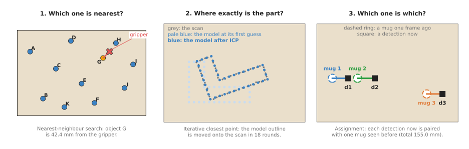
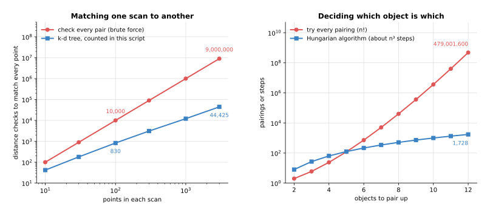

# Searching and matching

This chapter covers the techniques that find the closest thing, and decide which
thing is which. Between them they answer three questions that come up again and
again in robot-arm software. Which point, object or pose is nearest to this one?
Where exactly is a known part, given a scan of it? And which of the objects seen
now is which of the objects seen before? A fourth question comes up with camera
pictures: which small spots in one picture show the same thing as spots in
another?

It is for a reader who knows what a point cloud, a frame and a camera picture
are, from Books 1 and 2, but who has not met these algorithms before. This page
is the map of the chapter, and each technique then has its own page with a
worked example, pseudocode and a list of libraries.

## Contents

1. [What these techniques are for](#1-what-these-techniques-are-for)
2. [The four techniques, in two groups](#2-the-four-techniques-in-two-groups)
3. [Why the obvious method is not enough](#3-why-the-obvious-method-is-not-enough)
4. [How this chapter connects to the others](#4-how-this-chapter-connects-to-the-others)
5. [Where to read next](#5-where-to-read-next)
6. [Using it in Python](#6-using-it-in-python)

---

## 1. What these techniques are for

Those four questions look different from each other, but this family of
techniques does one job behind all of them: finding the closest thing, and
deciding which thing is which.

A robot arm meets this job all the time, because a depth camera gives a cloud of
tens of thousands of points. So for each of those points the software needs the
few points next to it, to work out which way the surface faces. In the same way,
a gripper tip moves over a table, and the software needs the object nearest to
it. A camera sees three mugs, for example, and the software needs to know which
mug is the one it was already carrying.

The picture below shows the three questions on one table, seen from above, and
each answer in it was computed by the diagram script rather than drawn by hand.



The first panel finds the object nearest to the gripper. The second moves a
stored outline of a bracket onto a scan of the real bracket, and the third pairs
each mug seen now with a mug seen one frame ago.

All three panels share one idea, because in each of them you measure how far
apart two things are with a number called a **distance** or a **cost**. Then you
look for the smallest distance, or for the set of pairs whose distances add up
to the smallest total.

---

## 2. The four techniques, in two groups

Since every one of those jobs comes down to a distance, the chapter has four
technique pages, split into two groups.

The **most used** group holds the three techniques that nearly every robot arm with
a camera runs, often many times a second. The other techniques in this book depend
on them too.

- [Nearest-neighbour search](02_most-used/01_nearest-neighbour-search.md) finds, for a query
  point, the closest point in a set, or the k closest, or all points within a
  radius. It uses a tree of boxes, called a k-d tree, so that it does not have to
  measure the distance to every point.
- [Iterative closest point (ICP)](02_most-used/02_iterative-closest-point.md) moves a model
  of a part onto a scan of the part. It pairs each model point with its nearest
  scan point, moves the model to fit those pairs, and then repeats those two
  steps.
- [Assignment and matching](02_most-used/03_assignment-and-matching.md) pairs up two lists,
  such as the mugs seen one frame ago and the mugs seen now, so that each thing
  gets at most one partner and the total cost is as small as possible. The
  Hungarian algorithm does this exactly, while a greedy method does it
  approximately. ICP's page also has a section on
  [getting a first guess](02_most-used/02_iterative-closest-point.md#5-getting-a-first-guess-3d-features-and-global-registration)
  from 3D shape features, for when the part could be turned any way at all.

The **also used** group holds a technique that is common, but only on some robots:
those that must find objects with printing or texture on them from a camera picture.

- [Image features and matching](03_also-used/01_image-features-and-matching.md)
  finds corners in two pictures, describes the patch round each one as a list of
  numbers, pairs corners whose lists are alike, and keeps the pairs that agree on
  one movement of the object. It finds a known flat object, such as a label, and
  gives the pairs that a 3D pose calculation needs.

The table below compares the four techniques, so read it one row at a time. The
row names the technique, while the columns say what goes in, what comes out, and
where the technique usually fails.

| Technique | What goes in | What comes out | Where it usually fails |
|---|---|---|---|
| Nearest-neighbour search | a set of points and a query point | the nearest point, the k nearest, or all within a radius | nothing is near enough, or the "distance" does not match what "similar" means |
| Iterative closest point | a model point set, a scan point set, and a first guess of the pose | the rotation and shift that line the model up with the scan | the first guess is too far off, or the part is symmetric |
| Assignment (Hungarian or greedy) | two lists and a cost for every possible pair | a one-to-one pairing, and the things left without a partner | the costs are wrong, or objects are closer together than the measurement error |
| Image features and matching | a stored picture of an object and a camera picture | pairs of matching spots, and the homography or pose that most of them agree on | the object has no texture, or a repeated pattern |

The four build on each other, because ICP runs a nearest-neighbour search in
every round. Assignment often uses nearest-neighbour search to fill in its table
of costs, or to throw away pairs that are clearly too far apart before it
starts. Image feature matching pairs spots with a nearest-neighbour search among
their descriptions, and its answer is often the first guess that ICP then makes
exact.

---

## 3. Why the obvious method is not enough

Each of those four techniques exists to avoid a simpler method, because for
every one of the questions there is an obvious method that is always right: try
every possibility. For the nearest point, that means measuring the distance to
every point, and for the best pairing it means trying every possible way of
pairing the objects up.

Since a table with ten objects needs only ten distance checks, the obvious
method is often the right choice when the numbers are small. The trouble is how
fast the work grows as the numbers get bigger, and the picture below shows that
growth.



The left panel matches every point of one scan to its nearest point in a second
scan of the same size. Checking every pair needs 9,000,000 distance checks for
3,000 points. However, the k-d tree in the diagram script needed 44,425, about
15 per point. The right panel pairs up objects, where trying every pairing of 12
objects means trying 479,001,600 pairings. Instead, the Hungarian algorithm
needs roughly 12 × 12 × 12 = 1,728 steps.

A depth camera with a 640 by 480 picture gives up to 307,200 points in each
picture, and it gives 30 pictures a second. So checking every pair is not
possible on a live camera, and the k-d tree is what makes point cloud work run
at all.

---

## 4. How this chapter connects to the others

These techniques are used throughout the book, because searching and matching is
the second of the seven families of techniques in it. The
[map of techniques](../01_what-techniques-are/04_the-map-of-techniques.md) shows
all seven, and the list below says how this chapter connects to the others.

- [Geometry and cameras](../02_geometry-and-cameras/01_overview.md) turns
  pixels and depth into 3D points in the arm's frame, and those points are what
  this chapter searches. ICP's answer is a
  [rigid transform](../02_geometry-and-cameras/02_most-used/02_rigid-transforms.md), the same
  rotation and shift that chapter explains. Its
  [pose from points](../02_geometry-and-cameras/02_most-used/04_pose-from-points.md)
  page turns the pairs found by image feature matching into a 3D pose.
- [Fitting and estimation](../04_fitting-and-estimation/01_overview.md) uses
  nearest neighbours to find the points on which to fit a plane or a normal. It
  also supplies the [Kalman filter](../04_fitting-and-estimation/02_most-used/03_kalman-filter.md),
  which predicts where a tracked object should be now, so that assignment can
  compare detections against the prediction rather than the old position. Its
  [RANSAC](../04_fitting-and-estimation/02_most-used/02_ransac.md) throws away the
  wrong pairs in image feature matching and in ICP's global first guess.
- [Image and point cloud processing](../05_image-and-point-cloud-processing/01_overview.md)
  uses radius search to grow clusters of points into objects, in
  [clustering](../05_image-and-point-cloud-processing/02_most-used/03_clustering.md).
- [Decisions and task logic](../08_decisions-and-task-logic/01_overview.md)
  uses the same greedy idea as greedy matching, in
  [greedy algorithms and set cover](../08_decisions-and-task-logic/03_also-used/01_greedy-algorithms-and-set-cover.md),
  and solves larger assignment problems with the
  [optimisation solvers](../08_decisions-and-task-logic/03_also-used/02_optimisation-solvers.md).

Learned models, described in Book 6, do some of the same jobs. For example, a
learned tracker can follow objects from frame to frame, as
[tracking and motion](../../06_learned-models/03_seeing-models/03_also-used/03_tracking-and-motion.md)
explains, and a learned pose model can find where a known part is without ICP, as
[keypoints and object pose](../../06_learned-models/03_seeing-models/02_most-used/04_keypoints-and-object-pose.md)
explains. Even then, the programmed techniques stay in the pipeline, because a
learned tracker still usually pairs its boxes with the Hungarian algorithm. A
learned pose is also often finished off with a few rounds of ICP to make it more
exact.

---

## 5. Where to read next

The pages in this chapter build on one another, so the order below is the one to
read them in.

- Start with [nearest-neighbour search](02_most-used/01_nearest-neighbour-search.md). The
  other two pages use it.
- Then read [iterative closest point](02_most-used/02_iterative-closest-point.md) and
  [assignment and matching](02_most-used/03_assignment-and-matching.md), in either order.
- Read [image features and matching](03_also-used/01_image-features-and-matching.md)
  when the arm must find objects from a camera picture rather than a depth scan. It
  uses nearest-neighbour search, and it helps to have read
  [RANSAC](../04_fitting-and-estimation/02_most-used/02_ransac.md) first.
- Book 2's
  [tracking and association](../../02_perception/02_object-perception/10_tracking-and-association.md)
  goes much deeper into matching objects over time, including how wide to make
  the gate and what to do when a match fails.

---

## 6. Using it in Python

Section 2 named the four techniques of this chapter and section 3 showed why the
obvious method of trying every possibility runs out of time. This section shows the
first three of them as the Python calls that already contain them, so that the
chapter's shape is clear before you read the pages in detail. After it you should
know that none of the three is code you write, and what is left for you is deciding
the numbers they take.

Two libraries cover all three. SciPy provides the nearest-neighbour tree and the
exact pairing, while Open3D provides iterative closest point.

```python
import numpy as np
from scipy.spatial import KDTree
from scipy.optimize import linear_sum_assignment
import open3d as o3d

# Question 1: which object is nearest the gripper?
objects = np.array([[0.47, 0.21], [0.18, 0.38], [0.33, 0.05], [0.33, 0.18]])
tree = KDTree(objects)
distance, index = tree.query(np.array([0.25, 0.10]), k=1)

# Question 2: exactly where is this part? ICP refines a guess into a pose.
result = o3d.pipelines.registration.registration_icp(
    model_cloud, scan_cloud,
    max_correspondence_distance=0.01,      # metres: pairs further apart are ignored
    init=first_guess_4x4)
T_scan_model = result.transformation

# Question 3: which mug seen now is which mug seen before?
cost = np.linalg.norm(old_positions[:, None, :] - new_positions[None, :, :], axis=2)
old_index, new_index = linear_sum_assignment(cost)
```

The libraries do the parts that section 3 said were expensive. `KDTree` builds the
tree of boxes once and then answers each query without touching most of the points,
`registration_icp` runs the pair-and-move loop until it stops improving, and
`linear_sum_assignment` finds the pairing with the smallest total cost in roughly
the cube of the number of objects rather than trying every pairing.

What you still write yourself is what surrounds them. You write the cost matrix for
the assignment, and that one line of NumPy is where you decide whether "which is
which" means position alone or position together with size and colour. You write the
first guess that ICP starts from, because ICP only improves a pose and cannot find
one. And you write what happens to the things left unpaired, since an object that
appeared or disappeared has no partner and the pairing says nothing about it.

What you have to decide or measure is a distance limit in each case, and it is
always a real distance in metres rather than a tuning knob. For the nearest-neighbour
search you decide how far is too far, because the nearest object is not the right
answer when the nearest object is half a metre away. For ICP,
`max_correspondence_distance` is the pair-rejection distance, which should be a few
times your depth camera's noise. For the assignment you decide the gate, meaning the
distance beyond which a pair is not even considered, and that comes from how far an
object can really move between two pictures. Each of the following pages returns to
its own number in detail.
