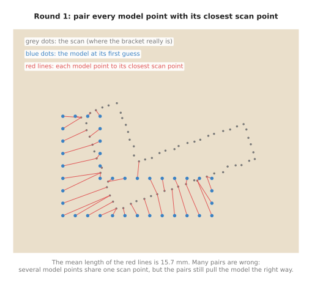
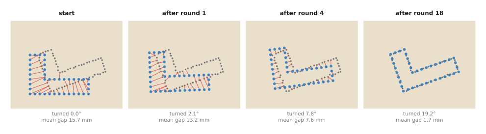
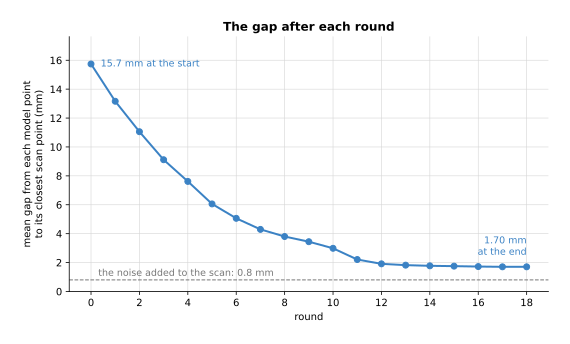
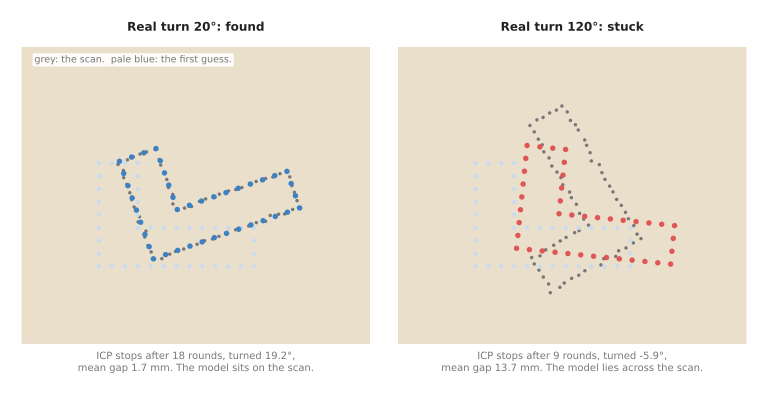
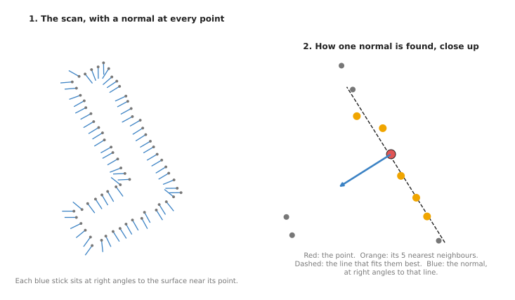
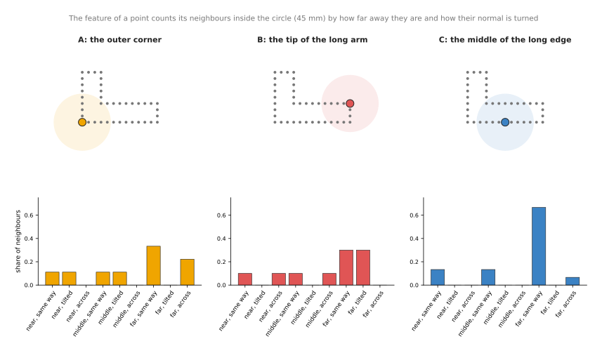
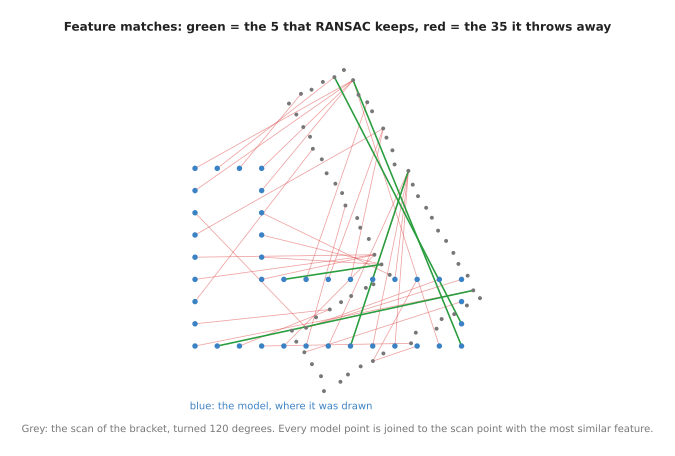
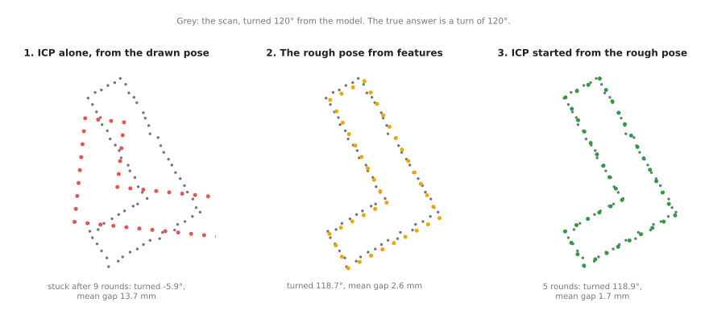

# Iterative closest point

This page explains iterative closest point (ICP): a method that moves one set of
points onto another set of points that shows the same shape. On a robot arm, the
first set is usually a stored model of a part, and the second is a depth scan of
the real part. ICP answers the question "exactly where is the part, and which way
is it turned?". This page shows how ICP works, round by round, on a small example
with real numbers. It also shows when ICP gives a wrong answer, and how you can
tell.

It is for a reader who has read
[nearest-neighbour search](01_nearest-neighbour-search.md), because every round of
ICP runs that search. It also helps to know what a rotation and a shift are, from
[rigid transforms](../../02_geometry-and-cameras/02_most-used/02_rigid-transforms.md), but the
page explains what it needs.

## Contents

1. [The idea in one sentence](#1-the-idea-in-one-sentence)
2. [How it works, step by step](#2-how-it-works-step-by-step)
   · [The example: a bracket on a table](#21-the-example-a-bracket-on-a-table)
   · [Step one: pair each model point with its closest scan point](#22-step-one-pair-each-model-point-with-its-closest-scan-point)
   · [Step two: the best move for those pairs](#23-step-two-the-best-move-for-those-pairs)
   · [Repeat until the gap stops shrinking](#24-repeat-until-the-gap-stops-shrinking)
   · [The pseudocode](#25-the-pseudocode)
   · [Point-to-plane: a faster version](#26-point-to-plane-a-faster-version)
3. [Where it is used on a robot arm](#3-where-it-is-used-on-a-robot-arm)
4. [Where it is useful, and where it is not](#4-where-it-is-useful-and-where-it-is-not)
5. [Getting a first guess: 3D features and global registration](#5-getting-a-first-guess-3d-features-and-global-registration)
   · [Surface normals](#51-surface-normals)
   · [Local 3D features](#52-local-3d-features)
   · [Matching features, then RANSAC](#53-matching-features-then-ransac)
   · [Finishing with ICP](#54-finishing-with-icp)
   · [Where it is used, where it fails, and libraries](#55-where-it-is-used-where-it-fails-and-libraries)
6. [Libraries that provide it](#6-libraries-that-provide-it)
7. [Why ICP, and what it costs](#7-why-icp-and-what-it-costs)
8. [The learned alternative](#8-the-learned-alternative)
9. [Where to read next](#9-where-to-read-next)

---

## 1. The idea in one sentence

ICP guesses which scan point each model point belongs to by taking the closest
one, moves the model to fit those guesses as well as possible, and repeats until
the model stops moving.

The move ICP finds is a **rigid transform**: a rotation plus a shift, with no
stretching or bending. A part on a table cannot change its shape, so a rigid
transform is the right kind of answer.

Here is an everyday example. You have a paper outline of a key, and you want to
lay it over the real key on a table. You put the paper down roughly where the key
is. You see that each edge of the paper is a little to the left of the matching
edge of the key, so you slide the paper right and turn it a little. Now the edges
are closer, and you can see better which edge goes with which. You slide and turn
again. After a few small moves the paper sits on the key. ICP does the same, with
points instead of edges.

---

## 2. How it works, step by step

### 2.1 The example: a bracket on a table

The example is an L-shaped metal bracket lying flat on a table, seen from above by
a depth camera. It is flat so that the pictures fit on a page. A real scan has
three coordinates per point, and every step below works the same way in 3D.

- The **model** is the bracket's outline as it was drawn: 120 mm long, 80 mm high,
  with arms 30 mm wide. It has one point every 10 mm round the outline, 40 points
  in all.
- The **scan** is what the camera saw. It has one point every 6 mm, 66 points in
  all. Each point is moved by a small random amount, the way a real depth camera's
  points are. The random amount has a standard deviation of 0.8 mm in each
  direction; the **standard deviation** is the typical size of a random error.
- The real bracket is turned 20° from the model and shifted by 30 mm in x and 20 mm
  in y. ICP is not told this. Its job is to find it.
- ICP starts from a first guess: the model exactly where it was drawn, not turned
  and not shifted.

All the numbers on this page come from the diagram script
`docs/diagrams/searching_and_matching.py`, which runs the ICP described here. Run it with `--numbers` to print them.

### 2.2 Step one: pair each model point with its closest scan point

ICP does not know which scan point belongs to which model point. So it guesses:
each model point is paired with the scan point nearest to it. This is a
[nearest-neighbour search](01_nearest-neighbour-search.md) for each model point.
The pairs are called **correspondences**.

The picture below shows the pairs at the start.



Many of these pairs are wrong. The model points along the left edge all reach to
the scan's left edge, which is higher up and turned. Several model points share
one scan point. The mean length of the red lines, called the **mean gap** on this
page, is 15.7 mm.

The pairs are wrong, but they are not random. On the whole they pull the model up,
to the right, and anticlockwise. That is enough, because the next step only needs
to move the model in roughly the right direction.

### 2.3 Step two: the best move for those pairs

Given the pairs, ICP works out the one rotation and shift that brings each model
point as close as possible to its partner. "As close as possible" means that the
sum of the squared distances between partners is as small as it can be. There is
an exact method for this, and it takes three steps.

1. Find the middle of the model points, and the middle of their partners. The
   middle is the average of all the x values and of all the y values. It is called
   the **centroid**.
2. Measure every model point from the model's centroid, and every partner from the
   partners' centroid. Now both sets are centred on the same spot. Find the turn
   that lines the first set up with the second best. A standard piece of linear
   algebra, the **singular value decomposition (SVD)**, gives this turn directly.
   The method is known as the Kabsch method, or the Umeyama method.
3. The shift is whatever then moves the turned model's centroid onto the partners'
   centroid.

Here is the method on three points, small enough to check by hand. The model is a
triangle with corners (0, 0), (40, 0) and (0, 20). The partners are the same
triangle turned 30° and shifted by (10, 5). Their corners are (10.00, 5.00),
(44.64, 25.00) and (0.00, 22.32).

1. The model's centroid is (13.33, 6.67). The partners' centroid is (18.21, 17.44).
2. Centred on their centroids, the two triangles differ only by a turn. The SVD
   finds it: 30.0°.
3. Turning the model's centroid by 30° about the origin moves it to (8.21, 12.44).
   The shift that takes it to (18.21, 17.44) is (10.00, 5.00).

The method finds the turn and the shift exactly, because here the pairs are right.
In ICP the pairs are only guesses, so the move it finds is only partly right. The
model is then moved by it, and ICP goes back to step one.

### 2.4 Repeat until the gap stops shrinking

After each move, the model is closer to the scan, so the closest-point pairs are
better, so the next move is better. The picture below shows the model at the start,
after one round, after four rounds, and at the end.



After one round the model has barely turned, after four it is part of the way
there, and after 18 it sits on the scan.

The table below gives the numbers after some of the rounds. "Turned" and "shifted"
are the model's total movement since the start; the real answers are 20° and
(30, 20) mm.

| Round | Mean gap (mm) | Turned | Shifted (mm) |
|---|---|---|---|
| 0 (start) | 15.74 | 0.00° | (0.0, 0.0) |
| 1 | 13.16 | 2.14° | (5.3, 6.5) |
| 2 | 11.05 | 4.15° | (8.6, 11.3) |
| 4 | 7.62 | 7.77° | (15.8, 17.4) |
| 8 | 3.80 | 14.14° | (24.7, 20.6) |
| 12 | 1.91 | 18.33° | (28.5, 20.0) |
| 17 | 1.70 | 19.18° | (30.0, 20.3) |
| 18 | 1.70 | 19.18° | (30.0, 20.3) |

ICP needs a rule for when to stop. The rule here is: stop when the mean gap falls by
less than 0.001 mm in one round. That happened after round 18. Real libraries use
the same kind of rule, and also a largest number of rounds, such as 30 or 50, so
that ICP always ends.

The picture below plots the mean gap after each round.



The gap falls fast for the first twelve rounds, then hardly changes, and that is
when the stop rule ends the loop.

The answer is 19.2° instead of 20°, and (30.0, 20.3) mm instead of (30, 20) mm.
It is close but not exact, for two reasons. The scan's points have noise. And the
model's points and the scan's points do not sit at the same places along each
edge, because one set is spaced 10 mm apart and the other 6 mm. So even at the
right pose, each model point's closest scan point is up to 3 mm along the edge from
it. That is also why the mean gap ends at 1.70 mm, not at the 0.8 mm of noise.

### 2.5 The pseudocode

This pseudocode is written in plain steps, not in any real programming language.

```
icp(model_points, scan_points, first_guess, max_rounds, stop_change, max_pair_distance):
    pose = first_guess
    moved = model_points moved by pose
    previous_gap = infinity
    repeat up to max_rounds times:
        # step one: pairs
        pairs = empty list
        for each point m in moved:
            s = nearest point to m in scan_points          # use a k-d tree built once
            if distance(m, s) <= max_pair_distance:
                add (m, s) to pairs
        gap = mean distance over pairs
        if previous_gap - gap < stop_change: stop
        previous_gap = gap

        # step two: best move for these pairs
        cm = centroid of the m's in pairs
        cs = centroid of the s's in pairs
        R  = the rotation that best lines up (m - cm) with (s - cs)   # SVD
        t  = cs - R * cm
        moved = R * moved + t
        pose  = (R, t) combined with pose
    return pose, gap
```

The scan does not move, so its k-d tree is built once, before the first round.
The `max_pair_distance` test throws away pairs that are too far apart to be real.
It matters when the scan also holds other things, such as the table or a
neighbouring part.

### 2.6 Point-to-plane: a faster version

The version above is called **point-to-point** ICP, because it measures the gap
from each model point to one scan point. It is slow when a surface slides along
itself. In the example, the long flat edges of the bracket took many rounds to
slide into place.

**Point-to-plane** ICP measures the gap from each model point to the flat surface
through its partner instead. This surface is set by the partner's
[normal](01_nearest-neighbour-search.md#3-where-it-is-used-on-a-robot-arm), the
direction straight out of the surface. With this measure, a model point that slides
along the right surface costs nothing, so ICP spends its moves only on the
direction that matters. It usually needs far fewer rounds. It needs normals for the
scan, which means one more k-nearest search per scan point before ICP starts. Open3D
and PCL both provide it.

---

## 3. Where it is used on a robot arm

ICP is used wherever the arm has a rough idea of where something is and needs an
exact one.

- **Finding the exact pose of a known part.** A detector or a simple rule finds
  roughly where a part lies in a bin. ICP then lines the part's computer-aided
  design (CAD) model up with the depth scan, and gives a pose accurate enough to
  grip it at a chosen spot. The robot-arm project
  [v5-pick-glasses](https://github.com/RobinNagpal/robot-arm-projects/blob/main/v5-pick-glasses/docs/problem-1/step2-approaches.md)
  lists matching against known glass models with Open3D's ICP as one of its
  approaches.
- **Finishing a learned pose.** A learned pose model, such as those in Book 6's
  [keypoints and object pose](../../../06_learned-models/03_seeing-models/02_most-used/04_keypoints-and-object-pose.md),
  gives a pose that is often a few millimetres or a few degrees off. A few rounds
  of ICP from that pose fix the last part of the error. This is a common pairing:
  the learned model gives the first guess, and ICP gives the precision.
- **Joining several views into one cloud.** A camera on the wrist takes pictures
  from several arm poses. The arm's joint readings say roughly where the camera
  was for each picture. ICP lines each new cloud up with the ones before it, to
  remove the small errors left by calibration and by the joints.
- **Following a part that moves a little.** When a part is being pushed or is in
  the gripper, its pose in one frame is a good first guess for the next frame.
  ICP from that guess follows the part with a small number of rounds per frame.
- **Checking a placement.** After the arm sets a part down, a scan and ICP against
  the model say where the part actually ended up. If the pose differs from the
  planned one by more than a limit, the robot can try again.
- **Checking calibration.** If the camera-to-arm calibration is right, a scan of a
  known object at a known place lines up with its model with almost no movement.
  If ICP has to move it by several millimetres, the calibration has drifted. The
  [calibration](../../02_geometry-and-cameras/02_most-used/03_calibration.md) page explains the
  calibration itself.

---

## 4. Where it is useful, and where it is not

ICP is precise when it starts close to the answer. The main danger is that it
always returns an answer, even when that answer is wrong. It stops when the gap
stops shrinking, and that can happen at a wrong pose.

The picture below shows this. The same bracket is scanned twice: once turned 20°,
and once turned 120°. ICP starts from the same first guess both times.



From 20° away, ICP finds the bracket. It also found it from 45°, 60° and 90° away,
after 25 to 36 rounds. From 120° away, it stops after 9 rounds with
the model turned −5.9°, lying across the scan. Its mean gap is 13.7 mm, against
1.7 mm for the good result. That is the sign to watch for: a final gap that is much
bigger than the camera's noise. Such a stuck answer is called a **local minimum**:
a pose from which every small move makes the gap worse, although it is not the
best pose overall.

The table below lists the common problems. Read each row as: what goes wrong, the
sign you see, and what people use instead.

| Problem | The sign you see | What people use instead |
|---|---|---|
| The first guess is too far off. How far is too far depends on the shape: the diagram script's bracket was found from 90° away, but not from 100° | the final gap is much larger than the camera noise | a global method first, such as random sample consensus ([RANSAC](../../04_fitting-and-estimation/02_most-used/02_ransac.md)) on matched surface features, as [section 5](#5-getting-a-first-guess-3d-features-and-global-registration) shows, or several ICP runs from different starting turns, keeping the best |
| The part is symmetric, such as a cylinder or a square plate | the gap is small, but the turn about the symmetry axis is random from run to run | accept that the turn is unknown, or use colour or a marking, as in coloured ICP |
| The scan also holds the table or other parts | the model is pulled towards the table or a neighbour | cut the part out of the scan first, and reject pairs further apart than a limit |
| Only part of the object is visible | the model slides to cover the missing side | reject far pairs; use a model of only the side the camera can see |
| A large flat surface, such as a box lying on a table | the model slides along the surface and never settles, or settles in the wrong place along it | point-to-plane ICP helps with speed; a feature such as an edge or a hole is needed to fix the position |
| The model is in millimetres and the scan in metres | a nonsense answer after one round | check the units before calling ICP |
| Many rounds on large clouds | ICP is too slow for the camera rate | downsample both clouds to a point every few millimetres first; use point-to-plane |

---

## 5. Getting a first guess: 3D features and global registration

Section 4 showed that ICP needs a first guess close to the answer. This section
shows how a program can get one from the scan alone, with no idea at all where the
part is or which way it is turned. The method is called **global registration**.
"Registration" means lining two point sets up. "Global" means that it searches every
possible pose, not just the poses near a guess.

Global registration does for depth scans what
[image features and matching](../03_also-used/01_image-features-and-matching.md)
does for pictures. It has four steps.

1. Work out which way the surface faces at every point. This direction is the
   point's **normal**.
2. Describe the shape round every point as a short list of numbers, called a
   **local 3D feature**.
3. Pair each model point with the scan point whose feature is most alike, and keep
   the pairs that agree on one rigid move, with
   [RANSAC](../../04_fitting-and-estimation/02_most-used/02_ransac.md).
4. Use that rough move as ICP's first guess.

The example is the case where ICP failed in section 4: the bracket turned 120°. The
numbers come from `docs/diagrams/searching_and_matching_2.py`, which runs every step.
As before, the example is flat, so that it fits on a page. Section 5.5 says what
changes in 3D.

### 5.1 Surface normals

A normal is the direction straight out of a surface, at right angles to it. A single
point has no direction, so the program looks at the point's neighbours. It finds the
point's 5 nearest neighbours with a
[nearest-neighbour search](01_nearest-neighbour-search.md), fits the straight line
that passes closest to them and to the point itself, and takes the direction at right angles to that
line. In 3D it fits a flat plane instead of a line, and the normal is at right angles
to the plane. The fit uses **principal component analysis (PCA)**, a standard method
that finds the direction in which a set of points is spread out most, and the one in
which it is spread out least. The normal is the direction of least spread.



The left panel shows the normal at every point of the scan. On straight edges the
normals are neat and parallel. At corners they point at an angle, because the
neighbours come from both edges. The fit cannot tell "out of the part" from "into the
part", so a normal can point either way. Real programs turn every normal to face the
camera, because the camera can only see surfaces that face it. The feature below
ignores which way a normal points, so it does not need this.

### 5.2 Local 3D features

A normal says which way a surface faces, but many points face the same way. To tell
points apart, the program describes the shape of the whole neighbourhood round each
point. The best-known description is the **fast point feature histogram (FPFH)**. For
a point, it looks at every neighbour within a set radius. For each neighbour it
measures how the neighbour's normal is turned relative to the point's own normal, in
three angles. It then counts how many neighbours fall into each range of angles. The
counts form a **histogram**: a row of bins, each holding how many things fell into
it. FPFH has 33 bins. Two points on similar shapes, such as two sharp edges, get
similar histograms. A point on a flat surface gets a very different one.

The diagram script uses a smaller feature of the same kind, with 9 bins, so that it
can be drawn. For each point, it looks at every neighbour within 45 mm. It sorts each
neighbour by distance (near, up to 15 mm; middle, 15 to 30 mm; far, 30 to 45 mm), and
by the angle between the two normals (same way, up to 30°; tilted, 30° to 60°; across,
60° to 90°). Each bin holds the share of neighbours that fell into it.



Point C, in the middle of the long edge, has two thirds of its neighbours in "far,
same way": the edge is straight. Point A, at the outer corner, has neighbours on two
edges at right angles, so a share falls in "far, across". Point B, at the tip of the
long arm, sees the short end of the arm and the inner edge, and has a different mix
again. Points along the middle of a straight edge all look alike. The corners and
arm ends are what make the bracket recognisable.

A second well-known kind is the **point pair feature (PPF)**. It describes two points
at a time, not one. For two points with normals, it stores four numbers: the distance
between them, the angle between each normal and the line joining them, and the angle
between the two normals. Here is one, computed in 3D. Point one is on the top face
of a box, at (0, 0, 50) mm, with its normal pointing up. Point two is on a side face,
at (40, 0, 20) mm, with its normal pointing sideways. The four numbers are 50.0 mm,
126.9°, 36.9° and 90.0°. Those four numbers stay the same wherever the box is and
however it is turned. A program stores the four numbers for every pair of points on
the model in a table. In the scan, each pair of points looks itself up in the table,
and every model pair it matches votes for a pose. The pose with the most votes wins.

### 5.3 Matching features, then RANSAC

Next the program pairs each model point with the scan point whose feature is most
alike. This is again a nearest-neighbour search, but among features instead of
positions. Most of these pairs are wrong, because edge points all look alike. In the
example only 5 of the 40 pairs are within 5 mm of the right scan point.

RANSAC does not mind. It repeats these steps many times.

1. Pick two pairs at random. In 3D it picks three.
2. Check that the two model points are about as far apart as the two scan points. If
   not, at least one pair is wrong, so the try is skipped at once. This cheap check
   saves most of the work.
3. Compute the rigid move that fits the two pairs, with the method of
   [section 2.3](#23-step-two-the-best-move-for-those-pairs).
4. Count the pairs that the move brings within 5 mm of each other.
5. Remember the move with the most such pairs.



In the example, RANSAC found a move that 5 pairs agree with on its 90th try, out of
500. Those are the green lines. Every one of the 35 red pairs is thrown away. Five
right pairs out of forty is a small share. Two pairs picked at random are both right
only about once in 64 tries, which is why it took 90.

**Fast global registration (FGR)** is a common alternative to RANSAC for this step. It
does not pick random pairs. It fits one move to all the pairs at once, and repeats
the fit while giving pairs that disagree with the move less and less weight. It is
usually faster than RANSAC, and it gives the same kind of rough answer.

### 5.4 Finishing with ICP

The move from RANSAC rests on a handful of pairs, so it is rough. ICP then makes it
exact. The picture below compares three results for the bracket turned 120°.



The table below gives the numbers. Read each row as one way of finding the pose. The
right answer is a turn of 120° and a shift of (30, 20) mm.

| Method | Rounds of ICP | Turned | Mean gap (mm) |
|---|---|---|---|
| ICP alone, from the drawn pose | 9 | −5.9° | 13.7 |
| Features and RANSAC, no ICP | 0 | 118.7° | 2.6 |
| Features and RANSAC, then ICP | 5 | 118.9° | 1.7 |

The feature pose is within about 1.3° of the right turn. ICP from there needs only 5
rounds, where it needed 18 from a 20° start in section 2.4. The final answer is 1.1°
from 120°, and the part's centre moved by (30.2, 19.2) mm. It stops short of the
exact answer for the same reason as in section 2.4: the model and scan points sit at
different places along each edge. The final mean gap, 1.7 mm, is the same as in the
good result of section 4, and that is the sign that the answer is right.

### 5.5 Where it is used, where it fails, and libraries

In 3D, everything above works the same way, with three changes. The normal comes from
a plane fitted to the neighbours, not a line. RANSAC picks three pairs, not two. And
the clouds are first **downsampled**, which means thinning them to one point every few
millimetres, because computing a feature for every one of 300,000 camera points is
slow.

On a robot arm, global registration is used in these places.

- **Picking a known part that can lie any way up.** A part in a bin may be on its
  side or upside down. No first guess is good enough for ICP alone. Global
  registration gives the rough pose, and ICP gives the precise one.
- **Getting going again after tracking is lost.** When the arm follows a part with
  ICP from frame to frame and the part is knocked, the old pose is no longer a good
  guess. Global registration finds the part again from nothing.
- **Joining two scans with no idea how the camera moved.** For example, two scans
  from two fixed cameras before they are calibrated to each other.
- **Checking an ICP result.** If ICP from the previous pose and global registration
  disagree, one of them is wrong, and the arm should not grip yet.

It fails in ways that are easy to predict. The table below lists them. Read each row
as: what goes wrong, the sign you see, and what people use instead.

| Problem | The sign you see | What people use instead |
|---|---|---|
| The part has few distinct shapes, such as a flat box or a ball | few RANSAC inliers, and a pose that changes from run to run | colour or texture, from [image features](../03_also-used/01_image-features-and-matching.md), or a learned pose model |
| The normal and feature radius do not suit the scan: too small for the camera's noise, or too large for the part | features are noise, and almost no pairs are right | set the normal radius to a few times the point spacing, and the feature radius to a few times that |
| The part is a small share of a cluttered scan | RANSAC fits the move to the table or a neighbouring part | cut the part out of the scan first, for example with [clustering](../../05_image-and-point-cloud-processing/02_most-used/03_clustering.md) |
| The part is symmetric | the pose flips between look-alike turns | accept the ambiguity, or use a marking that breaks the symmetry |

The table below lists the functions to look up. Each row is one library.

| Library | Languages | Functions or classes |
|---|---|---|
| Open3D | Python, C++ | `PointCloud.estimate_normals`; `open3d.pipelines.registration.compute_fpfh_feature`; `registration_ransac_based_on_feature_matching`, with `CorrespondenceCheckerBasedOnEdgeLength` for the distance check in step 2 above; `registration_fgr_based_on_feature_matching` |
| Point Cloud Library (PCL) | C++ | `pcl::NormalEstimation`, `pcl::FPFHEstimation`, `pcl::SampleConsensusPrerejective` |
| OpenCV (contrib) | C++, Python | `cv::ppf_match_3d::PPF3DDetector`, the point pair feature method, in the `surface_matching` module |
| TEASER++ | C++, Python | a global registration method that stays right even when almost all feature pairs are wrong |

---

## 6. Libraries that provide it

ICP is part of every major point cloud library. The table below lists well-known
ones. The "function or class" column gives the name to look up in each library's
documentation.

| Library | Languages | Function or class | Note |
|---|---|---|---|
| Open3D | Python, C++ | `open3d.pipelines.registration.registration_icp`, with `TransformationEstimationPointToPoint` or `TransformationEstimationPointToPlane` | also has coloured ICP, and global registration with RANSAC on features |
| Point Cloud Library (PCL) | C++ | `pcl::IterativeClosestPoint`, `pcl::GeneralizedIterativeClosestPoint` | the generalised version models each point as a small patch of surface |
| OpenCV (contrib) | C++, Python | `cv::ppf_match_3d::ICP`, in the `surface_matching` module | paired in that module with a global matcher for a first guess |
| trimesh | Python | `trimesh.registration.icp` | small and easy; aligns points to a mesh |
| Eigen | C++ | `Eigen::umeyama` | only the best-move step (section 2.3), for writing your own ICP |

Book 3's [tools and libraries](../../../03_frameworks/01_tools-and-libraries.md#9-perception-camera-drivers-opencv-and-open3d)
explains where Open3D fits into a robot arm's software.

---

## 7. Why ICP, and what it costs

This section answers four questions: what the technique is, what it does for you,
why it rather than the obvious alternative, and what it costs.

ICP moves a model point set onto a scanned point set by pairing closest points and
fitting a rigid move, over and over. It turns a rough pose into an exact one, often
to within a millimetre or a degree, using only the shape of the part.

The obvious alternative is to try every pose: every turn in steps of one degree and
every shift in steps of one millimetre, and keep the pose with the smallest gap. In
3D that is millions of poses, each checked against the whole scan, which is far too
slow for a robot. The second alternative is to match distinctive features, such as
corners, between the model and the scan, and fit the pose to those matches with
RANSAC. Feature matching does not need a first guess, which is its great advantage.
But it is less exact, because it uses only a few points. So the usual answer is to
use both: features for the first guess, then ICP to make it exact, as
[section 5](#5-getting-a-first-guess-3d-features-and-global-registration) shows.

The costs are these. ICP needs a first guess, and it gives a confident wrong answer
when the guess is poor, so you must check the final gap. It needs a model of the
part, which means a CAD file or an earlier scan. It needs a clean scan, with the
table and other objects cut away. It runs a nearest-neighbour search for every
model point in every round, so it needs downsampled clouds to run at camera rate.
And it cannot tell apart poses that a symmetric part makes look the same.

---

## 8. The learned alternative

Book 6's
[keypoints and object pose](../../../06_learned-models/03_seeing-models/02_most-used/04_keypoints-and-object-pose.md)
describes networks that give an object's pose directly from a picture. Models such
as MegaPose and FoundationPose need only the part's CAD model, or for FoundationPose
a few photos of it. They cope with clutter and need no first guess, so they can take the place of the 3D features and RANSAC in
[section 5](#5-getting-a-first-guess-3d-features-and-global-registration).
FoundationPose can also follow a moving part's pose from frame to frame, the job
ICP does from the last pose. Networks that read point clouds, from Book 6's
[point cloud models](../../../06_learned-models/04_3d-models/02_most-used/01_point-cloud-models.md),
can learn their own 3D features in place of hand-written ones. But a pose model
needs a graphics processor, and it gives no warning when it is wrong, so ICP is still
run after it, as [section 3](#3-where-it-is-used-on-a-robot-arm) describes, and
ICP's final gap is the check. ICP alone still wins when a first guess is already at
hand, such as the last frame's pose or a part in a fixed tray.

---

## 9. Where to read next

- [Nearest-neighbour search](01_nearest-neighbour-search.md) is the search inside
  every ICP round.
- [Rigid transforms](../../02_geometry-and-cameras/02_most-used/02_rigid-transforms.md) explains
  the rotation and shift that ICP returns, and how to chain it with the camera's
  pose to get the part's pose in the arm's frame.
- [RANSAC](../../04_fitting-and-estimation/02_most-used/02_ransac.md) gives a first guess that does
  not need to be close.
- [Least-squares fitting](../../04_fitting-and-estimation/02_most-used/01_least-squares-fitting.md)
  explains "the smallest sum of squared distances", the measure ICP's best-move
  step uses.
- Book 6's
  [scene reconstruction](../../../06_learned-models/04_3d-models/02_most-used/02_scene-reconstruction.md)
  builds a 3D scene from many views with learning.
- [Image features and matching](../03_also-used/01_image-features-and-matching.md)
  finds a first guess from a camera picture instead of a depth scan, for parts with
  printing or texture.
- [Assignment and matching](03_assignment-and-matching.md) pairs whole objects
  rather than points, with a strict one-to-one rule that ICP does not have.
