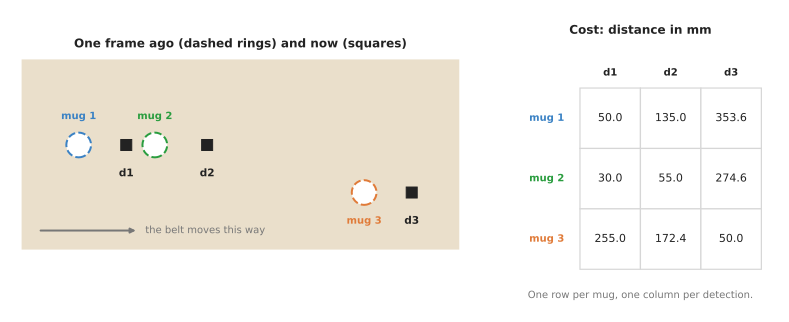
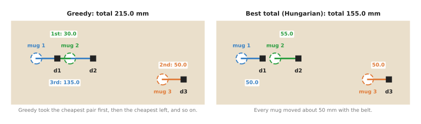
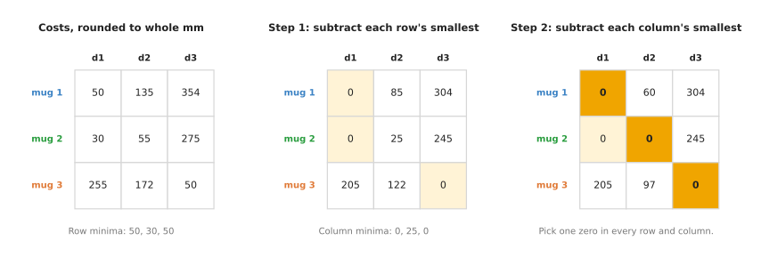
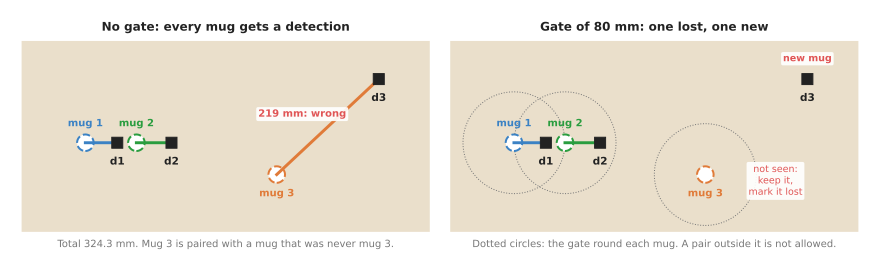

# Assignment and matching

This page explains assignment, which means pairing up the things in one list
with the things in another list. Each thing gets at most one partner, and the
pairs are chosen to be as good as possible overall. On a robot arm, the two
lists are often the objects the robot saw one camera frame ago and the objects
it sees now. So assignment answers the question "which one is which?" for every
object in the new frame.

The page shows two ways to do it, and they do not always agree. **Greedy matching**
takes the best single pair first, then the best of what is left, and so on. The
**Hungarian algorithm** instead finds the pairing with the smallest possible total
cost. To show where the two differ, the page works through a small example with real
numbers. It then shows how to handle objects that appear and disappear.

It is for a reader who has read [nearest-neighbour search](01_nearest-neighbour-search.md)
and the [chapter overview](../01_overview.md). Because both methods are explained
from the start here, no algorithms course is needed. Book 2's
[tracking and association](../../../02_perception/02_object-perception/10_tracking-and-association.md)
goes further into tracking objects over time, so this page stays with the technique
underneath it.

## Contents

1. [The idea in one sentence](#1-the-idea-in-one-sentence)
2. [How it works, step by step](#2-how-it-works-step-by-step)
   · [The example: three mugs on a moving belt](#21-the-example-three-mugs-on-a-moving-belt)
   · [Greedy matching](#22-greedy-matching)
   · [Trying every pairing](#23-trying-every-pairing)
   · [The Hungarian algorithm](#24-the-hungarian-algorithm)
   · [When the zeros are not enough](#25-when-the-zeros-are-not-enough)
   · [Lists of different lengths, and the gate](#26-lists-of-different-lengths-and-the-gate)
   · [The pseudocode](#27-the-pseudocode)
3. [Where it is used on a robot arm](#3-where-it-is-used-on-a-robot-arm)
4. [Where it is useful, and where it is not](#4-where-it-is-useful-and-where-it-is-not)
5. [Libraries that provide it](#5-libraries-that-provide-it)
6. [Why the Hungarian algorithm, and what it costs](#6-why-the-hungarian-algorithm-and-what-it-costs)
7. [The learned alternative](#7-the-learned-alternative)
8. [Where to read next](#8-where-to-read-next)

---

## 1. The idea in one sentence

Assignment, as the introduction described it, writes down a cost for every
possible pair. It then chooses a set of pairs, with no thing used twice, whose
costs add up to the smallest total.

The **cost** is a number that says how bad a pair would be. For matching objects
between two frames, the usual cost is the distance between the old position and
the new one. A cost can also add in other differences, such as size or colour,
so that position alone does not decide the pair.

Here is an everyday example, away from robots: a delivery company has three vans
and three parcels, each at a different address. Each van can take one parcel, so
the three parcels have to be shared out one to a van. The manager writes down
how far each van is from each parcel, and wants the three trips to add up to the
least driving. Sending each van to its own nearest parcel does not always work.
This is because two vans may have the same nearest parcel, so one of them then
has to drive a long way instead. That is why the manager has to consider the
three trips together. A problem of that shape is called an assignment problem.

---

## 2. How it works, step by step

### 2.1 The example: three mugs on a moving belt

To turn the vans and parcels into a robot problem, picture a camera that looks
down at a belt carrying three mugs from left to right. The robot keeps a list of
the mugs it knows, with where each was in the last frame. While the robot holds
that list, a detector reports three mugs in the new frame, called d1, d2 and d3.
Between the two frames the belt moved by about 50 mm, and all the positions
below are in millimetres.

- Last frame: mug 1 at (100, 200), mug 2 at (180, 200), mug 3 at (400, 150).
- This frame: d1 at (150, 200), d2 at (235, 200), d3 at (450, 150).

The robot does not know that d1 is mug 1, because the detector gives no names,
only positions. The first step is therefore to write down the cost of every
possible pair. The table has one row per known mug and one column per detection.
Each cost in it is the straight-line distance between the two positions. The
picture below shows the scene together with that table.



The table is called the **cost matrix**, since a matrix is a grid of numbers.
Filling it in needs one distance for each pair, so there are 3 × 3 = 9 distances
here.

### 2.2 Greedy matching

With the cost matrix filled in, the first way to read a pairing out of it is
greedy matching. This means repeatedly taking the cheapest pair that is still
allowed, until no allowed pair is left at all.

1. The cheapest cost in the whole table is 30.0, so greedy takes mug 2 with d1,
   and both mug 2 and d1 are used up and cannot appear in any later pair.
2. The cheapest cost left is 50.0, so greedy takes mug 3 with d3, which uses up
   mug 3 and d3 as well and leaves only one pair that is still possible.
3. Only mug 1 and d2 are left, so greedy must take that pair, and it costs 135.0,
   which is far more than either of the two pairs taken before it.

The total is 30.0 + 50.0 + 135.0 = 215.0 mm. The picture below shows this
pairing on the left, next to the best pairing on the right.



The greedy answer is wrong, because it says that mug 2 moved 30 mm backwards,
against the belt, and that mug 1 jumped 135 mm forwards past it. This happened
because the first step took the cheap pair "mug 2 with d1" without noticing that
it left mug 1 with only a very expensive choice. That is the weakness of greedy
methods in general: each choice looks only at itself, not at what it leaves for
the choices after it.

### 2.3 Trying every pairing

Since greedy can go wrong in this way, the obvious repair is to try every
pairing and keep the cheapest one. With three mugs there are only 3 × 2 × 1 = 6
ways to pair them up, so trying them all is easy. The table below lists the six,
with the detection given to each mug and the total cost.

| Mug 1 gets | Mug 2 gets | Mug 3 gets | Total (mm) |
|---|---|---|---|
| d1 | d2 | d3 | **155.0** |
| d1 | d3 | d2 | 497.0 |
| d2 | d1 | d3 | 215.0 |
| d2 | d3 | d1 | 664.5 |
| d3 | d1 | d2 | 556.0 |
| d3 | d2 | d1 | 663.5 |

The best total is 155.0 mm, which is 50.0 + 55.0 + 50.0. Each mug therefore moved
about 50 mm with the belt, and that is what really happened. The greedy answer of
215.0 mm is the third row, which means greedy chose a pairing that is allowed but not
the cheapest one.

Trying every pairing is always right, but the number of pairings grows very fast.
For n objects it is n × (n − 1) × ... × 1, a number called "n factorial" and written
n!, so for 10 objects that is 3,628,800 pairings, and for 12 it is 479,001,600. That
growth is plotted in the
[chapter overview](../01_overview.md#3-why-the-obvious-method-is-not-enough), and it
is the reason a faster method is needed.

### 2.4 The Hungarian algorithm

The **Hungarian algorithm** reaches the same best pairing as trying every one,
but without doing all that work. It was published by Harold Kuhn in 1955, who
named it after the work of two Hungarian mathematicians. It is also called the
Kuhn–Munkres algorithm, and both names refer to the same method. For n objects
it needs roughly n × n × n steps, which is 1,728 for 12 objects instead of 479
million.

It rests on one fact, which is that every pairing uses exactly one number from
each row of the cost matrix. So if you subtract the same amount from every
number in one row, every pairing's total goes down by that same amount. This
means the best pairing is still the best one after the subtraction. The same is
true for a column, so the algorithm uses these subtractions to make zeros appear
in the matrix without changing which pairing is best. Once it can pick one zero
in every row and every column, those zeros are the best pairing, because no
pairing can cost less than zero.

For the mugs, with the costs rounded to whole millimetres, it goes in three
stages. The picture below shows all three of those stages side by side.



In that picture, pale yellow cells are zeros, and the three dark yellow cells
are the zeros the algorithm picks.

1. Subtract each row's smallest number from that row, and since those smallest
   numbers are 50, 30 and 50, mug 1's row becomes 0, 85, 304.
2. Subtract each column's smallest number from that column, where the smallest
   numbers are now 0, 25 and 0, so only the d2 column changes and mug 2's row
   becomes 0, 0, 245.
3. Look for one zero in every row and every column, and mug 1 must take d1
   because that is its only zero, which then leaves d2 for mug 2 and d3 for mug 3.

The answer is mug 1 with d1, mug 2 with d2 and mug 3 with d3. This is the same
best pairing that the full search found, with the total 155.0 mm from the
original costs.

### 2.5 When the zeros are not enough

The mug example was settled by those two subtractions alone, but that does not
always happen. Sometimes, after step 2, you cannot pick one zero in every row
and column. The algorithm then has one more step, which it repeats until you
can.

3. Cover all the zeros with as few straight lines as possible, drawn through whole
   rows or whole columns, and if you need as many lines as there are rows, then a
   full set of zeros exists and you are done.
4. If not, find the smallest number not covered by any line, subtract it from every
   uncovered number, and add it to every number where two lines cross, then go back
   to step 3.

Here is a small example that needs this extra step, where three parts must go
into three slots. In the table below, each row is one part and each column is
one slot. Each number is the distance the arm travels in millimetres, so a
smaller number means a shorter move.

| | Slot 1 | Slot 2 | Slot 3 |
|---|---|---|---|
| Part 1 | 40 | 10 | 30 |
| Part 2 | 20 | 0 | 50 |
| Part 3 | 30 | 20 | 20 |

After subtracting each row's smallest number and then each column's smallest
number, the rows are (20, 0, 20), (10, 0, 50) and (0, 0, 0). Parts 1 and 2 both
have their only zero in slot 2, so there is no full set of zeros yet. Two lines
cover every zero: one down the slot 2 column, and one along part 3's row. Since
the smallest uncovered number is 10, subtracting it from the uncovered numbers
and adding it where the lines cross gives rows (10, 0, 10), (0, 0, 40) and (0,
10, 0). Now part 1 takes slot 2, part 2 takes slot 1 and part 3 takes slot 3,
and that gives a total of 10 + 20 + 20 = 50 mm in all. Trying all six pairings
confirms that 50 mm is the smallest total these three parts can reach.

You will not usually do this by hand, because libraries do it in a fraction of a
millisecond for the tens of objects a robot arm sees. The point of the example is
instead to show that the answer is exact, not a guess.

### 2.6 Lists of different lengths, and the gate

So far both lists have held three mugs, but real frames rarely have the same
number of objects in both lists. An object can be hidden by the arm, so it has
no detection, and a new object can be put down, so a detection has no old
object. Suppose that, in the same frame, mug 3 is hidden behind the arm and a
new mug has been put down at the far end of the belt. The picture below draws
that case, without a gate on the left and with a gate on the right.



On the left, the assignment is told to pair all three mugs, and it does so with
a total of 324.3 mm. That total includes pairing mug 3 with the new mug 219 mm
away. The algorithm has no way to know that no mug moves 219 mm in one frame on
this belt, because it only knows that this pairing has the smallest total.

On the right, a **gate** of 80 mm is added, where a gate is a largest allowed
cost, so any pair above it is not allowed at all. Mug 1 and mug 2 are then
paired as before. Mug 3 now has no partner, so the robot keeps it in its list
and marks it as not seen. The far detection has no partner either, so it becomes
a new mug.

A gate is usually added by setting every cost above the gate to a very large
number before solving, and then throwing away any pair that still uses one. Most
libraries also accept a cost matrix that is not square, with more rows than
columns or more columns than rows. They then pair as many as they can, and leave
the rest unpaired.

How wide to make the gate is a real decision, because it can go wrong in either
direction. Too narrow, and a mug that moved a little faster than expected is lost and
then counted again as new. Too wide, and a hidden mug is paired with a newcomer, as
on the left. Book 2 gives a way to choose the width from the camera's measurement
error, in
[gating is the whole trick](../../../02_perception/02_object-perception/10_tracking-and-association.md#4-gating-is-the-whole-trick).

### 2.7 The pseudocode

All the pieces above fit together as follows, written in plain steps rather than
in any real programming language. The Hungarian algorithm's inner bookkeeping is
left to a library, so the pseudocode shows only how it is called and how its
answer is used.

```
build_costs(old_objects, new_detections, gate):
    for each old object i:
        for each new detection j:
            cost[i][j] = distance(predicted position of i, position of j)
            if cost[i][j] > gate: cost[i][j] = VERY_LARGE
    return cost

greedy_match(cost):
    pairs = empty list
    repeat:
        (i, j) = the allowed pair with the smallest cost
        if there is none, or cost[i][j] is VERY_LARGE: stop
        add (i, j) to pairs
        forbid every other pair that uses row i or column j
    return pairs

match(old_objects, new_detections, gate):
    cost  = build_costs(old_objects, new_detections, gate)
    pairs = hungarian(cost)                         # from a library
    remove every pair whose cost is VERY_LARGE
    for each pair (i, j):  update object i with detection j
    for each old object with no pair:  mark it "not seen"; drop it after several frames
    for each detection with no pair:   start a new object
```

"Predicted position" in the first function is important, because the belt keeps
moving between the two frames. If the robot knows that the belt moves 50 mm per
frame, it should compare each detection with where the mug should be now. In other
words, it should not compare with where the mug was, since the mug has moved since
then. With that prediction, every correct cost in the example would be close to 0 mm
instead of about 50 mm. As a result, the wrong pairings would stand out far more
clearly. The
[Kalman filter](../../04_fitting-and-estimation/02_most-used/03_kalman-filter.md)
page shows how to make that prediction.

---

## 3. Where it is used on a robot arm

The mugs on the belt are only one use of assignment. The same technique appears
wherever two lists of things must be paired one to one.

- **Following objects from frame to frame.** This is the example on this page:
  matching each detected mug to the mug seen one frame ago, so that the robot keeps
  a steady name for each object while it plans. Book 6's
  [tracking and motion](../../../06_learned-models/03_seeing-models/03_also-used/03_tracking-and-motion.md)
  page describes learned trackers, and most of them pair their boxes with the
  Hungarian algorithm in exactly this way.
- **Matching detections to the robot's list of known objects.** A robot that keeps a
  list of objects on the table, with their poses, must decide after each new picture
  which detection is which listed object. This is the same problem as before, with
  the standing list in place of the last frame.
- **Matching what two cameras see.** Two cameras look at the same table from
  different sides, and after turning both sets of detections into positions in the
  arm's frame, assignment pairs up the two views of each object.
- **Giving each object a place.** A robot must put four parts into four slots of a
  tray, and assignment chooses which part goes into which slot so that the arm
  travels the least in total, using travel distances or travel times as the costs.
- **Sharing work between two arms.** Each arm gets some of the objects to pick, so
  with a cost for each arm-object pair, such as reach or travel time, assignment
  splits the work between them. If an arm may take more than one object, the problem
  grows beyond plain assignment, and the
  [optimisation solvers](../../08_decisions-and-task-logic/03_also-used/02_optimisation-solvers.md)
  page takes over.
- **Matching image features.** To find a known object in a picture, a program
  matches small patches of the picture to patches of a stored image. A simple and
  common rule keeps a match only if each patch is the other's nearest neighbour, and
  that rule is called a **mutual nearest neighbour** check, which is a cheap form of
  one-to-one matching.
- **Training a learned detector.** Book 6's
  [object detection](../../../06_learned-models/03_seeing-models/02_most-used/01_object-detection.md#transformers-a-fixed-set-of-answers)
  page describes the DETR detector, which is trained by matching each real object to
  exactly one of the model's answers, and that match is made with the Hungarian
  algorithm.

---

## 4. Where it is useful, and where it is not

All of those uses rest on the same guarantee, which is that the Hungarian algorithm
always returns the pairing with the smallest total cost. The catch is that the
smallest total is only the right answer if the costs are right. Book 2 makes this
point in
[the optimal answer is not the same as the right answer](../../../02_perception/02_object-perception/10_tracking-and-association.md#13-the-optimal-answer-is-not-the-same-as-the-right-answer).

The table below lists the common problems, and each row reads as: what goes
wrong, the sign you see, and what people use instead.

| Problem | The sign you see | What people use instead |
|---|---|---|
| Objects move further between frames than they are apart | names swap between neighbouring objects | predict each object's new position first, with a constant speed or a Kalman filter, and compare against the prediction |
| An object disappears and another appears | a hidden object is "matched" to a new one far away | a gate: forbid pairs above a largest cost |
| Objects look alike and stand close together | names swap when two objects pass each other | add appearance to the cost, such as colour or size; or wait until they are apart |
| The cost adds up things in different units, such as millimetres and colour difference | one term decides everything | scale each term, and check the weights on recorded examples |
| Greedy matching with crowded objects | the answer changes with the order the objects are listed in, and a total that is higher than it should be | the Hungarian algorithm |
| Hundreds or thousands of items, such as feature matches | the full cost matrix takes too long to fill in | nearest-neighbour search with a mutual check or a ratio test, and no full assignment |
| One arm may take several objects, or some pairs must go together | plain assignment cannot express the rule | an integer programming solver, such as OR-Tools |

Greedy matching is good enough when objects are much further apart than they
move between frames. So on a table with a few objects that stand still, greedy
and the Hungarian algorithm give the same answer. Greedy is also simpler to
write when there is no library at hand.

---

## 5. Libraries that provide it

Since you will not write the Hungarian algorithm yourself, what matters is where
to find it ready-made. It, or a close relative that gives the same answer, comes
with most maths libraries. The table below lists the well-known ones, and its
"function or class" column gives the name to look up in each library's
documentation.

| Library | Languages | Function or class | Note |
|---|---|---|---|
| SciPy | Python | `scipy.optimize.linear_sum_assignment` | accepts matrices that are not square; the usual choice in Python |
| OR-Tools | Python, C++, Java, C# | `SimpleLinearSumAssignment`, in the `graph` module | also has solvers for the larger problems in section 4 |
| munkres | Python | `Munkres().compute` | a small pure-Python version of the Hungarian algorithm |
| dlib | C++, Python | `max_cost_assignment` | finds the largest total, so pass costs with their sign flipped |
| OpenCV | Python, C++ | `cv2.BFMatcher` with `crossCheck=True` | the mutual nearest neighbour check for image features, not a full assignment |

Book 2 lists more tracking libraries, and a 30-line tracker built on SciPy's
function, in
[the libraries, and the thirty lines](../../../02_perception/02_object-perception/10_tracking-and-association.md#7-the-libraries-and-the-thirty-lines).

---

## 6. Why the Hungarian algorithm, and what it costs

With those libraries in hand, this section pulls the page together. It answers
four questions: what the technique is, what it does for you, why it rather than
the obvious alternative, and what it costs.

The Hungarian algorithm takes a table of costs for every possible pair and
returns the one-to-one pairing with the smallest total. This means a robot can
keep a steady name for each object from frame to frame, and share out work or
places in the cheapest way.

There are two obvious alternatives, and each of them falls short. The first is
to give each object its nearest detection, which is simple, but two objects can
claim the same detection and nothing stops them. The second is greedy matching,
which does prevent double claims and is correct when objects are well apart.
However, in the mug example it gave a total of 215.0 mm against the best 155.0
mm, and it swapped two mugs' names. The Hungarian algorithm instead considers
all the pairs together, so a cheap pair that forces an expensive one elsewhere
is not chosen. Its answer also does not depend on the order in which the objects
are listed. Trying every pairing gives the same answer, but only for a handful
of objects, because the count of pairings grows as n factorial.

The costs of using it start with the cost matrix itself, which you must fill in
completely, one number per pair. That is fine for tens of objects, and far too
much for thousands. The answer is also only as good as the costs, so you need a
sensible cost and a gate. Choosing the gate's width is then a judgement about
your camera and your scene. The algorithm returns a pairing even when every
pairing is poor, so the program around it must handle lost and new objects.
Finally, it pairs one to one only, so a rule such as "an arm may carry two
objects" needs a more general solver.

---

## 7. The learned alternative

Section 6 named a poor cost as the main weakness, and that is exactly where learning
helps. There is no learned model that replaces the pairing step itself, because once
the costs are known, the Hungarian algorithm finds the best pairing exactly and
quickly. What learning improves is therefore the cost, not the pairing. Book 6's
[tracking and motion](../../../06_learned-models/03_seeing-models/03_also-used/03_tracking-and-motion.md)
describes trackers that also compare how the objects look, using an **embedding**,
which is a list of numbers that describes each box. Two look-alike objects that pass
close to each other are then less likely to swap names, and a matching step still
makes the pairs. SAM 2 works differently: you click once on an object, and it follows
the object's outline through a video from its memory of how it looked, with no
pairing step. However, it needs a smooth video, and it cannot bridge a gap between
separate photos. Position costs and this page's method are enough when objects stand
well apart, while learned appearance is worth adding when similar objects cross.

---

## 8. Where to read next

Each of the pages below carries one part of this page further.

- [Nearest-neighbour search](01_nearest-neighbour-search.md) fills in costs quickly
  and throws out pairs that are clearly too far apart.
- The [Kalman filter](../../04_fitting-and-estimation/02_most-used/03_kalman-filter.md) predicts
  where each object should be now, which makes the costs far more reliable.
- [Greedy algorithms and set cover](../../08_decisions-and-task-logic/03_also-used/01_greedy-algorithms-and-set-cover.md)
  shows where the greedy idea works well, and where it fails, beyond matching.
- [Optimisation solvers](../../08_decisions-and-task-logic/03_also-used/02_optimisation-solvers.md)
  solve the larger assignment problems that plain assignment cannot express.
- Book 2's [tracking and association](../../../02_perception/02_object-perception/10_tracking-and-association.md)
  is the deep version of this page for a robot arm, including what to do when
  matching fails and how to keep an object's name through a grasp.
