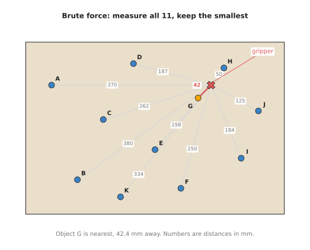
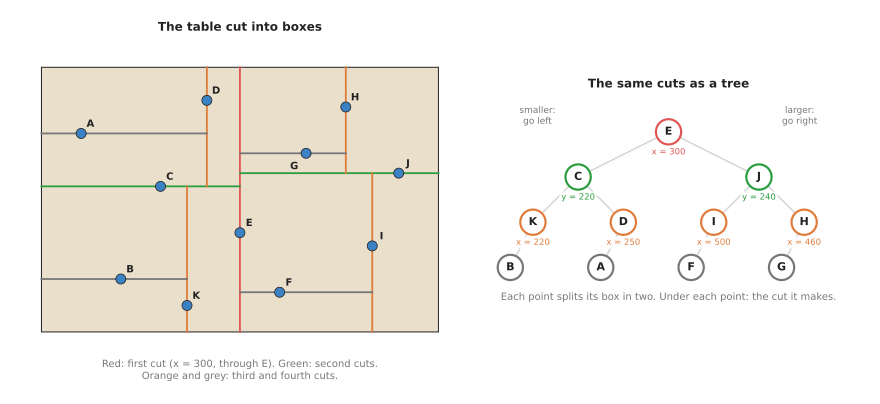
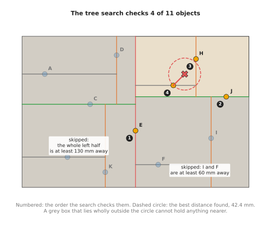
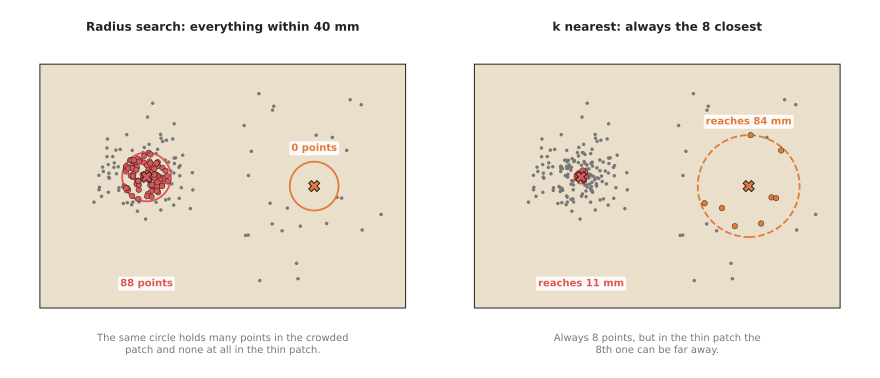

# Nearest-neighbour search

This page explains nearest-neighbour search: given a set of points and one more
point, find the point in the set that is closest to it. It answers four
questions. How do you find the nearest point without measuring the distance to
every point? What is a k-d tree, and how is it built and searched? What are the
k-nearest and radius versions of the search for? And where does a robot arm use
all of this?

It is for a reader who knows what a point and a point cloud are, from Books 1 and
2, and who has read the [chapter overview](01_overview.md). No algorithms course
is needed. Every step is shown with a small example on a table top, with real
numbers from the diagram script `docs/diagrams/searching_and_matching.py`, which
builds and searches a real k-d tree.

Nearest-neighbour search is the most used technique in this chapter. The other
two pages, [iterative closest point](03_iterative-closest-point.md) and
[assignment and matching](04_assignment-and-matching.md), both call it.

## Contents

1. [The idea in one sentence](#1-the-idea-in-one-sentence)
2. [How it works, step by step](#2-how-it-works-step-by-step)
   · [Brute force: measure every distance](#21-brute-force-measure-every-distance)
   · [Building a k-d tree](#22-building-a-k-d-tree)
   · [Searching the tree](#23-searching-the-tree)
   · [The k nearest, and everything within a radius](#24-the-k-nearest-and-everything-within-a-radius)
   · [The pseudocode](#25-the-pseudocode)
3. [Where it is used on a robot arm](#3-where-it-is-used-on-a-robot-arm)
4. [Where it is useful, and where it is not](#4-where-it-is-useful-and-where-it-is-not)
5. [Libraries that provide it](#5-libraries-that-provide-it)
6. [Why a k-d tree, and what it costs](#6-why-a-k-d-tree-and-what-it-costs)
7. [Where to read next](#7-where-to-read-next)

---

## 1. The idea in one sentence

Nearest-neighbour search finds the point in a set that is closest to a given
point, and a k-d tree makes that fast by cutting space into boxes, so that most
boxes can be skipped without looking inside them.

The given point is called the **query**. "Closest" usually means the ordinary
straight-line distance, which is called the **Euclidean distance**. For two
points on a table at (x1, y1) and (x2, y2), it is the square root of
(x1 − x2)² + (y1 − y2)².

Here is an everyday example. You are in a strange town and want the nearest
chemist. You could look up the address of every chemist in the country and work
out how far each one is. Nobody does that. You look only at the part of the map
around you, because a chemist in another town cannot be the nearest one. A k-d
tree lets a computer do the same: it looks only at the parts of space that could
hold the answer.

---

## 2. How it works, step by step

The example on this page is a table 600 mm wide and 400 mm deep, seen from above.
Eleven objects stand on it, named A to K. The gripper tip is above the table at
(430, 300) mm. The question is: which object is nearest to the gripper?

The positions, in millimetres, are these.

| Object | A | B | C | D | E | F | G | H | I | J | K |
|---|---|---|---|---|---|---|---|---|---|---|---|
| x | 60 | 120 | 180 | 250 | 300 | 360 | 400 | 460 | 500 | 540 | 220 |
| y | 300 | 80 | 220 | 350 | 150 | 60 | 270 | 340 | 130 | 240 | 40 |

The example is flat, with two numbers per point, so that it fits on a page. A
point cloud from a depth camera has three numbers per point, x, y and z. Every
step below works the same way in three dimensions.

### 2.1 Brute force: measure every distance

The simplest method measures the distance from the query to every point, and
keeps the smallest. This is called **brute force**, because it uses no
cleverness, only work.

The picture below shows the 11 distances.



Object G, at (400, 270), is nearest. Its distance is the square root of
30² + 30², which is 42.4 mm. H is second at 50.0 mm.

Brute force is always right, and for 11 points it is also fast. It needs one
distance check per point. For one query against n points, that is n checks. The
trouble starts when there are many points and many queries. Matching every point
of one 3,000-point scan to its nearest point in another needs 3,000 × 3,000 =
9,000,000 checks.

### 2.2 Building a k-d tree

A **k-d tree** is a way of storing points so that a search can skip most of
them. The name is short for "k-dimensional tree". The k is the number of
coordinates each point has: 2 on this flat table, 3 for a point cloud.

The tree is built by cutting the space in two, again and again.

1. Sort the points by x. Take the middle one. Draw a line through it, across the
   x direction. Every point with a smaller x goes to the left side; every point
   with a larger x goes to the right side.
2. On each side, sort the points by y. Take the middle one, and cut across the y
   direction through it.
3. Keep going, switching between x and y at each level (x, y, z in 3D), until
   every point has its own cut.

For the table, step 1 sorts the 11 points by x. The middle one of 11 is the sixth,
which is E at x = 300. So the first cut is the line x = 300. A, B, C, D and K go
left. F, G, H, I and J go right.

Step 2 works on each side. On the left, sorted by y, the points are K (40),
B (80), C (220), A (300), D (350). The middle one is C, so the left side is cut at
y = 220. On the right, sorted by y, the points are F (60), I (130), J (240),
G (270), H (340). The middle one is J, so the right side is cut at y = 240.

The third level cuts by x again, and so on. The picture below shows the result:
the table cut into boxes on the left, and the same cuts drawn as a tree on the
right.



Each circle in the tree is one point, and it owns one cut. Its left branch holds
the points on the smaller side of the cut, and its right branch holds the points
on the larger side. E is at the top, because it made the first cut. The tree is
four levels deep.

Building the tree takes some work, because each level sorts the points. But it
is done once. After that, every search uses the same tree.

### 2.3 Searching the tree

The search walks down the tree towards the query, then walks back up, and on the
way back it only looks at a box if that box could hold something nearer than the
best point found so far.

For the gripper at (430, 300), the search goes like this.

1. Check E: 198.5 mm. That is the best so far. The gripper's x is 430, which is
   more than E's 300, so go to the right branch.
2. Check J: 125.3 mm. That is the new best. The gripper's y is 300, more than J's
   240, so go to J's upper branch.
3. Check H: 50.0 mm. New best. The gripper's x is 430, less than H's 460, so go to
   H's left branch.
4. Check G: 42.4 mm. New best. G has no branches, so the walk down is over.

Now the search walks back up and asks, at each cut, whether the other side is
worth a look.

5. At H, the other side is empty.
6. At J, the other side is everything below y = 240. The gripper is at y = 300, so
   anything below that line is at least 300 − 240 = 60 mm away. The best so far
   is 42.4 mm. Nothing on that side can beat it, so I and F are skipped without
   measuring them.
7. At E, the other side is everything left of x = 300. The gripper is at x = 430,
   so anything there is at least 130 mm away. All five points there, A, B, C, D and
   K, are skipped.

The answer is G at 42.4 mm, the same as brute force. The search measured 4
distances instead of 11. The picture below shows the order of the checks, and the
boxes that were skipped.



The dashed circle has the radius of the best distance found. A grey box lies
wholly outside that circle, which is why it cannot hold anything nearer.

The saving grows with the number of points. The diagram script matched every
point of a 3,000-point scan to a second scan and counted the checks: 44,425 with
the tree, about 15 per query, against 9,000,000 by brute force. As a rule of
thumb, a search in a well-balanced tree of n points checks a number of points that
grows like the number of times you can halve n, not like n itself.

### 2.4 The k nearest, and everything within a radius

Two variants of the search are used as often as the plain one.

**k-nearest-neighbour search** returns the k closest points instead of one. The
search is the same, except that it keeps a list of the k best points found so
far, and it skips a box only if the box is further away than the worst of those
k.

**Radius search** returns every point within a set distance of the query, for
example every point within 40 mm. The search skips a box only if the box is
further away than the radius.

The two answer different questions, and the picture below shows the difference
on a cloud that is crowded on the left and thin on the right.



In the crowded patch, a 40 mm radius holds 88 points, and the 8 nearest points
all lie within 10.9 mm. In the thin patch, the same radius holds no points at
all, and the 8 nearest points reach out to 83.6 mm.

So use k nearest when you need a fixed number of points, for example at least a
few points to fit a plane through. Use a radius when the distance itself means
something, for example "points closer than 5 mm belong to the same object". Some
libraries also offer a mix of the two: the k nearest, but none further than a
radius.

### 2.5 The pseudocode

This pseudocode is written in plain steps, not in any real programming language.
"axis" means x at the top level, y at the next, and so on, switching at each
level.

```
build_tree(points, depth):
    if points is empty: return nothing
    axis = depth mod (number of coordinates)
    sort points by their value on axis
    middle = the point in the middle of the sorted list
    node.point = middle
    node.axis  = axis
    node.left  = build_tree(points before middle, depth + 1)
    node.right = build_tree(points after middle,  depth + 1)
    return node

nearest(node, query, best):
    if node is nothing: return best
    d = distance(node.point, query)
    if best is nothing or d < best.distance:
        best = (node.point, d)
    gap = query[node.axis] - node.point[node.axis]
    if gap < 0: near_side = node.left,  far_side = node.right
    else:       near_side = node.right, far_side = node.left
    best = nearest(near_side, query, best)
    if absolute value of gap < best.distance:
        best = nearest(far_side, query, best)     # the far side might hold something nearer
    return best

radius_search(node, query, r, found):
    if node is nothing: return
    if distance(node.point, query) <= r: add node.point to found
    gap = query[node.axis] - node.point[node.axis]
    if gap > -r: radius_search(node.right, query, r, found)   # the larger side is within reach
    if gap <  r: radius_search(node.left,  query, r, found)   # the smaller side is within reach
```

The first call is `nearest(root, query, nothing)`. The one line that makes the
tree fast is the test `absolute value of gap < best.distance`. When it is false,
the whole far side is skipped.

---

## 3. Where it is used on a robot arm

Nearest-neighbour search sits inside many other steps. These are the common
places.

- **The surface direction at each point of a cloud.** To grip a mug, the arm
  needs to know which way its surface faces at the grip point. This direction is
  called the **normal**. The software takes the 20 or 30 nearest points around a
  point, fits a small flat patch through them, and takes the direction straight
  out of the patch. This is done for every point of the cloud, so it needs one
  k-nearest search per point.
- **Growing clusters of points into objects.** After the table plane is removed,
  the points that are left belong to the objects on it. A radius search groups
  every point with the points within, say, 10 mm of it, and those groups with
  their neighbours, until each group is one object. The
  [clustering](../05_image-and-point-cloud-processing/05_clustering.md) page
  covers this, and Book 2 shows it in
  [removing the plane, then clustering](../../02_perception/02_object-perception/03_programmed-methods.md#16-point-clouds-remove-the-plane-then-cluster).
- **Removing stray points.** A depth camera gives some points that float in the
  air, away from any surface. A point whose nearest neighbours are all far away
  is probably one of these, and can be removed.
- **Aligning a model to a scan.** Every round of
  [iterative closest point](03_iterative-closest-point.md) finds, for each model
  point, the nearest scan point.
- **Matching a detection to a known object.** When a camera sees an object and the
  software keeps a list of objects it already knows, the nearest known object is
  the first guess of which one it is. The
  [assignment and matching](04_assignment-and-matching.md) page shows when that
  first guess goes wrong.
- **Choosing the nearest object to pick, or the nearest free spot to place.** A
  robot clearing a table often takes the object nearest to the gripper first,
  to keep each move short. The robot-arm project
  [v5-pick-glasses](https://github.com/RobinNagpal/robot-arm-projects/tree/main/v5-pick-glasses)
  sorts the glasses by their distance from the robot base and picks the nearest
  one first.
- **Looking up a stored answer.** Some programs store many past situations with
  the action that worked, for example a grasp for each of 500 known object
  shapes. For a new object, they describe it with a list of numbers and look up
  the nearest stored one. Here the "points" have many coordinates, not three.
- **Checking a planned path for collisions.** A motion planner asks, for many
  points along the arm, "how far is the nearest obstacle point?". A k-d tree over
  the obstacle cloud answers each of these quickly. The
  [sampling-based planning](../06_planning-and-search/03_sampling-based-planning.md)
  page also uses nearest-neighbour search to find the nearest node already in its
  tree.

---

## 4. Where it is useful, and where it is not

Nearest-neighbour search is exact and fast for points with a few coordinates,
such as 2D positions on a table or 3D points in a cloud. It has limits, and each
limit shows up in a way you can recognise.

The table below lists the common problems. Read each row as: this is what goes
wrong, this is the sign you see, and this is what people use instead.

| Problem | The sign you see | What people use instead |
|---|---|---|
| The nearest point is still far away | a matched point is 50 mm away when the objects are 20 mm apart | a maximum distance: reject any match further than a set limit |
| Many coordinates per point, such as 33 or 128 numbers describing a patch of surface | the tree search is barely faster than brute force | an approximate search, as in FLANN or FAISS, which is allowed to miss the true nearest point now and then |
| The cloud changes every frame | building a new tree each time takes longer than the searches | a voxel grid (the space cut into equal cubes), or brute force on a graphics card |
| Points have very different densities | a fixed radius returns hundreds of points in one place and none in another | k nearest, or the mix of k nearest and a radius |
| x, y and z measure different things, such as position in metres and colour from 0 to 255 | the "nearest" point is decided almost only by the colour | scale each coordinate so that they are comparable before building the tree |
| Only a few points and a few queries | the tree takes longer to build than brute force takes to answer | brute force; it is simpler and fast enough below a few hundred points |

The second row needs a word of explanation. In two or three dimensions, a box that
is far from the query is easy to skip. With 128 coordinates, almost every box is
close to the query along at least one coordinate, so almost none can be skipped.
The tree then checks nearly every point, and its extra work makes it slower than
brute force.

---

## 5. Libraries that provide it

Almost every point cloud and maths library has a k-d tree. You rarely need to
write one. The table below lists well-known ones. The "function or class" column
gives the name to look up in each library's documentation.

| Library | Languages | Function or class | Note |
|---|---|---|---|
| SciPy | Python | `scipy.spatial.KDTree` (`query`, `query_ball_point`) | the easiest start in Python; exact search |
| scikit-learn | Python | `sklearn.neighbors.NearestNeighbors`, `KDTree`, `BallTree` | chooses brute force or a tree for you |
| Open3D | Python, C++ | `open3d.geometry.KDTreeFlann` (`search_knn_vector_3d`, `search_radius_vector_3d`, `search_hybrid_vector_3d`) | the hybrid search is the "k nearest within a radius" mix |
| Point Cloud Library (PCL) | C++ | `pcl::KdTreeFLANN`, `pcl::search::KdTree` | used by PCL's normal estimation and clustering |
| nanoflann | C++ | `KDTreeSingleIndexAdaptor` | a single header file; fast and small; used inside many other libraries |
| FLANN | C++, with Python bindings | `flann::Index` | "Fast Library for Approximate Nearest Neighbors"; exact or approximate |
| FAISS | Python, C++ | `IndexFlatL2` (brute force), `IndexHNSWFlat`, `IndexIVFFlat` | for millions of points with many coordinates; runs on a graphics card |
| OpenCV | Python, C++ | `cv2.BFMatcher`, `cv2.FlannBasedMatcher` | matches image feature descriptors by brute force or by FLANN |

Book 3's [tools and libraries](../../03_frameworks/01_tools-and-libraries.md#9-perception-camera-drivers-opencv-and-open3d)
explains where Open3D and OpenCV fit into a robot arm's software.

---

## 6. Why a k-d tree, and what it costs

This section answers four questions: what the technique is, what it does for you,
why it rather than the obvious alternative, and what it costs.

Nearest-neighbour search finds the closest point in a set to a query point. With a
k-d tree, it does this while measuring only a small fraction of the points. It
lets the software answer "what is next to this point?" hundreds of thousands of
times per camera picture, which is what normals, clustering, cleaning and ICP all
need.

The obvious alternative is brute force: measure every distance. Brute force is
simpler, needs no building step, and is always exact. It is the right choice for a
few hundred points or fewer, or for a single query. The tree wins when there are
many queries against the same set. For 3,000 queries against 3,000 points, the
diagram script's tree needed about 200 times fewer checks. The second alternative
is a voxel grid, which cuts space into equal cubes and looks only in the cube
around the query and its neighbours. A grid is quicker to build and good when the
points are spread evenly. It is poor when the density varies, because the cube
size cannot suit both the crowded and the thin places.

The costs are these. Building the tree takes time, so a tree is worth building
only when it will answer many queries. A tree built on one frame's cloud is out of
date on the next frame, so a live pipeline builds a new tree every frame. The tree
must be rebuilt, not just updated, if many points change. And it helps only for
points with a few coordinates. For long lists of numbers, such as image feature
descriptors, you need an approximate search, and you accept that it will sometimes
return the second-nearest point.

---

## 7. Where to read next

- [Iterative closest point](03_iterative-closest-point.md) uses nearest-neighbour
  search in every round to line a model up with a scan.
- [Assignment and matching](04_assignment-and-matching.md) shows why "take the
  nearest" is not enough when two objects compete for one partner.
- [Clustering](../05_image-and-point-cloud-processing/05_clustering.md) uses
  radius search to group points into objects.
- [Least-squares fitting](../04_fitting-and-estimation/02_least-squares-fitting.md)
  fits the plane through each point's neighbours to get its normal.
- Book 6's [point cloud models](../../06_neural-network-models/03_3d-models/02_point-cloud-models.md)
  shows learned models that are built on the same nearest-neighbour groups.
- Book 2's [tracking and association](../../02_perception/02_object-perception/10_tracking-and-association.md#31-nearest-neighbour-with-a-gate)
  uses nearest neighbour with a gate to match objects over time.
