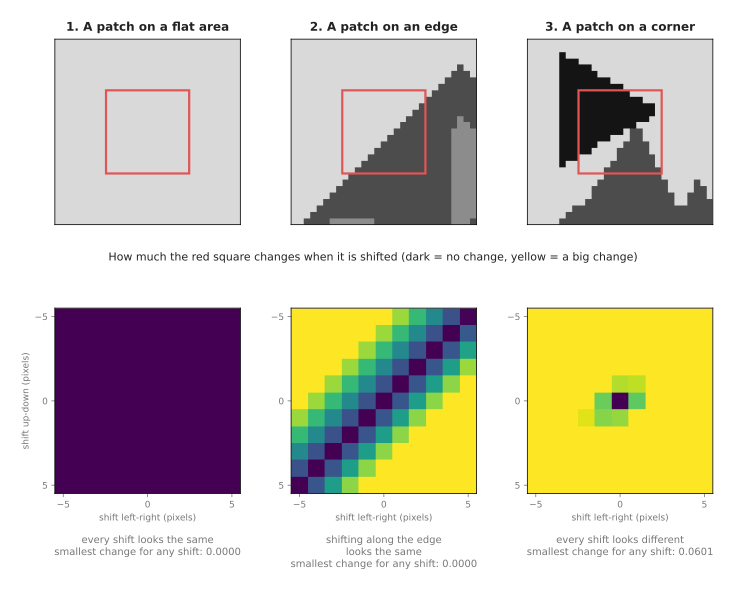
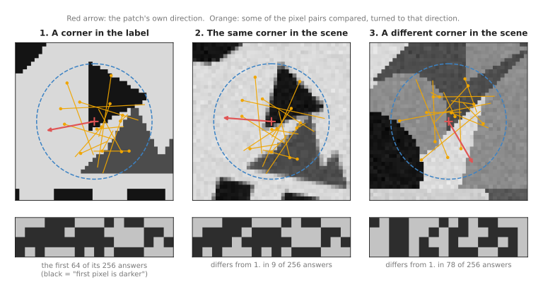
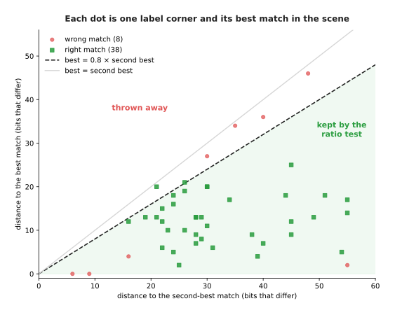
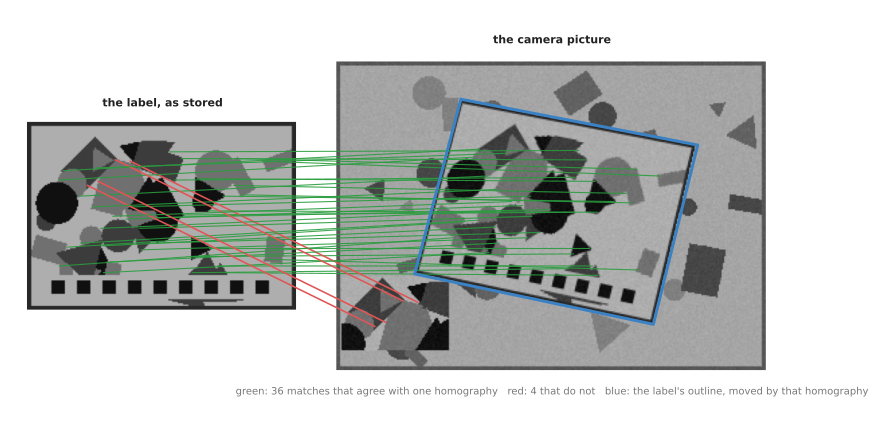

# Image features and matching

This page explains how a program finds the same small spots in two pictures, and
uses them to say where a known flat object is. It answers five questions. Which
spots in a picture are easy to find again? How does a program describe a spot as
a list of numbers? How does it pair each spot in one picture with the right spot in
the other? How does it throw away the pairs that are wrong? And what can a robot
arm do with the pairs that are left?

It is for a reader who knows what a pixel and a grey picture are, and who has read
[nearest-neighbour search](../02_most-used/01_nearest-neighbour-search.md), because
pairing spots is a nearest-neighbour search. It also uses
[RANSAC](../../04_fitting-and-estimation/02_most-used/02_ransac.md), a method that
fits a model when some of the data is wrong. This page explains what it needs from
both.

The work is often called **feature matching**. A **feature**, on this page, is a
small spot in a picture that can be found again, together with a list of numbers
that describes what the picture looks like around it.

## Contents

1. [The idea in one sentence](#1-the-idea-in-one-sentence)
2. [How it works, step by step](#2-how-it-works-step-by-step)
   · [The example: a printed label in a cluttered picture](#21-the-example-a-printed-label-in-a-cluttered-picture)
   · [Step one: find spots that are easy to find again](#22-step-one-find-spots-that-are-easy-to-find-again)
   · [Step two: describe each spot](#23-step-two-describe-each-spot)
   · [Step three: match the descriptions](#24-step-three-match-the-descriptions)
   · [Step four: the ratio test](#25-step-four-the-ratio-test)
   · [Step five: clean up with RANSAC](#26-step-five-clean-up-with-ransac)
   · [The pseudocode](#27-the-pseudocode)
3. [Where it is used on a robot arm](#3-where-it-is-used-on-a-robot-arm)
4. [Where it is useful, and where it is not](#4-where-it-is-useful-and-where-it-is-not)
5. [Libraries that provide it](#5-libraries-that-provide-it)
6. [Why feature matching, and what it costs](#6-why-feature-matching-and-what-it-costs)
7. [The learned alternative](#7-the-learned-alternative)
8. [Where to read next](#8-where-to-read-next)

---

## 1. The idea in one sentence

Feature matching picks out corners in two pictures, describes the little patch
round each corner as a list of numbers, pairs each corner with the corner whose
list is most alike, and keeps only the pairs that agree on one single movement of
the object.

Here is an everyday example. You have a photo of a cereal box, and you want to
find that box on a crowded shop shelf. You do not compare the whole photo with the
whole shelf. You pick out a few distinctive bits of the box, such as the corner of
a letter or the tip of a leaf in the logo. You look for those same bits on the
shelf. Some bits look alike on several boxes, so you ignore those. When several
bits you found sit in the same arrangement as on the photo, you have found the box.
Feature matching does the same, in that order.

---

## 2. How it works, step by step

### 2.1 The example: a printed label in a cluttered picture

The example is a flat printed label, such as the label on a box of parts. The
program has a stored picture of the label, 200 by 140 pixels. The camera then
takes a picture of a cluttered table, 320 by 230 pixels. The label is in it,
turned by about 11°, a little smaller, and tilted, because the camera looks at it
from an angle. There is also a second, smaller sticker in the corner of the
picture that carries part of the same print. That sticker is a trap: its spots
look exactly like spots on the label, but it is not the label.

The program's job is to find the label and say exactly where its four corners are
in the camera picture.

All the numbers on this page come from the diagram script
`docs/diagrams/searching_and_matching_2.py`, which runs every step described here.
Run it with `--numbers` to print them.

### 2.2 Step one: find spots that are easy to find again

Not every spot in a picture can be found again. Think of a small square window
placed on the picture. Now shift the window by a pixel or two and ask how much the
picture inside it changes. The picture below does this for three windows.



The top row shows the three windows, as red squares. The bottom row shows how much
each window's contents change for every shift up to 5 pixels in each direction.
Dark means no change. Yellow means a big change.

- On a **flat area**, nothing changes, whichever way the window moves. The smallest
  change for any shift is 0.0000. A spot there could be anywhere in the flat area.
- On an **edge**, the window changes when it moves across the edge, but not when it
  slides along it. The dark stripe in the middle panel is the direction of the edge.
  The smallest change is again 0.0000. A spot there could be anywhere along the edge.
- On a **corner**, every shift changes the window. The smallest change for any shift
  is 0.0601. A corner can be found again to within a pixel.

So a program looks for corners. The best-known test is the **Harris corner
detector**. It measures, at every pixel, how much the brightness changes in the
direction where it changes most, and in the direction where it changes least. A
pixel is a corner when even the smaller of the two is large. The program then keeps
only the pixel with the highest score in each small neighbourhood, so that one
corner does not give ten spots.

In the example, this finds 46 corners in the label and 161 in the camera picture.
The camera picture has more because it also shows the clutter round the label.

The word **keypoint** is often used for a spot found this way. Other detectors look
for **blobs** instead of corners: small round patches that are darker or brighter
than their surroundings. The idea is the same. A good keypoint is one that moves
with the object and nowhere else.

### 2.3 Step two: describe each spot

A keypoint alone is only a position. To pair it with a keypoint in the other
picture, the program needs to know what the picture looks like round it. So it
turns the patch round each keypoint into a list of numbers, called a
**descriptor**. Two patches that look alike should get lists that are alike.

The example uses the idea inside ORB, the most common fast descriptor. It works
like this.

1. Smooth the picture a little, so that single noisy pixels matter less.
2. Find the patch's own direction. The program takes the "centre of brightness" of
   the round patch and draws an arrow from the keypoint to it. If the object turns,
   this arrow turns with it.
3. Compare pairs of pixels. The program has a fixed list of 256 pairs of positions
   inside the circle. It turns the whole list to the patch's own direction. For each
   pair it asks one question: is the first pixel darker than the second? The answer
   is 1 or 0.
4. The 256 answers, in order, are the descriptor: a string of 256 bits.

The picture below shows this for one keypoint.



The first panel is a corner in the stored label. The second is the same corner in
the camera picture, where the label is turned. Its arrow points 15° further round,
because the label is turned. The pixel pairs turn with the arrow, so they land on
the same parts of the pattern. The answers differ in only 9 of the 256 bits. The
third panel is some other corner in the camera picture. Its answers differ in 78 of
the 256 bits.

The number of bits that differ between two descriptors is called the **Hamming
distance**. It is the distance this kind of descriptor uses. A computer can count
it very fast.

Three descriptors are worth knowing by name. They all do the job described above,
in different ways.

| Descriptor | What it stores | How two are compared | In plain words |
|---|---|---|---|
| ORB (Oriented FAST and Rotated BRIEF, 2011) | 256 bits | Hamming distance | fast; handles turning; handles size change by searching a stack of smaller copies of the picture |
| SIFT (Scale-Invariant Feature Transform, 1999 and 2004) | 128 numbers | ordinary straight-line distance | counts the directions of brightness change in a 4 by 4 grid of small squares round the keypoint; slower, but handles size change, turning and light changes very well |
| AKAZE (Accelerated KAZE, 2013) | a few hundred bits | Hamming distance | finds keypoints in a way that keeps object edges sharp; between ORB and SIFT in speed and quality |

Read the table one row at a time. "Handles size change" means that the same patch
seen from closer or further away still gets a similar descriptor. The example on
this page only uses one picture size, because the label is only a little smaller
in the camera picture.

### 2.4 Step three: match the descriptions

Now the program pairs up keypoints. For each keypoint in the label, it finds the
keypoint in the camera picture whose descriptor is closest. This is a
[nearest-neighbour search](../02_most-used/01_nearest-neighbour-search.md), but in
the space of descriptors, not in the space of positions. With a few hundred
keypoints, the program simply measures every pair. With tens of thousands, it uses
an approximate search.

In the example, 38 of the 46 label keypoints get a right partner. A pair is counted
as right when the partner is within 3 pixels of where the label corner really is.
The diagram script knows where that is, because it made the camera picture. The
other 8 pairs are wrong.

### 2.5 Step four: the ratio test

Some wrong pairs can be spotted without knowing the answer. If a keypoint's best
partner is only a little better than its second-best partner, the program cannot
really tell the two apart. This happens on repeated patterns, such as the row of
identical squares along the bottom of the label.

The **ratio test**, from David Lowe's 2004 SIFT paper, uses this. It keeps a pair
only when

    distance to the best partner < 0.8 × distance to the second-best partner

The number 0.8 is the one Lowe suggested. The picture below shows the test on every
label keypoint.



Each dot is one label keypoint. It sits right by the distance to its second-best
partner, and up by the distance to its best partner. Dots below the dashed line pass
the test. In the corner-shaped patch from step two, the best partner differs in 9
bits and the second-best in 28, so the ratio is 0.32, and the pair is kept.

The table below counts what happened to the 46 pairs. Read each row as one kind of
pair, and the columns as what the ratio test did with it.

| Pair | Kept | Thrown away |
|---|---|---|
| right | 36 | 2 |
| wrong | 4 | 4 |

The ratio test threw away half of the wrong pairs and lost only 2 right ones. But 4
wrong pairs passed it easily. They are the dots in the bottom left corner of the
picture, and two of them have a distance of 0. All four point at the second sticker.
The sticker carries the same print, so these pairs look perfect. No test on one pair
at a time can catch them.

### 2.6 Step five: clean up with RANSAC

The last step uses the fact that the right pairs agree with each other. The label
is flat. When a flat object is seen by a camera, every point on it moves from the
stored picture to the camera picture by one and the same rule, called a
**homography**. A homography is a 3 × 3 table of numbers that maps the points of
one flat surface to the points of another, including the effect of looking at it
from an angle. It can be computed from four pairs of points.
[Calibration](../../02_geometry-and-cameras/02_most-used/03_calibration.md) uses
the same kind of mapping for its flat checkerboard.

The wrong pairs do not agree with the homography of the right pairs. So the program
uses [RANSAC](../../04_fitting-and-estimation/02_most-used/02_ransac.md), which
stands for random sample consensus. It repeats these steps many times.

1. Pick four pairs at random.
2. Compute the homography that fits those four exactly.
3. Move every label keypoint by that homography, and count how many land within 3
   pixels of their partner. These pairs are the **inliers**.
4. Remember the homography with the most inliers.

At the end it computes the homography again from all the inliers of the best try.
The picture below shows the result.



Of the 40 pairs left after the ratio test, 36 agree with one homography, and RANSAC
found it on its 18th try. The 4 red pairs, which point at the second sticker, are
thrown away. The blue outline is the label's edge, moved by the final homography.
Each of its four corners is within 0.75 pixels of where the label corner really is.

With 36 inliers out of 40, nine pairs in ten are right. The
[RANSAC page](../../04_fitting-and-estimation/02_most-used/02_ransac.md#how-many-tries-are-enough)
gives the rule for how many tries are enough. For four pairs at a time and nine in
ten right, 5 tries give a 99% chance of one clean try. The script ran 1,000 tries,
which is far more than needed. Real programs stop early once they find a good
answer.

### 2.7 The pseudocode

This pseudocode is written in plain steps, not in any real programming language.

```
find_flat_object(stored_picture, camera_picture):
    # step one and two: keypoints and descriptors, in both pictures
    keys_a, desc_a = detect_and_describe(stored_picture)
    keys_b, desc_b = detect_and_describe(camera_picture)

    # step three and four: match, then the ratio test
    pairs = empty list
    for each i in keys_a:
        best, second = the two descriptors in desc_b closest to desc_a[i]
        if distance(desc_a[i], best) < 0.8 * distance(desc_a[i], second):
            add (keys_a[i], position of best) to pairs
    if number of pairs < 4: return "not found"

    # step five: RANSAC
    best_inliers = empty
    repeat many times:
        four = 4 pairs chosen at random from pairs
        H = homography that maps the four exactly
        inliers = pairs where distance(H applied to a, b) < 3 pixels
        if inliers has more pairs than best_inliers:
            best_inliers = inliers
    if number of best_inliers < a minimum, such as 10: return "not found"
    H = homography fitted to all of best_inliers
    return H

detect_and_describe(picture):
    score = corner score of every pixel              # Harris, or FAST
    keys = pixels whose score is the highest in their neighbourhood
    for each key in keys:
        direction = direction from key to the centre of brightness of its patch
        desc[key] = for each of the 256 pixel pairs, turned to direction:
                        1 if first pixel is darker than second, else 0
    return keys, desc
```

The minimum number of inliers matters. RANSAC always returns its best try, even when
the object is not in the picture at all. A few random pairs can agree by chance. A
rule such as "at least 10 inliers" turns that into a clear "not found".

---

## 3. Where it is used on a robot arm

Feature matching is used wherever the arm has to find a known object that has
printing or texture on it, from a camera picture alone.

- **Finding a textured part or package.** A box of screws, a bag of coffee or a book
  has printing on it. The program stores one picture of each face. Feature matching
  finds the face in the camera picture, even when it is turned, partly hidden by
  other objects, or seen from an angle.
- **The pose of a flat object from a homography.** When the object is flat, or has a
  flat face, the homography says where every point of that face is in the picture.
  With the camera's lens numbers from the
  [pinhole camera model](../../02_geometry-and-cameras/02_most-used/01_pinhole-camera-model.md),
  the homography can be turned into the face's position and turn in 3D. This works
  for a sheet of paper, a label, a circuit board or the lid of a box.
- **Feeding pose from points.** When the object is not flat, the program stores a 3D
  model whose surface points each carry a descriptor. Feature matching pairs those
  points with keypoints in the camera picture. Those 3D-to-2D pairs are exactly what
  [pose from points](../../02_geometry-and-cameras/02_most-used/04_pose-from-points.md)
  (the perspective-n-point problem, or PnP) needs to compute the object's 3D pose.
  RANSAC is again used to throw away wrong pairs.
- **A first guess for ICP.** A pose from feature matching is often a few millimetres
  off. [Iterative closest point](../02_most-used/02_iterative-closest-point.md) on a
  depth scan can finish it off, because the feature pose is a good first guess.
- **Following the camera's own movement.** A camera on the wrist sees the table from
  a slightly different place in each picture. Matching keypoints from one picture to
  the next says how the camera moved. This is the core of visual odometry, and of the
  wider method in
  [multi-view geometry](../../02_geometry-and-cameras/03_also-used/01_multi-view-geometry.md).
- **Keeping track of objects.** Book 2's
  [tracking and association](../../../02_perception/02_object-perception/10_tracking-and-association.md)
  uses keypoint descriptors such as ORB to tell apart two objects that sit close
  together, when position alone cannot.

---

## 4. Where it is useful, and where it is not

Feature matching is reliable on objects with plenty of printing or texture, seen from
roughly the angles in the stored picture. It fails when there is nothing to find, or
too much that looks the same.

The table below lists the common problems. Read each row as: what goes wrong, the
sign you see, and what people use instead.

| Problem | The sign you see | What people use instead |
|---|---|---|
| The object has no texture, such as plain grey plastic or a painted metal part | only a handful of keypoints on the object, and RANSAC finds too few inliers | a depth scan and [ICP](../02_most-used/02_iterative-closest-point.md), the object's outline from [edges and contours](../../05_image-and-point-cloud-processing/03_also-used/01_edges-and-contours.md), or a learned pose model |
| A shiny surface | keypoints on reflections, which move when the camera moves, so the inliers change from frame to frame | light from another angle, a polarising filter, or a depth camera |
| A repeated pattern, such as a grid, a barcode or woven fabric | the ratio test throws away most pairs | match on the parts of the object that do not repeat; add a printed marker |
| Two copies of the same object, or of the same print | RANSAC locks onto one copy, and may switch between them from frame to frame | find one copy, remove its inliers, and run RANSAC again to find the next |
| A large change in viewing angle, more than roughly 40° to 60° of tilt from the stored picture | few pairs pass the ratio test, although the object is in plain sight | store pictures of the object from several angles, or use a learned matcher |
| Motion blur, from a moving arm or camera | corners smear out and are not found | take the picture when the arm is still; shorten the camera's exposure time |
| The object is not flat, but a homography is fitted | RANSAC finds only the inliers on one face | fit a pose with PnP from a 3D model instead of a homography |

When nothing on the object can be relied on, people often stick a printed marker on
it, such as an ArUco or AprilTag marker. A marker is a black and white square designed
to be found and identified without any matching step.

---

## 5. Libraries that provide it

The table below lists well-known libraries. The "functions or classes" column gives
the names to look up in each library's documentation.

| Library | Languages | Functions or classes | Note |
|---|---|---|---|
| OpenCV | C++, Python | `cv2.ORB_create`, `cv2.SIFT_create`, `cv2.AKAZE_create`; `cv2.BFMatcher` and its `knnMatch` for the two nearest partners; `cv2.findHomography` with `cv2.RANSAC`; `cv2.solvePnPRansac` | the usual choice; SIFT has been in the main package since version 4.4, after its patent ran out in 2020 |
| scikit-image | Python | `skimage.feature.corner_harris`, `skimage.feature.ORB`, `skimage.feature.SIFT`, `skimage.feature.match_descriptors` (its `max_ratio` argument is the ratio test), `skimage.measure.ransac` | easy to read and step through; slower than OpenCV |
| Kornia | Python (PyTorch) | `kornia.feature.LoFTR`, `kornia.feature.LightGlue` | learned matchers, run on a graphics processor |
| LightGlue | Python (PyTorch) | the `lightglue` package, with `SuperPoint` and `LightGlue` classes | the authors' own code for SuperPoint plus LightGlue |

For a first try on a robot arm, OpenCV's ORB with a brute-force Hamming matcher, the
ratio test and `cv2.findHomography` is a few lines of code and runs on an ordinary
processor.

---

## 6. Why feature matching, and what it costs

This section answers four questions: what the technique is, what it does for you,
why it rather than the obvious alternative, and what it costs.

Feature matching finds small distinctive spots in two pictures, describes them as
lists of numbers, pairs them, and keeps the pairs that agree on one movement. It
tells you where a known textured object is in a picture, and, with a flat face or a
3D model, where it is in 3D. It needs no training data: one picture of the object is
enough.

The obvious alternative is **template matching**: slide the whole stored picture over
the camera picture, pixel by pixel, and keep the place where the two look most alike.
It is simple and works well when the object is always the same way up and the same
size, such as a part in a fixed tray. It fails as soon as the object is turned,
tilted, nearer or further away, or partly covered. Each of those needs its own set of
slides, and a partly covered object never looks like the stored picture. Feature
matching handles all of these, because it only needs some of the spots to be
visible, and each spot is described in a way that survives turning.

The costs are these. The object must have texture or printing. Wrong pairs are
normal, so RANSAC and a minimum inlier count are always needed. The thresholds, such
as the ratio 0.8, the 3-pixel limit and the minimum number of inliers, need tuning
for each camera and object. And the result is a pose in the picture. To get a pose
in the arm's frame, you also need the camera's lens numbers and its
[calibration](../../02_geometry-and-cameras/02_most-used/03_calibration.md) to the
arm.

---

## 7. The learned alternative

Since about 2018, neural networks have been trained to do steps one to four.
SuperPoint finds and describes keypoints in one network, SuperGlue and the later
LightGlue, from 2023, pair the keypoints of two pictures by looking at all of them
together, and LoFTR skips keypoints and matches the two pictures directly. They find
many more right pairs on hard pictures, such as large changes of angle, poor light
and little texture, and RANSAC is still used after them. But they need a graphics
processor to run at camera rate and a large set of model weights, and it is harder
to see what went wrong when they fail. Book 6's
[keypoints and object pose](../../../06_learned-models/03_seeing-models/02_most-used/04_keypoints-and-object-pose.md)
describes networks that find an object's named points and its pose directly, and
[tracking and motion](../../../06_learned-models/03_seeing-models/03_also-used/03_tracking-and-motion.md)
describes point trackers that follow spots from picture to picture. A classical
matcher is still the better first choice when the object has good texture and the
camera angle does not change much, because it needs no training and one stored
picture is enough.

---

## 8. Where to read next

- [RANSAC](../../04_fitting-and-estimation/02_most-used/02_ransac.md) explains the
  clean-up step in more depth, including how many tries are enough.
- [Pose from points](../../02_geometry-and-cameras/02_most-used/04_pose-from-points.md)
  turns matched 3D model points and picture points into a 3D pose.
- [Multi-view geometry](../../02_geometry-and-cameras/03_also-used/01_multi-view-geometry.md)
  uses matched keypoints from two pictures to work out how the camera moved and how
  far away things are.
- [Iterative closest point](../02_most-used/02_iterative-closest-point.md) does the
  same job on depth scans, and its section on
  [getting a first guess](../02_most-used/02_iterative-closest-point.md#5-getting-a-first-guess-3d-features-and-global-registration)
  uses 3D features in the same way that this page uses picture features.
- [The chapter overview](../01_overview.md) shows how this page fits with the others.
