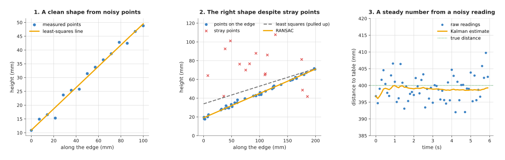
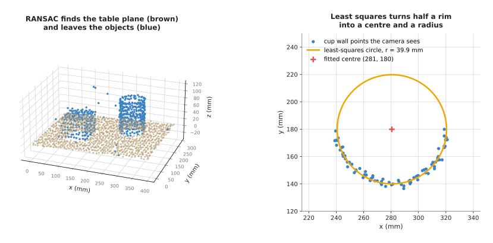

# Fitting and estimation: an overview

This chapter is about getting a clean shape or a steady number out of noisy
measurements. Every sensor on a robot arm gives readings that are a little
wrong. A depth camera's points scatter a millimetre or two either side of the
real surface. A detector's box jumps by a few pixels from one picture to the
next. A force sensor's reading shakes even when nothing touches it. The
techniques in this chapter take many such readings and give back one answer
that is better than any single reading.

This page is for a reader who knows what a point cloud, a camera frame and a
joint angle are, as Books 1 and 2 explain, but who has not met these techniques
before. It says what the chapter's five technique pages cover, which question
each one answers for an arm, how they compare, and how they connect to the rest
of this book and to the learned models in Book 6.

## Contents

1. [What fitting and estimation are for](#1-what-fitting-and-estimation-are-for)
2. [The question they answer for an arm](#2-the-question-they-answer-for-an-arm)
3. [The techniques, in two groups](#3-the-techniques-in-two-groups)
4. [How they compare](#4-how-they-compare)
5. [How this chapter connects to the others](#5-how-this-chapter-connects-to-the-others)
6. [Where to read next](#6-where-to-read-next)

---

## 1. What fitting and estimation are for

**Fitting** means choosing the shape that best matches a set of measured
points. The shape is described by a few numbers. A line has a slope and an
offset. A plane has a direction it faces and a distance from the origin. A
circle has a centre and a radius. Fitting finds the values of those numbers
that put the shape as close as possible to all the points at once.

**Estimation** means working out a number you cannot measure directly, or cannot
measure without noise, from the readings you do have. The position of a part on
a moving belt is an example. The camera gives a slightly wrong position in every
picture, and sometimes no position at all. Estimation combines the pictures over
time into one position that is steadier than any single picture.

The two ideas overlap. Fitting a line to points is an estimate of the line's
slope and offset. The difference is mostly in how the data arrives. Fitting
usually takes a batch of points measured at one moment. Estimation over time
takes one reading after another, and updates its answer as each one arrives.

An everyday example shows the core idea. Suppose you weigh a bag of flour five
times on a kitchen scale and get 1003 g, 998 g, 1001 g, 997 g and 1002 g. You
would not trust any one reading. You would take the average, 1000.2 g. That
average is the simplest possible fit: the single number closest to all five
readings. Every technique in this chapter is a more careful version of that
average.

The picture below shows three of the jobs this chapter covers, on made-up but
realistic data.

On the left, a least-squares line passes through the middle of 15 noisy points.
In the middle, a random sample consensus (RANSAC) line follows the real edge,
while a least-squares line through the same points is pulled upwards by the
stray points. On the right, a Kalman filter turns a depth reading that shakes by
about 4 mm into an estimate that stays within a millimetre or so of the true
400 mm.

---

## 2. The question they answer for an arm

The question is: **given these noisy readings, what is really there, and how
sure can I be?**

An arm needs clean numbers because it acts on them. A gripper that closes 3 mm
to the side of a glass knocks it over. A camera that believes the table is 2°
tilted when it is level puts every object at the wrong height. The arm cannot
wait for a perfect sensor. It has to make the best of the readings it has.

Here are typical places on an arm where the question comes up:

- Finding the table in a depth camera's point cloud, so that everything that is
  not table can be treated as an object.
- Measuring the centre and radius of a cup or a glass from the part of its rim
  the camera can see.
- Finding which way the flat face of a box points, so the gripper can line up
  with it.
- Following a part on a conveyor belt, so the arm can meet it at the right
  place, even when the arm's own body hides it from the camera for a moment.
- Smoothing a force or depth reading before a controller acts on it, and
  pairing it in time with the camera frame it belongs to.
- Measuring the numbers in the arm's own physics, such as a joint's friction or
  the mass of the part in the gripper, from how the arm responds to a planned
  move.
- Working out a calibration, such as where the camera sits on the arm, from
  many pairs of measurements. The
  [calibration](../02_geometry-and-cameras/02_most-used/03_calibration.md) page covers that
  case.

The picture below shows two of these jobs on one simulated table scene.

On the left, RANSAC finds the table plane among 1669 points from a depth camera
(brown) and leaves 549 points on a box, a cup and a few stray readings (blue).
On the right, a least-squares circle fitted to the 79 cup-wall points that face
the camera gives a centre within 1 mm of the true one and a radius of 39.9 mm
for a cup that is 40 mm in radius.

---

## 3. The techniques, in two groups

The chapter has five technique pages. Each one answers a slightly different
version of the question above. They are split into two groups. The **most used**
group holds the four techniques that nearly every arm with a camera or a sensor
runs, often on every frame. The **also used** group holds a technique that
matters a great deal when it is needed, but that an arm runs less often: when it
is set up, when it picks up a new part, or while it warms up.

The most used group, in `02_most-used/`:

- [Least-squares fitting](02_most-used/01_least-squares-fitting.md) finds the line, plane
  or circle that is closest to all the points, where "closest" means the sum of
  the squared distances is as small as possible. It is fast, exact and has no
  settings to tune. It assumes every point belongs to the shape.
- [RANSAC](02_most-used/02_ransac.md), short for random sample consensus, finds the shape
  that the largest number of points agree with. It tries many shapes, each
  through a few randomly chosen points, and keeps the one with the most points
  close to it. It copes with data where a third or even half of the points
  belong to something else.
- The [Kalman filter](02_most-used/03_kalman-filter.md) keeps a running estimate of a
  changing quantity, such as the position and speed of a moving part. At each
  new reading it first predicts where the quantity should be, then corrects
  the prediction with the reading. It also keeps track of how sure it is. Its
  section 4 covers the extended and unscented Kalman filters and the particle
  filter, for motions and measurements that are not straight-line
  relationships, such as angles.
- [Sensor streams](02_most-used/04_sensor-streams.md) covers the timing and
  filtering of sensor data before any of the other techniques sees it: pairing
  readings from two sensors that were taken at nearly the same time, allowing
  for the delay between a measurement and its arrival, smoothing with low-pass
  and median filters, working out how fast a reading is changing, and switching
  on a threshold without flickering, using two limits (called hysteresis).

The also used group, in `03_also-used/`:

- [System identification](03_also-used/01_system-identification.md) measures the
  numbers inside a physical model of the arm, such as a joint's friction, a
  payload's mass or a finger's stiffness. It plans a probe move that makes each
  number show up, fits the numbers by least squares, follows numbers that drift
  with recursive least squares, and states an error bar for each one, so the arm
  can act on the cautious end of the range.

The techniques are often used together. A typical table-top pipeline first
lines up each depth picture with the arm's joint readings from the same moment,
as the sensor streams page explains. It then runs RANSAC to find which points
belong to the table, then least squares on just those points to get the most
accurate plane. Later, a Kalman filter smooths the position of each object from
picture to picture. System identification sits underneath all of this: it gives
the controller the friction and payload numbers it needs to move the arm
accurately.

---

## 4. How they compare

The table below compares the five techniques. Read each row as one property,
and each column as one technique. The first four columns are the most used
group; the last is the also used group.

| Property | Least squares | RANSAC | Kalman filter | Sensor streams | System identification |
| --- | --- | --- | --- | --- | --- |
| What goes in | a batch of points | a batch of points, some of them wrong | one reading at a time, over time | raw readings from several sensors, each with a time stamp | readings recorded during a planned probe move, or during normal work |
| What comes out | the numbers of a shape, and how far the points sit from it | the numbers of a shape, and which points agree with it | the current value, and how uncertain it is | readings lined up in time, smoothed, with slopes and on/off decisions | the numbers in a physical model, each with an error bar |
| Copes with stray points | no; one bad point pulls the answer | yes, up to about half the points or more | only if a gate throws them away first | a median filter removes single spikes | no, unless large residuals are thrown away |
| Settings to choose | none | a distance limit and a number of tries | how noisy the sensor is, and how much the quantity can change | how far apart two readings may be in time, filter strengths, threshold limits | the probe move; for drifting numbers, a forgetting factor |
| Same answer every run | yes | no, it uses random choices | yes (the particle filter uses random choices) | yes | yes |
| Speed | very fast, one direct calculation | slower, many tries | very fast per reading; a particle filter is slower | very fast per reading | fast to fit; the probe move takes time on the arm |
| Typical arm use | plane, line and circle measurement; calibration | finding the table; shapes in cluttered clouds | tracking a moving part; smoothing a sensor | pairing a camera frame with joint angles; detecting contact from a force reading | joint friction; payload mass; a finger's stiffness |

---

## 5. How this chapter connects to the others

Fitting and estimation sit between the raw sensor and the decisions the arm
makes. The chapter uses ideas from earlier chapters and feeds results to later
ones.

- From [geometry and cameras](../02_geometry-and-cameras/01_overview.md) it
  takes the step that turns pixels and depths into 3D points. Every fit in this
  chapter starts from points that the
  [pinhole camera model](../02_geometry-and-cameras/02_most-used/01_pinhole-camera-model.md)
  produced.
- From [searching and matching](../03_searching-and-matching/01_overview.md) it
  takes the nearest points around each point, which is how a surface's direction
  is found at each point. [Iterative closest
  point](../03_searching-and-matching/02_most-used/02_iterative-closest-point.md) runs a
  least-squares fit inside every one of its steps. A Kalman filter's prediction
  is what [assignment and
  matching](../03_searching-and-matching/02_most-used/03_assignment-and-matching.md) compares
  new detections against.
- It hands the points left over after the table is removed to
  [clustering](../05_image-and-point-cloud-processing/02_most-used/03_clustering.md), which
  splits them into objects.
- In [planning and search](../06_planning-and-search/01_overview.md), numerical
  inverse kinematics solves a least-squares problem at every step. The page on
  [numerical inverse
  kinematics](../06_planning-and-search/02_most-used/02_numerical-inverse-kinematics.md)
  explains this.
- In [control and motion](../07_control-and-motion/01_overview.md), a
  controller such as [PID](../07_control-and-motion/02_most-used/01_pid-control.md) often
  acts on a filtered reading rather than the raw one. The equations of
  [arm dynamics](../07_control-and-motion/02_most-used/03_arm-dynamics.md)
  contain the masses and friction numbers that
  [system identification](03_also-used/01_system-identification.md) measures.

Book 6 covers learned models that do some of the same jobs. A
[point cloud model](../../06_learned-models/04_3d-models/02_most-used/01_point-cloud-models.md)
can label which points are table and which are object. A
[keypoint and pose model](../../06_learned-models/03_seeing-models/02_most-used/04_keypoints-and-object-pose.md)
can give an object's position and direction directly from a picture. A learned
tracker, described in
[tracking and motion](../../06_learned-models/03_seeing-models/03_also-used/03_tracking-and-motion.md),
can follow objects that a constant-speed model cannot. The written techniques in
this chapter need no training data, give the same answer for the same input
(apart from RANSAC's random choices), and state how far off they might be. The
learned models handle shapes and movements that are hard to write down as a few
numbers. Many arms use both: a model finds the object, and a fit measures it.

Even the learned models rest on this chapter. Training a neural network means
making the sum of its squared errors, or a similar number, as small as possible,
which is the same idea as least squares. The page
[how a model learns](../../06_learned-models/01_what-models-are/02_how-a-model-learns.md)
explains that.

---

## 6. Where to read next

- Start with [least-squares fitting](02_most-used/01_least-squares-fitting.md). The other
  pages build on it.
- Then read [RANSAC](02_most-used/02_ransac.md), which makes fitting safe when some points
  are wrong.
- Then read the [Kalman filter](02_most-used/03_kalman-filter.md), which moves from one
  batch of points to readings that arrive over time.
- Then read [sensor streams](02_most-used/04_sensor-streams.md), which prepares
  readings in time before any fit or filter uses them.
- Read [system identification](03_also-used/01_system-identification.md) when the
  arm needs the numbers of its own physics, such as friction or a payload's mass.
- The [map of techniques](../01_what-techniques-are/04_the-map-of-techniques.md)
  shows where this chapter sits among the seven categories in this book.
- [The building blocks](../01_what-techniques-are/02_the-building-blocks.md)
  explains noise and uncertainty, which this whole chapter is about.
- Book 2 shows these techniques at work on real perception tasks in
  [methods you write yourself](../../02_perception/02_object-perception/03_programmed-methods.md)
  and [tracking and
  association](../../02_perception/02_object-perception/10_tracking-and-association.md).
