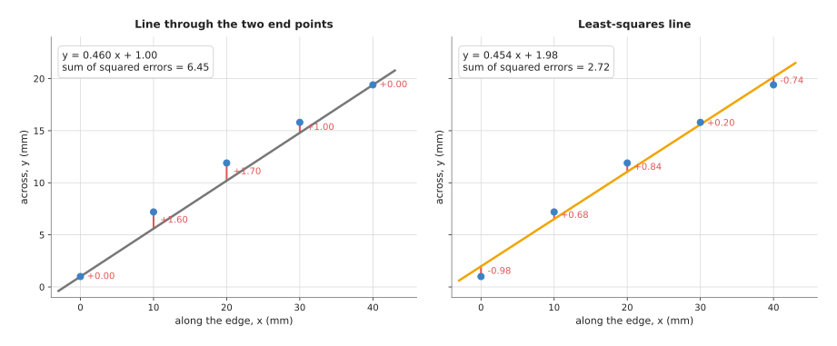
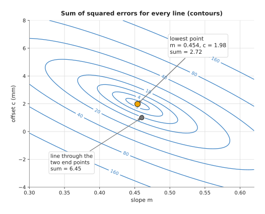
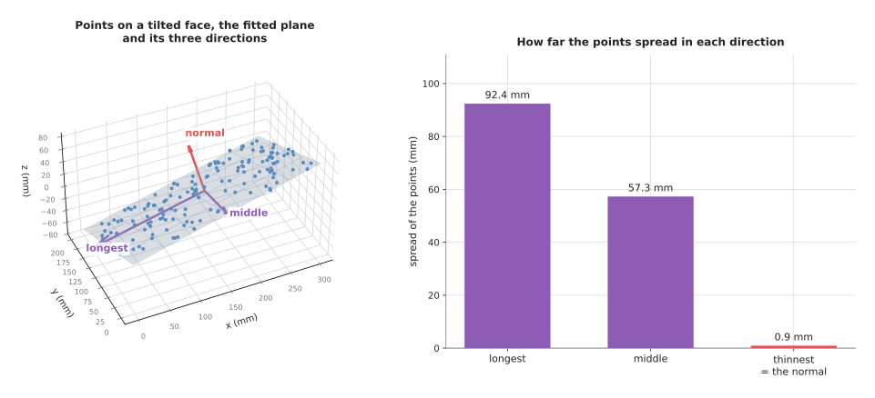
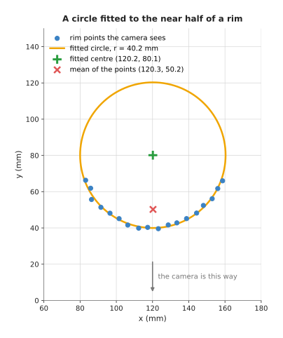

# Least-squares fitting

This page explains least-squares fitting: the standard way to find the line,
plane or circle that best matches a set of measured points. It answers four
questions. What does "best" mean? How is the best shape found, by hand and by a
program? Where does a robot arm use it? And when does it give a wrong answer?

It is for a reader who knows what a point cloud and a coordinate frame are, and
who has read the [overview](../01_overview.md) of this chapter. You do not need
any linear algebra beyond knowing that a matrix is a table of numbers. Every
number on this page comes from a real run of the diagram script,
`docs/diagrams/fitting_and_estimation.py`.

Least squares is the most used fitting technique in robotics. It sits inside
plane finding, circle measurement, camera calibration, point cloud alignment and
numerical inverse kinematics. It is worth understanding well, because most of
the other techniques in this chapter are built on top of it.

## Contents

1. [What this page answers](#1-what-this-page-answers)
2. [The idea in one sentence](#2-the-idea-in-one-sentence)
3. [How it works, step by step](#3-how-it-works-step-by-step)
   · [Residuals and the sum of squares](#residuals-and-the-sum-of-squares)
   · [A worked example: a line through five points](#a-worked-example-a-line-through-five-points)
   · [The steps as pseudocode](#the-steps-as-pseudocode)
   · [Planes: the singular value decomposition](#planes-the-singular-value-decomposition)
   · [Circles: a trick that keeps it simple](#circles-a-trick-that-keeps-it-simple)
   · [The leftover error tells you how good the fit is](#the-leftover-error-tells-you-how-good-the-fit-is)
4. [Where it is used on a robot arm](#4-where-it-is-used-on-a-robot-arm)
5. [Where it is useful, and where it is not](#5-where-it-is-useful-and-where-it-is-not)
6. [Libraries that provide it](#6-libraries-that-provide-it)
7. [Why least squares, and what it costs](#7-why-least-squares-and-what-it-costs)
8. [The learned alternative](#8-the-learned-alternative)
9. [Where to read next](#9-where-to-read-next)

---

## 1. What this page answers

A camera or a depth sensor never gives points that lie exactly on a shape. The
points along a straight box edge wobble a little to either side. The points on a
flat table sit a millimetre or so above and below the real surface. Yet the arm
needs one straight edge, one flat table, one circle with one centre.

Least-squares fitting turns the wobbly points into that one shape. The shape is
described by a few numbers, called its **parameters**. A line in a picture has
two: its slope and its offset. A plane has three. A circle on a table has three:
the two coordinates of its centre and its radius. Fitting means choosing the
parameters.

This page shows how least squares chooses them for lines, planes and circles.
It shows how to check the result. And it shows where the method breaks, which is
the reason the next page, on [RANSAC](02_ransac.md), exists.

---

## 2. The idea in one sentence

**Choose the shape that makes the sum of the squared distances from the points
to the shape as small as possible.**

Here is an everyday example. You hang a picture rail along a wall, and mark
five heights where you want the screws. Your marks are a little uneven. You do
not want the rail to pass exactly through any two marks and miss the other
three badly. You want it to pass as close as possible to all five at once. If
you measure how far each mark is from the rail, square those five distances, and
add them up, the best rail is the one where that total is smallest.

Squaring does two things. It makes every distance count as positive, so a mark
above the rail cannot cancel out a mark below it. And it makes a large miss
count much more than a small one: a 2 mm miss counts four times as much as a
1 mm miss. The result is a shape that runs through the middle of the points.

---

## 3. How it works, step by step

### Residuals and the sum of squares

Take one point and one candidate line. The **residual** is how far the point is
from the line. For a line written as `y = m x + c`, the usual residual is the
vertical gap: the point's measured `y`, minus the `y` the line gives at that
point's `x`. Here `m` is the slope, how much `y` rises for each 1 of `x`, and
`c` is the offset, the value of `y` where `x` is 0.

Square every residual and add them up. The total is the **sum of squared
errors**. Each candidate line has its own sum. Least squares picks the line
with the smallest sum.

The picture below shows five points along the edge of a box, found by a camera,
in millimetres. On the left is the line through the first and last points. On
the right is the least-squares line. The red bars are the residuals.



The line through the two end points has zero error at those two points and
large errors at the three in between, which adds up to 6.45. The least-squares
line misses every point by a little and adds up to 2.72, the smallest total any
straight line can reach for these points.

### A worked example: a line through five points

These are the five points in the picture, in millimetres.

| x | 0 | 10 | 20 | 30 | 40 |
| --- | --- | --- | --- | --- | --- |
| y | 1.0 | 7.2 | 11.9 | 15.8 | 19.4 |

Think of every possible line as one point on a map, with the slope `m` on one
axis and the offset `c` on the other. Give each point on that map the sum of
squared errors of its line. The result is a bowl: high at the edges and lowest
at one place. The picture below draws the bowl as contour lines, like the height
lines on a hiking map.



Each ring joins lines with the same total error. The orange dot at the centre is
the least-squares line. The grey dot is the line through the two end points,
which sits outside the ring marked 6.

At the bottom of a bowl the ground is flat in every direction. So the best line
is the one where a small change to `m` does not change the total, and a small
change to `c` does not change it either. Writing those two conditions out gives
two ordinary equations, called the **normal equations**. For a line they are:

```
(sum of x·x) · m  +  (sum of x) · c  =  sum of x·y
(sum of x)   · m  +  (number of points) · c  =  sum of y
```

For the five points the sums are:

- sum of x·x = 0 + 100 + 400 + 900 + 1600 = 3000
- sum of x = 100
- sum of x·y = 0 + 72 + 238 + 474 + 776 = 1560
- sum of y = 55.3
- number of points = 5

So the two equations are:

```
3000 m + 100 c = 1560
 100 m +   5 c = 55.3
```

Multiply the second by 20 and subtract it from the first: `1000 m = 454`, so
`m = 0.454`. Put that back into the second: `5 c = 55.3 − 45.4 = 9.9`, so
`c = 1.98`. The best line is `y = 0.454 x + 1.98`.

The residuals are −0.98, +0.68, +0.84, +0.20 and −0.74 mm. Their squares add
up to 2.72. The typical distance of a point from the line, called the **root
mean square (RMS) residual**, is the square root of 2.72 divided by 5, which is
0.74 mm. The RMS residual is a useful single number for how well a fit went.

For a shape with more parameters the same thing happens. There is one normal
equation per parameter, and a computer solves them all at once. In matrix form
the equations are written `AᵀA p = Aᵀb`, where each row of `A` holds one point's
values, `b` holds the measured values and `p` holds the parameters. You do not
need to solve these by hand. Every numerical library has a function for it.

### The steps as pseudocode

The steps below fit any shape whose error is a straight sum of parameters
times known values, which covers lines, planes written as `z = a x + b y + c`,
polynomials and the circle trick later on this page.

```
function fit_least_squares(points):
    A = empty table with one row per point
    b = empty list with one value per point
    for each point in points:
        add a row to A: the values that multiply each parameter
                        (for a line y = m x + c: [x, 1])
        add to b: the measured value (for a line: y)
    # the normal equations: (A-transpose times A) p = A-transpose times b
    p = solve (transpose(A) · A) p = transpose(A) · b
    residuals = b − A · p
    rms = square root of (sum of residuals squared / number of points)
    return p, rms
```

In practice a library solves the problem with a method called QR or the
singular value decomposition instead of forming `AᵀA` directly. The answer is
the same, but those methods lose fewer decimal places when the numbers are
large or nearly repeat.

### Planes: the singular value decomposition

A table, a wall or the face of a box is a plane. You could fit it as
`z = a x + b y + c`, with vertical residuals as for the line. That works for a
table seen from above. It fails for a wall, because a wall is nearly vertical,
and a vertical plane cannot be written as "z equals something". The vertical
gaps also measure the wrong thing on a steep surface.

The better way measures each point's distance at right angles to the plane,
and uses a tool called the **singular value decomposition (SVD)**. In plain
words the SVD does this:

1. Take the average of all the points. That is the **centre**, and the plane
   passes through it.
2. Subtract the centre from every point, so the points sit around the origin.
3. The SVD finds the three directions in which the points spread out, one at
   right angles to the next, and how far they spread in each: the longest
   spread, the middle one and the thinnest one.
4. For points on a flat surface, the thinnest direction points straight out of
   the surface. It is the plane's **normal**: the direction the plane faces.
5. The plane is "all points whose offset from the centre is at right angles to
   the normal".

The thinnest direction is exactly the one that makes the sum of squared
right-angle distances smallest, so this is a least-squares fit too. The
picture below shows it for 150 points on the tilted face of a board.



The points spread 92.4 mm along the longest direction, 57.3 mm along the middle
one and only 0.93 mm along the thinnest, which is the normal. The fitted normal
is (−0.230, 0.321, 0.919). The true face used to make the points has the normal
(−0.230, 0.322, 0.919), so the fit agrees to three decimal places. The spread of
0.93 mm along the normal is also the RMS distance of the points from the plane:
the noise that was added was 1 mm.

The spread numbers carry a free check. If the thinnest spread is not much
smaller than the middle one, the points do not lie on a plane at all. They might
lie on a curved surface, or across two surfaces. A program should test this
before it trusts the normal.

The same three directions, computed for the points of one object, give its
long axis and its thin axis. That is how a program finds which way a box or a
pen lies. The NumPy page in Book 1 shows this in
[which way an object lies](../../../01_robotics-intro/01_python-and-numpy/02_numpy-intro.md#67-which-way-an-object-lies-cov-and-eigh).

### Circles: a trick that keeps it simple

Cups, glasses, bottle caps and holes are round. Seen from above, their rim is a
circle with a centre `(a, b)` and a radius `r`. The natural error is each
point's distance from the circle, but that error does not make a straight sum of
parameters, so the normal equations do not apply directly.

A short piece of algebra fixes this. A point `(x, y)` on the circle satisfies
`(x − a)² + (y − b)² = r²`. Multiply it out and move terms around:

```
x² + y²  =  2a · x  +  2b · y  +  k        where k = r² − a² − b²
```

Now the unknowns `a`, `b` and `k` appear only multiplied by known values `2x`,
`2y` and `1`. That is the same shape of problem as the line, with three
parameters instead of two. Solve it with the pseudocode above, then recover the
radius as `r = square root of (k + a² + b²)`. This is called the **algebraic
circle fit**, or the Kåsa fit after the person who described it.

The picture below shows why it matters. A camera looking at a glass from the
front sees only the near half of its rim.



The 18 rim points were made from a circle with its centre at (120, 80) mm and a
radius of 40 mm, with 0.6 mm of noise. The fit gives a centre of (120.2, 80.1)
and a radius of 40.2 mm. The plain average of the points is (120.3, 50.2),
30 mm towards the camera, because all the points are on the near side. A
gripper sent to the average would hit the front of the glass.

The algebraic fit has one known weakness. When the points cover only a short arc,
say less than a quarter of the circle, it tends to give a radius that is too
small. A second step, which minimises the true distances with a few rounds of
nonlinear least squares, corrects this. The next section on the leftover error
says how to spot the problem.

### The leftover error tells you how good the fit is

Least squares always returns an answer. It returns a line even for points that
lie on a curve, and a plane even for points on two surfaces. The only sign that
the shape is wrong is the leftover error.

So a careful program always returns the RMS residual with the fit, and compares
it with the sensor's known noise. If a depth camera is good to about 1 mm and a
plane fit leaves an RMS residual of 0.9 mm, the plane is real. If it leaves 3 mm,
something else is in the points: an object on the table, the edge of the table,
or a second surface. Book 2 makes the same point in
[report the margin, not the verdict](../../../02_perception/02_object-perception/07_making-it-work.md#7-report-the-margin-not-the-verdict).

---

## 4. Where it is used on a robot arm

Least squares appears across perception, calibration, sensing and movement.

- **Finding the table's height and tilt.** After [RANSAC](02_ransac.md) picks
  the points that belong to the table, an SVD plane fit on those points gives
  the most accurate plane. Every object's height is then measured from it.
- **Measuring a round object.** A program fits a circle to the rim of a cup or
  glass, as above, to find where to aim the gripper. The glass-picking project in
  the sibling repo does exactly this in
  [`detect.py`](https://github.com/RobinNagpal/robot-arm-projects/blob/main/v5-pick-glasses/src/work_cell/work_cell/glasses/detect.py),
  with the same `x² + y² = 2ax + 2by + k` trick.
- **Finding which way a face points.** Before a wrist turns a board to lie flat,
  it must know the direction of the board's face. The
  [turn-top-flat project](https://github.com/RobinNagpal/robot-arm-projects/blob/main/v3-turn-top-flat/docs/turn-by-wrist/01-look-and-measure.md)
  fits the face with the SVD, then refits with only the points within 6 mm,
  then 3 mm, then 2 mm, to drop the points from a neighbouring edge.
- **Finding a straight edge in a picture.** Edge pixels along a box side or a
  tray wall are fitted with a line, to give its angle for the gripper. The
  [edges and contours](../../05_image-and-point-cloud-processing/03_also-used/01_edges-and-contours.md)
  page shows where these pixels come from.
- **Correcting a sensor.** Plot a distance sensor's readings against known true
  distances and fit a line. The slope and offset give the correction. Book 1
  shows this in
  [solving and fitting](../../../01_robotics-intro/01_python-and-numpy/02_numpy-intro.md#65-solving-and-fitting).
- **Calibration.** Camera calibration fits the camera's focal length and lens
  distortion to many checkerboard corners. Hand-eye calibration fits where the
  camera sits on the arm from many arm poses. Both are least-squares problems;
  the [calibration](../../02_geometry-and-cameras/02_most-used/03_calibration.md) page explains
  them.
- **Aligning two point clouds.** Each step of
  [iterative closest point](../../03_searching-and-matching/02_most-used/02_iterative-closest-point.md)
  finds the rotation and shift that best line up matched pairs of points, in the
  least-squares sense, using the SVD.
- **Moving the arm to a pose.** Numerical inverse kinematics repeatedly solves a
  small least-squares problem for how much to turn each joint. The page on
  [numerical inverse kinematics](../../06_planning-and-search/02_most-used/02_numerical-inverse-kinematics.md)
  calls this damped least squares.
- **Learning a contact constant.** A robot that pushes objects can fit the
  friction of the table from many pushes, one equation per push. The
  [contact-parameters page](https://github.com/RobinNagpal/robot-arm-projects/blob/main/v5-pick-glasses/docs/problem-3/solutions/09-identify-the-contact-parameters.md)
  in the sibling repo does this, and moves on to recursive least squares, which
  updates the fit one push at a time.

---

## 5. Where it is useful, and where it is not

Least squares is the right choice when every point belongs to the shape, the
noise is small and spread evenly, and you know the shape in advance. It is
exact, fast and needs no settings.

Its big weakness is stray points. Because errors are squared, one point far from
the rest pulls the answer hard. In the worked example above, change the last
point from 19.4 to 29.4, as a depth camera might report for a single bad pixel.
The fitted slope jumps from 0.454 to 0.654, and the offset from 1.98 to −0.02.
One bad point out of five has moved the whole line.

The table below lists the common ways least squares goes wrong. Read each row
as a cause, the sign you would see, and what people use instead.

| What goes wrong | The sign you would see | What to use instead |
| --- | --- | --- |
| Some points belong to something else (an object on the table, a stray reading) | RMS residual much larger than the sensor's noise; the shape is tilted towards the stray points | [RANSAC](02_ransac.md) to pick the good points first, or a robust loss that counts large errors less |
| Two surfaces in the same points | the thinnest SVD spread is not much smaller than the middle one | split the points first with [clustering](../../05_image-and-point-cloud-processing/02_most-used/03_clustering.md) or RANSAC |
| The shape is wrong (a curve fitted with a line, an oval with a circle) | the residuals are not random: they are positive in the middle and negative at the ends | fit the right shape, or a polynomial of higher degree |
| A circle fit to a short arc | the radius comes out too small; the centre moves a lot when one point changes | a geometric fit with nonlinear least squares, or a known radius |
| Points cover a very small area | two parameters trade against each other; the fit changes a lot with the noise | measure over a wider area, or fix one parameter from other knowledge |
| Some points are more accurate than others (a depth camera is worse far away) | residuals are larger at one end | weighted least squares, which gives each point a weight |
| The errors are not a straight sum of parameters (distances to a circle, a camera's projection) | the simple solve gives a biased answer | nonlinear least squares, such as the Gauss-Newton or Levenberg-Marquardt method, which repeat a linear fit and improve the guess each time |

---

## 6. Libraries that provide it

You rarely write the solve yourself. The table below lists well-known libraries.
Each row gives the library, the languages it is used from, the function or class
and a note.

| Library | Languages | Function or class | Note |
| --- | --- | --- | --- |
| NumPy | Python | `numpy.linalg.lstsq`, `numpy.polyfit`, `numpy.linalg.svd` | the first thing to reach for; `svd` for planes |
| SciPy | Python | `scipy.optimize.least_squares`, `scipy.optimize.curve_fit` | nonlinear least squares, with robust losses such as `soft_l1` and `huber` |
| OpenCV | C++, Python | `cv::fitLine`, `cv::fitEllipse`, `cv::solve` | line and ellipse fits on image points; `fitLine` also has robust distance options |
| Eigen | C++ | `JacobiSVD`, `BDCSVD`, `ColPivHouseholderQR` | the matrix library under most C++ robotics code |
| Open3D | Python, C++ | `PointCloud.estimate_normals` | fits a small plane around every point to get its normal |
| PCL (Point Cloud Library) | C++ | `pcl::NormalEstimation`, `pcl::SACSegmentation` | normals by local plane fit; model fitting with a least-squares refinement |
| Ceres Solver | C++ | `ceres::Problem`, `ceres::Solve` | large nonlinear least-squares problems, such as calibration |
| scikit-learn | Python | `sklearn.linear_model.LinearRegression` | the same line and plane fit, with a machine-learning style interface |

A plane fit with NumPy is three lines: subtract the mean, call `svd`, take the
last row of the result as the normal. The circle trick is one call to `lstsq`.

---

## 7. Why least squares, and what it costs

Least squares is a way to choose a shape's parameters so that the sum of the
squared distances from the points to the shape is as small as possible. It
gives the arm clean numbers, such as a table height, a cup centre or an edge
angle, from noisy points, together with a measure of how well the shape fits.

The obvious alternative is to use only a few special points: the two end points
of an edge, the highest and lowest points of a surface, or the middle of a
bounding box around a rim. That takes no maths at all. But it throws away most
of the data, and it lets the noise on those few points decide the answer. The
worked example shows the difference: the end-point line has more than twice the
total error of the least-squares line. The glass example shows a worse case:
the average of the points is 30 mm off, while the fit is 0.2 mm off. Least
squares uses every point, so the noise averages out.

The second alternative is to minimise something other than squared distances,
for example the plain sum of distances. That resists stray points better, but it
has no direct solution. It needs repeated steps, which are slower and can stop
at the wrong answer. Squared distances are chosen because they give a direct,
exact solution in one step.

The costs are these. You must know which shape to fit before you start. Every
point must belong to that shape, because one stray point can move the answer a
long way. And the answer always looks confident, so you must check the leftover
error yourself. When stray points are likely, add [RANSAC](02_ransac.md) in
front of the fit.

---

## 8. The learned alternative

Fitting a known shape, such as a table plane or a cup's rim, has no learned
replacement, because the shape's formula is known and least squares gives its best
fit exactly, in one step. Learning takes over when nobody knows the shape in
advance. Book 6's
[classical machine learning](../../../06_neural-network-models/01_what-models-are/06_classical-machine-learning.md)
page shows that linear regression is least squares itself. It also shows that a
**Gaussian process**, a method that gives an error bar with each prediction, or a
small neural network can learn a curve that nobody wrote down, such as a depth
camera's error against distance. With a few input numbers and tens to hundreds of
examples, the classical methods do as well as the network or better. A network
pulls ahead only when the input is a picture, a point cloud or a long recording, and
there are many examples.

---

## 9. Where to read next

- The next page is [RANSAC](02_ransac.md). It finds which points belong to the
  shape, so that least squares can then fit only those.
- The [Kalman filter](03_kalman-filter.md) applies the same idea to readings
  that arrive one at a time.
- [Iterative closest point](../../03_searching-and-matching/02_most-used/02_iterative-closest-point.md)
  uses an SVD least-squares fit inside each step to line up two point clouds.
- [Numerical inverse kinematics](../../06_planning-and-search/02_most-used/02_numerical-inverse-kinematics.md)
  uses damped least squares to move the arm to a pose.
- [How a model learns](../../../06_neural-network-models/01_what-models-are/02_how-a-model-learns.md)
  in Book 6 shows that training a network is the same idea: make the total
  error as small as possible, over millions of parameters instead of three.
- Book 2's [methods you write yourself](../../../02_perception/02_object-perception/03_programmed-methods.md#22-the-plane-the-object-stands-on)
  shows how a fitted table plane is used to measure objects standing on it.
